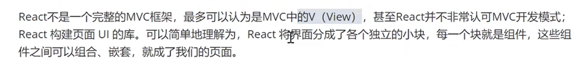
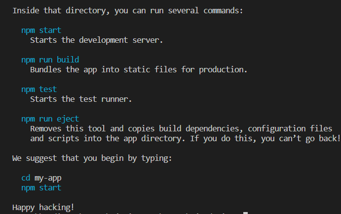
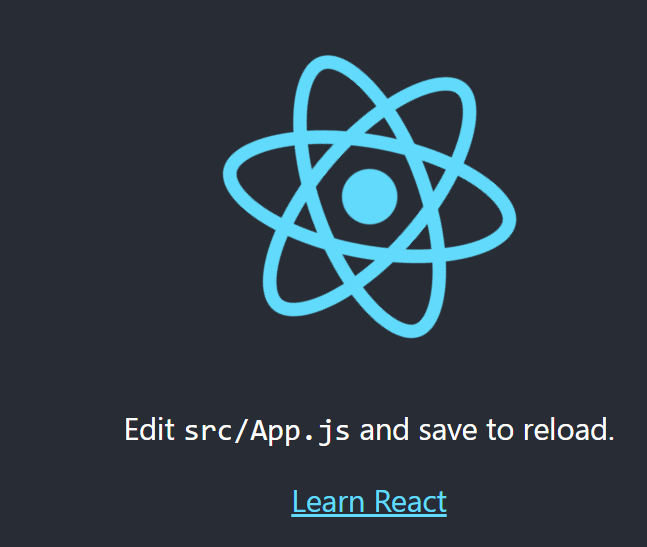
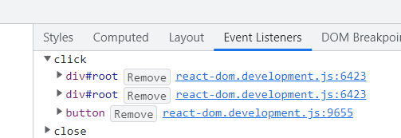
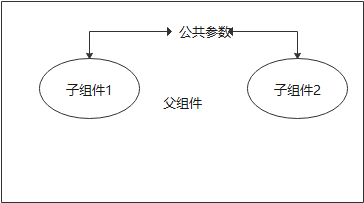
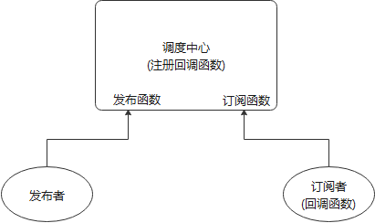
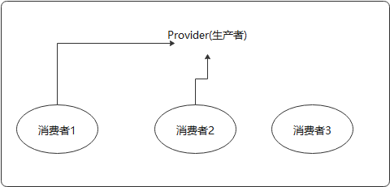

[Toc]

# 环境说明

1. 前端开发工具:VS-CODE
2. NODEJS版本：v18.8.0

# React简介

轻量级的视图层库。A JavaScript library for building user interfaces 



## 特性

1．声明式设计—React采用声明范式，可以轻松描述应用。

2．高效—React通过对DOM的模拟（虚拟dom），最大限度地减少与DOM的交互。

3．灵活 —React可以与已知的库或框架很好地配合。

4．JSX - JSX 是 JavaScript 语法的扩展。

5．组件—通过React构建组件，使得代码更加容易得到复用，能够很好的应用在大项目的开发中。

6．单向响应的数据流—React实现了单向响应的数据流，从而减少了重复代码，这也是它为什么比传统数据绑定更简单。


# 安装脚手架`create-react-app`&创建项目

1. 确保你安装了较新版本的 [Node.js](https://nodejs.org/en/)。
2. 安装react脚手架

## 1. 安装 create-react-app

```
### 全局安装:可以在任意地方使用create-react-app创建项目，缺点是如果需要更新版本，需要重新全局安装
D:\huadi_workspace\zj-view-workspace\zj-td-view> npm install -g create-react-app

### 临时安装：安装的是当前最新版本的create-react-app；使用以下命令会同时创建项目your-app
D:\huadi_workspace\zj-view-workspace\zj-td-view> npx create-react-app your-app

### 查看react版本
D:\huadi_workspace\zj-view-workspace\zj-td-view> create-react-app -V
5.0.1
```

## 2. 创建一个项目

```
D:\huadi_workspace\zj-view-workspace\zj-td-view> create-react-app my-app   注意命名方式
```

这需要等待一段时间，这个过程实际上会安装三个东西

- react：react的顶级库

- react-dom：因为react有很多的运行环境，比如app端的react-native，我们要在web上运行就使用react-dom 
- react—scripts：包含运行和打包react应用程序的所有脚本及配置


- **若出现以下信息表示创建成功**



## 3. 启动项目

> 进入创建的项目目录下，使用`npm start`启动项目，启动成功后会自动打开浏览器

```
D:\huadi_workspace\zj-view-workspace\zj-td-view\my-app> npm start
```



## 4. 基础项目目录结构

```
|——README.md   使用方法的文档
|——node_modules	所有的依赖安装的目录
|——package-1ock.json   锁定安装时的包的版本号，保证团队的依赖能保证一致。
|——package.json  项目所需要的各种模块，以及项目的配置信息（比如名称、版本、许可证等元数据）。npm install命令根据这个配置文					 件，自动下载所需的模块，也就是配置项目所需的运行和开发环境。
|——public   静态公共目录
|——src   开发用的源代码目录
```

## 5. 常见问题

- **npm安装失败** 

> - 切换为npm镜像为淘宝镜像
>
> - 使用yarn，如果本来使用yarn还要失败，还得把yarn的源切换到国内
>
> - 如果还没有办法解决，请删除`node＿modules`及package-lock.json然后重新执行`npm install`命令 。再不能解决就删除`node＿modules`及`package-lock.json`的同时清除npm缓存`npm cache clean--force `之后再执行`npm install`命令

- **安装`nrm`镜像管理工具**

> `nrm`专门管理镜像的一个工具
>
> - **安装**
>
> ```
> npm -i nrm
> 
> ### 查看nrm版本
> nrm -V
> ### 查看当前所有镜像
> nrm -ls
> ### 使用指定镜像
> nrm use taobao  指定使用taobao镜像
> ```

## 6. 开发辅助插件

### `ES7 React/Redux/GraphQL/React-Native snippets`

> **自动提示React错误信息插件**

- **快捷方式**

> 1. 快速创建类组件,在js文档中输入`rcc`

# 编写第一个React应用

1. 创建新项目`create-react-app my-app`
2. 删除掉新项目中 `src/` 文件夹下的所有文件。**不要删除整个 `src` 文件夹，删除里面的源文件**。
3. 在`src`目录下创建入口文件——`index.js`

>  react开发需要引入多个依赖文件：react.js、react-dom.js,分别又有开发版本和生产版本，create-react-app里 已经帮我们把这些东西都安装好了。把通过CRA创建的工程目录下的src目录清空，然后在里面重新创建一个 index.js.写入以下代码：
>
> ```
> //从react的包当中引AJ/ React。只要你要写React, js组件就必须引入React,因为react里有一种语法叫 jsx,稍后会讲到jsx,要写jsx,就必须引入React
> import React from  'react'
> // ReactDOM可以帮助我们把React组件洎染到页面上去，没有其它的作用了。它是从react-dom中引入的，而 不是从react引入。
> import ReactDOM from 'react-dom'
> // ReactDOM里有一个render方法，功能就是把组件渲染并且构造DOM树，然后插入到页面上某个特定的元素上 
> ReactDOM.render(
> //这里就比较奇怪了，它并不是一个字符串，看起来像是纯HTML代码写在Javascript代码里面。语法错误吗？这 并不是合法的JavaScript代码，
> //"在JavaScript写的标签的”语法叫JSX- JavaScript XML。
> <hl>欢迎进入React的世界</hl>,
> //渲染到哪里
> document.getElementById('root')
> )
> ```
>
> 上述写法原始React写法为
>
> ```
> ReactDOM.render(React.createElement("div",{
>     id:"aaa",
>     class:"ddd"
> } ,"111111111"),document. getElementById("root"))
> ```


# JSX语法

- **简介**

> jsx <=> js + xml
>
> 所谓的JSX其实就是JavaScript对象，所以使用React和JSX的时候一定要经过编译的过程：
>  JSX —>使用react构造组件，bable进行编译 一＞ JavaScript对象 一>`ReactDOM. render()`—＞DOM元素一＞
>  插入页面 

> 1. JSX在组件html标签中，`{}`中可进行逻辑运算以及使用表达式；

## 组件的创建

> 1. 创建组件需继承`React.Component`类，否则为普通类，无法自动渲染组件，使定义的组件可以以标签形式`<myApp></myApp> 或 <myApp/>`使用；
> 2. 组件导入时，定义的组件名首字母必须大写，否则浏览器会报错，提示无法识别为React组件；
> 3. 组件`render()`返回的HTML，必须有一个父标签，包裹其他html标签，否则会报错；
> 4. `return`回车换行返回数据时，应使用以下格式,在`return `后加`()`,`()`中可以随意使用回车换行，若不使用括号，在`return`后使用回车换行会返回`undefined`
>
>    ```
> render(){ 
>       return (
>         <div>Hello React Component</div>
>       )
>     }
>    ```
>
> 

### 类(Class)组件

> ES6的加入让JavaScript直接支持使用class来定义一个类，react创建组件的方式就是使用的类的继承，ES6 class是目前官方推荐的使用方式，它使用了ES6标准语法来构建。  `class`组件其实就是一个构造器，每次使用组件都相当于在实例化组件。

1. **定义一个类(Class)组件**

```
import React from "react";
// App 类名可自定义
class App extends React.Component{
  render(){  //render 函数为固定函数
      return <div>Hello React Component</div>
  }
}

export default App  //导出类
```

2. **使用定义的类组件**:在`index.js`使用自定义的类组件

```
import React from  'react'
import ReactDOM from 'react-dom'
//引入组件js；App组件名可以随意定义，不需和组件名定义一致，一致的定义只是为了和谐统一
import App from "./0-base/1-class组件"

ReactDOM.render(
<App></App>,
document.getElementById('root')
)
```

### 函数组件

> - 在React 16.8版本之前，函数式组件为无状态组件；在16.8之后，引入了React Hooks组件，函数组件变为有状态组件

1. **函数式组件定义**

```
function App(){
    return (
        <div>function  Component</div>
    )
}
// 在React 16.8版本之前，函数式组件为无状态组件；在16.8之后，引入了React Hooks组件，函数组件变为有状态组件
export default App
```

2. **函数式组件应用**

```
import React from  'react'
import ReactDOM from 'react-dom'
//引入组件js；App组件名可以随意定义，不需和组件名定义一致，一致的定义只是为了和谐统一
import App from "./0-base/1-class组件"

ReactDOM.render(
<App></App>,
document.getElementById('root')
)
```

### 组件嵌套

> 1. 组件的嵌套，分清组件的父子关系，若有祖孙情况,一般子组件都放在父组件里，而不是在祖辈组件里定义；

- **嵌套组件定义**

> - 父组件:`APP`
> - 子组件：`Navbar,Swiper,Toorbar`

```
import React, { Component } from 'react'

class Navbar extends Component{
    render() {
      return <div>Navbar</div>
    }
}

function Swiper(){
    return <div>Swiper</div>
}

// ES6函数写法
const Toorbar = ()=>{
    return <div>Toorbar</div> 
}
// ES6函数写法
const Toorbar2 = ()=><div>Toorbar2</div> 

export default class App extends Component {
  render() {
    return (
      <div>
        <Navbar></Navbar>
        <Swiper></Swiper>
        <Toorbar></Toorbar>
        <Toorbar2></Toorbar2>
      </div>
    )
  }
}

```

### 组件的样式

> 1. `css`样式属性名，若有`-`需改成驼峰写法；
> 2. `css`样式定义中，若碰上与`js`关键字重合的，最好改写成对应的名称
>    `class => className  for =>htmlFor`
>
> 3. 在组件的html标签上直接引用变量或者进行逻辑运算，需使用`{}`;否则会被解析为字符串；
> 4. 直接在行内定义样式时，需使用`{{}} 如：<p style={{color:'red',fontSize:'14px'}}>Hello World</p>`；第一个`{}`表示要在JSX里插入JS了，第二个`{}`表示为对象;
> 5. 注释写法`return({/* 多行注释，单行注释，都需使用在{}中，表示为JS注释*/})`;VSCODE快捷键`Ctrl+C`

####   行内样式

> - **直接引用**
>
> 想给虚拟dom添加行内样式，需要使用表达式传入样式对象的方式来实现：
>
> ```
>  //注意这里的两个括号，第一个表示我们在要JSX里插入JS了，第二个是对象的括号
> <p style={{color:'red',fontSize:'14px'}}>Hello World</p>
> ```
>
> 行内样式需要写入一个样式对象，而这个样式对象的位置可以放在很多地方，例如render函数里、组件原型上、 外链js文件中
>
> - **先定义表达式的写法**
>
> ```
> //定义样式表达式
> var obj={
>       backgroundColor:"yellow", //此处 不能使用backgroun-color,需改成驼峰写法
>       fontSize:"30px"
>     }
>     
> //行业引用样式
> <div style={obj}>{10+20} + "哈哈哈"  </div>
> ```

####   使用class

>  **React推荐我们使用行内样式，因为React觉得每一个组件都是一个独立的整体**
>  其实我们大多数情况下还是大量的在为元素添加类名，但是需要注意的是，class需要写成className (因为毕 竟是在写类js代码，会受到js规则的限制，而`class`是关键字)
>
> ```
>  <p className="hello">Hello world</p>
> ```
>
> 注意：
>    class ==> className, for ==> htmlFor(label)

- **范例**

```
import React, { Component } from 'react'
import './css/0-index.css' //导入css模块，这种导入方式是基于webpack的支持；webpack会自动将样式以内部样式<style></style>的方式，引入到页面中

export default class APP extends Component {
  render() {
    var name="aaa"
    //在{} 可进行逻辑运算，以及使用表达式
    var obj={
      backgroundColor:"yellow", //此处 不能使用backgroun-color,需改成驼峰写法
      fontSize:"30px"
    }
    return (
      <div>
        <div style={obj}>{10+20} + {name}   </div>
        <br/>
        <div style={{backgroundColor:"red"}}>{10>20?"aaa":"bbb"}</div>

        <div className='active'>Haha</div>

         {/* 使用for使点击用户名后，自动聚焦输入框：需使用htmlFor，避免和js关键字冲突 */}
        <label htmlFor='usename'>用户名</label>
        <input type="text" id='usename'/>
      </div>
    )
  }
}

```

- **定义`0-index.css`文件**

```
.active {
    background-color: blue;
}
```

## 事件处理

### **事件函数定义方式**

```
import React, { Component } from 'react'

export default class App extends Component {
  render() {
    return (
      <div>
        {/*事件绑定写法1:直接在html标签上定义函数*/}
        <input/>
        <button onClick={()=>{
            console.log("click1；如果处理内容过多，不适合");
        }}>Add1</button>
         {/*事件绑定写法2:在组件类中定义对应的函数，然后再绑定在标签上。
         注意：此处引用函数，不需加(),否则会导致组件在一被初始化就调用该函数，而不是点击后调用该函数 会涉及到this指向问题*/}
        <button onClick={this.handleClick2}>Add2</button>

         {/*事件绑定写法3:使用ES6箭头函数定义click操作对应函数；会涉及到this指向问题*/}
        <button onClick={this.handleClick3}>Add3</button>

         {/*事件绑定写法4:使用ES6箭头函数,在箭头函数里调用指定的click函数*/}
         <button onClick={()=>{
             this.handleClick4();//当逻辑比较复杂，推荐使用
         }}>Add4</button>
      </div>
    )
  }

  handleClick2(){
      console.log("click2");
  }

  handleClick3  = ()=>{
      console.log("click3");
  }

  handleClick4  = ()=>{
    console.log("click4");
}
}

```

### `this`指向问题

> 在js中，`this`是谁调用指向谁，但有三种方式改变`this`执行
>
> - `call`:改变`this`指向，自动执行函数
> - `apply`:改变`this`指向，自动执行函数
> - `bind`:改变`this`指向，手动执行函数

- **范例**

```
var obj1 = {
  name:"obj1",
  getName(){
    console.log(this.name);
  }
}

var obj2 = {
  name:"obj2",
  getName(){
    console.log(this.name);
  }
}
//obj1.getName();

obj1.getName.call(obj2);  //打印结果:obj2 ;将对象obj1的this指向改为obj2，会自动执行函数getName
obj1.getName.apply(obj2); //打印结果:obj2 ； 将对象obj1的this指向改为obj2，会自动执行函数getName
obj1.getName.bind(obj2)();//打印结果:obj2,将对象obj1的this指向改为obj2，需加(),才会执行函数getName()
```

- **范例**

```
import React, { Component } from 'react'

export default class App extends Component {
  a = 100;
  render() {
    return (
      <div>
        {/*在此处this指向的是当前类的实例*/}
        <input/>
        <button onClick={()=>{
            console.log("click1；如果处理内容过多，不适合==="+this.a);
        }}>Add1</button>
         {/*使用bind改变this指向,此处this执行App实例；不推荐该函数写法，需要手动改变this指向*/}
        <button onClick={this.handleClick2.bind(this)}>Add2</button>

         {/*事件绑定写法3:使用ES6箭头函数定义click操作对应函数；比较推荐该种写法*/}
        <button onClick={this.handleClick3}>Add3</button>

         {/*比较推荐，传参的时候比较适用*/}
         <button onClick={()=>{
             this.handleClick4();
         }}>Add4</button>
      </div>
    )
  }

  handleClick2(){
      console.log("click2"+this.a);//若不使用bind改变this指向，此时this为undefined会报错
  }

  handleClick3  = (evt)=>{
      console.log("click3"+this.a);//在箭头函数中，this始终指向最外层调用对象；无法使用函数如call等改变this执行
      console.log(evt.target);
  }

  handleClick4  = ()=>{
    console.log("click4"+this.a);
}

}
```

### Reac&原生事件区别

> 采用on+事件名的方式来绑定一个事件，注意，这里和原生的事件是有区别的，原生的事件全是小写。`onclick`, React里的事件是驼峰`onClick`, **React的事件并不是原生事件，而是合成事件**。
>
> React并不会真正的绑定事件到每一个具体的元素上，而是采用事件代理的模式,将事件绑定在根节点`root`上。有点类似冒泡的算法。
> 

####  事件handler的写法

 • 直接在render里写行内的箭头函数（不推荐）
 • 在组件内使用箭头函数定义一个方法（推荐）
 • 直接在组件内定义一个非箭头函数的方法，然后在render里直接使用。`onClick= {this, handleclick, bind （this）}`（不推荐）
 • 直接在组件内定义一个非箭头函数的方法，然后在constructor里`bind(this)（推荐）`

#### Event 对象

和普通浏览器一样，事件handler会被自动传入一个event对象，这个对象和普通的浏览器`event`对象所包含的 方法和属性都基本一致。不同的是React中的`event`对象并不是浏览器提供的，而是它自己内部所构建的。它同 样具有`event.stopPropagation、event.preventDefault` 这种常用的方法

## 事件监听

## `onInput`

> `input`输入监听，当`input`中值发生改变时触发

```
<input onInput ="handleInput()"/>

handleInput(event){
  let value = event.target.value
}
```


## Ref的应用

- **给标签设置`ref="username"`**
        通过这个获取`this.refs.username`, `ref`何以获取到应用的真实dom
- **给组件设置 `ref="username"`**
  通过这个获取`this.refs.username` ,`ref`何以获取到组件对象

- **新的写法**

```
 myRef = React.c reateRef()
 <div ref={this.myRef}>hel1o</div>
  访问 this. myRef. current
```

- **范例**

```
import React, { Component } from 'react'

export default class App extends Component {
  a = 100;
  myRef=React.createRef();
  render() {
    return (
      <div>
        {/*refs将过期写法*/}
        <input ref="myText"/>
        <button onClick={()=>{
            {/**此处获取的是input dom节点 */}
            console.log("click1==="+this.refs.myText);
             {/**此处获取的是input dom节点值 */}
             console.log("click1==="+this.refs.myText.value);
        }}>Add1</button>
        <br/>
        {/*新的写法*/}
        <input ref={this.myRef}/>
        <button onClick={()=>{
            {/**此处获取当前input dom节点 */}
            console.log("click2==="+this.myRef.current);
             {/**此处获取的是input dom节点值 */}
             console.log("click2==="+this.myRef.current.value);
        }}>Add2</button>
      </div>
    )
  }
}
```

# 组件的数据挂载方式

## 状态

> 状态就是组件描述某种显示情况的数据，由组件自己设置和更改，也就是说由组件自己维护，使用状态的目的就是为了在不同的状态下使组件的显示不同(自己管理)

### 状态定义方式1

> `this.state`是纯js对象，在vue中，data属性是利用`object.defineProperty`处理过的，更改data的数据的时 候会触发数据的`getter`和`setter`,但是React中没有做这样的处理，如果直接更改的话，`react`是无法得知的， 所以，需要使用特殊的更改状态的方法`setState`
>
> `myShow`存放在实例的`state`对象当中，组件的`render`函数内，会根据组件的`state`的中的`myShow`不同显 示‘取消"或'收藏”内容。下面给`button`加上了点击的事件监听。
>
> - `setState`函数里的对象，其实是与类组件定义的属性对象`state`进行合并，当其中有属性值进行修改时，则替换，没有则保持原样

```
import React, { Component } from 'react'

export default class APP extends Component {
    // state 名称是固定写法，不能更改
  state={
      text: "收藏",
      myShow:true
  }
  render() {
    return (
      <div>
        <h1>欢迎欢迎</h1>
        <button onClick={()=>{
            //this.state.text="取消收藏"  直接修改text值会报错
            this.setState({//间接修改text值
                myShow:!this.state.myShow //myShow取反
            })
        }}>
            {this.state.myShow?this.state.text:"取消收藏"}
        </button>
      </div>
    )
  }
}

```

### 状态定义方式2

```
import React, { Component } from 'react'

export default class APP extends Component {
    // state 名称是固定写法，不能更改
//   state={
//       text: "收藏",
//       myShow:true
//   }
 constructor(){
     super() //使用构造器定义state，必须加上该函数，继承Component属性
     this.state={
        text: "收藏",
        myShow:true,
        name:"Joy"
     }
 }
  render() {
    return (
      <div>
        <h1>欢迎欢迎</h1>
        <button onClick={()=>{
            //this.state.text="取消收藏"  直接修改text值会报错
            this.setState({//间接修改text值
                myShow:!this.state.myShow,
                name:"张三"
            })
        }}>
            {this.state.myShow?this.state.text:"取消收藏"}
        </button>
      </div>
    )
  }
}

```

## 列表渲染

```
import React, { Component } from 'react'

export default class APP extends Component {

  state = {
      list:["1111","2222","3333"]
  }
  render() {
    return (
      <div>
        <ul>
            {
                //使用原生js map循环实现列表渲染;列表渲染，最好设置key值，作为虚拟dom的唯一标识
                //1.在数据更新的时候避免数据婚礼,便于列表的复用和重排;2.提交性能：虚拟dom节点可以直接根据key值进行比对，不需重复循环比对
                //不涉及列表的删除，增加，key设置成索引没有问题
                this.state.list.map(item=>
                <li key={item}>{item}</li>
                )
            }
        </ul>
      </div>
    )
  }
}

```

### 案例todolist

> 1. 条件渲染；
> 2. 状态修改

- `array.splice(index,howmany,item1,.....,itemX)`

> | 参数                  | 描述                                                         |
> | :-------------------- | :----------------------------------------------------------- |
> | *index*               | 必需。规定从何处添加/删除元素。 该参数是开始插入和（或）删除的数组元素的下标，必须是数字。 |
> | *howmany*             | 可选。规定应该删除多少元素。必须是数字，但可以是 "0"。 如果未规定此参数，则删除从 index 开始到原数组结尾的所有元素。 |
> | *item1*, ..., *itemX* | 可选。要添加到数组的新元素                                   |

```
import React, { Component } from 'react'
import  './css/0-index.css'

export default class APP extends Component {
  myref = React.createRef();

  state = {
      list:[{
        id:1,
        myText:"aaa"
      },{
        id:2,
        myText:"bbb"
      },
      {
        id:3,
        myText:"ccc"
      }]
  }
  render() {
    return (
      <div>
        <input name="input" ref={this.myref}/><button onClick = {this.handleClick}>add</button>
        <ul>
            {
                this.state.list.map((item,index)=>
                <li key={item.id}>{item.myText}
                {/* 传参方式1：通过bind传递参数 */}
                {/* <button onClick={this.handleDelClick.bind(this,index)}>del</button> */}
                {/*传参方式2：  */}
                <button onClick={()=>{
                  this.handleDelClick(index)
                }}>del</button>
                </li>
                )
            }
        </ul>
        {/* 条件渲染：方案1：三段式条件判断 */}
        {this.state.list.length===0?<div>暂无代办事项</div>:null}
        {/* 条件渲染：方案2：使用&&作为条件渲染 */}
        {this.state.list.length===0 && <div>暂无代办事项2</div>}
        {/* 条件渲染：方案3：使用css */}
        <div className={this.state.list.length===0?'':'hidden'}>暂无代办事项3</div>
      </div>
    )
  }
  handleClick = ()=>{
    //不要直接修改状态，可能会造成不可预期的问题
   // this.state.list.push(this.myref.current.value);
   //以下方式为将list引导赋值给newList,操作newList添加或者删除数据时，还是会影响原始list值
   //let newList = this.state.list;
   //将list的值赋值给newList,此时newList是一个新对象，与原始list无关
   let newList = [...this.state.list]
   newList.push({
    id:Math.random() * 1000,
    myText:this.myref.current.value
   });
    this.setState({
      list:newList
    })
    //清空输入框中值
    this.myref.current.value = "";
  }

  handleDelClick(index){
      console.log(index);
      //slice 可以获取到新的数组
      let newList = this.state.list.concat();
      // array.splice(index,howmany,item1,.....,itemX)
// index:从第几个元素开始删除，1：删除元素的个数
      newList.splice(index,1);
      this.setState({
        list:newList
      })
  }
}

```

### dangerouslySetInnerHTML 解析富文本

> `dangerouslySetInnerHTML `:将带有html标签的字符串解析为富文本内容

```
import React, { Component } from 'react'
import  './css/0-index.css'

export default class APP extends Component {
  myref = React.createRef();
  state = {
    myText:"<b>aaa</b>"
  }
  render(){
    return (
      <div>
        <div dangerouslySetInnerHTML={
          {
            __html:this.state.myText
          }
        }></div>
      </div>
    )
  }
}

```

## 状态再体验

#### `setState同步&异步差异`

> `setState`：处于同步的逻辑中，为异步更新状态，异步更新真实dom;
> 表现状态：调用完`setState`后，其中`this.state.name`不发生改变
>
> `setState`：处于异步的逻辑中，为同步更新状态，同步更新真实dom；
> 表现状态：调用完`setState`后，其中`this.state.name`发生改变
>
> `setState`:第一个参数为更新状态，当接收第二个参数，状态和dom更新后触发
> `setState(状态更新参数1,状态&dom更新后触发参数2)`

- **状态更新后回调函数**

```
 this.setState({
        count: this.state.count + 1 //设置状态
    },()=>{//状态更新后回调函数;真实dom回调函数
        console.log(this.state.count)
    })
```

- **范例**

```
import React, { Component } from 'react'

export default class App extends Component {
    state = {
        count:1
    }
  render() {
    return (
      <div>
        {this.state.count}<button onClick={this.handleAdd1}>ADD1</button> <button onClick={this.handleAdd2}>ADD2</button>
      </div>
    )
  }

  handleAdd1=()=>{
    // 以下多次重复调用setState，不会重复将count+1，只会执行一次；会被react合并处理
    this.setState({
        count: this.state.count + 1
    },()=>{//状态更新后回调函数
        console.log(this.state.count)
    })
    console.log(this.state.count);//结果为1
    this.setState({
        count: this.state.count + 1
    })
    console.log(this.state.count);//结果为1
    this.setState({
        count: this.state.count + 1
    })
    console.log(this.state.count); //结果为1
    
  }

  handleAdd2=()=>{
    // 在异步的逻辑中，多次重复调用，会同步进行state更新
    setTimeout(()=>{
        this.setState({
            count: this.state.count + 1
        })
        console.log(this.state.count);//结果为2
        this.setState({
            count: this.state.count + 1
        })
        console.log(this.state.count);//结果为3
        this.setState({
            count: this.state.count + 1
        })
        console.log(this.state.count); //结果为4
    },0)
    
  }
}
```

## 属性(props)

> `props`正常时外部传入的，组件内部也可以通过一些方式来初始化的设置，属性不能被组件自己更改，但是可以通过父组件主动重新渲染的方式来传入新的`props`
> 属性时描述性质、特点的，组件自己不能随意更改。
> 在使用一个组件的时候，可以把参数放在标签的属性当中，所有的属性都会作为组件`props`对象的键值。通过箭头函数创建的组件，需要通过函数的参数来接收`props`

```
1)在组件上通过key=value写属性，通过this.props获取属性，这样组件的可复用性提高了；
2）注意在传参数时，如果写成isShow="true",那么这是一个字符串；如果写成isShow={true}这个是布尔值；
3）{...对象}展开复制
4）默认属性值
​```
*.defaultPorps ={

}
static defaultPorps ={
myname:"默认的myName"
}
​```
```

### 子组件获取父组件属性

> 通过`key=value`写属性，通过`this.props`获取属性

- **父组件**

  > 父组件设置属性`title,leftShow`

```
import React, { Component } from 'react'
import Navbar from './Navbar/index'

export default class App extends Component {
  render() {
    return (
      <div>
        <Navbar title="购物栏" leftShow={false}></Navbar>
        <Navbar title="首页" leftShow={true} />
        <Navbar title="列表" leftShow={true} />
      </div>
    )
  }
}

```

- **子组件**

> 子组件接收父组件设置的`title,leftShow`属性

```
import React, { Component } from 'react'

export default class Navbar extends Component {
    state = {
        // 只能内部使用，外部无法改变
    }
    //属性是由父组件传过来的
  render() {
    let {title,leftShow} = this.props
    return (
      <div>
        {leftShow && <button>返回</button>}
        vavbar-{title}
      </div>
    )
  }
}
```

### 属性验证

> 对象属性：写在组件内部的属性，如`state`属性，访问时，需创建对象才能访问,类似`(new Test()).a`
>
> 类属性：写在组件外部的属性，可以直接通过`类名.属性名`访问到
> 1）类属性定义方式1：定义在组件内部，用`static`修饰；
>
> ```
> static 属性对象名 ={
>   属性名1:属性值1
>   .....
> }
> ```
>
> 2）类属性定义方式2：定义在组件外部
>
> ```
> 类名.属性对象名 ={
>   属性名1:属性值1
>   .....
> }
> ```

- **属性验证方式1**：

```
import React, { Component } from 'react'
import PropTypes from 'prop-types'

export default class Navbar extends Component {
    state = {
        // 只能内部使用，外部无法改变

    }
    // 类属性定义方式2
    static propTypes = {
      title:PropTypes.string,//验证属性title是不是字符串，如果不是会报错
      leftShow:PropTypes.bool,//验证属性title是不是bool类型，如果不是会报错
    }
    //属性是由父组件传过来的
  render() {
    let {title,leftShow} = this.props
    return (
      <div>
        {leftShow && <button>返回</button>}
        vavbar-{title}
      </div>
    )
  }
}
//类属性定义1
Navbar.propTypes = {
  title:PropTypes.string,//验证属性title是不是字符串，如果不是会报错
  leftShow:PropTypes.bool,//验证属性title是不是bool类型，如果不是会报错
}
```

### 默认属性

> 当父组件没有传属性给子组件时，可以给子组件所需属性定义一个默认属性。

- 默认属性定义方式1：定义在组件内部

```
//defaultProps 名称不可更改，为固定名称
static defaultProps={ 
      leftShow:true
    }
```

- 默认属性定义方式1：定义在组件外部

```
// 默认属性,defaultProps 名称不可更改，为固定名称
Navbar.defaultProps={
  leftShow:true
}
```

### 属性展开复制`{...对象}`

> 当要把父组件的一个对象中的所有属性，都传递给子组件，可以使用`{...对象}`进行传递

```
### 父组件设置属性
obj = {
 title:"测试",
 leftShow:false
}
<Navbar {...obj} />

### 子组件接收
 let {title,leftShow} = this.props
```

### 函数式组件属性

> 函数式组件验证&默认属性，只能通过`组件名.propTypes`&`组件名.defaultProps`来定义

- **父组件**

```
import React, { Component } from 'react'
import Navbar from './Navbar/index'
import Sidebar from './Sidebar'

export default class App extends Component {
  render() {
    return (
      <div>
        {/* 类组件 */}
        <Navbar title="购物栏" leftShow={false}></Navbar>
        {/* 函数式组件 */}
        <Sidebar bg="red" position="right"/>
      </div>
    )
  }
}

```

- **函数式子组件**

```
import React from 'react'

export default function Sidebar(props) {//props属性形参，名称可自定义
    let {bg,position} = props;
    var baseObj = {
        backgroundColor:bg,
        width:"200px",
        position:"fixed"
    }
    var obj1= {
        left:0
    }
    var  obj2= {
        right:0
    }
    // 对象合并
    var styleObj=position==='left'?{...baseObj,...obj1}:{...baseObj,...obj2}
  return (
    <div>
      <ul style={styleObj}>
        <li>111111</li>
        <li>111111</li>
        <li>111111</li>
      </ul>
    </div>
  )
}
```

## 状态VS属性

> **相似点**：都是纯`js`对象，都会触发`render`更新，都具有确定性(状态/属性相同，结果相同)
> **不同点**：
>
> 1. 属性能从父组件获取，状态不能；
> 2. 属性可以由父组件修改，状态不能；
> 3. 属性能在内部设置默认值，状态也可以，设置方式不一样；
> 4. 属性能设置子组件初始值，状态不可以；
> 6. 属性可以修改子组件的值，状态不可以；
>
> `state`的主要作用是用于组件保存，控制，修改自己的可变状态。`state`在组件内部初始化，可以被组件自身修改，而外部不能访问也不能修改。可以认为`state`是一个局部的，只能被组件自身控制的数据源。`state`中状态可以通过`this.setState`方法进行更新，`setState`会导致组件的重新渲染。
>
> `props`的主要作用是使用该组件的父组件可以传入参数来配置该组件。它是外部传进来的配置参数，组件内部无法控制也无法修改。除非外部组件主动传入新的`props`，否则组件的`props`永远保持不变
>
> 没有`state`的组件叫无状态组件(stateless component),设置了`state`的叫做有状态组件(stateful component).因为状态会带来管理的复杂性，我们尽量多地写无状态组件，尽量少地写有状态的组件。这样会降低代码维护的难度，也会在一定程度上增强组件的可复用性

# 表单的受控&非受控

## 1. 非受控组件

> Reack要编写一个非受控组件，可以使用`ref`来从Dom节点中获取表单数据，就是非受控组件
>
> **注意**：另一种说法(广义范围的说法),`React`组件的数据渲染是否被调用者传递的`props`完全控制，控制则为受控组件，否则为非受控组件
>
> 非受控组件将真实数据存储在DOM节点中，所以在使用非受控组件时，有时候反而更容易同时集成React和非React代码。如果不介意代码的美观性，并且希望快速编写代码，使用非受控组件往往可以减少你的代码量。否则，应该使用受控组件
>
> - **默认值**
>   在React渲染生命周期时，表单元素上的`value`将会覆盖DOM节点中的值，在非受控组件中，你经常希望React能赋予组件一个初始值，但是不去控制后续的更新。在这种情况下，你可以指定一个`defaultValue`属性，而不是`value` 

- **范例**

```
import React, { Component } from 'react'

export default class App extends Component {
    myusername = React.createRef();
  render() {
    return (
      <div>
        // 此处如果使用value定义默认值，会导致输入框无法输入新数据
        <input type="text" ref={this.myusername} defaultValue="zhangsan"/>
        <button onClick={()=>{
            console.log(this.myusername.current.value)
        }}>登录</button>
         <button onClick={()=>{
            this.myusername.current.value = "";
        }}>重置</button>
      </div>
    )
  }
}

```

## 2. 受控组件

> 在HTML中，表单元素(如`<input>,<textarea><select>`等)通常自己维护`state`，并根据用户输入进行更新。而在`React`中，可变状态(mutable state) 通常保存在组件的`state`属性中，并且只能通过使用`setState()`来更新。
>
> 我们可以把俩者结合起来，使React的`state`成为“唯一数据源”，渲染表单的React组件，还控制着用户输入过程中表单发生的操作。被React以这种方式控制取值的表单输入元素就叫做“受控组件”
>
> 由于在表单元素上设置了`value`属性，因此显示的值将始终为`this.state.value`,这使得React的state成为唯一数据源。由于`handleChange`在每次按键时都会执行并更新为React的`state`,因此显示的值将随着用户属于而更新。
> 对于受控组件来说，输入的值始终由React的state驱动。你也可以将`value`值传递给其他UI元素，或者通过其他事件处理函数重置，但这意味着你需要编写更多的代码

- **范例**

```
import React, { Component } from 'react'

export default class App extends Component {
   state = {
     myusername :"张三"
   }
  render() {
    return (
      <div>
        <input type="text" value={this.state.myusername} onChange={(evt)=>{
            console.log(evt.target.value)
            this.setState({
                myusername:evt.target.value
            })
        }}/>
        <button onClick={()=>{
            console.log(this.state.myusername)
        }}>登录</button>
         <button onClick={()=>{
           this.setState({
            myusername:""
        })
        }}>重置</button>
      </div>
    )
  }
}
```

## ref相关操作方法

```
getFieldError: ƒ (name)
getFieldInstance: ƒ getFieldInstance(name)
getFieldValue: ƒ (name)
getFieldWarning: ƒ (name)
getFieldsError: ƒ (nameList)
getFieldsValue: ƒ (nameList, filterFunc)
getInternalHooks: ƒ (key)
isFieldTouched: ƒ (name)
isFieldValidating: ƒ (name)
isFieldsTouched: ƒ ()
isFieldsValidating: ƒ (nameList)
resetFields: ƒ (nameList)
scrollToField: ƒ scrollToField(name)
setFieldValue: ƒ (name, value)
setFields: ƒ (fields)
setFieldsValue: ƒ (store)
submit: ƒ ()
validateFields: ƒ (nameList, options)
__INTERNAL__: {name: undefined, itemRef: ƒ}
_init: true
```

- **使用范例**

```
//创建引用
this.formRef = React.createRef();
//重置表单域
this.formRef.current.resetFields();
```


# 组件通信的方式

## 1. 父子组件通信方式

> 1）传递数据(父传子)与传递方法(子传父)；
> 父传子:通过在父组件设置子组件属性传递；
> 子传父:通过子组件触发定义在父组件的回调函数进行传递
>
> 2）ref标记(父组件拿到子组件的引用，从而调用子组件的方法)；
> 在父组件中清除子组件`input`输入框的`value`值:`this.refs.form.reset()`

- **范例**:子传父，子组件控制父组件的状态

```
import React, { Component } from 'react'
//子组件
class Navbar extends Component{
    render() {
        return (
          <div>
            <button onClick={()=>{
                console.log("点击后，将父组件isShow取反")
                this.props.event();//调用父组件函数
            }}>click</button>
            <div>Navbar</div>
          </div>
        )
      } 
}

//父组件
export default class App extends Component {
 state = {
    isShow:true
 }
 eventHandle=()=>{
    this.setState({
        isShow:! this.state.isShow
    })
 }
  render() {
    return (
      <div>
         <Navbar event = {this.eventHandle} /> //event 为属性名，可自定义
        {this.state.isShow && <Navbar event = {this.eventHandle} />}
      </div>
    )
  }
}

```

- **范例2**：父子通信：子组件可以控制父组件状态更新，父组件可以将最新状态传递给子组件，子组件根据父组件传递过来的状态进行相应操作

- **父组件**

```
import React, { Component } from 'react'
import Navbar from './component/Navbar';
import Footer from './component/Footer';

// class Navbar extends Component{
    
//     render() {
//         return (
//           <div>
//             Navbar - {this.props.current}
//             <button onClick = {this.handleClick(4)}>Navbar click</button>
//           </div>
//         )
//       }
//       handleClick = (index) =>{
//         this.props.event(index)
//       }
     
// }

// class Footer extends Component{
//     handleClick = (index)=>{
//         this.props.event(index);
//       }
//     render() {
//         return (
//           <div style={{bottom:0}}>
//            <ul>
//              <li onClick={this.handleClick(0)}>首页</li>
//              <li onClick={this.handleClick(1)}>列表</li>
//              <li onClick={this.handleClick(2)}>列表</li>
//            </ul>
//           </div>
//         )
//       }


      
// }

export default class App extends Component {
  state = {
    current:0
  }
  render() {
    return (
      <div>
        <Navbar myEvent = {(index)=>{
            this.setState({
                current:index
            })
        }} current = {this.state.current} />
        <Footer current = {this.state.current} myEvent = {(index)=>{
            console.log(index);
            this.setState({
                current:index
            })
        }} />
      </div>
    )
  }
}

```

- 子组件1

```
import React, { Component } from 'react'

export default class Navbar extends Component {
  render() {
    return (
      <div>
          Navbar - {this.props.current}
            <button onClick = {()=>this.handleClick(4)}>Navbar click</button>
      </div>
    )
  }

  handleClick= (index)=>{
    console.log(index)
    this.props.myEvent(index);
  }
 
}
```

- **子组件2**

```
import React, { Component } from 'react'

export default class Footer extends Component {
    
    render() {
        return (
          <div style={{bottom:0}}>
           <ul>
            {this.props.current}
             <li onClick = {()=>this.handleClick(0)}>首页</li>
             <li onClick = {()=>this.handleClick(1)}>列表</li>
             <li onClick = {()=>this.handleClick(2)}>列表</li>
           </ul>
          </div>
        )
      }

      handleClick(index){
        console.log(index);
        this.props.myEvent(index);
      }
}
```

### 父子通信：表单域

```
import React, { Component } from 'react'
//子组件
class Field extends Component {
    render() {
      return (
        <div>
          <input type={this.props.type} lable={this.props.lable} value={this.props.value} onChange={(evt)=>{
            this.props.onChangeEve(evt.target.value);
          }}/>
        </div>
      )
    }
  }
//父组件
export default class App extends Component {
    state = {
        username:"admin",
        password:""
    }
  render() {
    return (
      <div>
         <Field type="text" lable="用户名" value={this.state.username} onChangeEve={(val)=>{
            this.setState({
                username:val
            })
         }}/>
         <Field type="password" lable="密码" value={this.state.password} onChangeEve={(val)=>{
            this.setState({
                password:val
            })
         }}/>
         <button onClick={()=>{
            console.log(this.state.username,this.state.password)
         }}>登录</button>
         <button onClick={()=>{
            this.setState({
                username:"",
                password:""
            })
         }}>重置</button>
      </div>
    )
  }
}

```

### ref版父子通信：表单域

```
import React, { Component } from 'react'

class Field extends Component {
   state = {
    value:""
   }
   clear(){
    this.setState({
      value :""
    })
   }
    render() {
      return (
        <div>
          <label>{this.props.lable}</label>
          <input type={this.props.type} value={this.state.value} onChange={(evt)=>{
            this.setState({
              value:evt.target.value
            })
          }} />
        </div>
      )
    }
  }

export default class App extends Component {
  username = React.createRef();//获取
  password = React.createRef();
    
  render() {
    return (
      <div>
         <Field type="text" lable="用户名" ref = {this.username} />
         <Field type="password" lable="密码" ref = {this.password} />
         <button onClick={()=>{
            console.log(this.username.current.state.value,this.password.current.state.value)
         }}>登录</button>
         <button onClick={()=>{
           //this.username.current 获取当前username Dom对象
            this.username.current.clear();
            this.password.current.clear();
         }}>重置</button>
      </div>
    )
  }
}
```


## 2. 非父子组件通信方式

> 1）状态提升(中间人模式)
> React中的状态提升概括来说，就是将多个组件需要共享的状态提升到他们最近的父组件上。在父组件上改变这个状态然后通过`props`分发给子组件。
> 2）发布订阅模式实现
> 3）context状态树传参

### 1. 状态提升(中间人模式)

- **原理**



- **范例**

> 功能描述:选中`Item`定义的标题后，在右侧`ItemDetail`显示`message内容`

```
import React, { Component } from 'react'
//子组件1
class Item extends Component {
    render() {
     const {id,name,message} = this.props
      return (
        <div onClick={()=>{
            this.props.changeEve(message);
        }}>
          <h1>{id}-{name}</h1>
        </div>
      )
    }
  }
//子组件2
  class ItemDetail extends Component {
    render() {
      return (
        <div style={{position:"fixed",right:0,width:"200px",height:"200px"}}>
          <h2>{this.props.message}</h2>
        </div>
      )
    }
  }
//父组件
export default class App extends Component {
   state ={
    srcDatas:[{
        id:1,
        name:"name1",
        age:23,
        message:"dadssssss"
      },
      {
        id:2,
        name:"name2",
        age:23,
        message:"点点滴滴"
      },
      {
        id:3,
        name:"name3",
        age:12,
        message:"steste"
      }],
      message:""
   }
  render() {
    return (
      <div>
       {
         this.state.srcDatas.map(item => 
// {...item} 将整个item都传到Item组件中取
            <Item  key={item.id} {...item} changeEve={(value)=>{
                this.setState({
                    message:value
                })
            }}></Item>
        )
       }
       <ItemDetail message={this.state.message} />
      </div>
    )
  }
}

```


### 2. 发布订阅模式实现

- **原理**

  > 定义一个完全独立调度中心，在调度中心中包含订阅函数&发布函数的逻辑处理。
  >
  > 订阅者：在组件初始化时，调用一次调度中心定义的订阅函数，进行注册(将涉及自身逻辑的回调函数注册进去)；
  >
  > 发布者：发布者毎触发一次，调用一次调度中心定义的发布函数，该发布函数会遍历所有订阅者注册的回调函数，并执行



- **范例**

```
import React, { Component } from 'react'
//调度中心
var bus = {
    list:[],
    //订阅者,callback 回调函数
    subscribe(callback){
        this.list.push(callback);
    },
    //发布
    publish(msg){
        this.list.forEach(callback=>{
            callback && callback(msg)
        })
    }
}

//子组件1
class Item extends Component {
    render() {
     const {id,name,message} = this.props
      return (
        <div onClick={()=>{
            bus.publish(message);
        }}>
          <h1>{id}-{name}</h1>
        </div>
      )
    }
  }
//子组件2
  class ItemDetail extends Component {
    constructor(){//在DOM生成时运行一次
        super();
        this.state = {
            message:""
        }
        bus.subscribe((message)=>{
            this.setState({
                message:message
            })
        })
    }
    render() {
      return (
        <div style={{position:"fixed",right:0,width:"200px",height:"200px"}}>
          <h2>{this.state.message}</h2>
        </div>
      )
    }
  }
//父组件
export default class App extends Component {
   state ={
    srcDatas:[{
        id:1,
        name:"name1",
        age:23,
        message:"dadssssss"
      },
      {
        id:2,
        name:"name2",
        age:23,
        message:"点点滴滴"
      },
      {
        id:3,
        name:"name3",
        age:12,
        message:"steste"
      }]
   }
  render() {
    return (
      <div>
       {
         this.state.srcDatas.map(item => 
// {...item} 将整个item都传到Item组件中取
            <Item  key={item.id} {...item} ></Item>
        )
       }
       <ItemDetail />
      </div>
    )
  }
}


```

### 3. context状态树传参

> 利用React已经封装好的组件进行

- **原理**

  > 生产者消费者模式，只有称为消费者才能使用生产者提供的数据。只要注册为消费者，即可访问生产者中定义的值/函数，然后进行相应操作



1. **先定义全局`context`对象**

```
import React, { Component } from 'react'
const GlobalContext = React.createContext();//创建context对象

export default GlobalContext
```

2. **根组件引入`GlobalContext`,并使用`GlobalContext.Provider`生产者，重新包装根组件**
   **注意：定义消费者公用的参数或者函数，需使用**

   ```
   value={{
           aad:"sss",
           msg:this.state.msg,
           changeMsg:(value)=>this.setState({
             msg:value
           })
   ```

```
export default class App extends Component {
   state ={
    srcDatas:[{
        id:1,
        name:"name1",
        age:23,
        message:"dadssssss"
      },
      {
        id:2,
        name:"name2",
        age:23,
        message:"点点滴滴"
      },
      {
        id:3,
        name:"name3",
        age:12,
        message:"steste"
      }],
      msg:""
   }
  render() {
    return (
      <GlobalContext.Provider value={{
        aad:"sss",
        msg:this.state.msg,
        changeMsg:(value)=>this.setState({
          msg:value
        })
      }}>
      <div>
       {
         this.state.srcDatas.map(item => 
// {...item} 将整个item都传到Item组件中取
            <Item  key={item.id} {...item} ></Item>
        )
       }
       <ItemDetail />
      </div>
      </GlobalContext.Provider>
    )
  }
}
```

3. **子组件引入`GlobalContext`,并使用`GlobalContext.Consumer`生产者，重新包装子组件**
   **注意，在消费者标签中，必须使用回调函数的形式，然后原组件样式`value`为`GlobalContext.Provider`定义的`value`参数对象**

```
//子组件1
class Item extends Component {
    render() {
     const {id,name,message} = this.props
      return (
      //重新包装子组件
        <GlobalContext.Consumer>
       {
        (value)=>{
          return <div onClick={()=>{
            value.changeMsg(message);
       }}>
         <h1>{id}-{name}</h1>
       </div>
        }
       }
        </GlobalContext.Consumer>
      )
    }
  }
```

- **范例**

```
import React, { Component } from 'react'
const GlobalContext = React.createContext();//创建context对象


//子组件1
class Item extends Component {
    render() {
     const {id,name,message} = this.props
      return (
        <GlobalContext.Consumer>
       {
        (value)=>{
          return <div onClick={()=>{
            value.changeMsg(message);
       }}>
         <h1>{id}-{name}</h1>
       </div>
        }
       }
        </GlobalContext.Consumer>
      )
    }
  }
//子组件2
  class ItemDetail extends Component {
    
    render() {
      return (
        <GlobalContext.Consumer>
          {
            (value) =>
              <div style={{position:"fixed",right:0,width:"200px",height:"200px"}}>
                <h2>{value.msg}</h2>
              </div>
          }
        </GlobalContext.Consumer>
      )
    }
  }
//父组件
export default class App extends Component {
   state ={
    srcDatas:[{
        id:1,
        name:"name1",
        age:23,
        message:"dadssssss"
      },
      {
        id:2,
        name:"name2",
        age:23,
        message:"点点滴滴"
      },
      {
        id:3,
        name:"name3",
        age:12,
        message:"steste"
      }],
      msg:""
   }
  render() {
    return (
      <GlobalContext.Provider value={{
        aad:"sss",
        msg:this.state.msg,
        changeMsg:(value)=>this.setState({
          msg:value
        })
      }}>
      <div>
       {
         this.state.srcDatas.map(item => 
// {...item} 将整个item都传到Item组件中取
            <Item  key={item.id} {...item} ></Item>
        )
       }
       <ItemDetail />
      </div>
      </GlobalContext.Provider>
    )
  }
}


```

# 插槽

> **插槽**
>
> > 插槽：在父组件使用子组件时，将dom标签元素置于子组件标签中，在子组件中解析dom元素，并依据所需正常展示的机制。
> >
> > 表现：放置在子组件标签的子dom元素，毎放置一个子dom元素，在子组件中可对应显示
>
> **使用插槽优点**：
>
> 1. 方便组件复用；
> 2. 减少父子通信

- **范例**

```
import React, { Component } from 'react'


class Child extends Component {
  render() {
    return (
      <div>
        Child
        {/* 插槽 slot:this.props.children 获取父组件中Child组件包含的所有子dom节点，结果为数组 */}
        {this.props.children}
        {/* 确定显示指定dom节点，具名插槽 */}
        {this.props.children[2]}
      </div>
    )
  }
}


export default class App extends Component {
  render() {
    return (
      <div>
        <Child>
            <div>11111111111</div>
            <div>22222222222</div>
            <div>33333333333</div>
        </Child>
      </div>
    )
  }
}

```

# 生命周期

> Reac**生命周期**：
> 1. 初始化阶段
> 2. 运行中阶段；
> 3. 销毁阶段

## 1. 初始化阶段

> 初始化只会调用一次，初始化函数如果存在就会触发，按照默认周期函数执行

```
componentWillMount:render之前最后一次修改状态的机会,16.2版本之前使用，16.2之后不建议使用，若不想看到页面警告提示，可以使用
UNSAFE_componentWillMount；因安全级别较低，有可能被打断然后重新创建，在16.2后不推荐使用

render:只能访问this.props和this.state,不允许修改状态和Dom输出
componentDidMount:成功render并渲染完成真实DOM之后触发，可以修改DOM
```

```
import React, { Component } from 'react'

export default class App extends Component {
    state = {
        myname:"zhangsan"
    }
//初始化数据使用
 componentWillMount(){
    console.log("componentWillMount");
    // 第一次上树前最后一次修改状态的机会
    this.setState({
        myname:"lisi"
    })
 }
 //使用场景：数据请求axios,订阅函数调用，定时任务执行，基于创建完的DOM进行初始化
 componentDidMount(){
    console.log("componentDidMount");
 }
  render() {
    
    console.log("render")
    return (
      <div>
        {this.state.myname}
      </div>
    )
  }
}

```

## 2. 运行中阶段

```
componentWillReceiveProps:父组件修改属性触发。只要父组件触发`setState`修改状态，就会触发该函数。
componentWillReceiveProps(nextProps){
  nextProps:最新父组件属性，最先获得父组件传来的属性，可以利用属性进行相应的ajax处理或者逻辑处理；也可以在此处将父组件属性转为子组件状态
}

shouldComponentUpdate:返回false会阻止render调用:当新老状态未发生改变时，可以返回false，阻止触发更新函数，若新老状态不一致，返回true，触发更新函数。作为性能优化函数，减少dom比对
shouldComponentUpdate(nextProps,nextState){//nextProps,nextState默认形参
this.state.myname //获取的是老状态
nextProps:最新属性对象
nextState:最新状态对象
}

componentWillUpdate:不能修改属性和状态，此时dom节点尚未更新，无法取到最新的dom节点数据。16.2后属于不安全函数，若使用不想看到预警信息UNSAFE_componentWillUpdate
render:只能访问this.props和this.state,不允许修改状态和DOM输出

componentDidUpdate:可以修改DOM，dom节点已更新。每次触发setState进行更新，就会触发一次.可以获取到最新DOM节点，然后进行其他操作。
componentDidUpdate(preProps,preState):componentDidUpdate有俩个形参，preProps对象：旧属性，preState：旧状态对象。若不想多次进行更新，可以preState.list.length==0为条件，判断是否有更新
```

## 3. 销毁阶段

```
componentWillUnmount:在删除组件之前进行清理操作，比如计时器和事件监听器
```

## 老生命周期的问题

**老生命周期的问题**
⑴`componentWillMount`，在ssr中这个方法将会被多次调用，所以会重复触发多遍，同时在这里如果绑定事件， 将无法解绑，导致内存泄漏，变得不够安全高效逐步废弃。
(2)`componentWillReceiveProps`外部组件多次频繁更新传入多次不同的props,会导致不必要的异步请求
⑶`componentWillUpdate`,更新前记录DOM状态，可能会做一些处理，与`componentDidUpdate`相隔时间如果过 长，会导致状态不太信

## 新生命周期的替代

(1) `getDerivedStateFromProps`第一次的初始化组件以及后续的更新过程中(包括自身状态更新以及父传子)， 返回一个对象作为新的`state`,返回null则说明不需要在这里更新`state`。注意此函数在初始化以及更新的时候都会触发。
此函数可替换：`componentWillMount componentDidMount`

```
nextProps:最新属性
nextState: 最新状态
```

- **使用范例**

```
import React, { Component } from 'react'

export default class App extends Component {
  state ={}
   static getDerivedStateFromProps(nextProps,nextState){
        console.log("getDerivedStateFromProps")
        return {}
    }
  render() {
    return (
      <div>
        app
      </div>
    )
  }
}

```

(2) `getSnapshotBeforeUpdate` 取代了 `componetWillUpdate` ,触发时间为update发生的时候，在`render`之后 `dom`渲染之前返回一个值，作为`componentDidUpdate`的第三个参数。


    ```
  //新的数据不断插入数据前面，导致我正在看的数据向下走，如何保持可视区依旧是我之前看的数据呢？
 	getSnapshotBeforeUpdate(){               1
        return this.refs.wrapper.scrol1 Height )
        }
     componentDi dUpdate(prevProps, prevstate,preHeight) {
        //if(preHeight===200)return ;
        this.refs.wrappe r.sc rol1Top +=this.refs.wrappe r.sc rol1 Height-preHei ght 
        }
     <div style={{height:"200px",overflow:"auto"}}} ref="wrapper">
        <ul>
        ......
          </ul>
      </div>
    ```


## React性能优化方案

### `shouldComponentUpdate`

控制组件自身或者子组件是否需要更新，尤其在子组件非常多的情况下，需要进行优化。

### `PureComponent`

`PureComponent`会帮你比较新props跟旧的props,新的state和老的state （值相等，或者 对象含有相同的属性、且属性值相等），决定`shouldcomponentUpdate`返回true或者 false,从而决定要不要呼叫`render function`.
**注意**：
如果你的state或props『永远都会变』，那`PureComponent`并不会比较快，因为 `shallowEqual`也需要花时间。

```
import React, { PureComponent } from 'react'
export default class App extends PureComponent {
  state ={}
  render() {
    return (
      <div>
        app
      </div>
    )
  }
}

```

# React Hooks

## 使用Hooks理由

> Hooks为函数式组件
>
> 1 .高阶组件为了复用，导致代码层级复杂
> 2 .生命周期的复杂
> 3 .写成functional组件,无状态组件，因为需要状态，又改成了class,成本高;

## useState(保存组件状态)

```
//usestate返回的是一个数组：state状态名，setstate:状态修改状态的唯一函数名；initial state 状态初始值
const [state, setstate] = usestate(initial state)

useState:本质为一个记忆函数，记住状态值
```

- **范例**

```
import React,{useState} from 'react'

export default function App() {
    //修改单个状态
    const [name,setName] =useState("zhangsn");
    //修改数组
    const [text,setText] =useState("");
    const [list,setList] = useState(["111","222","333"])

   const handChange = (evt)=>{
     setText(evt.target.value);
   }
   const  handleAdd = ()=>{
        setList([...list,text])
        setText("");
    }

    const handleDel = (index)=>{
        var newList=[...list]
        newList.splice(index,1)
        setList(newList);
    }
  return (
    <div>
        <button onClick={()=>{
            //修改状态
            setName("lisi");
        }}>click</button>
      app-{name}
      <input onChange={handChange} type="text" value={text}/>
       <button onClick={handleAdd}>add</button>
       <ul>
       {list.map((item,index)=>
           <li key={item}> {item}<button onClick={()=>handleDel(index)}>del</button></li>
       )}
       </ul>
       
       {!list.length>0 && '空空'}
    </div>
  )
}

```


## useEffect(处理副作用)和useLayoutEffect (同步执行副作用)

> Hooks的函数式组件没有生命周期的概念，如果远程请求数据后，直接使用`setState`更新状态，会导致远程请求陷入无限循环中

**Function Component不存在生命周期,所以不要把Gass Component的生命周期概念搬过来试图对号入座。**

```
useEffect(() => {
    //effect
    return () => {
       //cleanup
    )；
},[依赖的状态；空数组，表示不依赖])
```

**不要对Dependencies撒谎，如果你明明使用了某个变量，却没有申明在依赖中，你等于向React撒了谎，后果 就是，当依赖的变量改变时，useEffect也不会再次执行,eslint会报警告**

- **范例**

```
import React,{useState,useEffect} from 'react'
import axios from 'axios'


export default function App() {
    const [list,setList] = useState([])
    const [name,setName] = useState("zhangsan")
useEffect(()=>{
    axios.get("/test.json").then(res=>{
        console.log(res)
        setList(res.data)
    })
},[])//当传空数组时，只执行一次
useEffect(()=>{
    setName(name.toUpperCase())
},[name])//当传依赖的状态名时，第一次会执行一次，当状态发生改变，会重新执行一次
  return (
    <div>
     <ul>
      {list.map(item =>
      <li key={item.name}>{item.name}</li>
      )}
      </ul>
      {name}
      <button onClick={()=>{
        setName("lise");
      }}>click</button>
    </div>
  )
}

```

- **范例**2

> 父组件控制子组件的销毁&创建

```
import React, { Component } from 'react'
import { useEffect } from 'react'

export default class App extends Component {
  state = {
    isCreate:true
  }
  render() {
    return (
      <div>
        <button onClick={()=>{
            this.setState(
                {isCreate : !this.state.isCreate }
            )
        }}>click</button>
        {this.state.isCreate && <Child />}
      </div>
    )
  }
}


function Child() {
    useEffect(()=>{
        window.onresize=()=>{
            console.log("resize")
        }

      var timer=  setInterval(()=>{
            console.log("111")
        },1000)
        //清空组件
        return ()=>{
            console.log("销毁组件")
            window.onresize=null
            clearInterval(timer)
        }
    },[])
  return (
    <div>
      
    </div>
  )
}
```

## useLayoutEffect & useEffect区别

> **useEffect 和 useLayoutEffect 有什么区别？**
> 简单来说就是调用时机不同，`useLayoutEffect` 和原来 `componentDidMount` &` componentDidupdate` 一致，在 react完成DOM更新后马上同步调用的代码，会阻塞页面渲染。而`useEffect`是会在整个页面渲染完才会调用的 代码。

**官方建议优先使用useEffect**

> However, we recommend starting with useEffect first and only trying useLayoutEffect if that causes a problem.
> 在实际使用时如果想避免页面抖动（在`useEffect`里修改DOM很有可能出现）的话，可以把需要操作DOM的代 码放在`useLayoutEffect `里。在这里做点dom操作，这些dom修改会和react做出的更改一起被一次性渲染到屏 幕上，只有一次回流、重绘的代价。

## useCallback（记忆函数）

> 防止因为组件重新渲染,导致方法被重新创建,起到缓存作用，只有第二个参数变化了,才重新声明一次。
> 注意：只有跟函数相关的状态发生改变，才会重新声明函数，否则会直接使用记忆函数中保存的函数。

```
  var handleclick = useCallback(()=>{
      console.log(name)
    },[name])
    <button onclick={()=>handleelick()}>hello</button>
  //只有name改变后，这个函数才会重新声明一次.
  //如果传入空数组，那么就是第一次创建后就被缓存，如果name后期改变了，拿到的还是老的name。
  //如果不传第二个参数，每次都会重新声明一次，拿到的就是最新的name.
```

```
import React,{useCallback, useState} from 'react'

export default function App() {
    //修改单个状态
    const [name,setName] =useState("zhangsn");
    //修改数组
    const [text,setText] =useState("");
    const [list,setList] = useState(["111","222","333"])

   const handChange = useCallback(
    (evt)=>{
      setText(evt.target.value);
    },[]
   )
   const  handleAdd = useCallback(
    ()=>
    {
        setList([...list,text])

        setText("")
    },[list,text])

    const handleDel =useCallback(
       (index)=>{
        var newList=[...list]
        newList.splice(index,1)
        setList(newList);
    },[list])
  return (
    <div>
        <button onClick={()=>{
            //修改状态
            setName("lisi");
        }}>click</button>
      app-{name}
      <input onChange={handChange} type="text" value={text}/>
       <button onClick={handleAdd}>add</button>
       <ul>
       {list.map((item,index)=>
           <li key={item}> {item}<button onClick={()=>handleDel(index)}>del</button></li>
       )}
       </ul>
       
       {!list.length>0 && '空空'}
    </div>
  )
}

```

## useMemo记忆组件

> `useCallback`的功能完全可以由`useMemo`所取代，如果你想通过使用`useMemo`返回一个记忆函数也是完全可 以的。
> ` usecallback(fn, inputs) is equivalent to useMemo(() => fn, inputs)`.
> 唯一的区别是：**`useCallback`不会执行第一个参数函数，而是将它返回给你，而`useMemo`会执行第一个函数并 且将函数执行结果返回给你**。所以在前面的例子中，可以返回`handleclick`来达到存储函数的目的。
> 所以`useCallback`常用记忆事件函数，生成记忆后的事件函数并传递给子组件使用。而`useMemo`更适合经过函 数计算得到一个确定的值，比如记忆组件。

## useRef(保存引用值)

> - 每次渲染 useRef 返回值都不变；
> - `ref.current` 发生变化并不会造成 `re-render`;
> - `ref.current` 发生变化应该作为 Side Effect（因为它会影响下次渲染），所以不应该在 render 阶段更新 current 属性。
>
> `ref.current` 不可以作为其他 `hooks`（useMemo, useCallback, useEffect）依赖项；`ref.current `的值发生变更并不会造成` re-render, Reactjs` 并不会跟踪 `ref.current` 的变化

**什么时候该用 useState 什么时候该用 useRef 呢？**

useState: 当我们需要在状态改变的时候重新渲染视图，那么我们就使用 useState 来保存我们的状态

useRef: 如果我们只是想保存状态，而且可以同步更新&获取我们的状态，那么就使用 useRef

```
 const myswiper = useRef(null);
  const text = useRef();//等价于React.createRef()
 <input ref={text}>
 <Swiper ref={myswiper}></Swiper>
```

- **范例**

```
import React, { useRef, useState } from 'react'

export default function App() {
 const [mycount,setMyCount]=useState(0)
  var count=useRef(0)
  return (
    <div>
      {count.current}-{mycount}
      <button onClick={()=>{
        setMyCount(mycount+1)
        count.current++
      }}>add</button>
    </div>
  )
}

```


## useReducer 和 useContext（减少组件层级）

> 使用场景：多个组件需要共享某些状态。
>
> useContext和useReducer 可以用来减少层级使用,
>  useContext:可以理解为供货商提供一个公共的共享值，然后下面的消费者去接受共享值，只有一个供货商，而有多个消费者，可以达到共享的状态改变的目的。
>  useReducer 可以和 useContext 配合使用，useReducer 可以理解为所有的公共组件共享状态。有多个组件，但是都要共享同一个状态和改变状态后的值，这时候就需要公共的useReducer来改变了。
>
> `useReducer` 和 `useContext`常放在一起使用

- `useReducer`

> 在某些场景下，`useReducer` 会比 useState 更适用，例如 state 逻辑较复杂且包含多个子值，或者下一个 state 依赖于之前的 state 等。并且，使用 useReducer 还能给那些会触发深更新的组件做性能优化，因为你可以向子组件传递 dispatch 而不是回调函数 。
>
> 1. `useReducer`接受两个参数：reducer 和 state
>    reduce 函数，有两个参数 state 状态和 action 触发类型和更新值
>
>    ```
>    ### reduder 函数；initialState:初始化状态
>    const [state,dispatch] = useReducer(reduder,initialState)
>    
>    ### reduder函数有俩个参数
>    处理函数:preState 老状态值，action：触发类型
>    const reduder = (preState,action)
>    ```
>
>    

### useContext范例

```
import React, { Component, useContext, useState } from 'react'
const GlobalContext = React.createContext();//创建context对象


//子组件1
function Item(props) {
    const value = useContext(GlobalContext);
    const {id,name,message} = props
    return <div onClick={()=>{
        value.changeMsg(message);
   }}>
     <h1>{id}-{name}</h1>
   </div>
  }
//子组件2
function ItemDetail() {
    const value = useContext(GlobalContext);
    return <div style={{position:"fixed",right:0,width:"200px",height:"200px"}}>
    <h2>{value.msg}</h2>
  </div>
  }
//父组件
export default  function App() {
    var list=[{
        id:1,
        name:"name1",
        age:23,
        message:"dadssssss"
      },
      {
        id:2,
        name:"name2",
        age:23,
        message:"点点滴滴"
      },
      {
        id:3,
        name:"name3",
        age:12,
        message:"steste"
      }]
    const [msg,setMsg]=useState("");
    const [srcDatas,useSrcDatas]=useState(list)
   
   return (
    <GlobalContext.Provider value={{
      aad:"sss",
      msg:msg,
      changeMsg:(value)=>setMsg(value)
    }}>
    <div>
     {
      srcDatas.map(item => 
// {...item} 将整个item都传到Item组件中取
          <Item  key={item.id} {...item} ></Item>
      )
     }
     <ItemDetail />
    </div>
    </GlobalContext.Provider>
  )
}


```

### useReducer范例

> 数字加和减

```
import React from 'react'
import { useReducer } from 'react'

//处理函数:preState 老状态值，action 执行状态类型
const reduder = (preState,action)=>{
    console.log(preState+'---'+active)
    let newState={...preState}
    switch(active.type){
     case "minus":
        newState.count --
        return newState
    case "add":
        newState.count ++
        return newState
    default:
        return preState
    }
}
//定义在外部的对象
const initialState ={
    count:0,
    // list:[]
}

export default function App() {
 //state：状态值，dispatch改变状态的唯一方法
  const [state,dispatch] = useReducer(reduder,initialState)
  return (
    <div>
      <button onClick={()=>{
        dispatch({
            type:"minus"
        })
      }}>-</button>
      {state.count}
      <button onClick={()=>{
        dispatch({
            type:"add"
        })
      }}>+</button>
    </div>
  )
}

```

### useReducer & useContext范例

```
import React, { useContext } from 'react'
import { useReducer } from 'react'
const GlobalContext = React.createContext();//创建context对象

//处理函数:preState 老状态值，action 执行状态类型
const reduder = (preState,action)=>{
    console.log(preState+'---'+active)
    let newState={...preState}
    switch(active.type){
     case "changeA":
        newState.a = active.value
        return newState
    case "changeB":
        newState.b = active.value
        return newState
    default:
        return preState
    }
}
//定义在外部的对象
const initialState ={
    a:"a",
    b:"b"
    // list:[]
}

export default function App() {
 //state：状态值，dispatch改变状态的唯一方法
  const [state,dispatch] = useReducer(reduder,initialState)
  return (
    <GlobalContext.Provider value={{
       state,
       dispatch
      }}>
    <div>
      <Child1 />
      <Child2 />
      <Child3 />
    </div>
    </GlobalContext.Provider>
  )
}

function Child1(){
    const {dispatch} = useContext(GlobalContext)
 return <div>
    <button onClick={()=>{
        dispatch({
            type:"changeA",
            value:"1111"
        })
    }} >chage a</button>
    <button onClick={()=>{
        dispatch({
            type:"changeB",
            value:"2222"
        })
    }} >chage b</button>
 </div>
}

function Child2(){
    const {state} = useContext(GlobalContext)
    return <div>
        chage a - {state.a}
    </div>
}

function Child3(){
    const {state} = useContext(GlobalContext)
    return <div>
    chage b - {state.b}
</div>
}

```

# VS code react插件快捷键

# 参考资料来源

1. https://www.bilibili.com/video/BV1dP4y1c7qd?spm_id_from=333.337.search-card.all.click&vd_source=fac4be3bb979a84f531a60420866c84a
2. https://blog.csdn.net/weixin_41016986/article/details/125762439