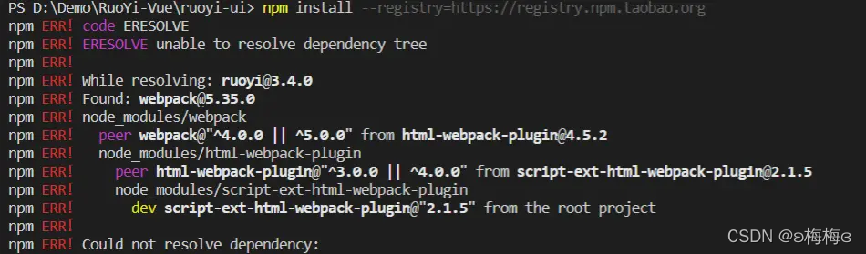

[Toc]

# `npm install`报错

- **场景描述**

> 使用`npm i`下载包时报错，报错信息如下
> 

- **原因**

> NPM v7 预设会安装peerDependencies，默认情况下，npm install当遇到冲突的peerDependencies时将失败。以前不是那样的，这会导致某些套件出现相依性问题，所以可能会在npm install这个时候加上–legacy-peer-deps参数来解决这个问题

- **解决方案**

> 上述报错日志中有个关键字眼：
>
> ```
> this command with --force, or --legacy-peer-deps
> Fix the upstream dependency conflict, or retry
> this command with --force, or --legacy-peer-deps
> to accept an incorrect (and potentially broken) dependency resolution.
> ```
>
> 意思是：修复上游依赖性冲突，或使用`–force`或`–legacy-peer-deps`重试此命令，以接受不正确的（并且可能会损坏的）依赖性解析。
> -f或–force参数将强制npm获取远程资源，即使磁盘上存在本地副本也是如此。
>
> 这样的关键字，这是npm版本的依赖冲突的提示使然，
> 那么npm：何时使用–force和–legacy-peer-deps？
>
> `–force `会无视冲突，并强制获取远端npm库资源，即使本地有资源也会覆盖掉
> `–legacy-peer-deps`：安装时忽略所有peerDependencies，忽视依赖冲突，采用npm版本4到版本6的样式去安装依赖，已有的依赖不会覆盖，。
> 用`–legacy-peer-deps` 比较保险一点
>


# 参考资料

1. https://blog.csdn.net/meimeib/article/details/121969219