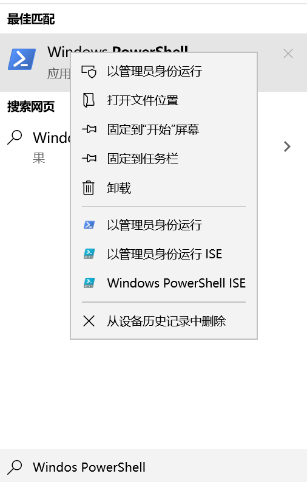
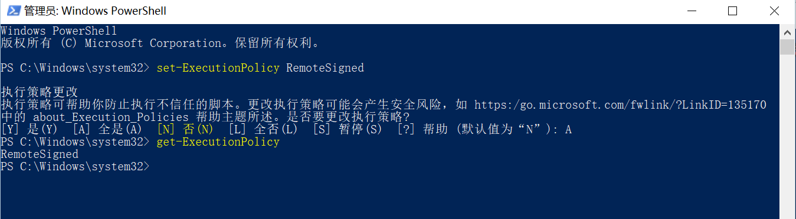
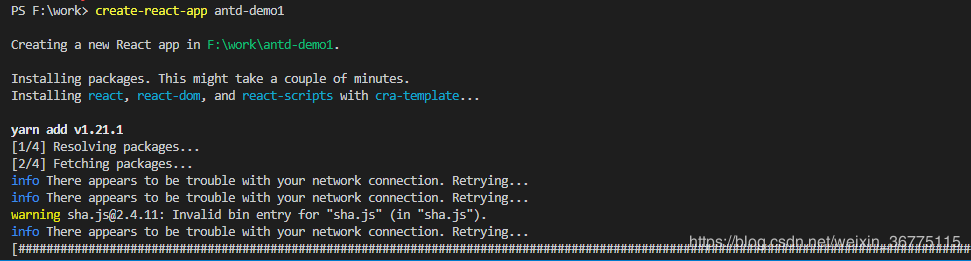

[Toc]

# 官网地址

- [React中文说明文档](https://react.docschina.org/docs/getting-started.html)


# 环境搭建

## 1. 安装`node`

```
# 监测node是否安装成功
node -v
```

## 2. 安装：create-[react](https://so.csdn.net/so/search?q=react&spm=1001.2101.3001.7020)-app

**npm方式：**` npm install -g create-react-app`

## 3. 创建React项目

```
create-react-app hello-app
```

## 4. 运行React项目

> 进入到项目目录下，然后使用以下命令运行项目

```
 npm start   //启动开发环境服务
    Starts the development server.

  npm run build   #生成项目静态文件
    Bundles the app into static files for production.

  npm test  //启动测试环境服务
    Starts the test runner.

  npm run eject  //会将项目工具，依赖，配置文件，脚本移动到项目目录下。此过程不可逆
    Removes this tool and copies build dependencies, configuration files
    and scripts into the app directory. If you do this, you can’t go back!

We suggest that you begin by typing:

  cd hello-app
  npm start
```


# 创建`React`项目报错

## 1. `tar`需升级

- **报错信息**

```
npm WARN deprecated tar@2.2.2: This version of tar is no longer supported, and will not receive security updates. Please upgrade asap. 
```

- **解决方案**:安装最新版本tar

```
npm install -g tar
```

## 2. 无法加载文件 `C:\....\create-react-app.ps1`

- **报错信息**

```
PS D:\huadi_workspace\tjyz_workspace\old_tjyz_project\tjyz\TJYZ-bdp1> create-react-app hello-app

create-react-app : 无法加载文件 C:\Users\12613\AppData\Roaming\npm\create-react-app.ps1，因为在此系统上禁止运行脚本。有关详细信息，请参阅 htt
ps:/go.microsoft.com/fwlink/?LinkID=135170 中的 about_Execution_Policies。
所在位置 行:1 字符: 1
+ create-react-app hello-app
+ ~~~~~~~~~~~~~~~~
    + CategoryInfo          : SecurityError: (:) []，PSSecurityException
    + FullyQualifiedErrorId : UnauthorizedAccess
```

- **解决方案**

1. 搜索框输入：Windos PowerShell 并且以右键管理员身份运行



2. 打开了命令行之后,输入`set-ExecutionPolicy RemoteSigned`，并且把权限改权限为A，然后通过 `get-ExecutionPolicy` 查看当前的状态：



3、最后我们就可以使用命令创建项目了。



# 运行React项目报错

- **问题描述**

> 已安装好node,用`npm install`安装好项目依赖，`npm start`运行项目报错，报错信息如下：
>
> ```
> 'cross-env' 不是内部或外部命令，也不是可运行的程序
> ```
>
> 使用`npm install  cross-env --save`安装时，报错，报错信息如下

```
npm ERR! code ERESOLVE
npm ERR! ERESOLVE unable to resolve dependency tree
npm ERR! 
npm ERR! While resolving: ant-design-pro@4.5.0
npm ERR! Found: react@16.14.0
npm ERR! node_modules/react
npm ERR!   react@"^16.14.0" from the root project
npm ERR!   peer react@">=16.9.0" from @ant-design/pro-descriptions@1.7.5
npm ERR!   node_modules/@ant-design/pro-descriptions
npm ERR!     @ant-design/pro-descriptions@"^1.2.0" from the root project
npm ERR!   1 more (antd)
```

- **问题原因**

> npm 版本问题导致，需要对npm进行降级
> `npm i --legacy-peer-deps`
> 运行完后会生成`package-lock.json`的文件，该文件主要作用就是锁定安装包的版本号，以确保项目其他成员`npm install`时大家的依赖一致

- **解决方案**

```
### 在安装时忽略所有 peerDependencies，采用 npm 版本 4 到版本 6 的样式。 
npm i --legacy-peer-deps
### 然后再运行
npm install
```


# 参考资料

1. https://www.bilibili.com/video/BV1wy4y1D7JT?spm_id_from=333.337.search-card.all.click