[Toc]

# 安装

- **软件下载**

  - [Virtual SVN 下载地址](https://www.visualsvn.com/)

    [Tortoise SVN 下载地址](https://tortoisesvn.net/)

## 安装Virtual SVN SERVER

```
系统：WIN 10
SVN Server版本：VisualSVN-Server-4.3.6-x64
```

### 1. 安装

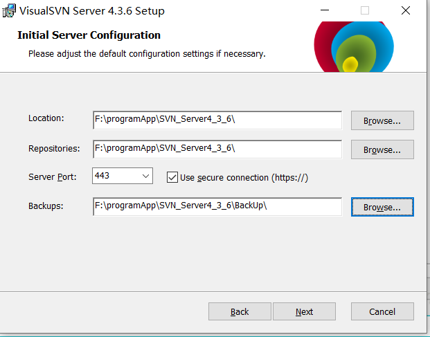

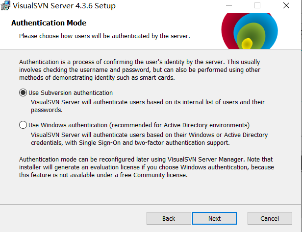

### 2. 配置

> 安装完成后，start svn server manage
> 命令行启动：启动VisualSVN Server

1) **首先配置groups，添加两个组，一个adminis组，一个guest组**

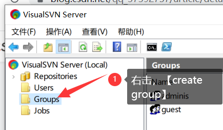

2) **添加使用用户**

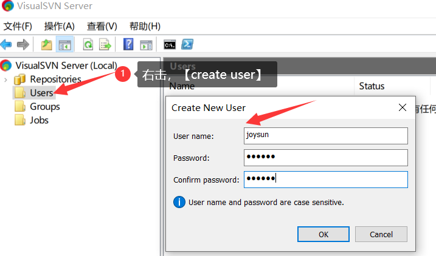
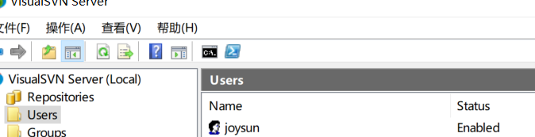

3）**给对应的组添加对应的用户**

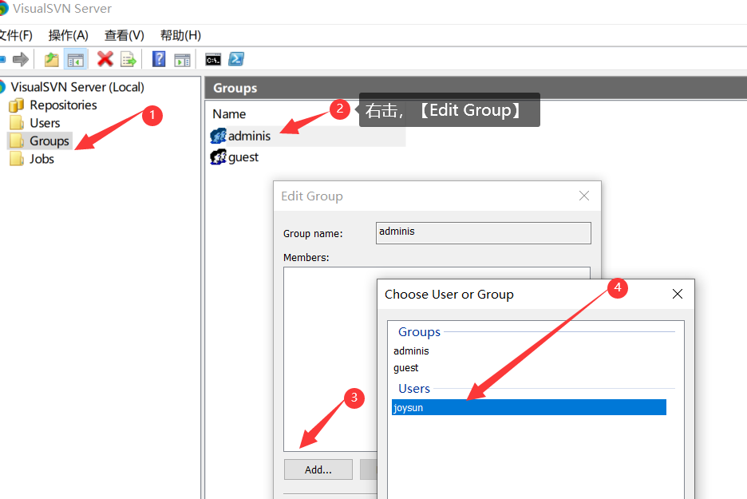

**4）创建一个新的库（Repository）**

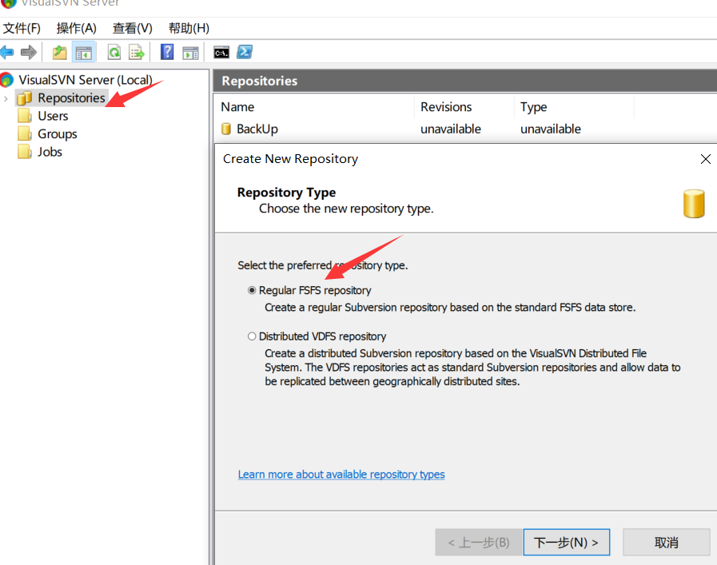


**创建一个空库**

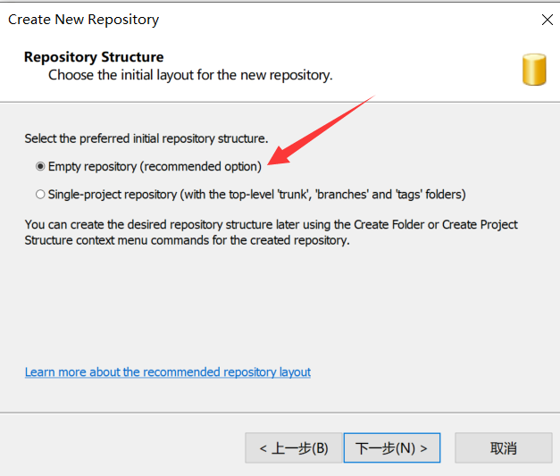

- **选择自定义，给对应的用户/组配置相应的权限**

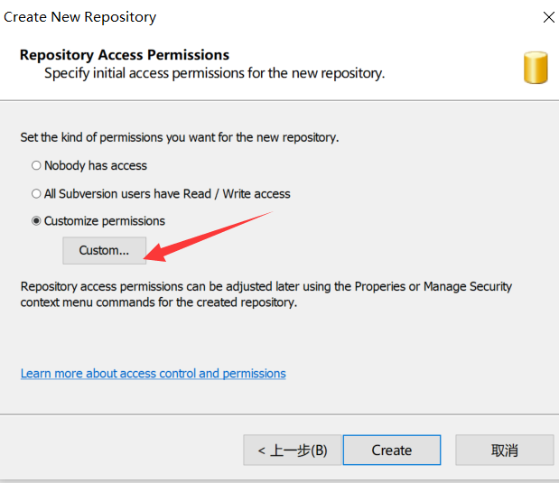

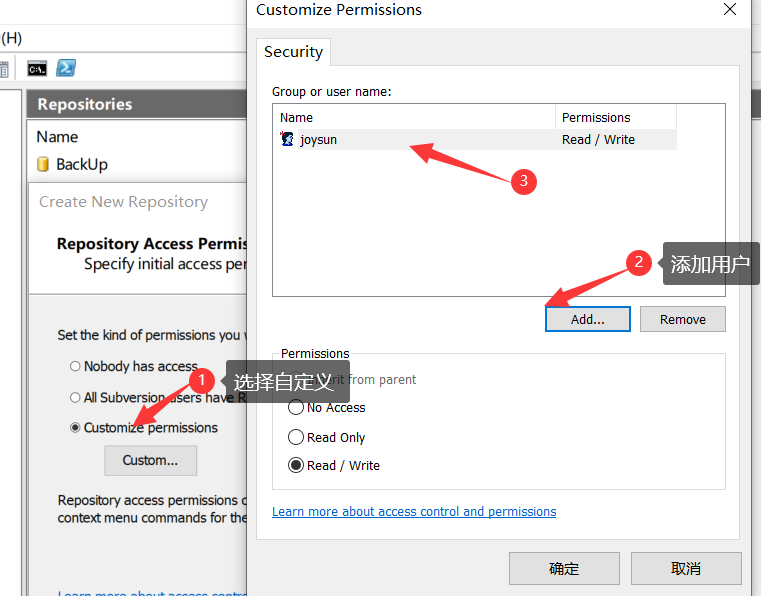

- **创建完成后，查看相应的URL，点击Finish，库创建完成**

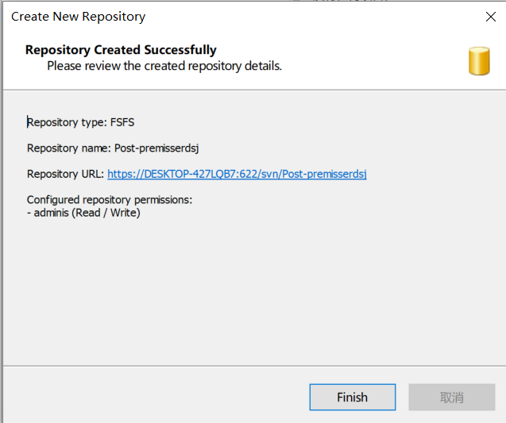


## 安装TortoiseSVN Client

- **除了修改安装路径，其他一路默认安装**

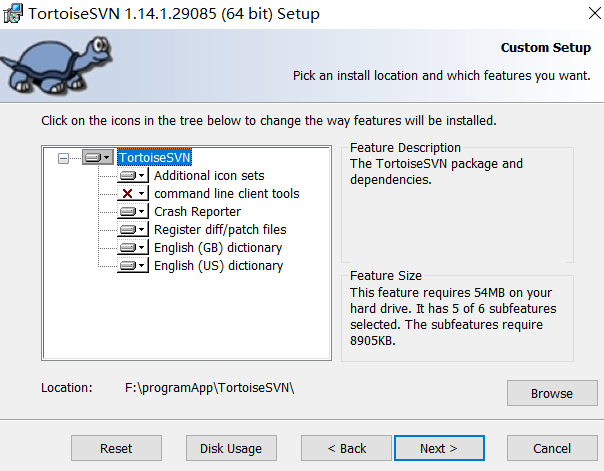

- **安装完成后，在客户端机器上创建空目录**

  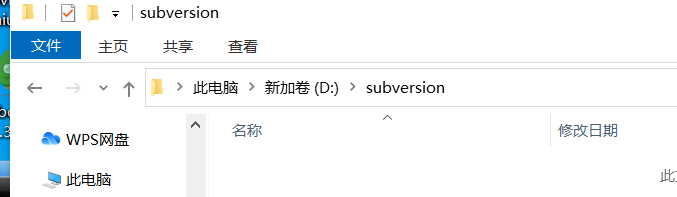

- **右击，SVN Check out,输入库地址，账号、密码后，检出**

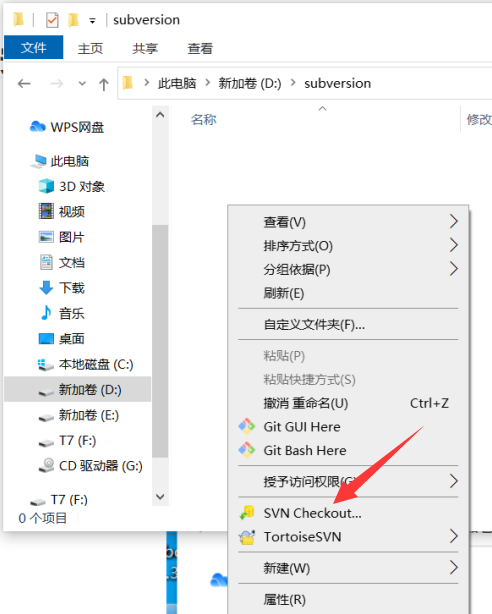

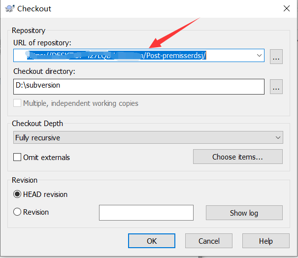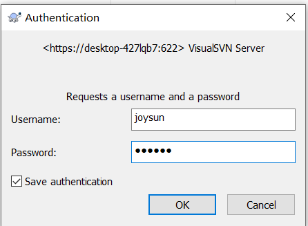


- **将要放入库的文件拷贝到这个目录下，右键选择SVN Commit**
  选中要上传的文件，右击，选中SVN Commit,即可上传文件到库

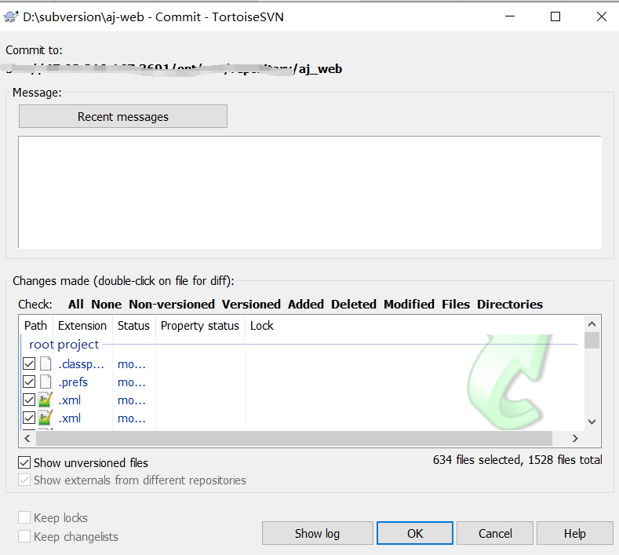

需要使用有“写”权限的SVN用户来Commit。SVN Update操作只需要读权限，提交完成后，库就已经初步创建完成了，可以在其他客户端中Checkout这个库，即可将刚刚提交的内容同步下来。

# 概念解析

## VDFS&FSFS

> 至于FSFS本身是SVN在2004年开始替换Berkeley DB的，是基于文件系统概念设计的，而不是基于数据库的概念，根据 http://svnbook.red-bean.com/en/1.1/ch05.html 的说法，采用目录树的结构去做transaction，可以在目录外创建完一次提交，然后把完成的提交一次性移动进版本历史。另外，根据他们的数据结构，对Berkeley DB的append操作是O(N^2)的，而FSFS是O(N)的。当然更完整的介绍可以看：http://svn.apache.org/repos/asf/subversion/tags/1.8.4/notes/fsfs
>
> 如果你不是太在乎私有格式，也需要多仓库同步，可以用VDFS，官方文档说了VDFS默认的service是没有启动的，所以对你日常应该没有影响。如果不喜欢私有格式，就用FSFS就好。
>
> FSFS与VDFS的使用区别在于FSFS是本地仓库，VDFS是分布式仓库，实现在同一个局域网内多台仓库进行同步；因为BDB方式在服务器中断时，有可能锁住数据，所以还是FSFS方式更安全一点。

# 参考资料

1. https://blog.csdn.net/qq_37392757/article/details/77543438

2. https://blog.csdn.net/Caster_Saber/article/details/49586195