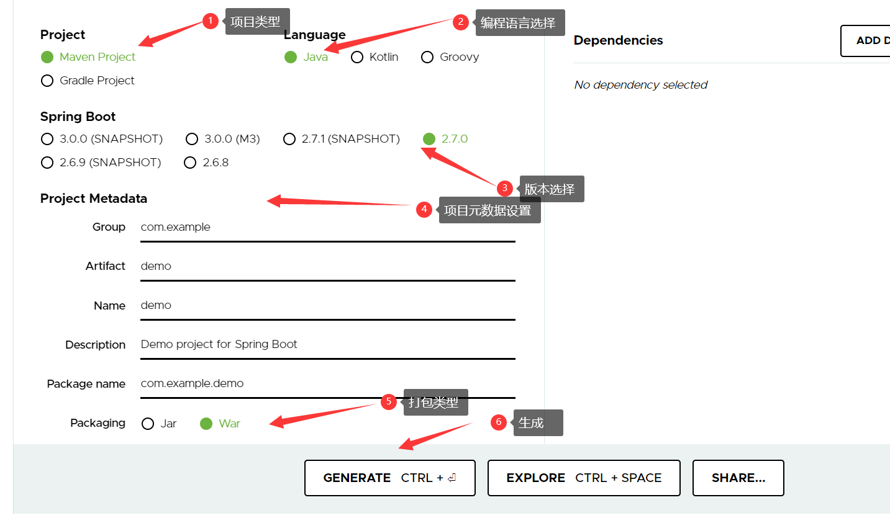
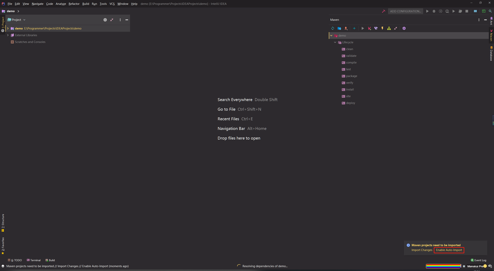
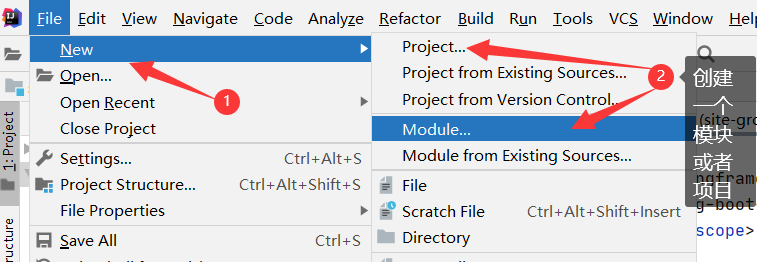
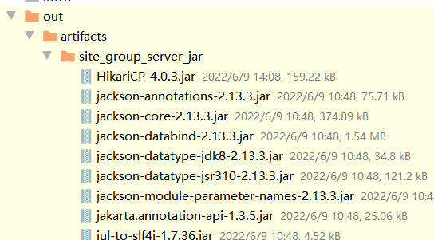

[Toc]

# 官网

- [SpringBoot官方网址](https://spring.io/projects/spring-boot#overview)

# 版本号说明


### 数字部分

我们以2.3.8为例，从左到右2为主版本，3为次版本，8为增量版本

- **主版本**，当有大机制或者是架构的调整，才会去调整主版本，主版本间一般不兼容。
- **次版本**，次版本是在主版本架构不管的情况下，增加新特性，可理解为发布新特性，同一个主版本的次要版本间通常是要保证兼容的（理想状态下）。
- **增量版本**，bug修复。

### 标签部分

- **发布版本**，描述的是版本的发布计划或者发布状态。
   **GA**：General Availability,正式发布的版本，官方推荐使用该版本
   **Alpha**：内测版
   **Beta**：公开测试版
   **RC**：Release，该版本已经相当成熟了，基本上不存在导致错误的BUG，与即将发行的正式版相差无几。
   **SNAPSHOT**：快照版本，可以稳定使用，且该版本会一直进行小量的优化和改进

# 创建SpringBoot项目

## 1. 官网在线创建

> 在Spring官网上提供了一个网址，可以根据需要生成SpringBoot项目,可以使用这个生成简单的SpringBoot项目
>
> [生成SpringBoot Demo项目网址](https://start.spring.io/)



## 2. 通过 IDE 创建（IntelliJ IDEA）


- 点击 Spring Initializr ， 选择 JDK 版本 ，选择 Default ，点击 Next；


- 填写Group 和 Artifact 信息，选择对应的开发语言，打包方式，Java 版本等 ，点击 Next；

  

选择 Web 依赖 和 Spring Boot 版本号，点击 Next；


选择项目的保存位置，点击 FINISH


点击 Enable Auto-Import 导入依赖




至此创建完成

## 3. 通过改造 Maven 工程创建

- 在IDEA 界面，依次点击 File -> New -> Project；


- 选择 Maven 和 JDK 版本，点击 Next； （此处不选择 Maven 模板）


- 修改项目名和指定项目地址


- 此时创建一个普通的 Maven 项目，此时需要在 pom.xml 中引入 SpringBoot 需要的 jar 包；
  详细可查看SpringBoot 官方文档： [Developing Your First Spring Boot Application](https://docs.spring.io/spring-boot/docs/2.2.7.RELEASE/reference/html/getting-started.html#getting-started-first-application)

> 1. 创建POM文件： [Creating the POM](https://docs.spring.io/spring-boot/docs/2.2.7.RELEASE/reference/html/getting-started.html#getting-started-first-application-pom)
>    在pom.xml 文件中引入：
>
>    ```
>    <parent>
>            <groupId>org.springframework.boot</groupId>
>            <artifactId>spring-boot-starter-parent</artifactId>
>            <version>2.2.7.RELEASE</version>
>        </parent>
>    ```
>
> 2. 添加 SpringBoot 依赖： [Adding Classpath Dependencies](https://docs.spring.io/spring-boot/docs/2.2.7.RELEASE/reference/html/getting-started.html#getting-started-first-application-dependencies)
>
>    ```
>    <dependencies>
>        <dependency>
>            <groupId>org.springframework.boot</groupId>
>            <artifactId>spring-boot-starter-web</artifactId>
>        </dependency>
>    </dependencies>
>    ```
>
>    此时的pom.xml 文件：
>
>    ```
>    <?xml version="1.0" encoding="UTF-8"?>
>    <project xmlns="http://maven.apache.org/POM/4.0.0"
>             xmlns:xsi="http://www.w3.org/2001/XMLSchema-instance"
>             xsi:schemaLocation="http://maven.apache.org/POM/4.0.0 http://maven.apache.org/xsd/maven-4.0.0.xsd">
>        <modelVersion>4.0.0</modelVersion>
>    
>        <groupId>org.example</groupId>
>        <artifactId>SpringBootDemo</artifactId>
>        <version>1.0-SNAPSHOT</version>
>    
>        <parent>
>            <groupId>org.springframework.boot</groupId>
>            <artifactId>spring-boot-starter-parent</artifactId>
>            <version>2.2.7.RELEASE</version>
>        </parent>
>    
>        <dependencies>
>            <dependency>
>                <groupId>org.springframework.boot</groupId>
>                <artifactId>spring-boot-starter-web</artifactId>
>            </dependency>
>        </dependencies>
>    </project>
>    
>    ```
>
> 3. 编写启动类：[Writing the Code](https://docs.spring.io/spring-boot/docs/2.2.7.RELEASE/reference/html/getting-started.html#getting-started-first-application-code)
>
> 
>
> - 编写启动类：
>
>   ```
>   import org.springframework.boot.SpringApplication;
>   import org.springframework.boot.autoconfigure.EnableAutoConfiguration;
>   import org.springframework.web.bind.annotation.RequestMapping;
>   import org.springframework.web.bind.annotation.RestController;
>   
>   @RestController
>   @EnableAutoConfiguration //开启自动配置
>   public class SpringBootApplication {
>   
>       @RequestMapping("/")
>       String home() {
>           return "Hello World!";
>       }
>   
>       public static void main(String[] args) {
>           SpringApplication.run(SpringBootApplication.class, args);
>       }
>   }
>   
>   ```
>
>   

## 监测是否创建成功

- 启动 main() 方法


- 访问 localhost:8080
  
  至此 SpringBoot 创建成功！

# 创建Spring+MyBatis+Mysql web项目

## 1. 使用IDE创建

1. 【File】->【New】->[Module]
   

2. 选择【Spring Initializr】,选择模块/项目jdk版本，->【next】
   
3. 设置`pom.xml`文件配置信息
   
4. **配置开发工具**
   
5. 选择web项目类型
   

6. 选择数据库框架&数据库驱动，——>【next】

   > IDEA配置了多种数据库框架和数据库驱动，可以直接选择对应的数据库框架&数据库驱动。如：使用mybatis+mysql作为数据操作配置，可如下选择

   

7. 设置模块名&模块目录名，——>【finished】
   

## Mybatis纯注解配置应用

> 使用注解方式查询获取数据,没有`xxxxMapper.xml`映射文件

- `application.yml`

```
   server:
     port: 8080  # 服务端口号,该端口为springboot内置的tomcat服务端口配置；如果启动项目不使用内置tomcat，该配置无效

   spring:
     datasource:  # 数据库配置
       driver-class-name: com.mysql.jdbc.Driver  # 新版本驱动器 com.mysql.cj.jdbc.Driver
       url: jdbc:mysql://192.168.183.152:3306/tjdb?useUnicode=true&characterEncoding=utf8&useSSL=false
       username: root
       password: Joy.123com
```

- 实例对象`User.java`

```
package com.huadi.orm;

public class User {
    private String userName;
    private String passWd;

    public String getUserName() {
        return userName;
    }

    public void setUserName(String userName) {
        this.userName = userName;
    }

    public String getPassWd() {
        return passWd;
    }

    public void setPassWd(String passWd) {
        this.passWd = passWd;
    }

}

```

- `UserMapper.java`映射类

```
package com.huadi.mapper;

import com.huadi.orm.User;
import org.apache.ibatis.annotations.Mapper;
import org.apache.ibatis.annotations.Select;
import org.springframework.stereotype.Repository;

import java.util.List;

@Mapper
@Repository
public interface UserMapper {

    @Select("select * from user")
    public List<User> getList();
}

```

- **测试类**

```
package com.huadi;

import com.huadi.mapper.UserMapper;
import com.huadi.orm.User;
import org.junit.jupiter.api.Test;
import org.junit.runner.RunWith;
import org.springframework.beans.factory.annotation.Autowired;
import org.springframework.boot.test.context.SpringBootTest;
import org.springframework.test.context.junit4.SpringRunner;

import java.util.List;

@RunWith(SpringRunner.class)
@SpringBootTest
class SiteGroupServerApplicationTests {
    @Autowired
    private UserMapper userMapper;

    @Test
    void testFindAll() {
        List<User> userList=userMapper.getList();
        System.out.println(userList);
    }

}
```


## MyBatis xml文件映射配置

- `application.yml`

```
   server:
     port: 8080  # 服务端口号

   spring:
     datasource:  # 数据库配置
       driver-class-name: com.mysql.cj.jdbc.Driver # 老版本驱动类 com.mysql.jdbc.Driver
       url: jdbc:mysql://192.168.183.152:3306/tjdb?useUnicode=true&characterEncoding=utf8&useSSL=false
       username: root
       password: Joy.123com

   mybatis:  # mybatis配置
    mapperLocations: classpath:/mapper/*.xml  #映射文件配置
    type-aliases-package: com.huadi.orm     #类型别名包配置
    #config-location: #指定mybatis核心配置
```

- 实例对象`User.java`

```
package com.huadi.orm;

/**
 * @author JoySun
 * @date 2022-06-09
 */
public class User {
    private String userName;
    private String passWd;

    public String getUserName() {
        return userName;
    }

    public void setUserName(String userName) {
        this.userName = userName;
    }

    public String getPassWd() {
        return passWd;
    }

    public void setPassWd(String passWd) {
        this.passWd = passWd;
    }

    @Override
    public String toString() {
        return "User{" +
                "userName='" + userName + '\'' +
                ", passWd='" + passWd + '\'' +
                '}';
    }
}
```

- Mapper映射类`UserXmlMapper.xml`

```
package com.huadi.mapper;

import com.huadi.orm.User;
import org.apache.ibatis.annotations.Mapper;
import org.apache.ibatis.annotations.Select;
import org.springframework.stereotype.Repository;

import java.util.List;

/**
 * @author JoySun
 * @date 2022-06-09
 */
@Mapper
@Repository
public interface UserXmlMapper {

    List<User> selectAll();

}
```

- mapper映射文件`UserMapper.xml`

  > 在【resources】目录下建立【mapper】文件下，将mapper映射文件放入该目录下

```
<?xml version="1.0" encoding="UTF-8"?>
<!DOCTYPE mapper PUBLIC "-//mybatis.org//DTD Mapper 3.0//EN" "http://mybatis.org/dtd/mybatis-3-mapper.dtd">

<mapper namespace="com.huadi.mapper.UserXmlMapper">
    <select id="selectAll" resultType="user">
        select * from user
    </select>
</mapper>
```

- **测试类**

```
package com.huadi;

import com.huadi.mapper.UserXmlMapper;
import com.huadi.orm.User;
import org.junit.jupiter.api.Test;
import org.junit.runner.RunWith;
import org.springframework.beans.factory.annotation.Autowired;
import org.springframework.boot.test.context.SpringBootTest;
import org.springframework.test.context.junit4.SpringRunner;

import java.util.List;

@RunWith(SpringRunner.class)
@SpringBootTest
class SiteGroupServerApplicationTests {
    @Autowired
    private UserXmlMapper userXmlMapper;

    @Test
    void testFindAll2() {
        List<User> userList=userXmlMapper.selectAll();
        System.out.println(userList);
    }

}

```

# 打包

## 打包成`jar`包

1. 配置`pom.xml`打包类型

> ```
> 项目部署一般是两种方式：
> 一种是打包成 jar 包直接执行，另一种是打包成 war 包放到 Tomcat 服务器下，SpringBoot一般情况下默认为jar包方式。
> pom.xml：
> < packaging>jar< /packaging> （默认）
> ```

2. 在IDEA的菜单中选择File–>Project Structure,如下图所示：
   

3. 添加【Artifacts】
   

4. 选择项目，入口类等。最后一项 META-INF，默认放到 src\main\java 目录里，如果使用默认值，没有进行其他配置，生成的 jar 有可能不会包含 META-INF 目录，导致运行 jar 出错。最好放在 src\main\resource目录中。点击ok保存。按下图所示配置：
   

5. 点击【ok】后，出现如下信息
   

6. 生成jar包

   在IDEA主界面中，点击【BUILD】->【Build Artifact】->选中项目jar->【Build】/【Rebuild】生成jar包
   
   
   此时生成site-group-server.jar是一个独立的包，不包含依赖。运行时，需将打包的依赖包与项目包放在同一目录下。以下是【Build】生成的项目包
   

7. 如果需要将项目打包成独立可运行的jar包，使用mvn package打包
   
   运行后，可得到包含项目所有依赖的jar包，如内置tomcat，spring等，直接运行该jar包即可
   

8. 运行`jar`：在命令操作界面：进入项目jar所在目录，使用命令行运行jar包

   ```
   E:\>java -jar site-group-server-1-SNAPSHOT.jar
   ```

## 打包成`war`包

1. `pom.xml`打包配置修改

   ```
   < packaging>war< /packaging>
   ```

2. 如果已经有war包的打包配置
   
   直接运行maven package打包，在对应输出路径下即可获得所需的项目jar包。

3. 如果没有现成的war包配置，则添加
   打开【Project Structure】，点击【+】号图标，选择“【Artifacts】->【Web Application Archive】”，如下图所示：
   

4. 可以修改打包的war包名字和存放路径，默认是项目路径\out\artifacts\下面，将右侧的全选，鼠标右键点击“Put into Output Root”，如下图所示：
   

5. 全部添加到左侧之后，点击ok，如下图所示：
   

6. 使用mvn package打包，在输出的目录下即可看到打包好的项目war包。然后使用web服务运行war包即可
   

# 问题记录

## IDEA创建yml文件不显示小树叶

- **问题描述**

> 使用IDE创建springboot项目时，默认生成的`application.properties`改成`application.yml`文件，发现IDE无法正确识别`yml`文件，并自动提示
>
> 
>
> 此时IDEA中设置：
>
> 1. YAML插件全部安装；
> 2. 【File Types】已设置了`.yml,*.yaml`
>    

- **解决方案**

> 【Setting】——>【Editor】——>【File Types】,找到Text，在以下列表中找到自己创建的失效的application.yml，点击右边的减号将其删除，应用，问题解决。
> 
>


# 参考资料

1. https://www.jianshu.com/p/a066b45399f1