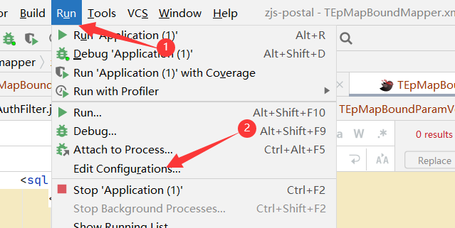
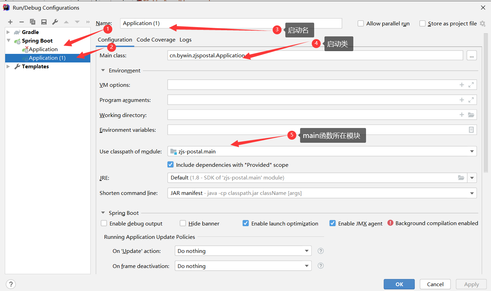

[Toc]

# 使用外部TOMCAT

- **场景描述**

> 开发工具：IDE
> JDK:1.8
>
> TOMCAT:8.5.47
> SpringBoot:2.7.0
>
> 使用IDE创建SpringBoot项目后，启动，正常。但使用外部Tomcat8.5版本启动项目时，发现项目无法正常被加载到Tomca服务

- **解决方案**

> SpringBoot 2.x版本内置的Tomcat为Tomcat9.x，当使用Tomcat 8.x版本作为启动服务会导致项目无法正常加载。


# 配置SpringBoot启动





# `@DateTimeFormat` & `@JsonFormat`

## `@DateTimeFormat`

> 该注解主要解决前端时间控件传值到后台接收准确的Date类属性的问题，我们可以在需要接收的类中对应的时间类型属性上加上@DateTimeFormat注解，并在注解中加上pattern属性，例如：
>
> ```
> public class Person{
> 
> 	// 名字
> 	private String name;
> 	
> 	// 出生年月日
> 	@DateTimeFormat(pattern = "yyyy-MM-dd")
> 	private Date birthday;
> }
> ```
>
> 随后在前端对应birthday传入的`yyyy-MM-dd`日期类型就能够按照该种格式进行转义赋值给Person类中的birthday的Date类型。
> 若想按照yyyy/MM/dd的日期格式，则直接修改@DateTimeFormat的pattern属性为对应的日期格式即可，即`@DateTimeFormat(pattern = “yyyy/MM/dd”)`。或者还想要接收到对应的HH-mm-ss时分秒，同样在pattern中加上即可，如`@DateTimeFormat(pattern = “yyyy-MM-dd HH-mm-ss”)`

## `@JsonFormat`

> 该注解主要解决后台从数据库中取出时间类型赋予java对象的Date属性值无法在前端以一定的日期格式来呈现，默认返回的是一个带时区的格式串，不符合我们日常要呈现的yyyy-MM-dd格式的日期。
> 同样，我们在对应的接收对象时间类型上加上@JsonFormat注解，并在注解中加上pattern属性以及timezone属性，例如：
>
> ```
> public class Person{
> 
> 	// 名字
> 	private String name;
> 	
> 	// 出生年月日
> 	@JsonFormat(pattern = "yyyy-MM-dd",timezone = "GMT+8")
> 	@DateTimeFormat(pattern = "yyyy-MM-dd")
> 	private Date birthday;
> }
> ```
>
> 表示我们从后台数据库查询结果赋予对应的Date java类型为yyyy-MM-dd格式，且注意后面的timezone属性，最好加上GMT+8表示我们以东八区时区为准，若读者想用其他时区就可以通过更改timezone属性来改变，从而解决时区不同造成的时间差问题。

# SpringBoot获取当前运行环境

> 需要获取当前环境是测试环境还是生产环境时，有以下几种方式。

### 1.注解直接获取

```
@Value("${spring.profiles.active}")
private String env;
```

### 2.配置[Configuration](https://so.csdn.net/so/search?q=Configuration&spm=1001.2101.3001.7020)

```
@Configuration
public class ProfileConfig {

    @Autowired
    private ApplicationContext context;

    public String getActiveProfile() {
        return context.getEnvironment().getActiveProfiles()[0];
    }
}
```

## 3.实现ApplicationContextAware

```
@Component
public class SpringUtils implements ApplicationContextAware {
    private static ApplicationContext applicationContext;

    @Override
    public void setApplicationContext(ApplicationContext applicationContext)
            throws BeansException {
        if (SpringUtils.applicationContext == null) {
            SpringUtils.applicationContext = applicationContext;
        }
    }

    public static ApplicationContext getApplicationContext() {
        return applicationContext;
    }


    public static Object getBean(String name) {
        return getApplicationContext().getBean(name);
    }


    public static <T> T getBean(Class<T> clazz) {
        return getApplicationContext().getBean(clazz);
    }

    public static <T> T getBean(String name, Class<T> clazz) {
        return getApplicationContext().getBean(name, clazz);
    }

	/**
	* 获取当前环境
	*/
	public static String getActiveProfile() {
        return context.getEnvironment().getActiveProfiles()[0];
    }
```

## `MyBatis中的@MapKey`

> **注解`@MapKey（value=” 字段名“）`，其中参数部分，可以是一个map集合中的某个字段**
>
> ###### 该注解的意思就是将返回的多个map集合，以在注解中设置的字段的值为键，map集合为值，将结果存储在一个map集合中
>
> 字段值要是重复的话，返回的map有可能被覆盖掉，所以字段值必须是唯一的,如果设置的`@Mapkey`设置的`value`为空或者一个跟查询结果不匹配的字段,那么查到的记录K成了null,查询结果始终都是最后一条。这个可以通过源码中的`DefaultMapResultHandler<K, V>`类得出结果,代码见最后， `final K key = (K) mo.getValue(mapKey);`这句代码就是将`@Mapkey`中指定的类型字段查询出对应的`value`值,再将`value`值作为最终结果的`key`
>
> **适用范围**：查询结果返回的是多个字段的多条记录时，可以直接返回一个Map集合
>
> 

- 单个`Map`上使用`@MapKey`

```
@MapKey("name")
Map<String, Object> getCheckMachineTotal(CommonCnNameRequest request);

### 返回值形式
{data:{
"张三":{
"name":"张三",
"value":"1"
}
}}

期望返回的是：当返回值为单个Map时，不需要使用@MapKey
{
{data:{
"name":"张三",
"value":"1"
}}
}
```

- **列表`Map`上使用`@MapKey`**

> ```
> 
> @MapKey("name")
> List<Map<String, Object>> getCheckMachineGroupByCity(CommonCnNameRequest request);
> 
> {data:[{
> "name":"张三",
> "value":"1"
> },{
> "name":"李四",
> "value":"2"
> }]}
> ```


# 参考资料

1. https://www.cnblogs.com/wu-kai/p/13368977.html
2. https://blog.csdn.net/imVainiycos/article/details/102712056
3. https://blog.csdn.net/m0_67393342/article/details/124040435
4. https://blog.csdn.net/W_317/article/details/115448285