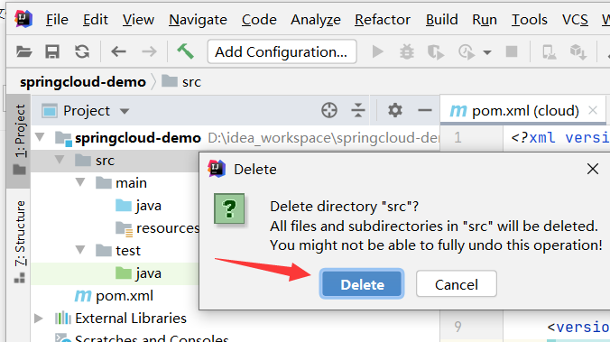

[Toc]

## 服务提供方开发

> 使用工具：IDEA
> 主要步骤：
>
> 1.  建module :包含操作步骤 [1](#1. 创建一个Maven项目)  [2](#2. IDEA相关设置)
>
> 2. 改POM：包含操作步骤：[3](#3. pom.xml配置)
>
> 3. 写YML：包含操作步骤：[4](#4. 创建新的模块)  [5](#5. YML配置文件)
> 4. 创建数据库及数据：包含步骤：[6](#6.创建数据库及数据)
>
> 5. 主启动：包含操作步骤：[7](#7. 创建主启动服务类)
>
> 5. 业务类: 包含操作步骤：[8](#8. Entity创建)  [9](#9. Dao)  [10](#10. Service)  [11](#11. Controller)

### 1. 创建一个Maven项目

> 此作为父工程使用


创建成功


### 2. IDEA相关设置

#### 2.1 设置文件编码为UTF-8


#### 2.2 注解激活生效


#### 2.3 修改Java编译JDK版本


#### 2.4 设置过滤文件


### 3. pom.xml配置

```
<?xml version="1.0" encoding="UTF-8"?>
<project xmlns="http://maven.apache.org/POM/4.0.0"
         xmlns:xsi="http://www.w3.org/2001/XMLSchema-instance"
         xsi:schemaLocation="http://maven.apache.org/POM/4.0.0 http://maven.apache.org/xsd/maven-4.0.0.xsd">
    <modelVersion>4.0.0</modelVersion>

    <groupId>com.joysun.springcloud</groupId>
    <artifactId>cloud</artifactId>
    <version>1.0-SNAPSHOT</version>
    <!-- 定义父工程为pom-->
    <packaging>pom</packaging>

    <!-- 统一管理jar包版本 -->
    <properties>
        <project.build.sourceEncoding>UTF-8</project.build.sourceEncoding>
        <maven.compiler.source>1.8</maven.compiler.source>
        <maven.compiler.target>1.8</maven.compiler.target>
        <junit.version>4.12</junit.version>
        <log4j.version>1.2.17</log4j.version>
        <lombok.version>1.16.18</lombok.version>
        <mysql.version>5.1.47</mysql.version>
        <druid.version>1.1.16</druid.version>
        <mybatis.spring.boot.version>1.3.0</mybatis.spring.boot.version>
    </properties>

    <!-- 子模块继承之后，提供作用：锁定版本+子modlue不用写groupId和version  -->
    <dependencyManagement>
        <dependencies>
            <!--spring boot 2.2.2-->
            <dependency>
                <groupId>org.springframework.boot</groupId>
                <artifactId>spring-boot-dependencies</artifactId>
                <version>2.2.2.RELEASE</version>
                <type>pom</type>
                <scope>import</scope>
            </dependency>
            <!--spring cloud Hoxton.SR1-->
            <dependency>
                <groupId>org.springframework.cloud</groupId>
                <artifactId>spring-cloud-dependencies</artifactId>
                <version>Hoxton.SR1</version>
                <type>pom</type>
                <scope>import</scope>
            </dependency>
            <!--spring cloud alibaba 2.1.0.RELEASE-->
            <dependency>
                <groupId>com.alibaba.cloud</groupId>
                <artifactId>spring-cloud-alibaba-dependencies</artifactId>
                <version>2.1.0.RELEASE</version>
                <type>pom</type>
                <scope>import</scope>
            </dependency>

            <dependency>
                <groupId>mysql</groupId>
                <artifactId>mysql-connector-java</artifactId>
                <version>${mysql.version}</version>
            </dependency>
            <dependency>
                <groupId>com.alibaba</groupId>
                <artifactId>druid</artifactId>
                <version>${druid.version}</version>
            </dependency>
            <dependency>
                <groupId>org.mybatis.spring.boot</groupId>
                <artifactId>mybatis-spring-boot-starter</artifactId>
                <version>${mybatis.spring.boot.version}</version>
            </dependency>
            <dependency>
                <groupId>junit</groupId>
                <artifactId>junit</artifactId>
                <version>${junit.version}</version>
            </dependency>
            <dependency>
                <groupId>log4j</groupId>
                <artifactId>log4j</artifactId>
                <version>${log4j.version}</version>
            </dependency>
            <dependency>
                <groupId>org.projectlombok</groupId>
                <artifactId>lombok</artifactId>
                <version>${lombok.version}</version>
                <optional>true</optional>
            </dependency>
        </dependencies>
    </dependencyManagement>

    <build>
        <plugins>
            <plugin>
                <groupId>org.springframework.boot</groupId>
                <artifactId>spring-boot-maven-plugin</artifactId>
                <configuration>
                    <fork>true</fork>
                    <addResources>true</addResources>
                </configuration>
            </plugin>
        </plugins>
    </build>
</project>
```

### 4. 创建新的模块

> 注意：如果是在同一project下创建新的项目模块module,最好先删除idea默认生成的src目录，然后再创建，方便管理module

#### 4.1 清除默认生成的src目录




#### 4.2 创建新的module


#### 4.3 引入相关依赖

```
<?xml version="1.0" encoding="UTF-8"?>
<project xmlns="http://maven.apache.org/POM/4.0.0"
         xmlns:xsi="http://www.w3.org/2001/XMLSchema-instance"
         xsi:schemaLocation="http://maven.apache.org/POM/4.0.0 http://maven.apache.org/xsd/maven-4.0.0.xsd">
    <parent>
        <artifactId>cloud</artifactId>
        <groupId>com.joysun.springcloud</groupId>
        <version>1.0-SNAPSHOT</version>
    </parent>
    <modelVersion>4.0.0</modelVersion>

    <artifactId>cloud-provider-payment</artifactId>

    <dependencies>
        <dependency>
            <groupId>org.springframework.boot</groupId>
            <artifactId>spring-boot-starter-web</artifactId>
        </dependency>
        <dependency>
            <groupId>org.springframework.boot</groupId>
            <artifactId>spring-boot-starter-actuator</artifactId>
        </dependency>
        <dependency>
            <groupId>org.mybatis.spring.boot</groupId>
            <artifactId>mybatis-spring-boot-starter</artifactId>
        </dependency>
        <dependency>
            <groupId>com.alibaba</groupId>
            <artifactId>druid-spring-boot-starter</artifactId>
            <version>1.1.10</version>
        </dependency>
        <dependency>
            <groupId>mysql</groupId>
            <artifactId>mysql-connector-java</artifactId>
        </dependency>
        <dependency>
            <groupId>org.springframework.boot</groupId>
            <artifactId>spring-boot-starter-jdbc</artifactId>
        </dependency>
        <dependency>
            <groupId>org.springframework.boot</groupId>
            <artifactId>spring-boot-devtools</artifactId>
            <scope>runtime</scope>
            <optional>true</optional>
        </dependency>
        <dependency>
            <groupId>org.projectlombok</groupId>
            <artifactId>lombok</artifactId>
            <optional>true</optional>
        </dependency>
        <dependency>
            <groupId>org.springframework.boot</groupId>
            <artifactId>spring-boot-starter-test</artifactId>
            <scope>test</scope>
        </dependency>

    </dependencies>

</project>
```


### 5. YML配置文件

1.**新建一个yml配置文件**


2.**配置文件内容**

   ```
   server:   
     port: 8001  # 服务端口号
   
   spring:
     application:
       name: cloud-payment-service
     datasource:  # 数据库配置
       type: com.alibaba.druid.pool.DruidDataSource
       driver-class-name: com.mysql.jdbc.Driver
       url: jdbc:mysql://localhost:3306/cloud2020?useUnicode=true&characterEncoding=utf-8&useSSL=false
       username: root
       password: root
   
   mybatis:  # mybatis配置
     mapperLocations: classpath:/mapper/*.xml
     type-aliases-package: com.atguigu.springcloud.entities
   ```

   

   ### 6.创建数据库及数据

   ```
   CREATE DATABASE  IF NOT EXISTS test DEFAULT CHARACTER SET utf8 ;
   
   USE test ;
   
   DROP TABLE IF EXISTS payment ;
   
   CREATE TABLE payment (
     id BIGINT (20) NOT NULL AUTO_INCREMENT COMMENT 'ID',
     SERIAL VARCHAR (300) DEFAULT NULL,
     PRIMARY KEY (id)
   ) ENGINE = INNODB AUTO_INCREMENT = 33 DEFAULT CHARSET = utf8 ;
   
   INSERT INTO payment (id, SERIAL) VALUES(1, 'Joy01'),(2, 'Joy2') ;
   ```

   ### 7. 创建主启动服务类

   

   ```
   package com.joy.springcloud;
   
   import org.springframework.boot.SpringApplication;
   import org.springframework.boot.autoconfigure.SpringBootApplication;
   
   @SpringBootApplication
   public class PaymentMain {
       public static void main(String[] args) {
           SpringApplication.run(PaymentMain.class,args);
       }
   }
   ```

### 8. Entity创建

####  **1)** **主实体Payment**


```
package com.joy.springcloud.entities;

import lombok.AllArgsConstructor;
import lombok.Data;
import lombok.NoArgsConstructor;

import java.io.Serializable;

@Data
@AllArgsConstructor
@NoArgsConstructor
public class Payment implements Serializable {
private  Long id;
private String serial;
}

```

#### 2) Json封装体CommonResult

> 作用：接收数据库返回结果，对结果进行封装，以便前台方便获取相关信息

```
package com.joy.springcloud.entities;

import lombok.AllArgsConstructor;
import lombok.Data;
import lombok.NoArgsConstructor;

import java.io.Serializable;

@Data
@NoArgsConstructor
@AllArgsConstructor
public class CommonResult<T> implements Serializable {
    private Integer code;//数据库状态码
    private String message;//数据库反馈的信息或其他信息
    private T data;//数据

    public CommonResult(Integer code,String message){
        this(code,message,null);//若该行报错，安装lombok插件
    }
}
```

### 9. Dao

#### 1) **创建Dao接口**


```
package com.joy.springcloud.dao;

import com.joy.springcloud.entities.Payment;
import org.apache.ibatis.annotations.Mapper;
import org.apache.ibatis.annotations.Param;
import org.mybatis.spring.annotation.MapperScan;
import org.springframework.stereotype.Component;

@Component  //代替@Repository声明bean
@Mapper  //mybatis提供的，等价@MapperScan("com.joy.springcloud.dao")
//@MapperScan("com.joy.springcloud.dao")
public interface PaymentDao {
    public int create(Payment payment);
    public Payment getPaymentById(@Param("id") Long id);
}

```

#### 2) MyBatis的映射文件


```
<?xml version="1.0" encoding="UTF-8"?>
<!DOCTYPE mapper PUBLIC "-//mybatis.org//DTD Mapper 3.0//EN" "http://mybatis.org/dtd/mybatis-3-mapper.dtd">

<mapper namespace="com.joy.springcloud.dao.PaymentDao">
    <insert id="create"  useGeneratedKeys="true" keyProperty="id">
            insert into payment(serial) values(#{serial});
    </insert>

    <resultMap id="BaseResultMap" type="com.joy.springcloud.entities.Payment">
        <id column="id" property="id" jdbcType="BIGINT"></id>
        <result column="serial" property="serial" jdbcType="VARCHAR"></result>
    </resultMap>

    <select id="getPaymentById"  parameterType="Long" resultMap="BaseResultMap">
            select * from payment where id=#{id}
    </select>

</mapper>
```

### 10. Service

#### 1) 接口PaymentServic


```
package com.joy.springcloud.service;
import com.joy.springcloud.entities.Payment;

public interface PaymentService {
    public int create(Payment payment);
    public Payment getPaymentById(Long id);
}
```

#### 2) 实现类PaymentServiceImpl


```
package com.joy.springcloud.service.impl;

import com.joy.springcloud.dao.PaymentDao;
import com.joy.springcloud.entities.Payment;
import com.joy.springcloud.service.PaymentService;
import org.springframework.beans.factory.annotation.Autowired;
import org.springframework.stereotype.Service;

import javax.annotation.Resource;

@Service
public class PaymentServiceImpl implements PaymentService {
    @Autowired //Spring提供，默认Bytype,再byName
    //@Resource // jdk提供，默认byName,后byType
    private PaymentDao paymentDao;

    @Override
    public int create(Payment payment) {
        return paymentDao.create(payment);
    }

    @Override
    public Payment getPaymentById(Long id) {
        return paymentDao.getPaymentById(id);
    }
}

```

### 11. Controller

#### 1) 创建PaymentController


```
package com.joy.springcloud.controller;

import com.joy.springcloud.entities.CommonResult;
import com.joy.springcloud.entities.Payment;
import com.joy.springcloud.service.PaymentService;
import lombok.extern.slf4j.Slf4j;
import org.springframework.beans.factory.annotation.Autowired;
import org.springframework.web.bind.annotation.GetMapping;
import org.springframework.web.bind.annotation.PathVariable;
import org.springframework.web.bind.annotation.PostMapping;
import org.springframework.web.bind.annotation.RestController;

/**
 * @RestController注解相当于@ResponseBody ＋ @Controller合在一起的作用，
 * 返回json数据不需要在方法前面加@ResponseBody注解了，
 * 但使用@RestController这个注解，
 * 就不能返回jsp,html页面，视图解析器无法解析jsp,html页面
 * 使用@Controller 注解，在对应的方法上，视图解析器可以解析return 的jsp,html页面，并且跳转到相应页面
 * 若返回json等内容到页面，则需要加@ResponseBody注解
 * post请求，如果是接收json格式（要求传输参数是json(application/json;charset=utf-8)，接收参数要是一个参数或者是一个对象并且参数前加上@RequestBody注解）；如果是表单提交(application/x-www-form-urlencoded)，接收参数没有要求即可以是对象也可以是多个参数的接收方式
 */
@RestController
@Slf4j
public class PaymentController {
    @Autowired
    private PaymentService paymentService;

    @PostMapping(value="/payment/create")
    public CommonResult<Payment> create(Payment payment){//在参数前使用@RequestBody注解，可以接收json参数;否则只能																接收请求连接key=value形式的参数
        int result =paymentService.create(payment);
        log.info("*****插入结果："+result);
        if (result>0){
            return new CommonResult(200,"插入成功",result);
        }else {
            return new CommonResult<>(444,"插入失败",null);
        }
    }

    @GetMapping(value = "/payment/get/{id}")
    public  CommonResult<Payment> getPaymentById(@PathVariable("id")Long id){
        Payment payment=paymentService.getPaymentById(id);
        log.info("======查询结果"+payment);
        if(payment!=null){
            return new CommonResult<>(200,"查询成功",payment);
        } else{
            return new CommonResult<>(444,"查询失败,id="+id,null);
        }
    }
}
```

### 12. 启动与测试

1. 启动主启动服务类；
2. 在浏览器中输入`http://localhost:8001/payment/get/1`测试get是否可以正常获取数据

3. 使用Postman测试post是否正常

## 热部署DevTools

> 自动部署项目，无需手动重启项目
> **深层原理**是使用了两个ClassLoader，一个Classloader加载那些不会改变的类（第三方Jar包），另一个ClassLoader加载会更改的类，称为restart ClassLoader,这样在有代码更改的时候，原来的restart ClassLoader 被丢弃，重新创建一个restart ClassLoader，由于需要加载的类相比较少，所以实现了较快的重启时间。
>
> - **说明：**
>
> （1） devtools可以实现页面热部署（即页面修改后会立即生效，这个可以直接在application.properties文件中配置spring.thymeleaf.cache=false来实现），
> 实现类文件热部署（类文件修改后不会立即生效），实现对属性文件的热部署。
> 即devtools会监听classpath下的文件变动，并且会立即重启应用（发生在保存时机），注意：因为其采用的虚拟机机制，该项重启是很快的
> （2）配置了后在修改java文件后也就支持了热启动，不过这种方式是属于项目重启（速度比较快的项目重启），会清空session中的值，也就是如果有用户登陆的话，项目重启后需要重新登陆。
>
> 默认情况下，/META-INF/maven，/META-INF/resources，/resources，/static，/templates，/public这些文件夹下的文件修改不会使应用重启，但是会重新加载（devtools内嵌了一个LiveReload server，当资源发生改变时，浏览器刷新）。

### 1. Adding devtools to your project

```
<dependency>
    <groupId>org.springframework.boot</groupId>
    <artifactId>spring-boot-devtools</artifactId>
   <scope>runtime</scope>
    <optional>true</optional>
</dependency>
```

### 2. **Adding plugin to your pom.xml**

```
下一段配置黏贴到父工程当中的pom里
<build>
  <plugins>
    <plugin>
      <groupId>org.springframework.boot</groupId>
      <artifactId>spring-boot-maven-plugin</artifactId>
      <configuration>
        <fork>true</fork>
        <addResources>true</addResources>
      </configuration>
    </plugin>
  </plugins>
</build>
```

### 3.  **Enabling automatic build**


### 4. **Update the value of**

`Ctrl+Shift+Alt+/ `  选择Registry…

 

compiler.automake.allow.when.app.running -> 自动编译

compile.document.save.trigger.delay -> 自动更新文件；它主要是针对静态文件如JS CSS的更新，将延迟时间减少后，直接按F5刷新页面就能看到效果！


### 5. 重启IDEA

## 服务调用者开发(服务消费者)

- **说明**

> 项目父工程为上一工程

### 1. 创建cloud-consumer-order 模块


### 2. POM修改:添加依赖

> 注意：修改pom.xml文件后，需执行下mvn:install，导入依赖包
> 

```
<?xml version="1.0" encoding="UTF-8"?>
<project xmlns="http://maven.apache.org/POM/4.0.0"
         xmlns:xsi="http://www.w3.org/2001/XMLSchema-instance"
         xsi:schemaLocation="http://maven.apache.org/POM/4.0.0 http://maven.apache.org/xsd/maven-4.0.0.xsd">
    <parent>
        <artifactId>cloud</artifactId>
        <groupId>com.joysun.springcloud</groupId>
        <version>1.0-SNAPSHOT</version>
    </parent>
    <modelVersion>4.0.0</modelVersion>

    <artifactId>cloud-consumer-order</artifactId>

    <dependencies>
        <dependency>
            <groupId>org.springframework.boot</groupId>
            <artifactId>spring-boot-starter-web</artifactId>
        </dependency>
        <dependency>
            <groupId>org.springframework.boot</groupId>
            <artifactId>spring-boot-starter-actuator</artifactId>
        </dependency>
        <dependency>
            <groupId>org.springframework.boot</groupId>
            <artifactId>spring-boot-devtools</artifactId>
            <scope>runtime</scope>
            <optional>true</optional>
        </dependency>
        <dependency>
            <groupId>org.projectlombok</groupId>
            <artifactId>lombok</artifactId>
            <optional>true</optional>
        </dependency>
        <dependency>
            <groupId>org.springframework.boot</groupId>
            <artifactId>spring-boot-starter-test</artifactId>
            <scope>test</scope>
        </dependency>
    </dependencies>
</project>
```

### 3. 创建YML文件


```
server:
  port: 80
spring:
  application:
    name: cloud-consumer-order
```

### 4. 创建主启动类


```
package com.joy.springcloud;

import org.springframework.boot.SpringApplication;
import org.springframework.boot.autoconfigure.SpringBootApplication;

@SpringBootApplication
public class OrderMain {
    public static void main(String[] args) {
        SpringApplication.run(OrderMain.class,args);
    }
}
```

### 5. 业务类

#### 5.1 创建Entities

> 目录：com.joy.springcloud.entities  在module  cloud-consumer-order 的java目录下创建 entities包，将服务提供方的俩个Entity复制过来
>
> ```
> ####  **1)** **主实体Payment**
> ​```
> package com.joy.springcloud.entities;
> 
> import lombok.AllArgsConstructor;
> import lombok.Data;
> import lombok.NoArgsConstructor;
> 
> import java.io.Serializable;
> 
> @Data
> @AllArgsConstructor
> @NoArgsConstructor
> public class Payment implements Serializable {
> private  Long id;
> private String serial;
> }
> 
> ​```
> 
> #### 2) Json封装体CommonResult
> 
> > 作用：接收数据库返回结果，对结果进行封装，以便前台方便获取相关信息
> 
> ​```
> package com.joy.springcloud.entities;
> 
> import lombok.AllArgsConstructor;
> import lombok.Data;
> import lombok.NoArgsConstructor;
> 
> import java.io.Serializable;
> 
> @Data
> @NoArgsConstructor
> @AllArgsConstructor
> public class CommonResult<T> implements Serializable {
>     private Integer code;//数据库状态码
>     private String message;//数据库反馈的信息或其他信息
>     private T data;//数据
> 
>     public CommonResult(Integer code,String message){
>         this(code,message,null);//若该行报错，安装lombok插件
>     }
> }
> ​```
> ```

#### 5.2  Configure配置类

> 了解RestTemplate:[RestTemplate](#RestTemplate)
> 

```
package com.joy.springcloud.config;

import org.springframework.boot.SpringBootConfiguration;
import org.springframework.context.annotation.Bean;
import org.springframework.context.annotation.Configuration;
import org.springframework.web.client.RestTemplate;

//@Configuration //Spring提供
@SpringBootConfiguration
public class ApplicationContextConfig {
    @Bean
    public RestTemplate getRestTemplate(){
        return new RestTemplate();
    }
}

```

#### 5.3 创建Controller


```
package com.joy.springcloud.controller;

import com.joy.springcloud.entities.CommonResult;
import com.joy.springcloud.entities.Payment;
import lombok.extern.slf4j.Slf4j;
import org.springframework.web.bind.annotation.GetMapping;
import org.springframework.web.bind.annotation.PathVariable;
import org.springframework.web.bind.annotation.PostMapping;
import org.springframework.web.bind.annotation.RestController;
import org.springframework.web.client.RestTemplate;

import javax.annotation.Resource;

@RestController
@Slf4j
public class OrderController {
    @Resource
    private RestTemplate restTemplate;

    @PostMapping("/consumer/payment/create")
    public CommonResult<Payment>  create(Payment payment){
        return restTemplate.postForObject(PAYMENT_URL+"/payment/create",payment, CommonResult.class);  //写操作
    }

    @GetMapping("/consumer/payment/get/{id}")
    public CommonResult<Payment> getPayment(@PathVariable("id") Long id){
        return restTemplate.getForObject(PAYMENT_URL+"/payment/get/"+id,CommonResult.class);
    }
}

@Autowired与@Resource区别：
@Autowired默认按byType自动装配，而@Resource默认byName自动装配。
@Autowired只包含一个参数：required，表示是否开启自动准入，默认是true。而@Resource包含七个参数，其中最重要的两个参数是：name 和 type。
@Autowired如果要使用byName，需要使用@Qualifier一起配合。而@Resource如果指定了name，则用byName自动装配，如果指定了type，则用byType自动装配。
@Autowired能够用在：构造器、方法、参数、成员变量和注解上，而@Resource能用在：类、成员变量和方法上。@Autowired是spring定义的注解，而@Resource是JSR-250定义的注解。

```

### 6. 测试

> 1. 先启动服务提供项目：cloud-provider-payment
> 2. 启动消费服务：cloud-consumer-order
> 3. 使用PostMan发送请求，`http://localhost:80/consumer/payment/create`看是否可以插入和查询数据
>
>
> 注意：如果使用JSON传输数据，不要忘记在参数前加上：@RequestBody 注解

##  工程重构

### 代码重复问题

> 从上面俩个项目中可以看到俩个项目有重复的Entity类
> 

## 优化代码：定义公共模块

#### 1. 创建新module: cloud-api-commons


#### 2. POM修改

> 添加相关依赖,添加完成后，执行 mvn命令：`clean install`
> 

```
<?xml version="1.0" encoding="UTF-8"?>
<project xmlns="http://maven.apache.org/POM/4.0.0"
         xmlns:xsi="http://www.w3.org/2001/XMLSchema-instance"
         xsi:schemaLocation="http://maven.apache.org/POM/4.0.0 http://maven.apache.org/xsd/maven-4.0.0.xsd">
    <parent>
        <artifactId>cloud</artifactId>
        <groupId>com.joysun.springcloud</groupId>
        <version>1.0-SNAPSHOT</version>
    </parent>
    <modelVersion>4.0.0</modelVersion>

    <artifactId>cloud-api-commons</artifactId>
    <dependencies>
        <dependency>
            <groupId>org.springframework.boot</groupId>
            <artifactId>spring-boot-devtools</artifactId>
            <scope>runtime</scope>
            <optional>true</optional>
        </dependency>

        <dependency>
            <groupId>org.projectlombok</groupId>
            <artifactId>lombok</artifactId>
            <optional>true</optional>
        </dependency>
        <!-- hutool 工具包 -->
        <dependency>
            <groupId>cn.hutool</groupId>
            <artifactId>hutool-all</artifactId>
            <version>5.1.0</version>
        </dependency>
    </dependencies>

</project>
```

#### 3. entities

> 定义公共entities: Payment实体，CommonResult通用封装类

#### 4. 整理原来的俩个项目

> 1. 清除cloud-consumer-order，cloud-privider-payment模块中的entities;
>
> 2. 在cloud-consumer-order，cloud-privider-payment的pom.xml中配置cloud-api-commons依赖
>
>    ```
>    <dependency>
>    	<groupId>com.joysun.springcloud</groupId>
>    	<artifactId>cloud-api-commons</artifactId>
>    	<version>${project.version}</version>
>    </dependency>
>    ```
>
>    **注意**：修改pom文件后，需更新下依赖——执行maven的`clean  和  install`
>    当在其他模块配置好cloud-api-commons依赖，执行cloud-api-commons模块的maven install，会自动将依赖加入其他模块下。
>
> 3. 测试：重新运行cloud-consumer-order，cloud-privider-payment俩个模块，看是否可以进行插入和查询操作
>
> 4. 当前工程模块图
>    


## 其他相关知识

### Maven pom.xml配置说明

> **1. modelVersion**
>
> 指定了当前Maven模型的版本号，对于Maven2和Maven3来说，它只能是4.0.0
>
> **2. groupId**
>
> 顾名思义，这个应该是公司名或是组织名。一般来说groupId是由三个部分组成，每个部分之间以"."分隔，第一部分是项目用途，比如用于商业的就是"com"，用于非营利性组织的就　　是"org"；第二部分是公司名，比如"tengxun"、"baidu"、"alibaba"；第三部分是你的项目名
>
> **3. artifactId**
>
> 可以认为是Maven构建的项目名，比如你的项目中有子项目，就可以使用"项目名-子项目名"的命名方式
>
> **4. version**
>
> 版本号，SNAPSHOT意为快照，说明该项目还在开发中，是不稳定的版本。在Maven中很重要的一点是，**groupId、artifactId、version三个元素生成了一个Maven项目的基本坐标**，这非常重要，我在使用和研究Maven的时候多次感受到了这点。
>
> **5. packing**
>
> 项目打包的类型，可以使jar、war、rar、ear、pom，默认是jar
>
> **6. dependencies和dependency**
>
> 前者包含后者。前面说了，Maven的一个重要作用就是统一管理jar包，为了一个项目可以build或运行，项目中不可避免的，会依赖很多其他的jar包，在Maven中，这些依赖就被称为dependency。
>
> 说到这里，就有一个**本地仓库**和**远程仓库**的概念了。官方下载的本地仓库的配置在"%MAVEN_HOME%\conf\settings.xml"里面，找一下"localRepository"就可以了；MyEclipse默认的本地仓库的地址在"{user.home}/.m2/repository"路径下，同样找一下"localRepository"就可以找到MyEclipse默认的本地仓库了。
>
> 本地仓库和远程仓库是这样的，**Maven工程首先会从本地仓库中获取jar包，当无法获取指定jar包时，本地仓库会从远程仓库（中央仓库）中下载jar包，并放入本地仓库以备将来使用**。

### Lombok

> SpringBoot 2.1.x之后的版本在Starter中内置了Lombok依赖
>
> [Lombok说明文档](https://projectlombok.org/features/all)

#### 基本使用

方式1) **引入相应的maven包**

```
<dependency>
    <groupId>org.projectlombok</groupId>
    <artifactId>lombok</artifactId>
    <version>1.16.18</version>
    <scope>provided</scope>
</dependency>
Lombok的scope=provided，说明它只在编译阶段生效，不需要打入包中。事实正是如此，Lombok在编译期将带Lombok注解的Java文件正确编译为完整的Class文件。2）添加IDE工具对Lombok的支持 
```

方式2) **IDEA中引入Lombok支持如下**

1. 点击File-- Settings设置界面，安装Lombok插件:
   

2. 点击File-- Settings设置界面，开启 AnnocationProcessors：
   

开启该项是为了让Lombok注解在编译阶段起到作用。

> 由于Eclipse内置的编译器不是Oracle javac，而是eclipse自己实现的Eclipse Compiler for Java (ECJ).要让ECJ支持Lombok，需要在eclipse.ini配置文件中添加如下两项内容：
>
>  -Xbootclasspath/a:[lombok.jar所在路径

#### Lombok实现原理

自从Java 6起，javac就支持“JSR 269 Pluggable Annotation Processing API”规范，只要程序实现了该API，就能在javac运行的时候得到调用。Lombok就是一个实现了"JSR 269 API"的程序。在使用javac的过程中，它产生作用的具体流程如下：

1. javac对源代码进行分析，生成一棵抽象语法树(AST)

2. javac编译过程中调用实现了JSR 269的Lombok程序

3. 此时Lombok就对第一步骤得到的AST进行处理，找到Lombok注解所在类对应的语法树    (AST)，然后修改该语法树(AST)，增加Lombok注解定义的相应树节点

4. javac使用修改后的抽象语法树(AST)生成字节码文件

#### Lombok注解的使用

```
POJO类常用注解:
@NonNull：主要作用于成员变量和参数中，标识不能为空，否则抛出空指针异常。
staticName属性一旦设定，将采用静态方法的方式生成实例，access属性可以限定访问权限。

### 作用于类上的注解
@NoArgsConstructor, @RequiredArgsConstructor, @AllArgsConstructor：作用于类上，用于生成构造函数。有staticName、access等属性。
@NoArgsConstructor：生成无参构造器；
@RequiredArgsConstructor：生成包含final和@NonNull注解的成员变量的构造器；
@AllArgsConstructor：生成全参构造器
@Data：作用于类上，是以下注解的集合：@ToString @EqualsAndHashCode @Getter @Setter @RequiredArgsConstructor
@Builder：作用于类上，将类转变为建造者模式
@Log：作用于类上，生成日志变量。针对不同的日志实现产品，有不同的注解：
@Getter/@Setter: 作用类上，生成所有成员变量的getter/setter方法；作用于成员变量上，生成该成员变量的getter/setter方法。可以设定访问权限及是否懒加载等。
@ToString：作用于类，覆盖默认的toString()方法，可以通过of属性限定显示某些字段，通过exclude属性排除某些字段。
@EqualsAndHashCode：作用于类，覆盖默认的equals和hashCode

### 其他注解
@Cleanup：自动关闭资源，针对实现了java.io.Closeable接口的对象有效，如：典型的IO流对象
    @Cleanup InputStream input=new FileInputStream(file);
@SneakyThrows：可以对受检异常进行捕捉并抛出，可以改写上述的main方法如下：
@Synchronized：作用于方法级别，可以替换synchronize关键字或lock锁，用处不大.
```

##### @SneakyThrows

```
####    With Lombok

import lombok.SneakyThrows;
public class SneakyThrowsExample implements Runnable {
  @SneakyThrows(UnsupportedEncodingException.class)
  public String utf8ToString(byte[] bytes) {
    return new String(bytes, "UTF-8");
  }
  
  @SneakyThrows
  public void run() {
    throw new Throwable();
  }
}


### Vanilla Java
import lombok.Lombok;
public class SneakyThrowsExample implements Runnable {
  public String utf8ToString(byte[] bytes) {
    try {
      return new String(bytes, "UTF-8");
    } catch (UnsupportedEncodingException e) {
      throw Lombok.sneakyThrow(e);
    }
  }
  
  public void run() {
    try {
      throw new Throwable();
    } catch (Throwable t) {
      throw Lombok.sneakyThrow(t);
    }
  }
}
```

##### @Cleanup

```
### With Lombok
import lombok.Cleanup;
import java.io.*;

public class CleanupExample {
  public static void main(String[] args) throws IOException {
    @Cleanup InputStream in = new FileInputStream(args[0]);
    @Cleanup OutputStream out = new FileOutputStream(args[1]);
    byte[] b = new byte[10000];
    while (true) {
      int r = in.read(b);
      if (r == -1) break;
      out.write(b, 0, r);
    }
  }
}

### Vanilla Java
import java.io.*;

public class CleanupExample {
  public static void main(String[] args) throws IOException {
    InputStream in = new FileInputStream(args[0]);
    try {
      OutputStream out = new FileOutputStream(args[1]);
      try {
        byte[] b = new byte[10000];
        while (true) {
          int r = in.read(b);
          if (r == -1) break;
          out.write(b, 0, r);
        }
      } finally {
        if (out != null) {
          out.close();
        }
      }
    } finally {
      if (in != null) {
        in.close();
      }
    }
  }
}
```

### RestTemplate

> - **简介**
>   RestTemplate提供了多种便捷访问远程Http服务的方法，是一种简单便捷的访问Restful服务模板类，是Spring 提供的用于访问Rest服务的客户端模板工具集
>
> - 官网及使用:[官网地址]( https://docs.spring.io/spring-framework/docs/5.2.2.RELEASE/javadoc-api/org/springframework/web/client/RestTemplate.html)
>
>   url，requestMap，ResponseBean.class 这三个参数分别代表REST请求地址、请求参数、Http响应转换被转换成的对象类型。

### Hutool 

> - **简介**
>   Hutool是一个小而全的Java工具类库，通过静态方法封装，降低相关API的学习成本，提高工作效率，使Java拥有函数式语言般的优雅，让Java语言也可以“甜甜的”。
>
>   Hutool中的工具方法来自每个用户的精雕细琢，它涵盖了Java开发底层代码中的方方面面，它既是大型项目开发中解决小问题的利器，也是小型项目中的效率担当；
>
>   Hutool是项目中“util”包友好的替代，它节省了开发人员对项目中公用类和公用工具方法的封装时间，使开发专注于业务，同时可以最大限度的避免封装不完善带来的bug。
>
> - [说明文档](https://www.hutool.cn/docs/#/?id=%f0%9f%93%9a%e7%ae%80%e4%bb%8b)

## 参考资料

1. [IDEA配置](https://www.bilibili.com/read/cv5707434)
2. [Lombok基本使用](https://www.jianshu.com/p/2543c71a8e45)
3. https://www.cnblogs.com/liu2-/p/9118393.html
4. [SpringCloud教程](https://www.bilibili.com/video/BV1f341167hQ?p=3&spm_id_from=pageDriver)

