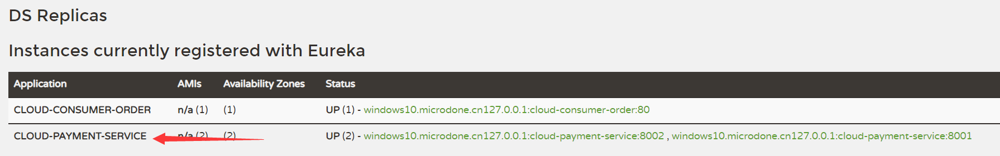
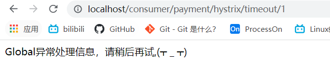
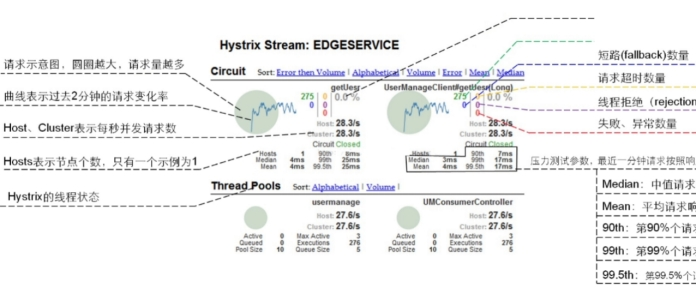
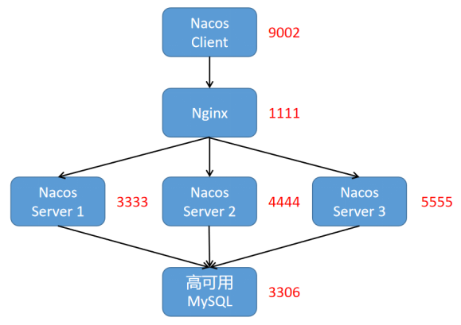
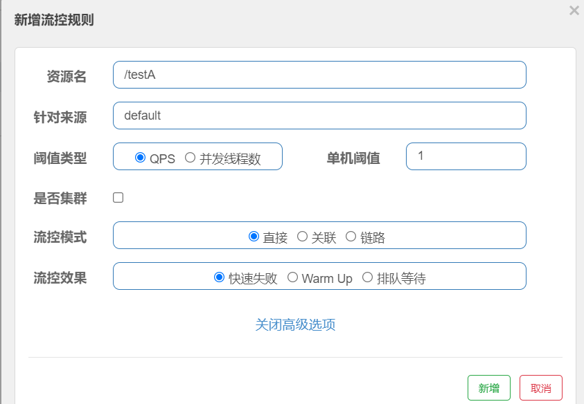
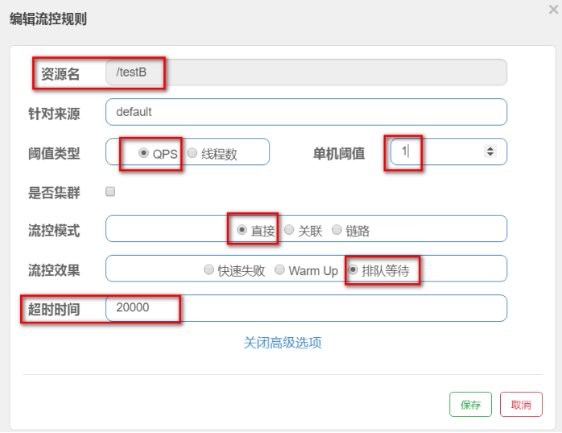
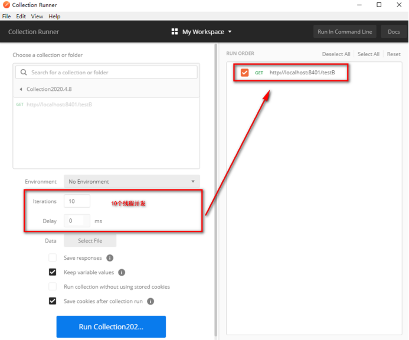

[Toc]

## 微服务架构框架简览

以前整个微服务架构由大量的技术框架和方案构成，比如

| 功能           | 框架                                                         |
| -------------- | ------------------------------------------------------------ |
| 服务基础开发   | SpringMVC、Spring、SpringBoot                                |
| 服务注册与发现 | Netfilx的Eureka,Apache的ZooKeeper                            |
| 服务调用       | Dubbo(RPC方式);Dubbox(Rest方式)；Ribbon(Rest方式)；Feign(Rest方式) |
| 分布式配置管理 | Disconf,Qconf,Diamond,Archaius                               |
| 负载均衡       | Ribbon                                                       |
| 服务熔断       | Hystrix                                                      |
| API网关        | Zuul                                                         |
| 批量任务       | Elastic-Job,Azkaban                                          |
| 服务跟踪       | Hydra,Zipkin                                                 |


## SpringCloud简介

> SpringCloud是什么
> SpringCloud是一个一站式的开发分布式系统的框架；以SpringBoot为基础，整合了常见的分布式模式的工具的框架。
> 其整合的模式工具类型有：配置管理、服务管理、断路器、智能路由，微代理，控制总线，全局锁，决策竞选，分布式会话和集群状态管理等。
>
> - **官网**：https://spring.io/
>
> - **SpringCloud版本标识**：采用伦敦的地铁站名称来作为版本号的命名，根据首字母排序，字母顺序靠后的版本号越大。
>
>   | 版本号    | 版本       | 说明                                                         |
>   | --------- | ---------- | ------------------------------------------------------------ |
>   | BUILD-XXX | 开发版     | 开发团队内部使用                                             |
>   | M         | 里程碑版   | MileStone,M1表示第1个里程碑版本，一般同事标注PRE,表示预览版  |
>   | RX        | 候选发布版 | Release Candidate,正式发布版的前一个观察期，不添加新功能，主要着重于除错 |
>   | SR        | 正式发布版 | ServiceRelease,SR1表示第1个正式版本，一般同时标注GA,表示稳定版本 |
>   | GA        | 稳定版     | 经过全面测试并可对外发行称之为GA(General Availability)       |
>
> - **子项目版本说明**
>   例如：Spring Cloud Alibaba 2.1.0.Release
>
>   - 2:	主版本号。当功能模块有较大更新或者整体架构发生变化时，主版本号会更新
>   - 1：	次版本号。次版本表示只是局部的一些变动
>   -0：	修改版本号。一般是bug的修复或者小的变动
>   -RELEASE:	希腊字母版本号。标注当前版本的软件处于哪个开发阶段
>
> - **希腊字母版本说明**
>
>   - Base设计阶段。只有相应的设计没有具体的功能实现；
>   - Alpha:软件的初级版本。存在较多的bug
>   - Beta:表示相对Alpha有了很大的进步，消除了严重的bug,还存在一些潜在的bug;
>   - Gamma:是Beta版做过一些修改，称为正式发布的候选版本(Release Candidate)
>   - Release:该版本表示最终版。


**【以下实例演示，父工程是为[03_SpringBoot项目创建](./03_SpringBoot项目创建.md)中创建，与其SpringBoot项目共用一个父工程。】**

## Eureka

### 基础知识

- **什么是服务治理**
  管理服务与服务之间的依赖关系，以实现<u>服务调用，负载均衡，容错</u>等，实现服务<u>发现与注册</u>
  传统的RPC远程调用框架中，管理每个服务与服务之间依赖关系比较复杂、所以需要进行服务治理
  SpringCloud封装了Netflix公司开发的Eureka模块来实现服务治理
  
  

### Eureka简介

- **简介**

> Eureka:CS设计架构，RPC远程调用框架为核心设计思想
> 
>
> **组成：**
> Eureka由多个instance(服务实例)组成，这些服务实例可以分为俩种：Eureka Server和Eureka Client。为了便于理解Eureka client再分为Service Provider 和 Service Consumer
>
> - EurekaServer 提供服务注册和发现；
> - Service Provider服务提供方，将自身服务注册到Euraka,从而使服务消费方能够找到；
> - Service Consumer服务消费方，从Eureka获取注册服务列表，从而能够消费服务。
>
> ```
> ### Eureka Server提供服务注册服务
> 各个微服务节点通过配置启动后，会在Eureka Server中进行注册，这样Eureka Server中的服务注册表中将会存储所有可用服务节点的信息，服务节点的信息可以在界面中直观看到。
> ### Eureka Client通过注册中心进行访问
> 是一个Java客户端，用于简化Eureka Server的交互，客户端同时也具备一个内置的、使用轮询（round-robin）负载算法的负载均衡器。在应用启动后，将会在Eureka Server发送心跳（默认周期30秒）。如果Eureka Server在多个心跳周期内没有收到某个节点的心跳，Eureka Server将会从服务注册表中把这个服务节点移出（默认90秒）
> ```
>
> 

- **Eureka与Zookeeper的区别**

> （1）Zookeeper是CP，分布式协同服务，突出一致性。对ZooKeeper的的每次请求都能得到一致的数据结果，但是无法保证每次访问服务可用性。如请求到来时，zookeer正在做leader选举，此时不能提供服务，即不满足A可用性。
>
> （2）Euereka是AP，高可用与可伸缩的Service发现服务，突出可用性。相对于Zookeeper而言，可能返回数据没有一致性，但是保证能够返回数据，服务是可用的。

### 单机Eureka构建

#### 1. 建Module：

> 创建Module:cloud-eureka-server
> 备注：父工程是为[04_SpringBoot项目创建](./04_SpringBoot项目创建.md)中创建，与其SpringBoot项目共用一个父工程。


#### 2. 修改POM

> 添加相关必须依赖

```
<?xml version="1.0" encoding="UTF-8"?>
<project xmlns="http://maven.apache.org/POM/4.0.0"
         xmlns:xsi="http://www.w3.org/2001/XMLSchema-instance"
         xsi:schemaLocation="http://maven.apache.org/POM/4.0.0 http://maven.apache.org/xsd/maven-4.0.0.xsd">
    <parent>
        <artifactId>cloud</artifactId>
        <groupId>com.joysun.springcloud</groupId>
        <version>1.0-SNAPSHOT</version>
    </parent>
    <modelVersion>4.0.0</modelVersion>

    <artifactId>cloud-eureka-server</artifactId>

    <dependencies>
        <dependency>
            <groupId>org.springframework.cloud</groupId>
            <artifactId>spring-cloud-starter-netflix-eureka-server</artifactId>
        </dependency>

        <dependency>
            <groupId>com.joysun.springcloud</groupId>
            <artifactId>cloud-api-commons</artifactId>
            <version>${project.version}</version>
        </dependency>
        <dependency>
            <groupId>org.springframework.boot</groupId>
            <artifactId>spring-boot-starter-web</artifactId>
        </dependency>
        <dependency>
            <groupId>org.springframework.boot</groupId>
            <artifactId>spring-boot-starter-actuator</artifactId>
        </dependency>
        <dependency>
            <groupId>org.springframework.boot</groupId>
            <artifactId>spring-boot-devtools</artifactId>
            <scope>runtime</scope>
            <optional>true</optional>
        </dependency>
        <dependency>
            <groupId>org.projectlombok</groupId>
            <artifactId>lombok</artifactId>
        </dependency>
        <dependency>
            <groupId>org.springframework.boot</groupId>
            <artifactId>spring-boot-starter-test</artifactId>
            <scope>test</scope>
        </dependency>
        <dependency>
            <groupId>junit</groupId>
            <artifactId>junit</artifactId>
        </dependency>
    </dependencies>
</project>
```

- **1.X和2.X的对比说明**

```
1.X版本
<dependency>
	<groupId>org.springframework.cloud</groupId>
	<artifactId>spring-cloud-starter-eureka</artifactId>
</dependency>

2.X版本
<dependency>
	<groupId>org.springframework.cloud</groupId>
	<artifactId>spring-cloud-starter-netflix-eureka-server</artifactId>
</dependency>
```

#### 3. YML配置

> 在项目resource下创建：src\main\resources\application.yml

```
server:
  port: 7001

eureka:
  instance:
    hostname: localhost

  client:
    register-with-eureka: false
    fetchRegistry: false
    service-url:
      defaultZone: http://localhost:7001/eureka
```

#### 4. 主启动

```
### 创建主启动类EurekaMain：src\main\java\com\joy\springcloud\EurekaMain.java

package com.joy.springcloud;

import org.springframework.boot.SpringApplication;
import org.springframework.boot.autoconfigure.SpringBootApplication;
import org.springframework.cloud.netflix.eureka.server.EnableEurekaServer;

@SpringBootApplication
@EnableEurekaServer //声明当前为微服务注册中心
public class EurekaMain {
    public static void main(String[] args) {
        SpringApplication.run(EurekaMain.class,args);
    }
}

```

#### 5. 测试

> 启动服务后，使用：http://localhost:7001/  链接服务，看是否可以正常访问Eureka页面
>
> 

### 服务提供者

#### 1. 建Module

> EurekaClient端cloud-provider-payment将注册进EurekaServer成为服务提供者provider
>
> 创建Module:cloud-provider-payment,此处直接使用[04_SpringBoot项目创建](./04_SpringBoot项目创建.md)中创建的cloud-provider-payment模块

#### 2. 修改POM

> 在cloud-provider-payment模块pom.xml添加eureka客户端组件
>
> ```
>  <dependency>
> 	 <groupId>org.springframework.cloud</groupId>
>  	 <artifactId>spring-cloud-starter-netflix-eureka-client</artifactId>
>  </dependency>
> ```

#### 3. 编辑YML

> 在cloud-provider-payment模块下的application.yml中添加
>
> ```
> eureka:
>   client:
>     register-with-eureka: true
>     fetchRegistry: true
>     service-url:
>       defaultZone: http://localhost:7001/eureka
> ```

#### 4. 主启动

> 在cloud-provider-payment模块的主启动类上添加注解：
>
> ```
> @SpringBootApplication
> @EnableEurekaClient
> public class PaymentMain {
>     public static void main(String[] args) {
>         SpringApplication.run(PaymentMain.class,args);
>     }
> }
> 
> ```

#### 5. 测试

> 先启动EurekaServer,然后查看：http://localhost:7001/
> 
>
> 可以从界面看到服务信息

### 服务消费者

> EurekaClient端cloud-consumer-order将注册进EurekaServer成为服务消费者consumer
> cloud-consumer-order原始module创建参见：[04_SpringBoot项目创建](./04_SpringBoot项目创建.md)

#### 1. 建Module

> 此处直接使用[04_SpringBoot项目创建](./04_SpringBoot项目创建.md)创建的cloud-consumer-order

#### 2. 修改POM

```
### 在cloud-consumer-order模块的pom.xml中添加eureka客户端启动包
<dependency>
	<groupId>org.springframework.cloud</groupId>
	<artifactId>spring-cloud-starter-netflix-eureka-client</artifactId>
</dependency>
```

#### 3. 编辑YML

```
### 在cloud-consumer-order模块的application.yml中添加eureka客户端注册服务配置
eureka:
  client:
    register-with-eureka: true
    fetchRegistry: true
    service-url:
      defaultZone: http://localhost:7001/eureka
```

#### 4. 主启动

> 在cloud-consumer-order模块的主启动类上添加@EnableEurekaClient注解

#### 5. 测试

> 1) 先要启动EurekaServer，7001服务
>
> 2) 再要启动服务提供者8001服务和服务消费者80服务
>
> 3 ）链接http://localhost:7001/ 查看eureka服务器，看是否能查看注册的俩个服务
>
>  
>
>  4) 测试消费者服务端查询&查询：http://localhost/consumer/payment/get/31
>
> 5) 测试提供者服务端查询&添加：postman测试：http://localhost:8001/payment/get/1
>
> 6) 测试结果：8001服务和80服务效果一样
>
> 

## Ribbon

### 简介

> Spring Cloud Ribbon是基于Netflix Ribbon实现的一套客户端负载均衡的工具。
>
> - **功能**：提供客户端的软件负载均衡算法和服务调用
>
> - **未来可能的替换方案**:Spring Cloud LoadBalancer
>
> - **功能详情说明**：LB（负载均衡）
>
>   1) 简单的说就是将用户的请求平均分配到多个服务器上，从而达到系统的HA(高可用)。
>
>   2) 常见的负载均衡有软件Nginx，LVS，硬件F5等。
>
>   **3)** Ribbon的本地负载均衡客户端 VS Nginx服务端负载均衡区别：
>
>   - Nginx是服务器负载均衡，客户端所有请求都会交给Nginx，然后，由nginx实现转发请求。即负载均衡是由服务器端完成的。
>
>   - Ribbon本地负载均衡，在调用微服务接口时候，会在注册中心上获取注册信息服务列表之后缓存到JVM本地，从而在本地实现RPC远程服务调用。
>
>   4) 集中式LB
>
>   ​     即在服务的消费方和提供方之间使用独立的LB设施（可以是硬件，如F5，也可以是软件，如Nginx）,由该设施负责把访问请求通过某种策略转发至服务的提供方；
>
>   5) 进程内LB
>
>   - 将LB逻辑集成到消费方，消费方从服务注册中心获知有哪些地址可用，然后自己再从这些地址中选择出一个合适的服务器。
>
>   - Ribbon就属于进程内LB，它只是一个类库，集成于消费方进程，消费方通过它来获取到服务提供方的地址。
>
>   **Ribbon=负载均衡+RestTemplate调用**
>
> - **架构说明**
>   Ribbon在工作时分成两步：
>
>   第一步，先选择EurekaServer，它优先选择在同一个区域内负载较少的server。
>
>   第二步，再根据用户指定的策略，在从server取到的服务注册列表中选择一个地址。其中Ribbon提供了多种策略。比如：轮询、随机和根据响应时间加权。
>
>   总结：Ribbon其实就是一个软负载均衡的客户端组件，他可以和其他所需请求的客户端结合使用，和eureka结合只是其中的一个实例。

#### Ribbon核心组件Irule


> **IRule：根据特定算法从服务列表中选取一个要访问的服务**
>
> 1. com.netflix.loadbalancer.RoundRobinRule 轮询，默认策略。
>
> 2. com.netflix.loadbalancer.RandomRule 随机
>
> 3. com.netflix.loadbalancer.RetryRule 先按照RoundRobinRule的策略获取服务，如果获取服务失败则在指定时间内会进行重试，获取可用的服务 
>
> 4. WeightedResponseTimeRule  对RoundRobinRule的扩展，响应速度越快的实例选择权重越大，越容易被选择
>
> 5. BestAvailableRule 会先过滤掉由于多次访问故障而处于断路器跳闸状态的服务，然后选择一个并发量最小的服务
>
> 6. AvailabilityFilteringRule 先过滤掉故障实例，再选择并发较小的实例
>
> 7. ZoneAvoidanceRule 默认规则，复合判断server所在区域的性能和server的可用性选择服务器

- **配置细节注意事项**

> 官方文档明确给出警告：
>
> [https://cloud.spring.io/spring-cloud-static/Hoxton.SR1/reference/htmlsingle/#customizing-the-ribbon-client](#customizing-the-ribbon-client)
>
>  
>
> 这个自定义配置类不能放在@ComponentScan所扫描的当前包下以及子包下，否则我们自定义的这个配置类就会被所有的Ribbon客户端所共享，达不到特殊化订制的目的了。

### 1. POM

```
<dependency>
	<groupId>org.springframework.cloud</groupId>
	<artifactId>spring-cloud-starter-netflix-ribbon</artifactId>
</dependency>

注意：这个不需要手动引用，Eureka客户端自带Ribbon

```


### 2. 创建多服务环境

> 1. 构建一个端口号为8002的服务
>
> 新建一个module,名称cloud-provider-payment8002，将cloud-provider-payment项目下内容复制一份放到cloud-provider-payment8002模块下。修改cloud-provider-payment8002的application.yml服务端口为8002，修改pom.xml项目名。重新导入依赖。相当于多了一个8002端口的服务
>
> 为了测试调用的是哪个端口，添加相关端口打印信息
>
> ```
> @RestController
> @Slf4j
> @EnableAutoConfiguration
> public class PaymentController {
>     @Autowired
>     private PaymentService paymentService;
>     @Value("${server.port}")
>     private String port;  //获取端口值
> ```
>
> 2. 在消费者服务的远程调用类上添加负载均衡注解：该注解表示通过注册中心，获取服务列表，远程调用采用负载均衡(LB)
>
>    
>
>    
>
> 3. 修改消费者服务远程调用路径为服务提供者端口
>
>    
>    
>
> 4. 启动Ereka服务，服务提供者服务，服务消费者服务。查看在ereaka界面是否可以看到相应的服务是否已注册，并测试服务是否正常,如`http://localhost:8001/payment/get/1`
>
> 5. 使用客户端连接:http://localhost/consumer/payment/get/31访问服务，查询数据，测试负载均衡是否启用
>    
>    
>
>    可以查看到，同一连接地址多次查询的调用的服务会不同，说明负载均衡正常。

### 3. 自定义负载均衡规则

#### 3.1 创建新的目录包

`com.joy.myrule`


#### 3.2 新建规则类


```
package com.joy.myrule;

import com.netflix.loadbalancer.IRule;
import com.netflix.loadbalancer.RandomRule;
import org.springframework.context.annotation.Configuration;

@Configuration
public class MyselfRule {

    public IRule myRule(){
        return new RandomRule();//定义规则为随机
    }
}

```

#### 3.3 主启动类添加@RibbonClient

```
package com.joy.springcloud;

import com.joy.myrule.MyselfRule;
import org.springframework.boot.SpringApplication;
import org.springframework.boot.autoconfigure.SpringBootApplication;
import org.springframework.cloud.netflix.eureka.EnableEurekaClient;
import org.springframework.cloud.netflix.ribbon.RibbonClient;

@SpringBootApplication
@EnableEurekaClient
@RibbonClient(name="CLOUD-PAYMENT-SERVICE",configuration = MyselfRule.class)//添加自定义规则
public class OrderMain {
    public static void main(String[] args) {
        SpringApplication.run(OrderMain.class,args);
    }
}

```

#### 3.4 测试

> 重新启动服务，查看服务调用采用的负载均衡规则是否为自定义的规则
>
> http://localhost/consumer/payment/get/1

### 4. Ribbon轮询原理


## OpenFeign

### 简介

> - Feign是一个声明式的web服务客户端，让编写web服务客户端变得非常容易，只需创建一个接口并在接口上添加注解即可
>
> - SpringCloud对Feign进行了封装，使其支持了SpringMVC标准注解和HttpMessageConverters。Feign可以与Eureka和Ribbon组合使用以支持负载均衡。
>
> [https://cloud.spring.io/spring-cloud-static/Hoxton.SR1/reference/htmlsingle/#spring-cloud-openfeign](#spring-cloud-openfeign)
>
> https://github.com/spring-cloud/spring-cloud-openfeign
>
> - **Feign集成了 Ribbon**
>
>   利用Ribbon维护了Payment的服务列表信息，并且通过轮询实现了客户端的负载均衡。而与Ribbon不同的是，通过Feign只需要定义服务绑定接口且以声明式的方法，优雅而简单的实现了服务调用。
>
> - **Feign和OpenFeign两者区别**
>   
>
> - **OpenFeign使用步骤**:微服务调用接口+@FeignClient
>
>   


### 1. 新建模块：cloud-consumer-feign-order80


### 2. 修改POM

> **注意：openFeign也是自带bibbon**

```
<?xml version="1.0" encoding="UTF-8"?>
<project xmlns="http://maven.apache.org/POM/4.0.0"
         xmlns:xsi="http://www.w3.org/2001/XMLSchema-instance"
         xsi:schemaLocation="http://maven.apache.org/POM/4.0.0 http://maven.apache.org/xsd/maven-4.0.0.xsd">
    <parent>
        <artifactId>cloud</artifactId>
        <groupId>com.joysun.springcloud</groupId>
        <version>1.0-SNAPSHOT</version>
    </parent>
    <modelVersion>4.0.0</modelVersion>

    <artifactId>cloud-consumer-feign-order80</artifactId>

    <dependencies>
        <!--openfeign-->
        <dependency>
            <groupId>org.springframework.cloud</groupId>
            <artifactId>spring-cloud-starter-openfeign</artifactId>
        </dependency>
        <dependency>
            <groupId>org.springframework.cloud</groupId>
            <artifactId>spring-cloud-starter-netflix-eureka-client</artifactId>
        </dependency>
        <dependency>
            <groupId>com.joysun.springcloud</groupId>
            <artifactId>cloud-api-commons</artifactId>
            <version>${project.version}</version>
        </dependency>
        <dependency>
            <groupId>org.springframework.boot</groupId>
            <artifactId>spring-boot-starter-web</artifactId>
        </dependency>
        <dependency>
            <groupId>org.springframework.boot</groupId>
            <artifactId>spring-boot-starter-actuator</artifactId>
        </dependency>
        <dependency>
            <groupId>org.springframework.boot</groupId>
            <artifactId>spring-boot-devtools</artifactId>
            <scope>runtime</scope>
            <optional>true</optional>
        </dependency>
        <dependency>
            <groupId>org.projectlombok</groupId>
            <artifactId>lombok</artifactId>
            <optional>true</optional>
        </dependency>
        <dependency>
            <groupId>org.springframework.boot</groupId>
            <artifactId>spring-boot-starter-test</artifactId>
            <scope>test</scope>
        </dependency>
    </dependencies>
</project>
```

### 3. YML配置

```
server:
  port: 80
spring:
  application:
    name: cloud-consumer-feign-order80
eureka:
  client:
    register-with-eureka: true
    fetch-registry: true
    service-url:
      defaultZone: http://localhost:7001/eureka
```

### 4. 主启动类

```
package com.joy.springcloud;

import org.springframework.boot.SpringApplication;
import org.springframework.boot.autoconfigure.SpringBootApplication;
import org.springframework.cloud.netflix.eureka.EnableEurekaClient;
import org.springframework.cloud.openfeign.EnableFeignClients;


@SpringBootApplication
@EnableEurekaClient
@EnableFeignClients
public class OrderFeignMain {
    public static void main(String[] args) {
        SpringApplication.run(OrderFeignMain.class,args);
    }
}


```

### 5. 业务类

#### 5.1 新建PaymentFeignService接口并新增注解@FeignClient

> 业务逻辑接口+@FeignClient配置调用provider服务

```
package com.joy.springcloud.service;

import com.joy.springcloud.entities.CommonResult;
import org.springframework.cloud.openfeign.FeignClient;
import org.springframework.stereotype.Component;
import org.springframework.web.bind.annotation.GetMapping;
import org.springframework.web.bind.annotation.PathVariable;

@Component
@FeignClient(value = "CLOUD-PAYMENT-SERVICE")
public interface PaymentFeignService {
    @GetMapping(value = "/payment/get/{id}")
    public CommonResult getPaymentById(@PathVariable("id") Long id);
}

```

#### 5.2  控制层Controller

```
package com.joy.springcloud.service;

import com.joy.springcloud.entities.CommonResult;
import org.springframework.cloud.openfeign.FeignClient;
import org.springframework.stereotype.Component;
import org.springframework.web.bind.annotation.GetMapping;
import org.springframework.web.bind.annotation.PathVariable;

@Component
@FeignClient(value = "CLOUD-PAYMENT-SERVICE")
public interface PaymentFeignService {
    @GetMapping(value = "/payment/get/{id}")
    public CommonResult getPaymentById(@PathVariable("id") Long id);
}

```

项目结构


### 6. 测试

> 1. 先启动Eureka7001
>
> 2. 再启动2个微服务8001/8002
>
> 3. 启动OpenFeign微服务：cloud-consumer-feign-order80
>
> 4. http://localhost/consumer/payment/get/31 查看测试是否正常，以及负载均衡是否正常
>
> 5. Feign自带负载均衡配置项

### OpenFeign超时控制

#### 1.演示 超时设置

> 为了演示超时情况，故意设置超时出错情况
>
> ```
> ### 1. 服务提供方8001故意写暂停程序
> @GetMapping(value = "/payment/feign/timeout")
>     public String paymentFeignTimeout(){
>         try { 
>             TimeUnit.SECONDS.sleep(3);//单位秒
>         }catch (Exception e) {
>             e.printStackTrace();
>         } 
>         return port;
>     }
>     
> ### 2. 服务消费方cloud-consumer-feign-order80添加在PaymentFeignService添加超时接口
> @GetMapping(value = "/payment/feign/timeout")
>  public String paymentFeignTimeout();
>  
>  ### 3. 服务消费方cloud-consumer-feign-order80在OrderFeignController添加超时方法
>  @GetMapping(value = "/consumer/payment/feign/timeout")
>     public String paymentFeignTimeout(){
>         return paymentFeignService.paymentFeignTimeout();
>     }
> ```
>
> - **测试** 
>
> http://localhost/consumer/payment/feign/timeout
>
> 错误页面，OpenFeign默认等待一秒钟，超过后报错
> 原因：默认Feign客户端只等待一秒钟，但是，服务端处理需要超过1秒钟，导致Feign客户端不想等待了，直接报错。
>
> 

#### 2. 开启OpenFeign客户端超时控制

> - **Feign设置超时时间**
>   使用Feign调用接口分两层，ribbon的调用和hystrix的调用，所以ribbon的超时时间和Hystrix的超时时间的结合就是Feign的超时时间
> - **在YML文件中设置Feign超时时间**
>
> ```
> #设置Feign客户端超时时间（openfeign默认支持ribbon）
> ribbon:
>   ReadTimeout:  3000
>   ConnectTimeout: 3000
>   MaxAutoRetries: 1 #同一台实例最大重试次数,不包括首次调用
>   MaxAutoRetriesNextServer: 1 #重试负载均衡其他的实例最大重试次数,不包括首次调用
>   OkToRetryOnAllOperations: false  #是否所有操作都重试
> #hystrix的超时时间
> hystrix:
>   command:
>     default:
>       execution:
>         timeout:
>           enabled: true
>         isolation:
>           thread:
>             timeoutInMilliseconds: 9000
>             
>          
> 
> ```
>
>  **一般情况下 都是 ribbon 的超时时间（<）hystrix的超时时间（因为涉及到ribbon的重试机制）**
> **因为ribbon的重试机制和Feign的重试机制有冲突，所以源码中默认关闭Feign的重试机制，源码如下**
>
> 
>
> **要开启Feign的重试机制如下**：（Feign默认重试五次 源码中有）
>
> ```
> @Bean
> Retryer feignRetryer() {
>         return  new Retryer.Default();
> }
> ```
>
> 根据上面的参数计算重试的次数：`MaxAutoRetries+MaxAutoRetriesNextServer+(MaxAutoRetries *MaxAutoRetriesNextServer) `即重试3次 则一共产生4次调用
>
> 如果在重试期间，时间超过了hystrix的超时时间，便会立即执行熔断，fallback。所以要根据上面配置的参数计算hystrix的超时时间，使得在重试期间不能达到hystrix的超时时间，不然重试机制就会没有意义
>
> hystrix超时时间的计算：` (1 + MaxAutoRetries + MaxAutoRetriesNextServer) * ReadTimeout` 即按照以上的配置 hystrix的超时时间应该配置为 （1+1+1）*3=9秒
>
> 当ribbon超时后且hystrix没有超时，便会采取重试机制。当`OkToRetryOnAllOperations`设置为false时，只会对get请求进行重试。如果设置为true，便会对所有的请求进行重试，如果是put或post等写操作，如果服务器接口没做幂等性，会产生不好的结果，所以OkToRetryOnAllOperations慎用。
>
> 如果不配置ribbon的重试次数，默认会重试一次
>
> **注意：**
>
> **默认情况下,GET方式请求无论是连接异常还是读取异常,都会进行重试**
> **非GET方式请求,只有连接异常时,才会进行重试**

## OpenFeign日志打印功能

#### 1. 简介

> Feign提供了日志打印功能，我们可以通过配置来调整日志级别，从而了解Feign中Http请求的细节。就是对Feign接口的调用情况进行监控和输出。
>
> - **日志级别**
>
>   - NONE：默认的，不显示任何日志
>
>   - BASIC：仅记录请求方法、URL、响应状态码及执行时间
>
>   - HEADERS：除了BASIC中定义的信息之外，还有请求和响应的头信息
>
>   - FULL：除了HEADERS中定义的信息之外，还有请求和响应的正文及元数据

#### 2. 配置日志bean


```
package com.joy.springcloud.config;

import feign.Logger;
import org.springframework.context.annotation.Bean;
import org.springframework.context.annotation.Configuration;


@Configuration
public class FeignConfig {
    @Bean
    public Logger.Level feignLoggerLevel(){
        return Logger.Level.FULL;
    }
}
```

#### 3. YML文件日志配置

> 配置需要开启Feign日志的客户端
>
> ```
> logging:
>   level:
>     com.joy.springcloud.service.PaymentFeignService: debug
> ```

#### 4. 测试

> - **后台日志查看**
>
> 访问：http://localhost/consumer/payment/get/31，查看后台日志
>
> 

## Hytrix

### 简介

#### 服务雪崩

> 多个微服务之间调用的时候，假如微服务A调用微服务B和微服务C，微服务B和微服务C又调用其他的微服务，这就是所谓的"扇出"。
>
> 如果扇出的链路上某个微服务的调用响应的时间过长或者不可用，对微服A的调用就会占用越来越多的系统资源，进而引起系统崩溃，所谓的"雪崩效应"。
>
> 对于高流量的应用来说，单一的后端依赖可能会导致所有的服务器上的所有资源都在几秒钟内饱和。比失败更糟糕的是，这些应用程序还可能导致服务之间的延迟增加，备份队列，线程和其他系统资源紧张，导致整个系统发生更多的级联故障。这些都表示需要对故障和延迟进行***\*隔离和管理\****，以便单个依赖关系的失败，不能取消整个应用程序或系统。
>
> 所以，通常当你发现一个模块下的某个实例失败后，这时候这个模块依然还会接收流量，然后这个有问题的模块还调用了其他的模块，这样就会发生级联故障，或者叫雪崩

#### Hytrix作用

> Hystrix是一个用于处理分布式系统的延迟和容错的开源库，在分布式系统里，许多依赖不可避免的会调用失败，比如超时、异常等，
>
> Hystrix能够保证在一个依赖出问题的情况下，不会导致整体服务失败，避免级联故障，以提高分布式系统的弹性。
>
> “断路器”本身是一种开关装置，当某个服务单元发生故障之后，通过断路器的故障监控（类似熔断保险丝），向调用方返回一个符合预期的、可处理的备选响应（Fallback），而不是长时间的等待或者抛出调用方无法处理的异常，这样就保证了服务调用方的线程不会被长时间、不必要地占用，从而避免了故障在分布式系统中的蔓延，乃至雪崩。
>
> 目前Hytrix已经停止维护
>
> - **功能**
>   - 服务降级
>   - 服务熔断
>   - 接近实时的监控

#### 服务降级Fallback

> 服务器忙，请稍候再试，不让客户端等待并立刻返回一个友好提示

> - **触发降级的情况**
>   - 程序运行异常
>   - 超时自动降级
>   - 服务熔断触发服务降级
>   - 线程池/信号量打满也会导致服务降级
>   - 人工降级

#### 服务熔断Breaker

> 类比保险丝达到最大服务访问后，直接拒绝访问，拉闸限电，然后调用服务降级的方法并返回友好提示
>
> - 就是保险丝: 服务的降级->进而熔断->恢复调用链路

#### 服务限流Flowlimit

> 秒杀高并发等操作，严禁一窝蜂的过来拥挤，大家排队，一秒钟N个，有序进行

### 构建

#### 1. 新建模块

> 新建Module：cloud-provider-hystrix-payment8001

#### 2. 修改POM

> 添加依赖

```
<?xml version="1.0" encoding="UTF-8"?>
<project xmlns="http://maven.apache.org/POM/4.0.0"
         xmlns:xsi="http://www.w3.org/2001/XMLSchema-instance"
         xsi:schemaLocation="http://maven.apache.org/POM/4.0.0 http://maven.apache.org/xsd/maven-4.0.0.xsd">
    <parent>
        <artifactId>cloud</artifactId>
        <groupId>com.joysun.springcloud</groupId>
        <version>1.0-SNAPSHOT</version>
    </parent>
    <modelVersion>4.0.0</modelVersion>

    <artifactId>cloud-provider-hystrix-payment8001</artifactId>

    <dependencies>
        <!--新增hystrix-->
        <dependency>
            <groupId>org.springframework.cloud</groupId>
            <artifactId>spring-cloud-starter-netflix-hystrix</artifactId>
        </dependency>
        <dependency>
            <groupId>org.springframework.cloud</groupId>
            <artifactId>spring-cloud-starter-netflix-eureka-client</artifactId>
        </dependency>
        <dependency>
            <groupId>com.joysun.springcloud</groupId>
            <artifactId>cloud-api-commons</artifactId>
            <version>${project.version}</version>
        </dependency>
        <dependency>
            <groupId>org.springframework.boot</groupId>
            <artifactId>spring-boot-starter-web</artifactId>
        </dependency>
        <dependency>
            <groupId>org.springframework.boot</groupId>
            <artifactId>spring-boot-starter-actuator</artifactId>
        </dependency>
        <dependency>
            <groupId>org.springframework.boot</groupId>
            <artifactId>spring-boot-devtools</artifactId>
            <scope>runtime</scope>
            <optional>true</optional>
        </dependency>
        <dependency>
            <groupId>org.projectlombok</groupId>
            <artifactId>lombok</artifactId>
            <optional>true</optional>
        </dependency>
        <dependency>
            <groupId>org.springframework.boot</groupId>
            <artifactId>spring-boot-starter-test</artifactId>
            <scope>test</scope>
        </dependency>
    </dependencies>

</project>
```

#### 3. YML配置

> 

```
server:
  port: 8001

spring:
  application:
    name: cloud-hystrix-payment-service

eureka:
  client:
    register-with-eureka: true
    fetch-registry: true
    service-url:
      defaultZone: http://localhost:7001/eureka/
```

#### 4. 主启动

```
package com.joy.springcloud;


import org.springframework.boot.SpringApplication;
import org.springframework.boot.autoconfigure.SpringBootApplication;
import org.springframework.cloud.netflix.eureka.EnableEurekaClient;

@SpringBootApplication
@EnableEurekaClient
public class PaymentHytrixMain {
    public static void main(String[] args) {
        SpringApplication.run(PaymentHytrixMain.class,args);
    }
}

```

#### 5. 业务类

- **接口**

  > service.PaymentService

```
package com.joy.springcloud.service;


public interface PaymentService {
    public String paymentInfo_OK(Integer id);
    public String paymentInfo_TimeOut(Integer id);
}

```

- **实现类**

```
package com.joy.springcloud.service.impl;

import com.joy.springcloud.service.PaymentService;
import org.springframework.stereotype.Service;

import java.util.concurrent.TimeUnit;

@Service
public class PaymentServiceImpl implements PaymentService {
    @Override
    public String paymentInfo_OK(Integer id) {
        return "线程池："+Thread.currentThread().getName()+"   paymentInfo_OK,id：  "+id+"\t"+"哈哈哈"  ;
    }

    @Override
    public String paymentInfo_TimeOut(Integer id) {
        int timeNumber = 3;
        try {
            TimeUnit.SECONDS.sleep(timeNumber);
        }catch (Exception e) {
            e.printStackTrace();
        }
        return "线程池："+Thread.currentThread().getName()+"   paymentInfo_TimeOut,id：  "+id+"\t"+"呜呜呜"+" 耗时(秒)"+timeNumber;
    }
}

```

- **Controller**

```
package com.joy.springcloud.controller;

import com.joy.springcloud.service.PaymentService;
import lombok.extern.slf4j.Slf4j;
import org.springframework.beans.factory.annotation.Value;
import org.springframework.web.bind.annotation.GetMapping;
import org.springframework.web.bind.annotation.PathVariable;
import org.springframework.web.bind.annotation.RestController;

import javax.annotation.Resource;

@RestController
@Slf4j
public class PaymentController {
    @Resource
    private PaymentService paymentService;
    @Value("${server.port}")
    private String server_port;

    @GetMapping("/payment/hystrix/ok/{id}")
    public String paymentInfo_OK(@PathVariable("id") Integer id){
        String result = paymentService.paymentInfo_OK(id);
        log.info("*******result:"+result);
        return result;
    }
    @GetMapping("/payment/hystrix/timeout/{id}")
    public String paymentInfo_TimeOut(@PathVariable("id") Integer id){
        String result = paymentService.paymentInfo_TimeOut(id);
        log.info("*******result:"+result);
        return result;
    }
}

```

#### 6. 正常测试

> 1.  启动eureka7001
>
> 2. 启动cloud-provider-hystrix-payment8001
>
> 3. 访问： http://localhost:8001/payment/hystrix/ok/31
>
> 每次调用耗费3秒钟： http://localhost:8001/payment/hystrix/timeout/31
>
> 4. 上述module均OK 以上述为根基平台，从正确->错误->降级熔断->恢复

### 高并发测试

#### 1. Jmeter压测测试

> 1. 下载Jmeter包：https://archive.apache.org/dist/jmeter/binaries/
>    
>
> 2. 将压缩包解压后，便可直接使用
>    
>
>    在windows环境下，可以直接双击jmeter.bat直接运行，也可以在该目录下，直接cmd打开win命令界面运行。运行后会出现Jmeter的操作界面
>
>    
>
> 3. 添加测试计划
>
> 
>
> 4. 添加线程组相关设置
>
>    
>
>    添加线程Http请求
>    
>    
>
> 5. 压测的过程中再来访问一下微服务
>
> http://localhost:8001/payment/hystrix/ok/31
>
> http://localhost:8001/payment/hystrix/timeout/31
>
>  **演示结果**：请求一直处于转圈，处于等待状态。
>
> 原因：tomcat的默认的工作线程数被打满了，没有多余的线程来分解压力和处理。

### 构建高并发环境

#### 1. 创建模块

> 创建消费者模块：cloud-consumer-feign-hystrix-order80

#### 2. POM

> 添加依赖组件

```
<?xml version="1.0" encoding="UTF-8"?>
<project xmlns="http://maven.apache.org/POM/4.0.0"
         xmlns:xsi="http://www.w3.org/2001/XMLSchema-instance"
         xsi:schemaLocation="http://maven.apache.org/POM/4.0.0 http://maven.apache.org/xsd/maven-4.0.0.xsd">
    <parent>
        <artifactId>cloud</artifactId>
        <groupId>com.joysun.springcloud</groupId>
        <version>1.0-SNAPSHOT</version>
    </parent>
    <modelVersion>4.0.0</modelVersion>

    <artifactId>cloud-consumer-feign-hystrix-order80</artifactId>


    <dependencies>
        <!--新增hystrix-->
        <dependency>
            <groupId>org.springframework.cloud</groupId>
            <artifactId>spring-cloud-starter-netflix-hystrix</artifactId>
        </dependency>
        <dependency>
            <groupId>org.springframework.cloud</groupId>
            <artifactId>spring-cloud-starter-openfeign</artifactId>
        </dependency>
        <dependency>
            <groupId>org.springframework.cloud</groupId>
            <artifactId>spring-cloud-starter-netflix-eureka-client</artifactId>
        </dependency>
        <dependency>
            <groupId>com.joysun.springcloud</groupId>
            <artifactId>cloud-api-commons</artifactId>
            <version>${project.version}</version>
        </dependency>
        <dependency>
            <groupId>org.springframework.boot</groupId>
            <artifactId>spring-boot-starter-web</artifactId>
        </dependency>
        <dependency>
            <groupId>org.springframework.boot</groupId>
            <artifactId>spring-boot-starter-actuator</artifactId>
        </dependency>
        <dependency>
            <groupId>org.springframework.boot</groupId>
            <artifactId>spring-boot-devtools</artifactId>
            <scope>runtime</scope>
            <optional>true</optional>
        </dependency>
        <dependency>
            <groupId>org.projectlombok</groupId>
            <artifactId>lombok</artifactId>
            <optional>true</optional>
        </dependency>
        <dependency>
            <groupId>org.springframework.boot</groupId>
            <artifactId>spring-boot-starter-test</artifactId>
            <scope>test</scope>
        </dependency>
    </dependencies>
</project>
```

#### 3. YML

```
server:
  port: 80

spring:
  application:
    name: cloud-consumer-feign-hystrix-order80

eureka:
  client:
    register-with-eureka: true    #表识不向注册中心注册自己
    fetch-registry: true   #表示自己就是注册中心，职责是维护服务实例，并不需要去检索服务
    service-url:
      defaultZone: http://localhost:7001/eureka/

```

#### 4. 主启动类

```
package com.joysun.springcloud;

import lombok.extern.slf4j.Slf4j;
import org.springframework.boot.SpringApplication;
import org.springframework.boot.autoconfigure.SpringBootApplication;
import org.springframework.cloud.netflix.eureka.EnableEurekaClient;
import org.springframework.cloud.openfeign.EnableFeignClients;


@SpringBootApplication
@EnableEurekaClient
@EnableFeignClients
public class OrderHystrixMain80 {
    public static void main(String[] args) {
        SpringApplication.run(OrderHystrixMain80.class,args);
    }
}


```

#### 5. 业务类

1) service类

```
package com.joysun.springcloud.service;

import org.springframework.cloud.openfeign.FeignClient;
import org.springframework.stereotype.Component;
import org.springframework.web.bind.annotation.GetMapping;
import org.springframework.web.bind.annotation.PathVariable;

@Component
@FeignClient("CLOUD-PROVIDER-HYSTRIX-PAYMENT-SERVICE")
public interface PaymentHytrixService {
    @GetMapping("/payment/hystrix/ok/{id}")
    public String paymentInfo_OK(@PathVariable("id") Integer id);

    @GetMapping("/payment/hystrix/timeout/{id}")
    public String paymentInfo_TimeOut(@PathVariable("id") Integer id);

}


```


2）controller

```
package com.joysun.springcloud.controller;

import com.joysun.springcloud.service.PaymentHytrixService;
import lombok.extern.slf4j.Slf4j;
import org.springframework.web.bind.annotation.GetMapping;
import org.springframework.web.bind.annotation.PathVariable;
import org.springframework.web.bind.annotation.RestController;

import javax.annotation.Resource;


@RestController
@Slf4j
public class OrderHystrixController {
    @Resource
    private PaymentHytrixService paymentHytrixService;


    @GetMapping("/consumer/payment/hystrix/ok/{id}")
    public String paymentInfo_OK(@PathVariable("id") Integer id){
        String result = paymentHytrixService.paymentInfo_OK(id);
        log.info("*******result:"+result);
        return result;
    }
    @GetMapping("/consumer/payment/hystrix/timeout/{id}")
    public String paymentInfo_TimeOut(@PathVariable("id") Integer id){
        String result = paymentHytrixService.paymentInfo_TimeOut(id);
        log.info("*******result:"+result);
        return result;
    }
}

```

#### 6. 正常测试

> 连接：http://localhost/consumer/payment/hystrix/ok/31

#### 7. 高并发测试

> 1. 2W个线程压8001
>
> 2. 消费端80微服务再去访问正常的OK微服务8001地址
>
> 3. http://localhost/consumer/payment/hystrix/timeout/32
>
> 4. 消费者80,要么转圈圈等待,要么消费端报超时错误
>
> 

#### 8. 故障现象和导致原因

> - 8001同一层次的其他接口服务被困死，因为tomcat线程里面的工作线程已经被挤占完毕
>
> - 80此时调用8001，客户端访问响应缓慢，转圈圈

#### 9. 解决方案

> 1. 超时导致服务器变慢（转圈）:超时不再等待
>
> 2.  出错（宕机或程序运行出错）:出错要有兜底
>
> 3. 解决
>
>  1）对方服务（8001）超时/down机了，调用者（80）不能一直卡死等待，必须有服务降级
>
> 2） 对方服务（8001）OK，调用者（80）自己出故障或有自我要求（自己的等待时间小于服务提供者），自己处理降级

### 服务降级

#### 服务提供者降级

> 利用`@HystrixCommand`注解，设置自身调用超时时间的峰值，峰值内可以正常运行，超过了需要有兜底的方法处理，作服务降级fallback
>
> > 修改模块为：cloud-provider-hystrix-payment8001
>
> 1. 在服务提供者的服务实现类中:使用`@HystrixCommand`设置超时时间，以及超时处理方法.
>     一旦调用服务方法失败并抛出了错误信息后，会自动调用@HystrixCommand标注好的fallbackMethod调用类中的指定方法
>
> ```
> package com.joy.springcloud.service.impl;
> 
> import com.joy.springcloud.service.PaymentService;
> import com.netflix.hystrix.contrib.javanica.annotation.HystrixCommand;
> import com.netflix.hystrix.contrib.javanica.annotation.HystrixProperty;
> import org.springframework.stereotype.Service;
> 
> import java.util.concurrent.TimeUnit;
> 
> @Service
> public class PaymentServiceImpl implements PaymentService {
>     @Override
>     public String paymentInfo_OK(Integer id) {
>         return "线程池："+Thread.currentThread().getName()+"   paymentInfo_OK,id：  "+id+"\t"+"哈哈哈"  ;
>     }
> 
>     //超时降级演示
>     @HystrixCommand(fallbackMethod = "payment_TimeoutHandler",commandProperties = {
>             @HystrixProperty(name="execution.isolation.thread.timeoutInMilliseconds",value="5000") //5秒钟以内就是正常的业务逻辑
>     })
>     @Override
>     public String paymentInfo_TimeOut(Integer id) {
>         int timeNumber = 3;
>         try {
>             TimeUnit.SECONDS.sleep(timeNumber);
>         }catch (Exception e) {
>             e.printStackTrace();
>         }
>         return "线程池："+Thread.currentThread().getName()+"   paymentInfo_TimeOut,id：  "+id+"\t"+"呜呜呜"+" 耗时(秒)"+timeNumber;
>     }
> 
>     //兜底方法，上面方法出问题,我来处理，返回一个出错信息。兜底方法的返回值类型和参数，需与原调用方法一致
>     public String payment_TimeoutHandler(Integer id) {
>         return "线程池："+Thread.currentThread().getName()+" payment_TimeoutHandler,系统繁忙,请稍后再试\t o(╥﹏╥)o ";
>     }
> }
> 
> ```
>
> 2. 在主启动类上添加注解`@EnableCircuitBreaker` 
>
>    ```
>    @SpringBootApplication
>    @EnableEurekaClient
>    @EnableCircuitBreaker
>    public class PaymentHytrixMain {
>        public static void main(String[] args) {
>            SpringApplication.run(PaymentHytrixMain.class,args);
>        }
>    }
>    ```
>
> 3. 测试：http://localhost:8001/payment/hystrix/timeout/31
>    结果：

#### 服务消费者端降级

> 注意：服务降级可以在服务提供者侧，也可以在服务消费者侧。更多是在服务消费者侧。
> 我们自己配置过的热部署方式对java代码的改动明显，但对@HystrixCommand内属性的修改建议重启微服务

> 修改模块：`cloud-consumer-feign-hystrix-order80`
>
> 1. **YML**
>
>    ```
>    feign:
>      hystrix:
>        enabled: true #如果处理自身的容错就开启。开启方式与生产端不一样
>    ```
>
> 2. **主启动类**
>    添加注解`@EnableHystrix`
>
>    ```
>    @SpringBootApplication
>    @EnableEurekaClient
>    @EnableFeignClients
>    @EnableHystrix
>    public class OrderHystrixMain80 {
>        public static void main(String[] args) {
>            SpringApplication.run(OrderHystrixMain80.class,args);
>        }
>    }
>    ```
>
> 3. **业务类**：`OrderHystrixController`
>
>    ```
>     @HystrixCommand(fallbackMethod = "payment_TimeoutHandler",commandProperties = {@HystrixProperty(name="execution.isolation.thread.timeoutInMilliseconds",value="1500")})
>        @GetMapping("/consumer/payment/hystrix/timeout/{id}")
>        public String paymentInfo_TimeOut(@PathVariable("id") Integer id){
>            String result = paymentHytrixService.paymentInfo_TimeOut(id);
>            log.info("*******result:"+result);
>            return result;
>        }
>    
>        //兜底方法，上面方法出问题,我来处理，返回一个出错信息
>        public String payment_TimeoutHandler(Integer id) {
>            return "我是消费者80,对方支付系统繁忙请10秒后再试。或自己运行出错，请检查自己。";
>        }
>    ```
>
> 4. **测试超时**
>
>    http://localhost/consumer/payment/hystrix/timeout/1
>
>     

#### 目前问题&解决方案

> 上述项目降级的处理方式存在的问题：每个业务方法对应一个兜底的方法，代码膨胀，代码耦合
>
> - **解决方案**：
>   1. 统一通用处理和自定义独立处理的分开；

##### 方案1：@DefaultProperties

> 1:1 每个方法配置一个服务降级方法，技术上可以，但实际上傻X
>
> 1:N 除了个别重要核心业务有专属，其它普通的可以通过@DefaultProperties(defaultFallback = "")统一跳转到统一处理结果页面
>
> 通用的和独享的各自分开，避免了代码膨胀，合理减少了代码量

```
package com.joysun.springcloud.controller;

import com.joysun.springcloud.service.PaymentHytrixService;
import com.netflix.hystrix.contrib.javanica.annotation.DefaultProperties;
import com.netflix.hystrix.contrib.javanica.annotation.HystrixCommand;
import com.netflix.hystrix.contrib.javanica.annotation.HystrixProperty;
import lombok.extern.slf4j.Slf4j;
import org.springframework.cloud.openfeign.support.FallbackCommand;
import org.springframework.web.bind.annotation.GetMapping;
import org.springframework.web.bind.annotation.PathVariable;
import org.springframework.web.bind.annotation.RestController;

import javax.annotation.Resource;


@RestController
@Slf4j
@DefaultProperties(defaultFallback = "payment_Global_FallbackMethod") //定义处理方法
public class OrderHystrixController {
    @Resource
    private PaymentHytrixService paymentHytrixService;


    @GetMapping("/consumer/payment/hystrix/ok/{id}")
    public String paymentInfo_OK(@PathVariable("id") Integer id){
        String result = paymentHytrixService.paymentInfo_OK(id);
        log.info("*******result:"+result);
        return result;
    }
    @HystrixCommand
   // @HystrixCommand(fallbackMethod = "payment_TimeoutHandler",commandProperties = {@HystrixProperty(name="execution.isolation.thread.timeoutInMilliseconds",value="1500")})
    @GetMapping("/consumer/payment/hystrix/timeout/{id}")
    public String paymentInfo_TimeOut(@PathVariable("id") Integer id){
        String result = paymentHytrixService.paymentInfo_TimeOut(id);
        log.info("*******result:"+result);
        return result;
    }

    //兜底方法，上面方法出问题,我来处理，返回一个出错信息
    public String payment_TimeoutHandler(Integer id) {
        return "我是消费者80,对方支付系统繁忙请10秒后再试。或自己运行出错，请检查自己。";
    }

    //下面是全局fallback方法
    public String payment_Global_FallbackMethod(){
        return "Global异常处理信息，请稍后再试,(┬＿┬)";
    }
}

```

- **测试结果**

  > 

##### 方案2：定义接口，统一为接口里面的方法进行异常处理

> 方案1中的处理方式，虽然可以将通用处理和自定义处理分开。但是与业务混合在一起，有些混乱。这些处理的是客户端调用异常的处理方式，当客户端去调用服务端，碰上服务端宕机或关闭，只需要**为Feign客户端定义的接口**添加一个服务降级处理的实现类即可**实现解耦**需要根据调用端口定义其合适与灵活处理方式。
> **解决方案**：定义接口，统一处理远程调用问题
> 修改模块：cloud-consumer-feign-hystrix-order80
>
> 1. 新建一个类（PaymentFallbackService）实现PaymentHystrixService接口，统一为接口里面的方法进行异常处理
>
> ```
> package com.joysun.springcloud.service;
> 
> import org.springframework.stereotype.Component;
> 
> @Component
> public class PaymentFallbackService implements PaymentHytrixService{
> 
>     @Override
>     public String paymentInfo_OK(Integer id) {
>         return "-----PaymentFallbackService fall back-paymentInfo_OK , (┬＿┬)";
>     }
> 
>     @Override
>     public String paymentInfo_TimeOut(Integer id) {
>         return "-----PaymentFallbackService fall back-paymentInfo_TimeOut , (┬＿┬)";
>     }
> }
> ```
>
> 2. **YML**
>
> ```
> feign:
>   hystrix:
>     enabled: true #如果处理自身的容错就开启。开启方式与生产端不一样。
> ```
>
> 3. **PaymentHytrixService**
>
> ```
> package com.joysun.springcloud.service;
> 
> import org.springframework.cloud.openfeign.FeignClient;
> import org.springframework.stereotype.Component;
> import org.springframework.web.bind.annotation.GetMapping;
> import org.springframework.web.bind.annotation.PathVariable;
> 
> @Component
> //@FeignClient("CLOUD-PROVIDER-HYSTRIX-PAYMENT-SERVICE")
> @FeignClient(value = "CLOUD-PROVIDER-HYSTRIX-PAYMENT-SERVICE",fallback = PaymentFallbackService.class)
> public interface PaymentHytrixService {
>     @GetMapping("/payment/hystrix/ok/{id}")
>     public String paymentInfo_OK(@PathVariable("id") Integer id);
> 
>     @GetMapping("/payment/hystrix/timeout/{id}")
>     public String paymentInfo_TimeOut(@PathVariable("id") Integer id);
> }
> ```
>
> 4. **测试**
>    1）单个eureka先启动7001；
>    2）PaymentHystrixMain8001启动；
>    3）正常访问测试：http://localhost/consumer/payment/hystrix/ok/31
>    4）故意关闭微服务8001
>    5）客户端自己调用请求，此时服务端provider已经down了，但是我们做了服务降级处理，让客户端在服务端不可用时也会获得提示信息而不会挂起耗死服务器

### 服务熔断

#### 简介

> - **熔断机制概述**
>
> 熔断机制是应对雪崩效应的一种微服务链路保护机制。当扇出链路的某个微服务出错不可用或者响应时间太长时，会进行服务的降级，进而熔断该节点微服务的调用，快速返回错误的响应信息。
>
> **当检测到该节点微服务调用响应正常后，恢复调用链路**。
>
> 在SpringCloud框架里，熔断机制通过Hystrix实现。Hystrix会监控微服务间调用的状态，当失败的调用到一定阈值，缺省是5秒内20次调用失败，就会启动熔断机制。熔断机制的注解是@HystrixCommand
> [熔断详解文章](https://martinfowler.com/bliki/CircuitBreaker.html)

#### 案例

> 操作模块：cloud-provider-hystrix-payment8001

##### 1. 修改PaymentServiceImpl

```
### 在接口PaymentService中添加熔断方法
public String paymentCircuitBreaker(Integer id);

//服务熔断 com.netflix.hystrix.HystrixCommandProperties
    @HystrixCommand(fallbackMethod = "paymentCircuitBreaker_fallback",commandProperties = {
            @HystrixProperty(name = "circuitBreaker.enabled",value = "true"),  //是否开启断路器
            @HystrixProperty(name = "circuitBreaker.requestVolumeThreshold",value = "10"),   //当在配置时间窗口内达到此数量的失败后，打开断路，默认20个
            @HystrixProperty(name = "circuitBreaker.sleepWindowInMilliseconds",value = "10000"),  //断路多久以后开始尝试是否恢复，默认5s
            @HystrixProperty(name = "circuitBreaker.errorThresholdPercentage",value = "60"), //出错百分比阈值，当达到此阈值后，开始短路。默认50%
    })
    @Override
    public String paymentCircuitBreaker(Integer id){
        if (id < 0){
            throw new RuntimeException("*****id 不能负数");
        }
        String serialNumber = IdUtil.simpleUUID();//hutool.cn工具包
        return Thread.currentThread().getName()+"\t"+"调用成功,流水号："+serialNumber;
    }

    public String paymentCircuitBreaker_fallback(@PathVariable("id") Integer id){
        return "id 不能负数，请稍候再试,(┬＿┬)/~~     id: " +id;
    }
```

##### 2. PaymentController

```
//===服务熔断
    @GetMapping("/payment/circuit/{id}")
    public String paymentCircuitBreaker(@PathVariable("id") Integer id){
        String result = paymentService.paymentCircuitBreaker(id);
        log.info("*******result:"+result);
        return result;
    }
```

##### 3. 测试

> 1. 自测cloud-provider-hystrix-payment8001
>
> 正确： http://localhost:8001/payment/circuit/31
>
> 错误： http://localhost:8001/payment/circuit/-31
>
> 一次正确一次错误trytry
>
> 重点测试
>
> 多次错误（狂点），然后慢慢正确，发现刚开始不满足条件，就算是正确的访问地址也不能进行访问，需要慢慢的恢复链路

#### 熔断类型

1. **熔断打开**
   请求不再进行调用当前服务，内部设置时钟一般为MTTR(平均故障处理时间)，当打开时长达到所设时钟则进入熔断状态
2. **熔断关闭**
   熔断关闭不会对服务进行熔断
3. **熔断半开**
   部分请求根据规则调用当前服务，如果请求成功且符合规则则认为当前服务恢复正常
4. **关闭熔断**


##### ①官网步骤


##### **②** 断路器在什么情况下开始起作用

```
  //服务熔断

@HystrixCommand(fallbackMethod = "paymentCircuitBreaker_fallback",commandProperties = {
@HystrixProperty(name = "circuitBreaker.enabled",value = "true"),  //是否开启断路器
@HystrixProperty(name = "circuitBreaker.requestVolumeThreshold",value = "20"),  //当快照时间窗（默认10秒）内达到此数量才有资格打开断路，默认20个
@HystrixProperty(name = "circuitBreaker.sleepWindowInMilliseconds",value = "50000"),  //断路多久以后开始尝试是否恢复，默认5s
@HystrixProperty(name = "circuitBreaker.errorThresholdPercentage",value = "50"), //出错百分比阈值，当达到此阈值后，开始短路。默认50
  })

涉及到断路器的三个重要参数：***\*快照时间窗、请求总数阈值、错误百分比阈值。\****

1、快照时间窗：断路器确定是否打开需要统计一些请求和错误数据，而统计的时间范围就是快照时间窗，默认为最近的10秒。

2、请求总数阈值：在快照时间窗内，必须满足请求总数阈值才有资格熔断。默认20，意味着在10秒内，如果该hystrix命令的调用次数不足20次，即使所有的请求都超时或其他原因失败，断路器都不会打开。

3、错误百分比阈值：当请求总数在快照时间窗内超过了阈值，比如发生了30次调用，如果在这30次调用，有15次发生了超时异常，也就是超过50%的错误百分比，在默认设定50%阈值情况下，这时候就会将断路器打开。
```


##### ③断路器开启或者关闭的条件

当满足一定阀值的时候（默认10秒内超过20个请求次数）

当失败率达到一定的时候（默认10秒内超过50%请求失败）

到达以上阀值，断路器将会开启

当开启的时候，所有请求都不会进行转发

一段时间之后（默认是5秒），这个时候断路器是半开状态，会让其中一个请求进行转发。如果成功，断路器会关闭，若失败，继续开启。重复4和5

##### **④** 断路器打开之后

1：再有请求调用的时候，将不会调用主逻辑，而是直接调用降级fallbak。通过断路器，实现了自动地发现错误并将降级逻辑切换为主逻辑，减少响应延迟的效果。

2：原来的主逻辑要如何恢复呢？

对于这一个问题，hystrix也为我们实现了自动恢复功能。

当断路器打开，对主逻辑进行熔断之后，hystrix会启动一个休眠时间窗，在这个时间窗内，降级逻辑是临时的成为主逻辑，当休眠时间窗到期，断路器将进入半开状态，释放一次请求到原来的主逻辑上，如果此次请求正常返回，那么断路器将继续闭合，主逻辑恢复，如果这次请求依然有问题，断路器继续进入打开状态，休眠时间窗重新计时。

##### **⑤** All配置

 

### 服务限流

> 后续Sentinel详细解说

### 服务监控HystrixDashboard

#### 简介

> 除了隔离依赖服务的调用以外，Hystrix还提供了准实时的调用监控(Hystrix Dashboard)，Hystrix会持续地记录所有通过Hystrix发起的请求的执行信息，并以统计报表和图形的形式展示给用户，包括每秒执行多少请求多少成功，多少失败等。Netflix通过hystrix-metrics-event-stram项目实现了对以上指示的监控。Spring Cloud也提供了Hystrix Dashboard的整合，对监控内容转化成可视化界面。

#### 仪表盘

##### 1. 创建模块：cloud-consumer-hystrix-dashboard9001

##### 2. POM

```
<?xml version="1.0" encoding="UTF-8"?>
<project xmlns="http://maven.apache.org/POM/4.0.0"
         xmlns:xsi="http://www.w3.org/2001/XMLSchema-instance"
         xsi:schemaLocation="http://maven.apache.org/POM/4.0.0 http://maven.apache.org/xsd/maven-4.0.0.xsd">
    <parent>
        <artifactId>cloud</artifactId>
        <groupId>com.joysun.springcloud</groupId>
        <version>1.0-SNAPSHOT</version>
    </parent>
    <modelVersion>4.0.0</modelVersion>

    <dependencies>
        <!--新增hystrix dashboard-->
        <dependency>
            <groupId>org.springframework.cloud</groupId>
            <artifactId>spring-cloud-starter-netflix-hystrix-dashboard</artifactId>
        </dependency>
        <dependency>
            <groupId>org.springframework.boot</groupId>
            <artifactId>spring-boot-starter-actuator</artifactId>
        </dependency>
        <dependency>
            <groupId>org.springframework.boot</groupId>
            <artifactId>spring-boot-devtools</artifactId>
            <scope>runtime</scope>
            <optional>true</optional>
        </dependency>
        <dependency>
            <groupId>org.projectlombok</groupId>
            <artifactId>lombok</artifactId>
            <optional>true</optional>
        </dependency>
        <dependency>
            <groupId>org.springframework.boot</groupId>
            <artifactId>spring-boot-starter-test</artifactId>
            <scope>test</scope>
        </dependency>
    </dependencies>
    <artifactId>cloud-consumer-hystrix-dashboard9001</artifactId>

</project>
```

##### 3. YML

```
server:
  port: 9001
```

##### 4. 主启动

```
package com.joy.springcloud;

import org.springframework.boot.SpringApplication;
import org.springframework.boot.autoconfigure.SpringBootApplication;
import org.springframework.cloud.netflix.hystrix.dashboard.EnableHystrixDashboard;

@SpringBootApplication
@EnableHystrixDashboard  //开启仪表盘使用
public class HystrixDashboardMain {
    public static void main(String[] args) {
        SpringApplication.run(HystrixDashboardMain.class,args);
    }
}

```

##### 5. 在服务提供者模块添加监控依赖

> 所有Provider微服务提供类（8001/8002/8003）都需要监控依赖配置
>
> ```
> <dependency>
>     <groupId>org.springframework.boot</groupId>
>     <artifactId>spring-boot-starter-actuator</artifactId>
> </dependency>
> ```

##### 6. 启动监控服务

> 启动cloud-consumer-hystrix-dashboard9001该微服务后续将监控微服务8001
>
> http://localhost:9001/hystrix
> 

##### 7. 断路器演示

1. **修改cloud-provider-hystrix-payment8001**

   ```
   注意：新版本Hystrix需要在主启动类MainAppHystrix8001中指定监控路径
   
   /**
        *此配置是为了服务监控而配置，与服务容错本身无关，springcloud升级后的坑
        *ServletRegistrationBean因为springboot的默认路径不是"/hystrix.stream"，
        *只要在自己的项目里配置上下面的servlet就可以了
        */
       @Bean
       public ServletRegistrationBean getServlet() {
           HystrixMetricsStreamServlet streamServlet = new HystrixMetricsStreamServlet();
           ServletRegistrationBean registrationBean = new ServletRegistrationBean(streamServlet);
           registrationBean.setLoadOnStartup(1);
           registrationBean.addUrlMappings("/hystrix.stream");
           registrationBean.setName("HystrixMetricsStreamServlet");
           return registrationBean;
       }
   ```

2. **监控测试**
   1） 启动1个eureka
   2）观察监控窗口

   > 9001监控8001
   >
   > http://localhost:9001/hystrix
   >
   > http://localhost:8001/hystrix.stream
   >
   >  
   >
   > 测试地址
   >
   > http://localhost:8001/payment/circuit/31
   >
   > http://localhost:8001/payment/circuit/-31
   >
   > 上述测试通过
   >
   > ok
   >
   > 先访问正确地址，再访问错误地址，再正确地址，会发现图示断路器都是慢慢放开的
   >
   > 监控结果，成功
   >
   >  
   >
   > 监控结果，失败
   >
   >  
   >
   >  
   >
   > 如何看
   >
   > 7色
   >
   >  
   >
   > 1圈
   >
   > 实心圆：共有两种含义。它通过颜色的变化代表了实例的健康程度，它的健康度从绿色<黄色<橙色<红色递减。
   >
   > 该实心圆除了颜色的变化之外，它的大小也会根据实例的请求流量发生变化，流量越大该实心圆就越大。所以通过该实心圆的展示，就可以在大量的实体中快速的发现故障实例和高压力实例。
   >
   > 1线
   >
   > 曲线：用来记录2分钟内流量的相对变化，可以通过它来观察到流量的上升和下降趋势。
   >
   > **整图说明**
   >
   >  
   >
   >  
   >
   > **整图说明2**
   >
   >  
   >
   > **搞懂一个才能看懂复杂的**
   >
   >  

## Gateway新一代网关

> [说明文档](https://cloud.spring.io/spring-cloud-static/spring-cloud-gateway/2.2.1.RELEASE/reference/html/)

### 简介

> Cloud全家桶中有个很重要的组件就是网关，在1.x版本中都是采用的Zuul网关https://github.com/Netflix/zuul/wiki
>
> 但在2.x版本中，zuul的升级一直跳票，SpringCloud最后自己研发了一个网关代替Zull，那就是SpringCloud Geteway； 
>
>
> Gateway是在spring生态系统之上构建的API网关服务，基于Spring5，SpringBoot2和Project Reactor等技术。
>
> Gateway旨在提供一种简单而有效的方式来对API进行路由，以及提供一些强大的过滤器功能，例如：熔断、限流、重试等
>
> SpringCloud Gateway是SpringCloud的一个全新项目，基于Spring5.0+SpringBoot2.0和Project Reactor等技术开发的网关，它旨在为微服务架构提供一种简单有效的统一的API路由管理方式。
>
> 为了提升网关的性能，SpringCloud Gatway是基于WebFlux框架实现的，而WebFlux框架底层则使用了高性能的***\*Reactor\****模式通讯框架***\*Netty\****。
>
> SpringCloud Gateway的目标提供统一的路由方式且基于Filter链的方式提供了网关基本的功能，例如：安全、监控/指标、和限流。
> Spring Cloud Gateway 使用的Webflux中的reactor-netty响应式编程组件，底层使用了Netty通讯框架
>
> - **网关在架构中的位置**
>   

#### 三大核心

> - **Route(路由)**
>   路由是构建网关的基本模块，它由ID，目标URI，一系列的断言和过滤器组成，如果断言为true则匹配***\*该路由\****
> - **Predicate(断言)**
>   参考的是java8的java.util.function.Predicate开发人员可以匹配HTTP请求中的所有内容（例如请求头或请求参数），如果请求与断言相匹配则进行路由
> - **Filter(过滤)**
>   指的是Spring框架中GatewayFilter的实例，使用过滤器，可以在请求被路由前或者之后对请求进行修改
>
> 

#### Gateway工作流程

[官网资料]([https://cloud.spring.io/spring-cloud-static/spring-cloud-gateway/2.2.1.RELEASE/reference/html/#gateway-how-it-works](#gateway-how-it-works))


> 客户端向Spring Cloud Gateway发出请求。然后在Gateway Handler Mapping中找到与请求匹配的路由，将其发送到Gateway Web Handler.
>
> Handler再通过指定的过滤器链来将请求发送给我们实际的服务执行业务逻辑，然后返回。
>
> 过滤器之间用虚线分开是因为过滤器可能会在发送代理请求之前（"pre"）或之后("post")执行业务逻辑。
>
> Filter在`pre`类型的过滤器可以做参数校验、权限校验、流量监控、日志输出、协议转换等，在`post`类型的过滤器中可以做响应内容、响应头的修改，日志的输出，流量控制等有着非常重要的作用
> **核心逻辑：路由转发+执行过滤器链**

### 入门配置

#### 1. 新建Module

> 新建Module：cloud-gateway-gateway9527

#### 2. POM

```
<?xml version="1.0" encoding="UTF-8"?>
<project xmlns="http://maven.apache.org/POM/4.0.0"
         xmlns:xsi="http://www.w3.org/2001/XMLSchema-instance"
         xsi:schemaLocation="http://maven.apache.org/POM/4.0.0 http://maven.apache.org/xsd/maven-4.0.0.xsd">
    <parent>
        <artifactId>cloud</artifactId>
        <groupId>com.joysun.springcloud</groupId>
        <version>1.0-SNAPSHOT</version>
    </parent>
    <modelVersion>4.0.0</modelVersion>

    <artifactId>cloud-gateway-gateway9527</artifactId>
    <dependencies>
        <!--新增gateway，不需要引入web和actuator模块-->
        <dependency>
            <groupId>org.springframework.cloud</groupId>
            <artifactId>spring-cloud-starter-gateway</artifactId>
        </dependency>
        <dependency>
            <groupId>com.joysun.springcloud</groupId>
            <artifactId>cloud-api-commons</artifactId>
            <version>1.0-SNAPSHOT</version>
        </dependency>
        <dependency>
            <groupId>org.springframework.cloud</groupId>
            <artifactId>spring-cloud-starter-netflix-hystrix</artifactId>
        </dependency>
        <dependency>
            <groupId>org.springframework.cloud</groupId>
            <artifactId>spring-cloud-starter-netflix-eureka-client</artifactId>
        </dependency>
        <dependency>
            <groupId>org.springframework.boot</groupId>
            <artifactId>spring-boot-devtools</artifactId>
            <scope>runtime</scope>
            <optional>true</optional>
        </dependency>
        <dependency>
            <groupId>org.projectlombok</groupId>
            <artifactId>lombok</artifactId>
            <optional>true</optional>
        </dependency>
        <dependency>
            <groupId>org.springframework.boot</groupId>
            <artifactId>spring-boot-starter-test</artifactId>
            <scope>test</scope>
        </dependency>
    </dependencies>

</project>
```

#### 3. YML

```
server:
  port: 9527
spring:
  application:
    name: cloud-gateway

eureka:
  instance:
    hostname: cloud-gateway-service
  client:
    register-with-eureka: true
    fetch-registry: true
    service-url:
      defaultZone: http://localhost:7001/eureka
```

#### 4. 主启动类

```
package com.joy.springcloud;

import org.springframework.boot.SpringApplication;
import org.springframework.boot.autoconfigure.SpringBootApplication;
import org.springframework.cloud.netflix.eureka.EnableEurekaClient;

@SpringBootApplication
@EnableEurekaClient
public class GateWayMain9527 {
    public static void main(String[] args) {
        SpringApplication.run(GateWayMain9527.class,args);
    }
}

```

#### 5. 业务类：无

#### 6. 路由映射

> 目前不想暴露8001端口，希望在8001外面套一层9527
>
> - **YML配置**
>
> ```
> server:
>   port: 9527
> 
> spring:
>   application:
>     name: cloud-gateway
>   cloud:
>     gateway:
>       routes:
>         - id: payment_routh #路由的ID，没有固定规则但要求唯一，建议配合服务名
>           uri: http://localhost:8001   #匹配后提供服务的路由地址
>           predicates:
>             - Path=/payment/get/**   #断言,路径相匹配的进行路由
>         - id: payment_routh2
>           uri: http://localhost:8001
>           predicates:
>             - Path=/payment/lb/**   #断言,路径相匹配的进行路由
> 
> eureka:
>   instance:
>     hostname: cloud-gateway-service
>   client:
>     service-url:
>       register-with-eureka: true
>       fetch-registry: true
>       defaultZone: http://localhost:7001/eureka
> ```

#### 7. 测试

> 1. 启动7001：cloud-eureka-server7001
>
>    启动8001：cloud-provider-payment8001
>
>    启动9527网关：cloud-gateway-gateway9527
>
> 2. **访问说明**
>
>     
>
>    添加网关前： http://localhost:8001/payment/get/31
>
>    添加网关后： http://localhost:9527/payment/get/31

### 通过微服务名实现动态路由

> 默认情况下Gateway会根据注册中心的服务列表，以注册中心上微服务名为路径创建动态路由进行转发，从而实现动态路由的功能

#### 1. 启动

```
一个eureka7001+两个服务提供者8001/8002
```

#### 2. YML

```
### 修改模块：cloud-gateway-gateway9527
需要注意的是uri的协议为lb，表示启用Gateway的负载均衡功能。
lb://serviceName是spring cloud gateway在微服务中自动为我们创建的负载均衡uri

server:
  port: 9527

spring:
  application:
    name: cloud-gateway
  cloud:
    gateway:
      discovery:
        locator:
          enabled: true  #开启从注册中心动态创建路由的功能，利用微服务名进行路由
      routes:
        - id: payment_routh #路由的ID，没有固定规则但要求唯一，建议配合服务名
          #uri: http://localhost:8001   #匹配后提供服务的路由地址
          uri: lb://cloud-payment-service
          predicates:
            - Path=/payment/get/**   #断言,路径相匹配的进行路由
        - id: payment_routh2
          #uri: http://localhost:8001   #匹配后提供服务的路由地址
          uri: lb://cloud-payment-service
          predicates:
            - Path=/payment/lb/**   #断言,路径相匹配的进行路由

eureka:
  instance:
    hostname: cloud-gateway-service
  client:
    service-url:
      register-with-eureka: true
      fetch-registry: true
      defaultZone: http://localhost:7001/eureka
```

#### 3. 测试

> http://localhost:9527/payment/get/1
>
> 8001/8002两个端口切换

### Predicate

#### 简介

> 启动我们的gatewat9527，查看启动日志
>
> [Route Predicate Factories](https://cloud.spring.io/spring-cloud-static/spring-cloud-gateway/2.2.1.RELEASE/reference/html/#gateway-request-predicates-factories)
>
> Spring Cloud Gateway matches routes as part of the Spring WebFlux `HandlerMapping` infrastructure. Spring Cloud Gateway includes many built-in route predicate factories. All of these predicates match on different attributes of the HTTP request. You can combine multiple route predicate factories with logical `and` statements.

#### 常用的Route Predicate

> 参考资料：https://cloud.spring.io/spring-cloud-static/spring-cloud-gateway/2.2.1.RELEASE/reference/html/#the-between-route-predicate-factory

> 1. **After Route Predicate**
>
>    The after route predicate factory takes one parameter, a datetime. This predicate matches requests that happen after the specified datetime. The following example configures an after route predicate:
>
>    Example 1. application.yml
>
>    ```yaml
>    spring:
>      cloud:
>        gateway:
>          routes:
>          - id: after_route
>            uri: https://example.org
>            predicates:
>            - After=2017-01-20T17:42:47.789-07:00[America/Denver]
>    ```
>
>    This route matches any request made after Jan 20, 2017 17:42 Mountain Time (Denver).
>    这个路由只会匹配 2017-01-20T17:42:47.789-07:00 这个时间之后的请求，这个时间之前的请求会报错
>
> 2. **Before Route Predicate**
>
> 3. **Between Route Predicate**
>
>    ```
>    spring:
>      cloud:
>        gateway:
>          routes:
>          - id: between_route
>            uri: https://example.org
>            predicates:
>            - Between=2017-01-20T17:42:47.789-07:00[America/Denver], 2017-01-21T17:42:47.789-07:00[America/Denver]
>    ```
>
> 4. **Cookie Route Predicate**
>    The cookie route predicate factory takes two parameters, the cookie name and a regular expression. This predicate matches cookies that have the given name and whose values match the regular expression. 
>
>    ```
>    spring:
>      cloud:
>        gateway:
>          routes:
>          - id: cookie_route
>            uri: https://example.org
>            predicates:
>            - Cookie=chocolate, ch.p
>    ```
>
>    This route matches requests that have a cookie named `chocolate` whose value matches the `ch.p` regular expression.
>
>    > - **不带cookies访问**
>    >
>    >  
>    >
>    > - **带上cookies访问**
>    >
>    > § curl下载地址：https://curl.haxx.se/download.html
>    >
>    >  
>    >
>    > · 加入curl返回中文乱码（帖子）： https://blog.csdn.net/leedee/article/details/82685636
>    
> 5. **Header Route Predicate**
>    The header route predicate factory takes two parameters, the header name and a regular expression. This predicate matches with a header that has the given name whose value matches the regular expression. The following example configures a header route predicate:
>
> ```
> spring:
>   cloud:
>     gateway:
>       routes:
>       - id: header_route
>         uri: https://example.org
>         predicates:
>         - Header=X-Request-Id, \d+
> ```
>
> This route matches if the request has a header named `X-Request-Id` whose value matches the `\d+` regular expression (that is, it has a value of one or more digits).
>
> 6. **Host Route Predicate**
>    The host route predicate factory takes one parameter: a list of host name patterns. The pattern is an Ant-style pattern with `.` as the separator. This predicates matches the `Host` header that matches the pattern. 
>
>    ```
>    spring:
>      cloud:
>        gateway:
>          routes:
>          - id: host_route
>            uri: https://example.org
>            predicates:
>            - Host=**.somehost.org,**.anotherhost.org
>    ```
>
>    URI template variables (such as `{sub}.myhost.org`) are supported as well.
>
>    This route matches if the request has a `Host` header with a value of `www.somehost.org` or `beta.somehost.org` or `www.anotherhost.org`.
>
>    This predicate extracts the URI template variables (such as `sub`, defined in the preceding example) as a map of names and values and places it in the `ServerWebExchange.getAttributes()` with a key defined in `ServerWebExchangeUtils.URI_TEMPLATE_VARIABLES_ATTRIBUTE`. Those values are then available for use by [`GatewayFilter` factories](https://cloud.spring.io/spring-cloud-static/spring-cloud-gateway/2.2.1.RELEASE/reference/html/#gateway-route-filters)
>
> 7. **Method Route Predicate**
>    The Method Route Predicate Factory takes one or more parameters: the HTTP methods to match. 
>
>    ```
>    spring:
>      cloud:
>        gateway:
>          routes:
>          - id: method_route
>            uri: https://example.org
>            predicates:
>            - Method=GET,POST
>    ```
>
> 8. **Path Route Predicate**
>    The Path Route Predicate Factory takes two parameters: a list of Spring `PathMatcher` patterns and an optional flag called `matchOptionalTrailingSeparator`
>
>    ```
>    spring:
>      cloud:
>        gateway:
>          routes:
>          - id: host_route
>            uri: https://example.org
>            predicates:
>            - Path=/red/{segment},/blue/{segment}
>    ```
>
>    This route matches if the request path was, for example: `/red/1` or `/red/blue` or `/blue/green`.
>
> 9. **Query Route Predicate**
>    The query route predicate factory takes two parameters: a required `param` and an optional `regexp`
>
>    ```
>    spring:
>      cloud:
>        gateway:
>          routes:
>          - id: query_route
>            uri: https://example.org
>            predicates:
>            - Query=green
>    ```
>
>    The preceding route matches if the request contained a `green` query parameter.
>
>    ```yaml
>    spring:
>      cloud:
>        gateway:
>          routes:
>          - id: query_route
>            uri: https://example.org
>            predicates:
>            - Query=red, gree.
>    ```
>
>    The preceding route matches if the request contained a `red` query parameter whose value matched the `gree.` regexp, so `green` and `greet` would match.

### Filter

#### 简介

> 路由过滤器可用于修改进入的HTTP请求和返回的HTTP响应，路由过滤器只能指定路由进行使用。
>
> SpringCloud Gateway内置了多种路由过滤器，他们都由GatewayFilter的工厂类来产生。
>
> [网关过滤器官网说明](https://cloud.spring.io/spring-cloud-static/spring-cloud-gateway/2.2.2.RELEASE/reference/html/#gatewayfilter-factories)
>
> - **生命周期**
>   1）pre  :在业务逻辑之前
>   2) post  :在业务逻辑之后
>
> - **种类**([种类详情](https://cloud.spring.io/spring-cloud-static/spring-cloud-gateway/2.2.2.RELEASE/reference/html/#gatewayfilter-factories))
>
>   1. GatewayFilter(31种)
>
>      ```
>      ### 常见类型
>      ### 1. AddRequestHeader
>      spring:
>        cloud:
>          gateway:
>            routes:
>            - id: add_request_header_route
>              uri: https://example.org
>              filters:
>              - AddRequestHeader=X-Request-red, blue
>              
>      ### AddRequestParameter
>      This will add red=blue to the downstream request’s query string for all matching requests.
>      
>      spring:
>        cloud:
>          gateway:
>            routes:
>            - id: add_request_parameter_route
>              uri: https://example.org
>              filters:
>              - AddRequestParameter=red, blue
>          
>      ### AddResponseHeader
>      .....
>      ```
>
>      
>
>   2. GlobalFilter(10种)
>      

#### 自定义过滤器

##### 1. 自定义Global Filter

> 主要实现俩个接口：GlobalFilter ，Ordered
> 作用：全局日志记录、统一网关鉴权

##### 2. 实现实例

> 添加过滤器
>
> > 操作Module: cloud-gateway-gateway9527
>
> ```
> package com.joy.springcloud.filter;
> 
> import lombok.extern.slf4j.Slf4j;
> import org.apache.commons.lang.StringUtils;
> import org.springframework.cloud.gateway.filter.GatewayFilterChain;
> import org.springframework.cloud.gateway.filter.GlobalFilter;
> import org.springframework.core.Ordered;
> import org.springframework.http.HttpStatus;
> import org.springframework.stereotype.Component;
> import org.springframework.web.server.ServerWebExchange;
> import reactor.core.publisher.Mono;
> 
> import java.util.Date;
> 
> /**
>  * @author joysun
>  * @create 2021-10-09 10:45
>  */
> @Component
> @Slf4j
> public class MyLogGateFilter implements GlobalFilter, Ordered {
> 
> 
>     @Override
>     public Mono<Void> filter(ServerWebExchange exchange, GatewayFilterChain chain) {
>         log.info("*********come in MyLogGateWayFilter: "+new Date());
>         String username = exchange.getRequest().getQueryParams().getFirst("username");
>         if(StringUtils.isEmpty(username)){
>             log.info("*****用户名为Null 非法用户,(┬＿┬)");
>             exchange.getResponse().setStatusCode(HttpStatus.NOT_ACCEPTABLE);
>             return exchange.getResponse().setComplete();
>         }
>         return chain.filter(exchange);
>     }
> 
>     @Override
>     public int getOrder() {
>         return 0;
>     }
> }
> 
> ```

##### 3. 测试

> 启动 
>
>  
>
> 正确：http://localhost:9527/payment/lb?username=z3
>
> 错误：http://localhost:9527/payment/lb?uname=z3

## Sleuth

> Spring Cloud Sleuth提供了一套完整的服务跟踪的解决方案，在分布式系统中提供追踪解决方案并且兼容支持了zipkin(负责展现)
>
> https://github.com/spring-cloud/spring-cloud-sleuth
>
> https://cloud.spring.io/spring-cloud-sleuth/reference/html/
>
> - **解决链路追踪**
>   

### 搭建链路监控

#### 1. 下载&安装zipkin

> SpringCloud从F版起已不需要自己构建Zipkin server了，只需要调用jar包即可
>
> [Open Zipkin GitHub地址](https://github.com/openzipkin/zipkin)
> [Zipkin server jar下载](https://search.maven.org/remote_content?g=io.zipkin&a=zipkin-server&v=LATEST&c=exec)
>
> - **运行jar**
>
> ```
> ### 方式1 curl
> curl -sSL https://zipkin.io/quickstart.sh | bash -s
> ### 方式2：java
> 运行jar
> java -jar zipkin-server-2.12.9-exec.jar
> 
> ### docker运行
> docker run -d -p 9411:9411 openzipkin/zipkin
> ```
>
> - **运行控制台**
>
>   http://localhost:9411/zipkin/

#### 2. 术语简介

- **完整的调用链路**

  > 表示一条请求链路，一条链路通过Trace Id唯一标识，Span标识发起的请求信息，各span通过parent id 关联起来。
  >
  > Trace:类似于树结构的Span集合，表示一条调用链路，存在唯一标识
  >
  > span:表示调用链路来源，通俗的理解span就是一次请求信息
  >
  > 
  > 

#### 3.  服务提供者引入zipkin

> 修改模块：cloud-provider-payment

##### 3.1. POM

```
<!--包含了sleuth+zipkin-->
<dependency>
            <groupId>org.springframework.cloud</groupId>
            <artifactId>spring-cloud-starter-zipkin</artifactId>
</dependency>
```

##### 3.2 YML

```
server:
  port: 8001

spring:
  application:
    name: cloud-payment-service
  zipkin: # zipkin配置
    base-url: http://localhost:9411
  sleuth:
    sampler:
      #采样率值介于0~1之间，1表示全部采样
      probability: 1
  datasource:
    type: com.alibaba.druid.pool.DruidDataSource
    driver-class-name: com.mysql.jdbc.Driver
    url: jdbc:mysql://localhost:3306/cloud2020?useUnicode=true&characterEncoding=utf-8&useSSL=false
    username: root
    password: root

mybatis:
  mapperLocations: classpath:/mapper/*.xml
  type-aliases-package: com.atguigu.springcloud.entities

eureka:
  client:
    register-with-eureka: true
    fetchRegistry: true
    service-url:
      defaultZone: http://localhost:7001/eureka
```

##### 3.3  业务类

> PaymentController
>
> ```
> @GetMapping("/payment/zipkin")
> public String paymentZipkin(){
>         return "hi ,i'am paymentzipkin server，welcome to atguigu，O(∩_∩)O哈哈~";
> }
> ```

#### 4. 服务消费者

> 修改模块 cloud-consumer-order

##### 4.1 POM

```
 <!--包含了sleuth+zipkin-->
<dependency>
            <groupId>org.springframework.cloud</groupId>
            <artifactId>spring-cloud-starter-zipkin</artifactId>
</dependency>
```

##### 4.2 YML

```
server:
  port: 80

spring:
    application:
        name: cloud-order-service
    zipkin:
      base-url: http://localhost:9411
    sleuth:
      sampler:
        probability: 1

eureka:
  client:
    #表示是否将自己注册进EurekaServer默认为true。
    register-with-eureka: false
    #是否从EurekaServer抓取已有的注册信息，默认为true。单节点无所谓，集群必须设置为true才能配合ribbon使用负载均衡
    fetchRegistry: true
    service-url:
      #单机
      defaultZone: http://localhost:7001/eureka
      #集群
      #defaultZone: http://eureka7001.com:7001/eureka,http://eureka7002.com:7002/eureka  # 集群版
```

##### 4.3 业务类

```
### 修改类：PaymentController

//==> zipkin+sleuth
@GetMapping("/consumer/payment/zipkin")
public String paymentZipkin(){
        String result = restTemplate.getForObject("http://localhost:8001"+"/payment/zipkin/", String.class);
        return result;
}
```

#### 5. 测试

> 1. 依次启动eureka7001/服务提供端8001/服务消费端80，80调用8001几次测试下
>    http://localhost/consumer/payment/zipkin
> 2. 打开浏览器访问： http://localhost:9411
>    

## Spring Cloud Alibaba

### 简介

> SpringCloud Alibaba
> [官网网址](https://github.com/alibaba/spring-cloud-alibaba/blob/master/README-zh.md)
>
> - **英文**
>   1. https://github.com/alibaba/spring-cloud-alibaba
>   2. [指南](https://spring-cloud-alibaba-group.github.io/github-pages/greenwich/spring-cloud-alibaba.html)
>   3. [官网说明](https://spring.io/projects/spring-cloud-alibaba#overview)
>
> - **中文**: https://github.com/alibaba/spring-cloud-alibaba/blob/master/README-zh.md
>
> - **功能**
>
>   1）**服务限流降级**：默认支持 WebServlet、WebFlux, OpenFeign、RestTemplate、Spring Cloud Gateway, Zuul, Dubbo 和 RocketMQ 限流降级功能的接入，可以在运行时通过控制台实时修改限流降级规则，还支持查看限流降级 Metrics 监控。
>
>   2) **服务注册与发现** ：适配 Spring Cloud 服务注册与发现标准，默认集成了 Ribbon 的支持。
>
>   3)**分布式配置管理**：支持分布式系统中的外部化配置，配置更改时自动刷新。
>
>   4) **消息驱动能力**：基于 Spring Cloud Stream 为微服务应用构建消息驱动能力。
>
>   5）**分布式事务**：使用 @GlobalTransactional 注解， 高效并且对业务零侵入地解决分布式事务问题。。
>
>   6）**阿里云对象存储**：阿里云提供的海量、安全、低成本、高可靠的云存储服务。支持在任何应用、任何时间、任何地点存储和访问任意类型的数据。
>
>   7）**分布式任务调度**：提供秒级、精准、高可靠、高可用的定时（基于 Cron 表达式）任务调度服务。同时提供分布式的任务执行模型，如网格任务。网格任务支持海量子任务均匀分配到所有 Worker（schedulerx-client）上执行。
>
>   8）**阿里云短信服务**：覆盖全球的短信服务，友好、高效、智能的互联化通讯能力，帮助企业迅速搭建客户触达通道
>
> - **包含组件&功能**：一整套解决方案，简单理解就是替换**Netflix**那一套
>
>   **Sentinel**：把流量作为切入点，从流量控制、熔断降级、系统负载保护等多个维度保护服务的稳定性。
>
>   **Nacos**：一个更易于构建云原生应用的动态服务发现、配置管理和服务管理平台。
>
>   **RocketMQ**：一款开源的分布式消息系统，基于高可用分布式集群技术，提供低延时的、高可靠的消息发布与订阅服务。
>
>   **Dubbo**：Apache Dubbo™ 是一款高性能 Java RPC 框架。
>
>   **Seata**：阿里巴巴开源产品，一个易于使用的高性能微服务分布式事务解决方案。
>
>   **Alibaba Cloud ACM**：一款在分布式架构环境中对应用配置进行集中管理和推送的应用配置中心产品。
>
>   **Alibaba Cloud OSS**: 阿里云对象存储服务（Object Storage Service，简称 OSS），是阿里云提供的海量、安全、低成本、高可靠的云存储服务。您可以在任何应用、任何时间、任何地点存储和访问任意类型的数据。
>
>   **Alibaba Cloud SchedulerX**: 阿里中间件团队开发的一款分布式任务调度产品，提供秒级、精准、高可靠、高可用的定时（基于 Cron 表达式）任务调度服务。
>
>   **Alibaba Cloud SMS**: 覆盖全球的短信服务，友好、高效、智能的互联化通讯能力，帮助企业迅速搭建客户触达通道。
>
> - **依赖配置**
>
>   ```
>   <dependencyManagement>
>       <dependencies>
>           <dependency>
>               <groupId>com.alibaba.cloud</groupId>
>               <artifactId>spring-cloud-alibaba-dependencies</artifactId>
>               <version>2.2.0.RELEASE</version>
>               <type>pom</type>
>               <scope>import</scope>
>           </dependency>
>       </dependencies>
>   </dependencyManagement>
>   ```

### Nacos

#### 简介

> - **Nacos: Naming Configuration Service** 
>   一个更易于构建云原生应用的动态服务发现，配置管理和服务管理中心
>   Nacos就是注册中心+配置中心的组合
>   等价于：**Nacos = Eureka+Config+Bus**
>
>   - 替代Eureka做服务注册中心
>
>   - 替代Config做服务配置中心
>
>   [下载网址](https://github.com/alibaba/Nacos)
>
>   [官网文档](https://nacos.io/zh-cn/index.html)
>
> - **各种注册中心比较**
>   
>   CAP原则又称CAP定理，指的是在一个分布式系统中，一致性（Consistency）、可用性（Availability）、分区容错性（Partition tolerance）。CAP 原则指的是，这三个要素最多只能同时实现两点，不可能三者兼顾。

#### 安装&运行Nacos

> 1. 确认本地Java8+Maven3.2以上版本环境;
>
> 2. 从[官网下载](https://github.com/alibaba/nacos/releases)Nacos
>
> 3. 解压安装包，可以单机启动，在windows环境下单机启动`D:\programApp\nacos\bin>startup.cmd -m standalone`
>    Nacos安装包中配置了mysql的数据源，也可以自己配置本地数据库，然后再启动，便于观察
>
> 4. 命令运行成功后直接访问: http://localhost:8848/nacos
>
>    默认账号密码都是nacos
>    

#### Nacos作为服务注册中心

##### 基于Nacos的服务提供者

1. **新建Modul**: `cloudalibaba-provider-payment9001`

2. **POM**

   - 父POM

     ```
     <!--spring cloud alibaba 2.1.0.RELEASE-->
     <dependency>
       <groupId>com.alibaba.cloud</groupId>
       <artifactId>spring-cloud-alibaba-dependencies</artifactId>
       <version>2.1.0.RELEASE</version>
       <type>pom</type>
       <scope>import</scope>
     </dependency>
     ```

   - 本Module POM

     ```
     <dependencies>
         <dependency>
             <groupId>com.alibaba.cloud</groupId>
             <artifactId>spring-cloud-starter-alibaba-nacos-discovery</artifactId>
         </dependency>
         <dependency>
             <groupId>org.springframework.boot</groupId>
             <artifactId>spring-boot-starter-web</artifactId>
         </dependency>
         <dependency>
             <groupId>org.springframework.boot</groupId>
             <artifactId>spring-boot-starter-actuator</artifactId>
         </dependency>
         <dependency>
             <groupId>org.springframework.boot</groupId>
             <artifactId>spring-boot-devtools</artifactId>
             <scope>runtime</scope>
             <optional>true</optional>
         </dependency>
         <dependency>
             <groupId>org.projectlombok</groupId>
             <artifactId>lombok</artifactId>
             <optional>true</optional>
         </dependency>
         <dependency>
             <groupId>org.springframework.boot</groupId>
             <artifactId>spring-boot-starter-test</artifactId>
             <scope>test</scope>
         </dependency>
     </dependencies>
     ```

     3. **YML**

        ```
        server:
          port: 9001
        
        spring:
          application:
            name: nacos-payment-provider
          cloud:
            nacos:
              discovery:
                server-addr: localhost:8848 #配置Nacos地址
        
        management:
          endpoints:
            web:
              exposure:
                include: '*'  #默认只公开了/health和/info端点，要想暴露所有端点只需设置成星号
        ```

        4. **主启动类**

        ```
        package com.joy.springcloud.alibaba;
        
        import org.springframework.boot.SpringApplication;
        import org.springframework.boot.autoconfigure.SpringBootApplication;
        import org.springframework.cloud.client.discovery.EnableDiscoveryClient;
        
        @EnableDiscoveryClient
        @SpringBootApplication
        public class PaymentMain9001 {
            public static void main(String[] args) {
                SpringApplication.run(PaymentMain9001.class,args);
            }
        }
        
        ```

        5. **业务类**

        ```
        package com.joy.springcloud.alibaba.controller;
        
        import lombok.extern.slf4j.Slf4j;
        import org.springframework.beans.factory.annotation.Value;
        import org.springframework.web.bind.annotation.GetMapping;
        import org.springframework.web.bind.annotation.PathVariable;
        import org.springframework.web.bind.annotation.RestController;
        
        @RestController
        @Slf4j
        public class PaymentController {
            @Value("${server.port}")
            private String serverPort;
        
            @GetMapping(value = "/payment/nacos/{id}")
            public String getPayment(@PathVariable("id") Long id) {
                return "nacos registry, serverPort: "+ serverPort+"\t id"+id;
            }
        }
        
        ```

        6. **测试**

        > 1. 启动服务，访问：http://localhost:9001/payment/nacos/1
        >
        > 2. 打开[nacos控制台](http://localhost:8848/naco)，查看服务是否注册成功
        >    
        >
        > 3. 为什么nacos支持负载均衡
        >
        >    

##### 拷贝虚拟端口映射

> 1. 演示nacos的负载均衡，参照cloudalibaba-provider-payment9001新建9002。取巧不想新建重复体力劳动，直接拷贝虚拟端口映射
>
>    
>
>    
>
>    
>
>    查看：http://localhost:9011/payment/nacos/1 访问是否成功，以及是否在Nacos注册

##### 基于Nacos的服务消费者

1. **新建Module：cloudalibaba-consumer-nacos-order83**

2. **POM**

   ```
   <?xml version="1.0" encoding="UTF-8"?>
   <project xmlns="http://maven.apache.org/POM/4.0.0"
            xmlns:xsi="http://www.w3.org/2001/XMLSchema-instance"
            xsi:schemaLocation="http://maven.apache.org/POM/4.0.0 http://maven.apache.org/xsd/maven-4.0.0.xsd">
       <parent>
           <artifactId>cloud</artifactId>
           <groupId>com.joysun.springcloud</groupId>
           <version>1.0-SNAPSHOT</version>
       </parent>
       <modelVersion>4.0.0</modelVersion>
   
       <artifactId>cloudalibaba-consumer-nacos-order83</artifactId>
   
   
       <dependencies>
           <!--SpringCloud ailibaba nacos -->
           <dependency>
               <groupId>com.alibaba.cloud</groupId>
               <artifactId>spring-cloud-starter-alibaba-nacos-discovery</artifactId>
           </dependency>
           <dependency>
               <groupId>com.joysun.springcloud</groupId>
               <artifactId>cloud-api-commons</artifactId>
               <version>${project.version}</version>
           </dependency>
           <dependency>
               <groupId>org.springframework.boot</groupId>
               <artifactId>spring-boot-starter-web</artifactId>
           </dependency>
           <dependency>
               <groupId>org.springframework.boot</groupId>
               <artifactId>spring-boot-starter-actuator</artifactId>
           </dependency>
           <dependency>
               <groupId>org.springframework.boot</groupId>
               <artifactId>spring-boot-devtools</artifactId>
               <scope>runtime</scope>
               <optional>true</optional>
           </dependency>
           <dependency>
               <groupId>org.projectlombok</groupId>
               <artifactId>lombok</artifactId>
               <optional>true</optional>
           </dependency>
           <dependency>
               <groupId>org.springframework.boot</groupId>
               <artifactId>spring-boot-starter-test</artifactId>
               <scope>test</scope>
           </dependency>
       </dependencies>
   </project>
   ```

   3. **YML**

      ```
      server:
        port: 83
      
      spring:
        application:
          name: nacos-order-consumer
        cloud:
          nacos:
            discovery:
              server-addr: localhost:8848
      #消费者将要去访问的微服务名称(注册成功进nacos的微服务提供者【可选】，注意：nacos-payment-provider含有IP和端口)
      service-url:
        nacos-user-service: http://nacos-payment-provider
      ```

   4. **主启动类**

      ```
      package com.joy.springcloud.alibaba;
      
      import org.springframework.boot.SpringApplication;
      import org.springframework.boot.autoconfigure.SpringBootApplication;
      import org.springframework.cloud.client.discovery.EnableDiscoveryClient;
      
      @SpringBootApplication
      @EnableDiscoveryClient
      public class OrderNacosMain83 {
          public static void main(String[] args) {
              SpringApplication.run(OrderNacosMain83.class,args);
          }
      }
      
      ```

   5. **业务类**

      - **ApplicationContextConfig**

      ```
      package com.joy.springcloud.alibaba.config;
      
      import org.springframework.cloud.client.loadbalancer.LoadBalanced;
      import org.springframework.context.annotation.Bean;
      import org.springframework.context.annotation.Configuration;
      import org.springframework.web.client.RestTemplate;
      
      @Configuration
      public class ApplicationContextConfig {
          @Bean
          @LoadBalanced
          public RestTemplate getRestTemplate(){
              return new RestTemplate();
          }
      }
      
      ```

      - **OrderNacosController**

      ```
      package com.joy.springcloud.alibaba.controller;
      
      import lombok.extern.slf4j.Slf4j;
      import org.springframework.beans.factory.annotation.Value;
      import org.springframework.web.bind.annotation.GetMapping;
      import org.springframework.web.bind.annotation.PathVariable;
      import org.springframework.web.bind.annotation.RestController;
      import org.springframework.web.client.RestTemplate;
      
      import javax.annotation.Resource;
      
      @RestController
      @Slf4j
      public class OrderNacosController {
          @Resource
          private RestTemplate restTemplate;
      
          @Value("${service-url.nacos-user-service}")
          private String serverURL;
      
          @GetMapping(value = "/consumer/payment/nacos/{id}")
          public String paymentInfo(@PathVariable("id") Long id){
              return restTemplate.getForObject(serverURL+"/payment/nacos/"+id,String.class);
          }
      }
      
      ```

   6. **测试**

      > 1. 启动服务，访问：http://localhost:83/consumer/payment/nacos/1
      >
      > 2. nacos控制台
      >
      >  
      >
      > http://localhost:83/consumer/payment/nacos/1
      >
      > 83访问9001/9002，轮询负载OK

##### 服务注册中心对比

因此在进行分布式架构设计时，必须做出取舍。当前一般是通过分布式缓存中各节点的最终一致性来提高系统的性能，通过使用多节点之间的数据异步复制技术来实现集群化的数据一致性。


```
2.Nacos支持AP和CP模式的切换
curl -X PUT '$NACOS_SERVER:8848/nacos/v1/ns/operator/switches?entry=serverMode&value=CP' 
```

#### Nacos作为配置中心

##### 1. 创建Module：cloudalibaba-config-nacos-client3377

##### 2. POM

```
<?xml version="1.0" encoding="UTF-8"?>
<project xmlns="http://maven.apache.org/POM/4.0.0"
         xmlns:xsi="http://www.w3.org/2001/XMLSchema-instance"
         xsi:schemaLocation="http://maven.apache.org/POM/4.0.0 http://maven.apache.org/xsd/maven-4.0.0.xsd">
    <parent>
        <artifactId>cloud</artifactId>
        <groupId>com.joysun.springcloud</groupId>
        <version>1.0-SNAPSHOT</version>
    </parent>
    <modelVersion>4.0.0</modelVersion>

    <artifactId>cloudalibaba-config-nacos-client3377</artifactId>


    <dependencies>
        <!--nacos-config-->
        <dependency>
            <groupId>com.alibaba.cloud</groupId>
            <artifactId>spring-cloud-starter-alibaba-nacos-config</artifactId>
        </dependency>
        <!--nacos-discovery-->
        <dependency>
            <groupId>com.alibaba.cloud</groupId>
            <artifactId>spring-cloud-starter-alibaba-nacos-discovery</artifactId>
        </dependency>
        <!--web + actuator-->
        <dependency>
            <groupId>org.springframework.boot</groupId>
            <artifactId>spring-boot-starter-web</artifactId>
        </dependency>
        <dependency>
            <groupId>org.springframework.boot</groupId>
            <artifactId>spring-boot-starter-actuator</artifactId>
        </dependency>
        <!--一般基础配置-->
        <dependency>
            <groupId>org.springframework.boot</groupId>
            <artifactId>spring-boot-devtools</artifactId>
            <scope>runtime</scope>
            <optional>true</optional>
        </dependency>
        <dependency>
            <groupId>org.projectlombok</groupId>
            <artifactId>lombok</artifactId>
            <optional>true</optional>
        </dependency>
        <dependency>
            <groupId>org.springframework.boot</groupId>
            <artifactId>spring-boot-starter-test</artifactId>
            <scope>test</scope>
        </dependency>
    </dependencies>
</project>
```

##### 3. YML

> Nacos同springcloud-config一样，在项目初始化时，要保证先从配置中心进行配置拉取，拉取配置之后，才能保证项目的正常启动
>
> springboot中配置文件的加载是存在优先级顺序的，bootstrap优先级高于application
>
> - bootstrap.yml
>
>   ```
>   server:
>     port: 3377
>   
>   spring:
>     application:
>       name: nacos-config-client
>     cloud:
>       nacos:
>         discovery:
>           server-addr: localhost:8848 #服务注册中心地址
>         config:
>           server-addr: localhost:8848 #配置中心地址
>           file-extension: yaml #指定yaml格式的配置（yml和yaml都可以）
>   
>   #${spring.application.name}-${spring.profile.active}.${spring.cloud.nacos.config.file-extension}
>   #nacos-config-client-dev.yaml  (一定要与file-extension值保持一致)
>   ```
>
>   - application.yml
>
>   ```
>   spring:
>     profiles:
>       active: dev #表示开发环境
>   ```

##### 4. 主启动类

```
package com.joy.springcloud.alibaba;

import org.springframework.boot.SpringApplication;
import org.springframework.boot.autoconfigure.SpringBootApplication;
import org.springframework.cloud.client.discovery.EnableDiscoveryClient;

@SpringBootApplication
@EnableDiscoveryClient
public class NacosConfigClientMain3377 {
    public static void main(String[] args) {
        SpringApplication.run(NacosConfigClientMain3377.class,args);
    }
}


```

##### 5. 业务类

```
package com.joy.springcloud.alibaba.controller;

import lombok.extern.slf4j.Slf4j;
import org.springframework.beans.factory.annotation.Value;
import org.springframework.cloud.context.config.annotation.RefreshScope;
import org.springframework.web.bind.annotation.GetMapping;
import org.springframework.web.bind.annotation.RestController;

@RestController
@Slf4j
@RefreshScope //通过SpringCould原生注解@RefreshScope实现配置自动更新
public class ConfigClientController {
    @Value("${config.info}") //对应nacos配置:nacos-config-client-dev.yaml
    private String configInfo;

    @GetMapping("/config/info")
    public String getConfigInfo() {
        return configInfo;
    }
}

```

##### 6. 在Nacos中添加配置信息

> Nacos中的匹配规则
>
> Nacos中的dataid的组成格式与SpringBoot配置文件中的匹配规则
>
> 官网 https://nacos.io/zh-cn/docs/quick-start-spring-cloud.html
>
> ```
> 在 bootstrap.properties 中配置 Nacos server 的地址和应用名
> spring.cloud.nacos.config.server-addr=127.0.0.1:8848
> 
> spring.application.name=example
> 说明：之所以需要配置 spring.application.name ，是因为它是构成 Nacos 配置管理 dataId字段的一部分。
> 
> 在 Nacos Spring Cloud 中，dataId 的完整格式如下：
> 
> ${prefix}-${spring.profiles.active}.${file-extension}
> 
> prefix 默认为 spring.application.name 的值，也可以通过配置项 spring.cloud.nacos.config.prefix来配置。
> spring.profiles.active 即为当前环境对应的 profile，详情可以参考 Spring Boot文档。 注意：当 spring.profiles.active 为空时，对应的连接符 - 也将不存在，dataId 的拼接格式变成 ${prefix}.${file-extension}
> file-exetension 为配置内容的数据格式，可以通过配置项 spring.cloud.nacos.config.file-extension 来配置。目前只支持 properties 和 yaml 类型。
> 通过 Spring Cloud 原生注解 @RefreshScope 实现配置自动更新：
> 
> @RestController
> @RequestMapping("/config")
> @RefreshScope
> public class ConfigController {
> 
>     @Value("${useLocalCache:false}")
>     private boolean useLocalCache;
> 
>     @RequestMapping("/get")
>     public boolean get() {
>         return useLocalCache;
>     }
> }
> ```
>
> 最后公式：
>
> `${spring.application.name}-${spring.profiles.active}.${spring.cloud.nacos.config.file-extension}`
>
> 范例Data_Id: nacos-config-client-dev.yaml
>
> Nacos界面配置对应
>
> config: info: "config info for dev,from nacos config center."  
>
> ***\*设置DataId\****
>
> 公式: ${spring.application.name}-${spring.profile.active}.${spring.cloud.nacos.config.file-extension}
>
> ***\*小总结说明\****
>
>  
>
> ***\*历史配置：\****Nacos会记录配置文件的历史版本默认保留30天

##### 7. 测试

> 1. 启动前需要在nacos客户端-配置管理-配置管理栏目下有没有对应的yaml配置文件
>    
>
> 2. 运行cloud-config-nacos-client3377的主启动类
>
> 3. 调用接口查看配置信息： http://localhost:3377/config/info
> 4. 测试自带动态刷新：修改Nacos中的yaml配置文件，查看配置已经刷新  

#### Nacos作为配置中心-分类配置

##### 简介

> - **问题**：多环境多项目管理
>
>   1. 实际开发中，通常一个系统会准备：dev 开发环境；test 测试环境；prod 生产环境；如何保证指定环境启动时服务能正确读取到 Nacos上相应环境的配置文件呢?
>   2. 一个大型分布式微服务一般会有很多微服务子项目，每个微服务项目又会有相应的开发环境，测试环境，预发环境，正式环境.....那么怎么对这些微服务环境配置进行管理呢？
>
> - **Nacos的图形化管理界面**
>
>   
>
> - **命名空间**
>
> 

##### Namespace+Group+Data ID三者关系

> 最外层的namespace是可以用于区分部署环境的，Group和DataID逻辑上区分两个目标对象。
> 
>
> - **Namespace**
>   默认情况：Namespace=public，Group=DEFAULT_GROUP，默认Cluster是DEFAULT
>   Nacos默认的命名空间是public，Namespace主要用来实现隔离。
>   比方说我们现在有三个环境：***\*开发、测试、生产环境\****，我们就可以创建***\*三个Namespace\****，不同的 Namespace之间是隔离的。
> - **Group**&**Cluster**
>   Group默认是***\*DEFAULT_GROUP\****，Group可以把不同的微服务划分到同一个分组里面去。Service就是微服务；一个Service可以包含多个Cluster(集群)，Nacos默认Cluster是***\*DEFAULT\****，Cluster是对指定微服务的一个虚拟划分。
>   比方说为了容灾，将Service微服务分别部署在了***\*杭州机房\****和***\*广州机房\****，这时就可以给杭州机房的Service微服务起一个集群名称(***\*HZ\****)，给广州机房的Service微服务起一个集群名字(***\*GZ\****)，还可以尽量让同一个机房的微服务互相调用，以提升性能。
>
> - **Instance**:最后是Instance，就是微服务的实例。

##### 分类配置方案

###### 1. DataID方案

> 指定spring.profile.active和配置文件的DataID来使不同环境下读取不同的配置
>
> **默认空间+默认分组+新建dev和test两个DataID**
>
> 1. 新建dev配置DataID
>
>  
>
> 2. 新建test配置DataID
>
>  
>
> 3. 通过spring.profile.active属性就能进行多环境下配置文件的读取
>
>  
>
> 测试
>
> http://localhost:3377/config/info
>
> 配置是什么就加载什么
>
> 

###### 2. Group方案

> **通过Group实现环境区分**
>
> 1. 新建Group
>
>  
>
>  
>
>  
>
> 2. 在nacos图形界面控制台上面新建配置文件DataID
>
>  
>
> 3. bootstrap+application
>
>  
>
> 在config下增加一条group的配置即可。可配置为DEV_GROUP或TEST_GROUP

###### 3. Namespace方案

> 1. **新建dev/test的Namespace**
>
>  
>
>  
>
>  
>
> 2. **回到服务管理-服务列表查看**
>
>  
>
> 3. **按照域名配置填写**
>
> ```
> nacos-config-client-dev.yaml
> 
> config: 
>   info: 9f62d48c-ef2e-4d83-a9fb-c9db5833f93b DEFAULT_GROUP nacos-config-client-dev.yaml
> ```
>
> 
>
>  
>
> 4. **YML**
>
> - bootstrap
>
> ```
> # nacos配置
> server:
>   port: 3377
> 
> spring:
>   application:
>     name: nacos-config-client
>   cloud:
>     nacos:
>       discovery:
>         server-addr: localhost:8848 #Nacos服务注册中心地址
>       config:
>         server-addr: localhost:8848 #Nacos作为配置中心地址
>         file-extension: yaml #指定yaml格式的配置
>         group: DEV_GROUP
>         namespace: 7d8f0f5a-6a53-4785-9686-dd460158e5d4
> 
> # ${spring.application.name}-${spring.profile.active}.${spring.cloud.nacos.config.file-extension}
> # nacos-config-client-dev.yaml
> ```
>
> 
>
> - application 
>
> ```
> spring:
>   profiles:
>     active: dev # 表示开发环境
>     #active: test # 表示测试环境
>     #active: info
> ```
>
> 图解：
>
>  
>
> 测试结果：
>
>  

#### Nacos集群和持久化配置

##### 集群部署架构图

[官网说明](https://nacos.io/zh-cn/docs/cluster-mode-quick-start.html)

> 集群部署架构图
>
> 推荐用户把所有服务列表放到一个vip下面，然后挂到一个域名下面
>
> http://ip1](http://ip1/):port/openAPI 直连ip模式，机器挂则需要修改ip才可以使用。
>
> [http://VIP](http://vip/):port/openAPI 挂载VIP模式，直连vip即可，下面挂server真实ip，可读性不好。
>
> [http://nacos.com](http://nacos.com/):port/openAPI 域名 + VIP模式，可读性好，而且换ip方便，推荐模式
>
> 
>
> - 真实情况
>   

##### 存储方式

> 默认Nacos使用嵌入式数据库实现数据的存储。所以，如果启动多个默认配置下的Nacos节点，数据存储是存在一致性问题多的。
>
> 为了解决这个问题，**Nacos采用了集中式存储的方式来支持集群化部署，目前只支持MySQL 的存储。**

##### Nacos支持的三种部署模式

[官网说明](https://nacos.io/zh-cn/docs/deployment.html)

> 1. 单机模式：用于测试和单机试用；
> 2. 集群模式：用于生产环境，确保高可用；
> 3. 多集群模式：用于多数据中心场景

1. **单机模式**

```
- 运行命令
### Linux/Unix/Mac
sh startup.sh -m standalone
#### Windows
cmd： startup.cmd -m standalone
```

- **单机模式支持mysql**

  > 在0.7版本之前，在单机模式时nacos使用嵌入式数据库实现数据的存储，不方便观察数据存储的基本情况。0.7版本增加了支持mysql数据源能力，具体的操作步骤：
  >
  > - 1.安装数据库，版本要求：5.6.5+
  > - 2.初始化mysql数据库，数据库初始化文件：nacos-mysql.sql
  > - 3.修改conf/application.properties文件，增加支持mysql数据源配置（目前只支持mysql），添加mysql数据源的url、用户名和密码。
  >
  > ```
  > spring.datasource.platform=mysql
  > 
  > db.num=1
  > db.url.0=jdbc:mysql://11.162.196.16:3306/nacos_devtest?characterEncoding=utf8&connectTimeout=1000&socketTimeout=3000&autoReconnect=true
  > db.user=nacos_devtest
  > db.password=youdontknow
  > ```
  >
  > 再以单机模式启动nacos，nacos所有写嵌入式数据库的数据都写到了mysql

2. **集群模式下运行Nacos**

   > [集群模式部署](https://nacos.io/zh-cn/docs/cluster-mode-quick-start.html)

3. **多集群模式**

   > Nacos支持NameServer路由请求模式，通过它您可以设计一个有用的映射规则来控制请求转发到相应的集群，在映射规则中您可以按命名空间或租户等分片请求...

##### Nacos持久化配置

> 1.  **Nacos默认自带的是嵌入式数据库derby**
>
> 2. 从derby到mysql切换步骤
>    1）在nacos安装目录：D:\programApp\nacos\conf  下找到`nacos-mysql.sql`脚本
>    2)  初始化数据：试用nacos-mysql.sql 脚本初始化数据
>    3）修改配置：在nacos安装目录：D:\programApp\nacos\conf  下找到application.properties,将数据库信息修改为本地数据库信息
>
>    ```
>    spring.datasource.platform=mysql
>    
>     db.url.0=jdbc:mysql://192.168.183.140:3306/nacos_devtest?useUnicode=true&characterEncoding=utf-8&useSSL=false&serverTimezone=UTC  #此处最好加上时区设置，否则有可能会报错，无法连接数据库
>     db.user=root
>     db.password.0=Joy.123com
>    ```
>
> 3. 单机模式重新启动nacos，可以看到是个全新的空记录界面，以前是记录进derby
>
> 4. 新建配置，可以发现配置信息写入了mysql数据库

##### Linux版Nacos+MySQL生产环境配置

> 1. 预计需要：**1个nginx+3个nacos注册中心+1个mysql**
>
> 2. 下载Linux版本nacos：https://github.com/alibaba/nacos/releases/download/2.0.3/nacos-server-2.0.3.tar.gz
>
>    ```
>    ### 下载nacos&解压
>    [root@mysql test]# wget https://github.com/alibaba/nacos/releases/download/2.0.3/nacos-server-2.0.3.tar.gz
>    [root@mysql test]# tar -xvf nacos-server-2.0.3.tar.gz
>    ```
>
>    
>
> 3. **nacos 安装预备环境**：
>
>    > 1. 64 bit OS，支持 Linux/Unix/Mac/Windows，推荐选用 Linux/Unix/Mac。
>    > 2. 64 bit JDK 1.8+；[下载](http://www.oracle.com/technetwork/java/javase/downloads/jdk8-downloads-2133151.html) & [配置](https://docs.oracle.com/cd/E19182-01/820-7851/inst_cli_jdk_javahome_t/)。
>    > 3. Maven 3.2.x+；[下载](https://maven.apache.org/download.cgi) & [配置](https://maven.apache.org/settings.html)。
>    >
>    > - JDK安装&配置
>    >
>    >   ```
>    >   1. 下载JDK
>    >   2. 查看Linux系统是否有自带的jdk
>    >   1）输入：java -version
>    >   2）发现有输入：rpm -qa | grep java 检测jdk的安装包，（注意：rpm命令符没有时记得下载一个输入：apt-get install +命令名称）
>    >   3）接着进行一个个删除包，输入：rpm -e --nodeps +包名
>    >   4）最后再次：rpm -qa | grep java检查是否删除完即可
>    >   
>    >   3. 安装JDK到目录/usr/local
>    >   1、官方下载linux版本的jdk11，http://jdk.java.net/java-se-ri/11
>    >   2、将下载的jdk11上传至服务器（/usr/lib/java）
>    >   3、将jdk11解压到/usr/java目录 
>    >   [root@mysql java]# tar -xzvf jdk-8u271-linux-x64.tar.gz -C /usr/java
>    >   4、#为了方便可以改个名字 
>    >   mv jdk-11 java11
>    >   5、配置环境变量
>    >   ### 系统环境变量
>    >   [root@mysql /]# vim /etc/profile  #在文件最后编辑环境变量
>    >   export JAVA_HOME=/usr/local/java/jdk11
>    >   export JRE_HOME=${JAVA_HOME}/jre
>    >   export CLASSPATH=.:${JAVA_HOME}/lib:${JRE_HOME}/lib
>    >   export PATH=${JAVA_HOME}/bin:$PATH
>    >   ```
>    >
>    > - Maven安装&配置
>    >
>    >   ```
>    >   1. 官方下载压缩包：https://maven.apache.org/download.cgi
>    >   2. 上传到Linux,查看Linux是否以安装maven
>    >   3. 上传&解压(也可以直接通过linux wget命令直接下载压缩包)
>    >   [root@mysql local]# mkdir maven
>    >   [root@mysql local]# cd maven
>    >   [root@mysql maven]# pwd
>    >   /usr/local/maven
>    >   [root@mysql maven]# rz  //上传
>    >   [root@mysql maven]# tar -zxvf apache-maven-3.8.3-bin.tar.gz //解压
>    >   [root@mysql maven]# mv apache-maven-3.8.3 maven3 //修改下包名，便于操作
>    >   
>    >   4. 配置环境变量
>    >   [root@mysql maven]# vim /etc/profile
>    >   # maven
>    >   export MAVEN_HOME=/usr/local/maven/maven3
>    >   export PATH=${MAVEN_HOME}/bin:$PATH
>    >   [root@mysql maven]# source /etc/profile  //刷新系统变量
>    >   [root@mysql maven]# mvn -v  //查看安装版本信息
>    >   Apache Maven 3.8.3 (ff8e977a158738155dc465c6a97ffaf31982d739)
>    >   Maven home: /usr/local/maven/maven3
>    >   Java version: 11, vendor: Oracle Corporation, runtime: /usr/local/java/jdk11
>    >   Default locale: zh_CN, platform encoding: UTF-8
>    >   OS name: "linux", version: "3.10.0-1127.el7.x86_64", arch: "amd64", family: "unix"
>    >   
>    >   ```
>
> 4. **修改配置信息**
>
>    - **添加数据库mysql配置信息**
>
>      ```
>      [root@mysql conf]# ls
>      1.4.0-ipv6_support-update.sql  application.properties.example  nacos-logback.xml  schema.sql
>      application.properties         cluster.conf.example            nacos-mysql.sql
>      [root@mysql conf]# pwd
>      /springcloud/nacos/conf
>      
>      ### 添加数据库配置信息
>      [root@mysql conf]# vim application.properties
>      
>      
>      #*************** Config Module Related Configurations ***************#
>      ### If use MySQL as datasource:
>       spring.datasource.platform=mysql
>      
>      ### Count of DB:
>       db.num=1
>      
>      ### Connect URL of DB:
>       db.url.0=jdbc:mysql://192.168.183.140:3306/nacos_devtest?useUnicode=true&characterEncoding=utf-8&useSSL=false&serverTimezone=UTC&connectTimeout=10000&socketTimeout=30000&autoReconnect=true
>       db.user=root
>       db.password.0=Joy.123com
>       
>       ### 创建数据库&导入nacos数据。若没有导入数据信息则操作以下步骤
>       [root@mysql conf]# mysql -uroot -pJoy.123com  //进入数据库
>       mysql> create database nacos_devtest;
>      mysql> use nacos_devtest;
>      mysql> source /springcloud/nacos/conf/nacos-mysql.sql;  //导入数据
>      mysql> exit
>      
>      ```
>
>    - **nacos集群配置**
>
>      ```
>      梳理出3台nacos机器的不同服务端口号
>      复制出cluster.conf
>      
>      [root@mysql conf]# cp cluster.conf.example cluster.conf
>      [root@mysql conf]# ls
>      1.4.0-ipv6_support-update.sql   cluster.conf          nacos-mysql.sql
>      application.properties          cluster.conf.example  schema.sql
>      application.properties.example  nacos-logback.xml
>      [root@mysql conf]# vim cluster.conf
>      
>      192.168.183.140:3333
>      192.168.183.140:4444
>      192.168.183.140:5555
>      
>      IP不能写127.0.0.1,必须是Linux命令hostname -i能够识别的IP
>      [root@mysql conf]# hostname -i
>      fe80::be99:ecec:fa7f:9a53%ens33 192.168.183.140
>      ```
>
>    - **编辑Nacos启动脚本**
>
>    ```
>    编辑Nacos的启动脚本startup.sh，使它能够接受不同的启动端
>    平时单机版的启动，都是./startup.sh即可,集群启动，我们希望可以类似其它软件的shell命令，传递不同的端口号启动不同的nacos实例。
>    命令：./startup.sh -p 3333表示启动端口号为3333的nacos服务器实例，和上一步的cluster.conf配置的一致。
>    
>    ### 1. 自定义端口参数：此为参数输入定义，如启动时：sh startup.sh -sp 3333
>     while getopts ":m:f:s:c:p:P:" opt  //添加sp
>     60 do
>     61     case $opt in
>     62         m)
>     63             MODE=$OPTARG;;
>     64         f)
>     65             FUNCTION_MODE=$OPTARG;;
>     66         s)
>     67             SERVER=$OPTARG;;
>     68         c)
>     69             MEMBER_LIST=$OPTARG;;
>     70         p)
>     71             EMBEDDED_STORAGE=$OPTARG;;
>                P)
>     69             PORT=$OPTARG;;  //新添加参数输入
>     72         ?)
>     73         echo "Unknown parameter"
>     74         exit 1;;
>     75     esac
>     
>     ### 端口参数引入
>     #### 修改前
>     #nohup "$JAVA" "$JAVA_OPT_EXT_FIX" ${JAVA_OPT} nacos.nacos >> ${BASE_DIR}/logs/start.out 2>&1 &
>    #### 修改后:添加一个端口配置
>    nohup "$JAVA -Dserver.port=${PORT}" "$JAVA_OPT_EXT_FIX" ${JAVA_OPT} nacos.nacos >> ${BASE_DIR}/logs/start.out 2>&1 &
>    
>    
>    
>    ### 2. 修改服务启动内存
>     93     JAVA_OPT="${JAVA_OPT} -server -Xms256m -Xmx256m -Xmn128g -XX:MetaspaceSize=128m -XX:M    axMetaspaceSize=320m"  //设置服务启动内存，避免服务因为内存过小而无法启动
>     94     JAVA_OPT="${JAVA_OPT} -XX:-OmitStackTraceInFastThrow -XX:+HeapDumpOnOutOfMemoryError     -XX:HeapDumpPath=${BASE_DIR}/logs/java_heapdump.hprof"
>     
>    ```
>
>    5. **启动nacos**
>
>    ```
>    [root@mysql bin]# sh startup.sh -P 3333 //启动nacos
>    [root@mysql bin]# ps -ef | grep nacos  //查看nacos进程
>    
>    使用链接访问，查看访问是否成功：http://192.168.183.140:4444/nacos/#/login
>    ```

##### Nginx的配置

> 由它作为负载均衡器
>
> - **源码包方式安装Nginx**
>
>   ```
>   ### 安装编译nginx依赖包
>   [root@localhost ~]# yum install -y gcc gcc-c++ pcre pcre-devel zlib zlib-devel openssl openssl-devel perl-devel perl-ExtUtils-Embed gd-devel
>   ########################################################################################################
>   PCRE(Perl Compatible Regular Expression)：一个perl库，包括perl兼容的正则表达式库，nginx的http模块使用pcre来解析正则表达式。
>   pcre-devel:使用pcre开发的一个二次开发库
>   zlib: zlib库提供了很多种压缩和解压缩的方式，nginx使用zlib对http包的内容进行gzip.
>   OpenSSL: 一个强大的安全套接字层密码库，囊括主要的密码算法、常用的密钥和证书封装管理功能以及SSL协议。并提供丰富的应用程
>   [root@localhost nginx]# tar xf nginx-1.16.1.tar.gz // 解压
>   [root@mysql nginx]# mv nginx-1.16.1 nginx1_16
>   [root@mysql nginx]# pwd
>   /usr/local/nginx
>   [root@mysql nginx]# cd nginx1_16
>   #### 直接安装：只配置安装目录
>   [root@localhost nginx-1.16.1]# ./configure --prefix=/usr/local/nginx && make && make install
>   ### 服务管理
>   [root@localhost ~]# /usr/local/nginx/sbin/nginx  //启动nginx
>   [root@localhost ~]# /usr/local/nginx/sbin/nginx -s stop  //停止服务
>   [root@localhost ~]# /usr/local/nginx/sbin/nginx -s reload //刷新配置重新加载服务
>   [root@localhost ~]# tailf /usr/local/nginx/logs/error.log //查看错误日志
>   
>   
>   Nginx以源码包安装，除了使用其默认命令进行服务启动、停止等管理，也可以通过配置，使其和yum安装方式一样，使用`systemctl`管理服务。有以下几种添加方式：
>    以`systemd`形式添加
>   ### 创建nginx.service 文件
>   ########################################################################################################
>   [root@localhost ~]# vim /lib/systemd/system/nginx.service
>   [Unit]
>   Description=nginx
>   After=network.target
>   
>   [Service]
>   Type=forking
>   ExecStart=/usr/local/nginx/sbin/nginx
>   ExecReload=/usr/local/nginx/sbin/nginx -s reload
>   ExecStop=/usr/local/nginx/sbin/nginx -s quit
>   PrivateTmp=true
>   
>   [Install]
>   wantedBy=multi-user.target
>   ########################################################################################################
>   
>   ### 配置好后，就可以使用systemctl管理nginx服务了。
>   [root@localhost ~]# systemctl daemon-reload  //重新加载systemctl配置
>   [root@localhost ~]# systemctl start nginx //使用systemctl启动服务
>   ```

###### Nginx负载均衡配置

```
修改nginx的配置文件：vim /usr/local/nginx/conf/nginx.conf
### upstream配置放在server前
upstream cluster{ 
    server 192.168.183.140:3333;
    server 192.168.183.140:4444;
    server 192.168.183.140:5555;
}

server{               
    listen 1111;
    server_name 192.168.137.128;
    location / {
         proxy_pass http://cluster;    // 与upstream 后名称一致                     
    }
    
    
### 修改配置后重新加载&启动
[root@mysql conf]# systemctl daemon-reload
[root@mysql conf]# systemctl start nginx
[root@mysql conf]# ps -ef | grep nginx

```

##### 测试

> 1. 测试通过nginx访问nacos:http://192.168.183.140:1111/nacos  可以查看到节点状态
>    
>
> 2. 新建配置信息，查看是否正常；
>
> 3. 测试微服务cloudalibaba-provider-payment9001启动注册进nacos集群
>
>    YML修改
>
>    ```
>    server:
>      port: 9001
>    
>    spring:
>      application:
>        name: nacos-payment-provider
>      cloud:
>        nacos:
>          discovery:
>            # server-addr: localhost:8848 #配置Nacos地址
>            server-addr: 192.168.183.140:1111 # 配置为nginx集群端口
>    
>    management:
>      endpoints:
>        web:
>          exposure:
>            include: '*'  #默认只公开了/health和/info端点，要想暴露所有端点只需设置成星号
>    ```
>
>    启动服务，查看是否可以看到服务信息
>    
>
>    - **整个访问流程**
>      

### Sentinel

#### 简介

> [官网](https://github.com/alibaba/Sentinel)
> [中文文档](https://github.com/alibaba/Sentinel/wiki)
>
> Sentinel:以流量为切入点，从流量控制、熔断降级、系统负载保护等多个维度保护服务的稳定性。
>
> 1. **Sentinel具有以下特征**：
>
> - 丰富的应用场景：Sentinel承接了阿里巴巴近10年的双十一大促流量的核心场景，例如秒杀(即突发流量控制在系统容量可以承受的范围)、消息削峰填谷、集群流量控制、实施熔断下游不可用应用等。
>
> - 完备的实时监控：Sentinel同时提供实时的监控功能。您可以在控制台中看到介入应用的单台机器秒级数据，甚至500台以下规模的集群的汇总运行情况。
>
> - 广泛的开源生态：Sentinel提供开箱即用 与其他开源框架/库的整合模块，例如与SpringCloud、Dubbo、GRPC的整合。您只需要引入相应的依赖并进行简单的配置即可快速地介入Sentinel.
>
> - 完善的SPI扩展点：Sentinel提供简单易用、完善的SPI扩展接口。您可以通过实现扩展接口来快速地定制逻辑。例如定制规则管理、适配动态数据源等。
>   
>   
>
>   2. **下载&使用说明**
>      [Sentinel下载网址]( https://github.com/alibaba/Sentinel/releases)
>
>      [使用说明]([https://spring-cloud-alibaba-group.github.io/github-pages/greenwich/spring-cloud-alibaba.html#_spring_cloud_alibaba_sentinel](#_spring_cloud_alibaba_sentinel))

#### Sentinel控制台安装

> 1. https://github.com/alibaba/Sentinel/releases
>    下载 [sentinel-dashboard-1.8.2.jar](https://github.com/alibaba/Sentinel/releases/download/1.8.2/sentinel-dashboard-1.8.2.jar)到本地
>
> 2. **运行命令**
>    运行环境：1） jdk8以上版本；2）8080端口没被占用
>
>    ```
>    ### 运行sentinel-dashboard
>    java -jar sentinel-dashboard-1.7.0.jar 
>    ```
>
> 3. **访问sentinel管理界面**
>
> > http://localhost:8080
> >
> > 登录账号密码均为sentinel

#### 初始化化演示工程

1. **启动Nacos8848**

   > [http://localhost:8848/nacos/#/login](#/login)

2. **创建Module：cloudalibaba-sentinel-service8401**

3. **POM**

   ```
   <?xml version="1.0" encoding="UTF-8"?>
   <project xmlns="http://maven.apache.org/POM/4.0.0"
            xmlns:xsi="http://www.w3.org/2001/XMLSchema-instance"
            xsi:schemaLocation="http://maven.apache.org/POM/4.0.0 http://maven.apache.org/xsd/maven-4.0.0.xsd">
       <parent>
           <artifactId>cloud</artifactId>
           <groupId>com.joysun.springcloud</groupId>
           <version>1.0-SNAPSHOT</version>
       </parent>
       <modelVersion>4.0.0</modelVersion>
   
       <artifactId>cloudalibaba-sentinel-service8401</artifactId>
   
       <dependencies>
           <dependency>
               <groupId>com.joysun.springcloud</groupId>
               <artifactId>cloud-api-commons</artifactId>
               <version>1.0-SNAPSHOT</version>
           </dependency>
           <dependency>
               <groupId>com.alibaba.cloud</groupId>
               <artifactId>spring-cloud-starter-alibaba-nacos-discovery</artifactId>
           </dependency>
           <dependency>
               <groupId>com.alibaba.csp</groupId>
               <artifactId>sentinel-datasource-nacos</artifactId>
           </dependency>
           <dependency>
               <groupId>com.alibaba.cloud</groupId>
               <artifactId>spring-cloud-starter-alibaba-sentinel</artifactId>
           </dependency>
           <dependency>
               <groupId>org.springframework.cloud</groupId>
               <artifactId>spring-cloud-starter-openfeign</artifactId>
           </dependency>
           <dependency>
               <groupId>org.springframework.boot</groupId>
               <artifactId>spring-boot-starter-web</artifactId>
           </dependency>
           <dependency>
               <groupId>org.springframework.boot</groupId>
               <artifactId>spring-boot-starter-actuator</artifactId>
           </dependency>
           <dependency>
               <groupId>org.springframework.boot</groupId>
               <artifactId>spring-boot-devtools</artifactId>
               <scope>runtime</scope>
               <optional>true</optional>
           </dependency>
           <dependency>
               <groupId>cn.hutool</groupId>
               <artifactId>hutool-all</artifactId>
               <version>4.6.3</version>
           </dependency>
           <dependency>
               <groupId>org.projectlombok</groupId>
               <artifactId>lombok</artifactId>
               <optional>true</optional>
           </dependency>
           <dependency>
               <groupId>org.springframework.boot</groupId>
               <artifactId>spring-boot-starter-test</artifactId>
               <scope>test</scope>
           </dependency>
       </dependencies>
   
   </project>
   ```

4. **YML**

```
server:
  port: 8401

spring:
  application:
    name: cloudalibaba-sentinel-service
  cloud:
    nacos:
      discovery:
        server-addr: localhost:8848
    sentinel:
      transport:
        dashboard: localhost:8080
        port: 8719  #默认8719，应用与Sentinel控制台交互的端口，应用本地会起一个该端口占用HttpServer
# 端口配置会在应用对应的机器是哪个启动一个HttpServer,该Server会与Sentinel控制台交互。比如Sentinel控制台添加了一个限流规则，会把规则数据push给这个HttpServer接收，Htttp Server将将规则注册到Sentinel中

management:
  endpoints:
    web:
      exposure:
        include: '*'
        
# * 可以用来表示所有的端点，例如，通过HTTP公开所有的端点，除了env和beans端点，使用如下属性:
management.endpoints.web.exposure.include=*
management.endpoints.web.exposure.exclude=env,beans
详细endpoints定义，参考文档：
https://docs.spring.io/spring-boot/docs/current/reference/html/actuator.html#actuator.endpoints
```

5. **主启动类**

```
package com.joy.springcloud.alibaba;

import org.springframework.boot.SpringApplication;
import org.springframework.boot.autoconfigure.SpringBootApplication;
import org.springframework.cloud.client.discovery.EnableDiscoveryClient;

@SpringBootApplication
@EnableDiscoveryClient
public class MainApp8401 {
    public static void main(String[] args) {
        SpringApplication.run(MainApp8401.class,args);
    }
}

```

6. **业务类**

```
package com.joy.springcloud.alibaba.controller;

import lombok.extern.slf4j.Slf4j;
import org.springframework.cloud.context.config.annotation.RefreshScope;
import org.springframework.web.bind.annotation.RequestMapping;
import org.springframework.web.bind.annotation.RestController;

@RestController
@Slf4j
public class FlowLimitController {

    @RequestMapping("testA")
    public String getA(){
        return "-----TestA";
    }

    @RequestMapping("/testB")
    public String getB(){
        return "-----TestB";
    }
}

```

7. **测试**

> 1. 启动Sentinel8080:`java -jar sentinel-dashboard-1.7.0`
>
> 2. 启动微服务`cloudalibaba-sentinel-service` 8401
>
> 3. 微服务启动成功后，查看[Sentinel控制台](http://localhost:8080/#/dashboard)，会发现空空如也，啥都没有
>
>    Sentinel采用的懒加载说明,执行一次访问即可
>
>    http://localhost:8401/testA
>
>    http://localhost:8401/testB
>
>    效果
>
>     
>
>    **结论**
>
>    sentinel8080正在监控微服务8401

#### 流控规则

> 在Sentinel控制台上可以看到，有关流控规则的管理
>
> 
>
> - **资源名**:唯一名称，默认请求路径；
> - **针对来源**：Sentinel可以针对调用者进行限流，填写微服务名，默认default(不区分来源)
> - **阈值类型/单机阈值**
>   - QPS(每秒钟的请求数量)：当调用该API的QPS达到阈值时，进行限流；
>   - 线程数：当调用该API的线程数达到阈值的时候，进行限流。
> - **是否集群**：不需要集群
> - **流控模式**：
>    - 直接：api达到限流条件时，直接限流；
>   - 关联:当关联的资源达到阈值时，就限流自己；
>   - 链路：只记录指定链路上的流量(指定资源从入口资源进来的流量，如果达到阈值，就进行限流)【api级别的针对来源】
> - **流控效果**
>   - 快速失败：直接失败，抛异常；
>   - Warm Up: 根据codeFactor(冷加载因子，默认3)的值，从阈值/codeFactor,经过预热时长，才达到设置的QPS阈值
>   - 排队等待：匀速排队，让请求以匀速的速度通过，阈值类型必须设置为QPS，否则无效

##### 流控模式

1. **初步使用默认流控模式**，配置如下：§

> - **配置及说明**:
>
> · 表示1秒钟内查询1次就是OK,若超过次数1，就直接-快速失败，报默认错误
>
> § 快速快速点击访问： http://localhost:8401/testA
>
> - **结果**: Blocked by Sentinel (flow limiting)

2. **测试线程数**：将并发线程数的单机阈值设置为1
   § 快速点击访问： http://localhost:8401/testA

> -  **结果**
>
> · 不会出现Blocked by Sentinel (flow limiting)（线程处理请求很快）
>
> 但是，在映射方法里添加sleep后，同样也会出现Blocked by Sentinel (flow limiting)默认提示信息。
> Sentinel虽然有默认的返回错误提示，最好还是自己自定义一个兜底的方法，进行服务友好提示。

3. **关联**

> 1. **关联**是什么？
>
> - 当关联的资源达到阈值时，就限流自己
>
> 如：当与A关联的资源B达到阈值后，就限流自己
>
> B惹事，A挂了
>
> - 测试：设置A
>   当关联资源/testB的QPS阀值超过1时，就限流/testA的REST访问地址，当关联资源到阀值后闲置配置的的资源名。
>
>   
>
>   -  **postman模拟并发密集访问testB**
>
>   1）**访问testB成功**
>
>    
>
>   2) **postman里新建多线程集合组，将请求保存到集合组**
>    
>
>   **·3）运行线程集合组**
>   
>
>    
>
>    4） **设置并发访问参数**
>   
>
>    **5) · Run**
>
>   §大批量线程高并发访问B，导致A失效了
>
>   · 运行后发现testA挂了
>
>   - 点击访问http://localhost:8401/testA
>
>   -  结果
>
>   ​    Blocked by Sentinel (flow limiting)

4. **链路**

> 1. 多个请求调用了同一个微服务

##### 流控效果

1. **直接->快速失败（默认的流控处理）**

> - 直接失败，抛出异常：Blocked by Sentinel (flow limiting)
>
> - 源码：com.alibaba.csp.sentinel.slots.block.flow.controller.DefaultController

2. **预热**

> - **说明**
>
> - 公式：阈值除以coldFactor（默认值为3），经过预热时长后才会达到阈值
>
> - **官网**： [基于qps并发数的流量控制](https://github.com/alibaba/Sentinel/wiki/%E6%B5%81%E9%87%8F%E6%8E%A7%E5%88%B6#%E5%9F%BA%E4%BA%8Eqps%E5%B9%B6%E5%8F%91%E6%95%B0%E7%9A%84%E6%B5%81%E9%87%8F%E6%8E%A7%E5%88%B6)
>   Warm Up方式，即预热/冷启动方式。当系统长期处于低水位的情况下，当流量突然增加时，直接把系统拉升到高水位可能瞬间把系统压垮。通过“冷启动”，让通过的流量缓慢增加，在一定时间内逐渐增加到阈值上限，给冷系统一个预热的时间，避免冷系统被压垮· 
>
> - 源码
>
>   `com.alibaba.csp.sentinel.slots.block.flow.controller.WarmUpController`
>
>   · Warmup配置
>
> - 测试
>
> 1）默认 coldFactor 为 3，即请求 QPS 从 threshold / 3 开始，经预热时长逐渐升至设定的 QPS 阈值。
>
> 2）案例：阈值为10 + 预热时长设置5秒。
>
> 系统初始化的阈值为10/3约等于3，即阈值刚开始为3；然后过了5秒后阈值才慢慢升高，恢复到10
>
>  
>
> 3） 多次点击http://localhost:8401/testB
>
> ​      刚开始不行，后续慢慢OK
>
> **应用场景**：如：秒杀系统在开启的瞬间，会有很多流量上来，很有可能把系统打死，预热方式就是为了保护系统，可慢慢的把流量放进来，慢慢的把阈值增长到设置的阈值。

3. **排队等待**

> - 匀速排队，让请求以均匀的速度通过，阈值类型必须设置成QPS，否则无效。
>
> - 设置含义：/testB每秒1次请求，超过的话就排队等待，等待的超时时间为20000毫秒。
>   
>   
>
> - · 源码：`com.alibaba.csp.sentinel.slots.block.flow.controller.RateLimiterController`
>
> - **测试**§ 增加打印语句
>
>   ```
>   @GetMapping("/testB")
>   public String testB() {
>   log.info(Thread.currentThread().getName()+"\t ...testB");
>   return "------testB";
>   }
>   ```
>
>   使用POSTMAN增加线程组：直接10个线程并发，排队被依次处理
>   

#### 降级规则

> [官方说明](https://github.com/alibaba/Sentinel/wiki/%E7%86%94%E6%96%AD%E9%99%8D%E7%BA%A7)除了流量控制以外，对调用链路中不稳定的资源进行熔断降级也是保障高可用的重要措施之一。一个服务常常会调用别的模块，可能是另外的一个远程服务、数据库，或者第三方 API 等。例如，支付的时候，可能需要远程调用银联提供的 API；查询某个商品的价格，可能需要进行数据库查询。然而，这个被依赖服务的稳定性是不能保证的。如果依赖的服务出现了不稳定的情况，请求的响应时间变长，那么调用服务的方法的响应时间也会变长，线程会产生堆积，最终可能耗尽业务自身的线程池，服务本身也变得不可用。
>
> 
>
> 现代微服务架构都是分布式的，由非常多的服务组成。不同服务之间相互调用，组成复杂的调用链路。以上的问题在链路调用中会产生放大的效果。复杂链路上的某一环不稳定，就可能会层层级联，最终导致整个链路都不可用。因此我们需要对不稳定的**弱依赖服务调用**进行熔断降级，暂时切断不稳定调用，避免局部不稳定因素导致整体的雪崩。熔断降级作为保护自身的手段，通常在客户端（调用端）进行配置。
>
> > **注意**：本文档针对 Sentinel 1.8.0 及以上版本。1.8.0 版本对熔断降级特性进行了全新的改进升级，请使用最新版本以更好地利用熔断降级的能力。
>
> ### 熔断策略
>
> Sentinel 提供以下几种熔断策略：
>
> - **慢调用比例** (`SLOW_REQUEST_RATIO`)：选择以慢调用比例作为阈值，需要设置允许的慢调用 RT（即最大的响应时间），请求的响应时间大于该值则统计为慢调用。当单位统计时长（`statIntervalMs`）内请求数目大于设置的最小请求数目，并且慢调用的比例大于阈值，则接下来的熔断时长内请求会自动被熔断。经过熔断时长后熔断器会进入探测恢复状态（HALF-OPEN 状态），若接下来的一个请求响应时间小于设置的慢调用 RT 则结束熔断，若大于设置的慢调用 RT 则会再次被熔断。
>
> - **异常比例** (`ERROR_RATIO`)：当单位统计时长（`statIntervalMs`）内请求数目大于设置的最小请求数目，并且异常的比例大于阈值，则接下来的熔断时长内请求会自动被熔断。经过熔断时长后熔断器会进入探测恢复状态（HALF-OPEN 状态），若接下来的一个请求成功完成（没有错误）则结束熔断，否则会再次被熔断。异常比率的阈值范围是 `[0.0, 1.0]`，代表 0% - 100%。
>
> - **异常数** (`ERROR_COUNT`)：当单位统计时长内的异常数目超过阈值之后会自动进行熔断。经过熔断时长后熔断器会进入探测恢复状态（HALF-OPEN 状态），若接下来的一个请求成功完成（没有错误）则结束熔断，否则会再次被熔断。
>   注意异常降级**仅针对业务异常**，对 Sentinel 限流降级本身的异常（`BlockException`）不生效。为了统计异常比例或异常数，需要通过 `Tracer.trace(ex)` 记录业务异常。示例：
>
>   ```
>   Entry entry = null;
>   try {
>     entry = SphU.entry(key, EntryType.IN, key);
>   
>     // Write your biz code here.
>     // <<BIZ CODE>>
>   } catch (Throwable t) {
>     if (!BlockException.isBlockException(t)) {
>       Tracer.trace(t);
>     }
>   } finally {
>     if (entry != null) {
>       entry.exit();
>     }
>   }
>   ```
>
>   开源整合模块，如 Sentinel Dubbo Adapter, Sentinel Web Servlet Filter 或 `@SentinelResource` 注解会自动统计业务异常，无需手动调用。

##### 配置字段说明

> - **熔断降级规则说明**
>
> 熔断降级规则（DegradeRule）包含下面几个重要的属性：
>
> | Field              | 说明                                                         | 默认值     |
> | ------------------ | ------------------------------------------------------------ | ---------- |
> | resource           | 资源名，即规则的作用对象                                     |            |
> | grade              | 熔断策略，支持慢调用比例/异常比例/异常数策略                 | 慢调用比例 |
> | count              | 慢调用比例模式下为慢调用临界 RT（超出该值计为慢调用）；异常比例/异常数模式下为对应的阈值 |            |
> | timeWindow         | 熔断时长，单位为 s                                           |            |
> | minRequestAmount   | 熔断触发的最小请求数，请求数小于该值时即使异常比率超出阈值也不会熔断（1.7.0 引入） | 5          |
> | statIntervalMs     | 统计时长（单位为 ms），如 60*1000 代表分钟级（1.8.0 引入）   | 1000 ms    |
> | slowRatioThreshold | 慢调用比例阈值，仅慢调用比例模式有效（1.8.0 引入）           |            |
>
> - **RT**
>   平均响应时间 (`DEGRADE_GRADE_RT`)

#### 热点Key限流

> [官方说明](https://github.com/alibaba/Sentinel/wiki/%E7%83%AD%E7%82%B9%E5%8F%82%E6%95%B0%E9%99%90%E6%B5%81)
> 何为热点？热点即经常访问的数据。很多时候我们希望统计某个热点数据中访问频次最高的 Top K 数据，并对其访问进行限制。
> 热点参数限流会统计传入参数中的热点参数，并根据配置的限流阈值与模式，对包含热点参数的资源调用进行限流。热点参数限流可以看做是一种特殊的流量控制，仅对包含热点参数的资源调用生效。
>
> - #### 基本使用
>
>   要使用热点参数限流功能，需要引入以下依赖：
>
>   ```
>   <dependency>
>       <groupId>com.alibaba.csp</groupId>
>       <artifactId>sentinel-parameter-flow-control</artifactId>
>       <version>x.y.z</version>
>   </dependency>
>   ```
>
>   然后为对应的资源配置热点参数限流规则，并在 `entry` 的时候传入相应的参数，即可使热点参数限流生效。
>
>   > 注：若自行扩展并注册了自己实现的 `SlotChainBuilder`，并希望使用热点参数限流功能，则可以在 chain 里面合适的地方插入 `ParamFlowSlot`。
>
> - **热点参数规则说明**
>
>   热点参数规则（`ParamFlowRule`）类似于流量控制规则（`FlowRule`）：
>
>   | 属性              | 说明                                                         | 默认值   |
>   | ----------------- | ------------------------------------------------------------ | -------- |
>   | resource          | 资源名，必填                                                 |          |
>   | count             | 限流阈值，必填                                               |          |
>   | grade             | 限流模式                                                     | QPS 模式 |
>   | durationInSec     | 统计窗口时间长度（单位为秒），1.6.0 版本开始支持             | 1s       |
>   | controlBehavior   | 流控效果（支持快速失败和匀速排队模式），1.6.0 版本开始支持   | 快速失败 |
>   | maxQueueingTimeMs | 最大排队等待时长（仅在匀速排队模式生效），1.6.0 版本开始支持 | 0ms      |
>   | paramIdx          | 热点参数的索引，必填，对应 `SphU.entry(xxx, args)` 中的参数索引位置 |          |
>   | paramFlowItemList | 参数例外项，可以针对指定的参数值单独设置限流阈值，不受前面 `count` 阈值的限制。**仅支持基本类型和字符串类型** |          |
>   | clusterMode       | 是否是集群参数流控规则                                       | `false`  |
>   | clusterConfig     | 集群流控相关配置                                             |          |
>   
>   

##### 1. **添加自定义兜底方法**

> ```
>  @GetMapping("/testHotKey")
>     @SentinelResource(value = "testHotKey",blockHandler = "deal_testHotKey")
>     public String testHotKey(@RequestParam(value = "p1",required = false) String p1,
>                              @RequestParam(value = "p2",required = false) String p2) {
>         //int age = 10/0;
>         return "------testHotKey";
>     }
> 
>     //兜底方法
>     public String deal_testHotKey (String p1, String p2, BlockException exception){
>         return "------deal_testHotKey,o(╥﹏╥)o";
>     }
> ```

##### 2. 添加热点规则

> 资源名需与 @SentinelResource设置的value属性值一致

> 
> 方法testHostKey里面第一个参数只要QPS超过每秒1次，马上降级处理
>
> - **测试**o
>
>   · 默认异常打到了前台用户界面，不友好
>
>    
>
>   o 自定义热点数据处理方法以及规则后
>
>   o 测试
>
>   · error （1秒1下可以，但是，超过则降级，和p1参数有关）
>
>   http://localhost:8401/testHotKey?p1=abc
>
>   · error（1秒1下可以，但是，超过则降级，和p1参数有关）
>
>   http://localhost:8401/testHotKey?p1=abc&p2=33
>
>   · right（狂点不会触发降级，与p2参数无关）
>
>    http://localhost:8401/testHotKey?p2=abc

##### 3. 参数例外项

> 上述案例演示了第一个参数p1,当QPS超过1秒1次点击后马上被限流
>
> - 上述案例演示了第一个参数p1,当QPS超过1秒1次点击后马上被限流
>   应用场景：一般情况下，超过1秒钟一个后，达到阈值1后马上被限流
>
>   我们期望p1参数当它是某个特殊值时，它的限流值和平时不一样,假如当p1的值等于5时，它的阈值可以达到200
>
> - **配置**(添加按钮不能忘)
>
>  
>
> o **测试**
>
> http://localhost:8401/testHotKey?p1=5 对
>
> http://localhost:8401/testHotKey?p1=3 错
>
> · 当p1等于5的时候，阈值变为200
>
> · 当p1不等于5的时候，阈值就是平常的1
>
> -  **前提条件**
>
> · 热点参数的注意点，参数必须是基本类型或者String
>
>  殊情况
>
> 普通
>
> 超过1秒钟一个后，达到阈值1后马上被限流
>
> 我们期望p1参数当它是某个特殊值时，它的限流值和平时不一样
>
> 特例
>
> 假如当p1的值等于5时，它的阈值可以达到200
>
> 配置
>
> 添加按钮不能忘
>
>  
>
> o **测试**
>
> http://localhost:8401/testHotKey?p1=5 对
>
> http://localhost:8401/testHotKey?p1=3 错
>
> · 当p1等于5的时候，阈值变为200
>
> · 当p1不等于5的时候，阈值就是平常的1
>
> o 前提条件
>
> · 热点参数的注意点，参数必须是基本类型或者String
>
>  

#### 系统规则

##### 简介

> [官方文档](https://github.com/alibaba/Sentinel/wiki/%E7%B3%BB%E7%BB%9F%E8%87%AA%E9%80%82%E5%BA%94%E9%99%90%E6%B5%81)
>
> 系统保护规则是从应用级别的入口流量进行控制，从单台机器的 load、CPU 使用率、平均 RT、入口 QPS 和并发线程数等几个维度监控应用指标，让系统尽可能跑在最大吞吐量的同时保证系统整体的稳定性。
>
> 系统保护规则是应用整体维度的，而不是资源维度的，并且**仅对入口流量生效**。入口流量指的是进入应用的流量（`EntryType.IN`），比如 Web 服务或 Dubbo 服务端接收的请求，都属于入口流量。
>
> **系统规则支持以下的模式**：
>
> - **Load 自适应**（仅对 Linux/Unix-like 机器生效）：系统的 load1 作为启发指标，进行自适应系统保护。当系统 load1 超过设定的启发值，且系统当前的并发线程数超过估算的系统容量时才会触发系统保护（BBR 阶段）。系统容量由系统的 `maxQps * minRt` 估算得出。设定参考值一般是 `CPU cores * 2.5`。
> - **CPU usage**（1.5.0+ 版本）：当系统 CPU 使用率超过阈值即触发系统保护（取值范围 0.0-1.0），比较灵敏。
> - **平均 RT**：当单台机器上所有入口流量的平均 RT 达到阈值即触发系统保护，单位是毫秒。
> - **并发线程数**：当单台机器上所有入口流量的并发线程数达到阈值即触发系统保护。
> - **入口 QPS**：当单台机器上所有入口流量的 QPS 达到阈值即触发系统保护。

##### 1. 配置全局QPS

> 

#### @SentinelResource

##### 1. 按资源名称限流+后续处理

> 1. 启动Nacos成功；
> 2. 启动Sentinel成功；
> 3. Module: cloudalibaba-sentinel-service8401
>
>    - **YML**
>
>      ```
>      server:
>        port: 8401
>      
>      spring:
>        application:
>          name: cloudalibaba-sentinel-service
>        cloud:
>          nacos:
>            discovery:
>              server-addr: localhost:8848
>          sentinel:
>            transport:
>              dashboard: localhost:8080
>              port: 8719  #默认8719，应用与Sentinel控制台交互的端口，应用本地会起一个该端口占用的HttpServer
>      
>      management:
>        endpoints:
>          web:
>            exposure:
>              include: '*'
>      ```
>
>    - **业务类**:添加RateLimitController
>
>      ```
>      package com.joy.springcloud.alibaba.controller;
>      
>      import com.alibaba.csp.sentinel.annotation.SentinelResource;
>      import com.alibaba.csp.sentinel.slots.block.BlockException;
>      import com.joy.springcloud.entities.CommonResult;
>      import com.joy.springcloud.entities.Payment;
>      import lombok.extern.slf4j.Slf4j;
>      import org.springframework.web.bind.annotation.GetMapping;
>      import org.springframework.web.bind.annotation.RestController;
>      
>      @RestController
>      @Slf4j
>      public class RateLimitController {
>          @GetMapping("/byResource")
>          @SentinelResource(value = "byResource",blockHandler = "handleException")
>          public CommonResult byResource(){
>              return new CommonResult(200,"按资源名称限流测试OK",new Payment(2020L,"serial001"));
>          }
>          public CommonResult handleException(BlockException exception){
>              return new CommonResult(444,exception.getClass().getCanonicalName()+"\t 服务不可用");
>          }
>      }
>      ```
>
>    - **配置流控规则**
>
>      ·**配置步骤**
>
>       
>
>      · **图形配置和代码关系**：表示1秒钟内查询次数大于1，就跑到我们自定义的处理，限流
>
>    -  **测试**
>
>      · 1秒钟点击1下，OK
>
>      · 超过上述问题，疯狂点击，返回了自己定义的限流处理信息，限流发生
>
>       
>
>      o **额外问题**
>
>      · 此时关闭微服务8401看看

##### 2. 按照Url地址限流+后续处理

> **通过访问的URL来限流，会返回Sentinel自带默认的限流处理信息**
>
> 1. **业务类RateLimitController**
>
>    ```
>    @GetMapping("/rateLimit/byUrl")
>    @SentinelResource(value = "byUrl")
>    public CommonResult byUrl(){
>        return new CommonResult(200,"按url限流测试OK",new Payment(2020L,"serial002"));
>    }
>    ```
>
> 2. **Sentinel控制台配置流控规则**
>
>    
>
> 3.  **测试**
>
>    · 疯狂点击http://localhost:8401/rateLimit/byUrl
>
>    · **结果**: 会返回Sentinel自带的限流处理结果
>
>    
>
>    

##### 3. 自定义限流处理逻辑

> - **以上限流兜底方法存在的问题**
>
>   - 系统默认的，没有体现我们自己的业务要求。
>
>   - 依照现有条件，我们自定义的处理方法又和业务代码耦合在一起，不直观。
>
>   - 每个业务方法都增加一个兜底的，那代码膨胀加剧。
>
>   - 全局统一的处理方法没有体现。

1. **创建`CustomerBlockHandler`类用于自定义限流处理逻辑**

   ```
   package com.joy.springcloud.alibaba.myHandler;
   
   import com.alibaba.csp.sentinel.slots.block.BlockException;
   import com.joy.springcloud.entities.CommonResult;
   
   public class CustomerBlockHandler {
       public static CommonResult handleException(BlockException exception){
           return new CommonResult(2020,"自定义限流处理信息.... CustomerBlockHandler --- 1");
       }
   
       public static CommonResult handleException2(BlockException exception){
           return new CommonResult(2020,"自定义限流处理信息.... CustomerBlockHandler --- 2");
       }
   }
   
   ```

2. **RateLimitController**
   

```
@GetMapping("/rateLimit/customerBlockHandler")
    @SentinelResource(value = "customerBlockHandler",
            blockHandlerClass = CustomerBlockHandler.class, blockHandler = "handleException2")
    public CommonResult customerBlockHandler(){
        return new CommonResult(200,"按客戶自定义",new Payment(2020L,"serial003"));
    }
```

3. **测试**

> 1.  启动微服务后先调用一次
>
> http://localhost:8401/rateLimit/customerBlockHandler
>
> 2.  Sentinel控制台配置流控规则
>
> 3. 连续点击，测试，是否会出现在定义限流处理结果

##### 4. [更多注解属性说明](https://github.com/alibaba/Sentinel/wiki/%E6%B3%A8%E8%A7%A3%E6%94%AF%E6%8C%81)

#### 服务熔断功能

##### Sentinel整合Ribbon+OpenFeign

###### 1. Ribbon整合

- **服务提供者**

> 1. 启动nacos和Sentinel服务
>
> 2. 创建服务提供者9003/9004
>
>    1) **新建Module**：cloudalibaba-provider-payment9003/9004；
>
>    2）**POM**
>
>    ```
>    <?xml version="1.0" encoding="UTF-8"?>
>    <project xmlns="http://maven.apache.org/POM/4.0.0"
>             xmlns:xsi="http://www.w3.org/2001/XMLSchema-instance"
>             xsi:schemaLocation="http://maven.apache.org/POM/4.0.0 http://maven.apache.org/xsd/maven-4.0.0.xsd">
>        <parent>
>            <artifactId>cloud</artifactId>
>            <groupId>com.joysun.springcloud</groupId>
>            <version>1.0-SNAPSHOT</version>
>        </parent>
>        <modelVersion>4.0.0</modelVersion>
>    
>        <artifactId>cloudalibaba-provider-payment9003</artifactId>
>    
>        <dependencies>
>            <!--SpringCloud ailibaba nacos -->
>            <dependency>
>                <groupId>com.alibaba.cloud</groupId>
>                <artifactId>spring-cloud-starter-alibaba-nacos-discovery</artifactId>
>            </dependency>
>            <dependency><!-- 引入自己定义的api通用包，可以使用Payment支付Entity -->
>                <groupId>com.joysun.springcloud</groupId>
>                <artifactId>cloud-api-commons</artifactId>
>                <version>${project.version}</version>
>            </dependency>
>            <!-- SpringBoot整合Web组件 -->
>            <dependency>
>                <groupId>org.springframework.boot</groupId>
>                <artifactId>spring-boot-starter-web</artifactId>
>            </dependency>
>            <dependency>
>                <groupId>org.springframework.boot</groupId>
>                <artifactId>spring-boot-starter-actuator</artifactId>
>            </dependency>
>            <!--日常通用jar包配置-->
>            <dependency>
>                <groupId>org.springframework.boot</groupId>
>                <artifactId>spring-boot-devtools</artifactId>
>                <scope>runtime</scope>
>                <optional>true</optional>
>            </dependency>
>            <dependency>
>                <groupId>org.projectlombok</groupId>
>                <artifactId>lombok</artifactId>
>                <optional>true</optional>
>            </dependency>
>            <dependency>
>                <groupId>org.springframework.boot</groupId>
>                <artifactId>spring-boot-starter-test</artifactId>
>                <scope>test</scope>
>            </dependency>
>        </dependencies>
>    </project>
>    ```
>
>    3) **YML**
>
>    ```
>    server:
>      port: 9003
>    
>    spring:
>      application:
>        name: nacos-payment-provider
>      cloud:
>        nacos:
>          discovery:
>            server-addr: localhost:8848 #配置Nacos地址
>    
>    management:
>      endpoints:
>        web:
>          exposure:
>            include: '*'
>    ```
>
>    4) **主启动类**
>
>    ```
>    package com.joy.springcloud.alibaba;
>    
>    import org.springframework.boot.SpringApplication;
>    import org.springframework.boot.autoconfigure.SpringBootApplication;
>    import org.springframework.cloud.client.discovery.EnableDiscoveryClient;
>    
>    @SpringBootApplication
>    @EnableDiscoveryClient
>    public class PaymentMain9003 {
>        public static void main(String[] args) {
>            SpringApplication.run(PaymentMain9003.class,args);
>        }
>    }
>    
>    ```
>
>    5) **业务类**
>
>    ```
>    package com.joy.springcloud.alibaba.controller;
>    
>    import com.joy.springcloud.entities.CommonResult;
>    import com.joy.springcloud.entities.Payment;
>    import lombok.extern.slf4j.Slf4j;
>    import org.springframework.beans.factory.annotation.Value;
>    import org.springframework.web.bind.annotation.GetMapping;
>    import org.springframework.web.bind.annotation.PathVariable;
>    import org.springframework.web.bind.annotation.RestController;
>    
>    import java.util.HashMap;
>    
>    /**
>     * @author joysun
>     * @create 2021-10-14 11:28
>     */
>    @RestController
>    @Slf4j
>    public class PaymentController {
>        @Value("${server.port}")
>        private String serverPort;
>    
>        public static HashMap<Long, Payment> hashMap = new HashMap<>();
>        static{
>            hashMap.put(1L,new Payment(1L,"28a8c1e3bc2742d8848569891fb42181"));
>            hashMap.put(2L,new Payment(2L,"bba8c1e3bc2742d8848569891ac32182"));
>            hashMap.put(3L,new Payment(3L,"6ua8c1e3bc2742d8848569891xt92183"));
>        }
>    
>        @GetMapping(value = "/paymentSQL/{id}")
>        public CommonResult<Payment> paymentSQL(@PathVariable("id") Long id){
>            Payment payment = hashMap.get(id);
>            CommonResult<Payment> result = new CommonResult(200,"from mysql,serverPort:  "+serverPort,payment);
>            return result;
>        }
>    }
>    ```
>
>    6) **测试服务是否可正常访问**
>
>    http://localhost:9003/paymentSQL/1
>
>    http://localhost:9004/paymentSQL/1

- **服务消费者**

> 1. **新建Module：cloudalibaba-consumer-nacos-order84**
>
> 2. **POM**
>
>    ```
>    <?xml version="1.0" encoding="UTF-8"?>
>    <project xmlns="http://maven.apache.org/POM/4.0.0"
>             xmlns:xsi="http://www.w3.org/2001/XMLSchema-instance"
>             xsi:schemaLocation="http://maven.apache.org/POM/4.0.0 http://maven.apache.org/xsd/maven-4.0.0.xsd">
>        <parent>
>            <artifactId>cloud</artifactId>
>            <groupId>com.joysun.springcloud</groupId>
>            <version>1.0-SNAPSHOT</version>
>        </parent>
>        <modelVersion>4.0.0</modelVersion>
>    
>        <artifactId>cloudalibaba-consumer-nacos-order84</artifactId>
>    
>    
>        <dependencies>
>            <dependency>
>                <groupId>org.springframework.cloud</groupId>
>                <artifactId>spring-cloud-starter-openfeign</artifactId>
>            </dependency>
>            <dependency>
>                <groupId>com.alibaba.cloud</groupId>
>                <artifactId>spring-cloud-starter-alibaba-nacos-discovery</artifactId>
>            </dependency>
>            <dependency>
>                <groupId>com.alibaba.cloud</groupId>
>                <artifactId>spring-cloud-starter-alibaba-sentinel</artifactId>
>            </dependency>
>            <dependency>
>                <groupId>com.joysun.springcloud</groupId>
>                <artifactId>cloud-api-commons</artifactId>
>                <version>${project.version}</version>
>            </dependency>
>            <dependency>
>                <groupId>org.springframework.boot</groupId>
>                <artifactId>spring-boot-starter-web</artifactId>
>            </dependency>
>            <dependency>
>                <groupId>org.springframework.boot</groupId>
>                <artifactId>spring-boot-starter-actuator</artifactId>
>            </dependency>
>            <dependency>
>                <groupId>org.springframework.boot</groupId>
>                <artifactId>spring-boot-devtools</artifactId>
>                <scope>runtime</scope>
>                <optional>true</optional>
>            </dependency>
>            <dependency>
>                <groupId>org.projectlombok</groupId>
>                <artifactId>lombok</artifactId>
>                <optional>true</optional>
>            </dependency>
>            <dependency>
>                <groupId>org.springframework.boot</groupId>
>                <artifactId>spring-boot-starter-test</artifactId>
>                <scope>test</scope>
>            </dependency>
>        </dependencies>
>    </project>
>    ```
>
> 3. **YML**
>
>    ```
>    server:
>      port: 84
>    
>    spring:
>      application:
>        name: nacos-order-consumer
>      cloud:
>        nacos:
>          discovery:
>            server-addr: localhost:8848
>        sentinel:
>          transport:
>            dashboard: localhost:8080 #配置Sentinel dashboard地址
>            port: 8719 #默认8719，应用与Sentinel控制台交互的端口，应用本地会起一个该端口占用的HttpServer
>    
>    service-url:
>      nacos-user-service: http://nacos-payment-provider
>    ```
>
> 4. **主启动类**
>
>    ```
>    package com.joy.springcloud.alibaba;
>    
>    import org.springframework.boot.SpringApplication;
>    import org.springframework.boot.autoconfigure.SpringBootApplication;
>    import org.springframework.cloud.client.discovery.EnableDiscoveryClient;
>    import org.springframework.cloud.openfeign.EnableFeignClients;
>    import org.springframework.cloud.openfeign.FeignClient;
>    
>    @SpringBootApplication
>    @EnableDiscoveryClient
>    @EnableFeignClients
>    public class OrderNacosMain84 {
>        public static void main(String[] args) {
>            SpringApplication.run(OrderNacosMain84.class,args);
>        }
>    }
>    ```
>
> 5. **业务类**
>
>    - **ApplicationContextConfig**
>
>    ```
>    package com.joy.springcloud.alibaba.config;
>    
>    import org.springframework.cloud.client.loadbalancer.LoadBalanced;
>    import org.springframework.context.annotation.Bean;
>    import org.springframework.context.annotation.Configuration;
>    import org.springframework.web.client.RestTemplate;
>    
>    
>    @Configuration
>    public class ApplicationContextConfig {
>    
>        @Bean
>        @LoadBalanced
>        public RestTemplate getRestTemplate() {
>            return new RestTemplate();
>        }
>    }
>    
>    ```
>
>    - **CircleBreakerController**
>
>    ```
>    package com.joy.springcloud.alibaba.controller;
>    
>    import com.alibaba.csp.sentinel.annotation.SentinelResource;
>    import com.joy.springcloud.entities.CommonResult;
>    import com.joy.springcloud.entities.Payment;
>    import lombok.extern.slf4j.Slf4j;
>    import org.springframework.web.bind.annotation.PathVariable;
>    import org.springframework.web.bind.annotation.RequestMapping;
>    import org.springframework.web.bind.annotation.RestController;
>    import org.springframework.web.client.RestTemplate;
>    
>    import javax.annotation.Resource;
>    
>    
>    @RestController
>    @Slf4j
>    public class CircleBreakerController {
>    
>        public static final String SERVICE_URL = "http://nacos-payment-provider";
>    
>        @Resource
>        private RestTemplate restTemplate;
>    
>        @RequestMapping("/consumer/fallback/{id}")
>        @SentinelResource(value = "fallback") //没有配置
>        //@SentinelResource(value = "fallback",blockHandler = "blockHandler") //blockHandler只负责sentinel控制台配置违规
>        //@SentinelResource(value = "fallback",fallback = "handlerFallback",blockHandler = "blockHandler", exceptionsToIgnore = {IllegalArgumentException.class})
>        public CommonResult<Payment> fallback(@PathVariable("id") Long id) {
>            CommonResult<Payment> result = restTemplate.getForObject(SERVICE_URL + "/paymentSQL/{id}", CommonResult.class,id);
>            if (id == 4) {
>                throw new IllegalArgumentException ("IllegalArgumentException,非法参数异常....");
>            }else if (result.getData() == null) {
>                throw new NullPointerException ("NullPointerException,该ID没有对应记录,空指针异常");
>            }
>            return result;
>        }
>    }
>    
>    ```

- **测试**

> **目的**
>
> - 验证fallback管运行异常，blockHandler管配置违规
> - 实现84对9003/9004的负载均衡
>   测试地址：http://localhost:84/consumer/fallback/1
>
> 1. **测试场景**1：没有配置任何回滚函数以及异常函数
>    @SentinelResource(value = "fallback")//没有配置
>
>    
>
> 2. **测试场景2**：只配置fallback
>    @SentinelResource(value = "fallback",fallback = "handlerFallback") //fallback只负责业务异常
>
>    ```
>      //fallback
>        public CommonResult<Payment> handlerFallback(@PathVariable("id")  Long id,Throwable e) {
>            Payment payment = new Payment(id,"null");
>            return new CommonResult<Payment>(444,"兜底异常handlerFallback,exception内容  "+e.getMessage(),payment);
>        }
>    ```
>
>    测试，出现异常，会采用兜底方法展示错误消息
>
>    http://localhost:84/consumer/fallback/4
>
>     
>
> 3. **测试场景3**：只配置blockHandler
>
>    @SentinelResource(value="fallback",blockHandler="blockHandler")//blockHandler只负责sentinel控制台配置违规
>
>    ```
>    //blockHandler
>    public CommonResult<Payment> blockHandler(@PathVariable("id")  Long id, BlockException blockException) {
>    Payment payment = new Payment(id,"null");
>    return new CommonResult<Payment>(445,"blockHandler-sentinel限流,无此流水: blockException  "+blockException.getMessage(),payment);
>    }
>    ```
>
>    -  测试，出现Java异常，无人管
>
>    http://localhost:84/consumer/fallback/4
>
>     
>
>    - 测试，出现查找不到数据异常，无人管
>
>    http://localhost:84/consumer/fallback/44
>
>     
>
>    - 根据异常数进行降级处理
>
>     
>
>    -  测试，出现异常数超过2个，降级处理
>
>     
>
> 4. **测试场景4**：fallback和blockHandler都配置
>
>    
>
>    - **结论**
>
>    http://localhost:84/consumer/fallback/4
>
>    allback和blockHandler都配置：不超过降级规则执行fallback兜底处理；超过降级规则抛BlockException异常，被blockHandler处理
>
>    ##### **忽略属性…**
>
>    exceptionsToIgnore = {IllegalArgumentException.class}
>
>    不考虑降级违规情况，发生**IllegalArgumentException**异常是不走兜底方法的。

###### 2. Feign整合

> - **修改84模块**:cloudalibaba-consumer-nacos-order84
>   1) 84消费者调用提供者9003
>   2) Feign组件一般是消费者
>
> 1. **POM**
>
>    ```
>    <dependency>
>        <groupId>org.springframework.cloud</groupId>
>        <artifactId>spring-cloud-starter-openfeign</artifactId>
>    </dependency>
>    ```
>
> 2. **YML**
>
>    ```
>    server:
>      port: 84
>    
>    spring:
>      application:
>        name: nacos-order-consumer
>      cloud:
>        nacos:
>          discovery:
>            server-addr: localhost:8848
>        sentinel:
>          transport:
>            dashboard: localhost:8080
>            port: 8719
>    
>    service-url:
>      nacos-user-service: http://nacos-payment-provider
>    
>    #对Feign的支持
>    feign:
>      sentinel:
>        enabled: true
>    ```
>
> 3. **业务类**
>
>    - **PaymentFeignService**
>
> ```
> package com.joy.springcloud.alibaba.service;
> 
> import com.joy.springcloud.entities.CommonResult;
> import com.joy.springcloud.entities.Payment;
> import org.springframework.cloud.openfeign.FeignClient;
> import org.springframework.stereotype.Component;
> import org.springframework.web.bind.annotation.GetMapping;
> import org.springframework.web.bind.annotation.PathVariable;
> 
> 
> @Component
> @FeignClient(value = "nacos-payment-provider",fallback = PaymentFallbackService.class)
> public interface PaymentFeignService {
>     @GetMapping(value = "/paymentSQL/{id}")
>     public CommonResult<Payment> paymentSQL(@PathVariable("id") Long id);
> }
> 
> ```
>
> - **PaymentFallbackService**
>
>   ```
>   package com.joy.springcloud.alibaba.service;
>   
>   import com.joy.springcloud.entities.CommonResult;
>   import com.joy.springcloud.entities.Payment;
>   import org.springframework.stereotype.Component;
>   import org.springframework.web.bind.annotation.PathVariable;
>   
>   @Component
>   public class PaymentFallbackService implements PaymentFeignService {
>       @Override
>       public CommonResult<Payment> paymentSQL(@PathVariable("id") Long id) {
>           return new CommonResult<>(44444, "服务降级返回,---PaymentFallbackService", new Payment(id, "errorSerial"));
>       }
>   }
>   
>   
>   ```
>
> - **CircleBreakerController**
>
>   ```
>   // OpenFeign
>   @Resource
>   private PaymentFeignService paymentService;
>   
>   @GetMapping(value = "/consumer/paymentSQL/{id}")
>   public CommonResult<Payment> paymentSQL(@PathVariable("id") Long id) {
>       return paymentService.paymentSQL(id);
>   }
>   ```
>
> 4. **主启动**
>
>    > 添加@EnableFeignClients启动Feign的功能

- **测试**

> 1. http://localhost:84/consumer/paymentSQL/1
> 2. 测试84调用9003，此时故意关闭9003微服务提供者，看84消费者自动降级，不会被耗死

#### 熔断框架比较


#### 规则持久化

> 一旦我们重启应用，Sentinel规则将消失，生产环境需要将配置规则进行持久化。
> **解决方案**：将限流配置规则持久化进Nacos保存，只要刷新8401某个rest地址，sentinel控制台的流控规则就能看到，只要Nacos里面的配置不删除，针对8401上Sentinel上的流控规则持续有效

##### 1. 修改：cloudalibaba-sentinel-service8401

##### 2. POM

```
<dependency>
    <groupId>com.alibaba.csp</groupId>
    <artifactId>sentinel-datasource-nacos</artifactId>
</dependency>
```

##### 3. YML

```
server:
  port: 8401

spring:
  application:
    name: cloudalibaba-sentinel-service
  cloud:
    nacos:
      discovery:
        server-addr: localhost:8848 #Nacos服务注册中心地址
    sentinel:
      transport:
        dashboard: localhost:8080 #配置Sentinel dashboard地址
        port: 8719
      datasource:
        ds1:
          nacos:
            server-addr: localhost:8848
            dataId: cloudalibaba-sentinel-service
            groupId: DEFAULT_GROUP
            data-type: json
            rule-type: flow

management:
  endpoints:
    web:
      exposure:
        include: '*'

feign:
  sentinel:
    enabled: true # 激活Sentinel对Feign的支持
```

##### 4. 添加Nacos业务规则配置

 

· **内容解析**

```
[
    {
         "resource": "/rateLimit/byUrl",
         "limitApp": "default",
         "grade": 1,
         "count": 1,
         "strategy": 0,
         "controlBehavior": 0,
         "clusterMode": false 
    }
]
```


##### 5. 启动8401后刷新

> 可以发现sentinel发现业务规则有了
> 
>
> - **测试**
>
> 1. **快速访问测试接口**
>
> http://localhost:8401/rateLimit/byUrl
>
> 默认
>
>  
>
> 2. **停止8401再看sentinel**
>
>  
>
> 3. **重新启动8401再看sentinel**
>
>    一看还是没有，稍等一会儿
>
>    多次调用 http://localhost:8401/rateLimit/byUrl
>
>    重新配置出现了，持久化验证通过


## 问题集

### 解决Port xxxx was already in use 端口被占用问题

> ```
> ###  查看端口信息，看端口是否被占用，若端口被占用，获取进程号 如：11396
> C:\Users\12613>netstat -ano|findstr 7001 
>   TCP    192.168.0.104:7001     151.101.73.44:443      ESTABLISHED     11396
> 
> ### 若端口被占用，终止占用端口的进程
> C:\Users\12613>taskkill /t /f /im 11396
> 成功: 已终止 PID 11396 (属于 PID 11308 子进程)的进程。
> ```

### 显示服务窗口


### JVM启动参数设置说明

```
### JVM参数
-vmargs -Xms128M -Xmx512M -XX:PermSize=64M -XX:MaxPermSize=128M
-vmargs 说明后面是VM的参数，所以后面的其实都是JVM的参数了
-Xms128m JVM初始分配的堆内存
-Xmx512m JVM最大允许分配的堆内存，按需分配
-XX:PermSize=64M JVM初始分配的非堆内存
-XX:MaxPermSize=128M JVM最大允许分配的非堆内存，按需分配
```


## 文档链接

1. [SpringBoot帮助文档](https://docs.spring.io/spring-boot/docs/2.2.2.RELEASE/reference/htmlsingle/)

2. [SpringCloud帮助文档](https://www.bookstack.cn/read/spring-cloud-docs/docs-index.md)

3. [Spring2.0新特性](https://github.com/spring-projects/spring-boot/wiki/Spring-Boot-2.0-Release-Notes)

4. [熔断详解文章](https://martinfowler.com/bliki/CircuitBreaker.html)

5. [网关官网资料]([https://cloud.spring.io/spring-cloud-static/spring-cloud-gateway/2.2.1.RELEASE/reference/html/#gateway-how-it-works](#gateway-how-it-works))

6. Spring Cloud Alibaba文档资料：[官网网址](https://github.com/alibaba/spring-cloud-alibaba/blob/master/README-zh.md)

   - **英文**
     1. https://github.com/alibaba/spring-cloud-alibaba
     2. [指南](https://spring-cloud-alibaba-group.github.io/github-pages/greenwich/spring-cloud-alibaba.html)
     3. [官网说明](https://spring.io/projects/spring-cloud-alibaba#overview)

   - **中文**: https://github.com/alibaba/spring-cloud-alibaba/blob/master/README-zh.md

7. [Nacos官网说明](https://nacos.io/zh-cn/docs/cluster-mode-quick-start.html)

## 参考来源

1. [SpringCloud开发实战](https://www.bilibili.com/video/BV1Et411c7JD?p=6&spm_id_from=pageDriver)
2. http://www.heartthinkdo.com/?p=1933
3. [SpringCloud教程](https://www.bilibili.com/video/BV1f341167hQ?p=3&spm_id_from=pageDriver)
4. https://blog.csdn.net/lesileqin/article/details/112792828


