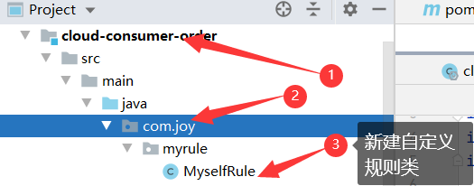
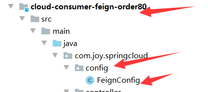
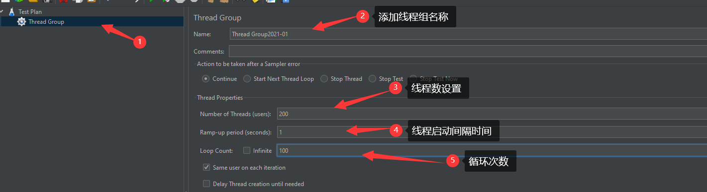
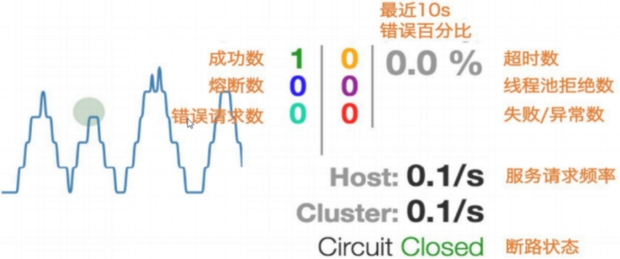

[Toc]

## 微服务架构框架简览

以前整个微服务架构由大量的技术框架和方案构成，比如

| 功能           | 框架                                                         |
| -------------- | ------------------------------------------------------------ |
| 服务基础开发   | SpringMVC、Spring、SpringBoot                                |
| 服务注册与发现 | Netfilx的Eureka,Apache的ZooKeeper                            |
| 服务调用       | Dubbo(RPC方式);Dubbox(Rest方式)；Ribbon(Rest方式)；Feign(Rest方式) |
| 分布式配置管理 | Disconf,Qconf,Diamond,Archaius                               |
| 负载均衡       | Ribbon                                                       |
| 服务熔断       | Hystrix                                                      |
| API网关        | Zuul                                                         |
| 批量任务       | Elastic-Job,Azkaban                                          |
| 服务跟踪       | Hydra,Zipkin                                                 |


## SpringCloud简介

> SpringCloud是什么
> SpringCloud是一个一站式的开发分布式系统的框架；以SpringBoot为基础，整合了常见的分布式模式的工具的框架。
> 其整合的模式工具类型有：配置管理、服务管理、断路器、智能路由，微代理，控制总线，全局锁，决策竞选，分布式会话和集群状态管理等。
>
> - **官网**：https://spring.io/
>
> - **SpringCloud版本标识**：采用伦敦的地铁站名称来作为版本号的命名，根据首字母排序，字母顺序靠后的版本号越大。
>
>   | 版本号    | 版本       | 说明                                                         |
>   | --------- | ---------- | ------------------------------------------------------------ |
>   | BUILD-XXX | 开发版     | 开发团队内部使用                                             |
>   | M         | 里程碑版   | MileStone,M1表示第1个里程碑版本，一般同事标注PRE,表示预览版  |
>   | RX        | 候选发布版 | Release Candidate,正式发布版的前一个观察期，不添加新功能，主要着重于除错 |
>   | SR        | 正式发布版 | ServiceRelease,SR1表示第1个正式版本，一般同时标注GA,表示稳定版本 |
>   | GA        | 稳定版     | 经过全面测试并可对外发行称之为GA(General Availability)       |
>
> - **子项目版本说明**
>   例如：Spring Cloud Alibaba 2.1.0.Release
>
>   - 2:	主版本号。当功能模块有较大更新或者整体架构发生变化时，主版本号会更新
>   - 1：	次版本号。次版本表示只是局部的一些变动
>   -0：	修改版本号。一般是bug的修复或者小的变动
>   -RELEASE:	希腊字母版本号。标注当前版本的软件处于哪个开发阶段
>
> - **希腊字母版本说明**
>
>   - Base设计阶段。只有相应的设计没有具体的功能实现；
>   - Alpha:软件的初级版本。存在较多的bug
>   - Beta:表示相对Alpha有了很大的进步，消除了严重的bug,还存在一些潜在的bug;
>   - Gamma:是Beta版做过一些修改，称为正式发布的候选版本(Release Candidate)
>   - Release:该版本表示最终版。


**【以下实例演示，父工程是为[04_SpringBoot项目创建](./04_SpringBoot项目创建.md)中创建，与其SpringBoot项目共用一个父工程。】**

## Eureka

### 基础知识

- **什么是服务治理**
  管理服务与服务之间的依赖关系，以实现<u>服务调用，负载均衡，容错</u>等，实现服务<u>发现与注册</u>
  传统的RPC远程调用框架中，管理每个服务与服务之间依赖关系比较复杂、所以需要进行服务治理
  SpringCloud封装了Netflix公司开发的Eureka模块来实现服务治理
  
  

### Eureka简介

- **简介**

> Eureka:CS设计架构，RPC远程调用框架为核心设计思想
> 
>
> **组成：**
> Eureka由多个instance(服务实例)组成，这些服务实例可以分为俩种：Eureka Server和Eureka Client。为了便于理解Eureka client再分为Service Provider 和 Service Consumer
>
> - EurekaServer 提供服务注册和发现；
> - Service Provider服务提供方，将自身服务注册到Euraka,从而使服务消费方能够找到；
> - Service Consumer服务消费方，从Eureka获取注册服务列表，从而能够消费服务。
>
> ```
> ### Eureka Server提供服务注册服务
> 各个微服务节点通过配置启动后，会在Eureka Server中进行注册，这样Eureka Server中的服务注册表中将会存储所有可用服务节点的信息，服务节点的信息可以在界面中直观看到。
> ### Eureka Client通过注册中心进行访问
> 是一个Java客户端，用于简化Eureka Server的交互，客户端同时也具备一个内置的、使用轮询（round-robin）负载算法的负载均衡器。在应用启动后，将会在Eureka Server发送心跳（默认周期30秒）。如果Eureka Server在多个心跳周期内没有收到某个节点的心跳，Eureka Server将会从服务注册表中把这个服务节点移出（默认90秒）
> ```
>
> 

- **Eureka与Zookeeper的区别**

> （1）Zookeeper是CP，分布式协同服务，突出一致性。对ZooKeeper的的每次请求都能得到一致的数据结果，但是无法保证每次访问服务可用性。如请求到来时，zookeer正在做leader选举，此时不能提供服务，即不满足A可用性。
>
> （2）Euere是AP，高可用与可伸缩的Service发现服务，突出可用性。相对于Zookeeper而言，可能返回数据没有一致性，但是保证能够返回数据，服务是可用的。

### 单机Eureka构建

#### 1. 建Module：

> 创建Module:cloud-eureka-server
> 备注：父工程是为[04_SpringBoot项目创建](./04_SpringBoot项目创建.md)中创建，与其SpringBoot项目共用一个父工程。


#### 2. 修改POM

> 添加相关必须依赖

```
<?xml version="1.0" encoding="UTF-8"?>
<project xmlns="http://maven.apache.org/POM/4.0.0"
         xmlns:xsi="http://www.w3.org/2001/XMLSchema-instance"
         xsi:schemaLocation="http://maven.apache.org/POM/4.0.0 http://maven.apache.org/xsd/maven-4.0.0.xsd">
    <parent>
        <artifactId>cloud</artifactId>
        <groupId>com.joysun.springcloud</groupId>
        <version>1.0-SNAPSHOT</version>
    </parent>
    <modelVersion>4.0.0</modelVersion>

    <artifactId>cloud-eureka-server</artifactId>

    <dependencies>
        <dependency>
            <groupId>org.springframework.cloud</groupId>
            <artifactId>spring-cloud-starter-netflix-eureka-server</artifactId>
        </dependency>

        <dependency>
            <groupId>com.joysun.springcloud</groupId>
            <artifactId>cloud-api-commons</artifactId>
            <version>${project.version}</version>
        </dependency>
        <dependency>
            <groupId>org.springframework.boot</groupId>
            <artifactId>spring-boot-starter-web</artifactId>
        </dependency>
        <dependency>
            <groupId>org.springframework.boot</groupId>
            <artifactId>spring-boot-starter-actuator</artifactId>
        </dependency>
        <dependency>
            <groupId>org.springframework.boot</groupId>
            <artifactId>spring-boot-devtools</artifactId>
            <scope>runtime</scope>
            <optional>true</optional>
        </dependency>
        <dependency>
            <groupId>org.projectlombok</groupId>
            <artifactId>lombok</artifactId>
        </dependency>
        <dependency>
            <groupId>org.springframework.boot</groupId>
            <artifactId>spring-boot-starter-test</artifactId>
            <scope>test</scope>
        </dependency>
        <dependency>
            <groupId>junit</groupId>
            <artifactId>junit</artifactId>
        </dependency>
    </dependencies>
</project>
```

- **1.X和2.X的对比说明**

```
1.X版本
<dependency>
	<groupId>org.springframework.cloud</groupId>
	<artifactId>spring-cloud-starter-eureka</artifactId>
</dependency>

2.X版本
<dependency>
	<groupId>org.springframework.cloud</groupId>
	<artifactId>spring-cloud-starter-netflix-eureka-server</artifactId>
</dependency>
```

#### 3. YML配置

> 在项目resource下创建：src\main\resources\application.yml

```
server:
  port: 7001

eureka:
  instance:
    hostname: localhost

  client:
    register-with-eureka: false
    fetchRegistry: false
    service-url:
      defaultZone: http://localhost:7001/eureka
```

#### 4. 主启动

```
### 创建主启动类EurekaMain：src\main\java\com\joy\springcloud\EurekaMain.java

package com.joy.springcloud;

import org.springframework.boot.SpringApplication;
import org.springframework.boot.autoconfigure.SpringBootApplication;
import org.springframework.cloud.netflix.eureka.server.EnableEurekaServer;

@SpringBootApplication
@EnableEurekaServer //声明当前为微服务注册中心
public class EurekaMain {
    public static void main(String[] args) {
        SpringApplication.run(EurekaMain.class,args);
    }
}

```

#### 5. 测试

> 启动服务后，使用：http://localhost:7001/  链接服务，看是否可以正常访问Eureka页面
>
> 

### 服务提供者

#### 1. 建Module

> EurekaClient端cloud-provider-payment将注册进EurekaServer成为服务提供者provider
>
> 创建Module:cloud-provider-payment,此处直接使用[04_SpringBoot项目创建](./04_SpringBoot项目创建.md)中创建的cloud-provider-payment模块

#### 2. 修改POM

> 在cloud-provider-payment模块pom.xml添加eureka客户端组件
>
> ```
>  <dependency>
> 	 <groupId>org.springframework.cloud</groupId>
>  	 <artifactId>spring-cloud-starter-netflix-eureka-client</artifactId>
>  </dependency>
> ```

#### 3. 编辑YML

> 在cloud-provider-payment模块下的application.yml中添加
>
> ```
> eureka:
>   client:
>     register-with-eureka: true
>     fetchRegistry: true
>     service-url:
>       defaultZone: http://localhost:7001/eureka
> ```

#### 4. 主启动

> 在cloud-provider-payment模块的主启动类上添加注解：
>
> ```
> @SpringBootApplication
> @EnableEurekaClient
> public class PaymentMain {
>     public static void main(String[] args) {
>         SpringApplication.run(PaymentMain.class,args);
>     }
> }
> 
> ```

#### 5. 测试

> 先启动EurekaServer,然后查看：http://localhost:7001/
> 
>
> 可以从界面看到服务信息

### 服务消费者

> EurekaClient端cloud-consumer-order将注册进EurekaServer成为服务消费者consumer
> cloud-consumer-order原始module创建参见：[04_SpringBoot项目创建](./04_SpringBoot项目创建.md)

#### 1. 建Module

> 此处直接使用[04_SpringBoot项目创建](./04_SpringBoot项目创建.md)创建的cloud-consumer-order

#### 2. 修改POM

```
### 在cloud-consumer-order模块的pom.xml中添加eureka客户端启动包
<dependency>
	<groupId>org.springframework.cloud</groupId>
	<artifactId>spring-cloud-starter-netflix-eureka-client</artifactId>
</dependency>
```

#### 3. 编辑YML

```
### 在cloud-consumer-order模块的application.yml中添加eureka客户端注册服务配置
eureka:
  client:
    register-with-eureka: true
    fetchRegistry: true
    service-url:
      defaultZone: http://localhost:7001/eureka
```

#### 4. 主启动

> 在cloud-consumer-order模块的主启动类上添加@EnableEurekaClient注解

#### 5. 测试

> 1) 先要启动EurekaServer，7001服务
>
> 2) 再要启动服务提供者8001服务和服务消费者80服务
>
> 3 ）链接http://localhost:7001/ 查看eureka服务器，看是否能查看注册的俩个服务
>
>  
>
>  4) 测试消费者服务端查询&查询：http://localhost/consumer/payment/get/31
>
> 5) 测试提供者服务端查询&添加：postman测试：http://localhost:8001/payment/get/1
>
> 6) 测试结果：8001服务和80服务效果一样
>
> 

## Ribbon

### 简介

> Spring Cloud Ribbon是基于Netflix Ribbon实现的一套客户端负载均衡的工具。
>
> - **功能**：提供客户端的软件负载均衡算法和服务调用
>
> - **未来可能的替换方案**:Spring Cloud LoadBalancer
>
> - **功能详情说明**：LB（负载均衡）
>
>   1) 简单的说就是将用户的请求平均分配到多个服务器上，从而达到系统的HA(高可用)。
>
>   2) 常见的负载均衡有软件Nginx，LVS，硬件F5等。
>
>   **3)** Ribbon的本地负载均衡客户端 VS Nginx服务端负载均衡区别：
>
>   - Nginx是服务器负载均衡，客户端所有请求都会交给Nginx，然后，由nginx实现转发请求。即负载均衡是由服务器端完成的。
>
>   - Ribbon本地负载均衡，在调用微服务接口时候，会在注册中心上获取注册信息服务列表之后缓存到JVM本地，从而在本地实现RPC远程服务调用。
>
>   4) 集中式LB
>
>   ​     即在服务的消费方和提供方之间使用独立的LB设施（可以是硬件，如F5，也可以是软件，如Nginx）,由该设施负责把访问请求通过某种策略转发至服务的提供方；
>
>   5) 进程内LB
>
>   - 将LB逻辑集成到消费方，消费方从服务注册中心获知有哪些地址可用，然后自己再从这些地址中选择出一个合适的服务器。
>
>   - Ribbon就属于进程内LB，它只是一个类库，集成于消费方进程，消费方通过它来获取到服务提供方的地址。
>
>   **Ribbon=负载均衡+RestTemplate调用**
>
> - **架构说明**
>   Ribbon在工作时分成两步：
>
>   第一步，先选择EurekaServer，它优先选择在同一个区域内负载较少的server。
>
>   第二步，再根据用户指定的策略，在从server取到的服务注册列表中选择一个地址。其中Ribbon提供了多种策略。比如：轮询、随机和根据响应时间加权。
>
>   总结：Ribbon其实就是一个软负载均衡的客户端组件，他可以和其他所需请求的客户端结合使用，和eureka结合只是其中的一个实例。

#### Ribbon核心组件Irule


> **IRule：根据特定算法从服务列表中选取一个要访问的服务**
>
> 1. com.netflix.loadbalancer.RoundRobinRule 轮询，默认策略。
>
> 2. com.netflix.loadbalancer.RandomRule 随机
>
> 3. com.netflix.loadbalancer.RetryRule 先按照RoundRobinRule的策略获取服务，如果获取服务失败则在指定时间内会进行重试，获取可用的服务 
>
> 4. WeightedResponseTimeRule  对RoundRobinRule的扩展，响应速度越快的实例选择权重越大，越容易被选择
>
> 5. BestAvailableRule 会先过滤掉由于多次访问故障而处于断路器跳闸状态的服务，然后选择一个并发量最小的服务
>
> 6. AvailabilityFilteringRule 先过滤掉故障实例，再选择并发较小的实例
>
> 7. ZoneAvoidanceRule 默认规则，复合判断server所在区域的性能和server的可用性选择服务器

- **配置细节注意事项**

> 官方文档明确给出警告：
>
> [https://cloud.spring.io/spring-cloud-static/Hoxton.SR1/reference/htmlsingle/#customizing-the-ribbon-client](#customizing-the-ribbon-client)
>
>  
>
> 这个自定义配置类不能放在@ComponentScan所扫描的当前包下以及子包下，否则我们自定义的这个配置类就会被所有的Ribbon客户端所共享，达不到特殊化订制的目的了。

### 1. POM

```
<dependency>
	<groupId>org.springframework.cloud</groupId>
	<artifactId>spring-cloud-starter-netflix-ribbon</artifactId>
</dependency>

注意：这个不需要手动引用，Eureka客户端自带Ribbon

```


### 2. 创建多服务环境

> 1. 构建一个端口号为8002的服务
>
> 新建一个module,名称cloud-provider-payment8002，将cloud-provider-payment项目下内容复制一份放到cloud-provider-payment8002模块下。修改cloud-provider-payment8002的application.yml服务端口为8002，修改pom.xml项目名。重新导入依赖。相当于多了一个8002端口的服务
>
> 为了测试调用的是哪个端口，添加相关端口打印信息
>
> ```
> @RestController
> @Slf4j
> @EnableAutoConfiguration
> public class PaymentController {
>     @Autowired
>     private PaymentService paymentService;
>     @Value("${server.port}")
>     private String port;  //获取端口值
> ```
>
> 2. 在消费者服务的远程调用类上添加负载均衡注解：该注解表示通过注册中心，获取服务列表，远程调用采用负载均衡(LB)
>
>    
>
>    
>
> 3. 修改消费者服务远程调用路径为服务提供者端口
>
>    
>    
>
> 4. 启动Ereka服务，服务提供者服务，服务消费者服务。查看在ereaka界面是否可以看到相应的服务是否已注册，并测试服务是否正常,如`http://localhost:8001/payment/get/1`
>
> 5. 使用客户端连接:http://localhost/consumer/payment/get/31访问服务，查询数据，测试负载均衡是否启用
>    
>    
>
>    可以查看到，同一连接地址多次查询的调用的服务会不同，说明负载均衡正常。

### 3. 自定义负载均衡规则

#### 3.1 创建新的目录包

`com.joy.myrule`


#### 3.2 新建规则类



```
package com.joy.myrule;

import com.netflix.loadbalancer.IRule;
import com.netflix.loadbalancer.RandomRule;
import org.springframework.context.annotation.Configuration;

@Configuration
public class MyselfRule {

    public IRule myRule(){
        return new RandomRule();//定义规则为随机
    }
}

```

#### 3.3 主启动类添加@RibbonClient

```
package com.joy.springcloud;

import com.joy.myrule.MyselfRule;
import org.springframework.boot.SpringApplication;
import org.springframework.boot.autoconfigure.SpringBootApplication;
import org.springframework.cloud.netflix.eureka.EnableEurekaClient;
import org.springframework.cloud.netflix.ribbon.RibbonClient;

@SpringBootApplication
@EnableEurekaClient
@RibbonClient(name="CLOUD-PAYMENT-SERVICE",configuration = MyselfRule.class)//添加自定义规则
public class OrderMain {
    public static void main(String[] args) {
        SpringApplication.run(OrderMain.class,args);
    }
}

```

#### 3.4 测试

> 重新启动服务，查看服务调用采用的负载均衡规则是否为自定义的规则
>
> http://localhost/consumer/payment/get/1

### 4. Ribbon轮询原理


## OpenFeign

### 简介

> - Feign是一个声明式的web服务客户端，让编写web服务客户端变得非常容易，只需创建一个接口并在接口上添加注解即可
>
> - SpringCloud对Feign进行了封装，使其支持了SpringMVC标准注解和HttpMessageConverters。Feign可以与Eureka和Ribbon组合使用以支持负载均衡。
>
> [https://cloud.spring.io/spring-cloud-static/Hoxton.SR1/reference/htmlsingle/#spring-cloud-openfeign](#spring-cloud-openfeign)
>
> https://github.com/spring-cloud/spring-cloud-openfeign
>
> - **Feign集成了 Ribbon**
>
>   利用Ribbon维护了Payment的服务列表信息，并且通过轮询实现了客户端的负载均衡。而与Ribbon不同的是，通过Feign只需要定义服务绑定接口且以声明式的方法，优雅而简单的实现了服务调用。
>
> - **Feign和OpenFeign两者区别**
>   
>
> - **OpenFeign使用步骤**:微服务调用接口+@FeignClient
>
>   


### 1. 新建模块：cloud-consumer-feign-order80


### 2. 修改POM

> **注意：openFeign也是自带bibbon**

```
<?xml version="1.0" encoding="UTF-8"?>
<project xmlns="http://maven.apache.org/POM/4.0.0"
         xmlns:xsi="http://www.w3.org/2001/XMLSchema-instance"
         xsi:schemaLocation="http://maven.apache.org/POM/4.0.0 http://maven.apache.org/xsd/maven-4.0.0.xsd">
    <parent>
        <artifactId>cloud</artifactId>
        <groupId>com.joysun.springcloud</groupId>
        <version>1.0-SNAPSHOT</version>
    </parent>
    <modelVersion>4.0.0</modelVersion>

    <artifactId>cloud-consumer-feign-order80</artifactId>

    <dependencies>
        <!--openfeign-->
        <dependency>
            <groupId>org.springframework.cloud</groupId>
            <artifactId>spring-cloud-starter-openfeign</artifactId>
        </dependency>
        <dependency>
            <groupId>org.springframework.cloud</groupId>
            <artifactId>spring-cloud-starter-netflix-eureka-client</artifactId>
        </dependency>
        <dependency>
            <groupId>com.joysun.springcloud</groupId>
            <artifactId>cloud-api-commons</artifactId>
            <version>${project.version}</version>
        </dependency>
        <dependency>
            <groupId>org.springframework.boot</groupId>
            <artifactId>spring-boot-starter-web</artifactId>
        </dependency>
        <dependency>
            <groupId>org.springframework.boot</groupId>
            <artifactId>spring-boot-starter-actuator</artifactId>
        </dependency>
        <dependency>
            <groupId>org.springframework.boot</groupId>
            <artifactId>spring-boot-devtools</artifactId>
            <scope>runtime</scope>
            <optional>true</optional>
        </dependency>
        <dependency>
            <groupId>org.projectlombok</groupId>
            <artifactId>lombok</artifactId>
            <optional>true</optional>
        </dependency>
        <dependency>
            <groupId>org.springframework.boot</groupId>
            <artifactId>spring-boot-starter-test</artifactId>
            <scope>test</scope>
        </dependency>
    </dependencies>
</project>
```

### 3. YML配置

```
server:
  port: 80
spring:
  application:
    name: cloud-consumer-feign-order80
eureka:
  client:
    register-with-eureka: true
    fetch-registry: true
    service-url:
      defaultZone: http://localhost:7001/eureka
```

### 4. 主启动类

```
package com.joy.springcloud;

import org.springframework.boot.SpringApplication;
import org.springframework.boot.autoconfigure.SpringBootApplication;
import org.springframework.cloud.netflix.eureka.EnableEurekaClient;
import org.springframework.cloud.openfeign.EnableFeignClients;


@SpringBootApplication
@EnableEurekaClient
@EnableFeignClients
public class OrderFeignMain {
    public static void main(String[] args) {
        SpringApplication.run(OrderFeignMain.class,args);
    }
}


```

### 5. 业务类

#### 5.1 新建PaymentFeignService接口并新增注解@FeignClient

> 业务逻辑接口+@FeignClient配置调用provider服务

```
package com.joy.springcloud.service;

import com.joy.springcloud.entities.CommonResult;
import org.springframework.cloud.openfeign.FeignClient;
import org.springframework.stereotype.Component;
import org.springframework.web.bind.annotation.GetMapping;
import org.springframework.web.bind.annotation.PathVariable;

@Component
@FeignClient(value = "CLOUD-PAYMENT-SERVICE")
public interface PaymentFeignService {
    @GetMapping(value = "/payment/get/{id}")
    public CommonResult getPaymentById(@PathVariable("id") Long id);
}

```

#### 5.2  控制层Controller

```
package com.joy.springcloud.service;

import com.joy.springcloud.entities.CommonResult;
import org.springframework.cloud.openfeign.FeignClient;
import org.springframework.stereotype.Component;
import org.springframework.web.bind.annotation.GetMapping;
import org.springframework.web.bind.annotation.PathVariable;

@Component
@FeignClient(value = "CLOUD-PAYMENT-SERVICE")
public interface PaymentFeignService {
    @GetMapping(value = "/payment/get/{id}")
    public CommonResult getPaymentById(@PathVariable("id") Long id);
}

```

项目结构


### 6. 测试

> 1. 先启动Eureka7001
>
> 2. 再启动2个微服务8001/8002
>
> 3. 启动OpenFeign微服务：cloud-consumer-feign-order80
>
> 4. http://localhost/consumer/payment/get/31 查看测试是否正常，以及负载均衡是否正常
>
> 5. Feign自带负载均衡配置项

### OpenFeign超时控制

#### 1.演示 超时设置

> 为了演示超时情况，故意设置超时出错情况
>
> ```
> ### 1. 服务提供方8001故意写暂停程序
> @GetMapping(value = "/payment/feign/timeout")
>     public String paymentFeignTimeout(){
>         try { 
>             TimeUnit.SECONDS.sleep(3);//单位秒
>         }catch (Exception e) {
>             e.printStackTrace();
>         } 
>         return port;
>     }
>     
> ### 2. 服务消费方cloud-consumer-feign-order80添加在PaymentFeignService添加超时接口
> @GetMapping(value = "/payment/feign/timeout")
>  public String paymentFeignTimeout();
>  
>  ### 3. 服务消费方cloud-consumer-feign-order80在OrderFeignController添加超时方法
>  @GetMapping(value = "/consumer/payment/feign/timeout")
>     public String paymentFeignTimeout(){
>         return paymentFeignService.paymentFeignTimeout();
>     }
> ```
>
> - **测试** 
>
> http://localhost/consumer/payment/feign/timeout
>
> 错误页面，OpenFeign默认等待一秒钟，超过后报错
> 原因：默认Feign客户端只等待一秒钟，但是，服务端处理需要超过1秒钟，导致Feign客户端不想等待了，直接报错。
>
> 

#### 2. 开启OpenFeign客户端超时控制

> - **Feign设置超时时间**
>   使用Feign调用接口分两层，ribbon的调用和hystrix的调用，所以ribbon的超时时间和Hystrix的超时时间的结合就是Feign的超时时间
> - **在YML文件中设置Feign超时时间**
>
> ```
> #设置Feign客户端超时时间（openfeign默认支持ribbon）
> ribbon:
>   ReadTimeout:  3000
>   ConnectTimeout: 3000
>   MaxAutoRetries: 1 #同一台实例最大重试次数,不包括首次调用
>   MaxAutoRetriesNextServer: 1 #重试负载均衡其他的实例最大重试次数,不包括首次调用
>   OkToRetryOnAllOperations: false  #是否所有操作都重试
> #hystrix的超时时间
> hystrix:
>   command:
>     default:
>       execution:
>         timeout:
>           enabled: true
>         isolation:
>           thread:
>             timeoutInMilliseconds: 9000
>             
>          
> 
> ```
>
>  **一般情况下 都是 ribbon 的超时时间（<）hystrix的超时时间（因为涉及到ribbon的重试机制）**
> **因为ribbon的重试机制和Feign的重试机制有冲突，所以源码中默认关闭Feign的重试机制，源码如下**
>
> 
>
> **要开启Feign的重试机制如下**：（Feign默认重试五次 源码中有）
>
> ```
> @Bean
> Retryer feignRetryer() {
>         return  new Retryer.Default();
> }
> ```
>
> 根据上面的参数计算重试的次数：`MaxAutoRetries+MaxAutoRetriesNextServer+(MaxAutoRetries *MaxAutoRetriesNextServer) `即重试3次 则一共产生4次调用
>
> 如果在重试期间，时间超过了hystrix的超时时间，便会立即执行熔断，fallback。所以要根据上面配置的参数计算hystrix的超时时间，使得在重试期间不能达到hystrix的超时时间，不然重试机制就会没有意义
>
> hystrix超时时间的计算：` (1 + MaxAutoRetries + MaxAutoRetriesNextServer) * ReadTimeout` 即按照以上的配置 hystrix的超时时间应该配置为 （1+1+1）*3=9秒
>
> 当ribbon超时后且hystrix没有超时，便会采取重试机制。当`OkToRetryOnAllOperations`设置为false时，只会对get请求进行重试。如果设置为true，便会对所有的请求进行重试，如果是put或post等写操作，如果服务器接口没做幂等性，会产生不好的结果，所以OkToRetryOnAllOperations慎用。
>
> 如果不配置ribbon的重试次数，默认会重试一次
>
> **注意：**
>
> **默认情况下,GET方式请求无论是连接异常还是读取异常,都会进行重试**
> **非GET方式请求,只有连接异常时,才会进行重试**

## OpenFeign日志打印功能

#### 1. 简介

> Feign提供了日志打印功能，我们可以通过配置来调整日志级别，从而了解Feign中Http请求的细节。就是对Feign接口的调用情况进行监控和输出。
>
> - **日志级别**
>
>   - NONE：默认的，不显示任何日志
>
>   - BASIC：仅记录请求方法、URL、响应状态码及执行时间
>
>   - HEADERS：除了BASIC中定义的信息之外，还有请求和响应的头信息
>
>   - FULL：除了HEADERS中定义的信息之外，还有请求和响应的正文及元数据

#### 2. 配置日志bean



```
package com.joy.springcloud.config;

import feign.Logger;
import org.springframework.context.annotation.Bean;
import org.springframework.context.annotation.Configuration;


@Configuration
public class FeignConfig {
    @Bean
    public Logger.Level feignLoggerLevel(){
        return Logger.Level.FULL;
    }
}
```

#### 3. YML文件日志配置

> 配置需要开启Feign日志的客户端
>
> ```
> logging:
>   level:
>     com.joy.springcloud.service.PaymentFeignService: debug
> ```

#### 4. 测试

> - **后台日志查看**
>
> 访问：http://localhost/consumer/payment/get/31，查看后台日志
>
> 

## Hytrix

### 简介

#### 服务雪崩

> 多个微服务之间调用的时候，假如微服务A调用微服务B和微服务C，微服务B和微服务C又调用其他的微服务，这就是所谓的"扇出"。
>
> 如果扇出的链路上某个微服务的调用响应的时间过长或者不可用，对微服A的调用就会占用越来越多的系统资源，进而引起系统崩溃，所谓的"雪崩效应"。
>
> 对于高流量的应用来说，单一的后端依赖可能会导致所有的服务器上的所有资源都在几秒钟内饱和。比失败更糟糕的是，这些应用程序还可能导致服务之间的延迟增加，备份队列，线程和其他系统资源紧张，导致整个系统发生更多的级联故障。这些都表示需要对故障和延迟进行***\*隔离和管理\****，以便单个依赖关系的失败，不能取消整个应用程序或系统。
>
> 所以，通常当你发现一个模块下的某个实例失败后，这时候这个模块依然还会接收流量，然后这个有问题的模块还调用了其他的模块，这样就会发生级联故障，或者叫雪崩

#### Hytrix作用

> Hystrix是一个用于处理分布式系统的延迟和容错的开源库，在分布式系统里，许多依赖不可避免的会调用失败，比如超时、异常等，
>
> Hystrix能够保证在一个依赖出问题的情况下，不会导致整体服务失败，避免级联故障，以提高分布式系统的弹性。
>
> “断路器”本身是一种开关装置，当某个服务单元发生故障之后，通过断路器的故障监控（类似熔断保险丝），向调用方返回一个符合预期的、可处理的备选响应（Fallback），而不是长时间的等待或者抛出调用方无法处理的异常，这样就保证了服务调用方的线程不会被长时间、不必要地占用，从而避免了故障在分布式系统中的蔓延，乃至雪崩。
>
> 目前Hytrix已经停止维护
>
> - **功能**
>   - 服务降级
>   - 服务熔断
>   - 接近实时的监控

#### 服务降级Fallback

> 服务器忙，请稍候再试，不让客户端等待并立刻返回一个友好提示

> - **触发降级的情况**
>   - 程序运行异常
>   - 超时自动降级
>   - 服务熔断触发服务降级
>   - 线程池/信号量打满也会导致服务降级
>   - 人工降级

#### 服务熔断Breaker

> 类比保险丝达到最大服务访问后，直接拒绝访问，拉闸限电，然后调用服务降级的方法并返回友好提示
>
> - 就是保险丝: 服务的降级->进而熔断->恢复调用链路

#### 服务限流Flowlimit

> 秒杀高并发等操作，严禁一窝蜂的过来拥挤，大家排队，一秒钟N个，有序进行

### 构建

#### 1. 新建模块

> 新建Module：cloud-provider-hystrix-payment8001

#### 2. 修改POM

> 添加依赖

```
<?xml version="1.0" encoding="UTF-8"?>
<project xmlns="http://maven.apache.org/POM/4.0.0"
         xmlns:xsi="http://www.w3.org/2001/XMLSchema-instance"
         xsi:schemaLocation="http://maven.apache.org/POM/4.0.0 http://maven.apache.org/xsd/maven-4.0.0.xsd">
    <parent>
        <artifactId>cloud</artifactId>
        <groupId>com.joysun.springcloud</groupId>
        <version>1.0-SNAPSHOT</version>
    </parent>
    <modelVersion>4.0.0</modelVersion>

    <artifactId>cloud-provider-hystrix-payment8001</artifactId>

    <dependencies>
        <!--新增hystrix-->
        <dependency>
            <groupId>org.springframework.cloud</groupId>
            <artifactId>spring-cloud-starter-netflix-hystrix</artifactId>
        </dependency>
        <dependency>
            <groupId>org.springframework.cloud</groupId>
            <artifactId>spring-cloud-starter-netflix-eureka-client</artifactId>
        </dependency>
        <dependency>
            <groupId>com.joysun.springcloud</groupId>
            <artifactId>cloud-api-commons</artifactId>
            <version>${project.version}</version>
        </dependency>
        <dependency>
            <groupId>org.springframework.boot</groupId>
            <artifactId>spring-boot-starter-web</artifactId>
        </dependency>
        <dependency>
            <groupId>org.springframework.boot</groupId>
            <artifactId>spring-boot-starter-actuator</artifactId>
        </dependency>
        <dependency>
            <groupId>org.springframework.boot</groupId>
            <artifactId>spring-boot-devtools</artifactId>
            <scope>runtime</scope>
            <optional>true</optional>
        </dependency>
        <dependency>
            <groupId>org.projectlombok</groupId>
            <artifactId>lombok</artifactId>
            <optional>true</optional>
        </dependency>
        <dependency>
            <groupId>org.springframework.boot</groupId>
            <artifactId>spring-boot-starter-test</artifactId>
            <scope>test</scope>
        </dependency>
    </dependencies>

</project>
```

#### 3. YML配置

> 

```
server:
  port: 8001

spring:
  application:
    name: cloud-hystrix-payment-service

eureka:
  client:
    register-with-eureka: true
    fetch-registry: true
    service-url:
      defaultZone: http://localhost:7001/eureka/
```

#### 4. 主启动

```
package com.joy.springcloud;


import org.springframework.boot.SpringApplication;
import org.springframework.boot.autoconfigure.SpringBootApplication;
import org.springframework.cloud.netflix.eureka.EnableEurekaClient;

@SpringBootApplication
@EnableEurekaClient
public class PaymentHytrixMain {
    public static void main(String[] args) {
        SpringApplication.run(PaymentHytrixMain.class,args);
    }
}

```

#### 5. 业务类

- **接口**

  > service.PaymentService

```
package com.joy.springcloud.service;


public interface PaymentService {
    public String paymentInfo_OK(Integer id);
    public String paymentInfo_TimeOut(Integer id);
}

```

- **实现类**

```
package com.joy.springcloud.service.impl;

import com.joy.springcloud.service.PaymentService;
import org.springframework.stereotype.Service;

import java.util.concurrent.TimeUnit;

@Service
public class PaymentServiceImpl implements PaymentService {
    @Override
    public String paymentInfo_OK(Integer id) {
        return "线程池："+Thread.currentThread().getName()+"   paymentInfo_OK,id：  "+id+"\t"+"哈哈哈"  ;
    }

    @Override
    public String paymentInfo_TimeOut(Integer id) {
        int timeNumber = 3;
        try {
            TimeUnit.SECONDS.sleep(timeNumber);
        }catch (Exception e) {
            e.printStackTrace();
        }
        return "线程池："+Thread.currentThread().getName()+"   paymentInfo_TimeOut,id：  "+id+"\t"+"呜呜呜"+" 耗时(秒)"+timeNumber;
    }
}

```

- **Controller**

```
package com.joy.springcloud.controller;

import com.joy.springcloud.service.PaymentService;
import lombok.extern.slf4j.Slf4j;
import org.springframework.beans.factory.annotation.Value;
import org.springframework.web.bind.annotation.GetMapping;
import org.springframework.web.bind.annotation.PathVariable;
import org.springframework.web.bind.annotation.RestController;

import javax.annotation.Resource;

@RestController
@Slf4j
public class PaymentController {
    @Resource
    private PaymentService paymentService;
    @Value("${server.port}")
    private String server_port;

    @GetMapping("/payment/hystrix/ok/{id}")
    public String paymentInfo_OK(@PathVariable("id") Integer id){
        String result = paymentService.paymentInfo_OK(id);
        log.info("*******result:"+result);
        return result;
    }
    @GetMapping("/payment/hystrix/timeout/{id}")
    public String paymentInfo_TimeOut(@PathVariable("id") Integer id){
        String result = paymentService.paymentInfo_TimeOut(id);
        log.info("*******result:"+result);
        return result;
    }
}

```

#### 6. 正常测试

> 1.  启动eureka7001
>
> 2. 启动cloud-provider-hystrix-payment8001
>
> 3. 访问： http://localhost:8001/payment/hystrix/ok/31
>
> 每次调用耗费3秒钟： http://localhost:8001/payment/hystrix/timeout/31
>
> 4. 上述module均OK 以上述为根基平台，从正确->错误->降级熔断->恢复

### 高并发测试

#### 1. Jmeter压测测试

> 1. 下载Jmeter包：https://archive.apache.org/dist/jmeter/binaries/
>    
>
> 2. 将压缩包解压后，便可直接使用
>    
>
>    在windows环境下，可以直接双击jmeter.bat直接运行，也可以在该目录下，直接cmd打开win命令界面运行。运行后会出现Jmeter的操作界面
>
>    
>
> 3. 添加测试计划
>
> 
>
> 4. 添加线程组相关设置
>
>    
>
>    添加线程Http请求
>    
>    
>
> 5. 压测的过程中再来访问一下微服务
>
> http://localhost:8001/payment/hystrix/ok/31
>
> http://localhost:8001/payment/hystrix/timeout/31
>
>  **演示结果**：请求一直处于转圈，处于等待状态。
>
> 原因：tomcat的默认的工作线程数被打满了，没有多余的线程来分解压力和处理。

### 构建高并发环境

#### 1. 创建模块

> 创建消费者模块：cloud-consumer-feign-hystrix-order80

#### 2. POM

> 添加依赖组件

```
<?xml version="1.0" encoding="UTF-8"?>
<project xmlns="http://maven.apache.org/POM/4.0.0"
         xmlns:xsi="http://www.w3.org/2001/XMLSchema-instance"
         xsi:schemaLocation="http://maven.apache.org/POM/4.0.0 http://maven.apache.org/xsd/maven-4.0.0.xsd">
    <parent>
        <artifactId>cloud</artifactId>
        <groupId>com.joysun.springcloud</groupId>
        <version>1.0-SNAPSHOT</version>
    </parent>
    <modelVersion>4.0.0</modelVersion>

    <artifactId>cloud-consumer-feign-hystrix-order80</artifactId>


    <dependencies>
        <!--新增hystrix-->
        <dependency>
            <groupId>org.springframework.cloud</groupId>
            <artifactId>spring-cloud-starter-netflix-hystrix</artifactId>
        </dependency>
        <dependency>
            <groupId>org.springframework.cloud</groupId>
            <artifactId>spring-cloud-starter-openfeign</artifactId>
        </dependency>
        <dependency>
            <groupId>org.springframework.cloud</groupId>
            <artifactId>spring-cloud-starter-netflix-eureka-client</artifactId>
        </dependency>
        <dependency>
            <groupId>com.joysun.springcloud</groupId>
            <artifactId>cloud-api-commons</artifactId>
            <version>${project.version}</version>
        </dependency>
        <dependency>
            <groupId>org.springframework.boot</groupId>
            <artifactId>spring-boot-starter-web</artifactId>
        </dependency>
        <dependency>
            <groupId>org.springframework.boot</groupId>
            <artifactId>spring-boot-starter-actuator</artifactId>
        </dependency>
        <dependency>
            <groupId>org.springframework.boot</groupId>
            <artifactId>spring-boot-devtools</artifactId>
            <scope>runtime</scope>
            <optional>true</optional>
        </dependency>
        <dependency>
            <groupId>org.projectlombok</groupId>
            <artifactId>lombok</artifactId>
            <optional>true</optional>
        </dependency>
        <dependency>
            <groupId>org.springframework.boot</groupId>
            <artifactId>spring-boot-starter-test</artifactId>
            <scope>test</scope>
        </dependency>
    </dependencies>
</project>
```

#### 3. YML

```
server:
  port: 80

spring:
  application:
    name: cloud-consumer-feign-hystrix-order80

eureka:
  client:
    register-with-eureka: true    #表识不向注册中心注册自己
    fetch-registry: true   #表示自己就是注册中心，职责是维护服务实例，并不需要去检索服务
    service-url:
      defaultZone: http://localhost:7001/eureka/

```

#### 4. 主启动类

```
package com.joysun.springcloud;

import lombok.extern.slf4j.Slf4j;
import org.springframework.boot.SpringApplication;
import org.springframework.boot.autoconfigure.SpringBootApplication;
import org.springframework.cloud.netflix.eureka.EnableEurekaClient;
import org.springframework.cloud.openfeign.EnableFeignClients;


@SpringBootApplication
@EnableEurekaClient
@EnableFeignClients
public class OrderHystrixMain80 {
    public static void main(String[] args) {
        SpringApplication.run(OrderHystrixMain80.class,args);
    }
}


```

#### 5. 业务类

1) service类

```
package com.joysun.springcloud.service;

import org.springframework.cloud.openfeign.FeignClient;
import org.springframework.stereotype.Component;
import org.springframework.web.bind.annotation.GetMapping;
import org.springframework.web.bind.annotation.PathVariable;

@Component
@FeignClient("CLOUD-PROVIDER-HYSTRIX-PAYMENT-SERVICE")
public interface PaymentHytrixService {
    @GetMapping("/payment/hystrix/ok/{id}")
    public String paymentInfo_OK(@PathVariable("id") Integer id);

    @GetMapping("/payment/hystrix/timeout/{id}")
    public String paymentInfo_TimeOut(@PathVariable("id") Integer id);

}


```


2）controller

```
package com.joysun.springcloud.controller;

import com.joysun.springcloud.service.PaymentHytrixService;
import lombok.extern.slf4j.Slf4j;
import org.springframework.web.bind.annotation.GetMapping;
import org.springframework.web.bind.annotation.PathVariable;
import org.springframework.web.bind.annotation.RestController;

import javax.annotation.Resource;


@RestController
@Slf4j
public class OrderHystrixController {
    @Resource
    private PaymentHytrixService paymentHytrixService;


    @GetMapping("/consumer/payment/hystrix/ok/{id}")
    public String paymentInfo_OK(@PathVariable("id") Integer id){
        String result = paymentHytrixService.paymentInfo_OK(id);
        log.info("*******result:"+result);
        return result;
    }
    @GetMapping("/consumer/payment/hystrix/timeout/{id}")
    public String paymentInfo_TimeOut(@PathVariable("id") Integer id){
        String result = paymentHytrixService.paymentInfo_TimeOut(id);
        log.info("*******result:"+result);
        return result;
    }
}

```

#### 6. 正常测试

> 连接：http://localhost/consumer/payment/hystrix/ok/31

#### 7. 高并发测试

> 1. 2W个线程压8001
>
> 2. 消费端80微服务再去访问正常的OK微服务8001地址
>
> 3. http://localhost/consumer/payment/hystrix/timeout/32
>
> 4. 消费者80,要么转圈圈等待,要么消费端报超时错误
>
> 

#### 8. 故障现象和导致原因

> - 8001同一层次的其他接口服务被困死，因为tomcat线程里面的工作线程已经被挤占完毕
>
> - 80此时调用8001，客户端访问响应缓慢，转圈圈

#### 9. 解决方案

> 1. 超时导致服务器变慢（转圈）:超时不再等待
>
> 2.  出错（宕机或程序运行出错）:出错要有兜底
>
> 3. 解决
>
>  1）对方服务（8001）超时/down机了，调用者（80）不能一直卡死等待，必须有服务降级
>
> 2） 对方服务（8001）OK，调用者（80）自己出故障或有自我要求（自己的等待时间小于服务提供者），自己处理降级

### 服务降级

#### 服务提供者降级

> 利用`@HystrixCommand`注解，设置自身调用超时时间的峰值，峰值内可以正常运行，超过了需要有兜底的方法处理，作服务降级fallback
>
> > 修改模块为：cloud-provider-hystrix-payment8001
>
> 1. 在服务提供者的服务实现类中:使用`@HystrixCommand`设置超时时间，以及超时处理方法.
>     一旦调用服务方法失败并抛出了错误信息后，会自动调用@HystrixCommand标注好的fallbackMethod调用类中的指定方法
>
> ```
> package com.joy.springcloud.service.impl;
> 
> import com.joy.springcloud.service.PaymentService;
> import com.netflix.hystrix.contrib.javanica.annotation.HystrixCommand;
> import com.netflix.hystrix.contrib.javanica.annotation.HystrixProperty;
> import org.springframework.stereotype.Service;
> 
> import java.util.concurrent.TimeUnit;
> 
> @Service
> public class PaymentServiceImpl implements PaymentService {
>     @Override
>     public String paymentInfo_OK(Integer id) {
>         return "线程池："+Thread.currentThread().getName()+"   paymentInfo_OK,id：  "+id+"\t"+"哈哈哈"  ;
>     }
> 
>     //超时降级演示
>     @HystrixCommand(fallbackMethod = "payment_TimeoutHandler",commandProperties = {
>             @HystrixProperty(name="execution.isolation.thread.timeoutInMilliseconds",value="5000") //5秒钟以内就是正常的业务逻辑
>     })
>     @Override
>     public String paymentInfo_TimeOut(Integer id) {
>         int timeNumber = 3;
>         try {
>             TimeUnit.SECONDS.sleep(timeNumber);
>         }catch (Exception e) {
>             e.printStackTrace();
>         }
>         return "线程池："+Thread.currentThread().getName()+"   paymentInfo_TimeOut,id：  "+id+"\t"+"呜呜呜"+" 耗时(秒)"+timeNumber;
>     }
> 
>     //兜底方法，上面方法出问题,我来处理，返回一个出错信息。兜底方法的返回值类型和参数，需与原调用方法一致
>     public String payment_TimeoutHandler(Integer id) {
>         return "线程池："+Thread.currentThread().getName()+" payment_TimeoutHandler,系统繁忙,请稍后再试\t o(╥﹏╥)o ";
>     }
> }
> 
> ```
>
> 2. 在主启动类上添加注解`@EnableCircuitBreaker` 
>
>    ```
>    @SpringBootApplication
>    @EnableEurekaClient
>    @EnableCircuitBreaker
>    public class PaymentHytrixMain {
>        public static void main(String[] args) {
>            SpringApplication.run(PaymentHytrixMain.class,args);
>        }
>    }
>    ```
>
> 3. 测试：http://localhost:8001/payment/hystrix/timeout/31
>    结果：

#### 服务消费者端降级

> 注意：服务降级可以在服务提供者侧，也可以在服务消费者侧。更多是在服务消费者侧。
> 我们自己配置过的热部署方式对java代码的改动明显，但对@HystrixCommand内属性的修改建议重启微服务

> 修改模块：`cloud-consumer-feign-hystrix-order80`
>
> 1. **YML**
>
>    ```
>    feign:
>      hystrix:
>        enabled: true #如果处理自身的容错就开启。开启方式与生产端不一样
>    ```
>
> 2. **主启动类**
>    添加注解`@EnableHystrix`
>
>    ```
>    @SpringBootApplication
>    @EnableEurekaClient
>    @EnableFeignClients
>    @EnableHystrix
>    public class OrderHystrixMain80 {
>        public static void main(String[] args) {
>            SpringApplication.run(OrderHystrixMain80.class,args);
>        }
>    }
>    ```
>
> 3. **业务类**：`OrderHystrixController`
>
>    ```
>     @HystrixCommand(fallbackMethod = "payment_TimeoutHandler",commandProperties = {@HystrixProperty(name="execution.isolation.thread.timeoutInMilliseconds",value="1500")})
>        @GetMapping("/consumer/payment/hystrix/timeout/{id}")
>        public String paymentInfo_TimeOut(@PathVariable("id") Integer id){
>            String result = paymentHytrixService.paymentInfo_TimeOut(id);
>            log.info("*******result:"+result);
>            return result;
>        }
>    
>        //兜底方法，上面方法出问题,我来处理，返回一个出错信息
>        public String payment_TimeoutHandler(Integer id) {
>            return "我是消费者80,对方支付系统繁忙请10秒后再试。或自己运行出错，请检查自己。";
>        }
>    ```
>
> 4. **测试超时**
>
>    http://localhost/consumer/payment/hystrix/timeout/1
>
>     

#### 目前问题&解决方案

> 上述项目降级的处理方式存在的问题：每个业务方法对应一个兜底的方法，代码膨胀，代码耦合
>
> - **解决方案**：
>   1. 统一通用处理和自定义独立处理的分开；

##### 方案1：@DefaultProperties

> 1:1 每个方法配置一个服务降级方法，技术上可以，但实际上傻X
>
> 1:N 除了个别重要核心业务有专属，其它普通的可以通过@DefaultProperties(defaultFallback = "")统一跳转到统一处理结果页面
>
> 通用的和独享的各自分开，避免了代码膨胀，合理减少了代码量

```
package com.joysun.springcloud.controller;

import com.joysun.springcloud.service.PaymentHytrixService;
import com.netflix.hystrix.contrib.javanica.annotation.DefaultProperties;
import com.netflix.hystrix.contrib.javanica.annotation.HystrixCommand;
import com.netflix.hystrix.contrib.javanica.annotation.HystrixProperty;
import lombok.extern.slf4j.Slf4j;
import org.springframework.cloud.openfeign.support.FallbackCommand;
import org.springframework.web.bind.annotation.GetMapping;
import org.springframework.web.bind.annotation.PathVariable;
import org.springframework.web.bind.annotation.RestController;

import javax.annotation.Resource;


@RestController
@Slf4j
@DefaultProperties(defaultFallback = "payment_Global_FallbackMethod") //定义处理方法
public class OrderHystrixController {
    @Resource
    private PaymentHytrixService paymentHytrixService;


    @GetMapping("/consumer/payment/hystrix/ok/{id}")
    public String paymentInfo_OK(@PathVariable("id") Integer id){
        String result = paymentHytrixService.paymentInfo_OK(id);
        log.info("*******result:"+result);
        return result;
    }
    @HystrixCommand
   // @HystrixCommand(fallbackMethod = "payment_TimeoutHandler",commandProperties = {@HystrixProperty(name="execution.isolation.thread.timeoutInMilliseconds",value="1500")})
    @GetMapping("/consumer/payment/hystrix/timeout/{id}")
    public String paymentInfo_TimeOut(@PathVariable("id") Integer id){
        String result = paymentHytrixService.paymentInfo_TimeOut(id);
        log.info("*******result:"+result);
        return result;
    }

    //兜底方法，上面方法出问题,我来处理，返回一个出错信息
    public String payment_TimeoutHandler(Integer id) {
        return "我是消费者80,对方支付系统繁忙请10秒后再试。或自己运行出错，请检查自己。";
    }

    //下面是全局fallback方法
    public String payment_Global_FallbackMethod(){
        return "Global异常处理信息，请稍后再试,(┬＿┬)";
    }
}

```

- **测试结果**

  > 

##### 方案2：定义接口，统一为接口里面的方法进行异常处理

> 方案1中的处理方式，虽然可以将通用处理和自定义处理分开。但是与业务混合在一起，有些混乱。这些处理的是客户端调用异常的处理方式，当客户端去调用服务端，碰上服务端宕机或关闭，只需要**为Feign客户端定义的接口**添加一个服务降级处理的实现类即可**实现解耦**需要根据调用端口定义其合适与灵活处理方式。
> **解决方案**：定义接口，统一处理远程调用问题
> 修改模块：cloud-consumer-feign-hystrix-order80
>
> 1. 新建一个类（PaymentFallbackService）实现PaymentHystrixService接口，统一为接口里面的方法进行异常处理
>
> ```
> package com.joysun.springcloud.service;
> 
> import org.springframework.stereotype.Component;
> 
> @Component
> public class PaymentFallbackService implements PaymentHytrixService{
> 
>     @Override
>     public String paymentInfo_OK(Integer id) {
>         return "-----PaymentFallbackService fall back-paymentInfo_OK , (┬＿┬)";
>     }
> 
>     @Override
>     public String paymentInfo_TimeOut(Integer id) {
>         return "-----PaymentFallbackService fall back-paymentInfo_TimeOut , (┬＿┬)";
>     }
> }
> ```
>
> 2. **YML**
>
> ```
> feign:
>   hystrix:
>     enabled: true #如果处理自身的容错就开启。开启方式与生产端不一样。
> ```
>
> 3. **PaymentHytrixService**
>
> ```
> package com.joysun.springcloud.service;
> 
> import org.springframework.cloud.openfeign.FeignClient;
> import org.springframework.stereotype.Component;
> import org.springframework.web.bind.annotation.GetMapping;
> import org.springframework.web.bind.annotation.PathVariable;
> 
> @Component
> //@FeignClient("CLOUD-PROVIDER-HYSTRIX-PAYMENT-SERVICE")
> @FeignClient(value = "CLOUD-PROVIDER-HYSTRIX-PAYMENT-SERVICE",fallback = PaymentFallbackService.class)
> public interface PaymentHytrixService {
>     @GetMapping("/payment/hystrix/ok/{id}")
>     public String paymentInfo_OK(@PathVariable("id") Integer id);
> 
>     @GetMapping("/payment/hystrix/timeout/{id}")
>     public String paymentInfo_TimeOut(@PathVariable("id") Integer id);
> }
> ```
>
> 4. **测试**
>    1）单个eureka先启动7001；
>    2）PaymentHystrixMain8001启动；
>    3）正常访问测试：http://localhost/consumer/payment/hystrix/ok/31
>    4）故意关闭微服务8001
>    5）客户端自己调用请求，此时服务端provider已经down了，但是我们做了服务降级处理，让客户端在服务端不可用时也会获得提示信息而不会挂起耗死服务器

### 服务熔断

#### 简介

> - **熔断机制概述**
>
> 熔断机制是应对雪崩效应的一种微服务链路保护机制。当扇出链路的某个微服务出错不可用或者响应时间太长时，会进行服务的降级，进而熔断该节点微服务的调用，快速返回错误的响应信息。
>
> **当检测到该节点微服务调用响应正常后，恢复调用链路**。
>
> 在SpringCloud框架里，熔断机制通过Hystrix实现。Hystrix会监控微服务间调用的状态，当失败的调用到一定阈值，缺省是5秒内20次调用失败，就会启动熔断机制。熔断机制的注解是@HystrixCommand
> [熔断详解文章](https://martinfowler.com/bliki/CircuitBreaker.html)

#### 案例

> 操作模块：cloud-provider-hystrix-payment8001

##### 1. 修改PaymentServiceImpl

```
### 在接口PaymentService中添加熔断方法
public String paymentCircuitBreaker(Integer id);

//服务熔断 com.netflix.hystrix.HystrixCommandProperties
    @HystrixCommand(fallbackMethod = "paymentCircuitBreaker_fallback",commandProperties = {
            @HystrixProperty(name = "circuitBreaker.enabled",value = "true"),  //是否开启断路器
            @HystrixProperty(name = "circuitBreaker.requestVolumeThreshold",value = "10"),   //当在配置时间窗口内达到此数量的失败后，打开断路，默认20个
            @HystrixProperty(name = "circuitBreaker.sleepWindowInMilliseconds",value = "10000"),  //断路多久以后开始尝试是否恢复，默认5s
            @HystrixProperty(name = "circuitBreaker.errorThresholdPercentage",value = "60"), //出错百分比阈值，当达到此阈值后，开始短路。默认50%
    })
    @Override
    public String paymentCircuitBreaker(Integer id){
        if (id < 0){
            throw new RuntimeException("*****id 不能负数");
        }
        String serialNumber = IdUtil.simpleUUID();//hutool.cn工具包
        return Thread.currentThread().getName()+"\t"+"调用成功,流水号："+serialNumber;
    }

    public String paymentCircuitBreaker_fallback(@PathVariable("id") Integer id){
        return "id 不能负数，请稍候再试,(┬＿┬)/~~     id: " +id;
    }
```

##### 2. PaymentController

```
//===服务熔断
    @GetMapping("/payment/circuit/{id}")
    public String paymentCircuitBreaker(@PathVariable("id") Integer id){
        String result = paymentService.paymentCircuitBreaker(id);
        log.info("*******result:"+result);
        return result;
    }
```

##### 3. 测试

> 1. 自测cloud-provider-hystrix-payment8001
>
> 正确： http://localhost:8001/payment/circuit/31
>
> 错误： http://localhost:8001/payment/circuit/-31
>
> 一次正确一次错误trytry
>
> 重点测试
>
> 多次错误（狂点），然后慢慢正确，发现刚开始不满足条件，就算是正确的访问地址也不能进行访问，需要慢慢的恢复链路

#### 熔断类型

1. **熔断打开**
   请求不再进行调用当前服务，内部设置时钟一般为MTTR(平均故障处理时间)，当打开时长达到所设时钟则进入熔断状态
2. **熔断关闭**
   熔断关闭不会对服务进行熔断
3. **熔断半开**
   部分请求根据规则调用当前服务，如果请求成功且符合规则则认为当前服务恢复正常
4. **关闭熔断**


##### ①官网步骤


##### **②** 断路器在什么情况下开始起作用

```
  //服务熔断

@HystrixCommand(fallbackMethod = "paymentCircuitBreaker_fallback",commandProperties = {
@HystrixProperty(name = "circuitBreaker.enabled",value = "true"),  //是否开启断路器
@HystrixProperty(name = "circuitBreaker.requestVolumeThreshold",value = "20"),  //当快照时间窗（默认10秒）内达到此数量才有资格打开断路，默认20个
@HystrixProperty(name = "circuitBreaker.sleepWindowInMilliseconds",value = "50000"),  //断路多久以后开始尝试是否恢复，默认5s
@HystrixProperty(name = "circuitBreaker.errorThresholdPercentage",value = "50"), //出错百分比阈值，当达到此阈值后，开始短路。默认50
  })

涉及到断路器的三个重要参数：***\*快照时间窗、请求总数阈值、错误百分比阈值。\****

1、快照时间窗：断路器确定是否打开需要统计一些请求和错误数据，而统计的时间范围就是快照时间窗，默认为最近的10秒。

2、请求总数阈值：在快照时间窗内，必须满足请求总数阈值才有资格熔断。默认20，意味着在10秒内，如果该hystrix命令的调用次数不足20次，即使所有的请求都超时或其他原因失败，断路器都不会打开。

3、错误百分比阈值：当请求总数在快照时间窗内超过了阈值，比如发生了30次调用，如果在这30次调用，有15次发生了超时异常，也就是超过50%的错误百分比，在默认设定50%阈值情况下，这时候就会将断路器打开。
```


##### ③断路器开启或者关闭的条件

当满足一定阀值的时候（默认10秒内超过20个请求次数）

当失败率达到一定的时候（默认10秒内超过50%请求失败）

到达以上阀值，断路器将会开启

当开启的时候，所有请求都不会进行转发

一段时间之后（默认是5秒），这个时候断路器是半开状态，会让其中一个请求进行转发。如果成功，断路器会关闭，若失败，继续开启。重复4和5

##### **④** 断路器打开之后

1：再有请求调用的时候，将不会调用主逻辑，而是直接调用降级fallbak。通过断路器，实现了自动地发现错误并将降级逻辑切换为主逻辑，减少响应延迟的效果。

2：原来的主逻辑要如何恢复呢？

对于这一个问题，hystrix也为我们实现了自动恢复功能。

当断路器打开，对主逻辑进行熔断之后，hystrix会启动一个休眠时间窗，在这个时间窗内，降级逻辑是临时的成为主逻辑，当休眠时间窗到期，断路器将进入半开状态，释放一次请求到原来的主逻辑上，如果此次请求正常返回，那么断路器将继续闭合，主逻辑恢复，如果这次请求依然有问题，断路器继续进入打开状态，休眠时间窗重新计时。

##### **⑤** All配置

 

### 服务限流

### 服务监控HystrixDashboard

#### 简介

> 除了隔离依赖服务的调用以外，Hystrix还提供了准实时的调用监控(Hystrix Dashboard)，Hystrix会持续地记录所有通过Hystrix发起的请求的执行信息，并以统计报表和图形的形式展示给用户，包括每秒执行多少请求多少成功，多少失败等。Netflix通过hystrix-metrics-event-stram项目实现了对以上指示的监控。Spring Cloud也提供了Hystrix Dashboard的整合，对监控内容转化成可视化界面。

#### 仪表盘

##### 1. 创建模块：cloud-consumer-hystrix-dashboard9001

##### 2. POM

```
<?xml version="1.0" encoding="UTF-8"?>
<project xmlns="http://maven.apache.org/POM/4.0.0"
         xmlns:xsi="http://www.w3.org/2001/XMLSchema-instance"
         xsi:schemaLocation="http://maven.apache.org/POM/4.0.0 http://maven.apache.org/xsd/maven-4.0.0.xsd">
    <parent>
        <artifactId>cloud</artifactId>
        <groupId>com.joysun.springcloud</groupId>
        <version>1.0-SNAPSHOT</version>
    </parent>
    <modelVersion>4.0.0</modelVersion>

    <dependencies>
        <!--新增hystrix dashboard-->
        <dependency>
            <groupId>org.springframework.cloud</groupId>
            <artifactId>spring-cloud-starter-netflix-hystrix-dashboard</artifactId>
        </dependency>
        <dependency>
            <groupId>org.springframework.boot</groupId>
            <artifactId>spring-boot-starter-actuator</artifactId>
        </dependency>
        <dependency>
            <groupId>org.springframework.boot</groupId>
            <artifactId>spring-boot-devtools</artifactId>
            <scope>runtime</scope>
            <optional>true</optional>
        </dependency>
        <dependency>
            <groupId>org.projectlombok</groupId>
            <artifactId>lombok</artifactId>
            <optional>true</optional>
        </dependency>
        <dependency>
            <groupId>org.springframework.boot</groupId>
            <artifactId>spring-boot-starter-test</artifactId>
            <scope>test</scope>
        </dependency>
    </dependencies>
    <artifactId>cloud-consumer-hystrix-dashboard9001</artifactId>

</project>
```

##### 3. YML

```
server:
  port: 9001
```

##### 4. 主启动

```
package com.joy.springcloud;

import org.springframework.boot.SpringApplication;
import org.springframework.boot.autoconfigure.SpringBootApplication;
import org.springframework.cloud.netflix.hystrix.dashboard.EnableHystrixDashboard;

@SpringBootApplication
@EnableHystrixDashboard  //开启仪表盘使用
public class HystrixDashboardMain {
    public static void main(String[] args) {
        SpringApplication.run(HystrixDashboardMain.class,args);
    }
}

```

##### 5. 在服务提供者模块添加监控依赖

> 所有Provider微服务提供类（8001/8002/8003）都需要监控依赖配置
>
> ```
> <dependency>
>     <groupId>org.springframework.boot</groupId>
>     <artifactId>spring-boot-starter-actuator</artifactId>
> </dependency>
> ```

##### 6. 启动监控服务

> 启动cloud-consumer-hystrix-dashboard9001该微服务后续将监控微服务8001
>
> http://localhost:9001/hystrix
> 

##### 7. 断路器演示

1. **修改cloud-provider-hystrix-payment8001**

   ```
   注意：新版本Hystrix需要在主启动类MainAppHystrix8001中指定监控路径
   
   /**
        *此配置是为了服务监控而配置，与服务容错本身无关，springcloud升级后的坑
        *ServletRegistrationBean因为springboot的默认路径不是"/hystrix.stream"，
        *只要在自己的项目里配置上下面的servlet就可以了
        */
       @Bean
       public ServletRegistrationBean getServlet() {
           HystrixMetricsStreamServlet streamServlet = new HystrixMetricsStreamServlet();
           ServletRegistrationBean registrationBean = new ServletRegistrationBean(streamServlet);
           registrationBean.setLoadOnStartup(1);
           registrationBean.addUrlMappings("/hystrix.stream");
           registrationBean.setName("HystrixMetricsStreamServlet");
           return registrationBean;
       }
   ```

2. **监控测试**
   1） 启动1个eureka
   2）观察监控窗口

   > 9001监控8001
   >
   > http://localhost:9001/hystrix
   >
   > http://localhost:8001/hystrix.stream
   >
   >  
   >
   > 测试地址
   >
   > http://localhost:8001/payment/circuit/31
   >
   > http://localhost:8001/payment/circuit/-31
   >
   > 上述测试通过
   >
   > ok
   >
   > 先访问正确地址，再访问错误地址，再正确地址，会发现图示断路器都是慢慢放开的
   >
   > 监控结果，成功
   >
   >  
   >
   > 监控结果，失败
   >
   >  
   >
   >  
   >
   > 如何看
   >
   > 7色
   >
   >  
   >
   > 1圈
   >
   > 实心圆：共有两种含义。它通过颜色的变化代表了实例的健康程度，它的健康度从绿色<黄色<橙色<红色递减。
   >
   > 该实心圆除了颜色的变化之外，它的大小也会根据实例的请求流量发生变化，流量越大该实心圆就越大。所以通过该实心圆的展示，就可以在大量的实体中快速的发现故障实例和高压力实例。
   >
   > 1线
   >
   > 曲线：用来记录2分钟内流量的相对变化，可以通过它来观察到流量的上升和下降趋势。
   >
   > **整图说明**
   >
   >  
   >
   >  
   >
   > **整图说明2**
   >
   >  
   >
   > **搞懂一个才能看懂复杂的**
   >
   >  

## Gateway新一代网关

> [说明文档](https://cloud.spring.io/spring-cloud-static/spring-cloud-gateway/2.2.1.RELEASE/reference/html/)

### 简介

> Cloud全家桶中有个很重要的组件就是网关，在1.x版本中都是采用的Zuul网关https://github.com/Netflix/zuul/wiki
>
> 但在2.x版本中，zuul的升级一直跳票，SpringCloud最后自己研发了一个网关代替Zull，那就是SpringCloud Geteway； 
>
>
> Gateway是在spring生态系统之上构建的API网关服务，基于Spring5，SpringBoot2和Project Reactor等技术。
>
> Gateway旨在提供一种简单而有效的方式来对API进行路由，以及提供一些强大的过滤器功能，例如：熔断、限流、重试等
>
> SpringCloud Gateway是SpringCloud的一个全新项目，基于Spring5.0+SpringBoot2.0和Project Reactor等技术开发的网关，它旨在为微服务架构提供一种简单有效的统一的API路由管理方式。
>
> 为了提升网关的性能，SpringCloud Gatway是基于WebFlux框架实现的，而WebFlux框架底层则使用了高性能的***\*Reactor\****模式通讯框架***\*Netty\****。
>
> SpringCloud Gateway的目标提供统一的路由方式且基于Filter链的方式提供了网关基本的功能，例如：安全、监控/指标、和限流。
> Spring Cloud Gateway 使用的Webflux中的reactor-netty响应式编程组件，底层使用了Netty通讯框架
>
> - **网关在架构中的位置**
>   

#### 三大核心

> - **Route(路由)**
>   路由是构建网关的基本模块，它由ID，目标URI，一系列的断言和过滤器组成，如果断言为true则匹配***\*该路由\****
> - **Predicate(断言)**
>   参考的是java8的java.util.function.Predicate开发人员可以匹配HTTP请求中的所有内容（例如请求头或请求参数），如果请求与断言相匹配则进行路由
> - **Filter(过滤)**
>   指的是Spring框架中GatewayFilter的实例，使用过滤器，可以在请求被路由前或者之后对请求进行修改
>
> 

#### Gateway工作流程

[官网资料]([https://cloud.spring.io/spring-cloud-static/spring-cloud-gateway/2.2.1.RELEASE/reference/html/#gateway-how-it-works](#gateway-how-it-works))


> 客户端向Spring Cloud Gateway发出请求。然后在Gateway Handler Mapping中找到与请求匹配的路由，将其发送到Gateway Web Handler.
>
> Handler再通过指定的过滤器链来将请求发送给我们实际的服务执行业务逻辑，然后返回。
>
> 过滤器之间用虚线分开是因为过滤器可能会在发送代理请求之前（"pre"）或之后("post")执行业务逻辑。
>
> Filter在`pre`类型的过滤器可以做参数校验、权限校验、流量监控、日志输出、协议转换等，在`post`类型的过滤器中可以做响应内容、响应头的修改，日志的输出，流量控制等有着非常重要的作用
> **核心逻辑：路由转发+执行过滤器链**

### 入门配置

#### 1. 新建Module

> 新建Module：cloud-gateway-gateway9527

#### 2. POM

```
<?xml version="1.0" encoding="UTF-8"?>
<project xmlns="http://maven.apache.org/POM/4.0.0"
         xmlns:xsi="http://www.w3.org/2001/XMLSchema-instance"
         xsi:schemaLocation="http://maven.apache.org/POM/4.0.0 http://maven.apache.org/xsd/maven-4.0.0.xsd">
    <parent>
        <artifactId>cloud</artifactId>
        <groupId>com.joysun.springcloud</groupId>
        <version>1.0-SNAPSHOT</version>
    </parent>
    <modelVersion>4.0.0</modelVersion>

    <artifactId>cloud-gateway-gateway9527</artifactId>
    <dependencies>
        <!--新增gateway，不需要引入web和actuator模块-->
        <dependency>
            <groupId>org.springframework.cloud</groupId>
            <artifactId>spring-cloud-starter-gateway</artifactId>
        </dependency>
        <dependency>
            <groupId>com.joysun.springcloud</groupId>
            <artifactId>cloud-api-commons</artifactId>
            <version>1.0-SNAPSHOT</version>
        </dependency>
        <dependency>
            <groupId>org.springframework.cloud</groupId>
            <artifactId>spring-cloud-starter-netflix-hystrix</artifactId>
        </dependency>
        <dependency>
            <groupId>org.springframework.cloud</groupId>
            <artifactId>spring-cloud-starter-netflix-eureka-client</artifactId>
        </dependency>
        <dependency>
            <groupId>org.springframework.boot</groupId>
            <artifactId>spring-boot-devtools</artifactId>
            <scope>runtime</scope>
            <optional>true</optional>
        </dependency>
        <dependency>
            <groupId>org.projectlombok</groupId>
            <artifactId>lombok</artifactId>
            <optional>true</optional>
        </dependency>
        <dependency>
            <groupId>org.springframework.boot</groupId>
            <artifactId>spring-boot-starter-test</artifactId>
            <scope>test</scope>
        </dependency>
    </dependencies>

</project>
```

#### 3. YML

```
server:
  port: 9527
spring:
  application:
    name: cloud-gateway

eureka:
  instance:
    hostname: cloud-gateway-service
  client:
    register-with-eureka: true
    fetch-registry: true
    service-url:
      defaultZone: http://localhost:7001/eureka
```

#### 4. 主启动类

```
package com.joy.springcloud;

import org.springframework.boot.SpringApplication;
import org.springframework.boot.autoconfigure.SpringBootApplication;
import org.springframework.cloud.netflix.eureka.EnableEurekaClient;

@SpringBootApplication
@EnableEurekaClient
public class GateWayMain9527 {
    public static void main(String[] args) {
        SpringApplication.run(GateWayMain9527.class,args);
    }
}

```

#### 5. 业务类：无

#### 6. 路由映射

> 目前不想暴露8001端口，希望在8001外面套一层9527
>
> - **YML配置**
>
> ```
> server:
>   port: 9527
> 
> spring:
>   application:
>     name: cloud-gateway
>   cloud:
>     gateway:
>       routes:
>         - id: payment_routh #路由的ID，没有固定规则但要求唯一，建议配合服务名
>           uri: http://localhost:8001   #匹配后提供服务的路由地址
>           predicates:
>             - Path=/payment/get/**   #断言,路径相匹配的进行路由
>         - id: payment_routh2
>           uri: http://localhost:8001
>           predicates:
>             - Path=/payment/lb/**   #断言,路径相匹配的进行路由
> 
> eureka:
>   instance:
>     hostname: cloud-gateway-service
>   client:
>     service-url:
>       register-with-eureka: true
>       fetch-registry: true
>       defaultZone: http://localhost:7001/eureka
> ```

#### 7. 测试

> 1. 启动7001：cloud-eureka-server7001
>
>    启动8001：cloud-provider-payment8001
>
>    启动9527网关：cloud-gateway-gateway9527
>
> 2. **访问说明**
>
>     
>
>    添加网关前： http://localhost:8001/payment/get/31
>
>    添加网关后： http://localhost:9527/payment/get/31

### 通过微服务名实现动态路由

> 默认情况下Gateway会根据注册中心的服务列表，以注册中心上微服务名为路径创建动态路由进行转发，从而实现动态路由的功能

#### 1. 启动

```
一个eureka7001+两个服务提供者8001/8002
```

#### 2. YML

```
### 修改模块：cloud-gateway-gateway9527
需要注意的是uri的协议为lb，表示启用Gateway的负载均衡功能。
lb://serviceName是spring cloud gateway在微服务中自动为我们创建的负载均衡uri

server:
  port: 9527

spring:
  application:
    name: cloud-gateway
  cloud:
    gateway:
      discovery:
        locator:
          enabled: true  #开启从注册中心动态创建路由的功能，利用微服务名进行路由
      routes:
        - id: payment_routh #路由的ID，没有固定规则但要求唯一，建议配合服务名
          #uri: http://localhost:8001   #匹配后提供服务的路由地址
          uri: lb://cloud-payment-service
          predicates:
            - Path=/payment/get/**   #断言,路径相匹配的进行路由
        - id: payment_routh2
          #uri: http://localhost:8001   #匹配后提供服务的路由地址
          uri: lb://cloud-payment-service
          predicates:
            - Path=/payment/lb/**   #断言,路径相匹配的进行路由

eureka:
  instance:
    hostname: cloud-gateway-service
  client:
    service-url:
      register-with-eureka: true
      fetch-registry: true
      defaultZone: http://localhost:7001/eureka
```

#### 3. 测试

> http://localhost:9527/payment/get/1
>
> 8001/8002两个端口切换

### Predicate

#### 简介

> 启动我们的gatewat9527，查看启动日志
>
> [Route Predicate Factories](https://cloud.spring.io/spring-cloud-static/spring-cloud-gateway/2.2.1.RELEASE/reference/html/#gateway-request-predicates-factories)
>
> Spring Cloud Gateway matches routes as part of the Spring WebFlux `HandlerMapping` infrastructure. Spring Cloud Gateway includes many built-in route predicate factories. All of these predicates match on different attributes of the HTTP request. You can combine multiple route predicate factories with logical `and` statements.

#### 常用的Route Predicate

> 参考资料：https://cloud.spring.io/spring-cloud-static/spring-cloud-gateway/2.2.1.RELEASE/reference/html/#the-between-route-predicate-factory

> 1. **After Route Predicate**
>
>    The after route predicate factory takes one parameter, a datetime. This predicate matches requests that happen after the specified datetime. The following example configures an after route predicate:
>
>    Example 1. application.yml
>
>    ```yaml
>    spring:
>      cloud:
>        gateway:
>          routes:
>          - id: after_route
>            uri: https://example.org
>            predicates:
>            - After=2017-01-20T17:42:47.789-07:00[America/Denver]
>    ```
>
>    This route matches any request made after Jan 20, 2017 17:42 Mountain Time (Denver).
>    这个路由只会匹配 2017-01-20T17:42:47.789-07:00 这个时间之后的请求，这个时间之前的请求会报错
>
> 2. **Before Route Predicate**
>
> 3. **Between Route Predicate**
>
>    ```
>    spring:
>      cloud:
>        gateway:
>          routes:
>          - id: between_route
>            uri: https://example.org
>            predicates:
>            - Between=2017-01-20T17:42:47.789-07:00[America/Denver], 2017-01-21T17:42:47.789-07:00[America/Denver]
>    ```
>
> 4. **Cookie Route Predicate**
>    The cookie route predicate factory takes two parameters, the cookie name and a regular expression. This predicate matches cookies that have the given name and whose values match the regular expression. 
>
>    ```
>    spring:
>      cloud:
>        gateway:
>          routes:
>          - id: cookie_route
>            uri: https://example.org
>            predicates:
>            - Cookie=chocolate, ch.p
>    ```
>
>    This route matches requests that have a cookie named `chocolate` whose value matches the `ch.p` regular expression.
>
>    > - **不带cookies访问**
>    >
>    >  
>    >
>    > - **带上cookies访问**
>    >
>    > § curl下载地址：https://curl.haxx.se/download.html
>    >
>    >  
>    >
>    > · 加入curl返回中文乱码（帖子）： https://blog.csdn.net/leedee/article/details/82685636
>    
> 5. **Header Route Predicate**
>    The header route predicate factory takes two parameters, the header name and a regular expression. This predicate matches with a header that has the given name whose value matches the regular expression. The following example configures a header route predicate:
>
> ```
> spring:
>   cloud:
>     gateway:
>       routes:
>       - id: header_route
>         uri: https://example.org
>         predicates:
>         - Header=X-Request-Id, \d+
> ```
>
> This route matches if the request has a header named `X-Request-Id` whose value matches the `\d+` regular expression (that is, it has a value of one or more digits).
>
> 6. **Host Route Predicate**
>    The host route predicate factory takes one parameter: a list of host name patterns. The pattern is an Ant-style pattern with `.` as the separator. This predicates matches the `Host` header that matches the pattern. 
>
>    ```
>    spring:
>      cloud:
>        gateway:
>          routes:
>          - id: host_route
>            uri: https://example.org
>            predicates:
>            - Host=**.somehost.org,**.anotherhost.org
>    ```
>
>    URI template variables (such as `{sub}.myhost.org`) are supported as well.
>
>    This route matches if the request has a `Host` header with a value of `www.somehost.org` or `beta.somehost.org` or `www.anotherhost.org`.
>
>    This predicate extracts the URI template variables (such as `sub`, defined in the preceding example) as a map of names and values and places it in the `ServerWebExchange.getAttributes()` with a key defined in `ServerWebExchangeUtils.URI_TEMPLATE_VARIABLES_ATTRIBUTE`. Those values are then available for use by [`GatewayFilter` factories](https://cloud.spring.io/spring-cloud-static/spring-cloud-gateway/2.2.1.RELEASE/reference/html/#gateway-route-filters)
>
> 7. **Method Route Predicate**
>    The Method Route Predicate Factory takes one or more parameters: the HTTP methods to match. 
>
>    ```
>    spring:
>      cloud:
>        gateway:
>          routes:
>          - id: method_route
>            uri: https://example.org
>            predicates:
>            - Method=GET,POST
>    ```
>
> 8. **Path Route Predicate**
>    The Path Route Predicate Factory takes two parameters: a list of Spring `PathMatcher` patterns and an optional flag called `matchOptionalTrailingSeparator`
>
>    ```
>    spring:
>      cloud:
>        gateway:
>          routes:
>          - id: host_route
>            uri: https://example.org
>            predicates:
>            - Path=/red/{segment},/blue/{segment}
>    ```
>
>    This route matches if the request path was, for example: `/red/1` or `/red/blue` or `/blue/green`.
>
> 9. **Query Route Predicate**
>    The query route predicate factory takes two parameters: a required `param` and an optional `regexp`
>
>    ```
>    spring:
>      cloud:
>        gateway:
>          routes:
>          - id: query_route
>            uri: https://example.org
>            predicates:
>            - Query=green
>    ```
>
>    The preceding route matches if the request contained a `green` query parameter.
>
>    ```yaml
>    spring:
>      cloud:
>        gateway:
>          routes:
>          - id: query_route
>            uri: https://example.org
>            predicates:
>            - Query=red, gree.
>    ```
>
>    The preceding route matches if the request contained a `red` query parameter whose value matched the `gree.` regexp, so `green` and `greet` would match.

### Filter

#### 简介

> 路由过滤器可用于修改进入的HTTP请求和返回的HTTP响应，路由过滤器只能指定路由进行使用。
>
> SpringCloud Gateway内置了多种路由过滤器，他们都由GatewayFilter的工厂类来产生。
>
> [网关过滤器官网说明](https://cloud.spring.io/spring-cloud-static/spring-cloud-gateway/2.2.2.RELEASE/reference/html/#gatewayfilter-factories)
>
> - **生命周期**
>   1）pre  :在业务逻辑之前
>   2) post  :在业务逻辑之后
>
> - **种类**([种类详情](https://cloud.spring.io/spring-cloud-static/spring-cloud-gateway/2.2.2.RELEASE/reference/html/#gatewayfilter-factories))
>
>   1. GatewayFilter(31种)
>
>      ```
>      ### 常见类型
>      ### 1. AddRequestHeader
>      spring:
>        cloud:
>          gateway:
>            routes:
>            - id: add_request_header_route
>              uri: https://example.org
>              filters:
>              - AddRequestHeader=X-Request-red, blue
>              
>      ### AddRequestParameter
>      This will add red=blue to the downstream request’s query string for all matching requests.
>      
>      spring:
>        cloud:
>          gateway:
>            routes:
>            - id: add_request_parameter_route
>              uri: https://example.org
>              filters:
>              - AddRequestParameter=red, blue
>          
>      ### AddResponseHeader
>      .....
>      ```
>
>      
>
>   2. GlobalFilter(10种)
>      

#### 自定义过滤器

##### 1. 自定义Global Filter

> 主要实现俩个接口：GlobalFilter ，Ordered
> 作用：全局日志记录、统一网关鉴权

##### 2. 实现实例

> 添加过滤器
>
> > 操作Module: cloud-gateway-gateway9527
>
> ```
> package com.joy.springcloud.filter;
> 
> import lombok.extern.slf4j.Slf4j;
> import org.apache.commons.lang.StringUtils;
> import org.springframework.cloud.gateway.filter.GatewayFilterChain;
> import org.springframework.cloud.gateway.filter.GlobalFilter;
> import org.springframework.core.Ordered;
> import org.springframework.http.HttpStatus;
> import org.springframework.stereotype.Component;
> import org.springframework.web.server.ServerWebExchange;
> import reactor.core.publisher.Mono;
> 
> import java.util.Date;
> 
> /**
>  * @author joysun
>  * @create 2021-10-09 10:45
>  */
> @Component
> @Slf4j
> public class MyLogGateFilter implements GlobalFilter, Ordered {
> 
> 
>     @Override
>     public Mono<Void> filter(ServerWebExchange exchange, GatewayFilterChain chain) {
>         log.info("*********come in MyLogGateWayFilter: "+new Date());
>         String username = exchange.getRequest().getQueryParams().getFirst("username");
>         if(StringUtils.isEmpty(username)){
>             log.info("*****用户名为Null 非法用户,(┬＿┬)");
>             exchange.getResponse().setStatusCode(HttpStatus.NOT_ACCEPTABLE);
>             return exchange.getResponse().setComplete();
>         }
>         return chain.filter(exchange);
>     }
> 
>     @Override
>     public int getOrder() {
>         return 0;
>     }
> }
> 
> ```

##### 3. 测试

> 启动 
>
>  
>
> 正确：http://localhost:9527/payment/lb?username=z3
>
> 错误：http://localhost:9527/payment/lb?uname=z3

## Sleuth

> Spring Cloud Sleuth提供了一套完整的服务跟踪的解决方案，在分布式系统中提供追踪解决方案并且兼容支持了zipkin(负责展现)
>
> https://github.com/spring-cloud/spring-cloud-sleuth
>
> https://cloud.spring.io/spring-cloud-sleuth/reference/html/
>
> - **解决链路追踪**
>   

### 搭建链路监控

#### 1. 下载&安装zipkin

> SpringCloud从F版起已不需要自己构建Zipkin server了，只需要调用jar包即可
>
> [Open Zipkin GitHub地址](https://github.com/openzipkin/zipkin)
> [Zipkin server jar下载](https://search.maven.org/remote_content?g=io.zipkin&a=zipkin-server&v=LATEST&c=exec)
>
> - **运行jar**
>
> ```
> ### 方式1 curl
> curl -sSL https://zipkin.io/quickstart.sh | bash -s
> ### 方式2：java
> 运行jar
> java -jar zipkin-server-2.12.9-exec.jar
> 
> ### docker运行
> docker run -d -p 9411:9411 openzipkin/zipkin
> ```
>
> - **运行控制台**
>
>   http://localhost:9411/zipkin/

#### 2. 术语简介

- **完整的调用链路**

  > 表示一条请求链路，一条链路通过Trace Id唯一标识，Span标识发起的请求信息，各span通过parent id 关联起来。
  >
  > Trace:类似于树结构的Span集合，表示一条调用链路，存在唯一标识
  >
  > span:表示调用链路来源，通俗的理解span就是一次请求信息
  >
  > 
  > 

#### 3.  服务提供者引入zipkin

> 修改模块：cloud-provider-payment

##### 3.1. POM

```
<!--包含了sleuth+zipkin-->
<dependency>
            <groupId>org.springframework.cloud</groupId>
            <artifactId>spring-cloud-starter-zipkin</artifactId>
</dependency>
```

##### 3.2 YML

```
server:
  port: 8001

spring:
  application:
    name: cloud-payment-service
  zipkin: # zipkin配置
    base-url: http://localhost:9411
  sleuth:
    sampler:
      #采样率值介于0~1之间，1表示全部采样
      probability: 1
  datasource:
    type: com.alibaba.druid.pool.DruidDataSource
    driver-class-name: com.mysql.jdbc.Driver
    url: jdbc:mysql://localhost:3306/cloud2020?useUnicode=true&characterEncoding=utf-8&useSSL=false
    username: root
    password: root

mybatis:
  mapperLocations: classpath:/mapper/*.xml
  type-aliases-package: com.atguigu.springcloud.entities

eureka:
  client:
    register-with-eureka: true
    fetchRegistry: true
    service-url:
      defaultZone: http://localhost:7001/eureka
```

##### 3.3  业务类

> PaymentController
>
> ```
> @GetMapping("/payment/zipkin")
> public String paymentZipkin(){
>         return "hi ,i'am paymentzipkin server，welcome to atguigu，O(∩_∩)O哈哈~";
> }
> ```

#### 4. 服务消费者

> 修改模块 cloud-consumer-order

##### 4.1 POM

```
 <!--包含了sleuth+zipkin-->
<dependency>
            <groupId>org.springframework.cloud</groupId>
            <artifactId>spring-cloud-starter-zipkin</artifactId>
</dependency>
```

##### 4.2 YML

```
server:
  port: 80

spring:
    application:
        name: cloud-order-service
    zipkin:
      base-url: http://localhost:9411
    sleuth:
      sampler:
        probability: 1

eureka:
  client:
    #表示是否将自己注册进EurekaServer默认为true。
    register-with-eureka: false
    #是否从EurekaServer抓取已有的注册信息，默认为true。单节点无所谓，集群必须设置为true才能配合ribbon使用负载均衡
    fetchRegistry: true
    service-url:
      #单机
      defaultZone: http://localhost:7001/eureka
      #集群
      #defaultZone: http://eureka7001.com:7001/eureka,http://eureka7002.com:7002/eureka  # 集群版
```

##### 4.3 业务类

```
### 修改类：PaymentController

//==> zipkin+sleuth
@GetMapping("/consumer/payment/zipkin")
public String paymentZipkin(){
        String result = restTemplate.getForObject("http://localhost:8001"+"/payment/zipkin/", String.class);
        return result;
}
```

#### 5. 测试

> 1. 依次启动eureka7001/服务提供端8001/服务消费端80，80调用8001几次测试下
>    http://localhost/consumer/payment/zipkin
> 2. 打开浏览器访问： http://localhost:9411
>    

## Alibaba

### 简介

> SpringCloud Alibaba
> [官网网址](https://github.com/alibaba/spring-cloud-alibaba/blob/master/README-zh.md)
>
> - **功能**
>
>   1）**服务限流降级**：默认支持 WebServlet、WebFlux, OpenFeign、RestTemplate、Spring Cloud Gateway, Zuul, Dubbo 和 RocketMQ 限流降级功能的接入，可以在运行时通过控制台实时修改限流降级规则，还支持查看限流降级 Metrics 监控。
>
>   2) **服务注册与发现** ：适配 Spring Cloud 服务注册与发现标准，默认集成了 Ribbon 的支持。
>
>   3)**分布式配置管理**：支持分布式系统中的外部化配置，配置更改时自动刷新。
>
>   4) **消息驱动能力**：基于 Spring Cloud Stream 为微服务应用构建消息驱动能力。
>
>   5）**分布式事务**：使用 @GlobalTransactional 注解， 高效并且对业务零侵入地解决分布式事务问题。。
>
>   6）**阿里云对象存储**：阿里云提供的海量、安全、低成本、高可靠的云存储服务。支持在任何应用、任何时间、任何地点存储和访问任意类型的数据。
>
>   7）**分布式任务调度**：提供秒级、精准、高可靠、高可用的定时（基于 Cron 表达式）任务调度服务。同时提供分布式的任务执行模型，如网格任务。网格任务支持海量子任务均匀分配到所有 Worker（schedulerx-client）上执行。
>
>   8）**阿里云短信服务**：覆盖全球的短信服务，友好、高效、智能的互联化通讯能力，帮助企业迅速搭建客户触达通道

### 依赖配置

```
<dependencyManagement>
    <dependencies>
        <dependency>
            <groupId>com.alibaba.cloud</groupId>
            <artifactId>spring-cloud-alibaba-dependencies</artifactId>
            <version>2.2.0.RELEASE</version>
            <type>pom</type>
            <scope>import</scope>
        </dependency>
    </dependencies>
</dependencyManagement>
```


## 问题集

### 解决Port xxxx was already in use 端口被占用问题

> ```
> ###  查看端口信息，看端口是否被占用，若端口被占用，获取进程号 如：11396
> C:\Users\12613>netstat -ano|findstr 7001 
>   TCP    192.168.0.104:7001     151.101.73.44:443      ESTABLISHED     11396
> 
> ### 若端口被占用，终止占用端口的进程
> C:\Users\12613>taskkill /t /f /im 11396
> 成功: 已终止 PID 11396 (属于 PID 11308 子进程)的进程。
> ```

### 显示服务窗口


## 文档链接

1. [SpringBoot帮助文档](https://docs.spring.io/spring-boot/docs/2.2.2.RELEASE/reference/htmlsingle/)
2. [SpringCloud帮助文档](https://www.bookstack.cn/read/spring-cloud-docs/docs-index.md)
3. [Spring2.0新特性](https://github.com/spring-projects/spring-boot/wiki/Spring-Boot-2.0-Release-Notes)
4. [熔断详解文章](https://martinfowler.com/bliki/CircuitBreaker.html)
5. [网关官网资料]([https://cloud.spring.io/spring-cloud-static/spring-cloud-gateway/2.2.1.RELEASE/reference/html/#gateway-how-it-works](#gateway-how-it-works))

## 参考来源

1. [SpringCloud开发实战](https://www.bilibili.com/video/BV1Et411c7JD?p=6&spm_id_from=pageDriver)
2. http://www.heartthinkdo.com/?p=1933
3. [SpringCloud教程](https://www.bilibili.com/video/BV1f341167hQ?p=3&spm_id_from=pageDriver)


