[Toc]

# 商业模式

1. **C2C模式**（Consumer To Consumer 平台模式 ）
   用户到用户，这种模式本质是将自己的流量或者用户转卖给视频或者直播的内容提供者，通过出售内容分成获利。

   平台模式避开了非常沉重的内容和服务，扩张迅速，但实际这种模式也有缺陷，在线教育这两年的发展使内容迅速贬值，比较难带来更免费用户和流量。

2. **B2C模式**（Business To Customer 会员模式）
   商家到用户，这种模式是自己制作大量自有版权的视频，放在自有平台上，让用户按月付费或者按年付费。 这种模式简单，快速，只要专心录制大量视频即可快速发展，其曾因为 lynda 的天价融资而 大热。但在中国由于版权保护意识不强，教育内容易于复制，有海量的免费资源的竞争对手众多等原因，难以取得像样的现金流。

3. **B2B2C**（商家到商家到用户） 
   平台链接第三方教育机构和用户，平台一般不直接提供课程内容，而是更多承担教育的互联网载体角色，为教学过程各个环节提供全方位支持和服务。

4. **垂直领域**
   这种模式需要糅合录播，直播，帮助服务等多种手段，对学生学习某一项内容负责。这种模式收费高，有较强的壁垒。这种产品一旦形成口碑，会有稳定的用户群和收入，但产品非常复杂，难度大，门槛高，即使单独一个项目都会耗费大量的人力物力，因此发展速度较慢。

5. **直播、互动**
   这种模式将传统课堂上的反馈，交互，答疑搬到线上。让用户容易接受，只要服务贴心，用 户就愿意买单，因此有丰富现金流。但缺陷是只能通过平台吸引用户，造成了竞争门槛过低， 模式雷同，对手众多，收益的永远是拥有流量或者用户的大平台。

6. **1 对 1**
   让一个讲师在一定时间内对一个学员进行辅导，学生按照时间支付费用。这种模式收费容易， 现金流好，产品难度不大，市场空间大，但是人力资源的获取消耗却是巨大的，如果师资上控制不好，比如优秀的讲师留不住，或者整体成本太大，都会导致 1 对 1 模式难以发展。

7. **O2O 模式**（Online To Offline 线上到线下）
   就是通过免费内容或者运营，让线上平台获取用户和流量，将用户吸引到线下开课，或 者让学员到加盟的线下机构上课。这种模式形式简单，收益高，只要把控用户需求，吸引到用户，收费不成问题，而且符合传统的消费习惯。

8. **freemium（免费增值）**
   Freemium最早由AVC的Fred Wilson在2006年提出, 指的是用免费服务吸引用户，然后通过增值服务，将部分免费用户转化为收费用户，实现变现。Freemium模式中有“二八定律”的因素，即一小部分对价格不敏感的高端用户，愿意为一些额 外的功能付费，为服务提供者带来大部分收入。

# 工程结构说明

## 1. 工程结构


## 2. 模块说明

**guli-parent：在线教学根目录（父工程），管理四个子模块：**

- **canal-client**：canal数据库表同步模块（统计同步数据）

-  **common**：公共模块父节点
  **common-util**：工具类模块，所有模块都可以依赖于它
  **service-base**：service服务的base包，包含service服务的公共配置类，所有service模块依赖于它
  **spring-security**：认证与授权模块，需要认证授权的service服务依赖于它

- **infrastructure**：基础服务模块父节点
  api-gateway：api网关服务

- **service**：api接口服务父节点

> service-acl：用户权限管理api接口服务（用户管理、角色管理和权限管理等）
>
> service-cms：cms api接口服务
>
> service-edu：教学相关api接口服务
>
> service-msm：短信api接口服务
>
> service-order：订单相关api接口服务
>
> service-oss：阿里云oss api接口服务
>
> service-statistics：统计报表api接口服务
>
> service-ucenter：会员api接口服务
>
> service-vod：视频点播api接口服务

# 工程创建

## 1. 创建父工程

### 1.1 **创建sprigboot工程guli-parent**

在idea开发工具中，使用 Maven创建父工程
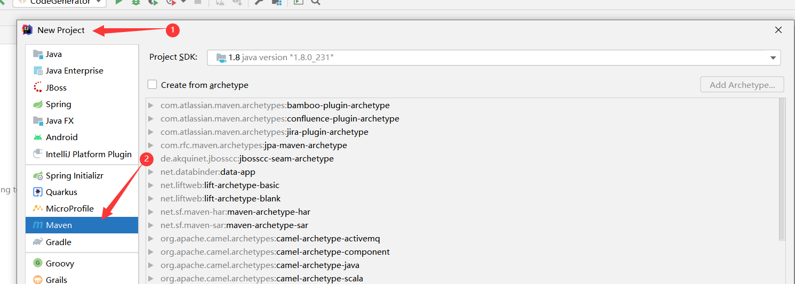

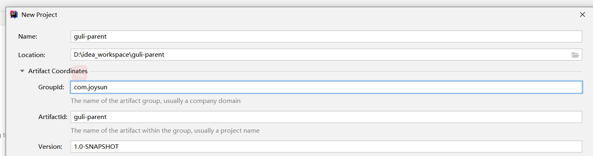


### 1.2 **删除 src 目录**

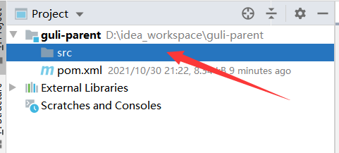

### 1.3 配置 pom.xml

```
<?xml version="1.0" encoding="UTF-8"?>
<project xmlns="http://maven.apache.org/POM/4.0.0"
         xmlns:xsi="http://www.w3.org/2001/XMLSchema-instance"
         xsi:schemaLocation="http://maven.apache.org/POM/4.0.0 http://maven.apache.org/xsd/maven-4.0.0.xsd">
    <modelVersion>4.0.0</modelVersion>
    <parent>
        <groupId>org.springframework.boot</groupId>
        <artifactId>spring-boot-starter-parent</artifactId>
        <version>2.2.1.RELEASE</version>
        <relativePath/> <!-- lookup parent from repository -->
    </parent>
    <groupId>com.joysun</groupId>
    <artifactId>guli-parent</artifactId>
    <version>1.0-SNAPSHOT</version>
    <packaging>pom</packaging> <!--模块类型-->
    <name>guli_parent</name>
    <description>Demo project for Spring Boot</description>

    <properties>
        <java.version>1.8</java.version>
        <guli.version>0.0.1-SNAPSHOT</guli.version>
        <mybatis-plus.version>3.0.5</mybatis-plus.version>
        <velocity.version>2.0</velocity.version>
        <swagger.version>2.7.0</swagger.version>
        <aliyun.oss.version>2.8.3</aliyun.oss.version>
        <jodatime.version>2.10.1</jodatime.version>
        <poi.version>3.17</poi.version>
        <commons-fileupload.version>1.3.1</commons-fileupload.version>
        <commons-io.version>2.6</commons-io.version>
        <httpclient.version>4.5.1</httpclient.version>
        <jwt.version>0.7.0</jwt.version>
        <aliyun-java-sdk-core.version>4.3.3</aliyun-java-sdk-core.version>
        <aliyun-sdk-oss.version>3.1.0</aliyun-sdk-oss.version>
        <aliyun-java-sdk-vod.version>2.15.2</aliyun-java-sdk-vod.version>
        <aliyun-java-vod-upload.version>1.4.11</aliyun-java-vod-upload.version>
        <aliyun-sdk-vod-upload.version>1.4.11</aliyun-sdk-vod-upload.version>
        <fastjson.version>1.2.28</fastjson.version>
        <gson.version>2.8.2</gson.version>
        <json.version>20170516</json.version>
        <commons-dbutils.version>1.7</commons-dbutils.version>
        <canal.client.version>1.1.0</canal.client.version>
        <docker.image.prefix>zx</docker.image.prefix>
        <cloud-alibaba.version>0.2.2.RELEASE</cloud-alibaba.version>
    </properties>

    <dependencyManagement>
        <dependencies>
            <!--Spring Cloud-->
            <dependency>
                <groupId>org.springframework.cloud</groupId>
                <artifactId>spring-cloud-dependencies</artifactId>
                <version>Hoxton.RELEASE</version>
                <type>pom</type>
                <scope>import</scope>
            </dependency>

            <dependency>
                <groupId>org.springframework.cloud</groupId>
                <artifactId>spring-cloud-alibaba-dependencies</artifactId>
                <version>${cloud-alibaba.version}</version>
                <type>pom</type>
                <scope>import</scope>
            </dependency>
            <!--mybatis-plus 持久层-->
            <dependency>
                <groupId>com.baomidou</groupId>
                <artifactId>mybatis-plus-boot-starter</artifactId>
                <version>${mybatis-plus.version}</version>
            </dependency>

            <!-- velocity 模板引擎, Mybatis Plus 代码生成器需要 -->
            <dependency>
                <groupId>org.apache.velocity</groupId>
                <artifactId>velocity-engine-core</artifactId>
                <version>${velocity.version}</version>
            </dependency>

            <!--swagger-->
            <dependency>
                <groupId>io.springfox</groupId>
                <artifactId>springfox-swagger2</artifactId>
                <version>${swagger.version}</version>
            </dependency>
            <!--swagger ui-->
            <dependency>
                <groupId>io.springfox</groupId>
                <artifactId>springfox-swagger-ui</artifactId>
                <version>${swagger.version}</version>
            </dependency>

            <!--aliyunOSS-->
            <dependency>
                <groupId>com.aliyun.oss</groupId>
                <artifactId>aliyun-sdk-oss</artifactId>
                <version>${aliyun.oss.version}</version>
            </dependency>

            <!--日期时间工具-->
            <dependency>
                <groupId>joda-time</groupId>
                <artifactId>joda-time</artifactId>
                <version>${jodatime.version}</version>
            </dependency>

            <!--xls-->
            <dependency>
                <groupId>org.apache.poi</groupId>
                <artifactId>poi</artifactId>
                <version>${poi.version}</version>
            </dependency>
            <!--xlsx-->
            <dependency>
                <groupId>org.apache.poi</groupId>
                <artifactId>poi-ooxml</artifactId>
                <version>${poi.version}</version>
            </dependency>

            <!--文件上传-->
            <dependency>
                <groupId>commons-fileupload</groupId>
                <artifactId>commons-fileupload</artifactId>
                <version>${commons-fileupload.version}</version>
            </dependency>

            <!--commons-io-->
            <dependency>
                <groupId>commons-io</groupId>
                <artifactId>commons-io</artifactId>
                <version>${commons-io.version}</version>
            </dependency>

            <!--httpclient-->
            <dependency>
                <groupId>org.apache.httpcomponents</groupId>
                <artifactId>httpclient</artifactId>
                <version>${httpclient.version}</version>
            </dependency>

            <dependency>
                <groupId>com.google.code.gson</groupId>
                <artifactId>gson</artifactId>
                <version>${gson.version}</version>
            </dependency>

            <!-- JWT -->
            <dependency>
                <groupId>io.jsonwebtoken</groupId>
                <artifactId>jjwt</artifactId>
                <version>${jwt.version}</version>
            </dependency>

            <!--aliyun-->
            <dependency>
                <groupId>com.aliyun</groupId>
                <artifactId>aliyun-java-sdk-core</artifactId>
                <version>${aliyun-java-sdk-core.version}</version>
            </dependency>
            <dependency>
                <groupId>com.aliyun.oss</groupId>
                <artifactId>aliyun-sdk-oss</artifactId>
                <version>${aliyun-sdk-oss.version}</version>
            </dependency>
            <dependency>
                <groupId>com.aliyun</groupId>
                <artifactId>aliyun-java-sdk-vod</artifactId>
                <version>${aliyun-java-sdk-vod.version}</version>
            </dependency>
            <dependency>
                <groupId>com.aliyun</groupId>
                <artifactId>aliyun-java-vod-upload</artifactId>
                <version>${aliyun-java-vod-upload.version}</version>
            </dependency>
            <dependency>
                <groupId>com.aliyun</groupId>
                <artifactId>aliyun-sdk-vod-upload</artifactId>
                <version>${aliyun-sdk-vod-upload.version}</version>
            </dependency>
            <dependency>
                <groupId>com.alibaba</groupId>
                <artifactId>fastjson</artifactId>
                <version>${fastjson.version}</version>
            </dependency>
            <dependency>
                <groupId>org.json</groupId>
                <artifactId>json</artifactId>
                <version>${json.version}</version>
            </dependency>

            <dependency>
                <groupId>commons-dbutils</groupId>
                <artifactId>commons-dbutils</artifactId>
                <version>${commons-dbutils.version}</version>
            </dependency>

            <dependency>
                <groupId>com.alibaba.otter</groupId>
                <artifactId>canal.client</artifactId>
                <version>${canal.client.version}</version>
            </dependency>
        </dependencies>
    </dependencyManagement>
    <build>
        <plugins>
            <plugin>
                <groupId>org.springframework.boot</groupId>
                <artifactId>spring-boot-maven-plugin</artifactId>
            </plugin>
        </plugins>
    </build>
</project>
```

## 2. 搭建service模块

### 2.1 在父工程guli-parent下面创建模块service

**1. 选择 maven类型，点击下一步**

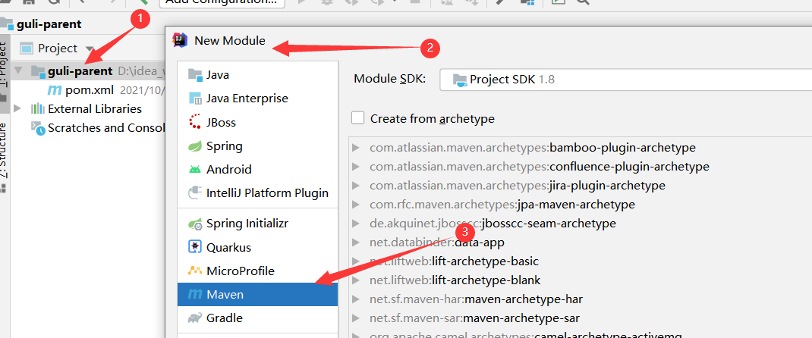

2. **输入模块名称 service，下一步完成创建**
   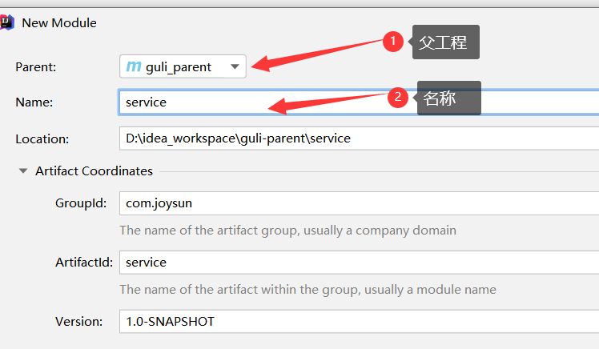

### 2.2 POM配置

```
### <artifactId> 节点后面添加pom类型
<?xml version="1.0" encoding="UTF-8"?>
<project xmlns="http://maven.apache.org/POM/4.0.0"
         xmlns:xsi="http://www.w3.org/2001/XMLSchema-instance"
         xsi:schemaLocation="http://maven.apache.org/POM/4.0.0 http://maven.apache.org/xsd/maven-4.0.0.xsd">
    <parent>
        <artifactId>guli-parent</artifactId>
        <groupId>com.joysun</groupId>
        <version>1.0-SNAPSHOT</version>
    </parent>
    <modelVersion>4.0.0</modelVersion>

    <artifactId>service</artifactId>
    <packaging>pom</packaging>
    <dependencies>
        <dependency>
            <groupId>org.springframework.cloud</groupId>
            <artifactId>spring-cloud-starter-netflix-ribbon</artifactId>
        </dependency>

        <!--hystrix依赖，主要是用  @HystrixCommand -->
        <dependency>
            <groupId>org.springframework.cloud</groupId>
            <artifactId>spring-cloud-starter-netflix-hystrix</artifactId>
        </dependency>

        <!--服务注册-->
        <dependency>
            <groupId>org.springframework.cloud</groupId>
            <artifactId>spring-cloud-starter-alibaba-nacos-discovery</artifactId>
        </dependency>
        <!--服务调用-->
        <dependency>
            <groupId>org.springframework.cloud</groupId>
            <artifactId>spring-cloud-starter-openfeign</artifactId>
        </dependency>

        <dependency>
            <groupId>org.springframework.boot</groupId>
            <artifactId>spring-boot-starter-web</artifactId>
        </dependency>

        <!--mybatis-plus-->
        <dependency>
            <groupId>com.baomidou</groupId>
            <artifactId>mybatis-plus-boot-starter</artifactId>
        </dependency>

        <!--mysql-->
        <dependency>
            <groupId>mysql</groupId>
            <artifactId>mysql-connector-java</artifactId>
        </dependency>

        <!-- velocity 模板引擎, Mybatis Plus 代码生成器需要 -->
        <dependency>
            <groupId>org.apache.velocity</groupId>
            <artifactId>velocity-engine-core</artifactId>
        </dependency>

        <!--swagger-->
        <dependency>
            <groupId>io.springfox</groupId>
            <artifactId>springfox-swagger2</artifactId>
        </dependency>
        <dependency>
            <groupId>io.springfox</groupId>
            <artifactId>springfox-swagger-ui</artifactId>
        </dependency>

        <!--lombok用来简化实体类：需要安装lombok插件-->
        <dependency>
            <groupId>org.projectlombok</groupId>
            <artifactId>lombok</artifactId>
        </dependency>

        <!--xls-->
        <dependency>
            <groupId>org.apache.poi</groupId>
            <artifactId>poi</artifactId>
        </dependency>

        <dependency>
            <groupId>org.apache.poi</groupId>
            <artifactId>poi-ooxml</artifactId>
        </dependency>

        <dependency>
            <groupId>commons-fileupload</groupId>
            <artifactId>commons-fileupload</artifactId>
        </dependency>

        <!--httpclient-->
        <dependency>
            <groupId>org.apache.httpcomponents</groupId>
            <artifactId>httpclient</artifactId>
        </dependency>
        <!--commons-io-->
        <dependency>
            <groupId>commons-io</groupId>
            <artifactId>commons-io</artifactId>
        </dependency>
        <!--gson-->
        <dependency>
            <groupId>com.google.code.gson</groupId>
            <artifactId>gson</artifactId>
        </dependency>

        <dependency>
            <groupId>junit</groupId>
            <artifactId>junit</artifactId>
            <version>4.12</version>
        </dependency>
    </dependencies>
</project>
```

### 2.3 创建service-edu模块

#### 1. 在父工程service模块下面创建子模块service-edu

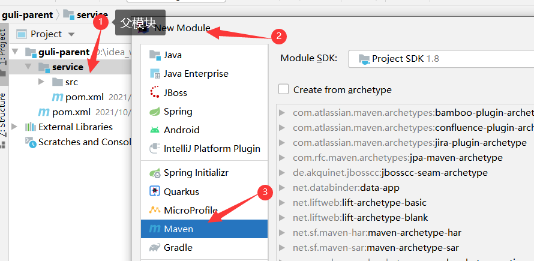

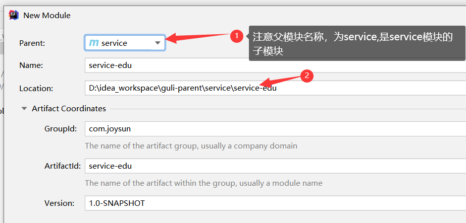

#### 2. 创建库表

相关[sql文件目录](sqlFiles/edu_project_sqls)


#### 3. **在service下面service-edu模块中创建配置文件**

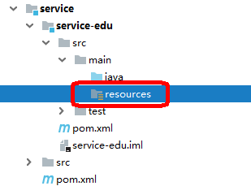

**resources目录下创建文件 application.properties**

```
# 服务端口
server.port=8001
# 服务名
spring.application.name=service-edu
# 环境设置：dev、test、prod
spring.profiles.active=dev
# mysql数据库连接
spring.datasource.driver-class-name=com.mysql.cj.jdbc.Driver
spring.datasource.url=jdbc:mysql://192.168.183.140:3306/guli?serverTimezone=GMT%2B8
spring.datasource.username=root
spring.datasource.password=Joy.123com
#mybatis日志
mybatis-plus.configuration.log-impl=org.apache.ibatis.logging.stdout.StdOutImpl
```

**或者在resources目录下创建文件 application.yml**

```
#### application.yml
spring:
  application:
    name: service-edu
profiles:
    active: dev
####  application-dev.yml
server:
  port: 8001
mybatis-plus:
  configuration:
    log-impl: org.apache.ibatis.logging.stdout.StdOutImpl
mapper-locations: classpath:com/atguigu/service/*/mapper/*.xml
global-config:
    db-config:
      logic-delete-value: 1
logic-not-delete-value: 0
spring:
datasource:
    type: com.zaxxer.hikari.HikariDataSource
driver-class-name: com.mysql.cj.jdbc.Driver
url: jdbc:mysql://localhost:3306/guli?serverTimezone=GMT%2B8
username: root
password: root
hikari:
      connection-test-query: SELECT 1
connection-timeout: 60000
idle-timeout: 500000
max-lifetime: 540000
maximum-pool-size: 12
minimum-idle: 10
pool-name: GuliHikariPool
jackson:
    date-format: yyyy-MM-dd HH:mm:ss
time-zone: GMT+8
```

#### 4. 主启动类

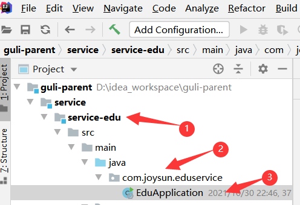

```
package com.joysun.edu;

import lombok.extern.slf4j.Slf4j;
import org.springframework.boot.SpringApplication;
import org.springframework.boot.autoconfigure.SpringBootApplication;

@SpringBootApplication
@Slf4j
public class EduApplication {
    public static void main(String[] args) {
        SpringApplication.run(EduApplication.class,args);
    }
}
```


#### 5. 创建MP代码生成器

（1）**确认主目录,引入依赖（已经引入）**

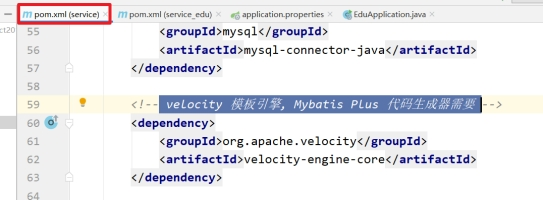 

**（2）构建代码生成器：复制代码以下代码，修改参数**
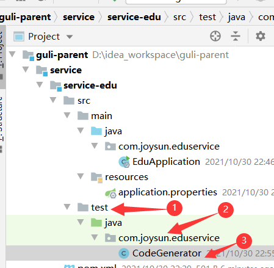

```
package com.joysun.eduservice;

import com.baomidou.mybatisplus.annotation.DbType;
import com.baomidou.mybatisplus.annotation.IdType;
import com.baomidou.mybatisplus.generator.AutoGenerator;
import com.baomidou.mybatisplus.generator.config.DataSourceConfig;
import com.baomidou.mybatisplus.generator.config.GlobalConfig;
import com.baomidou.mybatisplus.generator.config.PackageConfig;
import com.baomidou.mybatisplus.generator.config.StrategyConfig;
import com.baomidou.mybatisplus.generator.config.rules.DateType;
import com.baomidou.mybatisplus.generator.config.rules.NamingStrategy;
import org.junit.Test;

/**
 * @author joysun
 * @create 2021-10-30 22:55
 */
public class CodeGenerator {
    @Test
    public void run(){
        // 1、创建代码生成器
        AutoGenerator mpg = new AutoGenerator();

        // 2、全局配置
        GlobalConfig gc = new GlobalConfig();
        String projectPath = System.getProperty("user.dir");
        gc.setOutputDir(projectPath + "/src/main/java");
        gc.setAuthor("testjava");
        gc.setOpen(false); //生成后是否打开资源管理器
        gc.setFileOverride(false); //重新生成时文件是否覆盖
        gc.setServiceName("%sService");	//去掉Service接口的首字母I
        gc.setIdType(IdType.ID_WORKER_STR); //主键策略:需根据数据库主键类型修改
        gc.setDateType(DateType.ONLY_DATE);//定义生成的实体类中日期类型
        gc.setSwagger2(true);//开启Swagger2模式

        mpg.setGlobalConfig(gc);

        // 3、数据源配置
        DataSourceConfig dsc = new DataSourceConfig();
        dsc.setUrl("jdbc:mysql://192.168.183.140:3306/guli?serverTimezone=GMT%2B8");
        dsc.setDriverName("com.mysql.jdbc.Driver");
        dsc.setUsername("root");
        dsc.setPassword("Joy.123com");
        dsc.setDbType(DbType.MYSQL);
        mpg.setDataSource(dsc);

        // 4、包配置
        PackageConfig pc = new PackageConfig();
        pc.setModuleName("edu"); //模块名
        pc.setParent("com.joysun");
        pc.setController("controller");
        pc.setEntity("entity");
        pc.setService("service");
        pc.setMapper("mapper");
        mpg.setPackageInfo(pc);

        // 5、策略配置
        StrategyConfig strategy = new StrategyConfig();
        strategy.setInclude("edu_teacher");
        strategy.setNaming(NamingStrategy.underline_to_camel);//数据库表映射到实体的命名策略
        strategy.setTablePrefix(pc.getModuleName() + "_"); //生成实体时去掉表前缀

        strategy.setColumnNaming(NamingStrategy.underline_to_camel);//数据库表字段映射到实体的命名策略
        strategy.setEntityLombokModel(true); // lombok 模型 @Accessors(chain = true) setter链式操作

        strategy.setRestControllerStyle(true); //restful api风格控制器
        strategy.setControllerMappingHyphenStyle(true); //url中驼峰转连字符

        mpg.setStrategy(strategy);
        // 6、执行
        mpg.execute();
    }
}

```

**（3）运行代码生成器**
可以看到module目录下自动生成的相关包和类


#### 6. 创建配置类

```
package com.joysun.edu.config;

import org.mybatis.spring.annotation.MapperScan;
import org.springframework.context.annotation.Configuration;
import org.springframework.transaction.annotation.EnableTransactionManagement;

@EnableTransactionManagement
@Configuration
@MapperScan("com.joysun.edu.mapper")
public class MyBatisPlusConfig {
}

```

#### 7. 环境测试

1）**查询所有讲师信息**:实现Controller方法

```
package com.joysun.edu.controller;


import com.joysun.edu.entity.Teacher;
import com.joysun.edu.service.TeacherService;
import com.joysun.edu.service.impl.TeacherServiceImpl;
import org.springframework.beans.factory.annotation.Autowired;
import org.springframework.web.bind.annotation.GetMapping;
import org.springframework.web.bind.annotation.RequestMapping;

import org.springframework.web.bind.annotation.RestController;

import java.util.List;

@RestController
@RequestMapping("/edu/teacher")
public class TeacherController {
    @Autowired
private TeacherService teacherService;

    @GetMapping
    public List<Teacher> getAllTeachers(){
       List<Teacher> teachers=teacherService.list(null);
       return teachers;
    }
}

```

2）**测试**
启动项目后，访问http://localhost:8001/edu/teacher,查看是否可以获取到数据

3）**添加配置**

```
#返回json的全局时间格式
spring.jackson.date-format=yyyy-MM-dd HH:mm:ss
spring.jackson.time-zone=GMT+8
```

#### 8. 讲师逻辑删除

1) **添加注解**`@TableLogic`

```
 @TableLogic
 @ApiModelProperty(value = "逻辑删除 1（true）已删除， 0（false）未删除")
 private Boolean isDeleted;
```

**2) 添加逻辑删除插件**

```
package com.joysun.edu.config;

import com.baomidou.mybatisplus.core.injector.ISqlInjector;
import com.baomidou.mybatisplus.extension.injector.LogicSqlInjector;
import org.mybatis.spring.annotation.MapperScan;
import org.springframework.context.annotation.Bean;
import org.springframework.context.annotation.Configuration;
import org.springframework.transaction.annotation.EnableTransactionManagement;

@Configuration
@EnableTransactionManagement
@MapperScan("com.joysun.edu.mapper")
public class MyBatisPlusConfig {
    /**
     * 逻辑删除插件
     */
    @Bean
    public ISqlInjector sqlInjector() {
        return new LogicSqlInjector();
    }
}

```

**3）方法实现**

```
@DeleteMapping("{id}")
    public boolean delTeacher(@PathVariable String id){
        boolean remove=teacherService.removeById(id);
        return remove;
    }
```

**4）测试**

使用POSTMAN,发送请求

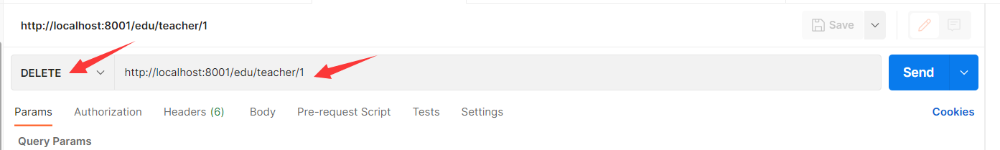

#### 9. Swagger2框架整合

> 本实例使用的Swagger版本是：2.7.0

- **Swagger2简介**

  > 前后端分离开发模式中，api文档是最好的沟通方式。
  >
  > Swagger 是一个规范和完整的框架，用于生成、描述、调用和可视化 RESTful 风格的 Web 服务。
  >
  > - 及时性 (接口变更后，能够及时准确地通知相关前后端开发人员)
  >
  > - 规范性 (并且保证接口的规范性，如接口的地址，请求方式，参数及响应格式和错误信息)
  >
  > - 一致性 (接口信息一致，不会出现因开发人员拿到的文档版本不一致，而出现分歧)
  >
  > - 可测性 (直接在接口文档上进行测试，以方便理解业务)
  >
  > - 下面是常用的一些注解：
  >
  >    ```
  >   @Api: 用在类上，说明该类的作用。
  >   @ApiOperation:用在方法上 ，说明该方法的作用，标注在具体的请求中，value和notes的作用差不多，都是对请求做以说明，tags 则是对请求进行分类的，比如说，你有好几个Controller，分别属于不同的功能模快，那么这里就可以用tags来分类的，
  >    看上去条理性很好
  >   @ApiImplicitParams：用在方法上包含一组参数说明
  >   @ApiImplicitParam：用在@ApiImplicitParams注解中，指定一个请求参数的各个方面
  >    　paramType：参数放在哪个地方
  >    　header 请求参数的获取：@RequestHeader
  >    　query 请求参数的获取：@RequestParam
  >    　path（用于restful接口） 请求参数的获取：@PathVariable
  >    　body（不常用）
  >    　form（不常用）
  >    　name：参数名
  >    　dataType：参数类型
  >    　required：参数是否必须传
  >    　value：参数的意思
  >    　defaultValue：参数的默认值
  >   @ApiResponses：用于表示一组响应
  >   @ApiResponse：用在@ApiResponses中，一般用于表达一个错误的响应信息
  >    　code：数字，例如400
  >    　message：信息，例如"请求参数没填好"
  >    　response：抛出异常的类
  >   @ApiModel：描述一个Model的信息（这种一般用在post创建的时候，使用@RequestBody这样的场景，请求参数无法   @ApiImplicitParam注解进行描述的时候）表明这是一个被swagger框架管理的model，用于class上
  >   @ApiModelProperty 这里顾名思义，描述一个model的属性，就是标注在被标注了@ApiModel的class的属性上，这里的value是对字段的描述，example是取值例子，注意这里的example很有用，对于前后端开发工程师理解文档起到了关键的作用，因为会在api文档页面上显示出这些取值来；这个注解还有一些字段取值，可以自己研究，举例说一个：position，表明字段在model中的顺序。
  >   
  >    ```
  >
  >   

##### **1 创建二级父模块**

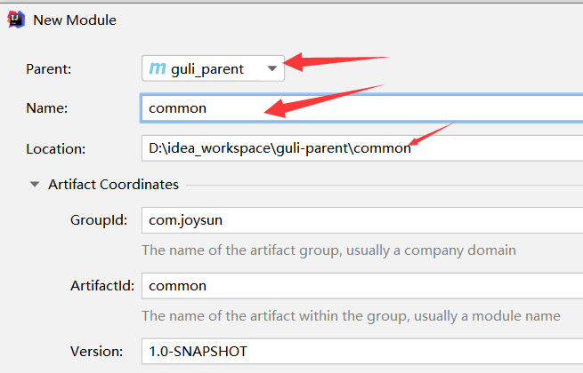
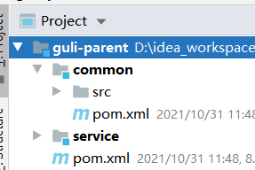

**1) 修改POM:设置模块类型，添加依赖**

```
<?xml version="1.0" encoding="UTF-8"?>
<project xmlns="http://maven.apache.org/POM/4.0.0"
         xmlns:xsi="http://www.w3.org/2001/XMLSchema-instance"
         xsi:schemaLocation="http://maven.apache.org/POM/4.0.0 http://maven.apache.org/xsd/maven-4.0.0.xsd">
    <parent>
        <artifactId>guli-parent</artifactId>
        <groupId>com.joysun</groupId>
        <version>1.0-SNAPSHOT</version>
    </parent>
    <modelVersion>4.0.0</modelVersion>

    <artifactId>common</artifactId>
    <packaging>pom</packaging> <!--设置模块类型为pom-->

    <dependencies>
        <dependency>
            <groupId>org.springframework.boot</groupId>
            <artifactId>spring-boot-starter-web</artifactId>
            <scope>provided </scope>
        </dependency>

        <!--mybatis-plus-->
        <dependency>
            <groupId>com.baomidou</groupId>
            <artifactId>mybatis-plus-boot-starter</artifactId>
            <scope>provided </scope>
        </dependency>

        <!--lombok用来简化实体类：需要安装lombok插件-->
        <dependency>
            <groupId>org.projectlombok</groupId>
            <artifactId>lombok</artifactId>
            <scope>provided </scope>
        </dependency>

        <!--swagger-->
        <dependency>
            <groupId>io.springfox</groupId>
            <artifactId>springfox-swagger2</artifactId>
            <scope>provided </scope>
        </dependency>
        <dependency>
            <groupId>io.springfox</groupId>
            <artifactId>springfox-swagger-ui</artifactId>
            <scope>provided </scope>
        </dependency>

        <!-- redis -->
        <dependency>
            <groupId>org.springframework.boot</groupId>
            <artifactId>spring-boot-starter-data-redis</artifactId>
        </dependency>

        <!-- spring2.X集成redis所需common-pool2
        <dependency>
            <groupId>org.apache.commons</groupId>
            <artifactId>commons-pool2</artifactId>
            <version>2.6.0</version>
        </dependency>-->
    </dependencies>

</project>
```

##### **2 创建三级模块service_base**

**1) 创建模块**

在common模块下创建三级模块service_base

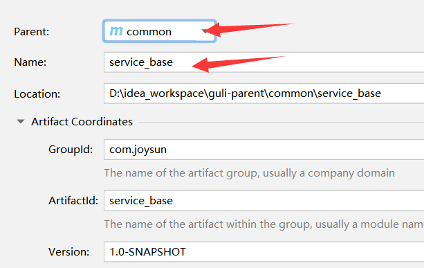

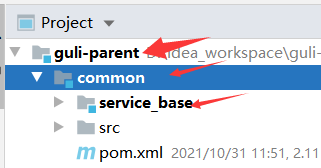

**2）添加配置类**

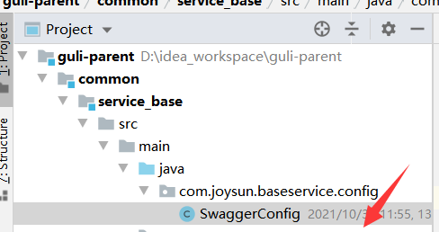

```
package com.joysun.baseservice.config;

import com.google.common.base.Predicates;
import org.springframework.context.annotation.Bean;
import org.springframework.context.annotation.Configuration;
import springfox.documentation.builders.ApiInfoBuilder;
import springfox.documentation.builders.PathSelectors;
import springfox.documentation.service.ApiInfo;
import springfox.documentation.service.Contact;
import springfox.documentation.spi.DocumentationType;
import springfox.documentation.spring.web.plugins.Docket;
import springfox.documentation.swagger2.annotations.EnableSwagger2;

@Configuration
@EnableSwagger2
public class SwaggerConfig {
    @Bean
    public Docket webApiConfig(){

        return new Docket(DocumentationType.SWAGGER_2)
                .groupName("webApi")
                .apiInfo(webApiInfo())
                .select()
                .paths(Predicates.not(PathSelectors.regex("/admin/.*")))
                .paths(Predicates.not(PathSelectors.regex("/error.*")))
                .build();

    }

    private ApiInfo webApiInfo(){

        return new ApiInfoBuilder()
                .title("网站-课程中心API文档")
                .description("本文档描述了课程中心微服务接口定义")
                .version("1.0")
                .contact(new Contact("Helen", "http://joysun.com", "55317332@qq.com"))
                .build();
    }


}

```

**3) service模块下引入依赖**

```
<dependency>
	<groupId>com.joysun</groupId>
	<artifactId>service_base</artifactId>
	<version>1.0-SNAPSHOT</version>
</dependency>
```

**4）启动类添加注解**

```
package com.joysun.edu;

import lombok.extern.slf4j.Slf4j;
import org.springframework.boot.SpringApplication;
import org.springframework.boot.autoconfigure.SpringBootApplication;
import org.springframework.context.annotation.ComponentScan;
import springfox.documentation.swagger2.annotations.EnableSwagger2;

@SpringBootApplication
@ComponentScan(basePackages = {"com.joysun"}) //添加组件扫描
@EnableSwagger2  //这个注解最好也添上，否则会报错
public class EduApplication {
    public static void main(String[] args) {
        SpringApplication.run(EduApplication.class,args);
    }
}

```

**5) 启动测试一下**：运行 `EduApplication`

http://localhost:8001/swagger-ui.html

访问swagger首页 `http://localhost:8080/swagger-ui.html`，错误信息如下：

```
Unable to infer base url. This is common when using dynamic servlet registration or when the API is behind an API Gateway. The base url is the root of where all the swagger resources are served. For e.g. if the api is available at http://example.org/api/v2/api-docs then the base url is http://example.org/api/. Please enter the location manually: 
```

**解决方案**
在主启动类上添上注解`EnableSwagger2`

- **正常显示**

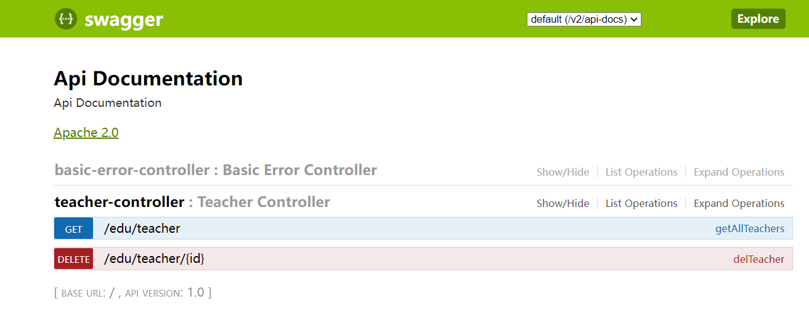

#### 10. 统一数据结果返回

##### **1) 统一数据格式**

```
1、json
（1）对象：{“id”:1,”name”:”zhang3”,”age”:33}
（2）数组：
[{“id”:1,”name”:”zhang3”,”age”:33},{“id”:1,”name”:”zhang3”,”age”:33},{“id”:1,”name”:”zhang3”,”age”:33}]

2、统一格式
{
  "success": true,
  "code": 20000,
  "message": "成功",
  "data": {
    "items": [
      {
        "id": "1",
        "name": "刘德华",
        "intro": "毕业于师范大学数学系，热爱教育事业，执教数学思维6年有余"
      }
    ]
  }
}
（1）success：布尔，判断请求结果
（2）code：数字
（3）message：字符串
（4）data：对象
```

##### **2）在common下创建common_utils**

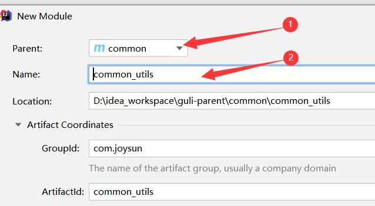


##### **3) 创建主目录，创建接口，返回类 **

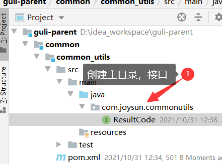

```
### 接口类
package com.joysun.commonutils;

public interface ResultCode {
    public static Integer SUCCESS = 20000;
    public static Integer ERROR = 20001;
}

### 返回类
package com.joysun.commonutils;

import io.swagger.annotations.ApiModelProperty;
import lombok.Data;

import java.util.HashMap;
import java.util.Map;

@Data
public class R {
    @ApiModelProperty(value = "是否成功")
    private Boolean success;

    @ApiModelProperty(value = "返回码")
    private Integer code;

    @ApiModelProperty(value = "返回消息")
    private String message;

    @ApiModelProperty(value = "返回数据")
    private Map<String, Object> data = new HashMap<String, Object>();

    private R() {
    }

    public static R ok() {
        R r = new R();
        r.setSuccess(true);
        r.setCode(ResultCode.SUCCESS);
        r.setMessage("成功");
        return r;
    }

    public static R error() {
        R r = new R();
        r.setSuccess(false);
        r.setCode(ResultCode.ERROR);
        r.setMessage("失败");
        return r;
    }

    public R success(Boolean success) {
        this.setSuccess(success);
        return this;
    }

    public R message(String message) {
        this.setMessage(message);
        return this;
    }

    public R code(Integer code) {
        this.setCode(code);
        return this;
    }

    public R data(String key, Object value) {
        this.data.put(key, value);
        return this;
    }

    public R data(Map<String, Object> map) {
        this.setData(map);
        return this;
    }
}

```

##### 4) **在service模块下添加依赖**

```
<dependency>
	<groupId>com.joysun</groupId>
	<artifactId>common_utils</artifactId>
	<version>1.0-SNAPSHOT</version>
</dependency>
```

##### 5）改造已有接口

```
 @ApiOperation(value = "所有讲师列表")
    @GetMapping
    public R getAllTeachers() {
        List<Teacher> teachers = teacherService.list(null);
        return R.ok().data("teachers",teachers);
    }

    @ApiOperation(value = "删除讲师")
    @DeleteMapping("{id}")
    public R delTeacher(@PathVariable String id){
        boolean remove = teacherService.removeById(id);
        if(remove){
            return R.ok();
        }else{
            return R.error();
        }
```

**6）测试**

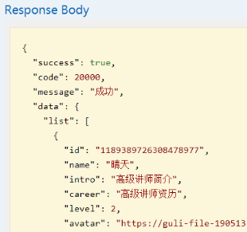

#### 11. 讲师分页查询

##### 1）添加分页插件

```
### 在MyBatisPlusConfig 添加分页插件
/**
 * 分页插件
 */
@Bean
public PaginationInterceptor paginationInterceptor() {
    return new PaginationInterceptor();
}
```

##### 2）实现方法

```
    @ApiOperation(value = "分页查询讲师列表")
    @GetMapping("getTeacherPage/{current}/{limit}")
    public R getTeacherPage(@PathVariable Long current,
                            @PathVariable Long limit){
        Page<Teacher> page = new Page<>(current,limit);
        teacherService.page(page,null);
        List<Teacher> records = page.getRecords();
        long total = page.getTotal();
        //1、存入MAP
//        Map<String,Object> map = new HashMap<>();
//        map.put("list",records);
//        map.put("total",total);
//        return R.ok().data(map);
        //2、直接拼接
        return R.ok().data("list",records).data("total",total);
    }
```

##### 3) 测试

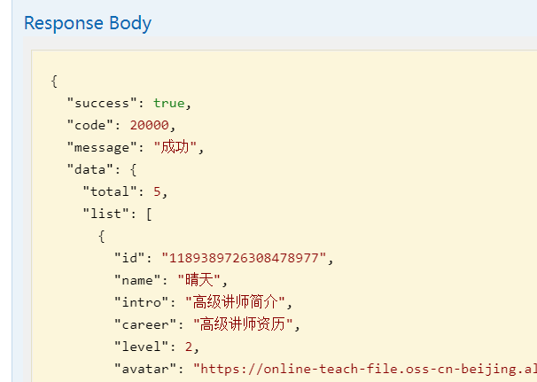

#### 12. **讲师条件查询带分页**

##### 1）需求分析

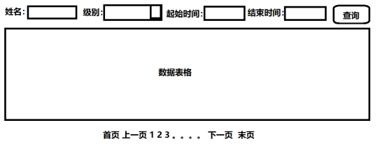

##### 2）**实现接口**

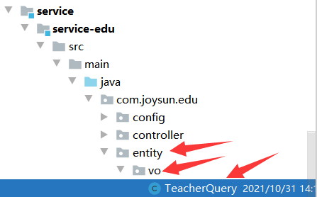

```
### 创建VO对象
package com.joysun.edu.entity.vo;

import io.swagger.annotations.ApiModelProperty;
import lombok.Data;

import java.io.Serializable;

@Data
public class TeacherQuery  implements Serializable {

    @ApiModelProperty(value = "教师名称,模糊查询")
    private String name;

    @ApiModelProperty(value = "头衔 1高级讲师 2首席讲师")
    private Integer level;

    @ApiModelProperty(value = "查询开始时间", example = "2019-01-01 10:10:10")
    private String begin;//注意，这里使用的是String类型，前端传过来的数据无需进行类型转换

    @ApiModelProperty(value = "查询结束时间", example = "2019-12-01 10:10:10")
    private String end;
}


### 2）实现方法
@ApiOperation(value = "带条件分页查询讲师列表")
    @PostMapping("getTeacherPageVo/{current}/{limit}")
    public R getTeacherPageVo(@PathVariable Long current,
                              @PathVariable Long limit,
                              @RequestBody TeacherQuery teacherQuery){
        //@RequestBody把json串转化成实体类
        //1、取出查询条件
        String name = teacherQuery.getName();
        Integer level = teacherQuery.getLevel();
        String begin = teacherQuery.getBegin();
        String end = teacherQuery.getEnd();
        //2、判断条件是否为空，如不为空拼写sql
        QueryWrapper<Teacher> wrapper = new QueryWrapper<>();
        if(!StringUtils.isEmpty(name)){
            wrapper.like("name",name);
        }
        if(!StringUtils.isEmpty(level)){
            wrapper.eq("level",level);
        }
        if(!StringUtils.isEmpty(begin)){
            wrapper.ge("gmt_create",begin);
        }
        if(!StringUtils.isEmpty(end)){
            wrapper.le("gmt_create",end);
        }

        Page<Teacher> page = new Page<>(current,limit);
        teacherService.page(page,wrapper);
        List<Teacher> records = page.getRecords();
        long total = page.getTotal();
        //1、存入MAP
//        Map<String,Object> map = new HashMap<>();
//        map.put("list",records);
//        map.put("total",total);
//        return R.ok().data(map);
        //2、直接拼接
        return R.ok().data("list",records).data("total",total);

    }
```

##### 3）测试

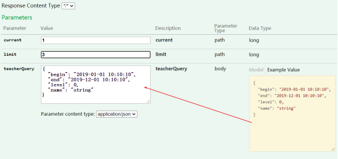

#### 13. 讲师添加功能

##### 1. 实现自动填充

**1）添加注解**

```
@ApiModelProperty(value = "创建时间")
@TableField(fill = FieldFill.INSERT)
private Date gmtCreate;

@ApiModelProperty(value = "更新时间")
@TableField(fill = FieldFill.INSERT_UPDATE)
private Date gmtModified;
```

**2）添加控制器**
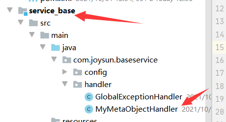

```
package com.joysun.edu.handler;

import com.baomidou.mybatisplus.core.handlers.MetaObjectHandler;
import org.apache.ibatis.reflection.MetaObject;
import org.springframework.context.annotation.ComponentScan;
import org.springframework.stereotype.Component;

import java.util.Date;

@Component
public class MyMetaObjectHandler implements MetaObjectHandler {
    @Override
    public void insertFill(MetaObject metaObject) {
        this.setFieldValByName("gmtCreate",new Date(),metaObject);
        this.setFieldValByName("gmtModified",new Date(),metaObject);
    }

    @Override
    public void updateFill(MetaObject metaObject) {
        this.setFieldValByName("gmtModified",new Date(),metaObject);
    }
}

```

##### 2. 实现接口

```
    @ApiOperation(value = "添加讲师")
    @PostMapping("addTeacher")
    public R addTeacher( @RequestBody Teacher teacher){
        boolean save = teacherService.save(teacher);
        if(save){
            return R.ok();
        }else{
            return R.error();
        }
    }
```

##### 3. 测试

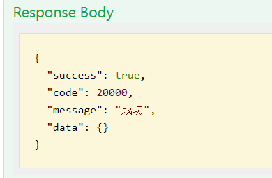

#### 14. **讲师修改功能**

##### 1) 实现根据id查询讲师信息

```
@ApiOperation(value = "根据id查询讲师")
@GetMapping("getTeacherById/{id}")
public R getTeacherById(@PathVariable String id){
	Teacher eduTeacher = teacherService.getById(id);
	return R.ok().data("eduTeacher",eduTeacher);
}
```

##### 2) 修改讲师信息

```
@ApiOperation(value = "修改讲师")
@PostMapping("updateTeacher")
public R updateTeacher( @RequestBody Teacher teacher){
	boolean update = teacherService.updateById(teacher);
	if(update){
		return R.ok();
	}else{
		return R.error();
	}
}
```

##### 3) 测试

#### 15. 统一异常处理

##### 1. 错误程序

```
@ApiOperation(value = "所有讲师列表")
@GetMapping
public R getAllTeacher(){
    int i = 10/0;
    List<EduTeacher> list = teacherService.list(null);
    return R.ok().data("list",list);
}
```

控制台报错：java.lang.ArithmeticException: / by zero

返回前端：

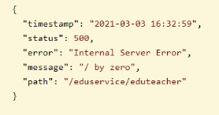 

##### 2. 统一异常处理

我们想让异常结果也显示为统一的返回结果对象，并且统一处理系统的异常信息，那么需要统一异常处理.
**1）在service_base模块下引入依赖**

```
<dependency>
    <groupId>com.joysun</groupId>
    <artifactId>common_utils</artifactId>
    <version>1.0-SNAPSHOT</version>
</dependency>
```

**2) 创建控制器**
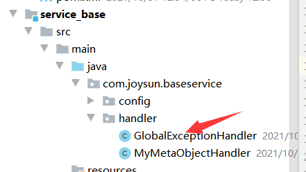

```
@ControllerAdvice
public class GlobalExceptionHandler {

    @ExceptionHandler(Exception.class)
    @ResponseBody
    public R error(Exception e){
        e.printStackTrace();
        return R.error();
    }

}
```

###### 1) 实现特殊异常处理

```
@ExceptionHandler(ArithmeticException.class)
@ResponseBody
public R error(ArithmeticException e){
    e.printStackTrace();
    return R.error().message("特殊异常处理");
}
```

###### 2) 自定义异常处理

1. **定义异常**

```
@Data
@AllArgsConstructor
@NoArgsConstructor
public class GuliException extends RuntimeException {
    @ApiModelProperty(value = "状态码")
    private Integer code;

    private String msg;

}
```

2. **添加控制器方法**

   ```
   @ExceptionHandler(GuliException.class)
   @ResponseBody
   public R error(GuliException e){
       e.printStackTrace();
       return R.error().message(e.getMsg()).code(e.getCode());
   }
   ```

3. **抓异常**
   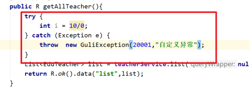

4. ###### 测试

   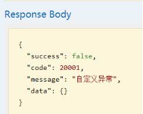