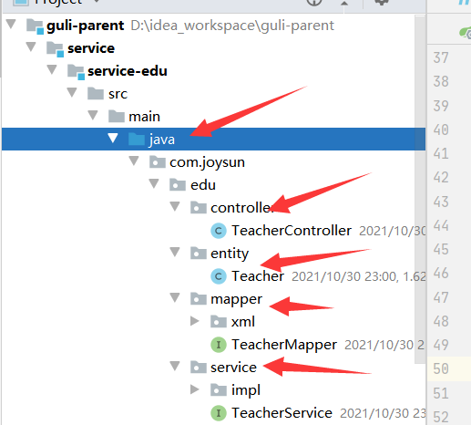
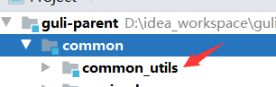
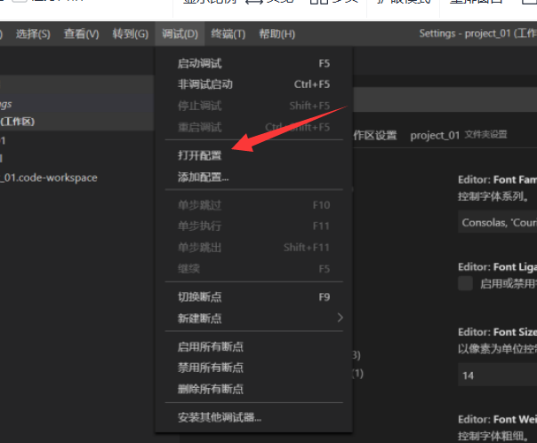
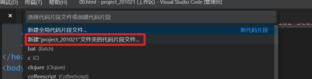
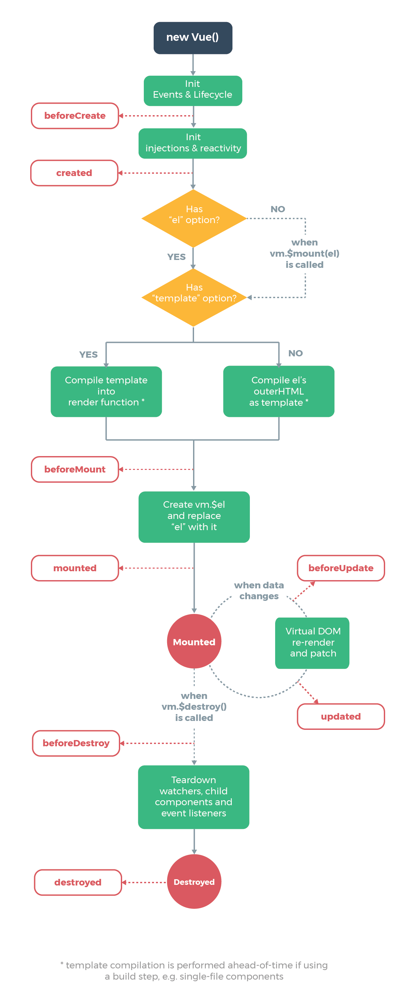
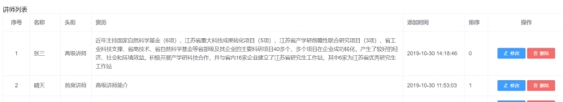

[Toc]

# 商业模式

1. **C2C模式**（Consumer To Consumer 平台模式 ）
   用户到用户，这种模式本质是将自己的流量或者用户转卖给视频或者直播的内容提供者，通过出售内容分成获利。

   平台模式避开了非常沉重的内容和服务，扩张迅速，但实际这种模式也有缺陷，在线教育这两年的发展使内容迅速贬值，比较难带来更免费用户和流量。

2. **B2C模式**（Business To Customer 会员模式）
   商家到用户，这种模式是自己制作大量自有版权的视频，放在自有平台上，让用户按月付费或者按年付费。 这种模式简单，快速，只要专心录制大量视频即可快速发展，其曾因为 lynda 的天价融资而 大热。但在中国由于版权保护意识不强，教育内容易于复制，有海量的免费资源的竞争对手众多等原因，难以取得像样的现金流。

3. **B2B2C**（商家到商家到用户） 
   平台链接第三方教育机构和用户，平台一般不直接提供课程内容，而是更多承担教育的互联网载体角色，为教学过程各个环节提供全方位支持和服务。

4. **垂直领域**
   这种模式需要糅合录播，直播，帮助服务等多种手段，对学生学习某一项内容负责。这种模式收费高，有较强的壁垒。这种产品一旦形成口碑，会有稳定的用户群和收入，但产品非常复杂，难度大，门槛高，即使单独一个项目都会耗费大量的人力物力，因此发展速度较慢。

5. **直播、互动**
   这种模式将传统课堂上的反馈，交互，答疑搬到线上。让用户容易接受，只要服务贴心，用 户就愿意买单，因此有丰富现金流。但缺陷是只能通过平台吸引用户，造成了竞争门槛过低， 模式雷同，对手众多，收益的永远是拥有流量或者用户的大平台。

6. **1 对 1**
   让一个讲师在一定时间内对一个学员进行辅导，学生按照时间支付费用。这种模式收费容易， 现金流好，产品难度不大，市场空间大，但是人力资源的获取消耗却是巨大的，如果师资上控制不好，比如优秀的讲师留不住，或者整体成本太大，都会导致 1 对 1 模式难以发展。

7. **O2O 模式**（Online To Offline 线上到线下）
   就是通过免费内容或者运营，让线上平台获取用户和流量，将用户吸引到线下开课，或 者让学员到加盟的线下机构上课。这种模式形式简单，收益高，只要把控用户需求，吸引到用户，收费不成问题，而且符合传统的消费习惯。

8. **freemium（免费增值）**
   Freemium最早由AVC的Fred Wilson在2006年提出, 指的是用免费服务吸引用户，然后通过增值服务，将部分免费用户转化为收费用户，实现变现。Freemium模式中有“二八定律”的因素，即一小部分对价格不敏感的高端用户，愿意为一些额 外的功能付费，为服务提供者带来大部分收入。

# 工程结构说明

## 1. 工程结构


## 2. 模块说明

**guli-parent：在线教学根目录（父工程），管理四个子模块：**

- **canal-client**：canal数据库表同步模块（统计同步数据）

-  **common**：公共模块父节点
  **common-util**：工具类模块，所有模块都可以依赖于它
  **service-base**：service服务的base包，包含service服务的公共配置类，所有service模块依赖于它
  **spring-security**：认证与授权模块，需要认证授权的service服务依赖于它

- **infrastructure**：基础服务模块父节点
  api-gateway：api网关服务

- **service**：api接口服务父节点

> service-acl：用户权限管理api接口服务（用户管理、角色管理和权限管理等）
>
> service-cms：cms api接口服务
>
> service-edu：教学相关api接口服务
>
> service-msm：短信api接口服务
>
> service-order：订单相关api接口服务
>
> service-oss：阿里云oss api接口服务
>
> service-statistics：统计报表api接口服务
>
> service-ucenter：会员api接口服务
>
> service-vod：视频点播api接口服务

# 工程创建

## 1. 创建父工程

### 1.1 **创建sprigboot工程guli-parent**

在idea开发工具中，使用 Maven创建父工程


### 1.2 **删除 src 目录**


### 1.3 配置 pom.xml

```
<?xml version="1.0" encoding="UTF-8"?>
<project xmlns="http://maven.apache.org/POM/4.0.0"
         xmlns:xsi="http://www.w3.org/2001/XMLSchema-instance"
         xsi:schemaLocation="http://maven.apache.org/POM/4.0.0 http://maven.apache.org/xsd/maven-4.0.0.xsd">
    <modelVersion>4.0.0</modelVersion>
    <parent>
        <groupId>org.springframework.boot</groupId>
        <artifactId>spring-boot-starter-parent</artifactId>
        <version>2.2.1.RELEASE</version>
        <relativePath/> <!-- lookup parent from repository -->
    </parent>
    <groupId>com.joysun</groupId>
    <artifactId>guli-parent</artifactId>
    <version>1.0-SNAPSHOT</version>
    <packaging>pom</packaging> <!--模块类型-->
    <name>guli_parent</name>
    <description>Demo project for Spring Boot</description>

    <properties>
        <java.version>1.8</java.version>
        <guli.version>0.0.1-SNAPSHOT</guli.version>
        <mybatis-plus.version>3.0.5</mybatis-plus.version>
        <velocity.version>2.0</velocity.version>
        <swagger.version>2.7.0</swagger.version>
        <aliyun.oss.version>2.8.3</aliyun.oss.version>
        <jodatime.version>2.10.1</jodatime.version>
        <poi.version>3.17</poi.version>
        <commons-fileupload.version>1.3.1</commons-fileupload.version>
        <commons-io.version>2.6</commons-io.version>
        <httpclient.version>4.5.1</httpclient.version>
        <jwt.version>0.7.0</jwt.version>
        <aliyun-java-sdk-core.version>4.3.3</aliyun-java-sdk-core.version>
        <aliyun-sdk-oss.version>3.1.0</aliyun-sdk-oss.version>
        <aliyun-java-sdk-vod.version>2.15.2</aliyun-java-sdk-vod.version>
        <aliyun-java-vod-upload.version>1.4.11</aliyun-java-vod-upload.version>
        <aliyun-sdk-vod-upload.version>1.4.11</aliyun-sdk-vod-upload.version>
        <fastjson.version>1.2.28</fastjson.version>
        <gson.version>2.8.2</gson.version>
        <json.version>20170516</json.version>
        <commons-dbutils.version>1.7</commons-dbutils.version>
        <canal.client.version>1.1.0</canal.client.version>
        <docker.image.prefix>zx</docker.image.prefix>
        <cloud-alibaba.version>0.2.2.RELEASE</cloud-alibaba.version>
    </properties>

    <dependencyManagement>
        <dependencies>
            <!--Spring Cloud-->
            <dependency>
                <groupId>org.springframework.cloud</groupId>
                <artifactId>spring-cloud-dependencies</artifactId>
                <version>Hoxton.RELEASE</version>
                <type>pom</type>
                <scope>import</scope>
            </dependency>

            <dependency>
                <groupId>org.springframework.cloud</groupId>
                <artifactId>spring-cloud-alibaba-dependencies</artifactId>
                <version>${cloud-alibaba.version}</version>
                <type>pom</type>
                <scope>import</scope>
            </dependency>
            <!--mybatis-plus 持久层-->
            <dependency>
                <groupId>com.baomidou</groupId>
                <artifactId>mybatis-plus-boot-starter</artifactId>
                <version>${mybatis-plus.version}</version>
            </dependency>

            <!-- velocity 模板引擎, Mybatis Plus 代码生成器需要 -->
            <dependency>
                <groupId>org.apache.velocity</groupId>
                <artifactId>velocity-engine-core</artifactId>
                <version>${velocity.version}</version>
            </dependency>

            <!--swagger-->
            <dependency>
                <groupId>io.springfox</groupId>
                <artifactId>springfox-swagger2</artifactId>
                <version>${swagger.version}</version>
            </dependency>
            <!--swagger ui-->
            <dependency>
                <groupId>io.springfox</groupId>
                <artifactId>springfox-swagger-ui</artifactId>
                <version>${swagger.version}</version>
            </dependency>

            <!--aliyunOSS-->
            <dependency>
                <groupId>com.aliyun.oss</groupId>
                <artifactId>aliyun-sdk-oss</artifactId>
                <version>${aliyun.oss.version}</version>
            </dependency>

            <!--日期时间工具-->
            <dependency>
                <groupId>joda-time</groupId>
                <artifactId>joda-time</artifactId>
                <version>${jodatime.version}</version>
            </dependency>

            <!--xls-->
            <dependency>
                <groupId>org.apache.poi</groupId>
                <artifactId>poi</artifactId>
                <version>${poi.version}</version>
            </dependency>
            <!--xlsx-->
            <dependency>
                <groupId>org.apache.poi</groupId>
                <artifactId>poi-ooxml</artifactId>
                <version>${poi.version}</version>
            </dependency>

            <!--文件上传-->
            <dependency>
                <groupId>commons-fileupload</groupId>
                <artifactId>commons-fileupload</artifactId>
                <version>${commons-fileupload.version}</version>
            </dependency>

            <!--commons-io-->
            <dependency>
                <groupId>commons-io</groupId>
                <artifactId>commons-io</artifactId>
                <version>${commons-io.version}</version>
            </dependency>

            <!--httpclient-->
            <dependency>
                <groupId>org.apache.httpcomponents</groupId>
                <artifactId>httpclient</artifactId>
                <version>${httpclient.version}</version>
            </dependency>

            <dependency>
                <groupId>com.google.code.gson</groupId>
                <artifactId>gson</artifactId>
                <version>${gson.version}</version>
            </dependency>

            <!-- JWT -->
            <dependency>
                <groupId>io.jsonwebtoken</groupId>
                <artifactId>jjwt</artifactId>
                <version>${jwt.version}</version>
            </dependency>

            <!--aliyun-->
            <dependency>
                <groupId>com.aliyun</groupId>
                <artifactId>aliyun-java-sdk-core</artifactId>
                <version>${aliyun-java-sdk-core.version}</version>
            </dependency>
            <dependency>
                <groupId>com.aliyun.oss</groupId>
                <artifactId>aliyun-sdk-oss</artifactId>
                <version>${aliyun-sdk-oss.version}</version>
            </dependency>
            <dependency>
                <groupId>com.aliyun</groupId>
                <artifactId>aliyun-java-sdk-vod</artifactId>
                <version>${aliyun-java-sdk-vod.version}</version>
            </dependency>
            <dependency>
                <groupId>com.aliyun</groupId>
                <artifactId>aliyun-java-vod-upload</artifactId>
                <version>${aliyun-java-vod-upload.version}</version>
            </dependency>
            <dependency>
                <groupId>com.aliyun</groupId>
                <artifactId>aliyun-sdk-vod-upload</artifactId>
                <version>${aliyun-sdk-vod-upload.version}</version>
            </dependency>
            <dependency>
                <groupId>com.alibaba</groupId>
                <artifactId>fastjson</artifactId>
                <version>${fastjson.version}</version>
            </dependency>
            <dependency>
                <groupId>org.json</groupId>
                <artifactId>json</artifactId>
                <version>${json.version}</version>
            </dependency>

            <dependency>
                <groupId>commons-dbutils</groupId>
                <artifactId>commons-dbutils</artifactId>
                <version>${commons-dbutils.version}</version>
            </dependency>

            <dependency>
                <groupId>com.alibaba.otter</groupId>
                <artifactId>canal.client</artifactId>
                <version>${canal.client.version}</version>
            </dependency>
        </dependencies>
    </dependencyManagement>
    <build>
        <plugins>
            <plugin>
                <groupId>org.springframework.boot</groupId>
                <artifactId>spring-boot-maven-plugin</artifactId>
            </plugin>
        </plugins>
    </build>
</project>
```

## 2. 搭建service模块

### 2.1 在父工程guli-parent下面创建模块service

**1. 选择 maven类型，点击下一步**


2. **输入模块名称 service，下一步完成创建**
   

### 2.2 POM配置

```
### <artifactId> 节点后面添加pom类型
<?xml version="1.0" encoding="UTF-8"?>
<project xmlns="http://maven.apache.org/POM/4.0.0"
         xmlns:xsi="http://www.w3.org/2001/XMLSchema-instance"
         xsi:schemaLocation="http://maven.apache.org/POM/4.0.0 http://maven.apache.org/xsd/maven-4.0.0.xsd">
    <parent>
        <artifactId>guli-parent</artifactId>
        <groupId>com.joysun</groupId>
        <version>1.0-SNAPSHOT</version>
    </parent>
    <modelVersion>4.0.0</modelVersion>

    <artifactId>service</artifactId>
    <packaging>pom</packaging>
    <dependencies>
        <dependency>
            <groupId>org.springframework.cloud</groupId>
            <artifactId>spring-cloud-starter-netflix-ribbon</artifactId>
        </dependency>

        <!--hystrix依赖，主要是用  @HystrixCommand -->
        <dependency>
            <groupId>org.springframework.cloud</groupId>
            <artifactId>spring-cloud-starter-netflix-hystrix</artifactId>
        </dependency>

        <!--服务注册-->
        <dependency>
            <groupId>org.springframework.cloud</groupId>
            <artifactId>spring-cloud-starter-alibaba-nacos-discovery</artifactId>
        </dependency>
        <!--服务调用-->
        <dependency>
            <groupId>org.springframework.cloud</groupId>
            <artifactId>spring-cloud-starter-openfeign</artifactId>
        </dependency>

        <dependency>
            <groupId>org.springframework.boot</groupId>
            <artifactId>spring-boot-starter-web</artifactId>
        </dependency>

        <!--mybatis-plus-->
        <dependency>
            <groupId>com.baomidou</groupId>
            <artifactId>mybatis-plus-boot-starter</artifactId>
        </dependency>

        <!--mysql-->
        <dependency>
            <groupId>mysql</groupId>
            <artifactId>mysql-connector-java</artifactId>
        </dependency>

        <!-- velocity 模板引擎, Mybatis Plus 代码生成器需要 -->
        <dependency>
            <groupId>org.apache.velocity</groupId>
            <artifactId>velocity-engine-core</artifactId>
        </dependency>

        <!--swagger-->
        <dependency>
            <groupId>io.springfox</groupId>
            <artifactId>springfox-swagger2</artifactId>
        </dependency>
        <dependency>
            <groupId>io.springfox</groupId>
            <artifactId>springfox-swagger-ui</artifactId>
        </dependency>

        <!--lombok用来简化实体类：需要安装lombok插件-->
        <dependency>
            <groupId>org.projectlombok</groupId>
            <artifactId>lombok</artifactId>
        </dependency>

        <!--xls-->
        <dependency>
            <groupId>org.apache.poi</groupId>
            <artifactId>poi</artifactId>
        </dependency>

        <dependency>
            <groupId>org.apache.poi</groupId>
            <artifactId>poi-ooxml</artifactId>
        </dependency>

        <dependency>
            <groupId>commons-fileupload</groupId>
            <artifactId>commons-fileupload</artifactId>
        </dependency>

        <!--httpclient-->
        <dependency>
            <groupId>org.apache.httpcomponents</groupId>
            <artifactId>httpclient</artifactId>
        </dependency>
        <!--commons-io-->
        <dependency>
            <groupId>commons-io</groupId>
            <artifactId>commons-io</artifactId>
        </dependency>
        <!--gson-->
        <dependency>
            <groupId>com.google.code.gson</groupId>
            <artifactId>gson</artifactId>
        </dependency>

        <dependency>
            <groupId>junit</groupId>
            <artifactId>junit</artifactId>
            <version>4.12</version>
        </dependency>
    </dependencies>
</project>
```

### 2.3 创建service-edu模块

#### 1. 在父工程service模块下面创建子模块service-edu


#### 2. 创建库表

相关[sql文件目录](sqlFiles/edu_project_sqls)


#### 3. **在service下面service-edu模块中创建配置文件**


**resources目录下创建文件 application.properties**

```
# 服务端口
server.port=8001
# 服务名
spring.application.name=service-edu
# 环境设置：dev、test、prod
spring.profiles.active=dev
# mysql数据库连接
spring.datasource.driver-class-name=com.mysql.cj.jdbc.Driver
spring.datasource.url=jdbc:mysql://192.168.183.140:3306/guli?serverTimezone=GMT%2B8
spring.datasource.username=root
spring.datasource.password=Joy.123com
#mybatis日志
mybatis-plus.configuration.log-impl=org.apache.ibatis.logging.stdout.StdOutImpl
```

**或者在resources目录下创建文件 application.yml**

```
#### application.yml
spring:
  application:
    name: service-edu
profiles:
    active: dev
####  application-dev.yml
server:
  port: 8001
mybatis-plus:
  configuration:
    log-impl: org.apache.ibatis.logging.stdout.StdOutImpl
mapper-locations: classpath:com/atguigu/service/*/mapper/*.xml
global-config:
    db-config:
      logic-delete-value: 1
logic-not-delete-value: 0
spring:
datasource:
    type: com.zaxxer.hikari.HikariDataSource
driver-class-name: com.mysql.cj.jdbc.Driver
url: jdbc:mysql://localhost:3306/guli?serverTimezone=GMT%2B8
username: root
password: root
hikari:
      connection-test-query: SELECT 1
connection-timeout: 60000
idle-timeout: 500000
max-lifetime: 540000
maximum-pool-size: 12
minimum-idle: 10
pool-name: GuliHikariPool
jackson:
    date-format: yyyy-MM-dd HH:mm:ss
time-zone: GMT+8
```

#### 4. 主启动类


```
package com.joysun.edu;

import lombok.extern.slf4j.Slf4j;
import org.springframework.boot.SpringApplication;
import org.springframework.boot.autoconfigure.SpringBootApplication;

@SpringBootApplication
@Slf4j
public class EduApplication {
    public static void main(String[] args) {
        SpringApplication.run(EduApplication.class,args);
    }
}
```


#### 5. 创建MP代码生成器

（1）**确认主目录,引入依赖（已经引入）**

 

**（2）构建代码生成器：复制代码以下代码，修改参数**


```
package com.joysun.eduservice;

import com.baomidou.mybatisplus.annotation.DbType;
import com.baomidou.mybatisplus.annotation.IdType;
import com.baomidou.mybatisplus.generator.AutoGenerator;
import com.baomidou.mybatisplus.generator.config.DataSourceConfig;
import com.baomidou.mybatisplus.generator.config.GlobalConfig;
import com.baomidou.mybatisplus.generator.config.PackageConfig;
import com.baomidou.mybatisplus.generator.config.StrategyConfig;
import com.baomidou.mybatisplus.generator.config.rules.DateType;
import com.baomidou.mybatisplus.generator.config.rules.NamingStrategy;
import org.junit.Test;

/**
 * @author joysun
 * @create 2021-10-30 22:55
 */
public class CodeGenerator {
    @Test
    public void run(){
        // 1、创建代码生成器
        AutoGenerator mpg = new AutoGenerator();

        // 2、全局配置
        GlobalConfig gc = new GlobalConfig();
        String projectPath = System.getProperty("user.dir");
        gc.setOutputDir(projectPath + "/src/main/java");
        gc.setAuthor("testjava");
        gc.setOpen(false); //生成后是否打开资源管理器
        gc.setFileOverride(false); //重新生成时文件是否覆盖
        gc.setServiceName("%sService");	//去掉Service接口的首字母I
        gc.setIdType(IdType.ID_WORKER_STR); //主键策略:需根据数据库主键类型修改
        gc.setDateType(DateType.ONLY_DATE);//定义生成的实体类中日期类型
        gc.setSwagger2(true);//开启Swagger2模式

        mpg.setGlobalConfig(gc);

        // 3、数据源配置
        DataSourceConfig dsc = new DataSourceConfig();
        dsc.setUrl("jdbc:mysql://192.168.183.140:3306/guli?serverTimezone=GMT%2B8");
        dsc.setDriverName("com.mysql.jdbc.Driver");
        dsc.setUsername("root");
        dsc.setPassword("Joy.123com");
        dsc.setDbType(DbType.MYSQL);
        mpg.setDataSource(dsc);

        // 4、包配置
        PackageConfig pc = new PackageConfig();
        pc.setModuleName("edu"); //模块名
        pc.setParent("com.joysun");
        pc.setController("controller");
        pc.setEntity("entity");
        pc.setService("service");
        pc.setMapper("mapper");
        mpg.setPackageInfo(pc);

        // 5、策略配置
        StrategyConfig strategy = new StrategyConfig();
        strategy.setInclude("edu_teacher");
        strategy.setNaming(NamingStrategy.underline_to_camel);//数据库表映射到实体的命名策略
        strategy.setTablePrefix(pc.getModuleName() + "_"); //生成实体时去掉表前缀

        strategy.setColumnNaming(NamingStrategy.underline_to_camel);//数据库表字段映射到实体的命名策略
        strategy.setEntityLombokModel(true); // lombok 模型 @Accessors(chain = true) setter链式操作

        strategy.setRestControllerStyle(true); //restful api风格控制器
        strategy.setControllerMappingHyphenStyle(true); //url中驼峰转连字符

        mpg.setStrategy(strategy);
        // 6、执行
        mpg.execute();
    }
}

```

**（3）运行代码生成器**
可以看到module目录下自动生成的相关包和类



#### 6. 创建配置类

```
package com.joysun.edu.config;

import org.mybatis.spring.annotation.MapperScan;
import org.springframework.context.annotation.Configuration;
import org.springframework.transaction.annotation.EnableTransactionManagement;

@EnableTransactionManagement
@Configuration
@MapperScan("com.joysun.edu.mapper")
public class MyBatisPlusConfig {
}

```

#### 7. 环境测试

1）**查询所有讲师信息**:实现Controller方法

```
package com.joysun.edu.controller;


import com.joysun.edu.entity.Teacher;
import com.joysun.edu.service.TeacherService;
import com.joysun.edu.service.impl.TeacherServiceImpl;
import org.springframework.beans.factory.annotation.Autowired;
import org.springframework.web.bind.annotation.GetMapping;
import org.springframework.web.bind.annotation.RequestMapping;

import org.springframework.web.bind.annotation.RestController;

import java.util.List;

@RestController
@RequestMapping("/edu/teacher")
public class TeacherController {
    @Autowired
private TeacherService teacherService;

    @GetMapping
    public List<Teacher> getAllTeachers(){
       List<Teacher> teachers=teacherService.list(null);
       return teachers;
    }
}

```

2）**测试**
启动项目后，访问http://localhost:8001/edu/teacher,查看是否可以获取到数据

3）**添加配置**

```
#返回json的全局时间格式
spring.jackson.date-format=yyyy-MM-dd HH:mm:ss
spring.jackson.time-zone=GMT+8
```

#### 8. 讲师逻辑删除

1) **添加注解**`@TableLogic`

```
 @TableLogic
 @ApiModelProperty(value = "逻辑删除 1（true）已删除， 0（false）未删除")
 private Boolean isDeleted;
```

**2) 添加逻辑删除插件**

```
package com.joysun.edu.config;

import com.baomidou.mybatisplus.core.injector.ISqlInjector;
import com.baomidou.mybatisplus.extension.injector.LogicSqlInjector;
import org.mybatis.spring.annotation.MapperScan;
import org.springframework.context.annotation.Bean;
import org.springframework.context.annotation.Configuration;
import org.springframework.transaction.annotation.EnableTransactionManagement;

@Configuration
@EnableTransactionManagement
@MapperScan("com.joysun.edu.mapper")
public class MyBatisPlusConfig {
    /**
     * 逻辑删除插件
     */
    @Bean
    public ISqlInjector sqlInjector() {
        return new LogicSqlInjector();
    }
}

```

**3）方法实现**

```
@DeleteMapping("{id}")
    public boolean delTeacher(@PathVariable String id){
        boolean remove=teacherService.removeById(id);
        return remove;
    }
```

**4）测试**

使用POSTMAN,发送请求


#### 9. Swagger2框架整合

> 本实例使用的Swagger版本是：2.7.0

- **Swagger2简介**

  > 前后端分离开发模式中，api文档是最好的沟通方式。
  >
  > Swagger 是一个规范和完整的框架，用于生成、描述、调用和可视化 RESTful 风格的 Web 服务。
  >
  > - 及时性 (接口变更后，能够及时准确地通知相关前后端开发人员)
  >
  > - 规范性 (并且保证接口的规范性，如接口的地址，请求方式，参数及响应格式和错误信息)
  >
  > - 一致性 (接口信息一致，不会出现因开发人员拿到的文档版本不一致，而出现分歧)
  >
  > - 可测性 (直接在接口文档上进行测试，以方便理解业务)
  >
  > - 下面是常用的一些注解：
  >
  >    ```
  >   @Api: 用在类上，说明该类的作用。
  >   @ApiOperation:用在方法上 ，说明该方法的作用，标注在具体的请求中，value和notes的作用差不多，都是对请求做以说明，tags 则是对请求进行分类的，比如说，你有好几个Controller，分别属于不同的功能模快，那么这里就可以用tags来分类的，
  >    看上去条理性很好
  >   @ApiImplicitParams：用在方法上包含一组参数说明
  >   @ApiImplicitParam：用在@ApiImplicitParams注解中，指定一个请求参数的各个方面
  >    　paramType：参数放在哪个地方
  >    　header 请求参数的获取：@RequestHeader
  >    　query 请求参数的获取：@RequestParam
  >    　path（用于restful接口） 请求参数的获取：@PathVariable
  >    　body（不常用）
  >    　form（不常用）
  >    　name：参数名
  >    　dataType：参数类型
  >    　required：参数是否必须传
  >    　value：参数的意思
  >    　defaultValue：参数的默认值
  >   @ApiResponses：用于表示一组响应
  >   @ApiResponse：用在@ApiResponses中，一般用于表达一个错误的响应信息
  >    　code：数字，例如400
  >    　message：信息，例如"请求参数没填好"
  >    　response：抛出异常的类
  >   @ApiModel：描述一个Model的信息（这种一般用在post创建的时候，使用@RequestBody这样的场景，请求参数无法   @ApiImplicitParam注解进行描述的时候）表明这是一个被swagger框架管理的model，用于class上
  >   @ApiModelProperty 这里顾名思义，描述一个model的属性，就是标注在被标注了@ApiModel的class的属性上，这里的value是对字段的描述，example是取值例子，注意这里的example很有用，对于前后端开发工程师理解文档起到了关键的作用，因为会在api文档页面上显示出这些取值来；这个注解还有一些字段取值，可以自己研究，举例说一个：position，表明字段在model中的顺序。
  >   
  >   ```
  >
  >   

##### **1 创建二级父模块**


**1) 修改POM:设置模块类型，添加依赖**

```
<?xml version="1.0" encoding="UTF-8"?>
<project xmlns="http://maven.apache.org/POM/4.0.0"
         xmlns:xsi="http://www.w3.org/2001/XMLSchema-instance"
         xsi:schemaLocation="http://maven.apache.org/POM/4.0.0 http://maven.apache.org/xsd/maven-4.0.0.xsd">
    <parent>
        <artifactId>guli-parent</artifactId>
        <groupId>com.joysun</groupId>
        <version>1.0-SNAPSHOT</version>
    </parent>
    <modelVersion>4.0.0</modelVersion>

    <artifactId>common</artifactId>
    <packaging>pom</packaging> <!--设置模块类型为pom-->

    <dependencies>
        <dependency>
            <groupId>org.springframework.boot</groupId>
            <artifactId>spring-boot-starter-web</artifactId>
            <scope>provided </scope>
        </dependency>

        <!--mybatis-plus-->
        <dependency>
            <groupId>com.baomidou</groupId>
            <artifactId>mybatis-plus-boot-starter</artifactId>
            <scope>provided </scope>
        </dependency>

        <!--lombok用来简化实体类：需要安装lombok插件-->
        <dependency>
            <groupId>org.projectlombok</groupId>
            <artifactId>lombok</artifactId>
            <scope>provided </scope>
        </dependency>

        <!--swagger-->
        <dependency>
            <groupId>io.springfox</groupId>
            <artifactId>springfox-swagger2</artifactId>
            <scope>provided </scope>
        </dependency>
        <dependency>
            <groupId>io.springfox</groupId>
            <artifactId>springfox-swagger-ui</artifactId>
            <scope>provided </scope>
        </dependency>

        <!-- redis -->
        <dependency>
            <groupId>org.springframework.boot</groupId>
            <artifactId>spring-boot-starter-data-redis</artifactId>
        </dependency>

        <!-- spring2.X集成redis所需common-pool2
        <dependency>
            <groupId>org.apache.commons</groupId>
            <artifactId>commons-pool2</artifactId>
            <version>2.6.0</version>
        </dependency>-->
    </dependencies>

</project>
```

##### **2 创建三级模块service_base**

**1) 创建模块**

在common模块下创建三级模块service_base


**2）添加配置类**


```
package com.joysun.baseservice.config;

import com.google.common.base.Predicates;
import org.springframework.context.annotation.Bean;
import org.springframework.context.annotation.Configuration;
import springfox.documentation.builders.ApiInfoBuilder;
import springfox.documentation.builders.PathSelectors;
import springfox.documentation.service.ApiInfo;
import springfox.documentation.service.Contact;
import springfox.documentation.spi.DocumentationType;
import springfox.documentation.spring.web.plugins.Docket;
import springfox.documentation.swagger2.annotations.EnableSwagger2;

@Configuration
@EnableSwagger2
public class SwaggerConfig {
    @Bean
    public Docket webApiConfig(){

        return new Docket(DocumentationType.SWAGGER_2)
                .groupName("webApi")
                .apiInfo(webApiInfo())
                .select()
                .paths(Predicates.not(PathSelectors.regex("/admin/.*")))
                .paths(Predicates.not(PathSelectors.regex("/error.*")))
                .build();

    }

    private ApiInfo webApiInfo(){

        return new ApiInfoBuilder()
                .title("网站-课程中心API文档")
                .description("本文档描述了课程中心微服务接口定义")
                .version("1.0")
                .contact(new Contact("Helen", "http://joysun.com", "55317332@qq.com"))
                .build();
    }


}

```

**3) service模块下引入依赖**

```
<dependency>
	<groupId>com.joysun</groupId>
	<artifactId>service_base</artifactId>
	<version>1.0-SNAPSHOT</version>
</dependency>
```

**4）启动类添加注解**

```
package com.joysun.edu;

import lombok.extern.slf4j.Slf4j;
import org.springframework.boot.SpringApplication;
import org.springframework.boot.autoconfigure.SpringBootApplication;
import org.springframework.context.annotation.ComponentScan;
import springfox.documentation.swagger2.annotations.EnableSwagger2;

@SpringBootApplication
@ComponentScan(basePackages = {"com.joysun"}) //添加组件扫描
@EnableSwagger2  //这个注解最好也添上，否则会报错
public class EduApplication {
    public static void main(String[] args) {
        SpringApplication.run(EduApplication.class,args);
    }
}

```

**5) 启动测试一下**：运行 `EduApplication`

http://localhost:8001/swagger-ui.html

访问swagger首页 `http://localhost:8080/swagger-ui.html`，错误信息如下：

```
Unable to infer base url. This is common when using dynamic servlet registration or when the API is behind an API Gateway. The base url is the root of where all the swagger resources are served. For e.g. if the api is available at http://example.org/api/v2/api-docs then the base url is http://example.org/api/. Please enter the location manually: 
```

**解决方案**
在主启动类上添上注解`EnableSwagger2`

- **正常显示**


#### 10. 统一数据结果返回

##### **1) 统一数据格式**

```
1、json
（1）对象：{“id”:1,”name”:”zhang3”,”age”:33}
（2）数组：
[{“id”:1,”name”:”zhang3”,”age”:33},{“id”:1,”name”:”zhang3”,”age”:33},{“id”:1,”name”:”zhang3”,”age”:33}]

2、统一格式
{
  "success": true,
  "code": 20000,
  "message": "成功",
  "data": {
    "items": [
      {
        "id": "1",
        "name": "刘德华",
        "intro": "毕业于师范大学数学系，热爱教育事业，执教数学思维6年有余"
      }
    ]
  }
}
（1）success：布尔，判断请求结果
（2）code：数字
（3）message：字符串
（4）data：对象
```

##### **2）在common下创建common_utils**




##### **3) 创建主目录，创建接口，返回类 **


```
### 接口类
package com.joysun.commonutils;

public interface ResultCode {
    public static Integer SUCCESS = 20000;
    public static Integer ERROR = 20001;
}

### 返回类
package com.joysun.commonutils;

import io.swagger.annotations.ApiModelProperty;
import lombok.Data;

import java.util.HashMap;
import java.util.Map;

@Data
public class R {
    @ApiModelProperty(value = "是否成功")
    private Boolean success;

    @ApiModelProperty(value = "返回码")
    private Integer code;

    @ApiModelProperty(value = "返回消息")
    private String message;

    @ApiModelProperty(value = "返回数据")
    private Map<String, Object> data = new HashMap<String, Object>();

    private R() {
    }

    public static R ok() {
        R r = new R();
        r.setSuccess(true);
        r.setCode(ResultCode.SUCCESS);
        r.setMessage("成功");
        return r;
    }

    public static R error() {
        R r = new R();
        r.setSuccess(false);
        r.setCode(ResultCode.ERROR);
        r.setMessage("失败");
        return r;
    }

    public R success(Boolean success) {
        this.setSuccess(success);
        return this;
    }

    public R message(String message) {
        this.setMessage(message);
        return this;
    }

    public R code(Integer code) {
        this.setCode(code);
        return this;
    }

    public R data(String key, Object value) {
        this.data.put(key, value);
        return this;
    }

    public R data(Map<String, Object> map) {
        this.setData(map);
        return this;
    }
}

```

##### 4) **在service模块下添加依赖**

```
<dependency>
	<groupId>com.joysun</groupId>
	<artifactId>common_utils</artifactId>
	<version>1.0-SNAPSHOT</version>
</dependency>
```

##### 5）改造已有接口

```
 @ApiOperation(value = "所有讲师列表")
    @GetMapping
    public R getAllTeachers() {
        List<Teacher> teachers = teacherService.list(null);
        return R.ok().data("teachers",teachers);
    }

    @ApiOperation(value = "删除讲师")
    @DeleteMapping("{id}")
    public R delTeacher(@PathVariable String id){
        boolean remove = teacherService.removeById(id);
        if(remove){
            return R.ok();
        }else{
            return R.error();
        }
```

**6）测试**


#### 11. 讲师分页查询

##### 1）添加分页插件

```
### 在MyBatisPlusConfig 添加分页插件
/**
 * 分页插件
 */
@Bean
public PaginationInterceptor paginationInterceptor() {
    return new PaginationInterceptor();
}
```

##### 2）实现方法

```
    @ApiOperation(value = "分页查询讲师列表")
    @GetMapping("getTeacherPage/{current}/{limit}")
    public R getTeacherPage(@PathVariable Long current,
                            @PathVariable Long limit){
        Page<Teacher> page = new Page<>(current,limit);
        teacherService.page(page,null);
        List<Teacher> records = page.getRecords();
        long total = page.getTotal();
        //1、存入MAP
//        Map<String,Object> map = new HashMap<>();
//        map.put("list",records);
//        map.put("total",total);
//        return R.ok().data(map);
        //2、直接拼接
        return R.ok().data("list",records).data("total",total);
    }
```

##### 3) 测试


#### 12. **讲师条件查询带分页**

##### 1）需求分析


##### 2）**实现接口**


```
### 创建VO对象
package com.joysun.edu.entity.vo;

import io.swagger.annotations.ApiModelProperty;
import lombok.Data;

import java.io.Serializable;

@Data
public class TeacherQuery  implements Serializable {

    @ApiModelProperty(value = "教师名称,模糊查询")
    private String name;

    @ApiModelProperty(value = "头衔 1高级讲师 2首席讲师")
    private Integer level;

    @ApiModelProperty(value = "查询开始时间", example = "2019-01-01 10:10:10")
    private String begin;//注意，这里使用的是String类型，前端传过来的数据无需进行类型转换

    @ApiModelProperty(value = "查询结束时间", example = "2019-12-01 10:10:10")
    private String end;
}


### 2）实现方法
@ApiOperation(value = "带条件分页查询讲师列表")
    @PostMapping("getTeacherPageVo/{current}/{limit}")
    public R getTeacherPageVo(@PathVariable Long current,
                              @PathVariable Long limit,
                              @RequestBody TeacherQuery teacherQuery){
        //@RequestBody把json串转化成实体类
        //1、取出查询条件
        String name = teacherQuery.getName();
        Integer level = teacherQuery.getLevel();
        String begin = teacherQuery.getBegin();
        String end = teacherQuery.getEnd();
        //2、判断条件是否为空，如不为空拼写sql
        QueryWrapper<Teacher> wrapper = new QueryWrapper<>();
        if(!StringUtils.isEmpty(name)){
            wrapper.like("name",name);
        }
        if(!StringUtils.isEmpty(level)){
            wrapper.eq("level",level);
        }
        if(!StringUtils.isEmpty(begin)){
            wrapper.ge("gmt_create",begin);
        }
        if(!StringUtils.isEmpty(end)){
            wrapper.le("gmt_create",end);
        }

        Page<Teacher> page = new Page<>(current,limit);
        teacherService.page(page,wrapper);
        List<Teacher> records = page.getRecords();
        long total = page.getTotal();
        //1、存入MAP
//        Map<String,Object> map = new HashMap<>();
//        map.put("list",records);
//        map.put("total",total);
//        return R.ok().data(map);
        //2、直接拼接
        return R.ok().data("list",records).data("total",total);

    }
```

##### 3）测试


#### 13. 讲师添加功能

##### 1. 实现自动填充

**1）添加注解**

```
@ApiModelProperty(value = "创建时间")
@TableField(fill = FieldFill.INSERT)
private Date gmtCreate;

@ApiModelProperty(value = "更新时间")
@TableField(fill = FieldFill.INSERT_UPDATE)
private Date gmtModified;
```

**2）添加控制器**


```
package com.joysun.edu.handler;

import com.baomidou.mybatisplus.core.handlers.MetaObjectHandler;
import org.apache.ibatis.reflection.MetaObject;
import org.springframework.context.annotation.ComponentScan;
import org.springframework.stereotype.Component;

import java.util.Date;

@Component
public class MyMetaObjectHandler implements MetaObjectHandler {
    @Override
    public void insertFill(MetaObject metaObject) {
        this.setFieldValByName("gmtCreate",new Date(),metaObject);
        this.setFieldValByName("gmtModified",new Date(),metaObject);
    }

    @Override
    public void updateFill(MetaObject metaObject) {
        this.setFieldValByName("gmtModified",new Date(),metaObject);
    }
}

```

##### 2. 实现接口

```
    @ApiOperation(value = "添加讲师")
    @PostMapping("addTeacher")
    public R addTeacher( @RequestBody Teacher teacher){
        boolean save = teacherService.save(teacher);
        if(save){
            return R.ok();
        }else{
            return R.error();
        }
    }
```

##### 3. 测试


#### 14. **讲师修改功能**

##### 1) 实现根据id查询讲师信息

```
@ApiOperation(value = "根据id查询讲师")
@GetMapping("getTeacherById/{id}")
public R getTeacherById(@PathVariable String id){
	Teacher eduTeacher = teacherService.getById(id);
	return R.ok().data("eduTeacher",eduTeacher);
}
```

##### 2) 修改讲师信息

```
@ApiOperation(value = "修改讲师")
@PostMapping("updateTeacher")
public R updateTeacher( @RequestBody Teacher teacher){
	boolean update = teacherService.updateById(teacher);
	if(update){
		return R.ok();
	}else{
		return R.error();
	}
}
```

##### 3) 测试

#### 15. 统一异常处理

##### 1. 错误程序

```
@ApiOperation(value = "所有讲师列表")
@GetMapping
public R getAllTeacher(){
    int i = 10/0;
    List<EduTeacher> list = teacherService.list(null);
    return R.ok().data("list",list);
}
```

控制台报错：java.lang.ArithmeticException: / by zero

返回前端：

 

##### 2. 统一异常处理

我们想让异常结果也显示为统一的返回结果对象，并且统一处理系统的异常信息，那么需要统一异常处理.
**1）在service_base模块下引入依赖**

```
<dependency>
    <groupId>com.joysun</groupId>
    <artifactId>common_utils</artifactId>
    <version>1.0-SNAPSHOT</version>
</dependency>
```

**2) 创建控制器**


```
@ControllerAdvice
public class GlobalExceptionHandler {

    @ExceptionHandler(Exception.class)
    @ResponseBody
    public R error(Exception e){
        e.printStackTrace();
        return R.error();
    }

}
```

###### 1) 实现特殊异常处理

```
@ExceptionHandler(ArithmeticException.class)
@ResponseBody
public R error(ArithmeticException e){
    e.printStackTrace();
    return R.error().message("特殊异常处理");
}
```

###### 2) 自定义异常处理

1. **定义异常**

```
@Data
@AllArgsConstructor
@NoArgsConstructor
public class GuliException extends RuntimeException {
    @ApiModelProperty(value = "状态码")
    private Integer code;

    private String msg;

}
```

2. **添加控制器方法**

   ```
   @ExceptionHandler(GuliException.class)
   @ResponseBody
   public R error(GuliException e){
       e.printStackTrace();
       return R.error().message(e.getMsg()).code(e.getCode());
   }
   ```

3. **抓异常**
   

4. ###### 测试

   

#### 16. 日志处理

- **日志级别**：OFF、FATAL、ERROR、WARN、INFO、DEBUG、ALL

  > **Log4j建议只使用四个级别，优先级从高到低分别是 ERROR、WARN、INFO、DEBUG**。通过在这里定义的级别，您可以控制到应用程序中相应级别的日志信息的开关。**比如在这里定义了INFO级别，则应用程序中所有DEBUG级别的日志信息将不被打印出来，也是说大于等于的级别的日志才输出。**

- **修改日志级别**

```
# 设置日志级别
logging.level.root=debug
```

- **Logback日志**

  > MyBatisPlus自带的日志管理框架，Logback和log4j非常相似，如果你对log4j很熟悉，那对logback很快就会得心应手。

# 前端开发

## 前端开发工具-VS CODE

### 1. 安装


### 2. 安装插件

安装中文插件包

**中文界面配置**

> - 首先安装中文插件：Chinese (Simplified) Language Pack for Visual Studio Code
>
> - 右下角弹出是否重启vs，点击“yes”
>
> - 有些机器重启后如果界面没有变化，则 点击 左边栏Manage -> Command Paletet...【Ctrl+Shift+p】
>
> - 在搜索框中输入“configure display language”，回车
>
> - 打开locale.json文件，修改文件下的属性 "locale":"zh-cn" 
>
>   ```
>   {
>       // 定义 VS Code 的显示语言。
>       // 请参阅 https://go.microsoft.com/fwlink/?LinkId=761051，了解支持的语言列表。
>       "locale":"zh-cn" // 更改将在重新启动 VS Code 之后生效。
>   }
>   ```
>
> - 重启VS

### 3. 创建项目

> vscode本身没有新建项目的选项，所以要先创建一个空的文件夹，如project_xxxx。
>
> 然后打开vscode，再在vscode里面选择 File -> Open Folder 打开文件夹，这样才可以创建项目


### 4. 保存工作区

打开文件夹后，选择“文件 -> 将工作区另存为...”，为工作区文件起一个名字，存储在刚才的文件夹下即可


### 5. 实现页面


**也可以使用以下方式创建页面**


### 6. 预览网页

#### **1). 以文件路径方式打开网页预览**

>  需要安装“open in browser”插件：文件右键 -> Open In Default Browser


#### 2) **以服务器方式打开网页预览**

>  需要安装“Live Server”插件：文件右键 -> Open with Live Server


### 7. 使用

#### 1) **开启完整的Emmet语法支持**

**设置中搜索 Emmet：启用如下选项，必要时重启vs**



#### 2) 快速生成html主体结构

在`.html`文档内，输入英文`!`,会显示提示选项，直接`enter`键后，会自动生成html文件主体结构


#### 3）支持Emmet 语法

[Emmet官方文档](https://docs.emmet.io/)

##### 1. 自动生成DOM元素

> 直接输入元素，如`div`或者`p`等，会自动生成闭合标签元素`div` → `<div></div>`, `foo` → `<foo></foo>`

##### 2. 内嵌操作

###### Child: `>`

You can use `>` operator to nest elements inside each other:

```
div>ul>li
```

...will produce

```
<div>
    <ul>
        <li></li>
    </ul>
</div>
```

###### Sibling: `+`

Use `+` operator to place elements near each other, on the same level:

```
div+p+bq
```

...will output

```
<div></div>
<p></p>
<blockquote></blockquote>
```

###### Climb-up: `^`

With `>` operator you’re descending down the generated tree and positions of all sibling elements will be resolved against the most deepest element:

```
div+div>p>span+em 
```

...will be expanded to

```
<div></div>
<div>
    <p><span></span><em></em></p>
</div>
```

With `^` operator, you can climb one level up the tree and change context where following elements should appear:

```
div+div>p>span+em^bq
```

...outputs to

```
<div></div>
<div>
    <p><span></span><em></em></p>
    <blockquote></blockquote>
</div>
```

You can use as many `^` operators as you like, each operator will move one level up:

```
div+div>p>span+em^^^bq
```

...will output to

```
<div></div>
<div>
    <p><span></span><em></em></p>
</div>
<blockquote></blockquote>
```

###### Multiplication: `*`

With `*` operator you can define how many times element should be outputted:

```
ul>li*5
```

...outputs to

```
<ul>
    <li></li>
    <li></li>
    <li></li>
    <li></li>
    <li></li>
</ul>
```

###### Grouping: `()`

Parenthesises are used by Emmets’ power users for grouping subtrees in complex abbreviations:

```
div>(header>ul>li*2>a)+footer>p
```

...expands to

```
<div>
    <header>
        <ul>
            <li><a href=""></a></li>
            <li><a href=""></a></li>
        </ul>
    </header>
    <footer>
        <p></p>
    </footer>
</div>
```

If you’re working with browser’s DOM, you may think of groups as Document Fragments: each group contains abbreviation subtree and all the following elements are inserted at the same level as the first element of group.

You can nest groups inside each other and combine them with multiplication `*` operator:

```
(div>dl>(dt+dd)*3)+footer>p
```

...produces

```
<div>
    <dl>
        <dt></dt>
        <dd></dd>
        <dt></dt>
        <dd></dd>
        <dt></dt>
        <dd></dd>
    </dl>
</div>
<footer>
    <p></p>
</footer>
```

With groups, you can literally write full page mark-up with a single abbreviation, but please don’t do that.

##### 3. 属性操作

###### ID and CLASS

In CSS, you use `elem#id` and `elem.class` notation to reach the elements with specified `id` or `class` attributes. In Emmet, you can use the very same syntax to *add* these attributes to specified element:

```
div#header+div.page+div#footer.class1.class2.class3
```

...will output

```
<div id="header"></div>
<div class="page"></div>
<div id="footer" class="class1 class2 class3"></div>
```

###### Custom attributes

You can use `[attr]` notation (as in CSS) to add custom attributes to your element:

```
td[title="Hello world!" colspan=3]
```

...outputs

```
<td title="Hello world!" colspan="3"></td>
```

- You can place as many attributes as you like inside square brackets.
- You don’t have to specify attribute values: `td[colspan title]` will produce `<td colspan="" title="">` with tabstops inside each empty attribute (if your editor supports them).
- You can use single or double quotes for quoting attribute values.
- You don’t need to quote values if they don’t contain spaces: `td[title=hello colspan=3]` will work.

###### Item numbering: `$`

With multiplication `*` operator you can repeat elements, but with `$` you can *number* them. Place `$` operator inside element’s name, attribute’s name or attribute’s value to output current number of repeated element:

```
ul>li.item$*5
```

...outputs to

```
<ul>
    <li class="item1"></li>
    <li class="item2"></li>
    <li class="item3"></li>
    <li class="item4"></li>
    <li class="item5"></li>
</ul>
```

You can use multiple `$` in a row to pad number with zeroes:

```
ul>li.item$$$*5
```

...outputs to

```
<ul>
    <li class="item001"></li>
    <li class="item002"></li>
    <li class="item003"></li>
    <li class="item004"></li>
    <li class="item005"></li>
</ul>
```

###### Changing numbering base and direction

With `@` modifier, you can change numbering direction (ascending or descending) and base (e.g. start value).

For example, to change direction, add `@-` after `$`:

```
ul>li.item$@-*5
```

…outputs to

```
<ul>
    <li class="item5"></li>
    <li class="item4"></li>
    <li class="item3"></li>
    <li class="item2"></li>
    <li class="item1"></li>
</ul>
```

To change counter base value, add `@N` modifier to `$`:

```
ul>li.item$@3*5
```

…transforms to

```
<ul>
    <li class="item3"></li>
    <li class="item4"></li>
    <li class="item5"></li>
    <li class="item6"></li>
    <li class="item7"></li>
</ul>
```

You can use these modifiers together:

```
ul>li.item$@-3*5
```

…is transformed to

```
<ul>
    <li class="item7"></li>
    <li class="item6"></li>
    <li class="item5"></li>
    <li class="item4"></li>
    <li class="item3"></li>
</ul>
```

###### Text: `{}`

You can use curly braces to add text to element:

```
a{Click me}
```

...will produce

```
<a href="">Click me</a>
```

Note that `{text}` is used and parsed as a separate element (like, `div`, `p` etc.) but has a special meaning when written right after element. For example, `a{click}` and `a>{click}` will produce the same output, but `a{click}+b{here}` and `a>{click}+b{here}` won’t:

```
<!-- a{click}+b{here} -->
<a href="">click</a><b>here</b>

<!-- a>{click}+b{here} -->
<a href="">click<b>here</b></a>
```

In second example the `<b>` element is placed *inside* `<a>` element. And that’s the difference: when `{text}` is written right after element, it doesn’t change parent context. Here’s more complex example showing why it is important:

```
p>{Click }+a{here}+{ to continue}
```

...produces

```
<p>Click <a href="">here</a> to continue</p>
```

In this example, to write `Click here to continue` inside `<p>` element we have explicitly move down the tree with `>` operator after `p`, but in case of `a` element we don’t have to, since we need `<a>` element with `here` word only, without changing parent context.

For comparison, here’s the same abbreviation written without child `>` operator:

```
p{Click }+a{here}+{ to continue}
```

...produces

```
<p>Click </p>
<a href="">here</a> to continue
```

###### Notes on abbreviation formatting

When you get familiar with Emmet’s abbreviations syntax, you may want to use some formatting to make your abbreviations more readable. For example, use spaces between elements and operators, like this:

```
(header > ul.nav > li*5) + footer
```

But it won’t work, because space is a *stop symbol* where Emmet stops abbreviation parsing.

Many users mistakenly think that each abbreviation should be written in a new line, but they are wrong: you can type and expand abbreviation *anywhere in the text*:

#### 4) 抽取代码片段





- **定义代码快捷方式以及内容**

```
{
    // Place your global snippets here. Each snippet is defined under a snippet name and has a scope, prefix, body and 
    // description. Add comma separated ids of the languages where the snippet is applicable in the scope field. If scope 
    // is left empty or omitted, the snippet gets applied to all languages. The prefix is what is 
    // used to trigger the snippet and the body will be expanded and inserted. Possible variables are: 
    // $1, $2 for tab stops, $0 for the final cursor position, and ${1:label}, ${2:another} for placeholders. 
    // Placeholders with the same ids are connected.
    // Example:
    "vuehtml": {
        "scope": "html",
        "prefix": "vuehtml",
        "body": [
"<!DOCTYPE html>",
"<html lang=\"en\">",
"<head>",
"    <meta charset=\"UTF-8\">",
"    <meta name=\"viewport\" content=\"width=device-width, initial-scale=1.0\">",
"    <meta http-equiv=\"X-UA-Compatible\" content=\"ie=edge\">",
"    <title>Document</title>",
"</head>",
"<body>",
"    <div id=\"app\">",
"        <h1>{{message}} </h1>",
"    </div>",
"    <script src=\"vue.min.js\"></script>",
"    <script>",
"        let app = new Vue({",
"            el:'#app',",
"            data:{",
"                message: 'hello vue!' ",
"            }",
"        })",
"    </script>",
"</body>",
"</html>"
        ],
        "description": "vue基础html片段"
    }
}
```

定义好后，就可以使用`vuehtml`快捷方式，迅速生成vue.html页面

## ES6

### 简介

> CMAScript 6.0（以下简称 ES6）是 JavaScript 语言的下一代标准，已经在 2015 年 6 月正式发布了。它的目标，是使得 JavaScript 语言可以用来编写复杂的大型应用程序，成为企业级开发语言
>
> - **ECMAScript 和 JavaScript 的关系**
>
>   ECMAScript 和 JavaScript 的关系是，前者是后者的规格，后者是前者的一种实现（另外的 ECMAScript 方言还有 Jscript 和 ActionScript）
>
> - **ES6 与 ECMAScript 2015 的关系**
>   ES6 既是一个历史名词，也是一个泛指，含义是 5.1 版以后的 JavaScript 的下一代标准，涵盖了 ES2015、ES2016、ES2017 等等，而 ES2015 则是正式名称，特指该年发布的正式版本的语言标准。本书中提到 ES6 的地方，一般是指 ES2015 标准，但有时也是泛指“下一代 JavaScript 语言”。

### 基本语法

> ES标准中不包含 DOM 和 BOM的定义，只涵盖基本数据类型、关键字、语句、运算符、内建对象、内建函数等通用语法。

#### 1. let声明变量

```
<script>
        //var没有作用域概念
        //let有作用域概念

        {
            var a=100;
            let b = 200;
        }
       
       console.log(a);
       //console.log(b);

        //var可以重复声明
        //let 不可以重复声明
        var c = 300;
        var c = 400;
        console.log(c);

        let d = 500;
        //let d = 600;
        console.log(d);

        //var 会提升变量
        //let 不会提升变量
        console.log(e);
        var e = 600;

        console.log(f);
        let f = 700;
    
    </script>
```

#### 2. const声明常量

```
<script>
        
        //常量声明时必须赋值，不可修改
        const PI = 3.14
        //PI = 3;
        console.log(PI);
        const a;
        a = 3;
        console.log(a);
            
</script>
```

#### 3. 解构赋值

> 解构赋值是对赋值运算符的扩展。
>
> 他是一种针对数组或者对象进行模式匹配，然后对其中的变量进行赋值。

```
<script>
        //传统
        var a = 1,b = 2,c = 3
        console.log(a,b,c) 
        
        //解构数组
        let [x,y,z] = [1,2,3]
        console.log(x,y,z)
        
        //传统
        var user = {name:'zhang3',age:33}
        var name1 = user.name
        var age1 = user.age
        console.log(name1,age1)

        //解构对象
        let {name,age} = user
        console.log(name,age)
        
 </script>
```

#### 4. 模板字符串

> 模板字符串相当于加强版的字符串，用反引号 `,除了作为普通字符串，还可以用来定义多行字符串，还可以在字符串中加入变量和表达式。

```
<script>

        //拼接字符串
        let str = 'hello'
        let name = 'java201021'
        console.log(`${str} ${name} !`)
        
        //定义长字符串
        let head = `
<head>
    <meta charset="UTF-8">
    <meta name="viewport" content="width=device-width, initial-scale=1.0">
    <meta http-equiv="X-UA-Compatible" content="ie=edge">
    <title>Document</title>
</head>
`
     console.log(head)
     //可以调用函数
     function getName(){
         return 'java201021!!!!'
     }
    // 2、字符串插入变量和表达式。变量名写在 ${} 中，${} 中可以放入 JavaScript 表达式。
     console.log(`${str} ${getName()} !`)  
    </script>
```

#### 5. 声明对象简写

```
<script>
        let name = 'zhang3'
        let age = 33
        let user = {name:name,age:age}
        console.log(user)

        let user2 = {name,age}
        console.log(user2)
        
        //使用const声明
        const age = 12
        const name = "Amy"
        // 传统
        const person1 = {age: age, name: name}
        console.log(person1)
        // ES6
        const person2 = {age, name}
        console.log(person2) //{age: 12, name: "Amy"}
  </script>
```

#### 6. 定义方法简写

```
<script>
        //定义函数
        // function f1(){

        // }
        // let f2 = function(){

        // }

        // f1()
        // f2()
        //定义方法
        let user={
            name:'zhang3',
            age:33,
            getHello(){
                console.log('hello zhang3')
            }
        }
        user.getHello()
             
 </script>
```

#### 7. 对象拓展运算符

> 拓展运算符（...）用于取出参数对象所有可遍历属性然后拷贝到当前对象。

底层实现区别


```
<script>
        let user = {
            name:'zhang3',
            age:33
        }
        let user1 = user
        console.log(user1)
        //拷贝对象
        let user2 = {...user}
        console.log(user2)
		//合并对象
        let name = {name:'li4'}
        let age = {age:44}
        let user3 = {...name,...age}
        console.log(user3)

        let user4 ={...user1,...user3}
        console.log(user4)   
        
    </script>
```

#### 8. 箭头函数

> 箭头函数提供了一种更加简洁的函数书写方式。基本语法是：
>
> ```
> 参数 => 函数体
> ```
>
> 箭头函数多用于匿名函数的定义

```
<script>
		//传统
        let f1 = function(a){
            return a
        }
        console.log(f1(100))
		// 当箭头函数没有参数或者有多个参数，要用 () 括起来。
    	// 当箭头函数函数体有多行语句，用 {} 包裹起来，表示代码块，
		// 当只有一行语句，并且需要返回结果时，可以省略 {} , 结果会自动返回。
        let f2 = a=>a
        console.log(f2(200))
        let f3 = (a,b)=>a+b
        console.log(f3(200,100))
		var f4 = (a,b) => {
            let result = a+b
            return result
        }
        // $.get('url',data=>{

        // })
    </script>
```

## Vue

> 是一套用于构建用户界面的渐进式框架。Vue 的核心库只关注视图层，不仅易于上手，还便于与第三方库或既有项目整合。另一方面，当与现代化的工具链以及各种支持类库结合使用时，Vue 也完全能够为复杂的单页应用提供驱动。
>
> [Vue官方网站](https://cn.vuejs.org)

### 1. 导入类库


将需要使用的vue.js放到工作目录下，如：


### 2. 简单范例实现

> 这就是声明式渲染：Vue.js 的核心是一个允许采用简洁的模板语法来声明式地将数据渲染进 DOM 的系统
>
> 这里的核心思想就是没有繁琐的DOM操作，例如jQuery中，我们需要先找到div节点，获取到DOM对象，然后进行一系列的节点操作

```
<!DOCTYPE html>
<html lang="en">
<head>
    <meta charset="UTF-8">
    <meta name="viewport" content="width=device-width, initial-scale=1.0">
    <meta http-equiv="X-UA-Compatible" content="ie=edge">
    <title>Document</title>
</head>
<body>
    <div id="app">
		<!-- {{}} 插值表达式，绑定vue中的data数据 -->
    	<h1>{{message}} </h1>
    </div>
    <script src="vue.min.js"></script>
    <script>
		// 创建一个vue对象
        let app = new Vue({
        el:'#app',//绑定vue作用的范围
        data:{//定义页面中显示的模型数据
        message: 'hello vue!' 
        }
        })
    </script>

</body>
</html>
```

### 3. 基本语法

#### 3.1 基本数据渲染和指令

>  v-bind 特性被称为指令。指令带有前缀 v- 
>
> 除了使用插值表达式{{}}进行数据渲染，也可以使用 v-bind指令，它的简写的形式就是一个冒号（:）

```
<body>
    <div id="app">
        <!--v-bind: 把静态属性改成可以被渲染属性-->
        <!--v-bind: 可以缩写成:-->
        <h1 v-bind:title="title">{{message}} </h1>
        <h1 :title="title">{{message}} </h1>
    </div>
    <script src="vue.min.js"></script>
    <script>
        let app = new Vue({
            el:'#app',
            data:{
                message: 'hello vue!' ,
                title:"标题"
            }
        })
    </script>
</body>
```

#### 3.2 双向数据绑定

> 双向数据绑定和单向数据绑定：使用 v-model 进行双向数据绑定

```
<body>
    <div id="app">
        <input type="text" v-bind:value="search.info"> //v-bind单向绑定，当输入框内容改变时，对象数据不改变
        <br>
        <input type="text" v-model="search.info">//v-model双向绑定：当输入框内容改变时，对象数据也跟着改变
        <br>
        {{search.info}}
    </div>
    <script src="vue.min.js"></script>
    <script>
        let app = new Vue({
            el:'#app',
            data:{
                search: {
                    info:'尚硅谷'
                }
            }
        })
    </script>
</body>
```

#### 3.3 事件

> 使用 v-on 进行事件处理，v-on:click 表示处理鼠标点击事件，事件调用的方法定义在 vue 对象声明的 methods 节点中

```
<body>
    <div id="app">
        <input type="text" v-model="search.info">
		<!-- v-on 指令绑定事件，click指定绑定的事件类型，事件发生时调用vue中methods节点中定义的方法 -->
        <button v-on:click="searchInfo()">搜索</button>
		<!-- v-on 指令的简写形式 @ -->
        <button @click="searchInfo()">搜索</button>
        <br>
        {{search.info}}
    </div>
    <script src="vue.min.js"></script>
    <script>
        let app = new Vue({
            el:'#app',
            data:{
                search: {
                    info:'尚硅谷'
                }
            },
            methods: {
               searchInfo(){
                   console.log('searchInfo........')
               } 
            }
        })
    </script>
</body>
```

#### 3.4 修饰符

> 修饰符 (Modifiers) 是以半角句号（.）指明的特殊后缀，用于指出一个指令应该以特殊方式绑定。
>
> 例如，.prevent 修饰符告诉 v-on 指令对于触发的事件调用 event.preventDefault()：
>
> 即阻止事件原本的默认行为

```
<body>
    <div id="app">
<!-- 修饰符用于指出一个指令应该以特殊方式绑定。
     这里的 .prevent 修饰符告诉 v-on 指令对于触发的事件调用js的 event.preventDefault()：
     即阻止表单提交的默认行为 -->
        <form action="" v-on:submit.prevent="dosubmit()">
            <input type="text" v-model="user.name">
            <button type="submit">提交</button>

        </form>
    </div>
    <script src="vue.min.js"></script>
    <script>
        let app = new Vue({
            el:'#app',
            data:{
                user:{}
            },
            methods: {
                dosubmit(){
                    console.log("提交表单！！！！！")
                } 
            }
        })
    </script>
</body>
```

#### 3.5 条件渲染

> v-if：条件指令
> v-show：条件指令
>
> - v-if 是“真正”的条件渲染，因为它会确保在切换过程中条件块内的事件监听器和子组件适当地被销毁和重建。
> - v-if 也是惰性的：如果在初始渲染时条件为假，则什么也不做——直到条件第一次变为真时，才会开始渲染条件块。
> - 相比之下，v-show 就简单得多——不管初始条件是什么，元素总是会被渲染，并且只是简单地基于 CSS 进行切换。
> - 一般来说，v-if 有更高的切换开销，而 v-show 有更高的初始渲染开销。因此，如果需要非常频繁地切换，则使用 v-show 较好；如果在运行时条件很少改变，则使用 v-if 较好。

```
<body>
    <div id="app">
        <div>是否同意1 <input type="checkbox" name="" id="" v-model="ok">{{ok}} </div>
		<!-- v:if条件指令：还有v-else、v-else-if 切换开销大 -->
        <div v-if="ok">同意</div>
        <div v-else>查看协议。。。。。。。</div>
    </div>

    <div id="app2">
            <div>是否同意2 <input type="checkbox" name="" id="" v-model="ok">{{ok}} </div>
			<!-- v:show 条件指令 初始渲染开销大 -->
            <div v-show="ok">同意</div>
            <div v-show="!ok">查看协议。。。。。。。</div>
    </div>

    <script src="vue.min.js"></script>
    <script>
        let app = new Vue({
            el:'#app',
            data:{
               ok:false 
            }
        })

         let app2 = new Vue({
            el:'#app2',
            data:{
               ok:false 
            }
        })
    </script>
</body>
```

#### 3.6 列表渲染

> v-for：列表循环指令

```
<body>
    <div id="app">
        <!--渲染列表-->
        <ul>
            <li v-for="n in nums">{{n}}</li>
        </ul>
        <!--渲染表格-->
        <table>
            <tr v-for="(user,i) in userList">
                <td>{{i+1}}</td>
                <td>{{user.id}}</td>
                <td>{{user.name}}</td>
                <td>{{user.age}}</td>
            </tr>
        </table>
        <!--渲染表单-->
        <form action="">
            <p v-for="(value,key,index) in user"> <label>{{index+1}}--{{key}}:</label>
                 <input type="text" v-model="value"> </p>
        </form>   
    </div>
    <script src="vue.min.js"></script>
    <script>
        let app = new Vue({
            el:'#app',
            data:{
                nums:[1,2,3,4,5],
                userList:[
                    {id:1,name:'zhang3',age:33},
                    {id:2,name:'li4',age:44},
                    {id:3,name:'wang5',age:55}
                ],
                user:{
                    id:4,name:'zhao6',age:66
                }
            }
        })
    </script>
</body>
```

#### 3.7 局部组件

> 组件（Component）是 Vue.js 最强大的功能之一。
>
> 组件可以扩展 HTML 元素，封装可重用的代码。
>
> 组件系统让我们可以用独立可复用的小组件来构建大型应用，几乎任意类型的应用的界面都可以抽象为一个组件树：
>
> 

```
<body>
    <div id="app">
        <Navbar></Navbar>
    </div>
    <script src="vue.min.js"></script>
    <script>
        let app = new Vue({
            el:'#app',
            data:{
                
            },// 定义局部组件，这里可以定义多个局部组件
            components: {
            	//组件的名字
               'Navbar':{
               	  //组件的内容
                   template:'<ul><li>菜单1</li><li>菜单2</li><li>菜单3</li></ul>'
               } 
            }
        })
    </script>
</body>
```

#### 3.8 全局组件

> 定义全局组件：components/Navbar.js

**1) 创建js文件**

```
Vue.component('Navbar',{
  template:'<ul><li>菜单1</li><li>菜单2</li><li>菜单3</li></ul>'
})
```

**2）页面引用**

```
<body>
    <div id="app">
        <Navbar></Navbar>
    </div>
    <script src="vue.min.js"></script>
    <script src="Navbar.js"></script>
    <script>
        let app = new Vue({
            el:'#app',
            data:{
                
            }
        })
    </script>
</body>
```

#### 3.9 实例生命周期



```
<body>
    <div id="app">
        <h1 id="h1">{{message}}</h1>
        <p> <button v-on:click="updateInfo()">更新</button> </p>
    </div>
    <script src="vue.min.js"></script>
    <script>
        let app = new Vue({
            el:'#app',
            data:{
               message:'床前明月光' 
            },
            methods: {
                showInfo(){
                    console.log('showInfo!!!!!!')
                },
                updateInfo(){
                    console.log('updateInfo!!!!!!')
                    this.message = '玻璃好上霜'
                }
            },
            //查看vue初始化的四个钩子方法
            beforeCreate () {//第一个钩子方法,vue属性、方法未初始化,实例被创建出来之前执行
                console.log('beforeCreate!!!!!!')
                // console.log("this.message"+this.message)
                // console.log(this.showInfo())
				 // beforeCreate执行时，data 和 methods 中的 数据都还没有没初始化
            },
            created () {//第二个钩子方法,vue属性、方法已初始化
                console.log('created!!!!!!')
                console.log("this.message"+this.message)
                console.log(this.showInfo()) 
				// created执行时，data 和 methods 都已经被初始化好了！
    			// 如果要调用 methods 中的方法，或者操作 data 中的数据，最早，只能在 created 中操作 
            },
            beforeMount () {//第三个钩子方法，模板已完成，页面未渲染
                console.log('beforeMount!!!!!!')
                let text = document.getElementById('h1').innerText
                console.log("页面元素="+text)
                console.log("视图模板="+this.message)
				// beforeMount执行时，模板已经在内存中编辑完成了，尚未被渲染到页面中
            },
            mounted () {//第四个钩子方法，模板已完成，页面已渲染
                console.log('mounted!!!!!!')
                let text = document.getElementById('h1').innerText
                console.log("页面元素="+text)
                console.log("视图模板="+this.message)
				// 内存中的模板已经渲染到页面，用户已经可以看见内容
            },
            ////===运行中的两个事件:更新时两个钩子方法
            beforeUpdate () {// 数据更新的前一刻
                console.log('beforeUpdate!!!!!!')
                let text = document.getElementById('h1').innerText
                console.log("页面元素="+text)
                console.log("视图模板="+this.message)
			// beforeUpdate执行时，内存中的数据已更新，但是页面尚未被渲染
            },
            updated () {
                console.log('updated!!!!!!')
                let text = document.getElementById('h1').innerText
                console.log("页面元素="+text)
                console.log("视图模板="+this.message)
				// updated执行时，内存中的数据已更新，并且页面已经被渲染
            }
        })
    </script>
</body>
```

## 4. 路由

> Vue.js 路由允许我们通过不同的 URL 访问不同的内容。路由就是菜单目录
>
> 通过 Vue.js 可以实现多视图的单页Web应用（single page web application，SPA）。
>
> Vue.js 路由需要载入 vue-router 库

### 4.1. 引入js

将`vue-router.min.js`放到项目文件夹下


```
<script src="vue.min.js"></script>
<script src="vue-router.min.js"></script>
```

### 4.2 实例

```
<body>
    <div id="app">
            <h1>Hello App!</h1>
            <p>
                <!-- 使用 router-link 组件来导航. -->
                <!-- 通过传入 `to` 属性指定链接. -->
                <!-- <router-link> 默认会被渲染成一个 `<a>` 标签 -->
                <router-link to="/">首页</router-link>
                <router-link to="/student">会员管理</router-link>
                <router-link to="/teacher">讲师管理</router-link>
            </p>
            <!-- 路由出口 -->
            <!-- 路由匹配到的组件将渲染在这里 -->
            <router-view></router-view>  
    </div>
    <script src="vue.min.js"></script>
    <script src="vue-router.min.js"></script>
    <script>
        //1定义（路由）组件
        // 可以从其他文件 import 进来
    const Welcome = { template: '<div>欢迎</div>' }
    const Student = { template: '<div>student list</div>' }
    const Teacher = { template: '<div>teacher list</div>' }
    //2、定义路由
    //每个路由映射一个组件
    const routes =[
        { path: '/', redirect: '/welcome' }, //设置默认指向的路径
        { path: '/welcome', component: Welcome },
        { path: '/student', component: Student },
        { path: '/teacher', component: Teacher }
    ]

    //3、创建router实例，然后传‘routers’配置
    const router = new VueRouter({
        routes //定义对象简写,相当于routes:routes
    })
    // 4. 创建和挂载根实例。
    // 从而让整个应用都有路由功能
        let app = new Vue({
            router,//创建和挂载根实例。
            el:'#app',
            data:{
                
            }
        })
    </script>
</body>
```

## 5. axios

> axios是独立于vue的一个项目，基于promise用于浏览器和node.js的http客户端
>
> - 在浏览器中可以帮助我们完成 ajax请求的发送
> - 在node.js中可以向远程接口发送请求
> - 注意：测试时需要开启后端服务器，并且后端开启跨域访问权限

### 5.1 使用

**1）创建数据，创建data.json**

```
{
    "success": true,
    "code": 20000,
    "message": "成功",
    "data": {
      "items": [
        {
          "id": "1",
          "name": "刘德华",
          "intro": "毕业于师范大学数学系，热爱教育事业，执教数学思维6年有余"
        },
        {
            "id": "2",
            "name": "张三",
            "intro": "毕业于师范大学数学系，热爱教育事业，执教数学思维6年有余"
          },
          {
            "id": "3",
            "name": "李四",
            "intro": "毕业于师范大学数学系，热爱教育事业，执教数学思维6年有余"
          }

      ]
    }
  }
```

**2) 引入js**

> 将`axios.min.js`放到项目目录下

```
<script src="vue.min.js"></script>
<script src="axios.min.js"></script>
```


**3） 范例**

```
<body>
    <div id="app">

        <table>
            <tr v-for="teacher in teacherList">
                <td>{{teacher.id}}</td>
                <td>{{teacher.name}}</td>
                <td>{{teacher.intro}}</td>
            </tr>
        </table>
        
    </div>
    <script src="vue.min.js"></script>
    <script src="axios.min.js"></script>
    <script>
        let app = new Vue({
            el:'#app',
            data:{
                teacherList:[]
            },
            created () {
                this.getData()
            },
            methods: {
                getData(){
                    axios.get('data.json')
                    .then(response=>{
                        console.log(response)
                        this.teacherList = response.data.data.items
                    })
                }
            }
        })
    </script>
</body>
```


## 6. element-ui

> element-ui 是饿了么前端出品的基于 Vue.js的 后台组件库，方便程序员进行页面快速布局和构建
>
> 官网： http://element-cn.eleme.io/#/zh-CN

### 6.1 引入CSS

```
<!-- import CSS -->
<link rel="stylesheet" href="element-ui/lib/theme-chalk/index.css">
```

### 6.2 引入JS

```
!-- import Vue before Element -->
<script src="vue.min.js"></script>
<!-- import JavaScript -->
<script src="element-ui/lib/index.js"></script>
```

### 6.3 编写Html

> 关于.sync的扩展阅读
>
> https://www.jianshu.com/p/d42c508ea9de

```
<div id="app">
    <el-button @click="visible = true">Button</el-button>
    <el-dialog :visible.sync="visible" title="Hello world">
        <p>Try Element</p>
    </el-dialog>
</div>
```

### 6.4 编写JS

```
<script>
    new Vue({
      el: '#app',
      data: function () {//定义Vue中data的另一种方式
        return { visible: false }
      }
    })
</script>
```


## 7. NodeJs

### 7.1 简介

> 简单的说 Node.js 就是运行在服务端的 JavaScript。
>
> Node.js是一个事件驱动I/O服务端JavaScript环境，基于Google的V8引擎，V8引擎执行Javascript的速度非常快，性能非常好。
>
> **NodeJS是什么**
>
> （1）java代码独立运行需要JDK，js代码独立运行需要Nodejs
>
> （2）javaweb工程发布需要tomcat，js服务端代码发布需要Nodejs
>
> **浏览器的内核包括两部分核心**：
>
> - DOM渲染引擎；
> - js解析器（js引擎)：js运行在浏览器中的内核中的js引擎内部
>
> Node.js是脱离浏览器环境运行的JavaScript程序，基于V8 引擎（Chrome 的 JavaScript的引擎）

### 7.2 安装

**1）下载**

> 官网：https://nodejs.org/en/
>
> 中文网：http://nodejs.cn/
>
> LTS：长期支持版本
>
> Current：最新版

**2) 安装**


根据安装指引安装即可
安装后，使用`cmd`打开命令界面输入`node -v`，若能查看版本信息，说明安装成功

```
D:\vs_code_workspace\project_02\nodejsdemo>node -v
v10.14.2
```


### 7.3 使用

#### **1）创建js文件**


```
console.log('Hello node js')
```


#### **2）进入文件目录，打开cmd**


或者直接使用VS CODE打开终端


运行`01.js`

```
D:\vs_code_workspace\project_02\nodejsdemo>node 01.js
Hello node js
```


#### **3）发布服务端**

- **创建服务端server.js**

```
const http = require('http');
http.createServer(function (request, response) {
    // 发送 HTTP 头部 
    // HTTP 状态值: 200 : OK
    // 内容类型: text/plain
    response.writeHead(200, {'Content-Type': 'text/plain'});
    // 发送响应数据 "Hello World"
    response.end('Hello Server');
}).listen(8888);
// 终端打印如下信息
console.log('Server running at http://127.0.0.1:8888/');
```

- **运行**

  
  服务器启动成功后，在浏览器中输入：http://localhost:8888/ 查看webserver成功运行，并输出html页面

  **停止服务**：ctrl + c

  

### 7.4 问题

1）**nodejs安装成功，cmd运行命令成功，vscode终端窗口运行失败**

**解决**：

 


## 8. Npm

### 8.1 简介

> NPM全称Node Package Manager，是Node.js包管理工具，是全球最大的模块生态系统，里面所有的模块都是开源免费的；也是Node.js的包管理工具，相当于前端的Maven 。

### 8.2 NPM工具的安装位置

> 我们通过npm 可以很方便地下载js库，管理前端工程。
>
> Node.js默认安装的npm包和工具的位置：Node.js目录\node_modules
>
> - 在这个目录下你可以看见 npm目录，npm本身就是被NPM包管理器管理的一个工具，说明 Node.js已经集成了npm工具
>
> ```
> #在命令提示符输入 npm -v 可查看当前npm版本
> npm -v
> ```

### 8.3 使用npm管理项目

#### 1）初始化

> 先建立一个空文件夹，在命令提示符进入该文件夹  执行命令初始化

 ```
#建立一个空文件夹，在命令提示符进入该文件夹  执行命令初始化
npm init
#按照提示输入相关信息，如果是用默认值则直接回车即可。
#name: 项目名称
#version: 项目版本号
#description: 项目描述
#keywords: {Array}关键词，便于用户搜索到我们的项目
#最后会生成package.json文件，这个是包的配置文件，相当于maven的pom.xml
#我们之后也可以根据需要进行修改。
 ```


```
### 也可以使用-y 参数，省略确认会话操作
#如果想直接生成 package.json 文件，那么可以使用命令
npm init -y
```

 

####  2）修改镜像

> NPM官方的管理的包都是从 http://npmjs.com下载的，但是这个网站在国内速度很慢。
>
> 这里推荐使用淘宝 NPM 镜像 http://npm.taobao.org/ ，淘宝 NPM 镜像是一个完整 npmjs.com 镜像，同步频率目前为 10分钟一次，以保证尽量与官方服务同步。

```
#经过下面的配置，以后所有的 npm install 都会经过淘宝的镜像地址下载
npm config set registry https://registry.npm.taobao.org

#查看npm配置信息
npm config list
```

#### 3）安装依赖

```
#使用 npm install 安装依赖包的最新版，
#模块安装的位置：项目目录\node_modules
#安装会自动在项目目录下添加 package-lock.json文件，这个文件帮助锁定安装包的版本
#同时package.json 文件中，依赖包会被添加到dependencies节点下，类似maven中的 <dependencies>
npm install jquery

#npm管理的项目在备份和传输的时候一般不携带node_modules文件夹
npm install #根据package.json中的配置下载依赖，初始化项目
#如果安装时想指定特定的版本
npm install jquery@2.1.x

#devDependencies节点：开发时的依赖包，项目打包到生产环境的时候不包含的依赖
#使用 -D参数将依赖添加到devDependencies节点
npm install --save-dev eslint
#或
npm install -D eslint

#全局安装
#Node.js全局安装的npm包和工具的位置：用户目录\AppData\Roaming\npm\node_modules
#一些命令行工具常使用全局安装的方式
npm install -g webpack
```

#### 4) 其它命令

```

#更新包（更新到最新版本）
npm update 包名
#全局更新
npm update -g 包名
#卸载包
npm uninstall 包名
#全局卸载
npm uninstall -g 包名
```

## 9. Babel

### 9.1 简介

> Babel是一个广泛使用的转码器，可以将ES6代码转为ES5代码，从而在现有环境执行执行。
>
> 这意味着，你可以现在就用 ES6 编写程序，而不用担心现有环境是否支持。

### 9.2 安装

```
#安装命令行转码工具
# Babel提供babel-cli工具，用于命令行转码。它的安装命令如下：
npm install --global babel-cli
#查看是否安装成功
babel --version
```

### 9.3 使用

#### 1) 初始化项目

```
npm init -y
```

#### 2）创建文件

`src/example.js`

```
// 转码前
// 定义数据
let input = [1, 2, 3]
// 将数组的每个元素 +1
input = input.map(item => item + 1)
console.log(input)
```

#### 3）创建配置文件.babelrc

Babel的配置文件是`.babelrc`，存放在项目的根目录下，该文件用来设置转码规则和插件，基本格式如下。

```
{
    "presets": ["es2015"],# presets字段设定转码规则，将es2015规则加入 .babelrc：
    "plugins": []
}
```

#### 4）安装转码器

```
npm install --save-dev babel-preset-es2015
```

#### 5）转码

```
# 单个文件转码
babel src/01.js -o dist/001.js
# 目录转码
babel src -d dist

# 转码结果写入一个文件
mkdir dist1
# --out-file 或 -o 参数指定输出文件
babel src/example.js --out-file dist1/compiled.js
# 或者
babel src/example.js -o dist1/compiled.js
# 整个目录转码
mkdir dist2
# --out-dir 或 -d 参数指定输出目录
babel src --out-dir dist2
# 或者
babel src -d dist2
```

## 10. 模块化

### 10.1 简介

> **模块化规范**：
>
> - CommonJS模块化规范
> - ES6模块化规范

### 10.2 CommonJS模块规范

> 每个文件就是一个模块，有自己的作用域。在一个文件里面定义的变量、函数、类，都是私有的，对其他文件不可见。
>
> CommonJS使用 exports 和require 来导出、导入模块。

#### 实现模块化ES5版本

##### 1）创建目录


##### 2）创建1.js导出模块

```
// 定义成员：
const sum = function(a,b){
    return parseInt(a) + parseInt(b)
}
const subtract = function(a,b){
    return parseInt(a) - parseInt(b)
}

//导出成员
module.exports = {
    sum,
    subtract
}
```

##### 3）创建2.js导入模块

```
//引入模块,注意：当前路径必须写./
const m = require('./1.js')
console.log(m)

const result1 = m.sum(1,2)
const result2 = m.subtract(1,2)
console.log(result1,result2)
```

##### 4）测试


### 10.3 ES6模块化规范

> ES6使用 export 和 import 来导出、导入模块。

#### 实现模块化ES6版本方式一

##### 1）导出模块01.js


```
export function getList(){
    console.log('查询数据列表')
}

export function save(){
    console.log('保存数据')
}
```

##### 2）导入模块02.js

```
import {getList,save} from './01.js'

getList()
save()
```

##### 3）测试一下，报错

> Node不支持ES6
>
> 

##### 4）ES6转码成ES5


```
PS D:\vs_code_workspace\project_02\modules> babel es6 -d es5
es6\01.js -> es5\01.js
es6\02.js -> es5\02.js
```

##### 5）测试


#### 实现模块化ES6版本方式二

##### 1）导出模块

```
export default {
    getList(){
        console.log('查询数据列表')
    },
    save(){
        console.log('保存数据')
    }
}
```

##### 2）导入

```
import data from './001'
data.getList()
data.save()
```

##### 3）转码

```
PS D:\vs_code_workspace\project_02\modules> babel es6 -d es5
es6\001.js -> es5\001.js
es6\002.js -> es5\002.js
es6\01.js -> es5\01.js
es6\02.js -> es5\02.js
```

##### 4）测试

```
PS D:\vs_code_workspace\project_02\modules\es5> node 002.js
查询数据列表
保存数据
```

## 11. Webpack

### 11.1 简介

> Webpack 是一个前端资源加载/打包工具。它将根据模块的依赖关系进行静态分析，然后将这些模块按照指定的规则生成对应的静态资源。
>
> 从图中我们可以看出，Webpack 可以将多种静态资源 js、css、less 转换成一个静态文件，减少了页面的请求。 
>
> 

### 11.2 安装

```
### 全局安装
npm install -g webpack webpack-cli
### 安装后查看版本
webpack -v
```

### 11.3 JS文件打包

#### 1. 创建目录、初始化

```
## 创建目录webpackdemo
## 初始化
npm init -y


PS D:\vs_code_workspace\project_02\webpackdemo> npm init -y
Wrote to D:\vs_code_workspace\project_02\webpackdemo\package.json:

{
  "name": "webpackdemo",
  "version": "1.0.0",
  "description": "",
  "main": "index.js",
  "scripts": {
    "test": "echo \"Error: no test specified\" && exit 1"
  },
  "keywords": [],
  "author": "",
  "license": "ISC"
}
```

#### 2. 创建src目录，创建js文件

```
### 创建01.js文件
exports.info = function (str) {
    document.write(str);
}

### 创建02.js文件
exports.add = function (a, b) {
    return a + b;
}

### 创建main.js文件
const common = require('./01');
const utils = require('./02');

common.info('Hello world!' + utils.add(100, 200));

```

#### 3. 打包

**1) 创建配置文件 webpack.config,js** 


```
### 创建配置文件:以下配置的意思是：读取当前项目目录下src文件夹中的main.js（入口文件）内容，分析资源依赖，把相关的js文件打包，打包后的文件放入当前目录的dist文件夹下，打包后的js文件名为bundle.js
const path = require("path"); //Node.js内置模块
module.exports = {
    entry: './src/main.js', //配置入口文件
    output: {
        path: path.resolve(__dirname, './dist'), //输出路径，__dirname：当前文件所在路径
        filename: 'bundle.js' //输出文件
    }
}
```

**2) 打包**

```
### 执行命令
webpack #有黄色警告
webpack --mode=development #没有警告

### 范例
PS D:\vs_code_workspace\project_02\webpackdemo> webpack
asset bundle.js 306 bytes [emitted] [minimized] (name: main)
./src/main.js 117 bytes [built] [code generated]
./src/01.js 60 bytes [built] [code generated]
./src/02.js 53 bytes [built] [code generated]


### 另一种打包方式：
1）也可以配置项目的npm运行命令，修改package.json文件
"scripts": {
    //...,
    "dev": "webpack --mode=development"
 }
 2）运行npm命令执行打包
 npm run dev
```

- **在dist文件夹下生成bundle.js**

  

**3）在根目录创建页面，引入打包好js**

```
<body>
   <script src="dist/bundle.js"></script>
</body>
```

### 11.3 实现CSS样式文件打包

#### 1. 安装style-loader和 css-loader

> Webpack 本身只能处理 JavaScript 模块，如果要处理其他类型的文件，就需要使用 loader 进行转换。
>
> Loader 可以理解为是模块和资源的转换器。
>
> 首先我们需要安装相关Loader插件，css-loader 是将 css 装载到 javascript；style-loader 是让 javascript 认识css

```
1）安装工具
npm install --save-dev style-loader css-loader
```

#### 2. 扩充配置文件

```
### 修改webpack.config.js
const path = require("path"); //Node.js内置模块
module.exports = {
    entry: './src/main.js', //配置入口文件
    output: {
        path: path.resolve(__dirname, './dist'), //输出路径，__dirname：当前文件所在路径
        filename: 'bundle.js' //输出文件
    },
    module: {
        rules: [  
            {  
                test: /\.css$/,    //打包规则应用到以css结尾的文件上
                use: ['style-loader', 'css-loader']
            }  
        ]  
    }
}
```

#### 3. 在src目录下创建CSS文件

```
### 创建style.css
body{
    background:pink;
}
```

#### 4. main.js引入样式

```
### 在第一行引入style.css
require('./style.css');
```

#### 5. 打包&测试

```
PS D:\vs_code_workspace\project_02\webpackdemo> webpack --mode=development
```


# 前端工程

## 1. 搭建方案

Element-UI+Vue

## 2. 搭建前端工程

### 2.1 安装vue-element-admin

> vue-element-admin是基于element-ui 的一套后台管理系统集成方案
>
> [vue-element-admin文档说明](https://panjiachen.github.io/vue-element-admin-site/zh/guide/#%E5%89%8D%E5%BA%8F%E5%87%86%E5%A4%87)
>
> **GitHub地址：**https://github.com/PanJiaChen/vue-element-admin
>
> **项目在线预览：**[https://panjiachen.gitee.io/vue-element-admin](https://panjiachen.gitee.io/vue-element-admin/#/login?redirect=%2Fdashboard)

#### 方案1

1）下载vue-element-adminzip包
2）解压


3）进入进入目录

`cd vue-element-admin-master`

4) 安装依赖

```
npm install

### 备注，应在对应npm管理的工作区进行安装
PS D:\vs_code_workspace\project_02\vue-admin-template-master> npm install
```

5) # 启动。执行后，浏览器自动弹出并访问http://localhost:9527/

```
npm run dev
```

#### 方案2

> ```bash
> # 克隆项目
> git clone https://github.com/PanJiaChen/vue-element-admin.git
> 
> # 进入项目目录
> cd vue-element-admin
> 
> # 安装依赖
> npm install
> 
> # 建议不要用 cnpm 安装 会有各种诡异的bug 可以通过如下操作解决 npm 下载速度慢的问题
> npm install --registry=https://registry.npm.taobao.org
> 
> # 本地开发 启动项目
> npm run dev
> ```

### 2.2 安装vue-admin-template

> vueAdmin-template是基于vue-element-admin的一套后台管理系统基础模板（最少精简版），可作为模板进行二次开发。
>
> **GitHub地址：**https://github.com/PanJiaChen/vue-admin-template
>
> **建议：**你可以在 `vue-admin-template` 的基础上进行二次开发，把 `vue-element-admin`当做工具箱，想要什么功能或者组件就去 `vue-element-admin` 那里复制过来。

#### 方案1

1）下载vue-admin-template zip包

2）解压

3）进入目录`cd vue-admin-template-master`

4)  安装依赖`npm install`

5) 启动`npm run dev`
执行后，浏览器自动弹出并访问http://localhost:9528/


#### 方案2

**简化版安装**

>  
>
> 1) 解压，复制到工作空间
>
> ```
> ### 进入到vue-admin-template-master目录下
> PS D:\vs_code_workspace\project_02> cd .\vue-admin-template-master\
> ```
>
> 2) 运行启动命令
>
> ```
> ### 运行npm run dev
> PS D:\vs_code_workspace\project_02\vue-admin-template-master> npm run dev
> ```
>
>  
>
> http://localhost:9528/
>
> 

### 2.3 工程目录介绍


#### 1）配置目录config


#### 2) 源码目录src


（1）api接口对接

 

（2）router路由目录

 

（3）views视图目录放前端页面

 

### 2.4 把前端环境登录改造为本地

#### 1）分析改造方案


 


```

{"code":20000,"data":{"token":"admin"}}
{"code":20000,"data":{"roles":["admin"],"name":"admin","avatar":"https://wpimg.wallstcn.com/f778738c-e4f8-4870-b634-56703b4acafe.gif"}}
```

#### 2) 实现模拟登陆接口

```
package com.joysun.edu.controller;

import com.joysun.commonutils.R;
import io.swagger.annotations.Api;
import io.swagger.annotations.ApiOperation;
import org.springframework.web.bind.annotation.GetMapping;
import org.springframework.web.bind.annotation.PostMapping;
import org.springframework.web.bind.annotation.RequestMapping;
import org.springframework.web.bind.annotation.RestController;

@Api(description = "模拟登陆")
@RestController
@RequestMapping("/eduuser")
public class EduLoginController {
    @ApiOperation(value = "登陆")
    @PostMapping("login")
    public R login(){
        return R.ok().data("token","admin");
    }

    @ApiOperation(value = "用户信息")
    @GetMapping("info")
    //{"code":20000,"data":{"roles":["admin"],"name":"admin","avatar":"https://wpimg.wallstcn.com/f778738c-e4f8-4870-b634-56703b4acafe.gif"}}
    public R info(){
        return R.ok().data("roles","admin")
                .data("name","admin")
                .data("avatar","https://wpimg.wallstcn.com/f778738c-e4f8-4870-b634-56703b4acafe.gif");
    }


}


```

#### 3) 改造前端

（1）修改配置

 

（2）修改api接口login.js

```
export function login(username, password) {
 return request({
  url: '/eduuser/login',
  method: 'post',
  data: {
   username,
   password
  }
 })
}

 
export function getInfo(token) {
 return request({
  url: '/eduuser/info',
  method: 'get',
  params: { token }
 })
}
```

（3）测试报错

 

(4) 解决问题

跨域问题：协议、地址、端口只要有一个不一样了，就会发生跨域问

给接口服务添加注解

`@CrossOrigin`


(5) 测试


#### 4) 前端框架开发

1. [element UI组件说明文档](https://element-plus.gitee.io/zh-CN/)
2. **流程步骤**
   

##### 1）**讲师模块管理改造**

1） **添加路由**

```
{
    path: '/teacher',
    component: Layout,
    redirect: '/example/table',
    name: '讲师管理',
    meta: { title: '讲师管理', icon: 'example' },
    children: [
      {
        path: 'list',
        name: '讲师列表',
        component: () => import('@/views/table/index'),
        meta: { title: '讲师列表', icon: 'table' }
      },
      {
        path: 'add',
        name: '添加讲师',
        component: () => import('@/views/tree/index'),
        meta: { title: '添加讲师', icon: 'tree' }
      }
    ]
  },
```


2）**创建页面**


- `add.vue`

```
<template>
  <div class="app-container">
    讲师表单
  </div>
</template>
```

- `list.vue`

```
<template>
  <div class="app-container">
    讲师列表
  </div>
</template>
```


3）**修改路由配置**


##### 2）**讲师列表功能（基本功能）**

1) **创建api接口方法**

 

```
import request from '@/utils/request'

export default {
    getTeacherPageVo(current,limit,teacherQuery){
        return request({
            url: `/edu/teacher/getTeacherPage/${current}/${limit}`,
            method: 'post',
            data: teacherQuery  //转化json传递
          })
    }
}
```

2) **在页面引入api方法，实现功能**

（1）`list.vue`引入api方法

```
import teacher from "@/api/teacher"
```

（2）实现js，基础测试，获取数据结构

```
<script>
import teacher from "@/api/teacher"

export default {
    data () {
        return {
            current:1,//页码
            limit:10,//每页多少行
            teacherQuery:{},//查询条件
            list:[]//列表数据
        }
    },
    created () {
        this.getTeacherPageQuery()
    },
    methods: {
        getTeacherPageQuery(){
            teacher.getTeacherPageVo(this.current,this.limit,this.teacherQuery)
            .then(response=>{
                console.log(response)
            })
        }
    }
    
}
</script>
```


（3）js实现

````
<script>
import teacher from "@/api/teacher"

export default {
    data () {
        return {
            current:1,//页码
            limit:10,//每页多少行
            teacherQuery:{},//查询条件
            list:[]//列表数据
        }
    },
    created () {
        this.getTeacherPageQuery()
    },
    methods: {
        getTeacherPageQuery(){
            teacher.getTeacherPageVo(this.current,this.limit,this.teacherQuery)
            .then(response=>{
                console.log(response)
                this.list =  response.data.list
            })
        }
    }
    
}
</script>
````

3）**渲染页面**

（1）复制页面元素


```
<!-- 表格 -->
    <el-table
      v-loading="listLoading"
      :data="list"
      element-loading-text="数据加载中"
      border
      fit
      highlight-current-row>

      <el-table-column
        label="序号"
        width="70"
        align="center">
        <template slot-scope="scope">
          {{ (current - 1) * limit + scope.$index + 1 }}
        </template>
      </el-table-column>

      <el-table-column prop="name" label="名称" width="80" />

      <el-table-column label="头衔" width="80">
        <template slot-scope="scope">
          {{ scope.row.level===1?'高级讲师':'首席讲师' }}
        </template>
      </el-table-column>

      <el-table-column prop="intro" label="资历" />

      <el-table-column prop="gmtCreate" label="添加时间" width="160"/>

      <el-table-column prop="sort" label="排序" width="60" />

      <el-table-column label="操作" width="200" align="center">
        <template slot-scope="scope">
          <router-link :to="'/edu/teacher/edit/'+scope.row.id">
            <el-button type="primary" size="mini" icon="el-icon-edit">修改</el-button>
          </router-link>
          <el-button type="danger" size="mini" icon="el-icon-delete" @click="removeDataById(scope.row.id)">删除</el-button>
        </template>
      </el-table-column>
    </el-table>
```

（2）测试

 

4）**讲师列表（分页和条件查询**

- **实现分页**

1）list.vue添加分页元素

```
<!-- 分页 -->
    <el-pagination
      :current-page="current"
      :page-size="limit"
      :total="total"
      style="padding: 30px 0; text-align: center;"
      layout="total, prev, pager, next, jumper"
      @current-change="getTeacherPageQuery"
    />
```

2) 改造js

```
export default {
    data () {
        return {
            current:1,//页码
            limit:10,//每页多少行
            teacherQuery:{},//查询条件
            list:[],//列表数据
            total:0 //总记录数
        }
    },
    created () {
        this.getTeacherPageQuery()
    },
    methods: {
        getTeacherPageQuery(current=1){
            this.current = current
            teacher.getTeacherPageVo(this.current,this.limit,this.teacherQuery)
            .then(response=>{
                console.log(response)
                this.list =  response.data.list
                this.total = response.data.total
            })
        }
    }
    
}
```

- **条件查询**

1）`list.vue`**添加页面元素**

```
<!--查询表单-->
    <el-form :inline="true" class="demo-form-inline">
      <el-form-item>
        <el-input v-model="teacherQuery.name" placeholder="讲师名"/>
      </el-form-item>

      <el-form-item>
        <el-select v-model="teacherQuery.level" clearable placeholder="讲师头衔">
          <el-option :value="1" label="高级讲师"/>
          <el-option :value="2" label="首席讲师"/>
        </el-select>
      </el-form-item>

      <el-form-item label="添加时间">
        <el-date-picker
          v-model="teacherQuery.begin"
          type="datetime"
          placeholder="选择开始时间"
          value-format="yyyy-MM-dd HH:mm:ss"
          default-time="00:00:00"
        />
      </el-form-item>
      <el-form-item>
        <el-date-picker
          v-model="teacherQuery.end"
          type="datetime"
          placeholder="选择截止时间"
          value-format="yyyy-MM-dd HH:mm:ss"
          default-time="00:00:00"
        />
      </el-form-item>

      <el-button type="primary" icon="el-icon-search" @click="getTeacherPageQuery()">查询</el-button>
      <el-button type="default" @click="resetData()">清空</el-button>
    </el-form>
```

2) js实现

```
resetData(){
            this.teacherQuery = {}
            this.getTeacherPageQuery()
        }
```

- **讲师删除功能**

1、功能入口

 

2、添加事件

```
<el-button
            type="danger"
            size="mini"
            icon="el-icon-delete"
            @click="removeDataById(scope.row.id)"
          >删除</el-button>
```

3、实现api接口方法

```
//根据id删除讲师
    delTeacher(id){
        return request({
            url: `/eduservice/eduteacher/${id}`,
            method: 'delete'
          })
    }
```

4、调用api实现删除

```
//删除讲师
    removeDataById(id){
        teacher.delTeacher(id)
        .then(response=>{
            //删除成功
            console.log("删除成功")
            //刷新表格
            this.getTeacherPageQuery();
        })
    }
```

5、优化删除

```
//删除讲师
    removeDataById(id) {
      this.$confirm("此操作将永久删除该讲师, 是否继续?", "提示", {
        confirmButtonText: "确定",
        cancelButtonText: "取消",
        type: "warning"
      })
        .then(() => {
          teacher.delTeacher(id).then(response => {
            //删除成功
            console.log("删除成功");
            this.$message({
              type: "success",
              message: "删除成功!"
            });
            //刷新表格
            this.getTeacherPageQuery();
          });
        })
        .catch(() => {
          this.$message({
            type: "info",
            message: "已取消删除"
          });
        });
    }
```

- **讲师添加功能**

1）添加api接口方法

```
//添加讲师
    addTeacher(eduTeacher){
        return request({
            url: `/eduservice/eduteacher/addTeacher`,
            method: 'post',
            data: eduTeacher  //转化json传递
          }) 
    }
```

2) 添加页面元素`add.vue`

```
<template>
  <div class="app-container">
      讲师表单
    <el-form label-width="120px">
      <el-form-item label="讲师名称">
        <el-input v-model="eduTeacher.name"/>
      </el-form-item>
      <el-form-item label="讲师排序">
        <el-input-number v-model="eduTeacher.sort" controls-position="right" min="0"/>
      </el-form-item>
      <el-form-item label="讲师头衔">
        <el-select v-model="eduTeacher.level" clearable placeholder="请选择">
          <!--
            数据类型一定要和取出的json中的一致，否则没法回填
            因此，这里value使用动态绑定的值，保证其数据类型是number
          -->
          <el-option :value="1" label="高级讲师"/>
          <el-option :value="2" label="首席讲师"/>
        </el-select>
      </el-form-item>
      <el-form-item label="讲师资历">
        <el-input v-model="eduTeacher.career"/>
      </el-form-item>
      <el-form-item label="讲师简介">
        <el-input v-model="eduTeacher.intro" :rows="10" type="textarea"/>
      </el-form-item>

      <!-- 讲师头像：TODO -->

      <el-form-item>
        <el-button :disabled="saveBtnDisabled" type="primary" @click="saveOrUpdate">保存</el-button>
      </el-form-item>
    </el-form>
  </div>
</template>
```

3) js实现

```
<script>
import teacher from "@/api/teacher";

export default {
  data() {
    return {
      eduTeacher: {}, //表单数据
      saveBtnDisabled: false //按钮是否不可操作
    };
  },
  created() {},
  methods: {
    saveOrUpdate() {
      teacher.addTeacher(this.eduTeacher).then(response => {
        //提示成功
        this.$message({
          type: "success",
          message: "添加成功!"
        });

        //路由跳转
        this.$router.push({path:'/teacher/list'})

      });
    }
  }
};
</script>
```

- **讲师修改功能**

1、入口确认

 

2、点击事件——`list.vue`

```
<router-link :to="'/teacher/add/'+scope.row.id">
            <el-button type="primary" size="mini" icon="el-icon-edit">修改</el-button>
          </router-link>
```

3、修改路由菜单，在讲师管理下新增隐藏路由

```
{
        path: 'add/:id',
        name: 'EduTeacherEdit',
        component: () => import('@/views/teacher/add'),
        meta: { title: '编辑讲师', noCache: true },
        hidden: true
      }
```

4、添加api接口方法——`teacher.js`

```
//根据id查询讲师
    getTeacherById(id){
        return request({
            url: `/eduservice/eduteacher/getTeacherById/${id}`,
            method: 'get'
          })
    }
```

5、获取参数，调用接口，数据回显——`add.vue`

```
created() {
    if(this.$route.params&&this.$route.params.id){
        console.log('$route.params.id='+this.$route.params.id)
        teacher.getTeacherById(this.$route.params.id)
        .then(response =>{
            this.eduTeacher = response.data.eduTeacher
        })
    }
  },
```

6、添加api修改方法——`teacher.js`

```
//修改讲师
    updateTeacher(eduTeacher){
        return request({
            url: `/eduservice/eduteacher/updateTeacher`,
            method: 'post',
            data: eduTeacher  //转化json传递
          }) 
    }
```

7、改造js方法——`list.vue`

```
methods: {
    saveOrUpdate() {

       if(this.eduTeacher.id){
           //id存在、执行修改
            this.updateTeacherInfo()

       }else{
           //id不存在、执行添加
           this.saveTeacher()
       }

    },
    //添加讲师
    saveTeacher() {
      teacher.addTeacher(this.eduTeacher).then(response => {
        //提示成功
        this.$message({
          type: "success",
          message: "添加成功!"
        });

        //路由跳转
        this.$router.push({ path: "/teacher/list" });
      });
    },
    //修改讲师
    updateTeacherInfo(){
        teacher.updateTeacher(this.eduTeacher).then(response => {
        //提示成功
        this.$message({
          type: "success",
          message: "修改成功!"
        });

        //路由跳转
        this.$router.push({ path: "/teacher/list" });
      });
    }
  }
```

##### 3) **解决修改相关bug**

- **问题1**

  > 先修改讲师，在表单页面有数据回显，再点击菜单“添加讲师”，数据没有清空
  >
  > 
  >
  > **解决方案**：
  >
  > 如果是添加讲师，需要清空表单对象
  >
  >  
  >
  > 在有些浏览器，并没解决问题

- **问题2**

> vue-router导航切换 时，如果两个路由都渲染同个组件，组件会重（chong）用,
>
> 组件的生命周期钩子（created）不会再被调用, 使得组件的一些数据无法根据 path的改变得到更新
>
> - **解决方案**：侦听属性watch
>
> - ```
>   created() {
>         console.log("created!!!")
>           this.init()
>     },
>       watch: {
>           $route(to,from){
>               console.log("watch $route!!!")
>               this.init()
>           }
>       },
>      methods: {
>       init() {
>         if (this.$route.params && this.$route.params.id) {
>           console.log("$route.params.id=" + this.$route.params.id);
>           teacher.getTeacherById(this.$route.params.id).then(response => {
>             this.eduTeacher = response.data.eduTeacher;
>           });
>         } else {
>           console.log("清空数据！！！！！");
>           this.eduTeacher = {};
>         }
>       },
>   ```

## 3. 上传&下载

1. 阿里OSS服务

   > [阿里OSS官网文档](https://help.aliyun.com/document_detail/31883.html)

2. EasyExcel

> [阿里EaseyExcel](https://www.yuque.com/easyexcel/doc/easyexcel)


# 参考资料

1. https://docs.emmet.io/abbreviations/syntax/
2. https://www.bilibili.com/video/BV1f341167hQ?p=74&spm_id_from=pageDriver

