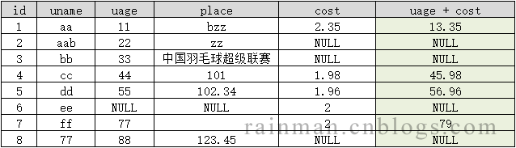

[Toc]

# 官网相关信息

## 驱动包下载

- [下载网址](https://docs.microsoft.com/zh-cn/sql/connect/jdbc/microsoft-jdbc-driver-for-sql-server-support-matrix?view=sql-server-ver16#java-and-jdbc-specification-support)

# 查看版本信息

```
### 新建查询，执行以下语句
select @@version
```

# 字符串模糊查询

> **SQL Server 查询条件有中文的记得一定要在查询字符串前面加 N，不然查询不出来**
>
> ```
> select * from table_name with(nolock)
>   where
>   field = N'这是中文'
> ```

## `%`

```
--1. % 0或多个 
--1）like '%a%'包含于
select*from test where mname like '%a%' 
--2）like '%a' 匹配字符或字符结尾
select*from test where mname like '%a' 
--3）like 'a%' 匹配字符或字符开头
select*from test where mname like 'a%' 
```

## `_`

```
--2. _匹配单个字符 限制表达式的字符长度
select*from test where mname like 'a___'  --一个_表示一个字符长度
```

## `[]`

```
--3. []范围匹配  括号中所有字符中的一个
select*from test where  age like '2[4-8]%'  --查询年龄24到28
```

## `[^]`

```
--4.[^]不在括号之内的单个字符
select*from test where  age like '%[^3]'  --最后年龄一位数不是3
select*from test where  (age like '2[4-8]%')and(age like '%[^5]')  --查询年龄24到28且最后一位不是5
```

# 字符串截取

## **LEFT()函数**

> - 函数说明如下：
>   - 语法：LEFT(character,integer)。
>   - 参数介绍：参数1：要截取的字符串，参数2：截取字符个数。
>   - 返回值：返回从字符串左边开始指定个数的字符。
>   - 示例SQL：select LEFT('SQLServer_2012',3)。
>   - 返回：SQL。

## **RIGHT()函数**

> 函数说明如下：
>
> - 语法：RIGHT(character,integer)。
> - 参数介绍：参数1：要截取的字符串，参数2：截取字符个数。
> - 返回值：返回从字符串右边开始指定个数的字符。
> - 示例SQL：select RIGHT('SQLServer_2012',4)。
> - 返回：2012.

## **SUBSTRING()函数**

> 函数说明如下：
>
> - 语法：SUBSTRING(character,start,length) 。
> - 参数介绍：参数1：要截取的字符串，参数2：开始截取的下标(下标从1开始)，参数3：截取的字符长度。
> - 返回值：返回从字符串中间的字符。
> - 示例SQL：select SUBSTRING('SQLServer_2012',4,6)。
> - 返回：Server。

## LEN()函数

> 获取[字符串](https://so.csdn.net/so/search?q=字符串&spm=1001.2101.3001.7020)的长度
>
> ```
> LEN( <字符> )
> --返回整型
> ```

## CHARINDEX()函数

> 返回字符串中对应字符的起始位置，从左至右。CharIndex不能使用通配符
>
> ```
> CHARINDEX( <要查找的字符> , <字符串本体> )
> --返回整型
> ```

## PATINDEX()函数

> `PATINDEX()`函数返回指定表达式中某模式第一次出现的起始位置；如果在全部有效的文本和字符数据类型中没有找到该模式则返回0。
>
> **注意：PatIndex模式为通配符， CharIndex不能使用通配符**
>
> ```
> patindex( '%pattenr%' , expression )
> 
> 参数说明：pattern：一个文本字符串。可以使用通配符，但pattern之前和之后必须有%字符(搜索第一个或自后一个字符时除外)。因为在T-SQL中，%代表模式匹配。
> 
> 返回值：如果expression的数据类型为varchar(max)或nvarchar(max)，则为bigint，否则int，即pattern指定的字符串在expression中第一次出现的位置。
> 
> select patindex('%llo%','hello world')    --输出3，第一次出现llo是在第3个字符位置
> ```

## STUFF()函数

> 删除指定位置的指定长度的字符，并在删除的起点插入指定字符。
>
> ```
> STUFF( <字符> , 起始位, 删除位数 , <新字符> )
> ```

## PATINDEX()函数

> 返回指定字符内容在字符串中第一次出现的位置（第一个字符）。
>
> ```
> PATINDEX ( '%<查找内容>%' , <字符> )    --模糊，查找第一次出现的位置
> PATINDEX ( '<查找内容>%' , <字符> )    --精准，查找最后一次出现的位置
> PATINDEX ( '%<查找内容>' , <字符> )    --查找最后一次出现的位置
> --返回整型
>  
> PATINDEX ( <字符A> , <字符B> )    --判断查找内容,返回1相等,返回0不相等
> --返回整型
>  
> PATINDEX ( '%[ <查找内容> ]%' , <字符> )    --查找内容中任意字符第一次出现的位置
> PATINDEX ( '%[^ <查找内容> ]%' , <字符> )    --查找没有出现在<查找内容>内的字符第一次出现的位置
> ```


# 字符函数

## 一、编码转换

### 1、获取字符的ASCII码：ascii

```
ASCII(espression)
```

这里的expression是一个返回char或varchar数据类型的表达式，ASCII函数仅对表达式最左侧的字符返回ASCII码值。

**返回值**：int数据类型。

注意：如果是多个字符的字符串，也只是返回第一个字符的ASCII码值。

```
select` `ASCII(``'f'``)  ``--输出 102
```

### 2、获取ASCII码对应的字符：char

```
char``(integer_expression)
```

**返回值**：char型字符

```
select` `char``(102)  ``-- 输出f
```

### 3、获取字符的unicode编码： unicode

```
unicode(``'ncharacter_expression'``)
```

这里的ncharacter_expression是nchar或nvarchar类型的表达式。函数仅会返回第一个字符的unicode编码。

**返回值**：int类型数据

```
SELECT` `Unicode(``'飞'``)  ``-- 输出 39134
```

### 4、获取unicode编码对应的字符： nchar

```
nchar``(integer_expression)
```

**返回值**：unicode字符

```
SELECT` `nchar``(39134)    ``-- 输出 飞
```

## 二、位置查找

### 1、获取字符串第一次出现位置：patindex

```
patindex( ``'%pattenr%'` `, expression )
```

patindex函数返回指定表达式中某模式第一次出现的起始位置；如果在全部有效的文本和字符数据类型中没有找到该模式则返回0。

> 注意：PatIndex模式为通配符， CharIndex不能使用通配符

**参数说明**：pattern：一个文本字符串。可以使用通配符，但pattern之前和之后必须有%字符(搜索第一个或自后一个字符时除外)。因为在T-SQL中，%代表模式匹配。

**返回值**：如果expression的数据类型为varchar(max)或nvarchar(max)，则为bigint，否则int，即pattern指定的字符串在expression中第一次出现的位置。

```
select` `patindex(``'%llo%'``,``'hello world'``)  ``--输出3，第一次出现llo是在第3个字符位置
```

### 2、指定位置搜索字符串中的内容：charindex

charindex函数用于在指定的字符串中搜索特定的字符串，并可以指定开始搜索的位置，返回第一次找到目标字符串的起始位置。

```
charindex ( expression1 , expression2 [ , start_location] )
```

**参数说明**：

- expression1：一个字符串数据类型的表达式，其中包含要查找的字符的序列。
- expression2：一个字符串数据类型的表达式，通常是一个为指定序列搜索的列。
- start_location：开始在expression2中搜索expression1是的字符位置。如果start_location未被指定、是一个负数或零，则将从expression2的开头开始搜索。start_location可以是bingint类型。

**返回值**：如果expression2的数据类型为varchar(max)、nvarchar(max)或varbinary(max)，则为bigint，否则为int。

```
select` `charindex(``'456'``,``'123456789'``)  ``-- 输出 4  从123456789中检索456出现的位置``select` `charindex(``'456'``,``'123456789'``,4)  ``-- 输出 4
```

## 三、获取字符串长度

### 1、获取字符串长度： len

len函数用于获取字符串的长度(字符数)，但不包括右边的空格。左边的空格和中间的空格计算在内。

```
len( string_expression )
```

**参数说明**：string_expression：要计算长度的字符串。

**返回值**：expression数据类型为varchar(max)、nvarchar(max)或varbinary(max)，则为bigint。否则为int。

```
select` `len(``'天下之大，无奇不有'``)  ``-- 输出 9
```

### 2、获取字符串字节数： datalength

datalength函数用于获取字符串的字节数，而不是字符数。该函数不仅适合字符串数据，还适合文本(text、ntext)、二进制数据(varbinary、binary)和图像(image)等任意类型的数据。空格均计算在内。

```
datalength(expression)
```

**返回值**：如果expression数据类型为varchar(max)、nvarchar(max)或varbinary(max)数据类型，则返回bigint；否则返回int。

```
select` `datalength(``'我是一个兵'``)  ``--输出 10``select` `len(``'我是一个兵'``)  ``--输出 5``select` `datalength(``'abcde'``)  ``--输出5``select` `len(``'abcde'``)  ``--输出5
```

## 四、截取字符串

### 1、截取左边字符串： left

left函数用于截取从左边第一个字符开始，指定长度的字符串。其执行效果等于substring(expression,1,length)。

```
left``(character_expression,integer_expression)
```

**参数说明**：

- character_expression：字符或二进制表达式，可以是常量、变量或表达式。
- integer_expression：正整数，指定返回的字符数。

**返回值**：　varchar或nvarchar，变长字符串。

```
select` `left``(``'123456789'``,3)  ``--输出 123
```

### 2、截取右边字符串：right

right函数用于截取从右边第一个字符开始，指定长度的字符串。其执行效果等于SUNSTRING(expression,len(expression)-length+1,length)。

```
right``(character_expression,integer_expression)
```

**参数说明**：

- character_expression：字符或二进制表达式，可以是常量、变量或表达式。
- integer_expression：正整数，指定返回的字符数。

**返回值**：　varchar或nvarchar，变长字符串。

```
select` `right``(``'123456789'``,3)  ``--输出 789
```

### 3、截取字符串： substring

substring函数可以对字符串进行字串的截取操作。

```
substring``( expression,start,length)
```

**参数说明**：

- expression：是字符串、二进制字符串、文本、图像、列或包含列的表达式，但不要使用包含聚合函数的表达式。
- start：指定子字符串开始位置的整数，start可以使bigint类型。位置从1开始。
- length：一个正整数，指定要返回的expression的字符数或字节数。如果length为负，则会返回错误。length可以使bigint数据类型。

**返回值**：如果expression是受支持的字符数据类型，则返回字符数据。如果expression是受支持的binary数据类型，则返回二进制数据。

```
select` `substring``(``'hello'``,1,2)  ``--输出 he 与C#有点不同，它第一个字符是从1开始的
```

## 五、生成内容

### 1、生成空格字符串： space

space函数可以生成任意多个空格组成的字符串。

```
space` `( integer_expression )
```

这里的integer_expression为指示空格个数的正整数。如果要在unicode数据中包含空格或超过8000个以上的空格，需要使用replicate函数。

**返回值**：char数据类型的字符。

```
select` `(``'hello'` `+ ``space``(5) + ``'world'``)  ``--输出 hello   world
```

### 2、按指定次数重复生成字符串： replicate

replicate函数可以按照指定的整数次数，重复生成一个字符串形式的表达式，结果为字符串。

```
replicate( character_expression,integer_expression )
```

**参数说明**：

- character_expression：字符数据的字母数字表达式，或者可隐式转换为varchar的数据类型的字母数字表达式。
- integer_expression：一个正整数。如果integer_expression为负，则会返回错误。integer_expression可以使bigint类型。

**返回值**：与character_expression相同数据类型的字符串。

```
select` `replicate(``'hello'``,5)  ``--输出hellohellohellohellohello
```

### 3、删除再重新插入字符串内容： stuff

stuff函数用于在指定的字符串中删除指定长度的字符，并在起点处插入另外一组字符。

```
stuff(source_character_expression，start，length，destination_character_expression)
```

**参数说明**：

- source_character_expression：源字符串。可以是常量、变量，也可以使字符列或二进制数据列。
- start：一个整数，指定删除和插入的开始位置。如果start或length为负，则返回空字符串。如果start比第一个character_expression长，则返回空字符串。　start可以是bingint类型。
- length：一个整数，指定要删除的字符个数。如果length比第一个charter_expression长，则最多删除到最后一个character_expression中最后一个字符。　length可以是bigint类型。
- destination_character_expression：目的字符串。可以是常量、变量，也可以使字符列或二进制数据列。将在源字符串中执行插入。

```
select` `stuff(``'123456789'``,5,2,``'xyz'``)  ``--输出1234xyz789  从第5个字符开始，将第5 6两个字符替换成xyz字符串
```

### 4、生成带分隔符的unicode字符串： quotename

quotename函数用于生成带有分隔符的Unicode字符串。分隔符可以是单引号(')、左右方括号([])或者英文双引号(")。如果不指定，则使用方括号。带有方括号的Unicode字符串如：[hello]。

```
quotename( ``'character_string'` `[ , ``'quote_character'``] )
```

**参数说明**：

- character_string：Unicode字符串数据构成的字符串。
- quote_character：用做分隔符的单字符字符串。

**返回值**：nvarchar(258)，生成带有分隔符的字符串。长度不能超过258

```
select` `quotename(``'我是一个兵'``)  ``-- 输出[我是一个兵]``select` `quotename(``'我是一个兵'``,``'"'``)  ``-- 输出"我是一个兵"
```

## 六、改变与转换

### 1、清除左边空格： ltrim

如果字符串的字一个字符为空格，ltrim函数用于清除连续的左边空格。

```
ltrim(character_expression)
```

character_expression为字符或二进制数据表达式，可以是常量、变量或数据列。

**返回值**：varchar或nvarchar，变长字符串。

```
select` `ltrim(``'  123456789'``) ``--输出 123456789，注意左边的空格已被删除了，输出字符串左边是没空格的
```

### 2、清除右边空格： rtrim

rtrim函数用于清空右边连续的空格。

```
rtrim(character_expression)
```

character_expression为字符或二进制数据表达式，可以是常量、变量或数据列。

**返回值**：　varchar或nvarchar，变长字符串。

```
select` `rtrim(``'123456789  '``)  ``--输出123456789，注意右边的空格已经被清除了
```

### 3、转换为小写字符串： lower

lower函数将字符串全部转换为小写字符后返回。

```
lower``(character_expression)
```

**返回值**：varchar或nvarchar，变长字符串

```
select` `lower``(``'ABCDEFG'``)  ``--输出 abcdefg 已经全部转换为小写了
```

### 4、转换为大写字符串： upper

upper函数用于将字符串全部转换为大写字符后返回。

```
upper``(character_expression)
```

character_expression为字符或二进制表达式，可以是常量，变量或数据列。

 **返回值**：varchar或nvarchar，变长字符串。

```
select` `upper``(``'abcdefg'``)  ``--输出 ABCDEFG 留意到已经全部转换为大写了
```

### 5、反序字符串： reverse

reverse函数用于将字符串内容反序后返回。

```
reverse(character_expression)
```

character_expression：为二进制或二进制数据表达式，可以是常量、变量或数据列。

**返回值**：varchar或nvarchar，变长字符串

```
select` `reverse(``'123456789'``)  ``--输出 987654321 注意到顺序已经反转过来了
```

### 6、替换字符串： replace

replace用另一个字符串值替换出现的所有指定字符串值。

```
REPLACE` `( string_expression1 , string_expression2 , string_expression3 )
```

**参数说明**：

- string_expression1:要搜索的字符串表达式。string_expression1 可以是字符或二进制数据类型。
- string_expression2:要查找的子字符串。string_expression2 可以是字符或二进制数据类型。
- string_expression3:替换字符串。string_expression3 可以是字符或二进制数据类型。

```
SELECT` `REPLACE``(``'abcde'``,``'abc'``,``'xxx'``)  ``--xxxde
```

### 7、转换浮点数字为字符串： str

str函数用于将浮点数转换为字符串

```
str(float_expression[,length[,``decimal``]])
```

**参数说明**：

- float_espression：带小数点的近似数字(float)数据类型的表达式。
- length：总长度。它包括小数点、符号、数字以及空格。默认值为10.
- decimal：小数点后的位数。decimal必须小于或等于16.如果decimal大于16，则会截断结果，使其保持为小数点后只有16位。

**返回值**：char：定长字符串。

```
select` `str(123.456789)  ``-- 输出 123``select` `str(123.456789,7) ``--输出  123  注意前面的是4个空格，因为不写小数点后保留多少位，所以自动填充空格``select` `str(123.456789,7,3)  ``-- 输出123.457  最后一位 四舍五入了，总长度为7，小数点后保留3位
```

## 七、其他

### 1、字符串的相似性：soundex

返回一个由四个字符组成的代码 (SOUNDEX)，此发音算法用于评估两个字符串的相似性。

```
SELECT` `SOUNDEX(``'ABCDE'``)  ``--A120``SELECT` `SOUNDEX(``'ABCDR'``) ``--A121
```

### 2、字符串的差异：difference

返回一个整数值，指示两个字符表达式的 SOUNDEX 值之间的差异。

```
SELECT` `DIFFERENCE(``'abcde'``,``'abc'``)  ``--4
```

到此这篇关于SQL Server字符串函数的文章就介绍到这了。希望对大家的学习有所帮助，也希望大家多多支持脚本之家。

## CONCAT()

> 函数有助于将两个或多个字符串连接在一起。 CONCAT()函数可以接受最少2个参数，最多254个参数。

```
CONCAT(string_1, string_2, .......string_n)
```

**参数：**

- **string_1，string_2，…….string_n-**
  给定的字符串需要串联。

**返回值：**
该函数连接所有给定的字符串，并将它们作为一个完整的字符串返回。

# 字符串拼接

在SQL语句中经常需要进行字符串拼接，以sqlserver，oracle，mysql三种数据库为例，因为这三种数据库具有代表性。

- **sqlserver**：

`select '123'+'456';`

- **oracle**：

```
select '123'||'456' from dual;
或
select concat('123','456') from dual;
```

- **mysql**：

`select concat('123','456');`
注意：SQL Server中没有concat函数（SQL Server 2012已新增concat函数）。oracle和mysql中虽然都有concat，但是oracle中只能拼接2个字符串，所以建议用||的方式；mysql中的concat则可以拼接多个字符串。

在SQL Server中的“+”号除了能够进行字符串拼接外，还可以进行数字运算，在进行字符串拼接时要小心使用。下面以“Users”表为例，进行详细分析：



## 1. 数字 + 字符串

**1. int + varchar**

```
SELECT id + place FROM Users WHERE id = 1;  //提示错误“在将 varchar 值 'bzz' 转换成数据类型 int 时失败”
SELECT id + place FROM Users WHERE id = 5;  //提示错误“在将 varchar 值 '102.34' 转换成数据类型 int 时失败”
SELECT id + place FROM Users WHERE id = 4;	//返回int “105”
```

**2. decimal + varchar**

```
SELECT *, id + cost  FROM Users WHERE id = 4 OR id = 5;	//返回decimal “102.98”和“104.30”
SELECT *, place + cost FROM Users WHERE id = 1;	//提示错误“从数据类型 varchar 转换为 numeric 时出错。”
由此可见，系统会将字符串varchar类型转化为int，若不能转换则提示错误，转换成功则进行数字计算。
```

## 2. 数字 + 数字

数字指的是int、decimal等类型。数字 +  数字，则进行数字相加，若某字段为NULL，则计算结果为NULL。

`SELECT *,  uage + cost AS 'uage + cost'  FROM Users`

## 3.字符串 + 字符串

字符串 + 字符串，则直接进行拼接。若某字段为NULL，则计算结果为NULL。

`SELECT *, uname + place AS 'uname + place' FROM Users `

## 4. 使用CAST和CONVERT函数进行类型转换

通过上述实例，可以看出若要使用“+”进行字符串拼接或数字计算，最稳妥的方法是进行类型转换。

CAST()函数可以将某种数据类型的表达式转化为另一种数据类型
CONVERT()函数也可以将制定的数据类型转换为另一种数据类型
要求：将“678”转化为数值型数据，并与123相加进行数学运算。

```
SELECT CAST('678' AS INT) + 123;
SELECT CONVERT(INT, '678') + 123;
```

要求：id列和place列进行字符串拼接。

`SELECT *, CONVERT(varchar(10), id) + place FROM Users;`
字符串拼接后的字符串不能简单作为“筛选字段”

有时，需要列A = 变量1，列B = 变量2的筛选，为了简化SQL语句 列A + 列B = 变量1 + 变量2。这种方法并不完全准确

```
SELECT * FROM Users WHERE uname + place = 'aabzz';
SELECT * FROM Users WHERE uname = 'aa' AND place = 'bzz';

为了防止上述情况的发生，可以再列A和列B之间加上一个较特殊的字符串。
SELECT * FROM Users WHERE uname + 'rain@&%$man' + place = 'aa' + 'rain@&%$man' + 'bzz'
```


# 查询字段是否为数字

>  `Isnumeric` 当输入表达式得数为一个有效的整数、浮点数、money  或  decimal  类型，那么  ISNUMERIC  返回  1；否则返回  0。

```
# 检查它是否为数字，然后将其转换为其他值，如0
Select COLUMNA AS COLUMNA_s, CASE WHEN Isnumeric(COLUMNA) = 1
THEN CONVERT(DECIMAL(18,2),COLUMNA)
ELSE 0 END AS COLUMNA
```

# 数值计算

## 数学函数

### 1、计算绝对值ABS

ABS函数对一个数值表达式结果计算绝对值(bit数据类型除外)，返回整数。

**语法格式：**

```
ABS(数值表达式)
```

**返回值：**与数值表达式类型一致的数据

**示例：**

```
SELECT ABS(-1)    --输出 1
```

### 2、获取大于等于最小整数值Celling

CEILING函数返回大于等于数值表达式(bit数据类型除外)的最小整数值。俗称天花板函数，尽量往大的取整。

**语法格式：**

```
CEILING(数值表达式)
```

**返回值：**与数值表达式类型一致的数据。

**示例：**

```
SELECT Celling(123.1)    --输出124
```

### 3、获取小于等于最大整数值Floor

floor函数返回小于等于数值表达式(bit数据类型除外)的最大整数值。俗称地板函数，尽量往小的取整。

**语法格式：**

```
Floor(数值表达式)
```

**返回值：与数值表达式类型一致的数据。**

**示例：**

```
SELECT Floor(123.9999)    --输出123
```

### 4、获取随机数Rand

rand函数返回随机的从0到1之间的浮点数。

**语法格式：**

```
Rand([ seed ])
```

语法中的seed是种子值，是一个整数类型的表达式(tinyint、smallint、int)，使用指定的种子值反复调用rand将返回相同的结果、。

不指定种子值，rand函数将随机产生结果。

**返回值：**

　0到1之间的浮点数。

**示例：**

```
SELECT Rand()    -- 输出 0.36925407993302
```

### 5、四舍五入函数Round，按精度截取数字,不进行舍入操作Trunc。

round函数对数值表达式舍入到指定长度和精度。

**语法格式：**

```
Round( numeric_expression , length[ , function] )
```

**参数说明：**

numeric_rxpression：精确或近似数值类型的表达式，bit数据类型除外。

length：舍入精度。length必须是tinyint、smallint或int。如果length为整数，则将numeric_expression舍入到length指定的小数位数。如果length为负数，则将numeric_expression小数点左边部分舍入到length指定的长度。

 function：要执行的操作的类型。function必须为tinyint、smallint或int。如果省略function或其值为0(默认值)，则将舍入numeric_expression。如果指定了0以外的值，则将截断numeric_expression。

**返回值：**与numeric_expression相同类型的数值。

**示例：**

```
SELECT Round(123.456789,3) -- 输出 123.457000    精确到小数点后3位
```

### **6、弧度转角度****Degrees，角度转换成弧度RADIANS**

返回弧度对应的角度

```
SELECT DEGREES(0.6) --34.377467707849391000
```

### 7、圆周率PI

返回圆周率Float

```
SELECT PI()    --3.14159265358979
```

### 8、幂POWER

返回指定表达式的指定幂的值。

```
SELECT Power(2,10)    --1024
```

### 9、平方SQUARE

返回指定浮点值的平方。

```
SELECT Square(5)    --25
```

### 10、指数值EXP

返回e的x乘方后的值。

### 11、平方根SQRT

返回指定浮点值的平方根(开方)。

```
SELECT SQRT(25)    --5
```

### 12、符号函数SIGN

若x>0,则返回1;若x=0,则返回0;若x<0,则返回-1。

### 13、**正弦函数SIN(x)和反正弦函数ASIN(x)**

sin以近似数字 (float) 表达式返回指定角度（以弧度为单位）的三角正弦值。

余弦函数COS(x)和反余弦函数ACOS(x)

正切函数TAN(x)，反正切函数ATAN(x)和余切函数COT(x)

### 14、对数的运算LOG、LOG10

LOG(X)、LOG(B,X)一个参数的版本将返回X的自然对数，如果用两个参数调用，它返回X的对数的任意基数B。

LOG10(X)返回底数10的对数的X

## 数值类型转换

> SQL Server中的数值类型分为两种，一种是精确的数值类型，具体的数据类型有：bit、tinyint、smallint、int、bigint、smallmoney、money和decimal，这些数据类型能够精确的表明某以数值；另一种是近似的数值类型，具体就是float和real。浮点数据为近似值，因此，并非数据类型范围内的所有值都能精确地表示。
>
> 有些时候我们需要将这些数值类型转换为字符串类型，用到的转换函数就是cast和convert，这两个函数的作用都是进行类型转换，只不过语法格式不同。

### convert

```
CONVERT: CONVERT(data_type[(length)], expression [, style])
```

 注：参数data_type为想要转换的数据类型，expression 为SQL Server表达式

示例：

```
select convert(float,'123456') as UserCode
--结果：123456

select convert(float,'') as UserCode
--结果：0

select convert(float,NULL) as UserCode
--结果：NULL
```

### cast

```
CAST ( expression AS data_type )
```

注：参数data_type为想要转换的数据类型，expression 为SQL Server表达式

示例：

```
select CAST( '123456' AS float) as UserCode
--结果：123456
```

## 结果为小数时，缺少整数为0

- **场景描述**

> ```
> select field1/field2 from table
> ```
>
> 在获取计算结果时，获得的结果为`0.xxxxx`，发现结果显示为`.xxxxx`，缺失整数位`0`

- **解决方案**

> field1的数据类型强制转换为float型

```
select cast(field1 as float)/field2 from table
或者使用以下方式，将被除数转为小数，然后再进行计算
select (field1+0.0)/field2 from table
```

# 限定查询记录数

## TOP

```
### 查询满足条件的前5条数据
select TOP 5 * from browserecord where username = '1';

### 查第几条到第几条:如果要查 n-m之间的数据 第4行的数字是n-1,第一行的数字是m-n+1,从而实现分页
SELECT TOP 4 * FROM browserecord 
WHERE browserecord.recordid
NOT IN
(SELECT TOP 3 recordid FROM browserecord)
```

# 查询字段类型

> 查询表/视图字段类型

- **方案1**

```
select a.name columnname,c.name as typename,case when a.is_nullable =0 then 'Not Null' else 'Null' end as nullable,a.*
from sys.columns a , sys.objects b, sys.types c 
where a.object_id= b.object_id and b.name='表名' and a.system_type_id=c.system_type_id order by a.column_id
```

- **方案2**

```
select
     c.name as [字段名],t.name as [字段类型]
     ,convert(bit,c.IsNullable)  as [可否为空]
     ,convert(bit,case when exists(select 1 from sysobjects where xtype='PK' and parent_obj=c.id and name in (
         select name from sysindexes where indid in(
             select indid from sysindexkeys where id = c.id and colid=c.colid))) then 1 else 0 end) 
                 as [是否主键]
     ,convert(bit,COLUMNPROPERTY(c.id,c.name,'IsIdentity')) as [自动增长]
     ,c.Length as [占用字节] 
     ,COLUMNPROPERTY(c.id,c.name,'PRECISION') as [长度]
     ,isnull(COLUMNPROPERTY(c.id,c.name,'Scale'),0) as [小数位数]
     ,ISNULL(CM.text,'') as [默认值]
     ,isnull(ETP.value,'') AS [字段描述]
     --,ROW_NUMBER() OVER (ORDER BY C.name) AS [Row]
from syscolumns c
inner join systypes t on c.xusertype = t.xusertype 
left join sys.extended_properties ETP on ETP.major_id = c.id and ETP.minor_id = c.colid and ETP.name ='MS_Description' 
left join syscomments CM on c.cdefault=CM.id
where c.id = object_id('表名')
```

- **方案3**

```
SELECT name AS column_name , TYPE_NAME(system_type_id) AS column_type  FROM sys.columns WHERE object_id = OBJECT_ID(N'表名')
```


# 查询某日期区间的数据

```
### 查询今日的所有数据
select * from 表名 where datediff(day,字段名,getdate())=0

### 查询昨日的所有数据
select * from 表名 where datediff(day,字段名,getdate()-1)=0

### 查询当天日期在一周年的数据
selcet * from 表名 where datediff(week,字段名,getdate()-1)=0

### 查询前30天的数据
select * from 表名 where datediff(d,字段名,getdate())<=30

### 查询上一个月的数据
select * from 表名 where datediff(m,字段名,getdate())<=1

### 查询24小时内的数据
select * from info where DateDiff(hh,datetime,getDate())<=24

### 查询本周的数据
select * from 表名 where datediff(week,字段名,getdate())=0

### 查询本月的数据
select * from 表名 where datediff(month,字段名,getdate())=0

### 查询本季的数据
select * from 表名 where datediff(qq,字段名,getdate())=0
```

## sql server中的时间函数

```
1.   当前系统日期、时间
     select getdate() 

2. dateadd   在向指定日期加上一段时间的基础上，返回新的 datetime 值
    例如：向日期加上2天
    select dateadd(day,2,'2004-10-15')   --返回：2004-10-17 00:00:00.000

3. datediff 返回跨两个指定日期的日期和时间边界数。
    select datediff(day,'2004-09-01','2004-09-18')    --返回：17

4. datepart 返回代表指定日期的指定日期部分的整数。
   SELECT DATEPART(month, '2004-10-15')   --返回 10


5. datename 返回代表指定日期的指定日期部分的字符串
    SELECT datename(weekday, '2004-10-15')   --返回：星期五

6. day(), month(),year() --可以与datepart对照一下
select 当前日期=convert(varchar(10),getdate(),120)
,当前时间=convert(varchar(8),getdate(),114)

select datename(dw,'2004-10-15')
select 本年第多少周=datename(week,'2004-10-15')
       ,今天是周几=datename(weekday,'2004-10-15')
```

## `between  and`

```
### 数据范围：大于等于2022-11-02 00:00:00.000 小于等于2022-11-03 00:00:00.000；会将2022-11-03 00:00:00.000 这条数据查询出来
SELECT * FROM dbo.vzj_images_202211 t WHERE  t.create_time BETWEEN '2022-11-02' and '2022-11-03' ORDER BY t.create_time desc;

### 获取前一天数据，其数据范围为：2022-11-02 00:00:00.000  2022-11-02 59:59:59.999
SELECT * FROM dbo.vzj_images_202211 t WHERE t.is_restricted = 2 and  datediff(day,t.create_time,getdate()-1)=0 ORDER BY t.create_time desc;

### 使用>= <=限定数据范围：其查询范围为 2022-11-02 00:00:00.000  2022-11-03 00:00:00.000 ，；会将2022-11-03 00:00:00.000 这条数据查询出来
SELECT * FROM dbo.vzj_images_202211 t WHERE t.is_restricted = 2 and  t.create_time >= '2022-11-02 00:00:00.000' and  t.create_time <= '2022-11-02 23:59:59.999' ORDER BY t.create_time desc
```

# 日期格式化

## 获取日期

```
### 获取当前系统时间
SELECT getdate( );
### 获取前一天系统时间
SELECT dateadd( DAY,- 1, getdate( ) )
（1）在当前时间上加1天：Select dateadd(DD,1,GETDATE())；
（2）在当前时间上加1周：Select dateadd(WK,1,GETDATE())
（3）在当前时间上加1个月：Select dateadd(M,1,GETDATE())
（4）在当前时间上加1个季度：Select dateadd(Q,1,GETDATE())
（5）在当前时间上加1年：Select dateadd(YY,1,GETDATE())
### 用DateName()就可以获得相应的年、月、日，然后再把它们连接起来就可以了：
Select Datename(year,GetDate())+'-'+Datename
(month,GetDate())+'-'+Datename(day,GetDate())

###另外，DateName()还可以获得到小时、时间、秒、星期几、第几周，分别如下：
Select Datename(hour,GetDate())
Select Datename(minute,GetDate())
Select Datename(second,GetDate())
Select Datename(weekDay,GetDate())
Select Datename(week,GetDate())
```

SQL中的日期类型`DateTime`的默认格式就是`yyyy-mm-dd hh:mi:ss: mmm`，可大多数的情况我们只想得到他的日期部分，而不许要后面的时间。上一篇中提到用`Datename(`)函数来截取拼接出不包含时间部分的日期，现在再说一种方法，更加简单的获取到不包含时间的日期！

## 日期格式化(CONVERT)

- **定义和用法**

  CONVERT() 函数是把日期转换为新数据类型的通用函数。

  CONVERT() 函数可以用不同的格式显示日期/时间数据。

- **语法**

```
CONVERT(data_type(length),data_to_be_converted,style)

data_type(length) 规定目标数据类型（带有可选的长度）。data_to_be_converted 含有需要转换的值。style 规定日期/时间的输出格式。
```

**可以使用的 *style* 值**

```
100   mm dd yyyy
101   mm/dd/yyyy
102   yyyy.mm.dd
103   dd/mm/yyyy
106   dd mm yyyy
108   hh:mi:ss(时间)
111   yyyy/mm/dd
112   yyyymmdd
120   yyyy-mm-dd
```


- **范例**

```
SELECT CONVERT(varchar(100), GETDATE(), 0) 05  9 2011  9:12AM
SELECT CONVERT(varchar(100), GETDATE(), 1) 05/09/11
SELECT CONVERT(varchar(100), GETDATE(), 2) 11.05.09
SELECT CONVERT(varchar(100), GETDATE(), 3) 09/05/11
SELECT CONVERT(varchar(100), GETDATE(), 4) 09.05.11
SELECT CONVERT(varchar(100), GETDATE(), 5) 09-05-11
SELECT CONVERT(varchar(100), GETDATE(), 6) 09 05 11
SELECT CONVERT(varchar(100), GETDATE(), 7) 05 09, 11
SELECT CONVERT(varchar(100), GETDATE(), 8) 09:13:14
SELECT CONVERT(varchar(100), GETDATE(), 9) 05  9 2011  9:13:14:670AM
SELECT CONVERT(varchar(100), GETDATE(), 10) 05-09-11
SELECT CONVERT(varchar(100), GETDATE(), 11) 11/05/09
SELECT CONVERT(varchar(100), GETDATE(), 12) 110509
SELECT CONVERT(varchar(100), GETDATE(), 13) 09 05 2011 09:13:14:670
SELECT CONVERT(varchar(100), GETDATE(), 14) 09:13:14:670
SELECT CONVERT(varchar(100), GETDATE(), 20) 2011-05-09 09:13:14
SELECT CONVERT(varchar(100), GETDATE(), 21) 2011-05-09 09:13:14.670
SELECT CONVERT(varchar(100), GETDATE(), 22) 05/09/11  9:15:33 AM
SELECT CONVERT(varchar(100), GETDATE(), 23) 2011-05-09
SELECT CONVERT(varchar(100), GETDATE(), 24) 09:15:33
SELECT CONVERT(varchar(100), GETDATE(), 25) 2011-05-09 09:15:33.140
SELECT CONVERT(varchar(100), GETDATE(), 100) 05  9 2011  9:15AM
SELECT CONVERT(varchar(100), GETDATE(), 101) 05/09/2011
SELECT CONVERT(varchar(100), GETDATE(), 102) 2011.05.09
SELECT CONVERT(varchar(100), GETDATE(), 103) 09/05/2011
SELECT CONVERT(varchar(100), GETDATE(), 104) 09.05.2011
SELECT CONVERT(varchar(100), GETDATE(), 105) 09-05-2011
SELECT CONVERT(varchar(100), GETDATE(), 106) 09 05 2011
SELECT CONVERT(varchar(100), GETDATE(), 107) 05 09, 2011
SELECT CONVERT(varchar(100), GETDATE(), 108) 09:16:38
SELECT CONVERT(varchar(100), GETDATE(), 109) 05  9 2011  9:16:38:543AM
SELECT CONVERT(varchar(100), GETDATE(), 110) 05-09-2011
SELECT CONVERT(varchar(100), GETDATE(), 111) 2011/05/09
SELECT CONVERT(varchar(100), GETDATE(), 112) 20110509
SELECT CONVERT(varchar(100), GETDATE(), 113) 09 05 2011 09:17:19:857
SELECT CONVERT(varchar(100), GETDATE(), 114) 09:17:19:857
SELECT CONVERT(varchar(100), GETDATE(), 120) 2011-05-09 09:17:19
SELECT CONVERT(varchar(100), GETDATE(), 121) 2011-05-09 09:17:19.857
SELECT CONVERT(varchar(100), GETDATE(), 126) 2011-05-09T09:17:19.857
SELECT CONVERT(varchar(100), GETDATE(), 130)  6 ????? ??????? 1432  9:17:19:857AM
SELECT CONVERT(varchar(100), GETDATE(), 131)  6/06/1432  9:17:19:857AM
```


# Case when

> Case具有两种格式：简单Case函数和Case搜索函数。

## 简单Case函数

> 简单Case表达式的作用是: 使用表达式确定返回值:

```
select id,name,
case sex
when '1' then '男'
when '2' then '女'
else '其他' end
from student
```

## 搜索Case函数

> Case函数(Case搜索函数): 判断表达式的真假,如果为真,返回结果;如果为假,返回else值;如果未定义else值,则返回空值(使用条件确定返回值);

```
select id,name,
CASE WHEN sex = '1' THEN '男'
WHEN sex = '2' THEN '女'
ELSE '其他' END
from student
```

这两种方式，可以实现相同的功能。简单Case函数的写法相对比较简洁，但是和Case搜索函数相比，功能方面会有些限制，比如写判断式。
还有一个需要注意的问题，Case函数只返回第一个符合条件的值，剩下的Case部分将会被自动忽略
Case when 的用法: 一旦满足了某一个WHEN, 则这一条数据就会退出CASE WHEN , 而不再考虑 其他CASE;

比如下面 SQL,将无法得到第二个when的结果:(不会获取到 ‘差’ 这个值)

```
case when colum in ('a', 'b') then '优秀'
when colum in ('a') then '差'
else '其他' end 
```


# 参考资料

1. https://vimsky.com/examples/usage/concat-function-in-sql-server.html
2. https://blog.csdn.net/gulumiao/article/details/122508508
3. http://www.scicat.cn/aa/20220226/2200664.html
4. https://www.yisu.com/zixun/696936.html
5. https://blog.csdn.net/cplvfx/article/details/126471530
6. https://www.jb51.net/article/248854.htm
7. https://www.cnblogs.com/ainidewen/p/10044596.html
8. https://www.cnblogs.com/sharing1986687846/p/10244809.html
9. https://blog.csdn.net/theminer/article/details/122495680