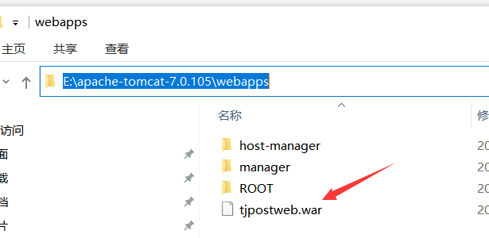
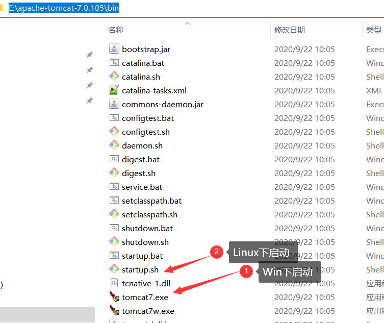
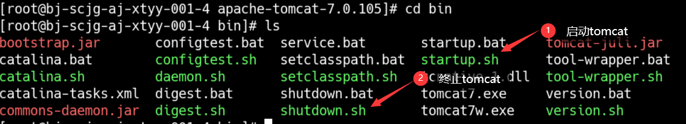
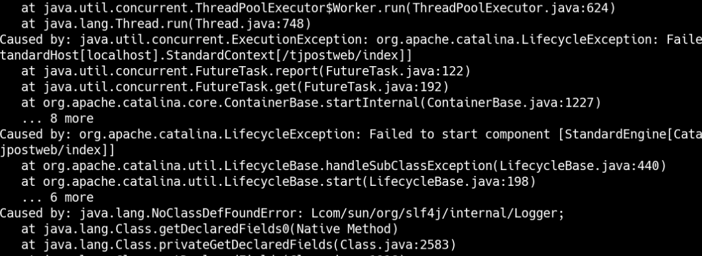
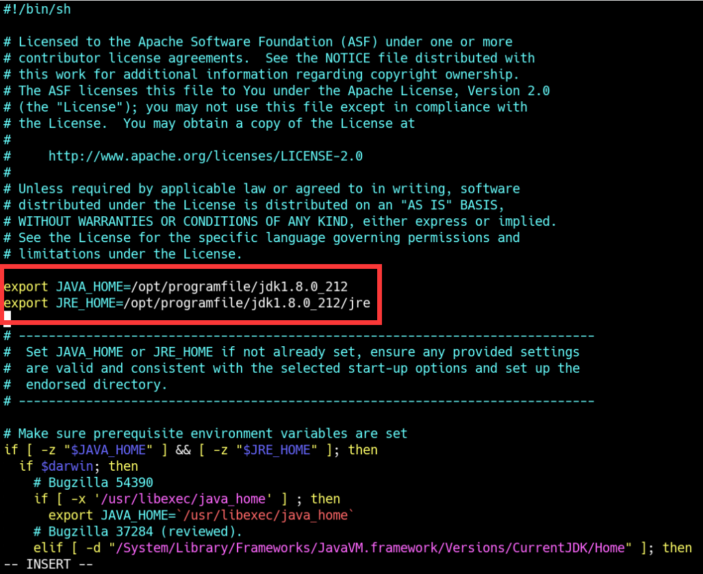
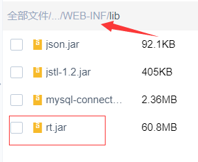

[toc]

# Tomcat简介

> tomcat是一个中间件，在B/S架构中，浏览器发出的http请求经过tomcat中间件，转发到最终的目的服务器上，响应消息再通过tomcat返回给浏览器。
>
> tomcat所做的事情主要有：开启监听端口监听用户的请求，解析用户发来的http请求然后访问到你指定的应用系统，然后你返回的页面经过tomcat返回给用户。

# windows 安装

1. **下载windows版本的apache-tomcat，网址：http://tomcat.apache.org/**

   

   

2. **若未安装JDK，需先安装JDK;若已安装；在【1】中下载的是64位的解压版zip，则直接解压【1】中下载的**

**文件压缩包到指定目录下；然后配置tomcat相关环境变量。**

> **1、Tomcat解压完成后，直接在bin目录下运行startup.bat，是可以启动Tomcat的！**
>
> **2、但是如果不是在bin目录下运行startup.bat，则会启动失败，startup.bat闪退！**
>
> 由此解决了一个衍生出的一台电脑装多个Tomcat的问题：**如果想要同时启动多个tomcat，那么环境变量就要么都不配置，要么全都配置。**
>
> 如果想要直接在命令窗口任意目录下启动tomcat,需配置环境变量

如：在本机的安装目录为：`D:\programApp\apache-tomcat-7.0.105`

需配置的环境变量

```
CATALINA_HOME=D:\programApp\apache-tomcat-7.0.105  //tomcat安装目录
PATH中添加: %CATALINA_HOME%\bin;  
```

3. **检验是否安装成功**

   **方法1：**

   ```
   1. 【win+R】然后输入 cmd 进步win命令行界面
   2. 执行以下命令，
   C:\Users\12613>d:
   D:\>cd D:\programApp\apache-tomcat-7.0.105/bin //进入bin目录
   D:\programApp\apache-tomcat-7.0.105\bin>startup.bat //启动服务
   
   
   D:\programApp\apache-tomcat-7.0.105\bin>shutdown.bat //停止服务
   ```

   **方法2：**直接点击安装的bin目录下的startup.bat或startup.sh

   > 

   在浏览器输入网址：http://localhost:8080/ 查看是否显示出现Tomcat的网页，若显示则安装成功。若不需使用服务，需关闭服务，以免占用端口。关闭服务操作，参照上述【方式1】【方式2】中说明。

# tomcat目录结构说明

   1. **bin**

   >  该目录下存放的是二进制可执行文件，如果是安装版，那么这个目录下会有两个exe文件：tomcat6.exe、tomcat6w.exe，前者是在控制台下启动Tomcat，后者是弹出UGI窗口启动Tomcat；如果是解压版，那么会有startup.bat和shutdown.bat文件，startup.bat用来启动Tomcat，但需要先配置JAVA_HOME环境变量才能启动，shutdawn.bat用来停止Tomcat；

   2. **conf**

   > 这是一个非常非常重要的目录，这个目录下有四个最为重要的文件：
> - server.xml：配置整个服务器信息。例如修改端口号，添加虚拟主机等；
   >
   >   `<Connector port="8080 protocol="HTTP/1.1" connectionTimeout="20000" redirectPort="8443" />`
   >
   > - tomcatusers.xml：存储tomcat用户的文件，这里保存的是tomcat的用户名及密码，以及用户的角色信息。可以按着该文件中的注释信息添加tomcat用户，然后就可以在Tomcat主页中进入Tomcat Manager页面了；
   >
> - web.xml：部署描述符文件，这个文件中注册了很多MIME类型，即文档类型。这些MIME类型是客户端与服务器之间说明文档类型的，如用户请求一个html网页，那么服务器还会告诉客户端浏览器响应的文档是text/html类型的，这就是一个MIME类型。客户端浏览器通过这个MIME类型就知道如何处理它了。当然是在浏览器中显示这个html文件了。但如果服务器响应的是一个exe文件，那么浏览器就不可能显示它，而是应该弹出下载窗口才对。MIME就是用来说明文档的内容是什么类型的！
   >
> - context.xml：对所有应用的统一配置，通常我们不会去配置它。


3. **lib**
   
> Tomcat的类库，里面是一大堆jar文件。如果需要添加Tomcat依赖的jar文件，可以把它放到这个目录中，当然也可以把应用依赖的jar文件放到这个目录中，这个目录中的jar所有项目都可以共享之，但这样你的应用放到其他Tomcat下时就不能再共享这个目录下的Jar包了，所以建议只把Tomcat需要的Jar包放到这个目录下；

4. **logs**
   
> 这个目录中都是日志文件，记录了Tomcat启动和关闭的信息，如果启动Tomcat时有错误，那么异常也会记录在日志文件中。

5. **temp**
   
> 存放Tomcat的临时文件，这个目录下的东西可以在停止Tomcat后删除！

6. **webapps**
   
> 存放web项目的目录，其中每个文件夹都是一个项目；如果这个目录下已经存在了目录，那么都是tomcat自带的项目。其中ROOT是一个特殊的项目，在地址栏中没有给出项目目录时，对应的就是ROOT项目。http://localhost:8080/examples，进入示例项目。其中examples就是项目名，即文件夹的名字。

7. **work**
   
   > 运行时生成的文件，最终运行的文件都在这里。通过webapps中的项目生成的！可以把这个目录下的内容删除，再次运行时会生再次生成work目录。当客户端用户访问一个JSP文件时，Tomcat会通过JSP生成Java文件，然后再编译Java文件生成class文件，生成的java和class文件都会存放到这个目录下。
   
8. **LICENSE**

   > 许可证。

9. **NOTICE**

   > 说明文件。

   ### 扩展

   #### web概念

   > 1. **软件架构**：B/S(浏览器/服务端)、C/S(客户端/服务端)
   >
   > 2. **资源分类**：
   >
   >    a. 静态资源：所有用户访问后，得到的结果都是一样的，称为静态资源。静态资源可以被浏览器解析，如：html/css/javascript/jpg
   >
   >    b. 动态资源：每个用户访问相同资源后得到的结果可能不一样，称为动态资源。动态资源被访问后，需转换为静态资源，再返回给浏览器，经过浏览器解析。
   >
   >    如：servelet/jsp/php/asp....
   >
   > 3. **网络通信三要素**
   >
   >    a. IP:电子设备(计算机)在网络中的唯一标识；
   >
   >    b. 端口: 应用程序在计算机中的唯一标致：0-65536
   >
   >    c. 传输协议:规定数据传输的规则。
   >
   >    1）基础协议：
   >
   >    ​     tcp ：安全协议，三次握手，速度较慢；
   >
   >    ​     udp：不安全协议，速度快；

   #### 常见Web服务器

   > - **概念**
   >
   > 服务器: 安装了服务器软件的计算机；
   >
   > 服务器软件：接收用户的请求，处理请求，做出响应；
   >
   > web服务器软件：接收用户的请求，处理请求，做出响应；web服务器软件中可以部署web项目，让用户通过浏览器来访问这些项目
   >
   > - 常见web服务器软件
   >   - **weblogic**:oracle公司，大型javaEE服务器，支持所有JavaEE规范，收费的；
   >   - **webSphere** ：IBM公司，大型javaEE服务器，支持所有JavaEE规范，收费的；
   >   - **JBOSS**: JBOSS公司，大型javaEE服务器，支持所有JavaEE规范，收费的；
   >   - **tomcat**：Apache基金组织，中小型JavaEE服务器，仅仅支持少量的JavaEE规范的jsp/servlet.开源的，免费的。
# 部署war

> 部署一个简单打包成war包的web项目

## Win系统部署

1. **将项目war包拷贝到tomcat webapps下**



2. **修改文件`/conf/server.xml`**

<Host>标签中加一个<Context>标签，`docBase`写上项目名称（即war包名称）就可以了

- **`Context`标签配置说明**

> - `className`:指定实现org.apache.catalina.Context接口的类,默认值为`org.apache.catalina.core.StandardContext`.
> - `path`:指定访问该Web应用的URL入口.
> - `docBase`:指定Web应用的文件路径.可以给定绝对路径,也可以给定相对于Host的appBase属性的相对路径.如果Web应用采用开放目录结构,那就指定Web应用的根目录;如果Web应用是个WAR文件,那就指定WAR文件的路径.
> - `reloadable`:如果这个属性设为true,Tomcat服务器在运行状态下会监视在WEB-INF/class和WEB-INF/lib目录下CLASS文件的改动.如果检测到有calss文件被更新,服务器会自动重新加载Web应用.
> - `cookies`:指定是否通过Cookie来支持Session,默认为true.
> - `useNaming`:指定是否支持JNDI,默认为true.
>

      <Host name="localhost"  appBase="webapps" unpackWARs="true" autoDeploy="true"
            xmlValidation="false" xmlNamespaceAware="false">
            
    	<Context path="/tjpostweb/index" docBase="tjpostweb" debug="0" reloadable="true"/>
     
      </Host>
3. **启动Tomcat**

   

4. **测试项目是否正常访问**

- http://localhost:8080/tjpostweb/index

## Linux系统部署

### 1. 前期准备

> 1. 项目war包：如：`tjpostweb.war`
> 2. Linux系统是否已安装好对应的`jdk,tomcat,sql数据库`等

### 2. 将项目war包，拷贝到tomcat下

> 将项目war包，拷贝到tomcat下的`webapps`下：如`apache-tomcat-7.0.105\webapps`;
>
> 启动tomcat后，会自动解压` tjpostweb.war`文件到当前目录下，如下：tjpostweb 文件

```
[root@bj-scjg-aj-xtyy-001-4 apache-tomcat-7.0.105]# cd webapps/
[root@bj-scjg-aj-xtyy-001-4 webapps]# ls
host-manager  manager  ROOT  tjpostweb  tjpostweb.war
```

### 3. 启动Tomcat

> 进入到tomcat的	`bin`目录，运行`startup.sh`启动tomcat
>
> `shutdown.sh`终止tomcat启动

```
./startup.sh   //启动tomcat服务
./shutdown.sh  //停止tomcat
```

### 4. 监测项目是否正常启动

> 在浏览器访问：http://10.11.22.333:5002/#/index



### 5. 启动Tomcat报错处理

#### 1）找不到某`class`如下:



- **原因探索**：`slf4j`是在`jdk1.8.0_231\jre\lib\rt.jar`包下，但是tomcat找不到该依赖jar包。
  可能原因：jdk配置的问题，或者jdk版本问题

- **解决方案1**

  ```
  ### 1. 查看目前jdk版本 若系统使用的是openjdk,先卸载openjdk
  [root@bj-scjg-aj-xtyy-001-4 bin]# java -version
  openjdk version "1.8.0_171"
  OpenJDK Runtime Environment (build 1.8.0_171-b10)
  OpenJDK 64-Bit Server VM (build 25.171-b10, mixed mode)
  
  ### 2. 查看 java 安装软件
  root@CFDB2 ~]# rpm -qa|grep java
  tzdata-java-2018e-3.el7.noarch
  java-1.8.0-openjdk-1.8.0.171-8.b10.el7_5.x86_64
  java-1.7.0-openjdk-headless-1.7.0.181-2.6.14.8.el7_5.x86_64
  java-1.7.0-openjdk-1.7.0.181-2.6.14.8.el7_5.x86_64
  javapackages-tools-3.4.1-11.el7.noarch
  python-javapackages-3.4.1-11.el7.noarch
  java-1.8.0-openjdk-headless-1.8.0.171-8.b10.el7_5.x86_64
  
  ### 3. 卸载 openjdk【 .noarch可以不用删除 】
  rpm -e --nodeps java-1.8.0-openjdk-headless-1.8.0.101-3.b13.el7_2.x86_64
  .......
  
  ### 4.系统使用的是openjdk，有些包不适用，改用oracle jdk;将jdk下载到linux系统后，配置环境变量
  [root@bj-scjg-aj-xtyy-001-4 bin]# vim /etc/profile //永久修改环境变量
  export JAVA_HOME=/opt/programfile/jdk1.8.0_212  //jdk安装目录
  export JRE_HOME=${JAVA_HOME}/jre
  export CLASSPATH=.:${JAVA_HOME}/lib:${JRE_HOME}/lib
  export PATH=${PATH}:${JAVA_HOME}/bin:${JRE_HOME}/bin
  ### 重新加载环境变量配置
  [root@bj-scjg-aj-xtyy-001-4 bin]# source /etc/profile
  ### 查看目前使用的jdk版本，显示为安装的jdk版本后，表示安装成功
  [root@bj-scjg-aj-xtyy-001-4 bin]# java -version
  java version "1.8.0_212"
  Java(TM) SE Runtime Environment (build 1.8.0_212-b10)
  Java HotSpot(TM) 64-Bit Server VM (build 25.212-b10, mixed mode)
  
  ### 5.重新启动tomcat，若错误依旧存在，则查看tomcat设置类路径启配置文件
  [root@bj-scjg-aj-xtyy-001-4 bin]# vim setclasspath.sh  //在该文件中可以看到有关jdk目录的配置，看是否与当前系统配置相同.主要是JAVA_HOME 和 JRE_HOME的配置是否有问题，如果有问题，则修改下变量设置。在该配置文件顶部设置jdk环境变量
  export JAVA_HOME=/opt/programfile/jdk1.8.0_212
  export JRE_HOME=/opt/programfile/jdk1.8.0_212/jre
  如下图：设置好重启tomcat服务。若最终确认jdk环境变量已正确导入，但依旧找不到该包，则手动导入该包到项目目录下。参考【解决方案2】
  ```

  

- **解决方案2**

  > 若系统目前启用的jdk版本因为无法进行更新或者修改，既然原因只是缺少一个`jar`依赖包，找到该包，将该包拷贝到解压后的项目`lib`目录下。导入jar包后，重新启动`tomcat`服务

  ```
  [root@bj-scjg-aj-xtyy-001-4 WEB-INF]# cd lib
  [root@bj-scjg-aj-xtyy-001-4 lib]# pwd //查看当前目录
  /data/tjservice/apache-tomcat-7.0.105/webapps/tjpostweb/WEB-INF/lib
  [root@bj-scjg-aj-xtyy-001-4 lib]# ls
  json.jar  jstl-1.2.jar  mysql-connector-java-8.0.28.jar  rt.jar
  ```

  

  

#### 2）图片等静态资源无法加载

- **问题原因**

> tomcat无法定位到静态资料目录，静态资源路径为：http:101.111.111.111:8080/tjpostweb/webapp/images/site-imgs/example.png

- **解决方案**

> 在`server.xml`手动配置静态资源路径
> `Context`中的`path`:为浏览器资源访问别名，可以随意定义名字，tomcat会自动将:http:11.111.11.11:8080/demoname 的访问路径，找到`docBase`配置目录下的文件
>
> - `path`:表示浏览器访问的地址路径,可以为空字符串，为空字符串时表示此项目为Tomcat默认的项目
>
> - `docBase`:表示本地项目WebRoo绝对路径
>   docBase除了可以为本地项目WebRoot绝对路径，也可以是相对Tomcat的webapps目录的成品项目（可以理解为“war文件解压后的项目”）路径。例如：
>   Tomcat的webapps目录下有一个成品项目，项目的文件夹为“Test”，那么可以有以下写法：
>
>   ```
>   <Context path="test" docBase="Test" reloadable="true" />
>   ```
>
> - `reloadable`:表示项目修改时是否自动重新编译和装载项目。
>
>   也就是如果为true，你可以不用每次修改代码后都在eclipse上重新部署，或者说不用修改java类文件之后重启tomcat。

```
<Host name="localhost"  appBase="webapps"
            unpackWARs="true" autoDeploy="true">
 <!--配置项目路径：path 自定义项目访问路径 ，docBase 为项目目录-->
<Context path="/tjpostweb" docBase="tjpostweb" reloadable="true" />
 <!--配置项目路径：静态资源访问路径,可以使用：ip:端口/path在浏览器访问，会自动定位到配置在 docBase目录下的图片资源 ，docBase 为静态资源绝对路径-->
<Context path="/tjpostweb/webapp/images/site-imgs" docBase="/data/tjservice/apache-tomcat-/images/site-imgs" reloadable="true" />

</Host>
```


# tomcat `setclasspath`配置说明

> 通过对这个脚本的分析，我们可以看到，这个脚本就做了一件事情，检查各种变量是否赋值，验证tomcat启动停止需要涉及到的文件，保障tomcat顺利启动停止。

```
#!/bin/sh
# Licensed to the Apache Software Foundation (ASF) under one or more
# contributor license agreements.  See the NOTICE file distributed with
# this work for additional information regarding copyright ownership.
# The ASF licenses this file to You under the Apache License, Version 2.0
# (the "License"); you may not use this file except in compliance with
# the License.  You may obtain a copy of the License at
#
#     http://www.apache.org/licenses/LICENSE-2.0
#
# Unless required by applicable law or agreed to in writing, software
# distributed under the License is distributed on an "AS IS" BASIS,
# WITHOUT WARRANTIES OR CONDITIONS OF ANY KIND, either express or implied.
# See the License for the specific language governing permissions and
# limitations under the License.
# -----------------------------------------------------------------------------
#  Set CLASSPATH and Java options
#
#  $Id: setclasspath.sh 795037 2009-07-17 10:52:16Z markt $
# -----------------------------------------------------------------------------
# Make sure prerequisite environment variables are set
#因为setclasspath.sh脚本是被catalina.sh调用，所以可以继承catalina.sh中的变量申明
if [ -z "$JAVA_HOME" -a -z "$JRE_HOME" ]; then
#判断用户有没有提前做$JAVA_HOME和$JRE_HOME全局变量声明，如果都没进行申明
  # Bugzilla 37284 (reviewed).
  if $darwin; then
  #要理解这个判断，先看下startup.sh和shutdown.sh就会明白
  #这个是win仿真unix不用管下面两个语句
    if [ -d "/System/Library/Frameworks/JavaVM.framework/Versions/CurrentJDK/Home" ]; then
      export JAVA_HOME="/System/Library/Frameworks/JavaVM.framework/Versions/CurrentJDK/Home"
    fi
  else
  #其他环境没有申明，那么系统自己想办法找这两个变量的路径
    JAVA_PATH=`which java 2>/dev/null`
#此语句可以把java命令位置找出来
    if [ "x$JAVA_PATH" != "x" ]; then
#如果能找出java路径，则可以定位到java命令的路径，经过作者验证不是java的装路径
#所以通过此处就可以看出，老鸟们为什么都要自己指定这两个变量了
      JAVA_PATH=`dirname $JAVA_PATH 2>/dev/null`
      JRE_HOME=`dirname $JAVA_PATH 2>/dev/null`
    fi
    if [ "x$JRE_HOME" = "x" ]; then
#如果找不到java路径，那么就看有没有/usr/bin/java这个执行文件，有的话就它了，没有就算了
      # XXX: Should we try other locations?
      if [ -x /usr/bin/java ]; then
        JRE_HOME=/usr
      fi
    fi
  fi
  
  if [ -z "$JAVA_HOME" -a -z "$JRE_HOME" ]; then
  #再验证一边，有没有这两个变量，没有不好意思，我不执行了，退出
  #这个exit 1 不但是结束setclasspath.sh，会彻底退出catalina.sh脚本的
  #对于在脚本中引用脚本的童鞋们，就需要注意了，小心使用exit。 
    echo "Neither the JAVA_HOME nor the JRE_HOME environment variable is defined"
    echo "At least one of these environment variable is needed to run this program"
    exit 1
  fi
fi
if [ -z "$JAVA_HOME" -a "$1" = "debug" ]; then
  echo "JAVA_HOME should point to a JDK in order to run in debug mode."
  exit 1
fi
if [ -z "$JRE_HOME" ]; then
  JRE_HOME="$JAVA_HOME"
fi
# If we're running under jdb, we need a full jdk.
if [ "$1" = "debug" ] ; then
  if [ "$os400" = "true" ]; then
    if [ ! -x "$JAVA_HOME"/bin/java -o ! -x "$JAVA_HOME"/bin/javac ]; then
      echo "The JAVA_HOME environment variable is not defined correctly"
      echo "This environment variable is needed to run this program"
      echo "NB: JAVA_HOME should point to a JDK not a JRE"
      exit 1
    fi
  else
    if [ ! -x "$JAVA_HOME"/bin/java -o ! -x "$JAVA_HOME"/bin/jdb -o ! -x "$JAVA_HOME"/bin/javac ]; then
      echo "The JAVA_HOME environment variable is not defined correctly"
      echo "This environment variable is needed to run this program"
      echo "NB: JAVA_HOME should point to a JDK not a JRE"
      exit 1
    fi
  fi
fi
#上段的代码都是在确认$JAVA_HOME和$JRE_HOME变量的申明情况及后续的解决过程
if [ -z "$BASEDIR" ]; then
#对"$BASEDIR变量的检查，木有的话就退出
  echo "The BASEDIR environment variable is not defined"
  echo "This environment variable is needed to run this program"
  exit 1
fi
if [ ! -x "$BASEDIR"/bin/setclasspath.sh ]; then
#确认"$BASEDIR"/bin/setclasspath.sh有木有，木有还是退出
  if $os400; then
    # -x will Only work on the os400 if the files are:
    # 1. owned by the user
    # 2. owned by the PRIMARY group of the user
    # this will not work if the user belongs in secondary groups
    eval
#eval不清楚嘛意思
  else 
    echo "The BASEDIR environment variable is not defined correctly"
    echo "This environment variable is needed to run this program"
    exit 1
  fi
fi
# Don't override the endorsed dir if the user has set it previously
#这个是确认JAVA_ENDORSED_DIRS的位置
if [ -z "$JAVA_ENDORSED_DIRS" ]; then
  # Set the default -Djava.endorsed.dirs argument
  JAVA_ENDORSED_DIRS="$BASEDIR"/endorsed
fi
# OSX hack to CLASSPATH
JIKESPATH=
if [ `uname -s` = "Darwin" ]; then
  OSXHACK="/System/Library/Frameworks/JavaVM.framework/Versions/CurrentJDK/Classes"
  if [ -d "$OSXHACK" ]; then
    for i in "$OSXHACK"/*.jar; do
      JIKESPATH="$JIKESPATH":"$i"
    done
  fi
fi
# Set standard commands for invoking Java.
#这句是响当当的重要，确定了$_RUNJAVA的值
_RUNJAVA="$JRE_HOME"/bin/java
if [ "$os400" != "true" ]; then
  _RUNJDB="$JAVA_HOME"/bin/jdb
fi

```


# 参考资料

      1. https://blog.csdn.net/Atishoo_13/article/details/86428867
   2. https://blog.csdn.net/georgezheng01/article/details/119645370
   3. https://blog.csdn.net/u012060033/article/details/103817324
   4. https://blog.51cto.com/zpf666/2336199