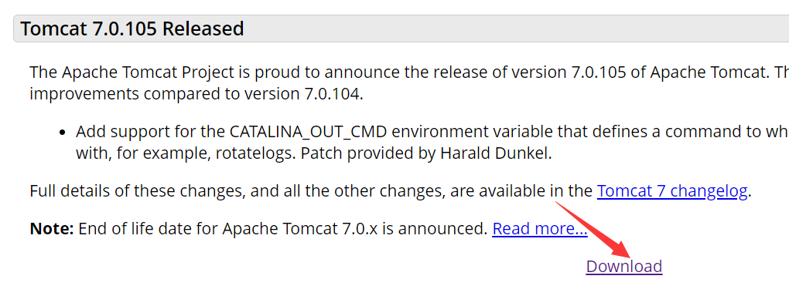
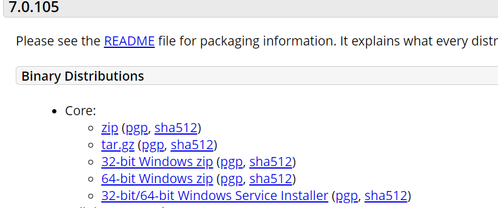
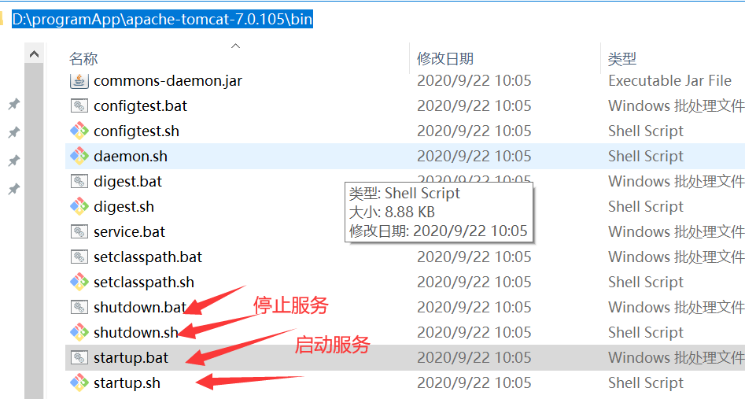

[toc]

### Tomcat简介

> tomcat是一个中间件，在B/S架构中，浏览器发出的http请求经过tomcat中间件，转发到最终的目的服务器上，响应消息再通过tomcat返回给浏览器。
>
> tomcat所做的事情主要有：开启监听端口监听用户的请求，解析用户发来的http请求然后访问到你指定的应用系统，然后你返回的页面经过tomcat返回给用户。

### windows 安装

1. **下载windows版本的apache-tomcat，网址：http://tomcat.apache.org/**

   

   

2. **若未安装JDK，需先安装JDK;若已安装；在【1】中下载的是64位的解压版zip，则直接解压【1】中下载的**

**文件压缩包到指定目录下；然后配置tomcat相关环境变量。**

> **1、Tomcat解压完成后，直接在bin目录下运行startup.bat，是可以启动Tomcat的！**
>
> **2、但是如果不是在bin目录下运行startup.bat，则会启动失败，startup.bat闪退！**
>
> 由此解决了一个衍生出的一台电脑装多个Tomcat的问题：**如果想要同时启动多个tomcat，那么环境变量就要么都不配置，要么全都配置。**
>
> 如果想要直接在命令窗口任意目录下启动tomcat,需配置环境变量

如：在本机的安装目录为：`D:\programApp\apache-tomcat-7.0.105`

需配置的环境变量

```
CATALINA_HOME=D:\programApp\apache-tomcat-7.0.105  //tomcat安装目录
PATH中添加: %CATALINA_HOME%\bin;  
```

3. **检验是否安装成功**

   **方法1：**

   ```
   1. 【win+R】然后输入 cmd 进步win命令行界面
   2. 执行以下命令，
   C:\Users\12613>d:
   D:\>cd D:\programApp\apache-tomcat-7.0.105/bin //进入bin目录
   D:\programApp\apache-tomcat-7.0.105\bin>startup.bat //启动服务
   
   
   D:\programApp\apache-tomcat-7.0.105\bin>shutdown.bat //停止服务
   ```

   **方法2：**直接点击安装的bin目录下的startup.bat或startup.sh

   > 

   在浏览器输入网址：http://localhost:8080/ 查看是否显示出现Tomcat的网页，若显示则安装成功。若不需使用服务，需关闭服务，以免占用端口。关闭服务操作，参照上述【方式1】【方式2】中说明。

### tomcat目录结构说明

   1. **bin**

   >  该目录下存放的是二进制可执行文件，如果是安装版，那么这个目录下会有两个exe文件：tomcat6.exe、tomcat6w.exe，前者是在控制台下启动Tomcat，后者是弹出UGI窗口启动Tomcat；如果是解压版，那么会有startup.bat和shutdown.bat文件，startup.bat用来启动Tomcat，但需要先配置JAVA_HOME环境变量才能启动，shutdawn.bat用来停止Tomcat；

   2. **conf**

   > 这是一个非常非常重要的目录，这个目录下有四个最为重要的文件：
> - server.xml：配置整个服务器信息。例如修改端口号，添加虚拟主机等；
   >
   >   `<Connector port="8080 protocol="HTTP/1.1" connectionTimeout="20000" redirectPort="8443" />`
   >
   > - tomcatusers.xml：存储tomcat用户的文件，这里保存的是tomcat的用户名及密码，以及用户的角色信息。可以按着该文件中的注释信息添加tomcat用户，然后就可以在Tomcat主页中进入Tomcat Manager页面了；
   >
> - web.xml：部署描述符文件，这个文件中注册了很多MIME类型，即文档类型。这些MIME类型是客户端与服务器之间说明文档类型的，如用户请求一个html网页，那么服务器还会告诉客户端浏览器响应的文档是text/html类型的，这就是一个MIME类型。客户端浏览器通过这个MIME类型就知道如何处理它了。当然是在浏览器中显示这个html文件了。但如果服务器响应的是一个exe文件，那么浏览器就不可能显示它，而是应该弹出下载窗口才对。MIME就是用来说明文档的内容是什么类型的！
   >
> - context.xml：对所有应用的统一配置，通常我们不会去配置它。


3. **lib**
   
> Tomcat的类库，里面是一大堆jar文件。如果需要添加Tomcat依赖的jar文件，可以把它放到这个目录中，当然也可以把应用依赖的jar文件放到这个目录中，这个目录中的jar所有项目都可以共享之，但这样你的应用放到其他Tomcat下时就不能再共享这个目录下的Jar包了，所以建议只把Tomcat需要的Jar包放到这个目录下；

4. **logs**
   
> 这个目录中都是日志文件，记录了Tomcat启动和关闭的信息，如果启动Tomcat时有错误，那么异常也会记录在日志文件中。

5. **temp**
   
> 存放Tomcat的临时文件，这个目录下的东西可以在停止Tomcat后删除！

6. **webapps**
   
> 存放web项目的目录，其中每个文件夹都是一个项目；如果这个目录下已经存在了目录，那么都是tomcat自带的项目。其中ROOT是一个特殊的项目，在地址栏中没有给出项目目录时，对应的就是ROOT项目。http://localhost:8080/examples，进入示例项目。其中examples就是项目名，即文件夹的名字。

7. **work**
   
   > 运行时生成的文件，最终运行的文件都在这里。通过webapps中的项目生成的！可以把这个目录下的内容删除，再次运行时会生再次生成work目录。当客户端用户访问一个JSP文件时，Tomcat会通过JSP生成Java文件，然后再编译Java文件生成class文件，生成的java和class文件都会存放到这个目录下。
   
8. **LICENSE**

   > 许可证。

9. **NOTICE**

   > 说明文件。

   ### 扩展

   #### web概念

   > 1. **软件架构**：B/S(浏览器/服务端)、C/S(客户端/服务端)
   >
   > 2. **资源分类**：
   >
   >    a. 静态资源：所有用户访问后，得到的结果都是一样的，称为静态资源。静态资源可以被浏览器解析，如：html/css/javascript/jpg
   >
   >    b. 动态资源：每个用户访问相同资源后得到的结果可能不一样，称为动态资源。动态资源被访问后，需转换为静态资源，再返回给浏览器，经过浏览器解析。
   >
   >    如：servelet/jsp/php/asp....
   >
   > 3. **网络通信三要素**
   >
   >    a. IP:电子设备(计算机)在网络中的唯一标识；
   >
   >    b. 端口: 应用程序在计算机中的唯一标致：0-65536
   >
   >    c. 传输协议:规定数据传输的规则。
   >
   >    1）基础协议：
   >
   >    ​     tcp ：安全协议，三次握手，速度较慢；
   >
   >    ​     udp：不安全协议，速度快；

   #### 常见Web服务器

   > - **概念**
   >
   > 服务器: 安装了服务器软件的计算机；
   >
   > 服务器软件：接收用户的请求，处理请求，做出响应；
   >
   > web服务器软件：接收用户的请求，处理请求，做出响应；web服务器软件中可以部署web项目，让用户通过浏览器来访问这些项目
   >
   > - 常见web服务器软件
   >   - **weblogic**:oracle公司，大型javaEE服务器，支持所有JavaEE规范，收费的；
   >   - **webSphere** ：IBM公司，大型javaEE服务器，支持所有JavaEE规范，收费的；
   >   - **JBOSS**: JBOSS公司，大型javaEE服务器，支持所有JavaEE规范，收费的；
   >   - **tomcat**：Apache基金组织，中小型JavaEE服务器，仅仅支持少量的JavaEE规范的jsp/servlet.开源的，免费的。
### 参考资料

   1. https://blog.csdn.net/Atishoo_13/article/details/86428867