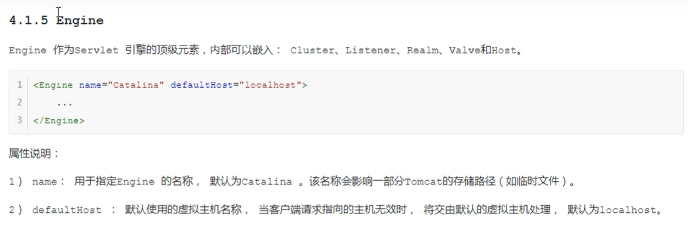
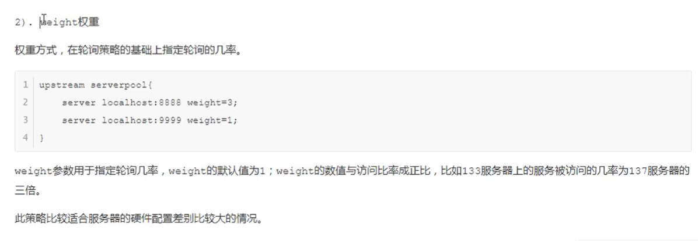
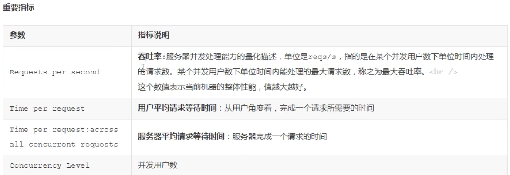
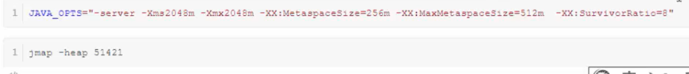
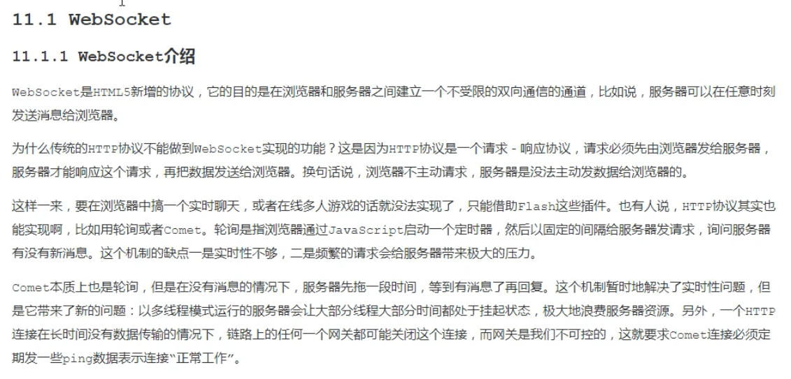

[toc]

### http工作原理

> HTTP协议是浏览器与服务器之间的数据传输协议。作为应用层协议，HTTP是基于TCP/IP协议来传输数据的（HTML文件/图片/查询结果等）。HTTP协议不涉及数据包（Packet）传输，主要规定了客户端与服务端的通信格式。
>
> 

### http服务器请求处理

> 
>
> 

### servlet容器工作流程

> 

### Tomcat结构

> 

### 连接器-Coyote

> 
>
> 
>
> 
>
> 
>
> 

#### 连接器组件

> 
>
> 
>
> 

### 容器-Catalina

> 
>
> 

#### Catalina结构

> 
>
> 
>
> 
>
> 
>
> 
>
> 
>
> 

### Tomcat启动流程

> 
>
> 

### Tomcat请求处理流程

> 
>
> 

### Jasper

> 

### Tomcat服务器配置

#### server.xml

> 
>
> 
>
> 
>
> 
>
> 
>
> **java jdk bin下`jconsole.exe`可以用来监控指定线程**  
>
> 
>
> 
>
> 
>
> 
>
> 
>
> 
>
> 
>
> 
>
> 

### tomcatusers.xml

> 主要用来配置tomcat用户、角色等信息，用来控制tomcat中的manager,host-manager的访问权限

### web应用配置

> 
>
> 
>
> 
>
> 
>
> 
>
> 
>
> 
>
> 
>
> 
>
> 
>
> 
>
> 
>
> 

### Tomcat管理配置

> 
>
> 
>
> 

### JVM配置

> 
>
> 
>
> 

### Tomcat集群

> 
>
> 
>
> 
>
> 
>
> 
>
> 
>
> 
>
> 
>
> 
>
> 
>
> 参考tomcat官方文档：https://tomcat.apache.org/tomcat-9.0-doc/cluster-howto.html
> 
>
> session复制只在小型集群上应用，大型集群一般不用，因为会造成资源浪费。
>
> 

### Tomcat安全

> 
>
> 
>
> 
>
> 
>
> 
>
> 
>
> 在tomcat安装目录下，打开命令行界面，然后输入上图所示命令
>
> keytool :JDK bin目录下提供的工具
>
> 
>
> 

### Tomcat性能调优

> 
>
> 
>
> 
>
> 
>
> 
>
> 
>
> 
>
> 
>
> 
>
> 
>
> 
>
> 
>
> 
>
> 
>
> 
>
> 
>
> 

### Socket介绍

> 
>
> 
>
> 
>
> 
>
> 
>
> 
>
> 
>
> 

### 扩展学习

1. SwitchHost 修改 hosts 文件，配置IP与域名映射
2. `telnet 127.0.0.1 8005`

### 参考资料

1. https://www.bilibili.com/video/BV1dJ411N7Um?p=17