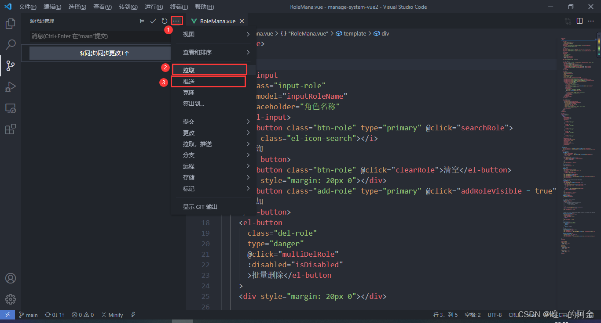

[Toc]

# 配置SVN

1. 在vscode扩展中下载svn插件，如下图


2. 在vscode下方设置中搜索svn,打开setting.json文件


3. 将svn.path修改成自己本地地址即可，（svn.exe文件）


# 插件安装推荐

## 图标插件(vscode-icons）

件图标库插件，至少能让你的工具看起来不那么丑，主要是起到一个美化的效果。其效果如下：


## html与css关联(CSS Peek)

> 可以直接在html代码中，按ctrl+鼠标左键查看该元素的样式

## 万能语言运行环境 (Code Runner）

> 如果你需要学习或者接触各种各样的开发语言，那么 Code Runner 插件可以让你不用搭建各种语言的开发环境，直接通过此插件就可以直接运行对应语言的代码，非常适合学习或测试各种开发语言。

## 快速注释(Document This)

> Document This 可以快速地帮你生成注释，如一些函数的注释还能帮你抽取出参数的定义等，是你编写规范代码必备的工具。Document This目前仅支持JavaScript和TypeScript。

## CSS 类名智能提示(HTML CSS Support)

> 它会提示一些类名供你选择。
> 

## 代码拼写检查(Code Spell Checker)

> 此插件安装后就不用管就好了，在你代码中有单词拼写错误时，你就会发现它的好处，因为我们写代码毕竟都是大量的英文单词变量 定义，插件还可以给出错误拼写单词的建议。如果单词有错下面就会出现波浪线。


## 备忘插件(TODO Highlight)

> 在很多的其他代码编辑器中都有 TODO 标注功能的，如你写到某一部分的代码时，其中部分的功能需要稍后再来实现，这是就可以在对应的代码处添加一个 TODO 类型的注释，那么后期就可以快速地跳转到这部分继续写，而且当项目很大的时候，TODO 就变得更加有用，因为有时候 TODO 可能有几十个，帮助你标注那些功能需要继续实现或优化。


## 自动重命名标签(Auto Rename Tag)

> 这个插件对你的标签修改起来一个很大的作用，当你修改起始标签的时候，结束标签也会随着起始标签的修改而修改


## html模板(HTML Boilerplate)

> 就是一个很标准html5的模板插件，兼容新老版浏览器。


## 代码格式化(Prettier - Code formatter)


## 颜色提示(Color Info)


## 自动闭合标签(Auto Close Tag）

> 安装了这个插件后，如果你的起始标签不小心删除的结束标签，只要打 </ 就会自动补全，根据就近原则，一次只能补全一个标签。

# 常用快捷键

## 注释快捷键

```
单行注释： ctrl + / 
取消注释：再按一遍  ctrl + / 

多行注释（块注释）： Alt+Shift+A 
取消注释：再按一遍  Alt+Shift+A 
```

# VSCODE+Git配置

>  当我们在VScode中编写代码后，需要提交到git仓库时，但是我们又不想切换到git的命令行窗口，我们可以在VScode中配置git，然后就可以很方便快捷的把代码提交到仓库中。

## 1. 安装Git命令行工具

点击git官网，然后点击download，来到下面的界面


 根据自己的电脑，选择相应的版本

**注意：一定要记得自己安装的路径！！！**

安装完成后，在桌面上点击右键，出现下图所示的图标，则表示安装成功：


## 2. 配置VScode中的git

 1. 打开VScode，依次点击下图中的地方


 2. 在输入框中输入 git.path ，再点击第二个地方，打开 settings.json 文件


3. 在 settings.json 文件中，添加 git 的安装路径


 

**注意：冒号前面是 git.path ，路径是 cmd 文件夹中的 git.exe** 

然后关闭 VScode ，再次打开，过几秒钟后，点击左侧的第3个图标，也就是下图的第一个地方，发现第2和第3个地方变成了可点击状态，不是暗色的，表面git环境配置成功。


## 3. 使用 VScode + git，提交到仓库

1）当我们修改代码时，左侧会提示我们哪个文件发生了改动 


2）点击上图的第3处的 **+** 号，表示 **add** 命令，如下图，这时，文件被放在暂存区


3）在下图的输入框中，输入要提交的备注信息，如 **again test** ，然后，可以按 **Ctrl + enter** ，或者点击橙色框中的对号，就是完成了 **commit** 命令


4）接着，点击下图的第一个地方，依次点击拉取、推送，即 **pull** 命令和 **push** 命令。



# vscode中设置工作区隐藏文件或文件夹

> 使用vscode在写python的时候，运行python程序，会在文件夹中生成`*.pyc`文件，或生成`__pycache__`文件夹，影响操作：


- **在vscode中可以将其设置隐藏**：

1. ctrl+shift+P打开显示所有命令，在输入框中输入settings回车


2. 进入User Settings页面搜索files.exclude


3. 在右侧用户设置中添加 `"**/__pycache__": true` ，与之前用逗号隔开，覆盖默认值并保存

   ```
   "files.exclude": {
           "**/.git": true,
           "**/.svn": true,
           "**/.hg": true,
           "**/CVS": true,
           "**/.DS_Store": true,
           "**/__pycache__": true
       }
   ```

   

   4. 可以看到左侧的**pycache**目录被隐藏了。
      如果要隐藏文件的话添加 `"**/*.pyc": true` 即可，`*.pyc` 是后缀名是pyc的文件，想隐藏其他类型文件，将后缀名替换即可。

# 参考资料

1. https://blog.csdn.net/weixin_39934063/article/details/109914910
2. https://blog.csdn.net/czjl6886/article/details/122129576