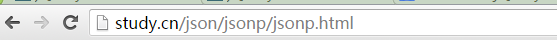

[Toc]

# 运行Vue项目

## 1. 配置Vue运行环境

1. node.js环境（npm包管理器）

   ```
   ### 查看nodejs版本
   node -v
   ### 若未安装node先安装node;从网上下载后直接安装
   ```

2. vue-cli 脚手架构建工具

   ```
   cnpm install -g vue-cli
   ```

3. 进入项目目录下，安装依赖

```
npm install
```

 4. 运行项目

    - **查看项目运行脚本配置**：客户端服务运行名

    

    - **运行项目**

    ```
    npm run serve
    ```

    运行结束后：可以看到本地访问地址，直接以该地址访问
    

## 2. 运行项目报错问题

- **场景描述**

> 运行项目时，提示无法识别某个模块，或者命令，或者找不到依赖的模块等
>
> 如下报错信息
>
> ```
> Error: Cannot find module './lib/spinner'
> Require stack:
> ```

- **解决方案**

1. 删除`node_modules` 整个文件夹和 package-lock.json 文件(这个文件不一定有)，注意不是 `package.json`
2. 清除缓存`npm cache clear --force`;
3. 重新安装依赖： `npm install`
4. 重新运行项目： `npm run serve` 

## 3. 编译vue项目报错

- **场景描述**

> 运行vue项目时，无法正常引入模块，报错信息如下：

```
 error  in ./src/views/Box.vue

Module Error (from ./node_modules/@vue/cli-service/node_modules/vue-loader/lib/index.js):


Vue packages version mismatch:

- vue@2.6.14 (D:\huadi_workspace\tjyz_workspace\old_tjyz_project\tjyz\TJYZ-v1.0\node_modules\vue\dist\vue.runtime.common.js)
- vue-template-compiler@2.6.10 (D:\huadi_workspace\tjyz_workspace\old_tjyz_project\tjyz\TJYZ-v1.0\node_modules\vue-template-compiler\package.json)
```

- **问题原因**

> vue-template-compiler和vue版本需要一致

- **解决方案**

> 安装vue对应版本的`vue-template-compiler`版本

```
npm i vue-template-compiler@2.6.14(你的vue版本号)
```

# 跨域问题

- **场景描述**

> 使用`axios`请求数据时，报错信息如下：
>
> ```
> Access to XMLHttpRequest at 'http://127.0.0.1:3000/' from origin 'http://localhost:63342' has been blocked by CORS policy: No 'Access-Control-Allow-Origin' header is present on the requested resource
> ```
>
> 无法正常获取到数据。使用Postman可以正常获取数据，浏览器无法正常获取数据。	

- **问题探索**

1. 同样是使用axios请求数据，为什么有的会产生跨域问题，有的不会？
   如：本地访问网址:http://localhost:5001/#/

   | 请求数据接口                                                 | 有无存在跨域问题 | 请求响应头比对                                               |
   | ------------------------------------------------------------ | ---------------- | ------------------------------------------------------------ |
   | [互联网上请求ali测试API接口](http://rap2api.taobao.org/app/mock/223607) | 无               | Access-Control-Allow-Origin: *<br/>Access-Control-Allow-Methods: POST, GET, PUT, DELETE, OPTIONS<br/>Access-Control-Allow-Credentials: true |
   | [内网请求数据API接口1](http://120.160.20.248:8090/maildatav/) | 无               | Access-Control-Allow-Credentials: true                       |
   | [内网请求API数据接口3](http://110.11.36.143:7090/Mobile)     | 有               | 无                                                           |

   - http://rap2api.taobao.org/app/mock/223607 请求&响应信息如下(使用Chrome检查工具)

   ```
   - General
   Request URL: http://rap2api.taobao.org/app/mock/223607/index/map
   Request Method: GET
   Status Code: 200 OK
   Remote Address: 203.107.44.46:80
   Referrer Policy: strict-origin-when-cross-origin
   
   - Reponse Headers
   HTTP/1.1 200 OK
   Date: Fri, 18 Mar 2022 02:46:31 GMT
   Content-Type: application/json; charset=utf-8
   Content-Length: 1617
   Connection: keep-alive
   Server: nginx/1.16.1
   Access-Control-Allow-Origin: *
   Access-Control-Allow-Methods: POST, GET, PUT, DELETE, OPTIONS
   Access-Control-Allow-Credentials: true
   Vary: Origin
   Set-Cookie: koa.sid=C7z-5FD7A4RgBf4w-OOUsjWm7Fv6aXEm; path=/; expires=Sat, 19 Mar 2022 02:17:26 GMT; httponly
   Set-Cookie: koa.sid.sig=P1PydaIt4zpMMVIt6SWK6S4oInE; path=/; expires=Sat, 19 Mar 2022 02:17:26 GMT; httponly
   
   - Request Headers
   GET /app/mock/223607/index/map HTTP/1.1
   Host: rap2api.taobao.org
   Connection: keep-alive
   Cache-Control: max-age=0
   Upgrade-Insecure-Requests: 1
   User-Agent: Mozilla/5.0 (Windows NT 10.0; Win64; x64) AppleWebKit/537.36 (KHTML, like Gecko) Chrome/97.0.4692.71 Safari/537.36
   Accept: text/html,application/xhtml+xml,application/xml;q=0.9,image/avif,image/webp,image/apng,*/*;q=0.8,application/signed-exchange;v=b3;q=0.9
   Accept-Encoding: gzip, deflate
   Accept-Language: zh-CN,zh;q=0.9
   Cookie: aliyungf_tc=8bd63cd691946412b3d6546db9cbac27c759179c7f7f669d7bcc91e15498889b; koa.sid=C7z-5FD7A4RgBf4w-OOUsjWm7Fv6aXEm; koa.sid.sig=P1PydaIt4zpMMVIt6SWK6S4oInE
   ```

   - http://121.160.20.248:8090/maildatav/  请求&响应信息如下(使用Chrome检查工具)

   ```
   - General
   Request URL: http://121.160.20.248:8090/maildatav/mail/send/bb05?starttime=2019-08-01&endtime=2019-08-07
   Request Method: GET
   Status Code: 200 
   Remote Address: 111.160.20.248:8090
   Referrer Policy: strict-origin-when-cross-origin
   
   
   - Reponse Headers
   HTTP/1.1 200
   Server: nginx/1.20.0
   Date: Fri, 18 Mar 2022 03:09:55 GMT
   Content-Type: application/json;charset=UTF-8
   Transfer-Encoding: chunked
   Connection: keep-alive
   Access-Control-Allow-Credentials: true
   Expires: Wed, 23 Mar 2022 03:09:55 GMT
   Cache-Control: max-age=432000
   X-Frame-Options: SAMEORIGIN
   
   - Request Headers
   GET /maildatav/mail/send/bb05?starttime=2019-08-01&endtime=2019-08-07 HTTP/1.1
   Host: 121.160.20.248:8090
   Connection: keep-alive
   Cache-Control: max-age=0
   Upgrade-Insecure-Requests: 1
   User-Agent: Mozilla/5.0 (Windows NT 10.0; Win64; x64) AppleWebKit/537.36 (KHTML, like Gecko) Chrome/97.0.4692.71 Safari/537.36
   Accept: text/html,application/xhtml+xml,application/xml;q=0.9,image/avif,image/webp,image/apng,*/*;q=0.8,application/signed-exchange;v=b3;q=0.9
   Accept-Encoding: gzip, deflate
   Accept-Language: zh-CN,zh;q=0.9
   Cookie: JSESSIONID=2628BD57460AC152D836B8EFD1CF0FFA; _ga=GA1.1.1128314729.1647572385; _gid=GA1.1.725497467.1647572385
   ```

   - http://110.11.36.143:7090/Mobile 请求&响应信息如下(使用Chrome检查工具) 存在跨域

   ```
   - General
   Request URL: http://111.160.20.248:8090//Mobile/ywljc/ywljc!getTjLclJson.action?{%22startdate%22:%222021-12-13%22,%22enddate%22:%222021-12-13%22,%22type%22:%220%22}
   Request Method: GET
   Status Code: 200 
   Referrer Policy: strict-origin-when-cross-origin
   
   
   - Reponse Headers
   HTTP/1.1 200 OK
   Server: nginx/1.20.0
   Date: Fri, 18 Mar 2022 03:20:55 GMT
   Content-Type: text/html; charset=utf-8
   Content-Length: 2167
   Last-Modified: Fri, 22 Oct 2021 09:47:01 GMT
   Connection: keep-alive
   ETag: "61728895-877"
   X-Frame-Options: SAMEORIGIN
   Accept-Ranges: bytes
   
   - Request Headers
   GET /Mobile/ywljc/ywljc!getTjLclJson.action?{%22startdate%22:%222021-12-13%22,%22enddate%22:%222021-12-13%22,%22type%22:%220%22} HTTP/1.1
   Host: 111.160.20.248:8090
   Connection: keep-alive
   Accept: application/json, text/plain, */*
   User-Agent: Mozilla/5.0 (Windows NT 10.0; Win64; x64) AppleWebKit/537.36 (KHTML, like Gecko) Chrome/97.0.4692.71 Safari/537.36
   Origin: http://localhost:5001
   Referer: http://localhost:5001/
   Accept-Encoding: gzip, deflate
   Accept-Language: zh-CN,zh;q=0.9
   ```

   **问题原因**：前端的跨域问题产生是因为浏览器的安全策略导致。

- **解决方案**

  - 方案1：使用`nginx`代理，将web请求&接口请求放在同一域中，真正的请求服务端口由nginx去请求。

  - 方案2：在Vue配置文件中配置代理

    ```
    - 修改vue.config.js配置，在配置中配置代理
    
    module.exports = {
        productionSourceMap: false,
        devServer: {
            port: 5001,
            proxy: {
                '/ywljc': {
                  target: 'http://10.11.36.143:7090', //API服务器的地址
                  ws: true, //代理websockets
                  changeOrigin: true, // 是否跨域，虚拟的站点需要更管origin
                  pathRewrite: {
                    // '^/api'是一个正则表达式，表示要匹配请求的url中，全部'http://localhost:8081/api' 转接为 http://localhost:8081/
                    '^/ajapi': '/',
                  }
                }
            },
        },
    
        publicPath: './'
    }
    ```

    - 页面请求网址：`/ajapi/Mobile/ywljc/ywljc!`

# 动态下拉选实现

- **场景描述**

> 进入页面后，ajax请求数据，将请求返回的数据在下拉选显示

- **实现**

> - 实现工具说明
>
> 1. vue2.0；
> 2. element-ui  基于vue 2.0
> 3. axios  //异步请求数据插件

- **源码**

```
<!DOCTYPE html>
<html lang="en">
<head>
    <meta charset="UTF-8">
    <meta name="viewport" content="width=device-width, initial-scale=1.0">
    <meta http-equiv="X-UA-Compatible" content="ie=edge">
    <link rel="stylesheet" href="../plugins/element-ui/index.css">
    <script src="../plugins/vue.min.js"></script>
    <script src="../plugins/element-ui/index.js"></script>
    <script src="../plugins/axios/axios.min.js"></script>
    <title>Document</title>
    <style>
        .el-row {
          margin-bottom: 20px;
        }
        .el-col {
          border-radius: 4px;
        }
        .bg-purple-dark {
          background: #001529;
        }
        .bg-purple {
          background: #d3dce6;
        }
        .bg-purple-light {
          background: #e5e9f2;
        }
        .grid-content {
          border-radius: 4px;
          min-height: 36px;
        }
        .row-bg {
          padding: 10px 0;
          background-color: #f9fafc;
        }
      </style>
</head>
<body>
    <div id="app">
      <template>
        <el-select v-model="value" placeholder="请选择">
          <el-option
            v-for="item in options"
            :key="item.abbr"
            :label="item.name"
            :value="item.abbr">
            <span style="float: left">{{ item.name }}</span>
            <span style="float: right; color: #8492a6; font-size: 13px">{{ item.abbr }}</span>
          </el-option>
        </el-select>
      </template>
    </div>
      
    <script>
      var Main = {
        data() {
          return {
            value:'',
            options:[],
          }
        },beforeCreate(){ //在实例初始化之后、进行数据侦听和事件/侦听器的配置之前同步调用
          var _this = this;//这步很重要，在axios函数中的this不会指向vue绑定的实例对象
          axios.get('city-img.json', {  
            }).then(function (response) {
              _this.options=response.data;//方式1：直接将返回数据赋值给vue实例对象中的options对象
              /**方式2：通过循环，将所需数据传递给vue实例对象中的options对象
              var tmpDatas=response.data;
              for(var i=0;i<tmpDatas.length;i++){
                console.log(tmpDatas[i]);
                _this.options.push(tmpDatas[i]);
              }**/
          }).catch(function (error) {
              console.log(error);
            })
        },
        methods:{}
      }
    var Ctor = Vue.extend(Main)
    new Ctor().$mount('#app')  
  </script>
</body>
</html>
```

- **实现中遇到的问题**

1. 使用axios获取到后台返回的数据后，无法设置到下拉选中

- **错误代码如下**：

```
beforeCreate(){ 
          axios.get('city-img.json', {  
            }).then(function (response) {
            this.options=response.data;//此方式无法将返回的数据赋值到options对象，原因：在axios函数中this此时不是指向											vue实例化的对象
          }).catch(function (error) {
              console.log(error);
            })
        }
```

# 知识点集

## 什么是跨域

> - **跨域**：浏览器对于javascript的同源策略的限制,例如a.cn下面的js不能调用b.cn中的js,对象或数据(因为a.cn和b.cn是不同域),所以跨域就出现了.
>   **注意**：跨域限制访问，其实是**浏览器的限制**;
>   - 跨域问题一般在B-S结构项目中出现，在`C-S`结构项目中少有；
>   - postman 没有跨域限制，相当于客户端请求服务端，然后结构化数据后展现在postman客户端上；
>   - 前端的跨域问题产生是因为浏览器的安全策略导致。
>
> - **同源策略**：是指协议，域名，端口都要相同，其中有一个不同都会产生跨域。比如:我在本地上的域名是study.cn,请求另外一个域名一段数据
>
>   
>
>   这个时候在浏览器上会报错:
>
>   
>
>   这个就是同源策略的保护,如果浏览器对javascript没有同源策略的保护,那么一些重要的机密网站将会很危险~
>
>   | study.cn/json/jsonp/jsonp.html             |                       |      |
>   | ------------------------------------------ | --------------------- | ---- |
>   | 请求地址                                   | 形式                  | 结果 |
>   | http://study.cn/test/a.html                | 同一域名,不同文件夹   | 成功 |
>   | http://study.cn/json/jsonp/jsonp.html      | 同一域名,统一文件夹   | 成功 |
>   | http://a.study.cn/json/jsonp/jsonp.html    | 不同域名,文件路径相同 | 失败 |
>   | http://study.cn:8080/json/jsonp/jsonp.html | 同一域名,不同端口     | 失败 |
>   | https://study.cn/json/jsonp/jsonp.html     | 同一域名,不同协议     | 失败 |

- **前端跨域情况**

> 1. AJAX直接请求普通文件存在跨域无权限访问的问题,不管是静态页面也好.
>
> 2. 不过我们在调用js文件的时候又不受跨域影响,比如引入jquery框架的,或者是调用相片的时候
>
> 3. 凡是拥有scr这个属性的标签都可以跨域例如<script><iframe>
>
> 4. 如果想通过纯web端跨域访问数据只有一种可能,那就是把远程服务器上的数据装进js格式的文件里.
>
> 5. 而json又是一个轻量级的数据格式,还被js原生支持

### Access-Control-Allow-Credentials

`Access-Control-Allow-Credentials`:`response`头部字段：

- 表示当请求的认证模式`Request.credentials=include`是否可以将对请求的响应暴露给前端`JS`页面(代码)。
  返回true表示可以，其他值均表示不可以。
  `credentials`可以是`cookies`,`authorization headers`或`TLS client centificates`

- 当作为对预检请求的响应的一部分时，能表示是否真正的请求可以使用`credentials`,如果这个响应头没有随资源返回，响应就会被浏览器忽视，不会返回到web内容。
  注意：简单的`GET`请求没有预检

这个配置的唯一有效值为`true`,当不需要证书验证时，省略此配置

```
### 当服务端设置
Access-Control-Allow-Credentials=true

### 方式1：XHR使用证书
var xhr = new XMLHttpRequest();
xhr.open('GET','http://example.com/',true);
xhr.withCredentials = true;
xhr.send(null);

###方式2：  Fetch with credentials
fetch(url,{
  credentials:'include'
});
```

### Access-Control-Allow-Origin

> 响应头指定了该响应的资源是否被允许与给定的[origin](https://developer.mozilla.org/zh-CN/docs/Glossary/Origin)共享
> origin:Web内容的源由用于访问它的[URL](https://developer.mozilla.org/zh-CN/docs/Glossary/URL) 的方案(协议)，主机(域名)和端口定义。只有当方案，主机和端口都匹配时，两个对象具有相同的起源。
> 服务器默认是不被允许跨域的。给Nginx服务器配置`Access-Control-Allow-Origin *`后，表示服务器可以接受所有的请求源（Origin）,即接受所有跨域的请求。

```
Access-Control-Allow-Origin: *    //允许所有域访问资源权限
Access-Control-Allow-Origin: <origin>   //指定一个可以访问资源的URI

### 范例
### 如需允许所有资源都可以访问您的资源，您可以如此设置：
Access-Control-Allow-Origin: *
### 如需允许https://developer.mozilla.org访问您的资源，您可以设置：
Access-Control-Allow-Origin: https://developer.mozilla.org

### 如果服务器未使用“*”，而是指定了一个域，那么为了向客户端表明服务器的返回会根据Origin请求头而有所不同，必须在Vary响应头中包含Origin。
Access-Control-Allow-Origin: https://developer.mozilla.org
Vary: Origin
```

- 设置接口资源可被所有域访问

```
Access-Control-Allow-Credentials=true  //需要证书验证
Access-Control-Allow-Origin: *   //允许所有域访问资源权限

### 当不需要证书验证&允许特定的URI访问资源
Access-Control-Allow-Origin: https://developer.mozilla.org
```

# 部署

## 1. vue项目打包

```
npm run build
```

## 2. 将dist文件夹拷贝到nginx项目目录下

```
修改dist文件夹为tjapp_2022,然后目录如下
/etc/nginx/tjapp_2022;
```


## 3. 配置nginx.conf

```
server {
    listen 5002;
    fastcgi_connect_timeout  300s;
    fastcgi_send_timeout  300s;
    fastcgi_read_timeout  300s;
    location / {
      root /etc/nginx/tjapp_2022;
	  try_files $uri $uri/ /index.html index.htm index.html.gz;
    }
    location /api/ { //配置api 代理
	proxy_pass  http://10.11.156.17:8082/;
	proxy_set_header Accept application/json,text/javascript,*/*;
	proxy_set_header Content-Type application/json;
      #proxy_set_header Host $host:$proxy_port;
      #proxy_set_header  X-Real-IP        $remote_addr;
      #proxy_set_header  X-Forwarded-For  $proxy_add_x_forwarded_for;
      #proxy_set_header X-NginX-Proxy true;
        proxy_connect_timeout    300s;
        proxy_read_timeout   300s;
        proxy_send_timeout   300s;
     # proxy_buffer_size          4k;
     # proxy_buffers              4 32k;
     # proxy_busy_buffers_size    64k;
     # proxy_temp_file_write_size 64k;
    }

   }
```

# 问题集

## Cannot read properties of null (reading ‘pickAlgorithm‘)

- **场景描述**

> 新导入项目，重新安装依赖，提示报错信息如下：
>
> ```
> npm ERR! Cannot read properties of null (reading 'pickAlgorithm')
> 
> npm ERR! A complete log of this run can be found in:
> npm ERR!     C:\Users\12613\AppData\Local\npm-cache\_logs\2022-04-21T03_30_54_505Z-debug-0.log
> ```

- **解决方案**:清除缓存`npm cache clear --force`之后再重新安装依赖`npm install`
  

## 运行项目报错

- **报错信息**

```
Error: Cannot find module './lib/spinner'
Require stack:
```

- **解决方案**

> 1. 删除 node_modules 整个文件夹和 package-lock.json 文件(这个文件不一定有)，注意不是 package.json
> 2. 在项目下运行 `npm install`
> 3. 继续运行 `npm start`


# 参考资料

1. https://www.cnblogs.com/chenshishuo/p/4919224.html
2. https://blog.csdn.net/qq_29483485/article/details/123711261