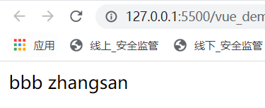
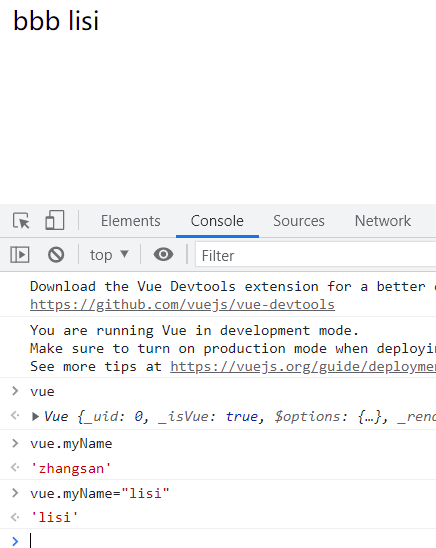
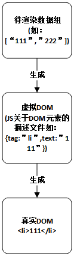
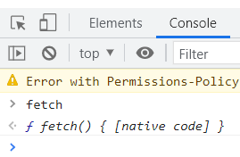
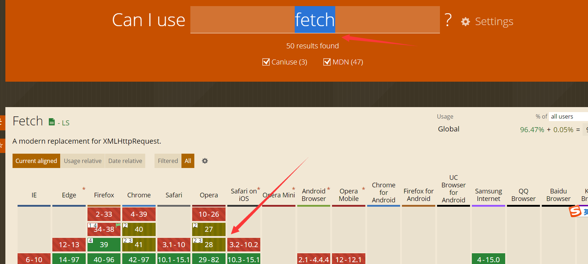
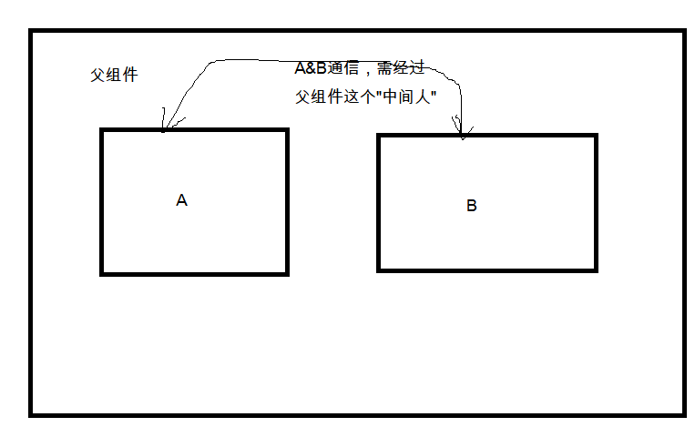
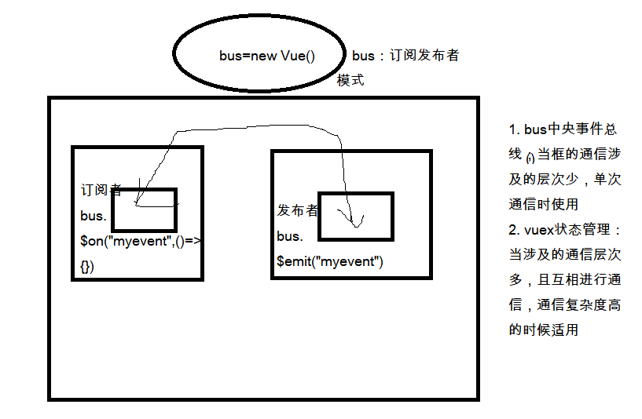
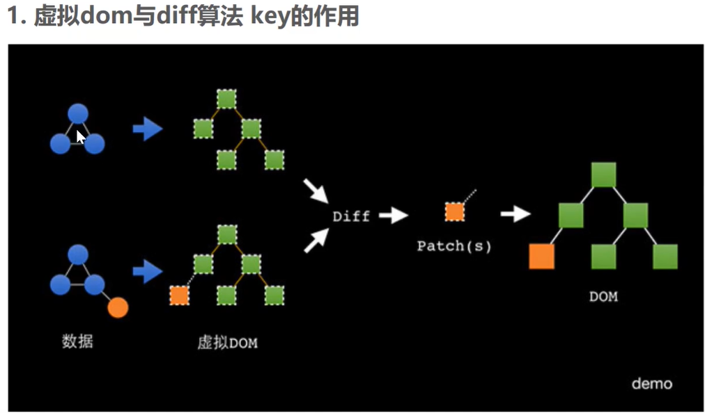

[Toc]

# 前提

1. 学习版本：vue 2.0 API;其中会有部分与vue3的知识与对比
2. 开发工具：Visual Studio Code 8.6
3. [VUE2.0官方教程](https://cn.vuejs.org/v2/guide/)
4. [VUE3.0官方教程](https://v3.cn.vuejs.org/guide/introduction.html)
5. vue2.0&vue3.0:vue3.0向下兼容vue2.0
6. vue架构：MVVM

# 下载网址

- **CDN网址**

> - [Staticfile CDN（国内](https://cdn.staticfile.org/vue/2.2.2/vue.min.js) 
> - [unpkg](https://unpkg.com/vue@2.6.14/dist/vue.min.js)
> - [cdnjs]( https://cdnjs.cloudflare.com/ajax/libs/vue/2.1.8/vue.min.js)
> - [JS Deliver](https://cdn.jsdelivr.net/npm/vue@next/dist/)

- **CDN**
  CDN的全称是Content Delivery Network，即内容分发网络。CDN是构建在现有网络基础之上的智能虚拟网络，依靠部署在各地的边缘服务器，通过中心平台的负载均衡、内容分发、调度等功能模块，使用户就近获取所需内容，降低网络拥塞，提高用户访问响应速度和命中率。CDN的关键技术主要有内容存储和分发技术。
- **脚手架**
  原解释：脚手架是为了保证各施工过程顺利进行而搭设的工作平台。
  编程中的脚手架：为了保证快速的开发功能，而搭建的架构，开发员在搭建好的架构上，无需关心底层架构，可以直接关注业务，直接运用已有架构的东西，完成业务功能的顺利实现。
- **渐进式框架**：随着需求的增多，VUE可以推出更多的组件以满足需求。
- **数据驱动模型**：Vue主要是数据的操作

# Vue2.0安装方式

- **方式1**：直接使用`script`引入

  > 直接下载并用 `<script>` 标签引入，`Vue` 会被注册为一个全局变量。

  ```
  <!-- 开发环境版本，包含了有帮助的命令行警告 -->
  <script src="https://cdn.jsdelivr.net/npm/vue@2/dist/vue.js"></script>
  或者
  <!-- 生产环境版本，优化了尺寸和速度 -->
  <script src="https://cdn.jsdelivr.net/npm/vue@2"></script>
  
  ###下载vue.js到本地后，再引用
  <script src="../plugins/vue.min.js"></script>
  ```

- **方式2**：[NPM](https://cn.vuejs.org/v2/guide/installation.html#NPM)安装

  > 在用 Vue 构建大型应用时推荐使用 NPM 安装[[1\]](https://cn.vuejs.org/v2/guide/installation.html#footnote-1)。NPM 能很好地和诸如 [webpack](https://webpack.js.org/) 或 [Browserify](http://browserify.org/) 模块打包器配合使用。同时 Vue 也提供配套工具来开发[单文件组件](https://cn.vuejs.org/v2/guide/single-file-components.html)。

  ```
  # 最新稳定版
  $ npm install vue
  ```

- **方式3**：使用官方的 [CLI](https://v3.cn.vuejs.org/guide/installation.html#命令行工具-cli) 来构建一个项目

# Vue3.0 安装

- **目前有四种安装方式**：
  1. 在页面上以 [CDN 包](https://v3.cn.vuejs.org/guide/installation.html#cdn)的形式导入;
  2. 下载 JavaScript 文件并[自行托管](https://v3.cn.vuejs.org/guide/installation.html#下载并自托管);
  3. 使用 [npm](https://v3.cn.vuejs.org/guide/installation.html#npm) 安装;
  4. 使用官方的 [CLI](https://v3.cn.vuejs.org/guide/installation.html#命令行工具-cli) 来构建一个项目，它为现代前端工作流程提供了功能齐备的构建设置 (例如，热重载、保存时的提示等等)。

## 1. 以CDN包的形式导入

> 推荐链接到一个明确的版本号和构建文件，以避免新版本造成的不可预期的破坏

```
<script src="https://unpkg.com/vue@next"></script>

### 范例：
https://unpkg.com/browse/vue@3.2.31/dist/
```

## 2. 下载JS文件并自托管

- **建议应用场景**

> 1. 不想使用构建工具；
> 2. 无法在生产环境使用CDN.
>
> 符合以上场景时，可以直接下载所需`.js`文件，使用`script`在页面使用：
> 如：已下载`vue.min.js`文件，在`html`文件上使用
>
> ```
> <script src="../plugins/vue.min.js"></script>
> ```
>
> 下载网址，参见[下载网址](#下载网址)

- **下载注意事项**

> - 通常需要同时下载开发环境构建版本以及生产环境构建版本;
> - 不同文件说明，

## 3. 使用npm安装

> 在用 Vue 构建大型应用时推荐使用 npm 安装[[1\]](https://v3.cn.vuejs.org/guide/installation.html#footnote-1) 。npm 能很好地和诸如 [webpack](https://webpack.js.org/) 或 [Rollup](https://rollupjs.org/) 模块打包器配合使用。
> Vue 还提供了编写[单文件组件](https://v3.cn.vuejs.org/guide/single-file-component.html)的配套工具。如果你想使用单文件组件，那么你还需要安装 `@vue/compiler-sfc`

## 4. 使用官方的 [CLI](https://v3.cn.vuejs.org/guide/installation.html#命令行工具-cli) 来构建

> Vue 提供了一个[官方的 CLI](https://cli.vuejs.org/zh/)，为单页面应用 (SPA) 快速搭建繁杂的脚手架。它为现代前端工作流提供了功能齐备的构建设置。只需要几分钟的时间就可以运行起来并带有热重载、保存时 lint 校验，以及生产环境可用的构建版本

# JQuery&Vue

> VUE&JQuery都可以对DOM进行操作，VUE封装了JQuery的关于Dom的操作，简化了JQUERY关于DOM的操作。

# vue拦截原理

## `{{}}`

> 在vue中，`{{}}`中的语句作为js语句执行，满足js语法

```
<!DOCTYPE html>
<html lang="en">
<head>
    <meta charset="UTF-8">
    <meta name="viewport" content="width=device-width, initial-scale=1.0">
    <meta http-equiv="X-UA-Compatible" content="ie=edge">
    <title>Document</title>
    <script src="../vue.js"></script>
</head>
<body>
    <div id="box">
        <!--JS表达式-->
        {{10>20?'aaa':'bbb'}}  <!--结果显示为 bbb-->

        {{myName}} <!--结果显示为data中定义的myName状态值-->
    </div>
    
    <div></div>
    <script>
    //vue变量为Vue实例变量，通过变量vue可以访问到所有定义在new Vue()中的状态
    var vue = new Vue({
        el:"#box",//element，绑定操作的DOM，在此DOM内所有操作满足vue语法
        data:{
            myName:"zhangsan",//定义一个【状态】
        }
    });
    </script>
</body>
</html>
```

- **在Chrome浏览器中手动改变DOM值**

  上述代码执行结果显示：
  

  - 在chrome检查的console页面，操作vue这个全局变量。可以发现，不需要查找DOM，通过改变定义在vue中的状态值，可以随之改变dom中的变量值。
    

- **产生以上结果的原理**:VUE里封装了DOM绑定&设置值的JS,其底层处理过程如下html中的js处理。只是VUE将该JS进行了封装，在使用的时候不需要再通过获取DOM，然后再进行操作。

  ```
  <!DOCTYPE html>
  <html lang="en">
  <head>
      <meta charset="UTF-8">
      <meta name="viewport" content="width=device-width, initial-scale=1.0">
      <meta http-equiv="X-UA-Compatible" content="ie=edge">
      <title>Document</title>
  </head>
  <body>
      <div id="box"></div>
      <script>
      const obj = {};
      var vbox=document.getElementById("box")
      Object.defineProperty(obj,"myName",{
          get(){
              console.log("被访问了");
              return vbox.innerHTML;
          },
          set(value){
              console.log("被修改了:"+value);
              vbox.innerHTML=value;
          }
      })
      </script>
  </body>
  </html>
  ```

## 响应式原理

> 在v2的官方文档中，有详细说明VUE的响应式原理。
>
> 响应式：当vue数据模型data进行修改时，视图会进行相应的更新。
>
> **原理**：
>
> 当你把一个普通的 JavaScript 对象传入 Vue 实例作为 `data` 选项，Vue 将**遍历此对象所有**的 property，并使用 [`Object.defineProperty`](https://developer.mozilla.org/zh-CN/docs/Web/JavaScript/Reference/Global_Objects/Object/defineProperty) 把这些 property 全部转为 [getter/setter](https://developer.mozilla.org/zh-CN/docs/Web/JavaScript/Guide/Working_with_Objects#定义_getters_与_setters)。
> 每个组件实例都对应一个 **watcher** 实例，它会在组件渲染的过程中把“接触”过的数据 property 记录为依赖。之后当依赖项的 setter 触发时，会通知 watcher，从而使它关联的组件重新渲染。
>
> 

## 检测变化注意事项

> 由于 JavaScript 的限制，Vue **不能检测**数组和对象的变化。vue中采取了一些规避方法
>
> Object.defineProperty有以下缺点：
> 1. 无法监听es6的Set,Map变化；
> 2. 无法监听Class类型的数据；
> 3. 属性的新加或者删除也无法监听；
> 4. 数组元素的增加和删除也无法监听
>
> **vue3 针对`Object.defineProperty`的缺点**，ES6 Proxy都能够完美得到解决，它唯一的缺点是，对IE不友好，所以vue3在检测到如果是使用IE的情况下(IE11都不支持Proxy),会自动降级为`Object.defineProperty`的数据监听系统

### 对于对象

Vue 无法检测 property 的添加或移除。由于 Vue 会在初始化实例时对 property 执行 getter/setter 转化，所以 property 必须在 `data` 对象上存在才能让 Vue 将它转换为响应式的。例如：

```
var vm = new Vue({
  data:{
    a:1
  }
})

// `vm.a` 是响应式的
vm.b = 2
// `vm.b` 是非响应式的
```

对于已经创建的实例，Vue 不允许动态添加根级别的响应式 property。但是，可以使用 `Vue.set(object, propertyName, value)` 方法向嵌套对象添加响应式 property。例如，对于：

```
Vue.set(vm.someObject, 'b', 2)
```

您还可以使用 `vm.$set` 实例方法，这也是全局 `Vue.set` 方法的别名：

```
this.$set(this.someObject,'b',2)
```

有时你可能需要为已有对象赋值多个新 property，比如使用 `Object.assign()` 或 `_.extend()`。但是，这样添加到对象上的新 property 不会触发更新。在这种情况下，你应该用原对象与要混合进去的对象的 property 一起创建一个新的对象。

```
// 代替 `Object.assign(this.someObject, { a: 1, b: 2 })`
this.someObject = Object.assign({}, this.someObject, { a: 1, b: 2 })
```

### 对于数组

> Vue 不能检测以下数组的变动
>
> 1. 当你利用索引直接设置一个数组项时，例如：`vm.items[indexOfItem] = newValue`
> 2. 当你修改数组的长度时，例如：`vm.items.length = newLength`
>
> 举个例子：
>
> ```
> var vm = new Vue({
>   data: {
>     items: ['a', 'b', 'c']
>   }
> })
> vm.items[1] = 'x' // 不是响应性的
> vm.items.length = 2 // 不是响应性的
> ```
>
> 为了解决第一类问题，以下两种方式都可以实现和 `vm.items[indexOfItem] = newValue` 相同的效果，同时也将在响应式系统内触发状态更新：
>
> ```
> // Vue.set
> Vue.set(vm.items, indexOfItem, newValue)
> // Array.prototype.splice
> vm.items.splice(indexOfItem, 1, newValue)
> ```
>
> 你也可以使用 [`vm.$set`](https://cn.vuejs.org/v2/api/#vm-set) 实例方法，该方法是全局方法 `Vue.set` 的一个别名：
>
> ```
> vm.$set(vm.items, indexOfItem, newValue)
> ```
>
> 为了解决第二类问题，你可以使用 `splice`：
>
> ```
> vm.items.splice(newLength)
> ```

## 声明响应式 property

由于 Vue 不允许动态添加根级响应式 property，所以你必须在初始化实例前声明所有根级响应式 property，哪怕只是一个空值：

```
var vm = new Vue({
  data: {
    // 声明 message 为一个空值字符串
    message: ''
  },
  template: '<div>{{ message }}</div>'
})
// 之后设置 `message`
vm.message = 'Hello!'
```

如果你未在 `data` 选项中声明 `message`，Vue 将警告你渲染函数正在试图访问不存在的 property。

这样的限制在背后是有其技术原因的，它消除了在依赖项跟踪系统中的一类边界情况，也使 Vue 实例能更好地配合类型检查系统工作。但与此同时在代码可维护性方面也有一点重要的考虑：`data` 对象就像组件状态的结构 (schema)。提前声明所有的响应式 property，可以让组件代码在未来修改或给其他开发人员阅读时更易于理解。

# vue 模板语法

## 基本应用

- **指令**：带有`v-`前缀的特殊属性

  ```
  v-bind	动态绑定属性
  v-if	动态创建/删除
  v-show	动态显示/隐藏
  v-on:click		绑定事件
  v-for	遍历
  v-model	双向绑定表单;v-model 指令在表单 <input>、<textarea> 及 <select> 元素上创建双向数据绑定
  ```

- **缩写**

  ```
  v-bind:src  => :src
  v-on:click  => @click
  ```

- **范例**

```
<!DOCTYPE html>
<html lang="en">
<head>
    <meta charset="UTF-8">
    <meta name="viewport" content="width=device-width, initial-scale=1.0">
    <meta http-equiv="X-UA-Compatible" content="ie=edge">
    <title>Document</title>
    <script src="../vue.js"></script>
    <style>
    .myred{
        background-color: red
    }
    .myblue{
        background-color: blue
    }

    .hidden{
        display: none;
    }
    </style>
</head>
<body>
    <div id="box">
      <!-- vue实例下DOM中变量操作=================================================================-->
        <!--在vue绑定的dom元素下的{{}}中，适用所有JS语法操作-->
        {{myName}} <!--结果显示为data中定义的myName状态值-->
        {{10>20?'aaa':'bbb'}}

         <!-- 事件绑定========================================================================-->
        <button @click="handleClick">click</button><!--绑定点击事件，@ 为必需符号，简略写法-->
        <button v-on:click="handleClick">click</button><!-- 绑定事件完整写法 -->

         <!-- 属性操作===================================================================================-->
        <!-- :attributeName 写法等价于v-bind:attributeName -->
        <div :class="whichColor">动态切换class</div> <!--速写方式：引用属性变量语法  :attitudeName  这种方式绑定，才会将属性中的值解析为变量，然后被vue渲染-->
        <div v-bind:class="whichColor">动态切换class</div><!-- 绑定属性完整写法 -->
        <!--实现动态绑定图片路径-->

        <!-- 在属性绑定的属性变量定义中，可以使用所有JS语法 -->
        <div :class="isHidden?'hidden':''">动态显示和隐藏-class</div>

        <!-- 指令================================================================================-->

        <!--使用vue中定义的指令实现div动态显示和隐藏，可以通过操作定义的isShow变量的值，控制div的显示和隐藏-->
        <div v-show="isShow">动态显示和隐藏-指令</div>
        <!--删除的时候会删除节点，而不是隐藏:if为条件，当达到条件创建，否则删除节点-->
        <div v-if="isCreated">动态创建和删除-指令</div>

        <!--操作数组：v-for指令-->
        <!-- 遍历数组，显示数组元素 item为定义的临时变量-->
        <ul>
            <li v-for="item in dataList">{{item}}</li>
        </ul>
        <!-- 遍历数组，并显示数组元素和索引-->
        <ul>
            <li v-for="(item,index) in dataList">{{item}}---{{index}}</li>
        </ul>
    </div>
    
    <script>
    //vue变量为Vue实例变量
    new Vue({
        el:"#box",//element，绑定操作的DOM，在此DOM内所有操作满足vue语法
        data:{//定义状态
            myName:"zhangsan",
            whichColor:"myred",
           // whichsrc:"",//状态可以为空字符串
           isHidden:false,
           isShow:true,
           isCreated:true,
           dataList:["111","222","333"]
        },
        methods:{
            handleClick:function(){
                this.myName="liming";//this执行当前vue实例，点击后改变myName的值
                this.whichColor="myblue";//点击按钮后改变div的背景色
                //this.whichsrc="./demo.jpg" //点击按钮后导入图片
                this.isHidden=!this.isHidden;//点击按钮后，隐藏&显示div切换
                this.isShow=!this.isShow; //点击按钮后，隐藏&显示div切换
                this.isCreated=!this.isCreated;//点击按钮后，创建/删除div
            }
        }
    });
    </script>
</body>
</html>
```

## 范例：TODOList功能

- **功能介绍**

> 1. 输入内容，点击add后可以将输入的内容添加到序列中；
> 2. 点击删除，可以删除序列表的item的内容;
> 3. 点击列表某项，高亮显示该列；
>
> 简单的记事本功能

- **源码**

```
<!DOCTYPE html>
<html lang="en">
<head>
    <meta charset="UTF-8">
    <meta name="viewport" content="width=device-width, initial-scale=1.0">
    <meta http-equiv="X-UA-Compatible" content="ie=edge">
    <script src="./plugins/vue.min.js"></script>
    <title>Document</title>
    <style>
    .active{
        background-color: red
    }
    </style>
</head>
<body>
    <div id="box">
        <!-- v-model ：双向绑定指令。该指令绑定的变量，其变化是双向的：即在输入框中输入值，
            会改变该变量的值；在data中状态myText发送改变时，也会改变该输入框的值
        只能绑定表单元素：textarea,input(text,checkbox,radio),select 等标签

        text 和 textarea 元素使用 value property 和 input 事件；
        checkbox 和 radio 使用 checked property 和 change 事件；
        select 字段将 value 作为 prop 并将 change 作为事件  
        -->
        <input type="text" v-model="myText">
        <button @click="handleAdd()">add</button>
        <div v-show="!dataList.length">代办事项为空</div>
        <ul>
            <li  v-for="(item,index) in dataList" :class="contentColor==index?'active':''" @click="handleColor(index)">
                {{item}}
                <button @click="handleDel(index)">del</button>
            </li>
        </ul>
    </div>

    <script>
        new Vue({
            el:"#box",
            data:{
                myText:"",
                dataList:[],
                contentColor:0,
            },
            methods:{
                handleAdd(){
                    console.log("add"+this.myText);
                    this.dataList.push(this.myText);
                    this.myText="";
                },
                handleDel(index){
                    /**
                     * slice删除数组元素:arr.splice(0,1); 第一个参数为删除元素索引，第二元素定义应删除多少元素
                     * slice添加数组元素：fruits.splice(2, 0, "Lemon", "Kiwi");
                     * 第一个参数（2）定义了应添加新元素的位置（拼接）。
                     * 第二个参数（0）定义应删除多少元素。
                     * 其余参数（“Lemon”，“Kiwi”）定义要添加的新元素。
                     * 
                     * */
                    this.dataList.splice(index,1);
                },
                handleColor(index){
                    //点击li序列后颜色改变
                    this.contentColor=index;
                }
            }

        })
    </script>
</body>
</html>
```


# class&style

## 动态操作对象&数组

```
Vue2不支持动态增加对象属性，Vue3支持动态增加属性的拦截。
Vue2 对于已经创建的实例，Vue 不允许动态添加根级别的响应式 property。解决方法如下：
### 动态给对象添加属性,Vue2解决方案：
#### 方案1：
Vue.set(object, propertyName, value)  object:要添加属性的对象，propertyName:属性名，value:属性值
#### 方案2：使用对象实例。全局Vue.set的别名vm.$set  this.$set
var vm=new Vue({
    data:{
    	aa:1,
    }
})
vm.$set(object, propertyName, value)或this.$set(object, propertyName, value)

### 动态增加数组元素，并触发Vue动态响应机制
var vm = new Vue({
  data: {
    items: ['a', 'b', 'c']
  }
})
vm.items[1] = 'x' // 不是响应性的
vm.items.length = 2 // 不是响应性的

// 方式1：Vue.set
Vue.set(vm.items, indexOfItem, newValue)
// 方式2：Array.prototype.splice
vm.items.splice(indexOfItem, 1, newValue)
//方式3：Vue.set别名
vm.$set(vm.items, indexOfItem, newValue)
//方式4:
vm.items.push(newItem);

#### 改变数组长度
vm.items.splice(newLength)
```

- **范例**

```
<!DOCTYPE html>
<html lang="en">
<head>
    <meta charset="UTF-8">
    <meta name="viewport" content="width=device-width, initial-scale=1.0">
    <meta http-equiv="X-UA-Compatible" content="ie=edge">
    <script src="./plugins/vue.min.js"></script>
    <title>Document</title>
    <style>
    .active {
        background-color: red
    }

    .aa {

    }
    .bb {

    }
    .cc {

    }
    </style>
</head>
<body>
    <div id="box">
        <div :class="classObj">动态切换class-1-对象写法</div>
        <div :class="classArr">动态切换class-2-数组写法</div>

        <div :style="styleObj">动态切换style-1-对象写法</div>
        <div :style="styleArr">动态切换style-2-数组写法</div>
    </div>

    <script>
        var vm = new Vue({
            el:"#box",
            data:{
                classObj:{//通过一个对象，通过对象属性为true或false，控制class显示。会在Vue初始化的时候进行渲染。
                aa:true,//当值为true时，在class中存在，值为false：不存在。为true是触发defineProperty set/get方法
                bb:true,
                cc:false
            },
            classArr:["aa","bb"],//通过数组内值控制dom class属性值
            styleObj:{
                backgroundColor:'red',
            },
            styleArr:[{backgroundColor:'red'}]
            },
           
        })   
        
        /** Vue2 动态添加对象属性值:
         * 方式1：
         * Vue.set(object, propertyName, value)  object:要添加属性的对象，propertyName:属性名，value:属性值
         * 方式2；
         *Vue.$set(object, propertyName, value)
         * 
         * */
        Vue.set(vm.classObj,"ee",true);
        vm.$set(vm.classObj,"dd",true);
        Vue.set(vm.styleObj,"fontSize","30px");//动态添加style属性
        
        /**
         * 动态添加数组元素
         * */
        //方式1
        Vue.set(vm.classArr,2,"dd");
        //方式2
        vm.$set(vm.classArr,3,"ee");
        //方式3
        vm.classArr.push("ff");

        vm.styleArr.push({"fontSize":"20px"});
    </script>
</body>
</html>
```

- **Vue3范例**

```
<!DOCTYPE html>
<html lang="en">
<head>
    <meta charset="UTF-8">
    <meta name="viewport" content="width=device-width, initial-scale=1.0">
    <meta http-equiv="X-UA-Compatible" content="ie=edge">
    <script src="./plugins/vue.global.js"></script>
    <title>Document</title>
</head>
<body>
    <div id="box">{{myName}}
        <div :class = "classObj">class Test <button @click="addClassProperty()">addClassProperty</button></div>
    </div>
    <script>
        var obj={
            data(){
                return{
                    "myName":"aaa",
                    "classObj":{
                        aa:true,
                        bb:true,
                        cc:false
                    }
                }
            },
            methods:{
                addClassProperty(){
                    this.classObj.dd=true; //vue3可以直接动态操作属性
                }
            }
        }
       Vue.createApp(obj).mount("#box");
    </script>
</body>
</html>
```

# 条件渲染

```
v-if    条件性地渲染一块内容,在条件表达式为true时，进行渲染
v-else-if  紧跟在v-if或v-else-if后面；当其后的条件表达式为true时进行渲染
v-else  紧跟在v-if或v-else-if后面，指令表示`else 块`
```

## template 

> `template `包装元素，不会真正创建在页面上
> Vue 会尽可能高效地渲染元素，通常会复用已有元素而不是从头开始渲染

## 用 `key` 管理可复用的元素

> 通过定义`key`值，标明该元素的独立性，与同`input`元素区分开。有点类似以前dom元素通过定义'id,class'等属性，区分不同元素。定义`key`值后的输入框会被重新渲染。如果不定义`key`值，vue不会重新渲染input元素，只是替换`input` placeholder的值

```
<template v-if="loginType === 'username'">
  <label>Username</label>
  <input placeholder="Enter your username" key="username-input">
</template>
<template v-else>
  <label>Email</label>
  <input placeholder="Enter your email address" key="email-input">
</template>
```

## `v-show`

> 1. 注意，`v-show` 不支持 `<template>` 元素，也不支持 `v-else`;
> 2. 带有 `v-show` 的元素始终会被渲染并保留在 DOM 中。`v-show` 只是简单地切换元素的 CSS property `display`

## `v-if` vs `v-show`

> - `v-if` 是“真正”的条件渲染，因为它会确保在切换过程中条件块内的事件监听器和子组件适当地被销毁和重建。
>
> - `v-if` 也是**惰性的**：如果在初始渲染时条件为假，则什么也不做——直到条件第一次变为真时，才会开始渲染条件块。
>
> - 相比之下，`v-show` 就简单得多——不管初始条件是什么，元素总是会被渲染，并且只是简单地基于 CSS 进行切换。
>
> 一般来说，`v-if` 有更高的切换开销，而 `v-show` 有更高的初始渲染开销。因此，如果需要非常频繁地切换，则使用 `v-show` 较好；如果在运行时条件很少改变，则使用 `v-if` 较好。

- **范例**

```
<!DOCTYPE html>
<html lang="en">
<head>
    <meta charset="UTF-8">
    <meta name="viewport" content="width=device-width, initial-scale=1.0">
    <meta http-equiv="X-UA-Compatible" content="ie=edge">
    <script src="./plugins/vue.min.js"></script>
    <title>Document</title>
    <style>
    
    </style>
</head>
<body>
    <div id="box">
        <ul>
            <li v-for="item in dataList">
                {{item.title}}
                <span v-if ="item.state===0">未支付</span>
                <span v-else-if ="item.state===1">待发货</span>
                <span v-else-if ="item.state===2">已发货</span>
                <span v-else>已签收</span>
            </li>
        </ul>
    <!-- Vue 会尽可能高效地渲染元素，通常会复用已有元素而不是从头开始渲染。 -->
        <template v-if="isCreated">
            <div>1111</div>
            <div>2222</div>
            <div>3333</div>
        </template>
    </div>

    <script>
        var vm = new Vue({
            el:"#box",
            data:{
                dataList:[
                    {title:"1111",state:0},
                    {title:"2222",state:1},
                    {title:"3333",state:2},
                    {title:"4444",state:3},
                ]
            }
        })   
    </script>
</body>
</html>
```


# 列表渲染

## `v-for`

> 当 Vue 正在更新使用 `v-for` 渲染的元素列表时，它默认使用“就地更新”的策略。如果数据项的顺序被改变，Vue 将不会移动 DOM 元素来匹配数据项的顺序，而是就地更新每个元素，并且确保它们在每个索引位置正确渲染。
> 这个默认的模式是高效的，但是**只适用于不依赖子组件状态或临时 DOM 状态 (例如：表单输入值) 的列表渲染输出**。
>
> 重新创建DOM，代价很高，因为一个DOM元素所包含的属性太多。虚拟DOM的存在，可以减少创建DOM元素的代价。根据新数组生成虚拟DOM，与原虚拟DOM进行比对，然后根据比对结果，以最小的代价更新真实DOM
>
> Vue在渲染dom元素过程
> 

> - `v-for` 指令基于一个数组来渲染一个列表
>
> ```
> //迭代显示dataList写法1 item为数组元素别名
> v-for="item in dataList"
> //迭代显示dataList写法2item为数组元素别名
> v-for="item of dataList"
> 
> ### 俩个参数：item 数组元素别名，index 数组元素下标别名
> v-for="(item, index) in items"
> ```
>
> - `v-for`遍历对象属性
>   在遍历对象时，会按 `Object.keys()` 的结果遍历，但是**不能**保证它的结果在不同的 JavaScript 引擎下都一致。
>
> ```
> ### 遍历一个对象的 property
> //遍历object,value为对象object属性值
> v-for="value in object"
> //提供第二个的参数为 property 名称 (也就是键名),对象的里的属性名
> v-for="(value, name) in object"
> //第三个参数作为索引
> v-for="(value, name, index) in object"
> ```

### `key`

> 【相当于给特殊元素一个独立的标识，与其他相同元素区别开来，以便跟踪每个节点的身份，从而重用和重新排序现有元素】
>
> 为了给 Vue 一个提示，以便它能跟踪每个节点的身份，从而重用和重新排序现有元素，你需要为每项提供一个**唯一** `key` attribute：

```
<div v-for="item in items" v-bind:key="item.id">
  <!-- 内容 -->
</div>
或缩写
<div v-for="item in items" :key="item.id">
  <!-- 内容 -->
</div>
```

> - 建议尽可能在使用 `v-for` 时提供 `key` attribute，除非遍历输出的 DOM 内容非常简单，或者是刻意依赖默认行为以获取性能上的提升。
> - 不要使用对象或数组之类的非基本类型值作为 `v-for` 的 `key`。请用字符串或数值类型的值。
>   **预期**：`number | string | boolean (2.4.2 新增) | symbol (2.5.12 新增)`
> - 不要直接使用数组索引作为key，会可能根据数组的变化而产生渲染错误，需保证`key`值的唯一性

## 数组更新检测

### 变更方法

Vue 将被侦听的数组的变更方法进行了包裹，所以它们也将会触发视图更新。这些被包裹过的方法包括：

- `push()`
- `pop()`
- `shift()`
- `unshift()`
- `splice()`
- `sort()`
- `reverse()`

### 替换数组

变更方法，顾名思义，会变更调用了这些方法的原始数组。相比之下，也有非变更方法，例如 `filter()`、`concat()` 、`map()`和 `slice()`。它们不会变更原始数组，而**总是返回一个新数组**。当使用非变更方法时，可以用新数组替换旧数组：

```
example1.items = example1.items.filter(function (item) {
  return item.message.match(/Foo/)
})
```

你可能认为这将导致 Vue 丢弃现有 DOM 并重新渲染整个列表。幸运的是，事实并非如此。Vue 为了使得 DOM 元素得到最大范围的重用而实现了一些智能的启发式方法，所以用一个含有相同元素的数组去替换原来的数组是非常高效的操作。

### 注意事项

```
### 不能检测一下变动的数组
var vm = new Vue({
  data: {
    items: ['a', 'b', 'c']
  }
})
vm.items[1] = 'x' // 不是响应性的
vm.items.length = 2 // 不是响应性的
```

### 范例

```
<!DOCTYPE html>
<html lang="en">
<head>
    <meta charset="UTF-8">
    <meta name="viewport" content="width=device-width, initial-scale=1.0">
    <meta http-equiv="X-UA-Compatible" content="ie=edge">
    <script src="./plugins/vue.min.js"></script>
    <title>Document</title>
    <style>
    
    </style>
</head>
<body>
    <div id="box">
        <!-- 遍历数组 in -->
        <ul>
            <li v-for="item in dataList">
                {{item.title}}
                <span v-if ="item.state===0">未支付</span>
                <span v-else-if ="item.state===1">待发货</span>
                <span v-else-if ="item.state===2">已发货</span>
                <span v-else>已签收</span>
            </li>
        </ul>
        <!-- 遍历数组 of 取代in -->
        <ul>
                <li v-for="item of dataList">
                    {{item.title}}
                    <span v-if ="item.state===0">未支付</span>
                    <span v-else-if ="item.state===1">待发货</span>
                    <span v-else-if ="item.state===2">已发货</span>
                    <span v-else>已签收</span>
                </li>
            </ul>
            <!-- 遍历对象 -->
        <ul>
            <li v-for="(value,name,index) in testObj">
                {{value}}--{{name}}--{{index}}

            </li>
        </ul>
        <!-- 遍历纯数字 -->
        <ul>
            <li v-for="item in 10"> {{item}}</li>
        </ul>
        <!-- 添加给元素绑定key -->
        <ul>
                <li v-for="item in dataList" :key="item.state">
            <!-- 绑定方式2 <li v-for="item in dataList" v-bind:key="item.state">  -->
                {{item.state}}
            </li>
        </ul>
    </div>

    <script>
        var vm = new Vue({
            el:"#box",
            data:{
                dataList:[
                    {title:"1111",state:0},
                    {title:"2222",state:1},
                    {title:"3333",state:2},
                    {title:"4444",state:3},
                ],
                testObj:{
                    name:"aaa",
                    title:"bbb",
                    subName:"ccc"
                }
            }
        })   
        
    </script>
</body>
</html>
```

## 模糊查询

### 范例1

> 使用数组的`filter`函数实现模糊查询，比较笨一点的实现方式

```
<!DOCTYPE html>
<html lang="en">
<head>
    <meta charset="UTF-8">
    <meta name="viewport" content="width=device-width, initial-scale=1.0">
    <meta http-equiv="X-UA-Compatible" content="ie=edge">
    <script src="./plugins/vue.min.js"></script>
    <title>Document</title>
</head>
<body>
    <div id="box">
        <!-- @input事件：当input value值发生改变的时候触发 
             change事件与input事件区别：change事件会在失去焦点的时候触发，但是当值未发生改变时，失去焦点也不会触发-->
        <input type="text" @input="inputHandle()" v-model="myText"/>
        <ul>
            <li v-for="item in dataList" :key="item">{{item}}</li>
        </ul>
    </div>

    <script>
     new Vue({
         el:"#box",
         data:{
             myText:"",
             dataList:["aaa","bbb","ccc","ddd","abc","aac"],
             originList:["aaa","bbb","ccc","ddd","abc","aac"],
         },
         methods:{
            inputHandle(){
                this.dataList=this.originList.filter(item => item.includes(this.myText));
                console.log(this.dataList);
            },
         }
     });

<!-- 以下为测试代码 -->
    //  箭头函数item=>true表示，item存在就返回
    var arr=[1,2,3,4,5];
    var newArr=arr.filter(item=>true);
    //item=>item > 3 表示item>3的元素返回
    var newArr=arr.filter(item=> item > 3);
    console.log(newArr);

    //字符串包含
    var arr2=["aaa","bbb","ccc"];
    // item=>item.includes("a") :包含字符a的item元素返回
    var newArr2=arr2.filter(item=>item.includes("a"));
    console.log(newArr2);
    </script>
</body>
</html>
```

### 范例2

> 使用函数表达式，实现模糊查询

```
<!DOCTYPE html>
<html lang="en">
<head>
    <meta charset="UTF-8">
    <meta name="viewport" content="width=device-width, initial-scale=1.0">
    <meta http-equiv="X-UA-Compatible" content="ie=edge">
    <script src="./plugins/vue.min.js"></script>
    <title>Document</title>
</head>
<body>
    <div id="box">
        <!-- @input事件：当input value值发生改变的时候触发 
             change事件与input事件区别：change事件会在失去焦点的时候触发，但是当值未发生改变时，失去焦点也不会触发-->
        <input type="text" v-model="myText"/>
        <ul>
            <li v-for="item in filterData()" :key="item">{{item}}</li>
        </ul>
    </div>

    <script>
     new Vue({
         el:"#box",
         data:{
             myText:"",
             dataList:["aaa","bbb","ccc","ddd","abc","aac"],
         },
         methods:{
             filterData(){
                 return this.dataList.filter(item=> item.includes(this.myText));
             }
         }
     });
    </script>
</body>
</html>
```

# 事件处理器

## 1. 监听事件-直接触发代码

> ```
>  <button @click="count++">add_表达式写法</button>
> ```

## 2. 方法事件处理器-写函数名

> ```
> <button @click="addCount">add_2</button>
> ```

## 3. 内联处理器方法-执行函数表达式

> ```
> <button @click="addCount3($event,1)">add_3</button>
> ```

### 范例

```
<!DOCTYPE html>
<html lang="en">
<head>
    <meta charset="UTF-8">
    <meta name="viewport" content="width=device-width, initial-scale=1.0">
    <meta http-equiv="X-UA-Compatible" content="ie=edge">
    <script src="./plugins/vue.min.js"></script>
    <title>Document</title>
</head>
<body>
    <div id="box">
       {{count}}
       <!-- 无参数触发事件写法 -->
       <button @click="addCount()">add_1</button>
       <button @click="addCount">add_2</button>
       <!-- 使用无()触发事件时，会默认传递事件对象。可以通过event.target该对象获取触发该事件的DOM元素 -->
       <button @click="addCount2">add_2_2</button>
       <!-- 直接使用表达式，监听事件 -->
       <button @click="count++">add_表达式写法</button>
       <!-- 传递事件对象,使用特殊变量 $event  -->
       <button @click="addCount3($event,1)">add_3</button>
    </div>

    <script>
     new Vue({
         el:"#box",
         data:{
             count:0,
         },
         methods:{
            addCount(){
                this.count++;
            },
            addCount2(evt){
                this.count++;
                console.log(evt.target);
            },
            addCount3(event,val){
                this.count+val;
                console.log(event.target);
            }
         }
     });
    </script>
</body>
</html>
```

## **4. 事件修饰符**

在事件处理程序中调用 `event.preventDefault()` 或 `event.stopPropagation()` 是非常常见的需求。尽管我们可以在方法中轻松实现这点，但更好的方式是：方法只有纯粹的数据逻辑，而不是去处理 DOM 事件细节。

> 为了解决这个问题，Vue.js 为 `v-on` 提供了**事件修饰符**。之前提过，修饰符是由点开头的指令后缀来表示的。
>
> - `.stop`
> - `.prevent`
> - `.capture`
> - `.self`
> - `.once`
> - `.passive`
>
> ```
> <!-- 阻止单击事件继续传播：阻止事件冒泡 -->
> <a v-on:click.stop="doThis"></a>
> <!--简略写法--->
> <a @click.stop="doThis"></a>
> 
> <!-- 提交事件不再重载页面 -->
> <form v-on:submit.prevent="onSubmit"></form>
> 
> <!-- 修饰符可以串联 -->
> <a v-on:click.stop.prevent="doThat"></a>
> 
> <!-- 只有修饰符，prevent:阻止默认行为 -->
> <form v-on:submit.prevent></form>
> 
> <!-- 添加事件监听器时使用事件捕获模式 -->
> <!-- 即内部元素触发的事件先在此处理，然后才交由内部元素进行处理 -->
> <div v-on:click.capture="doThis">...</div>
> 
> <!-- 只当在 event.target 是当前元素自身时触发处理函数 -->
> <!-- 即事件不是从内部元素触发的 -->
> <div v-on:click.self="doThat">...</div>
> 
> <!-- 点击事件将只会触发一次 不像其它只能对原生的 DOM 事件起作用的修饰符，.once 修饰符还能被用到自定义的组件事件上。如果你还没有阅读关于组件的文档，现在大可不必担心。-->
> <a v-on:click.once="doThis"></a>
> 
> <!-- 滚动事件的默认行为 (即滚动行为) 将会立即触发 -->
> <!-- 而不会等待 `onScroll` 完成  -->
> <!-- 这其中包含 `event.preventDefault()` 的情况 -->
> <!--不要把 .passive 和 .prevent 一起使用，因为 .prevent 将会被忽略，同时浏览器可能会向你展示一个警告。请记住，.passive 会告诉浏览器你不想阻止事件的默认行为。-->
> <div v-on:scroll.passive="onScroll">...</div>
> ```
>
> **使用修饰符时，顺序很重要**；相应的代码会以同样的顺序产生。因此，用 `v-on:click.prevent.self` 会阻止**所有的点击**，而 `v-on:click.self.prevent` 只会阻止对元素自身的点击。

## 5. 按键修饰符

```
<!-- 只有在 `key` 是 `Enter` 时调用 `vm.submit()` -->
<input v-on:keyup.enter="submit">
<!--简略写法-->
<input @keyup.enter="submit">

### 直接将 KeyboardEvent.key 暴露的任意有效按键名转换为 kebab-case 来作为修饰符
<input v-on:keyup.page-down="onPageDown"> //处理函数只会在 $event.key 等于 PageDown 时被调用

### keyCode 的事件用法已经被废弃了并可能不会被最新的浏览器支持。
使用 keyCode attribute 也是允许的：
<input v-on:keyup.13="submit">
为了在必要的情况下支持旧浏览器，Vue 提供了绝大多数常用的按键码的别名：
.enter
.tab
.delete (捕获“删除”和“退格”键)
.esc
.space
.up
.down
.left
.right

### 有一些按键 (.esc 以及所有的方向键) 在 IE9 中有不同的 key 值, 如果你想支持 IE9，这些内置的别名应该是首选。
你还可以通过全局 config.keyCodes 对象自定义按键修饰符别名：

// 可以使用 `v-on:keyup.f1`
Vue.config.keyCodes.f1 = 
```

### 范例

```
<!DOCTYPE html>
<html lang="en">
<head>
    <meta charset="UTF-8">
    <meta name="viewport" content="width=device-width, initial-scale=1.0">
    <meta http-equiv="X-UA-Compatible" content="ie=edge">
    <script src="./plugins/vue.min.js"></script>
    <title>Document</title>
</head>
<body>
    <div id="box">
      <input type="text" @keyup="handleKeyUp" v-model="myText">
    </div>

    <script>
     new Vue({
         el:"#box",
         data:{
            myText:"aa",
         },
         methods:{
            handleKeyUp(evt){
                console.log(this.myText+"==="+evt.keyCode);
            },
           
         }
     });
    </script>
</body>
</html>
```

## 6. 系统修饰键

可以用如下修饰符来实现仅在按下相应按键时才触发鼠标或键盘事件的监听器。

- `.ctrl`
- `.alt`
- `.shift`
- `.meta`

```
<!-- Alt + C -->
<input v-on:keyup.alt.67="clear">
<!--简略写法-->
<input @keyup.alt.67="clear">

<!-- Ctrl + Click -->
<div v-on:click.ctrl="doSomething">Do something</div>

### 请注意修饰键与常规按键不同，在和 keyup 事件一起用时，事件触发时修饰键必须处于按下状态。换句话说，只有在按住 ctrl 的情况下释放其它按键，才能触发 keyup.ctrl。而单单释放 ctrl 也不会触发事件。如果你想要这样的行为，请为 ctrl 换用 keyCode：keyup.17。
```

### `.exact` 修饰符

```
.exact 修饰符允许你控制由精确的系统修饰符组合触发的事件。
```

### 鼠标按钮修饰符

```
.left
.right
.middle
这些修饰符会限制处理函数仅响应特定的鼠标按钮。
```

# 表单控件绑定

> `v-model` 会忽略所有表单元素的 `value`、`checked`、`selected` attribute 的初始值而总是将 Vue 实例的数据作为数据来源。

## 范例:基础绑定范例

```
<!DOCTYPE html>
<html lang="en">
<head>
    <meta charset="UTF-8">
    <meta name="viewport" content="width=device-width, initial-scale=1.0">
    <meta http-equiv="X-UA-Compatible" content="ie=edge">
    <script src="./plugins/vue.min.js"></script>
    <title>Document</title>
</head>
<body>
    <div id="box">
        <!-- 绑定文本框 -->
        <div>
        用户名：<input type="text" v-model="myText">
            <input type="checkbox" v-model="isRemember">记住用户名
            <button @click="handLogin">登录</button>
        </div>

        <!-- checkbox 组 双向绑定，会自动更新所选项数组-->
        <div>
            <h1>注册页面-兴趣爱好</h1>
            <input type="checkbox" v-model="checkList" value="0"/> vue
            <input type="checkbox" v-model="checkList" value="1"/>react
            <input type="checkbox" v-model="checkList" value="2"/>java
            {{checkList}}
        </div>
        <!-- 单选按钮 -->
        <h1>性别选择</h1>
        <div>
                <input type="radio" v-model="sex" value="0"/> 男
                <input type="radio" v-model="sex" value="1"/>女
                {{sex}}
        </div>
        <!-- 下拉选 如果 v-model 表达式的初始值未能匹配任何选项，<select> 元素将被渲染为“未选中”状态。 -->
        <div>
            <h1>单项下拉选</h1>
            <select v-model="select">
                <option disabled  value="">请选择</option>
                <option value="aaa">aaa</option>
                <option value="bbb">bbb</option>
                <option value="ccc">ccc</option>
            </select>
            <span>{{select}}</span>
        </div>

        <div>
            <h1>多选下拉选——多选时 (绑定到一个数组)：</h1>
            <select v-model="selected" multiple >
                    <option disabled  value="">请选择</option>
                    <option  value="aaa">aaa</option>
                    <option value="bbb">bbb</option>
                    <option value="ccc">ccc</option>
                </select>
                <span>{{selected}}</span>
        </div>
    </div>

    <script>
     new Vue({
         el:"#box",
         data:{
            myText:localStorage.getItem("userName"),
            isRemember:true,
            checkList:[],
            sex:"",
            select:"",
            selected:[],
         },
         methods:{
            handLogin(evt){
                if(this.isRemember){
                    console.log("aaa");
                    localStorage.setItem("userName",this.myText);//保存用户名到本地
                }
            },
         }
     });
    </script>
</body>
</html>
```

## 范例：vue3.0 购物车

```
<!DOCTYPE html>
<html lang="en">
<head>
    <meta charset="UTF-8">
    <meta name="viewport" content="width=device-width, initial-scale=1.0">
    <meta http-equiv="X-UA-Compatible" content="ie=edge">
    <script src="./plugins/vue.global.js"></script>
    <title>Document</title>
    <style>
       li{
           display: flex,
           
       }
    </style>
</head>
<body>
    <div id="box">
        <div><input type="checkbox" v-model="isCheckAll"   @change="selectAll">全选/全不选</div>
        <ul>
            <li v-for="(item,index) in dataList" :key="item.id" >
                <!-- v-model，在Vue3中，对象和数组的双向绑定不需手动处理。可以双向绑定整个对象 -->
                <input type="checkbox" v-model="checkList" :value="item" @change="handleCheckItem()"/>
                
                商品: {{item.name}}
                价格: {{item.price}}
                <button @click="item.number--;sum();" :disabled="item.number===1">-</button>
                {{item.number}}
                <button @click="item.number++;sum();" :disabled="item.number===item.limit">+</button>
                <button @click="handleDel(item.id)">删除</button>
            </li>
        </ul>
        <div>
            总价： {{sum()}}

           
        </div>
    </div>
    <script>
        var obj={
            data(){
                return{
                    //total:0,
                    checkList:[],
                    isCheckAll:false,
                    dataList:[{
                        id:1,
                        name:"商品1",
                        price:10,
                        limit:5,
                        number:0,
                        imgUrl:"",
                    },{
                        id:2,
                        name:"商品2",
                        price:20,
                        limit:10,
                        number:0,
                        imgUrl:"",
                    },{
                        id:3,
                        name:"商品3",
                        price:30,
                        limit:15,
                        number:0,
                        imgUrl:"",
                    }],
                }
            },
            methods:{
                handleDel(id){
                    this.dataList=this.dataList.filter(item => item.id != id);
                    //this.dataList.splice(index,1);
                    this.checkList=this.checkList.filter(item=> item.id !=id);
                    //同步选中事件
                    this.handleCheckItem();
                    console.log(this.dataList);
                },
                sum(){
                    var tmpTotal=0;
                    this.checkList.forEach(item => {tmpTotal += (item.price * item.number)});
                    return tmpTotal;
                },
                //自动选中全选/全不选
                handleCheckItem(){
                    this.checkList.length===this.dataList.length ? this.isCheckAll=true : this.isCheckAll=false;
                },
                //全选&全不选
                selectAll(){
                    console.log(this.isCheckAll);
                    this.isCheckAll?this.checkList= this.dataList : this.checkList =[];
                }
            }
        }
       Vue.createApp(obj).mount("#box");
    </script>
    
</body>
</html>
```

## 表单修饰符

### `.laze`

在默认情况下，`v-model` 在每次 `input` 事件触发后将输入框的值与数据进行同步 (除了[上述](https://cn.vuejs.org/v2/guide/forms.html#vmodel-ime-tip)输入法组合文字时)。你可以添加 `lazy` 修饰符，从而转为在 `change` 事件_之后_进行同步：

```
<!-- 在“change”时而非“input”时更新 -->
<input v-model.lazy="msg">
```

### `.number`

如果想自动将用户的输入值转为数值类型，可以给 `v-model` 添加 `number` 修饰符：

```
<input v-model.number="age" type="number">
```

这通常很有用，因为即使在 `type="number"` 时，HTML 输入元素的值也总会返回字符串。如果这个值无法被 `parseFloat()` 解析，则会返回原始的值。

### `.trim`

如果要自动过滤用户输入的首尾空白字符，可以给 `v-model` 添加 `trim` 修饰符：

```
<input v-model.trim="msg">
```

# 计算属性(`computed`)

> 计算属性：负责逻辑放在计算属性实现。通过逻辑计算，获取想要的数据形式或状态。
> 优点：防止模板过重，难以维护。
>
> 在Vue中，计算属性有独立的模块`computed`，其内定义的属性类似函数定义，但是在页面引用的时候，以全局变量的方式引用.
>
> 计算属性存在的意义：将一些需要通过简单的逻辑/数字等运算才能得到的数据，集中在`computed`模块中处理。使代码美观，使用简便清晰，相对函数更高效。
>
> 计算属性有缓存，但是基于依赖的缓存：所谓的依赖只的是计算结果依赖计算过程中的变量，当变量值发生改变时，属性计算结果也会发生改变。
>
> ```
> <!DOCTYPE html>
> <html lang="en">
> <head>
>     <meta charset="UTF-8">
>     <meta name="viewport" content="width=device-width, initial-scale=1.0">
>     <meta http-equiv="X-UA-Compatible" content="ie=edge">
>     <script src="./plugins/vue.min.js"></script>
>     <title>Document</title>
> </head>
> <body>
>     <div id="box">
>         <!-- 首字母大写 -->
>            {{myText.substring(0,1).toUpperCase() + myText.substring(1)}}
>         <!-- 显示计算属性中的属性值，不能使用myComputedName()引用 -->
>            {{myComputedName}}
>     </div>
>     <script>
>       new Vue({
>           el:"#box",
>           data:{
>               myText:"hello"
>           },
>           computed:{
>               myComputedName(){
>                   return this.myText.substring(0,1).toUpperCase() + this.myText.substring(1);
>               }
>           }
>       })
>     </script>
> </body>
> </html>
> ```

# `watch`

> `watch`监听某个状态的改变。可以在其中定义逻辑。
> 适用于类似`ajax`等异步改变数据状态的场景，常规的事件触发函数的写法，对于异步改变状态值的场景不适用。

## 对比

> - `data`:状态,被拦截
> - `method`:主要用于定义事件绑定的函数，进行一些复杂的逻辑运算。可以不用return,没有缓存；
> - `computed`:计算结果(重视结果)，解决模板过重问题，必须有return,只求结果，有缓存，只能做同步；
> - `watch`:重视过程，监听一个值的改变。不用返回值，异步同步

```
<!DOCTYPE html>
<html lang="en">
<head>
    <meta charset="UTF-8">
    <meta name="viewport" content="width=device-width, initial-scale=1.0">
    <meta http-equiv="X-UA-Compatible" content="ie=edge">
    <script src="./plugins/vue.min.js"></script>
    <title>Document</title>
</head>
<body>
    <div id="box">
       <input type="text" v-model="myText"/>
       <ul>
           <li v-for="item in dataList">{{item}}</li>
       </ul>
    </div>
    <script>
      new Vue({
          el:"#box",
          data:{
              myText:"",
              dataList:["aaa","bbb","ccc"],
              originList:["aaa","bbb","ccc"],
          },
          watch:{
              //参数可选，newVal：状态最新值；oriVal:状态改变前的值
              myText(newVal,oriVal){//watch定义的函数名，需与监听的状态相同，表明监听的是哪个状态的改变
                console.log("改变了"+newVal+"==="+oriVal);//当myText一发生改变，就会被监听到
                setTimeout(()=>{//当异步改变状态值时，会被监听到
                      this.dataList=this.originList.filter(item=>item.includes(newVal))
                  },1000)
              }
          }
      })
    </script>
</body>
</html>
```

# `fetch&axios`

> XMLHttpRequest是一个设计粗糙的API,配置和调用方法非常混乱.原始定义http请求标准，也可直接在浏览器中使用。基于 Promise
>
> `fetch`：定义的标准，不需任何引用，可直接在浏览器中使用。针对`XMLHttpRequest`有了些优化。`fetch`兼容性不是很好。
>
> 
>
> - [window.fetch polyfill](https://github.com/camsong/fetch-ie8)
> - [fetch介绍](https://developer.mozilla.org/zh-CN/docs/Web/API/Fetch_API/Using_Fetch)
>   [Fetch API](https://developer.mozilla.org/zh-CN/docs/Web/API/Fetch_API) 提供了一个 JavaScript 接口，用于访问和操纵 HTTP 管道的一些具体部分，例如请求和响应。它还提供了一个全局 [`fetch()`](https://developer.mozilla.org/zh-CN/docs/Web/API/fetch) 方法，该方法提供了一种简单，合理的方式来跨网络异步获取资源。
> - 浏览器兼容性查询网址：https://caniuse.com/   
>   

## `fetch-get`

- **范例**

```
<!DOCTYPE html>
<html lang="en">
<head>
    <meta charset="UTF-8">
    <meta name="viewport" content="width=device-width, initial-scale=1.0">
    <meta http-equiv="X-UA-Compatible" content="ie=edge">
    <script src="./plugins/vue.min.js"></script>
    <title>Document</title>
</head>
<body>
        <div id="box">
            <input type="text" />
            <button @click="handleFetch"> fetch数据</button>
        </div>

    <script>
        new Vue({
            el:"#box",
            data:{
            	testData:{},
            },
            methods:{
                handleFetch(){
                    fetch("./json/data.json")//在同一服务器下，可省略项目访问地址：http://localhost:8080/
                   // .then(res=>res.json()) //简略写法
                    .then(res=>{
                        //此时只能拿到状态码，响应头，获取不到数据
                        console.log(res);
                        //结果：Response {type: 'basic', url: 'http://127.0.0.1:5500/MyDemo/json/data.json', redirected: false, status: 200, ok: true, …}
                        // res.text() //返回的是字符串
                        return res.json();//将数据返回
                    })
                    .then(res=>{
                        console.log(res);
                       //结果： {name: 'lisi', age: 2, sex: 'f'}
                       this.testData=res;//将获取的数据赋值
                    })
                    .catch(err=>{
                        console.log(err)
                    })
                }
            }
        });
    </script>
</body>
</html>
```

## `fetch-post`

> `fetch post`请求需设置请求数据类型.原因：get的数据形式唯一，而post数据形式需选择。
>
> ```
> get   url路径？name=lisi&age=10
> post  body请求体
> 1）x-www-formurlencoded  :name=lisi&age=10
> 2) json :{"name":"lisi","age":10}
> ....
> ```

```
fetch('/users', {
  method: 'post',
  headers: {//设置请求头数据类型
    'Accept': 'application/json',
    'Content-Type': 'application/json'
  },
  body: JSON.stringify({//请求体
    name: 'Hubot',
    login: 'hubot',
  })
})
```

### 范例

```
<!DOCTYPE html>
<html lang="en">
<head>
    <meta charset="UTF-8">
    <meta name="viewport" content="width=device-width, initial-scale=1.0">
    <meta http-equiv="X-UA-Compatible" content="ie=edge">
    <script src="./plugins/vue.min.js"></script>
    <title>Document</title>
</head>
<body>
        <div id="box">
            <input type="text" />
            <button @click="handleFetch"> fetch数据</button>
            <button @click="handleFetch2"> fetch数据</button>
        </div>

    <script>
        new Vue({
            el:"#box",
            data:{},
            methods:{
                handleFetch(){
                    fetch("./json/getData",{//post不支持直接请求静态资源
                        method:"post",
                        headers:{
                            "Content-Type":"application/x-www-form-urlencoded",
                        },
                        body:"name=lisi&age=10"
                    })//在同一服务器下，可省略项目访问地址：http://localhost:8080/
                   // .then(res=>res.json()) //简略写法
                    .then(res=>{
                        //此时只能拿到状态码，响应头，获取不到数据
                        console.log(res);
                        //结果：Response {type: 'basic', url: 'http://127.0.0.1:5500/MyDemo/json/data.json', redirected: false, status: 200, ok: true, …}
                        // res.text() //返回的是字符串
                        return res.json();//将数据以Json形式返回
                    })
                    .then(res=>{
                        console.log(res);
                       //结果： {name: 'lisi', age: 2, sex: 'f'}
                    })
                    .catch(err=>{
                        console.log(err)
                    })
                },
                handleFetch2(){
                    fetch("./json/getData",{//post不支持直接请求静态资源
                        method:"post",
                        headers:{
                            "Content-Type":"application/json",
                        },
                        body:JSON.stringify({"":"lisi","age":10})
                    })//在同一服务器下，可省略项目访问地址：http://localhost:8080/
                   // .then(res=>res.json()) //简略写法
                    .then(res=>{
                        //此时只能拿到状态码，响应头，获取不到数据
                        console.log(res);
                        //结果：Response {type: 'basic', url: 'http://127.0.0.1:5500/MyDemo/json/data.json', redirected: false, status: 200, ok: true, …}
                        // res.text() //返回的是字符串
                        return res.json();//将数据以Json形式返回
                    })
                    .then(res=>{
                        console.log(res);
                       //结果： {name: 'lisi', age: 2, sex: 'f'}
                    })
                    .catch(err=>{
                        console.log(err)
                    })
                }
            }
        });
    </script>
</body>
</html>
```

# axios

> `axios`第三方插件，异步请求数据插件
>
> [中文说明文档](http://www.axios-js.com/docs/)

```
<!DOCTYPE html>
<html lang="en">
<head>
    <meta charset="UTF-8">
    <meta name="viewport" content="width=device-width, initial-scale=1.0">
    <meta http-equiv="X-UA-Compatible" content="ie=edge">
    <script src="./plugins/vue.min.js"></script>
    <script src="./plugins/axios/axios.min.js"></script>
    <title>Document</title>
</head>
<body>
        <div id="box">
            <button @click="handleFetch"> fetch数据</button>
        </div>

    <script>
        new Vue({
            el:"#box",
            data:{},
            methods:{
                handleFetch(){
                    axios.get("./json/data.json").then(
                        res=>{
                            console.log(res);//包含响应后的所有数据:包含请求头等信息
                            console.log(res.data);//响应数据
                        }
                    );
                }
            }
               
        });
    </script>
</body>
</html>
```

# 过滤器

> **备注：Vue3 不支持过滤器**
>
> Vue.js 允许你自定义过滤器，可被用于一些常见的文本格式化。过滤器可以用在两个地方：**双花括号插值和 `v-bind` 表达式** (后者从 2.1.0+ 开始支持)。过滤器应该被添加在 JavaScript 表达式的尾部，由“管道”符号指示：
>
> ```
> <!-- 在双花括号中 -->
> {{ message | capitalize }}
> 
> <!-- 在 `v-bind` 中 -->
> <div v-bind:id="rawId | formatId"></div>
> ```
>
> 1. **一个组件的选项中定义本地的过滤器**：
>
> ```
> filters: {
>   capitalize: function (value) {
>     if (!value) return ''
>     value = value.toString()
>     return value.charAt(0).toUpperCase() + value.slice(1)
>   }
> }
> ```
>
> 2. **在创建 Vue 实例之前全局定义过滤器**：
>
> ```
> Vue.filter('capitalize', function (value) {
>   if (!value) return ''
>   value = value.toString()
>   return value.charAt(0).toUpperCase() + value.slice(1)
> })
> 
> new Vue({
>   // ...
> })
> ```

## **范例**

```
<!DOCTYPE html>
<html lang="en">
<head>
    <meta charset="UTF-8">
    <meta name="viewport" content="width=device-width, initial-scale=1.0">
    <meta http-equiv="X-UA-Compatible" content="ie=edge">
    <script src="./plugins/vue.min.js"></script>
    <script src="./plugins/axios/axios.min.js"></script>
    <title>Document</title>
</head>
<body>
        <div id="box">
                <button @click="handleFetch"> fetch数据</button>
            <ul>
                <li v-for="item in dataList">
                    <span>name:{{item.name}}</span>
                    
                    <!--   处理图片中特殊字符，原始处理方式，定义在methods的函数中进行处理，代码不够美观-->
                    <!-- 管道方式，参照angular. |号前的值，为 | 后函数的参数 -->
                    
                </li>
            </ul>
            
        </div>

    <script>
        Vue.filter("imgFilter",(url)=>{
            return url.replace("dd",'')+"dadf";
        });
        new Vue({
            el:"#box",
            data:{
                dataList:[],
            },
            methods:{
                handleFetch(){
                    axios.get("./json/data.json").then(
                        res=>{
                           this.dataList=res.data;
                        }
                    );
                },
                handleImgUrl(){
                    
                }
            }
               
        });
    </script>
</body>
</html>
```

# 组件

> - **为什么组件化**：扩展HTML元素，封装可重用代码。将`js,css,dom`封装在一个模块中，扩展HTML元素，提高代码复用性。
> - **组件的分类**：全局组件&局部组件
> - **需要组件封装的情况**
>   1）在多处重复使用的代码，css,dom等，可以封装成一个组件；
>   2）独立功能，也可以封装成一个组件
>   组件的封装的主要意义是：方便代码复用

## 全局组件&局部组件

### **目前原始组件定义注意事项&缺点**

> 1. 名称：js驼峰写法，html使用链接符 `-`；
> 2. dom片段：没有代码提示，没有高亮显示 ——vue单文件组件解决；
> 3. css只能写成行内——vue单文件组件解决；
> 4. template 只能包含一个根节点；
> 5. 组件是孤岛，无法【直接】访问外面的组件的状态或者方法。——间接的组件通信来交流；
> 6. 自定义的组件：data必须是一个函数；
> 7. 所有组件都在一起，显得很混乱——vue单文件解决

### 全局组件定义

> - 自定义的组件，只能在Vue实例化的根节点中使用；
> - 全局组件可以在Vue绑定的根节点下任意位置使用；

- **范例**

```
<!DOCTYPE html>
<html lang="en">
<head>
    <meta charset="UTF-8">
    <meta name="viewport" content="width=device-width, initial-scale=1.0">
    <meta http-equiv="X-UA-Compatible" content="ie=edge">
    <script src="./plugins/vue.min.js"></script>
    <title>Document</title>
</head>
<body>
        <div id="box">
              <navbar></navbar>
            
        </div>

    <script>
        // 定义一个全局组件 navbar。组件是一个封闭区间，外部无法直接进行操作。注意：Vue中组件名最好使用小写，多个单词用 -  连接
       Vue.component("navbar",{
           data(){//在组件中的data必须是函数形式的写法
               return {
                   myText:"aaa",
               }
           },
           //dom,js,css
           template:`<div><button @click='handleLeft' style='background-color:red'>
            left</button>猫眼{{myText}}<button @click='handleRight'>right</button></div>`,
           methods:{
            handleLeft(){
                console.log("left");
            },
            handleRight(){
                console.log("right");
            }
           },
           watch:{},
           computed:{}
       });
        new Vue({
            el:"#box",
        });
    </script>
</body>
</html>
```

### 局部组件定义

> 局部组件只能在其定义的节点内使用。如：在`<div></div>`包裹中定义的局部组件，只能在其内使用

- **范例**

```
<!DOCTYPE html>
<html lang="en">
<head>
    <meta charset="UTF-8">
    <meta name="viewport" content="width=device-width, initial-scale=1.0">
    <meta http-equiv="X-UA-Compatible" content="ie=edge">
    <script src="./plugins/vue.min.js"></script>
    <title>Document</title>
</head>
<body>
        <div id="box">
              <part-div></part-div>
        </div>
    <script>
        new Vue({
            el:"#box",
            components:{//局部组件：只能在其定义的dom元素内使用
                "part-div":{
                data(){
                    return {
                        myText:"dddd",
                    }
                },
                template:`<div><button @click='handleLeft' style='background-color:red'>
            left</button>猫眼{{myText}}<button @click='handleRight'>right</button></div>`,
            methods:{
            handleLeft(){
                console.log("left");
            },
            handleRight(){
                console.log("right");
            }
           },
        }}
        });
    </script>
</body>
</html>
```


## 父传子

> 从父组件向子组件传递数据

- **范例**

```
<!DOCTYPE html>
<html lang="en">
<head>
    <meta charset="UTF-8">
    <meta name="viewport" content="width=device-width, initial-scale=1.0">
    <meta http-equiv="X-UA-Compatible" content="ie=edge">
    <script src="./plugins/vue.min.js"></script>
    <title>Document</title>
</head>
<body>
        <div id="box">
            <div style="background-color:yellow">根组件标题</div>
            <!-- 传递布尔值时，需动态传递。若使用myright="false"传递的是一个字符串 -->
              <navbar myname="电影" :myright="false"></navbar>
              <navbar myname="电视剧" :myright="true"></navbar>
        </div>
    <script>
       Vue.component("navbar",{
           data(){
               return {
                   myText:"aaa",
               }
           },
           props:["myname","myright"],//定义接收父组件的属性名
           //dom,js,css
           template:`<div  style='background-color:red'>
           <button @click='handleLeft' v-show='myright'>left</button>
            {{myname}} //显示父组件传递过来的属性值
            <button @click='handleRight' v-show='myright'>right</button></div>`,
           methods:{
            handleLeft(){
                console.log("left");
            },
            handleRight(){
                console.log("right");
            }
           },
           watch:{},
           computed:{}
       });
        new Vue({
            el:"#box",//根组件
        });
    </script>
</body>
</html>
```

## 属性验证&默认属性

> - 从父组件向子组件传递数据时，可以预先定义子组件属性类型

- **范例**

```
<!DOCTYPE html>
<html lang="en">
<head>
    <meta charset="UTF-8">
    <meta name="viewport" content="width=device-width, initial-scale=1.0">
    <meta http-equiv="X-UA-Compatible" content="ie=edge">
    <script src="./plugins/vue.min.js"></script>
    <title>Document</title>
</head>
<body>
        <div id="box">
            <div style="background-color:yellow">根组件标题</div>
              <navbar myname="电影" :myright="false"></navbar>
              <navbar myname="电视剧" :myright="true"></navbar>
              <navbar myname="电视剧"></navbar>
        </div>
    <script>
       Vue.component("navbar",{
           data(){
               return {
                   myText:"aaa",
               }
           },
           //props:["myname","myright"],//方式1：定义接收父组件的属性名，未定义属性类型
           /**
           props:{//确定好接收父组件传递的数据类型，父组件须传递对应类型的数据给子组件，否则会报错
               myname:String,
               myright:Boolean
               },
               **/
            props:{//定义属性的默认属性,当使用组件时，没有在组件标签中使用定义的组件属性，此时需要给该属性一个默认值，以免属性值被其他标签的相同属性影响
                myname:{
                    type:String,//属性验证：定义接收属性值的数据类型
                    default:""//属性默认值：当没有使用该属性时，默认该属性值为定义的默认值
                },
                myright:{
                    type:Boolean,
                    default:false
                }
            } ,
           //dom,js,css
           template:`<div  style='background-color:red'>
           <button @click='handleLeft' v-show='myright'>left</button>
            {{myname}} //显示父组件传递过来的属性值
            <button @click='handleRight' v-show='myright'>right</button></div>`,
           methods:{
            handleLeft(){
                console.log("left");
            },
            handleRight(){
                console.log("right");
            }
           },
           watch:{},
           computed:{}
       });
        new Vue({
            el:"#box",//根组件
        });
    </script>
</body>
</html>
```


## 子传父

> 子组件给父组件传递参数

- **范例**

```
<!DOCTYPE html>
<html lang="en">
<head>
    <meta charset="UTF-8">
    <meta name="viewport" content="width=device-width, initial-scale=1.0">
    <meta http-equiv="X-UA-Compatible" content="ie=edge">
    <script src="./plugins/vue.min.js"></script>
    <title>Document</title>
</head>
<body>
        <div id="box">
              <navbar @myevent="handleEvent"></navbar>
              <sidebar v-show="isShow"></sidebar>
        </div>
    <script>
       Vue.component("navbar",{
           data(){
               return {
                   myText:"aaa",
               }
           },
           
           template:`<div  style='background-color:red'>
           <button @click='handleClick'>点击显示/隐藏</button>`,
           methods:{
            handleClick(){
                console.log("告诉父组件，改变isShow的值");
                //emit 触发事件  myevent：自定义监听事件  触发父组件定义的函数
                this.$emit("myevent");
                //this.$emit("myevent",10000);//子向父组件传递参数
            },
           
           },
       });
       Vue.component("sidebar",{
           template:`<div style="backgroun-color:yellow" >
                <ul>
                    <li>dddd</li>
                    <li>dddd</li>
                    <li>dddd</li>
                </ul>
              </div>`,
           
       });
        new Vue({
            el:"#box",//根组件
            data:{
                isShow:true
            },
            methods:{
                handleEvent(data){//data=10000
                    console.log("父组件事件");
                    this.isShow=!this.isShow;
                },
            }
        });
    </script>
</body>
</html>
```

## 中间人模式



- **范例**

```
<!DOCTYPE html>
<html lang="en">
<head>
    <meta charset="UTF-8">
    <meta name="viewport" content="width=device-width, initial-scale=1.0">
    <meta http-equiv="X-UA-Compatible" content="ie=edge">
    <script src="./plugins/vue.min.js"></script>
    <script src="./plugins/axios/axios.min.js"></script>
    <title>Document</title>
</head>
<body>
        <div id="box">
              <button @click="handleFetch">获取数据</button>
              <!-- 组件1 -->
              <my-item v-for="item in dataList" :key="item.id" :itemdata="item" @myevent="handleEvent"></my-item>
              <!-- 组件2 -->
              <item-detail :item-text="itemText"></item-detail>

              
        </div>
    <script>
       Vue.component("my-item",{
           props:["itemdata"],
           template:`
           <div>
              {{itemdata.name}} -- {{itemdata.age}}
              <button @click='handleClick'>显示详情</button>
           <div>
           `,
           methods:{
            handleClick(){
                console.log("将信息传递给父组件");
                //emit 触发事件  myevent：自定义监听事件  触发父组件定义的函数
                console.log(this.itemdata);
                //触发父组件事件，传递数据给父组件
                this.$emit("myevent",this.itemdata.name);
            },
           
           },
       });
       Vue.component("item-detail",{
           props:["itemText"],
           template:`<div style="backgroun-color:yellow;float:right;" >
                {{itemText}}
              </div>`,
           
       });
        new Vue({
            el:"#box",//根组件
            data:{
                dataList:[],
                itemText:"",
                itemdata:{}
            },
            methods:{
                handleFetch(){
                    axios.get("./json/data.json").then(
                        res=>{
                            console.log(res);//响应请求所有数据:包含请求头等信息
                            console.log(res.data);//响应数据
                            this.dataList=res.data;
                        }
                    );
                },
                handleEvent(data){
                    //接收子组件传来的数据
                    this.itemText=data;
                }
            }
        });
    </script>
</body>
</html>
```

## 中央事件总线

- **原理**
  
- **范例**

```
<!DOCTYPE html>
<html lang="en">
<head>
    <meta charset="UTF-8">
    <meta name="viewport" content="width=device-width, initial-scale=1.0">
    <meta http-equiv="X-UA-Compatible" content="ie=edge">
    <script src="./plugins/vue.min.js"></script>
    <script src="./plugins/axios/axios.min.js"></script>
    <title>Document</title>
</head>
<body>
        <div id="box">
              <button @click="handleFetch">获取数据</button>
              <!-- 组件1 -->
              <my-item v-for="item in dataList" :key="item.id" :itemdata="item"></my-item>
              <!-- 组件2 -->
              <item-detail></item-detail>

              
        </div>
    <script>
       var bus = new Vue();
       Vue.component("my-item",{
           props:["itemdata"],
           template:`
           <div>
              {{itemdata.name}} -- {{itemdata.age}}
              <button @click='handleClick'>显示详情</button>
           <div>
           `,
           methods:{
            handleClick(){
                console.log("将信息传递给父组件");
                //emit 触发事件  myevent：自定义监听事件  触发父组件定义的函数
                console.log(this.itemdata);
                bus.$emit("myevent",this.itemdata.name);
            },
           
           },
       });
       Vue.component("item-detail",{
           data(){
               return {
                   info:"",
               }
           },
           mounted(){//当前组件上树后触发
                console.log("当前组件上树后触发");
                bus.$on("myevent",(data)=>{
                    this.info=data;
                })
           },
           template:`<div style="backgroun-color:yellow;float:right;" >
                {{info}}
              </div>`,
           
       });
        new Vue({
            el:"#box",//根组件
            data:{
                dataList:[],
            },
            methods:{
                handleFetch(){
                    axios.get("./json/data.json").then(
                        res=>{
                            console.log(res);//响应请求所有数据:包含请求头等信息
                            console.log(res.data);//响应数据
                            this.dataList=res.data;
                        }
                    );
                }
            }
        });
    </script>
</body>
</html>
```

## ref组件通信

> - `ref`绑定是dom节点，获取是dom原生对象；
> - `ref`绑定的是组件，获取的就是组件对象；
>
> **优点**：
> 通过ref,父子间通信变动十分简单；
> `ref`的本质是定义一个全局变量，然后通过`vueObject.$refs.myattributeName`可以在任意组件中获得对应的dom对象或者子组件对象，然后就可以对不同组件的状态进行操作。
>
> **缺点**：
>
> 使用`ref`进行通信，组件的状态变得不再私有，而是完全对外公开，容易导致组件状态被其他组件更改，不方便管理。

- **范例**

```
<!DOCTYPE html>
<html lang="en">
<head>
    <meta charset="UTF-8">
    <meta name="viewport" content="width=device-width, initial-scale=1.0">
    <meta http-equiv="X-UA-Compatible" content="ie=edge">
    <script src="./plugins/vue.min.js"></script>
    <title>Document</title>
</head>
<body>
        <div id="box">
            <input type="text" ref="mytext" v-model="p_text"/>
            <button @click="showInput">显示input</button>

            <child ref="childItem"></child>
        </div>
    <script>
       Vue.component("child",{
           data(){
               return {
                  childText:""  
               }
           },
           template:`
           <div>
              <input type="text" v-model="childText"/>
              <button @click='handleClick'>child显示input</button>
           <div>
           `,
           methods:{
            handleClick(){
                //获取父组件input值
                console.log(vm.$refs.mytext);
                //修改父组件状态
                vm.$refs.mytext.value="dasdsss";
            },
           }
       });
      
       var vm= new Vue({
            el:"#box",//根组件
            data:{
                p_text:""  
            },
            methods:{
                showInput(){
                    //绑定dom，获取的dom对象
                    console.log(this.$refs.mytext);
                    //获取input值
                    console.log(this.$refs.mytext.value);
                    //获取子组件对象
                    console.log(this.$refs.childItem)
                    //获取子组件状态
                    console.log(this.$refs.childItem.childText)
                    //修改子组件状态
                    this.$refs.childItem.childText="ddddda";
                }
            }
        });
    </script>
</body>
</html>
```

## 组件注意事项

1. 属性：父组件传递给子组件的属性，只有父组件可以修改，不允许子组件随意修改；
2. 状态：组件内部的状态，可以随意修改；
3. `v-once`在组件上的作用：
   渲染普通HTML元素在Vue中是非常快速的，但当一个组件包含大量静态内容，这种情况下，在组件的根元素上添加`v-once`属性，以确保这些内容只计算一次，然后缓存起来。

## 动态组件

> 1. `is`控制组件切换；
> 2. `keep-alive`:使组件不失活；

- **范例**

```
<!DOCTYPE html>
<html lang="en">
<head>
    <meta charset="UTF-8">
    <meta name="viewport" content="width=device-width, initial-scale=1.0">
    <meta http-equiv="X-UA-Compatible" content="ie=edge">
    <script src="./plugins/vue.min.js"></script>
    <script src="./plugins/axios/axios.min.js"></script>
    <title>Document</title>
    <style>
        #box {
            width:40%;
            height: 80%;
         }
         footer ul{
            display: flex;
            position: fixed;
            left: 0px;
            bottom: 0px;
            width: 40%;
            height: 40%;
         }
        footer ul li{
            flex:1;
            text-align:center;
            list-style:none;
            height:40px;
            line-height:40px;
            background-color: aquamarine
         }
    </style>
</head>
<body>
        <div id="box" >
            <!-- 选项卡功能 -->
             <!-- is属性控制不同 -->
             <keep-alive>  <!-- keep-alive 可以让失活的组件缓存下来，当切换时另一个组件上的数据会被缓存下来，不会消失 -->
               <component :is="which"></component>
            </keep-alive>
              <footer>
                  <ul>
                      <li @click="which='home'" >首页</li>
                      <li @click="which='shopitem'" >列表</li>
                      <li @click="which='shopcar'" >购物车</li>
                  </ul>
              </footer>
        </div>
    <script>
       Vue.component("home",{
          template:`
          <div>
            home:<input type="text"/>
          </div>
          `
       });
       Vue.component("shopcar",{
           template:`<div style="backgroun-color:yellow" >
                shopcar
              </div>`,
           
       });
       Vue.component("shopitem",{
        template:`<div style="backgroun-color:yellow" >
                shopitem
              </div>`,
        });
        new Vue({
            el:"#box",//根组件
            data:{
                which:"home"
            }
           
        });
    </script>
</body>
</html>
```

## `slot`

### `slot 老写法`

> `slot`插槽：可以将在组件标签里的dom元素里的内容，放入插槽定义的地方显示
>
> - 单个插槽：简单的定义`<slot></slot>`;会将包含在组件标签里所有dom元素内容插入到<slot>定义位置处。当定义多个`slot`,dom元素内容会重复显示多次；
> - 具名插槽：`<slot name="a"></slot>`给插槽定义一个`name`属性，进行区别。`name`属性值与组件标签内`dom`元素定义的`slot`属性值一致；会将相同属性值的`dom`元素内容插入到对应`slot`处；
>
> **插槽的意义**：扩展组件的能力，提高组件的复用性；
>
> - 混合父组件的内容与子组件自己的模板--> 内容分发；
> - 父组件模板的内容在父组件作用域内编译；子组件模板的内容在子组件作用域内编译

```
<!DOCTYPE html>
<html lang="en">
<head>
    <meta charset="UTF-8">
    <meta name="viewport" content="width=device-width, initial-scale=1.0">
    <meta http-equiv="X-UA-Compatible" content="ie=edge">
    <script src="./plugins/vue.min.js"></script>
    <title>Document</title>
</head>
<body>
        <div id="box">
            <child>
                <div slot="a">1111111</div>
                <div slot="b">2222222</div>
                <div slot="c">3333333</div>
                <div>4444444</div>
            </child> 
            <!-- 使用插槽，实现不同形式元素定义 -->
            <narvbar>
                <button slot="left">left</button>
                <i slot="right" style="background-color:aqua">right 文字图标</i>
            </narvbar>
        </div>
    <script>
    // 单个插槽 <slot></slot>，会将组件标签中包含的所有dom内容，插入slot定义处 
       Vue.component("child",{
           template:`
           <div>
            child
            <slot name="a"></slot> 
            <slot name="b"></slot> 
            <slot name="c"></slot> 
            <slot></slot> 
           <div>
           `,
       });
       //使用插槽，让组件dom元素定义更丰富
       Vue.component("narvbar",{
           template:`
           <div>
            <slot name="left"></slot> 
            <span>narvbar</span>
            <slot name="right"></slot> 
           <div>
           `,
       });
        new Vue({
            el:"#box",//根组件
        });
    </script>
</body>
</html>
```

### ` slot 新写法`

```
<!DOCTYPE html>
<html lang="en">
<head>
    <meta charset="UTF-8">
    <meta name="viewport" content="width=device-width, initial-scale=1.0">
    <meta http-equiv="X-UA-Compatible" content="ie=edge">
    <script src="./plugins/vue.min.js"></script>
    <title>Document</title>
</head>
<body>
        <div id="box">
            <child>
                <!-- vue3 使用template，以及指令的形式定义插槽slot -->
                <template v-slot:a>
                    <div>1111111</div>
                </template>
                <!-- 使用 # 定义slot属性值 -->
                <template #b>
                    <div>2222222</div>
                </template>
                <template #c>
                    <div>3333333</div>
                </template>
                <template>
                    <div>4444444</div>
                </template>
            </child> 
            <!-- 使用插槽，实现不同形式元素定义 -->
            <narvbar>
                <template  #left>
                    <button>left</button>
                </template>
                <template #right>
                    <i style="background-color:aqua">right 文字图标</i>
                </template>
            </narvbar>
        </div>
    <script>
    // 单个插槽 <slot></slot>，会将组件标签中包含的所有dom内容，插入slot定义处 
       Vue.component("child",{
           template:`
           <div>
            child
            <slot name="a"></slot> 
            <slot name="b"></slot> 
            <slot name="c"></slot> 
            <slot></slot> 
           <div>
           `,
       });
       //使用插槽，让组件dom元素定义更丰富
       Vue.component("narvbar",{
           template:`
           <div>
            <slot name="left"></slot> 
            <span>narvbar</span>
            <slot name="right"></slot> 
           <div>
           `,
       });
        new Vue({
           el:"#box"
        })
    </script>
</body>
</html>
```

### **范例**：插槽版抽屉

```
<!DOCTYPE html>
<html lang="en">
<head>
    <meta charset="UTF-8">
    <meta name="viewport" content="width=device-width, initial-scale=1.0">
    <meta http-equiv="X-UA-Compatible" content="ie=edge">
    <script src="./plugins/vue.min.js"></script>
    <script src="./plugins/axios/axios.min.js"></script>
    <title>Document</title>
    <style>
     /* 进场动画 */
      .aaa-enter-active {
            animation: aaa 1.5s
        }
        /* 出场动画 */
        .aaa-leave-active {
            animation: aaa 1.5s reverse
        }
       
        /* keyframes 定义移动范围 */
        @keyframes aaa{ 
            0%{
                opacity: 0;
                transform: translateX(-100px);/*相对于自己往x轴负方向消失*/
            }
            100%{
                opacity: 1;
                transform: translateX(0px);
            }
        }
    </style>
</head>
<body>
        <div id="box">
              <navbar>
                  <button @click="isShow=!isShow">显示/隐藏</button>
              </navbar>
             
              <sidebar v-show="isShow" mode="aaa"></sidebar>
            
              
        </div>
    <script>
       Vue.component("navbar",{
           data(){
               return {
                   myText:"aaa",
               }
           },
           
           template:`<div  >
            <slot></slot>
            </div>
           `,
           
       });
       Vue.component("sidebar",{
           props:["mode"],
           template:`
           <transition :name="mode">
             <div style='background-color:red;width:40%;hight:80%'>
                <ul>
                    <li>dddd</li>
                    <li>dddd</li>
                    <li>dddd</li>
                </ul>
              </div>
            </transition>`,
           
       });
        new Vue({
            el:"#box",//根组件
            data:{
                isShow:true
            }
           
        });
    </script>
</body>
</html>
```


## 过渡 & 动画

> - `transition`实现过渡：其具有多个属性&事件，详细参见[官网文档](https://cn.vuejs.org/v2/api/#transition)
>   `transition`标签内只能包含一个dom元素
>
> - Dom&Virtual domvirtual 
>   DOM是将真实的DOM的数据抽取出来，以对象的形式模拟树形结构。比如dom是这样的：
>
>   ```
>   <div>
>       <p>123</p>
>   </div>
>   ```
>
>   对应的virtual DOM（伪代码）：
>
>   ```
>   var Vnode = {
>       tag: 'div',
>       children: [
>           { tag: 'p', text: '123' }
>       ]
>   };
>   ```
>
> - `diff`算法
>
>   1. 在采取diff算法比较新旧节点的时候，比较只会**在同层级进行, 不会跨层级比较**。
>      
>
>   2. **同key值进行对比**:当定义dom的key值时，只会比较同key值；当没有key值时，会按照索引进行对比；在按照索引进行比对，遇到`dom`节点类型发生改变的情况，vue会默认节点发生了巨大改变，会减少对比，删除老节点，创建新节点。
>
>      
>
>   3. **同组件对比**
>      组件相同进行对比，组件不同删除老组件，创建新组件

```
<!DOCTYPE html>
<html lang="en">
<head>
    <meta charset="UTF-8">
    <meta name="viewport" content="width=device-width, initial-scale=1.0">
    <meta http-equiv="X-UA-Compatible" content="ie=edge">
    <script src="./plugins/vue.min.js"></script>
    <title>Document</title>
    <style>
        /* 进场动画 */
        .aaa-enter-active {
            animation: aaa 1.5s
        }
        /* 出场动画 */
        .aaa-leave-active {
            animation: aaa 1.5s reverse
        }

        /* keyframes 定义移动范围 */
        @keyframes aaa{ 
            0%{
                opacity: 0;
                transform: translateX(100px);
            }
            100%{
                opacity: 1;
                transform: translateX(0px);
            }
        }
     
    </style>
</head>
<body>
        <div id="box">
            <button @click="isShow=!isShow">点击</button>
            <!-- transition 过渡元素 实现元素动画消失与显示-->
            <transition enter-active-class="aaa-enter-active" leave-active-class="aaa-leave-active">
                <div v-show="isShow">1111111111</div>
            </transition>
            <!-- 简写方式实现元素动画消失&显示 -->
            <transition name="aaa">
                <div v-show="isShow">222222222</div>
            </transition>

             <!-- 使元素一出现就具有动画效果,添加 appear属性 -->
             <transition name="aaa" appear>
                    <div v-show="isShow">333333333</div>
            </transition>

            <!-- 交替显示实现 ：多个元素过渡，transition标签只能包含一个dom元素，实现切换时，需定义切换dom元素key值   -->
            <button @click="isShow2=!isShow2">点击</button>
            <transition name="aaa" appear>
              <div v-if="isShow2" key="1">aaaaaaaaaa</div>
              <div v-else key="2">bbbbbbbbbb</div>
            </transition>
        </div>
    <script>
        new Vue({
           el:"#box",
           data:{
            isShow:true,
            isShow2:true
           }
        })
    </script>
</body>
</html>
```

## 多个列表

> `transition-group`:多个元素/组件的过渡效果。
>
> - 和`transition`不同的是可以实例化多个标签。它会以一个真实的元素呈现：默认为一个`<span>`,可以通过`tag`特性更换为其他元素；
> - 
>   提供唯一的`key`属性值

```
<!DOCTYPE html>
<html lang="en">
<head>
    <meta charset="UTF-8">
    <meta name="viewport" content="width=device-width, initial-scale=1.0">
    <meta http-equiv="X-UA-Compatible" content="ie=edge">
    <script src="./plugins/vue.min.js"></script>
    <title>Document</title>
    <style>
     /* 进场动画 */
     .aaa-enter-active {
            animation: aaa 1.5s
        }
        /* 出场动画 */
        .aaa-leave-active {
            animation: aaa 1.5s reverse
        }

        /* keyframes 定义移动范围 */
        @keyframes aaa{ 
            0%{
                opacity: 0;
                transform: translateX(100px);
            }
            100%{
                opacity: 1;
                transform: translateX(0px);
            }
        }
    </style>
</head>
<body>
    <div id="box">
       
        <input type="text" v-model="myText">
        <button @click="handleAdd()">add</button>
        <div v-show="!dataList.length">代办事项为空</div>
        <ul>
            <transition-group name="aaa" tag="ul">
                <li  v-for="(item,index) in dataList" :key="item.id" @click="handleColor(index)">
                    {{item}}--{{index}}
                    <button @click="handleDel(index)">del</button>
                </li>
            </transition-group>
        </ul>
    </div>

    <script>
        new Vue({
            el:"#box",
            data:{
                myText:"",
                dataList:[],
                contentColor:0,
            },
            methods:{
                handleAdd(){
                    console.log("add"+this.myText);
                    this.dataList.push(this.myText);
                    this.myText="";
                },
                handleDel(index){
                    this.dataList.splice(index,1);
                },
                handleColor(index){
                    this.contentColor=index;
                }
            }

        })
    </script>
</body>
</html>
```

## 可复用过渡

> 将过渡元素封装在组件中

```
<!DOCTYPE html>
<html lang="en">
<head>
    <meta charset="UTF-8">
    <meta name="viewport" content="width=device-width, initial-scale=1.0">
    <meta http-equiv="X-UA-Compatible" content="ie=edge">
    <script src="./plugins/vue.min.js"></script>
    <script src="./plugins/axios/axios.min.js"></script>
    <title>Document</title>
    <style>
     /* 进场动画 */
      .aaa-enter-active {
            animation: aaa 1.5s
        }
        /* 出场动画 */
        .aaa-leave-active {
            animation: aaa 1.5s reverse
        }
       
        /* keyframes 定义移动范围 */
        @keyframes aaa{ 
            0%{
                opacity: 0;
                transform: translateX(-100px);/*相对于自己往x轴负方向消失*/
            }
            100%{
                opacity: 1;
                transform: translateX(0px);
            }
        }
    </style>
</head>
<body>
        <div id="box">
              <navbar @myevent="handleEvent"></navbar>
             
              <sidebar v-show="isShow" mode="aaa"></sidebar>
            
              
        </div>
    <script>
       Vue.component("navbar",{
           data(){
               return {
                   myText:"aaa",
               }
           },
           
           template:`<div  >
           <button @click='handleClick'>点击显示/隐藏</button>`,
           methods:{
            handleClick(){
                console.log("告诉父组件，改变isShow的值");
                //emit 触发事件  myevent：自定义监听事件  触发父组件定义的函数
                this.$emit("myevent");
            },
           
           },
       });
       Vue.component("sidebar",{
           props:["mode"],
           template:`
           <transition :name="mode">
             <div style='background-color:red;width:40%;hight:80%'>
                <ul>
                    <li>dddd</li>
                    <li>dddd</li>
                    <li>dddd</li>
                </ul>
              </div>
            </transition>`,
           
       });
        new Vue({
            el:"#box",//根组件
            data:{
                isShow:true
            },
            methods:{
                handleEvent(){
                   this.isShow=!this.isShow;
                }
            }
        });
    </script>
</body>
</html>
```

# 生命周期

> `Vue.nextTick()`: 在下次 DOM 更新循环结束之后执行延迟回调。在修改数据之后立即使用这个方法，获取更新后的 DOM。只执行一次，在dom更新后执行一次，当状态再次改变，不再执行。


- **范例**

```
<!DOCTYPE html>
<html lang="en">
<head>
    <meta charset="UTF-8">
    <meta name="viewport" content="width=device-width, initial-scale=1.0">
    <meta http-equiv="X-UA-Compatible" content="ie=edge">
    <script src="./plugins/vue.min.js"></script>
    <title>Document</title>
</head>
<body>
    <div id="box">
        {{myText}}
        <button @click="changeHandle">change</button>

        <ul>
            <li v-for="item in dataList">{{item}}</li>
        </ul>

        <child v-if="isCreated" @myevent="changeState">

        </child>
    </div>
<script>
Vue.component("child",{
    props:["isCreated"],
    data(){
        return {
            time:10,
        }
    },
    mounted(){
        //临时使用id标识定时函数
       this.id= setInterval(() => {
            this.time--;
            if(this.time===0){
                this.$emit("myevent");
            }
            console.log("倒计时");
            
            this.$nextTick(()=>{
                  console.log("比update执行的都晚，且只执行一次");
              });
        }, 1000);
    },
    template:`
      <div>抢购倒计时{{time}}</div>
    `,
    beforeDestroy(){
        console.log("清除定时器，事件解绑");
        if(!this.isCreated){//当isCreated为false时进行销毁绑定事件
            clearInterval(this.id);
            window.onresize=null;//清除window对象绑定的onresize函数
        }
    },
    destroyed(){
        console.log("清除定时器，事件解绑");
    }
});
new Vue({
        data:{
            myText:"aaa",
            dataList:[],
            isCreated:true,
        },
        el:"#box",
        beforeCreate(){//创建vue实例前
            console.log(this.myText);//此时结果为undefined，因为此时数据还未注入，只初始化了事件和生命周期
        },
        created(){//创建vue实例后
            console.log(this.myText+"===created==初始化状态或者挂载到当前实例的一些属性");//可以打印myText的值，以创建
            this.myText=this.myText+"1111";//被拦截的状态
            this.globalName="adddd"; //可以在此阶段函数中定义全局属性，可以使用this访问的属性值
        },
        beforeMount(){//在将vue实例挂载到dom节点前
            console.log("在挂载到dom节点前");
            console.log("beforeMounted"+this.$el)
           // console.log(document.getElementById("#box").innerHTML());//可以用作模板解析之前最后一次修改模板节点
        },
        mounted(){//将vue实例挂载到dom节点后
            console.log("mounted拿到真实的dom==="+this.$el.innerHTML);
            /**
             * 作用：
             * 1. 依赖于dom创建之后，才进行初始化工作的插件；
             * 2. 订阅bus.$on；
             * 3. ajax
             * */

             //虚拟dom创建，diff对比；状态立即更新，dom异步更新
            setTimeout(() => {
               this.dataList=["111","222","333"]; 
                //此时无法获取真实的dom节点 
              // console.log(document.getElementsByTagName("li").length);
            }, 2000);
        },
        beforeUpdate(){
            console.log("beforeUpdate","虚拟Dom重新渲染与更新之前；可以用来记录老的dom的某些状态，比如滚动条的位置记录");
        },
        updated(){
            console.log("updated","虚拟Dom，更新完成。获取更新后的dom节点,才进行swiper工作的插件");
        },
        //销毁一般应用在子组件中，在根组件中应用较少
        beforeDestroy(){

        },
        destroyed(){

        },
        methods:{
            changeHandle(){
                this.myText="aaaa";
            },
            changeState(){
                this.isCreated=false;
            }
        }
    })

</script>
    
</body>
</html>
```

# `swiper改造为Vue组件`

# 指令写法&应用

## 自定义指令

> 除了核心功能默认内置的指令 (例如 `v-model` 和 `v-show`)，Vue 也允许注册自定义指令.
>
> `directive`——对普通DOM元素进行底层操作
>
> - 实际应用——可以通过指令知道什么时候dom创建完成，从而进行依赖dom的库的初始化工作

### 指令钩子函数 (均为可选)：

> - `bind`：只调用一次，指令第一次绑定到元素时调用。在这里可以进行一次性的初始化设置。
> - `inserted`：被绑定元素插入父节点时调用 (仅保证父节点存在，但不一定已被插入文档中)。
> - `update`：所在组件的 VNode 更新时调用，**但是可能发生在其子 VNode 更新之前**。指令的值可能发生了改变，也可能没有。但是你可以通过比较更新前后的值来忽略不必要的模板更新 (详细的钩子函数参数见下)。
> - `componentUpdated`：指令所在组件的 VNode **及其子 VNode** 全部更新后调用。
> - `unbind`：只调用一次，指令与元素解绑时调用。

### 指令钩子函数参数

> - `el`：指令所绑定的元素，可以用来直接操作 DOM。
>
> - ```
>   binding
>   ```
>
>   ：一个对象，包含以下 property：
>
>   - `name`：指令名，不包括 `v-` 前缀。
>   - `value`：指令的绑定值，例如：`v-my-directive="1 + 1"` 中，绑定值为 `2`。
>   - `oldValue`：指令绑定的前一个值，仅在 `update` 和 `componentUpdated` 钩子中可用。无论值是否改变都可用。
>   - `expression`：字符串形式的指令表达式。例如 `v-my-directive="1 + 1"` 中，表达式为 `"1 + 1"`。
>   - `arg`：传给指令的参数，可选。例如 `v-my-directive:foo` 中，参数为 `"foo"`。
>   - `modifiers`：一个包含修饰符的对象。例如：`v-my-directive.foo.bar` 中，修饰符对象为 `{ foo: true, bar: true }`。
>
> - `vnode`：Vue 编译生成的虚拟节点。
>
> - `oldVnode`：上一个虚拟节点，仅在 `update` 和 `componentUpdated` 钩子中可用。
>
> **注意**：除了 `el` 之外，其它参数都应该是只读的，切勿进行修改。如果需要在钩子之间共享数据，建议通过元素的 [`dataset`](https://developer.mozilla.org/zh-CN/docs/Web/API/HTMLElement/dataset) 来进行。

- **范例**

```
<!DOCTYPE html>
<html lang="en">
<head>
    <meta charset="UTF-8">
    <meta name="viewport" content="width=device-width, initial-scale=1.0">
    <meta http-equiv="X-UA-Compatible" content="ie=edge">
    <script src="./plugins/vue.min.js"></script>
    <title>Document</title>
</head>
<body>
    <div id="box">
       <div v-hello="'yellow'">111111</div>
       <div v-hello="'red'">222222</div>
       <div v-hello="whichColor">333333</div>
       <div>
           <!-- 指令指令只能传输一个参数，当需要传递多个参数时，可以用json对象/数组传递多个参数;当然也可以使用数组，只要为一个对象即可 -->
           <div v-for="(item,index) in dataList" :key="item" v-multi-args="{index:index,length:dataList.length}">
                {{item}}
           </div>
       </div>
    </div>
    
    <script>
    //注册一个全局自定义指令
   Vue.directive("hello",{
       //bind 只调用一次，指令第一次绑定到元素时调用。在这里可以进行一次性的初始化设置。
       bind(){
           console.log("bind");
       },
        //指令的生命周期函数inserted：当被绑定的元素插入到 DOM(父节点) 中时，立即执行；
        //被绑定元素插入父节点时调用 (仅保证父节点存在，但不一定已被插入文档中)。
        inserted(el,binding){//el,binding为可选参数，el为指令绑定的元素对象,binding指定属性值
            console.log("inserted"+el);
            el.style.background=binding.value;
        },
        update(){//所在组件的 VNode 更新时调用，但是可能发生在其子 VNode 更新之前。
            console.log("update");
        }
    });

    //操作列表数据，以及指令传多个参数范例
    Vue.directive("multi-args",{
        inserted(el,binding){
            console.log(binding.value);
            let {index,length}=binding.value;//
            console.log(index+"==="+length);
        },
    });

    var vm= new Vue({
         el:"#box",
         data:{
            whichColor:"blue",
            dataList:["111","222"]
         }
     });
    </script>
</body>
</html>
```

## 指令函数简写

```
<!DOCTYPE html>
<html lang="en">
<head>
    <meta charset="UTF-8">
    <meta name="viewport" content="width=device-width, initial-scale=1.0">
    <meta http-equiv="X-UA-Compatible" content="ie=edge">
    <script src="./plugins/vue.min.js"></script>
    <title>Document</title>
</head>
<body>
    <div id="box">
       <div v-hello="'yellow'">111111</div>
       <div v-hello="'red'">222222</div>
       <div v-hello="whichColor">333333</div>
       
    </div>
    
    <script>
    //注册一个全局自定义指令：使用以下写法，创建或者更新时会执行
   Vue.directive("hello",(el,binding)=>{
       console.log("创建或者更新时执行");
       el.style.background=binding.value;//测试时：使用浏览器检查工具，在console页面输入vm.whichColor改变状态
   }
      
    );

    var vm= new Vue({
         el:"#box",
         data:{
            whichColor:"blue",
         }
     });
    </script>
</body>
</html>
```


# Vue3

## 组件写法&生命周期

> Vue3可包含Vue2大部分语法，使用Vue3实例化，以及组件创建&配置如下

```
<!DOCTYPE html>
<html lang="en">
<head>
    <meta charset="UTF-8">
    <meta name="viewport" content="width=device-width, initial-scale=1.0">
    <meta http-equiv="X-UA-Compatible" content="ie=edge">
    <script src="./plugins/vue.global.js"></script>
    <title>Document</title>
</head>
<body>
    <div id="box">
        {{myText}}
        <navbar myName="bbbbb">
            <div>1111111111</div>
        </navbar>

        <sidebar></sidebar>
    </div>
    
    <script>
       var obj={
           data(){
               return {
                   myText:"aaaa",
               }
           },
           methods:{

           },
           computed:{

           },
           created(){
               console.log("created");
           },
           mounted(){
               console.log("mounted");
           },
           beforeUnmount(){
                console.log("beforeUnmount");
           },
           unmounted(){
                console.log("unmounted");
           },
           //Vue2中的beforeDestroy,destroyed 改为 beforeUnmount，unmounted
        //    beforeDestroy(){
        //     console.log("beforeDestroy");
        //    },
        //    destroyed(){
        //        console.log("destroyed");
        //    },
       }

//创建Vue实例方式1
    //    Vue.createApp(obj)
    //    .component("navbar",{
    //        props:["myName "],
    //        template:`<div>
    //         navbar
    //         <slot></slot>
    //         <div>`,
    //    })
    //    .mount("#box");

       //Vue初始化方式2：使用实例方式
       var vm=Vue.createApp(obj);
       vm.component("navbar",{
           props:["myName "],
           template:`<div>
            navbar
            <slot></slot>
            </div>`,
       });
       vm.component("sidebar",{
           template:`<div>
            sidebar
            </div>`,
       });
       vm.mount("#box");
    </script>
</body>
</html>
```

## 指令写法

### 钩子函数

> - `created`：在绑定元素的 attribute 或事件监听器被应用之前调用。在指令需要附加在普通的 `v-on` 事件监听器调用前的事件监听器中时，这很有用。
> - `beforeMount`：当指令第一次绑定到元素并且在挂载父组件之前调用。
> - `mounted`：在绑定元素的父组件被挂载前调用。
> - `beforeUpdate`：在更新包含组件的 VNode 之前调用。
> - `updated`：在包含组件的 VNode **及其子组件的 VNode** 更新后调用。
> - `beforeUnmount`：在卸载绑定元素的父组件之前调用
> - `unmounted`：当指令与元素解除绑定且父组件已卸载时，只调用一次。

### 钩子函数参数

> - `el`:指令绑定到的元素。这可用于直接操作 DOM。
> - `binding`:包含以下 property 的对象。
>   - `instance`：使用指令的组件实例。
>   - `value`：传递给指令的值。例如，在 `v-my-directive="1 + 1"` 中，该值为 `2`。
>   - `oldValue`：先前的值，仅在 `beforeUpdate` 和 `updated` 中可用。无论值是否有更改都可用。
>   - `arg`：传递给指令的参数(如果有的话)。例如在 `v-my-directive:foo` 中，arg 为 `"foo"`。
>   - `modifiers`：包含修饰符(如果有的话) 的对象。例如在 `v-my-directive.foo.bar` 中，修饰符对象为 `{foo: true，bar: true}`。
>   - `dir`：一个对象，在注册指令时作为参数传递。例如，在以下指令中
> - `vnode` :一个真实 DOM 元素的蓝图，对应上面收到的 el 参数。
> - `prevVnode`:上一个虚拟节点，仅在 `beforeUpdate` 和 `updated` 钩子中可用。

- **范例**

```
<!DOCTYPE html>
<html lang="en">
<head>
    <meta charset="UTF-8">
    <meta name="viewport" content="width=device-width, initial-scale=1.0">
    <meta http-equiv="X-UA-Compatible" content="ie=edge">
    <script src="./plugins/vue.global.js"></script>
    <title>Document</title>
</head>
<body>
    <div id="box">
       <div v-hello="'yellow'">111111</div>
       <div v-hello="'red'">222222</div>
       <div v-hello="whichColor">333333</div>
    </div>
    
    <script>
   var obj={
       data(){
           return {
            whichColor:"" 
           }
       },
       methods:{

       }
   }
  
    var app =Vue.createApp(obj);
     app.directive("hello",{
        mounted(el,binding){
            console.log("创建或者更新时执行");
            el.style.background=binding.value;//测试时：使用浏览器检查工具，在console页面输入vm.whichColor改变状态
         }
     })
    app.mount("#box");
    </script>
</body>
</html>
```


# 参考资料

1. https://www.bilibili.com/video/av254249324?p=4&spm_id_from=pageDriver
2. https://cn.vuejs.org/v2/guide/reactivity.html
3. https://v3.cn.vuejs.org/guide/reactivity-fundamentals.html#%E5%88%9B%E5%BB%BA%E7%8B%AC%E7%AB%8B%E7%9A%84%E5%93%8D%E5%BA%94%E5%BC%8F%E5%80%BC%E4%BD%9C%E4%B8%BA-refs

