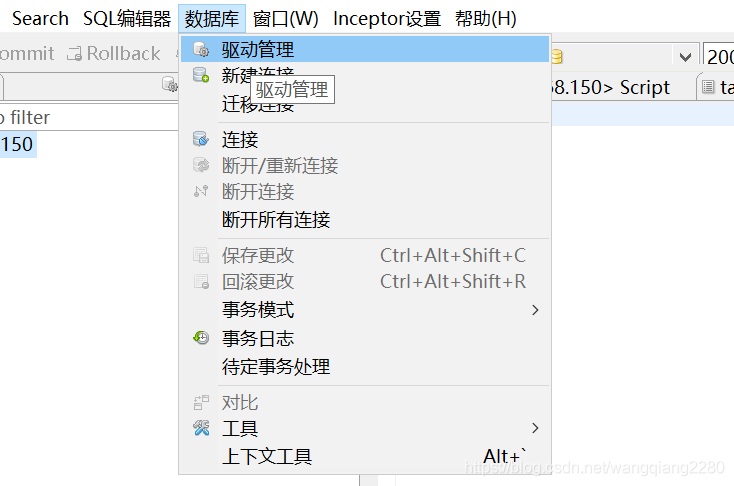
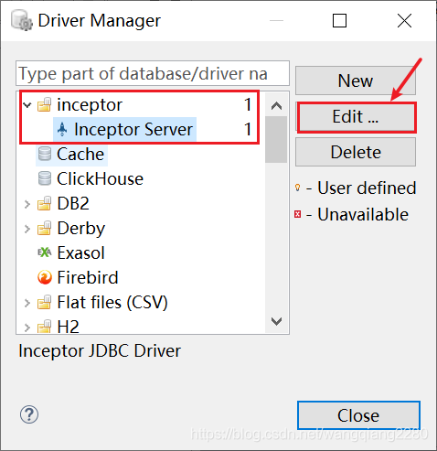
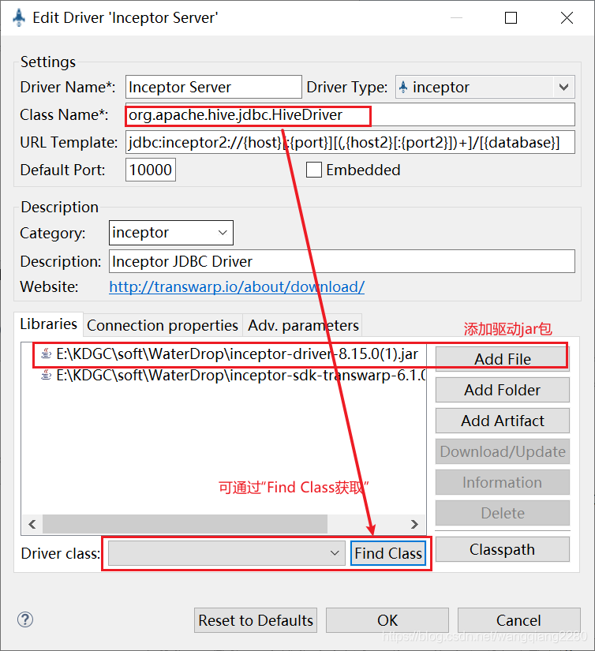
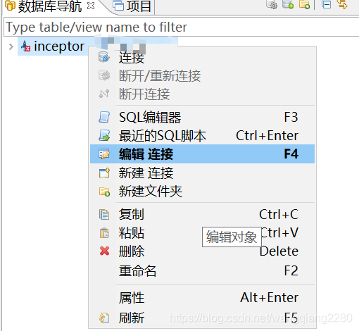
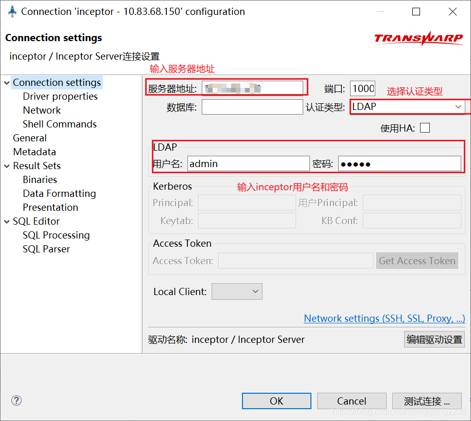
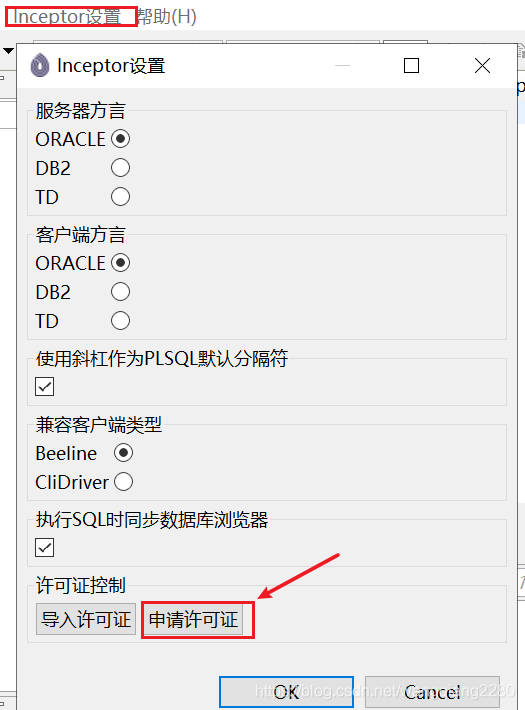
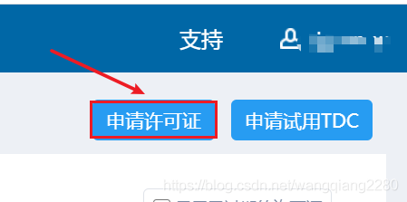
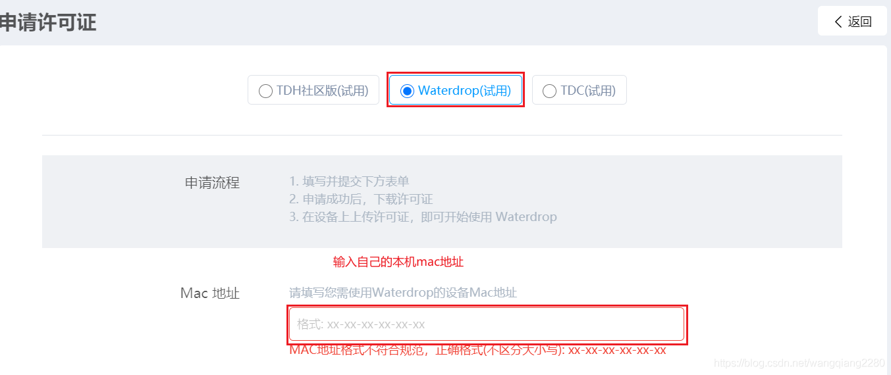
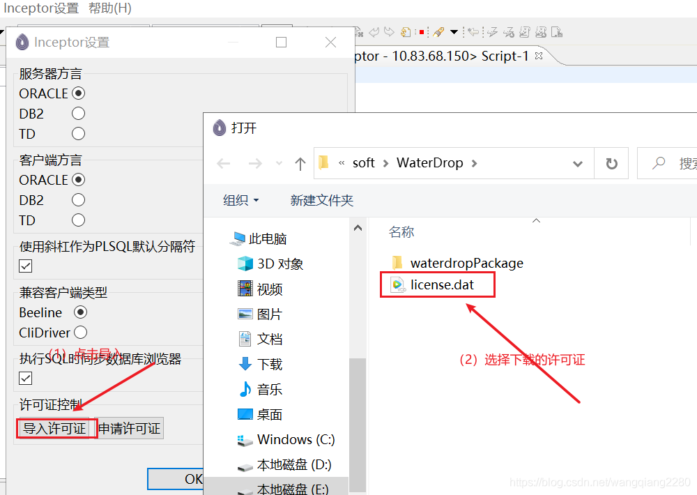

[Toc]

# waterdrop连接inceptor

1.解压waterdrop压缩包后并运行
2.编辑inceptor驱动

3.编辑inceptor连接

4.申请许可证

进入页面点击申请许可证

输入自己的mac地址提交后可以获取试用期为30天的许可证，获得许可证后下载到本地

5.导入许可证

6.连接成功

# 分布式数据仓库Inceptor

https://blog.csdn.net/mxb1234567/article/details/121289511

# 参考资料来源

- https://blog.csdn.net/mxb1234567/article/details/121289511
- https://www.doc88.com/p-29999496132107.html