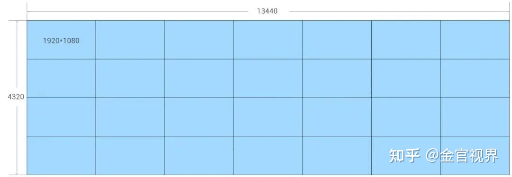
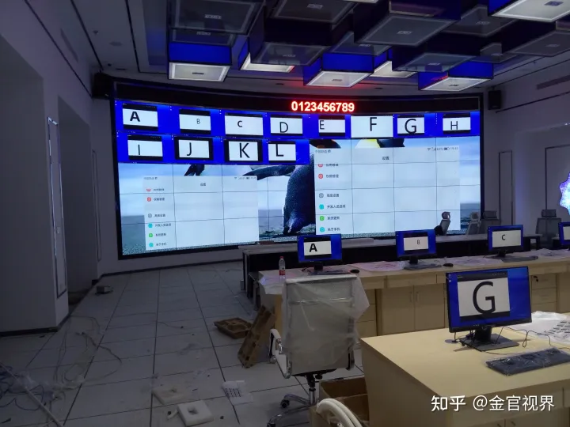

[Toc]

# 网页设计常用尺寸

## PC网页设计尺寸规范

> 现在比较流行的.网页宽度是`950px`，网页两边留出少许白边，简洁又大方。 `1024x768`下，网页宽度保持在`1002`以内，如果满框显示的话，高度是`612-615`之间.就不会出现水平滚动条和垂直滚动条。

### 固定的内容

> 1. PS中设计分辨率为：72像素/英尺（图片质量的像素点）
>
> 2. 颜色模式RGB 8位（显示器的三原色红，绿，蓝为RGB）

### 不固定的内容

1. **网页背景**

> a.纯色背景平铺（自适应浏览器）
>
> b.渐变色或底纹平铺背景（自适应浏览器）
>
> c. 通栏大图：目前网页设计中都会做通栏大图，以方便吸引客户，增加网站整体美观

2. **屏幕分辨率**

> 1. 标准分辨率：1024pxx768px（目前10%-20%的用户在用）
>    主体设计内容宽度：1000px（常用宽度：960px，1170px，980px，1100px，1200px）;
>
>    首屏高度大约在700px
>
> 2. 常用分辨率：1280pxx768px
>    主体设计内容宽度：1200px（常用宽度：1190px，1170px，1100px，1200px）
>    首屏高约：750px

3. **设计文档大小**

> 1. PS中新建文档宽要大于主体设计内容的宽度（目的为了表现设计意图，展示背景效果，左右宽度最少200px）;
> 2. 设计到通栏大图片新建文档的宽度：1920px，所有的设计文档宽1920px主体内容根据具体情况而定（主体内容要是想要适应所有用户必须低于1000px）

# 可视化大屏设计的尺寸规范

> 大屏成像原理几乎都是投屏，也就是把电脑屏幕通过有线信号投放到大屏上，**电脑上呈现什么内容，大屏上就会呈现什么内容**。所以电脑上出现滚条是绝对不可以的。

## 常见大屏分辨率

> 1366 * 768 ： 普通液晶显示器
> 1920 * 1080： 高清液晶显示器
> 2560 * 1440： 2K高清显示器
> 4096 * 2160： 4K高清显示器
> 1280 * 720： 笔记本（1920*1080分辨率下系统默认推荐150%缩放比产生的尺寸）
>

## 大屏和电脑同分辨率设计

> 首先要强调一点，不可以以大屏的分辨率定义设计稿尺寸，当大屏的比例和电脑屏幕的比例一样时，要结合电脑屏幕的分辨率来定设计稿尺寸。
>
> 比如电脑屏幕分辨率为`1920*1080`，那设计稿就可以是这个尺寸，当电脑屏幕是`3840*2160`（4K）屏时，可以用`1920～3840*1080～2160`同等比例任意数值。
>
> 当电脑是4k分辨率时，虽然设计稿用1920*1080的设计尺寸也可以实现，但最终在大屏的呈现画面清晰度不够高。
>
> 原因是开发人员用1920*1080适配了4k分辨率，这本身就是同比放大关系，再加上投放中的画质损失就会更明显，不过基本上也是可以接受的范围内。
>
> 虽然画质影响不大，但优先级上更推荐电脑本身的分辨率3840*2160作为设计稿尺寸，这样1比1的[点对点](https://www.zhihu.com/search?q=点对点&search_source=Entity&hybrid_search_source=Entity&hybrid_search_extra={"sourceType"%3A"answer"%2C"sourceId"%3A2405312203})呈现最能保证画面质量。

## 大屏和电脑不同比例设计

> 说完同比例的[大屏电脑](https://www.zhihu.com/search?q=大屏电脑&search_source=Entity&hybrid_search_source=Entity&hybrid_search_extra={"sourceType"%3A"answer"%2C"sourceId"%3A2405312203})设计，接下来说不同比例的情况，一般的问题都出在了不同比例的设计上。**当大屏和电脑屏幕是不同比例时，一定要保证大屏的展示是正常的，这是必须的。**
>
> 作者：金官视界
> 链接：https://www.zhihu.com/question/275860245/answer/2405312203
> 来源：知乎
> 著作权归作者所有。商业转载请联系作者获得授权，非商业转载请注明出处。
>
> 
>
> ## 案例解析
>
> 一个4*7的拼接大屏，分比率13440*4320，比例为28:9，怎么样去给配置最合适的电脑比例屏幕投屏？
>
> 
>
> 其实能找到28:9的最佳，但据我了解比较困难，我也咨询很多这方面的公司，没有定制显示器比例的服务。
>
> 所以就要找最接近的这个比例的显示器，在某电商平台查了个遍，最常见的有以下比例显示器：
>
> - 16:9（1920*1080）
> - 16:9（3840*2160）
> - 16:10（1920*1200）
> - 21:9（3440*1440）
>
> **另一种方式与我们设计相关，是通过多个信号源控制大屏分屏，一个信号源连接一台电脑，所以在设计时，一台电脑的显示器就是一个设计稿。**
>
> **这种情况通常出现在非常宽的大屏上，太宽的大屏就不太适用于多个电脑屏幕组成投屏，如下图由6个[信号源](https://www.zhihu.com/search?q=信号源&search_source=Entity&hybrid_search_source=Entity&hybrid_search_extra={"sourceType"%3A"answer"%2C"sourceId"%3A2405312203})组成的大屏。**
>
> **总结：每个信号源对应一张设计稿，n个信号源就是n张设计稿 进行点对点设计**
>
> 
>
> 

# 参考资料

1. http://www.oh100.com/kaoshi/web/420329.html
2. https://www.zhihu.com/question/275860245/answer/2405312203?utm_id=0