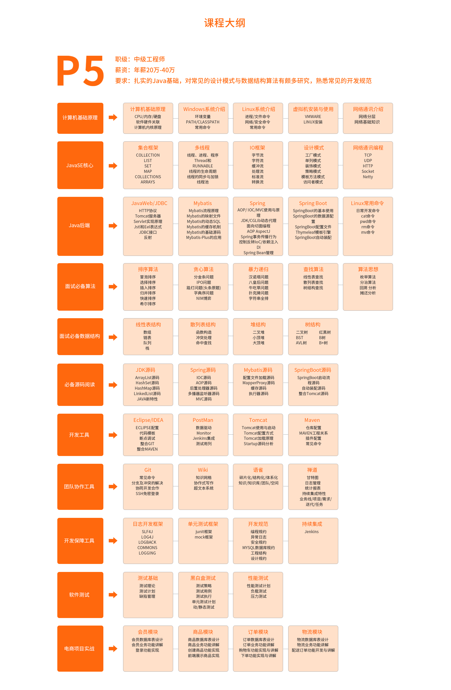

[toc]

# 学习大纲

1. [来源网站](https://www.tulingxueyuan.cn/wp-content/uploads/2021/04/kechengdagang-1.png)

# API文档框架

## Swagger

[Swagger官网](https://swagger.io/)

# 前端知识

## ECMAScript6

1. [ES6文档说明](http://es6.ruanyifeng.com/)

# 前端开发工具

## VS CODE

1. [VS CODE 官网](https://code.visualstudio.com/)
2. [VS_CODE官方说明文档](https://code.visualstudio.com/docs)

# 前端显示插件

## FeHelper

[GitHub下载网址](https://github.com/zxlie/FeHelper)

> 本插件支持**Chrome、Firefox、MS-Edge**浏览器，内部工具集持续增加，目前包括 JSON自动/手动格式化、JSON内容比对、代码美化与压缩、信息编解码转换、二维码生成与解码、图片Base64编解码转换、Markdown、 网页油猴、网页取色器、脑图(Xmind)等贴心工具，甚至在目前新版本的FeHelper中，还集成了**FH开发者工具**

# 数据库

## [MongoDB官网](https://docs.mongodb.com/)

# 搜索引擎

## ES

[中文官网](https://www.elastic.co/cn/elasticsearch/)

[Git Hub开源网址](https://github.com/elastic/elasticsearch)

# 应用排行榜

## 数据库排行榜

1. [db-engines 排行榜](https://db-engines.com/en/ranking)

# JVM调优工具

## Arthas

> [官方文档](https://arthas.aliyun.com/doc/)

# 数据结构

>  [Data Structure Visualizations](https://www.cs.usfca.edu/~galles/visualization/Algorithms.html)

# MyBatisPlus

[MyBatisPlus说明文档](http://mp.baomidou.com/guide/quick-start.html)

# SpringCloud

> 1. [SpringCloud官网](https://spring.io/projects/spring-cloud)
> 2. [Ribbon文档](https://github.com/Netflix/ribbon/wiki/Getting-Started)
> 3. [Hytrix文档](https://github.com/Netflix/Hystrix/wiki/How-To-Use)

# Spring官网

> https://spring.io/

# SpringBoot

> 1. [官方最新参考指南文档](https://docs.spring.io/spring-boot/docs/current/reference/html/)  
> 2. Spring Boot 参考指南可用如下方式：
>    - [HTML](https://docs.spring.io/spring-boot/docs/2.0.2.RELEASE/reference/html/)
>    - [PDF](https://docs.spring.io/spring-boot/docs/2.0.2.RELEASE/reference/pdf/spring-boot-reference.pdf)
>    - [EPUB](https://docs.spring.io/spring-boot/docs/2.0.2.RELEASE/reference/epub/spring-boot-reference.epub)

# 国内镜像源

1. 清华[TUNA](https://mirrors.tuna.tsinghua.edu.cn/)镜像源：https://mirrors.tuna.tsinghua.edu.cn/
   https://pypi.tuna.tsinghua.edu.cn/simple

2. 中科大[USTC](https://mirrors.ustc.edu.cn/)镜像源：  https://mirrors.ustc.edu.cn/  
   https://pypi.mirrors.ustc.edu.cn/simple/

3. 网易163： http://mirrors.163.com/

4. [阿里](https://opsx.alibaba.com/mirror  )： https://opsx.alibaba.com/mirror 
   http://mirrors.aliyun.com/pypi/simple/
5. 华为：https://mirrors.huaweicloud.com/
6. 腾讯：https://mirrors.cloud.tencent.com/
7. 北京交通大学：https://mirror.bjtu.edu.cn/
8. 北京理工大学：http://mirror.bit.edu.cn/web/
9. 华中科技大学：http://mirrors.hust.edu.cn/
10. 兰州大学：http://mirror.lzu.edu.cn/
11. 谷歌学术镜像：https://ac.scmor.com/

# Git

1. [git 官方文档](https://git-scm.com/book/en/v2)

# 工作流框架

1. [Activit](https://www.activiti.org)

# CSS

1. [CSS帮助文档](http://www.w3.org/TR/CSS21/colors.html#propdef-background-position)

   

# 网站IP查询

1. [ipaddress](https://www.ipaddress.com/ip-lookup)

# 几何画图工具

1. [Geogebra](https://www.geogebra.org/)
2. [AxGlyph ](https://www.amyxun.com/)
3. [desmos](https://www.desmos.com/?lang=zh-CN)
4. [netpad](https://www.netpad.net.cn/)

# 表格数据格式转换

1. [tableconvert](https://tableconvert.com/):在线转换工具，可将excel表格数据指定文本格式。如将excel数据转换为markdown格式

# 高校学习网站

1. [中国大学慕课](http://www.icourse163.org )
2. [学堂在线](http://www.xuetangx.com/ )
3. [MOOC](https://www.icourse163.org/)

# 留学

1. [启德考培在线]( http://qide.edusoho.cn/)

# 职业考试

1. [中公教育](http://www.offcn.com/)

# 职业技能

1. [51cto]( http://edu.51cto.com/)

# 参考来源

1. https://zhuanlan.zhihu.com/p/113554606
2. https://tableconvert.com/

